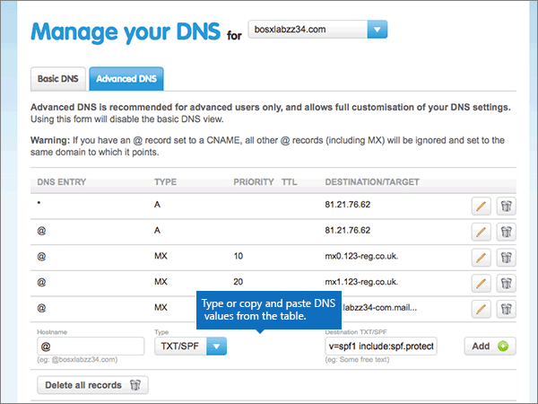

# Erstellen von DNS-Einträgen 123-reg.co.uk MicrosoftCreate DNS records at 123-reg.co.uk for Microsoft

 **[Überprüfen Sie die häufig gestellten Fragen (FAQ) zu Domänen](../setup/domains-faq.yml)**, wenn Sie nicht finden, wonach Sie suchen.**[Check the Domains FAQ](../setup/domains-faq.yml)** if you don't find what you're looking for. 
  
Wenn 123-reg.co.uk Ihr DNS-Hostinganbieter ist, führen Sie die in diesem Artikel aufgeführten Schritte aus, um Ihre Domäne zu überprüfen und DNS-Einträge für E-Mail, Skype for Business Online und andere Dienste einzurichten.If 123-reg.co.uk is your DNS hosting provider, follow the steps in this article to verify your domain and set up DNS records for email, Skype for Business Online, and so on.
  
Nachdem Sie diese Datensätze unter 123-reg.co.uk hinzugefügt haben, wird Ihre Domäne für die Arbeit mit Microsoft-Diensten eingerichtet.After you add these records at 123-reg.co.uk, your domain will be set up to work with Microsoft services.
  
  
> [!NOTE]
> Normalerweise dauert es ungefähr 15 Minuten, bis DNS-Änderungen wirksam werden. Es kann jedoch gelegentlich länger dauern, bis eine von Ihnen vorgenommene Änderung im Internet im DNS-System aktualisiert wurde. Wenn nach dem Hinzufügen von DNS-Einträgen Probleme mit dem E-Mail-Fluss oder andere Probleme auftreten, lesen Sie [Suchen und Beheben von Problemen, nachdem Ihre Domäne oder DNS-Einträge hinzugefügt wurden](../get-help-with-domains/find-and-fix-issues.md).Typically it takes about 15 minutes for DNS changes to take effect. However, it can occasionally take longer for a change you've made to update across the Internet's DNS system. If you're having trouble with mail flow or other issues after adding DNS records, see [Find and fix issues after adding your domain or DNS records](../get-help-with-domains/find-and-fix-issues.md). 
  
## Hinzufügen eines TXT-Eintrags zur ÜberprüfungAdd a TXT record for verification

Bevor Sie Ihre Domäne mit Microsoft verwenden können, müssen wir uns vergewissern, dass Sie deren Besitzer sind. Ihre Fähigkeit, sich bei Ihrem Konto bei Ihrer Domänenregistrierungsstelle anzumelden und den DNS-Eintrag zu erstellen, ist für Microsoft der Nachweis, dass Sie der Besitzer der Domäne sind.Before you use your domain with Microsoft, we have to make sure that you own it. Your ability to log in to your account at your domain registrar and create the DNS record proves to Microsoft that you own the domain.
  
> [!NOTE]
> Dieser Eintrag wird nur verwendet, um zu überprüfen, ob Sie der Besitzer Ihrer Domäne sind. Er hat keine weiteren Auswirkungen. Sie können ihn später ggf. löschen.This record is used only to verify that you own your domain; it doesn't affect anything else. You can delete it later, if you like. 
  
1. Navigieren Sie im ersten Schritt über [diesen Link](https://www.123-reg.co.uk/secure/cpanel/domain/overview) zu Ihrer Domänenseite bei 123-reg.co.uk. Sie werden aufgefordert, sich zuerst anzumelden.To get started, go to your domains page at 123-reg.co.uk by using [this link](https://www.123-reg.co.uk/secure/cpanel/domain/overview). You'll be prompted to log in first.
    
2. On the **Domain name overview** page, select the name of the domain that you want to edit.On the **Domain name overview** page, select the name of the domain that you want to edit. 
    
3. Choose **DNS** from the **Select action** drop-down list.Choose **DNS** from the **Select action** drop-down list. 
    
4. Wählen Sie **auf der Seite Verwalten** Ihres DNS die Registerkarte **Erweitertes DNS** aus.On the **Manage your DNS** page, select the **Advanced DNS** tab. 
    
5. In the **Advanced DNS** section, in the boxes for the new record, type or copy and paste the values from the following table.In the **Advanced DNS** section, in the boxes for the new record, type or copy and paste the values from the following table. 
    
    (Choose the **Type** value from the drop-down list.)(Choose the **Type** value from the drop-down list.) 
    
    ||||
    |:-----|:-----|:-----|
    |**Hostname****Hostname**   |**Type****Type**   |**Destination TXT/SPF****Destination TXT/SPF**   |
    |@    |TXT/SPFTXT/SPF    |MS=ms *XXXXXXXX*MS=ms *XXXXXXXX*    **Hinweis:** Dies ist ein Beispiel. Verwenden Sie hier Ihren spezifischen Wert für **Ziel- oder Verweisadresse** aus der Tabelle in [Wie finde ich diese Angabe?](../get-help-with-domains/information-for-dns-records.md).**Note:** This is an example. Use your specific **Destination or Points to Address** value here, from the table. [How do I find this?](../get-help-with-domains/information-for-dns-records.md)          |
   
6. Klicken Sie auf **Hinzufügen**.Select **Add**.
    
7. Warten Sie einige Minuten, bevor Sie fortfahren, damit der soeben erstellte Eintrag im Internet aktualisiert werden kann.Wait a few minutes before you continue, so that the record you just created can update across the Internet.
    
Nachdem Sie den Eintrag nun an der Website Ihrer Domänenregistrierungsstelle hinzugefügt haben, wechseln Sie zurück zu Microsoft und fordern eine Suche nach dem Datensatz an.Now that you've added the record at your domain registrar's site, you'll go back to Microsoft and request a search for the record.
  
Wenn Microsoft den richtigen TXT-Eintrag findet, ist die Domäne überprüft.When Microsoft finds the correct TXT record, your domain is verified.
  
1. Wechseln Sie im Microsoft Admin Center zur Seite **Einstellungen** \> <a href="https://go.microsoft.com/fwlink/p/?linkid=834818" target="_blank">Domänen</a>.In the Microsoft admin center, go to the **Settings** \> <a href="https://go.microsoft.com/fwlink/p/?linkid=834818" target="_blank">Domains</a> page.

    
2. Wählen Sie auf der Seite **Domänen** die zu überprüfende Domäne aus.On the **Domains** page, select the domain that you are verifying. 
    
3. Wählen Sie auf der Seite **Setup** die Option **Setup starten** aus.On the **Setup** page, select **Start setup**.
    
4. Wählen Sie auf der Seite **Domäne überprüfen** die Option **Überprüfen** aus.On the **Verify domain** page, select **Verify**.
    
> [!NOTE]
> Normalerweise dauert es ungefähr 15 Minuten, bis DNS-Änderungen wirksam werden. Es kann jedoch gelegentlich länger dauern, bis eine von Ihnen vorgenommene Änderung im Internet im DNS-System aktualisiert wurde. Wenn nach dem Hinzufügen von DNS-Einträgen Probleme mit dem E-Mail-Fluss oder andere Probleme auftreten, lesen Sie [Suchen und Beheben von Problemen, nachdem Ihre Domäne oder DNS-Einträge hinzugefügt wurden](../get-help-with-domains/find-and-fix-issues.md).Typically it takes about 15 minutes for DNS changes to take effect. However, it can occasionally take longer for a change you've made to update across the Internet's DNS system. If you're having trouble with mail flow or other issues after adding DNS records, see [Find and fix issues after adding your domain or DNS records](../get-help-with-domains/find-and-fix-issues.md). 
  
## Fügen Sie einen MX-Eintrag hinzu, damit E-Mails für Ihre Domäne an Microsoft geleitet werden.Add an MX record so email for your domain will come to Microsoft

1. Navigieren Sie im ersten Schritt über [diesen Link](https://www.123-reg.co.uk/secure/cpanel/domain/overview) zu Ihrer Domänenseite bei 123-reg.co.uk. Sie werden aufgefordert, sich zuerst anzumelden.To get started, go to your domains page at 123-reg.co.uk by using [this link](https://www.123-reg.co.uk/secure/cpanel/domain/overview). You'll be prompted to log in first.
    
2. On the **Domain name overview** page, select the name of the domain that you want to edit.On the **Domain name overview** page, select the name of the domain that you want to edit. 
    
3. Choose **DNS** from the **Select action** drop-down list.Choose **DNS** from the **Select action** drop-down list. 
    
4. Wählen Sie **auf der Seite Verwalten** Ihres DNS die Registerkarte **Erweitertes DNS** aus.On the **Manage your DNS** page, select the **Advanced DNS** tab. 
    
5. In the **Advanced DNS** section, in the boxes for the new record, type or copy and paste the values from the following table.In the **Advanced DNS** section, in the boxes for the new record, type or copy and paste the values from the following table. 
    
    (Choose the **Type** value from the drop-down list.)(Choose the **Type** value from the drop-down list.) 
    
    |**Hostname****Hostname**|**Type****Type**|**Priority****Priority**|**Destination MX****Destination MX**|
    |:-----|:-----|:-----|:-----|
    |@    |MXMX    |11    Weitere Informationen zur Priorität finden Sie unter [Was ist MX-Priorität?](https://docs.microsoft.com/microsoft-365/admin/setup/domains-faq)For more information about priority, see [What is MX priority?](https://docs.microsoft.com/microsoft-365/admin/setup/domains-faq)   | *\<domain-key\>*  .mail.protection.outlook.com.*\<domain-key\>*  .mail.protection.outlook.com.    **Dieser Wert MUSS mit einem Punkt (.) enden.****This value MUST end with a period (.)**   **Hinweis:** Erhalten Sie Ihren \<domain-key\> über Ihr Microsoft-Konto.**Note:** Get your \<domain-key\> from your Microsoft account. [Wie finde ich diese Angabe?How do I find this?](../get-help-with-domains/information-for-dns-records.md)          |
   
    
  
6. Klicken Sie auf **Hinzufügen**.Select **Add**.
    
    
  
7. If there are any other MX records, remove each one by choosing the **Delete (trash can)** icon for that record.If there are any other MX records, remove each one by choosing the **Delete (trash can)** icon for that record. 
    
    
  
## Hinzufügen der fünf für Microsoft erforderlichen CNAME-EinträgeAdd the five CNAME records that are required for Microsoft

1. Navigieren Sie im ersten Schritt über [diesen Link](https://www.123-reg.co.uk/secure/cpanel/domain/overview) zu Ihrer Domänenseite bei 123-reg.co.uk. Sie werden aufgefordert, sich zuerst anzumelden.To get started, go to your domains page at 123-reg.co.uk by using [this link](https://www.123-reg.co.uk/secure/cpanel/domain/overview). You'll be prompted to log in first.
    
2. On the **Domain name overview** page, select the name of the domain that you want to edit.On the **Domain name overview** page, select the name of the domain that you want to edit. 
    
3. Choose **DNS** from the **Select action** drop-down list.Choose **DNS** from the **Select action** drop-down list. 
    
4. Wählen Sie **auf der Seite Verwalten** Ihres DNS die Registerkarte **Erweitertes DNS** aus.On the **Manage your DNS** page, select the **Advanced DNS** tab. 
    
5. Fügen Sie den ersten der fünf CNAME-Einträge hinzu.Add the first of the five CNAME records.
    
    In the **Advanced DNS** section, in the boxes for the new record, type or copy and paste the values from the following table.In the **Advanced DNS** section, in the boxes for the new record, type or copy and paste the values from the following table. 
    
    (Choose the **Type** value from the drop-down list.)(Choose the **Type** value from the drop-down list.) 
    
    |**Hostname****Hostname**|**Type****Type**|**Destination CNAME****Destination CNAME**|
    |:-----|:-----|:-----|
    |autodiscoverautodiscover    |CNAMECNAME    |autodiscover.outlook.com.autodiscover.outlook.com.    **Dieser Wert MUSS mit einem Punkt (.) enden.****This value MUST end with a period (.)**   |
    |sipsip    |CNAMECNAME    |sipdir.online.lync.com.sipdir.online.lync.com.    **Dieser Wert MUSS mit einem Punkt (.) enden.****This value MUST end with a period (.)**   |
    |lyncdiscoverlyncdiscover    |CNAMECNAME    |webdir.online.lync.com.webdir.online.lync.com.    **Dieser Wert MUSS mit einem Punkt (.) enden.****This value MUST end with a period (.)**   |
    |enterpriseregistrationenterpriseregistration    |CNAMECNAME    |enterpriseregistration.windows.net.enterpriseregistration.windows.net.    **Dieser Wert MUSS mit einem Punkt (.) enden.****This value MUST end with a period (.)**   |
    |enterpriseenrollmententerpriseenrollment    |CNAMECNAME    |enterpriseenrollment-s.manage.microsoft.com.enterpriseenrollment-s.manage.microsoft.com.    **Dieser Wert MUSS mit einem Punkt (.) enden.****This value MUST end with a period (.)**   |
   
    
  
6. Klicken Sie auf **Hinzufügen**.Select **Add**.
    
    
  
7. Fügen Sie die anderen vier CNAME-Einträge hinzu.Add the other four CNAME records.
    
    Erstellen Sie **im Abschnitt Advanced DNS** einen Eintrag mit den Werten aus der nächsten Zeile in der Tabelle, und wählen Sie dann erneut **Hinzufügen** aus, um diesen Eintrag zu vervollständigen.In the **Advanced DNS** section, create a record using the values from the next row in the table, and then again select **Add** to complete that record. 
    
    Wiederholen Sie diesen Vorgang, bis Sie alle fünf CNAME-Einträge erstellt haben.Repeat this process until you have created all five CNAME records.
    
## Hinzufügen eines TXT-Eintrags für SPF, um E-Mail-Spam zu verhindernAdd a TXT record for SPF to help prevent email spam

> [!IMPORTANT]
> Es kann bei einer Domäne nur einen TXT-Eintrag für SPF geben.You cannot have more than one TXT record for SPF for a domain. Wenn es bei Ihrer Domäne mehrere SPF-Einträge gibt, treten E-Mail-Fehler sowie Probleme bei der Übermittlung und Spamklassifizierung auf.If your domain has more than one SPF record, you'll get email errors, as well as delivery and spam classification issues. Wenn Sie bereits über einen SPF-Eintrag für Ihre Domäne verfügen, erstellen Sie keinen neuen für Microsfot.If you already have an SPF record for your domain, don't create a new one for Microsfot. Fügen Sie stattdessen dem aktuellen Datensatz die erforderlichen  Microsoft-Werte hinzu, sodass Sie über einen einzelnen SPF-Datensatz verfügen, der beide Wertesätze enthält.Instead, add the required Microsoft values to the current record so that you have a  *single*  SPF record that includes both sets of values. Benötigen Sie Beispiele?Need examples? Lesen Sie die Informationen unter [Externe DNS-Einträge für Microsoft](https://docs.microsoft.com/microsoft-365/enterprise/external-domain-name-system-records#external-dns-records-required-for-spf).Check out these [External Domain Name System records for Microsoft](https://docs.microsoft.com/microsoft-365/enterprise/external-domain-name-system-records#external-dns-records-required-for-spf). Zum Überprüfen Ihres SPF-Eintrags können Sie eines dieser [SPF-Überprüfungstools](../setup/domains-faq.yml) verwenden.To validate your SPF record, you can use one of these [SPF validation tools](../setup/domains-faq.yml). 
  
1. Navigieren Sie im ersten Schritt über [diesen Link](https://www.123-reg.co.uk/secure/cpanel/domain/overview) zu Ihrer Domänenseite bei 123-reg.co.uk.To get started, go to your domains page at 123-reg.co.uk by using [this link](https://www.123-reg.co.uk/secure/cpanel/domain/overview). Sie werden aufgefordert, sich zuerst anzumelden.You'll be prompted to log in first.
    
2. On the **Domain name overview** page, select the name of the domain that you want to edit.On the **Domain name overview** page, select the name of the domain that you want to edit. 
    
3. Choose **DNS** from the **Select action** drop-down list.Choose **DNS** from the **Select action** drop-down list. 
    
4. Wählen Sie **auf der Seite Verwalten** Ihres DNS die Registerkarte **Erweitertes DNS** aus.On the **Manage your DNS** page, select the **Advanced DNS** tab. 
    
5. In the **Advanced DNS** section, in the boxes for the new record, type or copy and paste the values from the following table.In the **Advanced DNS** section, in the boxes for the new record, type or copy and paste the values from the following table. 
    
    (Choose the **Type** value from the drop-down list.)(Choose the **Type** value from the drop-down list.) 
    
    |**Hostname****Hostname**|**Type****Type**|**Destination TXT/SPF****Destination TXT/SPF**|
    |:-----|:-----|:-----|
    |@    |TXT/SPFTXT/SPF    |v=spf1 include:spf.protection.outlook.com -allv=spf1 include:spf.protection.outlook.com -all    **Hinweis:** Es wird empfohlen, diesen Eintrag zu kopieren und einzufügen, damit alle Abstände korrekt übernommen werden.**Note:** We recommend copying and pasting this entry, so that all of the spacing stays correct.           |
   
    
  
6. Klicken Sie auf **Hinzufügen**.Select **Add**.
    
    
  
## Hinzufügen der für Microsoft erforderlichen zwei SRV-EinträgeAdd the two SRV records that are required for Microsoft

1. Navigieren Sie im ersten Schritt über [diesen Link](https://www.123-reg.co.uk/secure/cpanel/domain/overview) zu Ihrer Domänenseite bei 123-reg.co.uk. Sie werden aufgefordert, sich zuerst anzumelden.To get started, go to your domains page at 123-reg.co.uk by using [this link](https://www.123-reg.co.uk/secure/cpanel/domain/overview). You'll be prompted to log in first.
    
2. On the **Domain name overview** page, select the name of the domain that you want to edit.On the **Domain name overview** page, select the name of the domain that you want to edit. 
    
3. Choose **DNS** from the **Select action** drop-down list.Choose **DNS** from the **Select action** drop-down list. 
    
4. Wählen Sie **auf der Seite Verwalten** Ihres DNS die Registerkarte **Erweitertes DNS** aus.On the **Manage your DNS** page, select the **Advanced DNS** tab. 
    
5. Fügen Sie den ersten der zwei SRV-Einträge hinzu:Add the first of the two SRV records:
    
    In the **Advanced DNS** section, in the boxes for the new record, type or copy and paste the values from the following table.In the **Advanced DNS** section, in the boxes for the new record, type or copy and paste the values from the following table. 
    
    (Choose the **Type** value from the drop-down list.)(Choose the **Type** value from the drop-down list.) 
    
    ||||||
    |:-----|:-----|:-----|:-----|:-----|
    |HostnameHostname|TypeType|PriorityPriority|TTLTTL|Destination SRVDestination SRV|
    |_sip._tls_sip._tls|SRVSRV|100100|36003600|1 443 sipdir.online.lync.com.1 443 sipdir.online.lync.com. **Dieser Wert MUSS mit einem Punkt (.) enden.****This value MUST end with a period (.)**  **Hinweis:** Es wird empfohlen, diesen Eintrag zu kopieren und einzufügen, damit alle Abstände korrekt übernommen werden.**Note:** We recommend copying and pasting this entry, so that all of the spacing stays correct.           |
    |_sipfederationtls._tcp_sipfederationtls._tcp|SRVSRV|100100|36003600|1 5061 sipfed.online.lync.com.1 5061 sipfed.online.lync.com. **Dieser Wert MUSS mit einem Punkt (.) enden.****This value MUST end with a period (.)**   **Hinweis:** Es wird empfohlen, diesen Eintrag zu kopieren und einzufügen, damit alle Abstände korrekt übernommen werden.**Note:** We recommend copying and pasting this entry, so that all of the spacing stays correct.           |
   
    
  
6. Klicken Sie auf **Hinzufügen**.Select **Add**.
    
    
  
7. Fügen Sie den anderen SRV-Eintrag hinzu:To add the other SRV record:
    
    Erstellen Sie **im Abschnitt Advanced DNS** einen Datensatz mithilfe der Werte aus der zweiten Zeile in der Tabelle, und wählen Sie dann erneut **Hinzufügen** aus, um diesen Eintrag zu vervollständigen.In the **Advanced DNS** section, create a record by using the values from the second row in the table, and then again select **Add** to complete that record. 
    
> [!NOTE]
> Normalerweise dauert es ungefähr 15 Minuten, bis DNS-Änderungen wirksam werden. Es kann jedoch gelegentlich länger dauern, bis eine von Ihnen vorgenommene Änderung im Internet im DNS-System aktualisiert wurde. Wenn nach dem Hinzufügen von DNS-Einträgen Probleme mit dem E-Mail-Fluss oder andere Probleme auftreten, lesen Sie [Suchen und Beheben von Problemen, nachdem Ihre Domäne oder DNS-Einträge hinzugefügt wurden](../get-help-with-domains/find-and-fix-issues.md).Typically it takes about 15 minutes for DNS changes to take effect. However, it can occasionally take longer for a change you've made to update across the Internet's DNS system. If you're having trouble with mail flow or other issues after adding DNS records, see [Find and fix issues after adding your domain or DNS records](../get-help-with-domains/find-and-fix-issues.md). 
  
