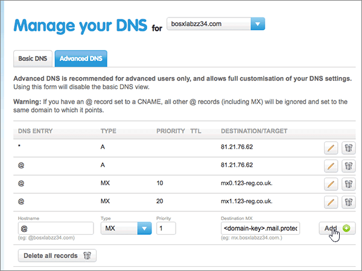

# Erstellen von DNS-Einträgen 123-reg.co.uk Microsoft

 **[Überprüfen Sie die häufig gestellten Fragen (FAQ) zu Domänen](../setup/domains-faq.yml)**, wenn Sie nicht finden, wonach Sie suchen. 
  
Wenn 123-reg.co.uk Ihr DNS-Hostinganbieter ist, führen Sie die in diesem Artikel aufgeführten Schritte aus, um Ihre Domäne zu überprüfen und DNS-Einträge für E-Mail, Skype for Business Online und andere Dienste einzurichten.
  
Nachdem Sie diese Datensätze unter 123-reg.co.uk hinzugefügt haben, wird Ihre Domäne für die Arbeit mit Microsoft-Diensten eingerichtet.
  
  
> [!NOTE]
> Normalerweise dauert es ungefähr 15 Minuten, bis DNS-Änderungen wirksam werden. Es kann jedoch gelegentlich länger dauern, bis eine von Ihnen vorgenommene Änderung im Internet im DNS-System aktualisiert wurde. Wenn nach dem Hinzufügen von DNS-Einträgen Probleme mit dem E-Mail-Fluss oder andere Probleme auftreten, lesen Sie [Suchen und Beheben von Problemen, nachdem Ihre Domäne oder DNS-Einträge hinzugefügt wurden](../get-help-with-domains/find-and-fix-issues.md). 
  
## Hinzufügen eines TXT-Eintrags zur Überprüfung

Bevor Sie Ihre Domäne mit Microsoft verwenden können, müssen wir uns vergewissern, dass Sie deren Besitzer sind. Ihre Fähigkeit, sich bei Ihrem Konto bei Ihrer Domänenregistrierungsstelle anzumelden und den DNS-Eintrag zu erstellen, ist für Microsoft der Nachweis, dass Sie der Besitzer der Domäne sind.
  
> [!NOTE]
> Dieser Eintrag wird nur verwendet, um zu überprüfen, ob Sie der Besitzer Ihrer Domäne sind. Er hat keine weiteren Auswirkungen. Sie können ihn später ggf. löschen. 
  
1. Navigieren Sie im ersten Schritt über [diesen Link](https://www.123-reg.co.uk/secure/cpanel/domain/overview) zu Ihrer Domänenseite bei 123-reg.co.uk. Sie werden aufgefordert, sich zuerst anzumelden.
    
2. On the **Domain name overview** page, select the name of the domain that you want to edit. 
    
3. Choose **DNS** from the **Select action** drop-down list. 
    
4. Wählen Sie **auf der Seite Verwalten** Ihres DNS die Registerkarte **Erweitertes DNS** aus. 
    
5. In the **Advanced DNS** section, in the boxes for the new record, type or copy and paste the values from the following table. 
    
    (Choose the **Type** value from the drop-down list.) 
    
    ||||
    |:-----|:-----|:-----|
    |**Hostname**   |**Type**   |**Destination TXT/SPF**   |
    |@    |TXT/SPF    |MS=ms *XXXXXXXX*    **Hinweis:** Dies ist ein Beispiel. Verwenden Sie hier Ihren spezifischen Wert für **Ziel- oder Verweisadresse** aus der Tabelle in [Wie finde ich diese Angabe?](../get-help-with-domains/information-for-dns-records.md).          |
   
6. Klicken Sie auf **Hinzufügen**.
    
7. Warten Sie einige Minuten, bevor Sie fortfahren, damit der soeben erstellte Eintrag im Internet aktualisiert werden kann.
    
Nachdem Sie den Eintrag nun an der Website Ihrer Domänenregistrierungsstelle hinzugefügt haben, wechseln Sie zurück zu Microsoft und fordern eine Suche nach dem Datensatz an.
  
Wenn Microsoft den richtigen TXT-Eintrag findet, ist die Domäne überprüft.
  
1. Wechseln Sie im Microsoft Admin Center zur Seite **Einstellungen** \> <a href="https://go.microsoft.com/fwlink/p/?linkid=834818" target="_blank">Domänen</a>.

    
2. Wählen Sie auf der Seite **Domänen** die zu überprüfende Domäne aus. 
    
3. Wählen Sie auf der Seite **Setup** die Option **Setup starten** aus.
    
4. Wählen Sie auf der Seite **Domäne überprüfen** die Option **Überprüfen** aus.
    
> [!NOTE]
> Normalerweise dauert es ungefähr 15 Minuten, bis DNS-Änderungen wirksam werden. Es kann jedoch gelegentlich länger dauern, bis eine von Ihnen vorgenommene Änderung im Internet im DNS-System aktualisiert wurde. Wenn nach dem Hinzufügen von DNS-Einträgen Probleme mit dem E-Mail-Fluss oder andere Probleme auftreten, lesen Sie [Suchen und Beheben von Problemen, nachdem Ihre Domäne oder DNS-Einträge hinzugefügt wurden](../get-help-with-domains/find-and-fix-issues.md). 
  
## Fügen Sie einen MX-Eintrag hinzu, damit E-Mails für Ihre Domäne an Microsoft geleitet werden.

1. Navigieren Sie im ersten Schritt über [diesen Link](https://www.123-reg.co.uk/secure/cpanel/domain/overview) zu Ihrer Domänenseite bei 123-reg.co.uk. Sie werden aufgefordert, sich zuerst anzumelden.
    
2. On the **Domain name overview** page, select the name of the domain that you want to edit. 
    
3. Choose **DNS** from the **Select action** drop-down list. 
    
4. Wählen Sie **auf der Seite Verwalten** Ihres DNS die Registerkarte **Erweitertes DNS** aus. 
    
5. In the **Advanced DNS** section, in the boxes for the new record, type or copy and paste the values from the following table. 
    
    (Choose the **Type** value from the drop-down list.) 
    
    |**Hostname**|**Type**|**Priority**|**Destination MX**|
    |:-----|:-----|:-----|:-----|
    |@    |MX    |1    Weitere Informationen zur Priorität finden Sie unter [Was ist MX-Priorität?](https://docs.microsoft.com/microsoft-365/admin/setup/domains-faq)   | *\<domain-key\>*  .mail.protection.outlook.com.    **Dieser Wert MUSS mit einem Punkt (.) enden.**   **Hinweis:** Erhalten Sie Ihren \<domain-key\> über Ihr Microsoft-Konto. [Wie finde ich diese Angabe?](../get-help-with-domains/information-for-dns-records.md)          |
   
    
  
6. Klicken Sie auf **Hinzufügen**.
    
    
  
7. If there are any other MX records, remove each one by choosing the **Delete (trash can)** icon for that record. 
    
    
  
## Hinzufügen der fünf für Microsoft erforderlichen CNAME-Einträge

1. Navigieren Sie im ersten Schritt über [diesen Link](https://www.123-reg.co.uk/secure/cpanel/domain/overview) zu Ihrer Domänenseite bei 123-reg.co.uk. Sie werden aufgefordert, sich zuerst anzumelden.
    
2. On the **Domain name overview** page, select the name of the domain that you want to edit. 
    
3. Choose **DNS** from the **Select action** drop-down list. 
    
4. Wählen Sie **auf der Seite Verwalten** Ihres DNS die Registerkarte **Erweitertes DNS** aus. 
    
5. Fügen Sie den ersten der fünf CNAME-Einträge hinzu.
    
    In the **Advanced DNS** section, in the boxes for the new record, type or copy and paste the values from the following table. 
    
    (Choose the **Type** value from the drop-down list.) 
    
    |**Hostname**|**Type**|**Destination CNAME**|
    |:-----|:-----|:-----|
    |autodiscover    |CNAME    |autodiscover.outlook.com.    **Dieser Wert MUSS mit einem Punkt (.) enden.**   |
    |sip    |CNAME    |sipdir.online.lync.com.    **Dieser Wert MUSS mit einem Punkt (.) enden.**   |
    |lyncdiscover    |CNAME    |webdir.online.lync.com.    **Dieser Wert MUSS mit einem Punkt (.) enden.**   |
    |enterpriseregistration    |CNAME    |enterpriseregistration.windows.net.    **Dieser Wert MUSS mit einem Punkt (.) enden.**   |
    |enterpriseenrollment    |CNAME    |enterpriseenrollment-s.manage.microsoft.com.    **Dieser Wert MUSS mit einem Punkt (.) enden.**   |
   
    
  
6. Klicken Sie auf **Hinzufügen**.
    
    
  
7. Fügen Sie die anderen vier CNAME-Einträge hinzu.
    
    Erstellen Sie **im Abschnitt Advanced DNS** einen Eintrag mit den Werten aus der nächsten Zeile in der Tabelle, und wählen Sie dann erneut **Hinzufügen** aus, um diesen Eintrag zu vervollständigen. 
    
    Wiederholen Sie diesen Vorgang, bis Sie alle fünf CNAME-Einträge erstellt haben.
    
## Hinzufügen eines TXT-Eintrags für SPF, um E-Mail-Spam zu verhindern

> [!IMPORTANT]
> Es kann bei einer Domäne nur einen TXT-Eintrag für SPF geben. Wenn es bei Ihrer Domäne mehrere SPF-Einträge gibt, treten E-Mail-Fehler sowie Probleme bei der Übermittlung und Spamklassifizierung auf. Wenn Sie bereits über einen SPF-Eintrag für Ihre Domäne verfügen, erstellen Sie keinen neuen für Microsfot. Fügen Sie stattdessen dem aktuellen Datensatz die erforderlichen  Microsoft-Werte hinzu, sodass Sie über einen einzelnen SPF-Datensatz verfügen, der beide Wertesätze enthält. Benötigen Sie Beispiele? Lesen Sie die Informationen unter [Externe DNS-Einträge für Microsoft](https://docs.microsoft.com/microsoft-365/enterprise/external-domain-name-system-records#external-dns-records-required-for-spf). Zum Überprüfen Ihres SPF-Eintrags können Sie eines dieser [SPF-Überprüfungstools](../setup/domains-faq.yml) verwenden. 
  
1. Navigieren Sie im ersten Schritt über [diesen Link](https://www.123-reg.co.uk/secure/cpanel/domain/overview) zu Ihrer Domänenseite bei 123-reg.co.uk. Sie werden aufgefordert, sich zuerst anzumelden.
    
2. On the **Domain name overview** page, select the name of the domain that you want to edit. 
    
3. Choose **DNS** from the **Select action** drop-down list. 
    
4. Wählen Sie **auf der Seite Verwalten** Ihres DNS die Registerkarte **Erweitertes DNS** aus. 
    
5. In the **Advanced DNS** section, in the boxes for the new record, type or copy and paste the values from the following table. 
    
    (Choose the **Type** value from the drop-down list.) 
    
    |**Hostname**|**Type**|**Destination TXT/SPF**|
    |:-----|:-----|:-----|
    |@    |TXT/SPF    |v=spf1 include:spf.protection.outlook.com -all    **Hinweis:** Es wird empfohlen, diesen Eintrag zu kopieren und einzufügen, damit alle Abstände korrekt übernommen werden.           |
   
    
  
6. Klicken Sie auf **Hinzufügen**.
    
    
  
## Hinzufügen der für Microsoft erforderlichen zwei SRV-Einträge

1. Navigieren Sie im ersten Schritt über [diesen Link](https://www.123-reg.co.uk/secure/cpanel/domain/overview) zu Ihrer Domänenseite bei 123-reg.co.uk. Sie werden aufgefordert, sich zuerst anzumelden.
    
2. On the **Domain name overview** page, select the name of the domain that you want to edit. 
    
3. Choose **DNS** from the **Select action** drop-down list. 
    
4. Wählen Sie **auf der Seite Verwalten** Ihres DNS die Registerkarte **Erweitertes DNS** aus. 
    
5. Fügen Sie den ersten der zwei SRV-Einträge hinzu:
    
    In the **Advanced DNS** section, in the boxes for the new record, type or copy and paste the values from the following table. 
    
    (Choose the **Type** value from the drop-down list.) 
    
    ||||||
    |:-----|:-----|:-----|:-----|:-----|
    |Hostname|Type|Priority|TTL|Destination SRV|
    |_sip._tls|SRV|100|3600|1 443 sipdir.online.lync.com. **Dieser Wert MUSS mit einem Punkt (.) enden.**  **Hinweis:** Es wird empfohlen, diesen Eintrag zu kopieren und einzufügen, damit alle Abstände korrekt übernommen werden.           |
    |_sipfederationtls._tcp|SRV|100|3600|1 5061 sipfed.online.lync.com. **Dieser Wert MUSS mit einem Punkt (.) enden.**   **Hinweis:** Es wird empfohlen, diesen Eintrag zu kopieren und einzufügen, damit alle Abstände korrekt übernommen werden.           |
   
    
  
6. Klicken Sie auf **Hinzufügen**.
    
    
  
7. Fügen Sie den anderen SRV-Eintrag hinzu:
    
    Erstellen Sie **im Abschnitt Advanced DNS** einen Datensatz mithilfe der Werte aus der zweiten Zeile in der Tabelle, und wählen Sie dann erneut **Hinzufügen** aus, um diesen Eintrag zu vervollständigen. 
    
> [!NOTE]
> Normalerweise dauert es ungefähr 15 Minuten, bis DNS-Änderungen wirksam werden. Es kann jedoch gelegentlich länger dauern, bis eine von Ihnen vorgenommene Änderung im Internet im DNS-System aktualisiert wurde. Wenn nach dem Hinzufügen von DNS-Einträgen Probleme mit dem E-Mail-Fluss oder andere Probleme auftreten, lesen Sie [Suchen und Beheben von Problemen, nachdem Ihre Domäne oder DNS-Einträge hinzugefügt wurden](../get-help-with-domains/find-and-fix-issues.md). 
  
