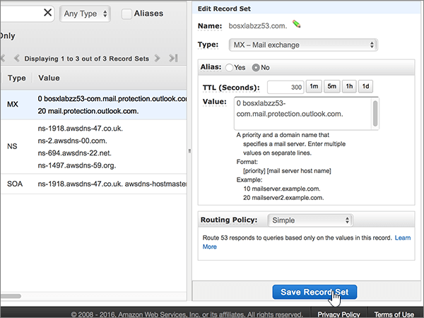

# Erstellen von DNS-Einträgen bei Amazon Web Services (AWS) für Office 365Create DNS records at Amazon Web Services (AWS) for Office 365

 **[Überprüfen Sie die häufig gestellten Fragen (FAQ) zu Domänen](../setup/domains-faq.md)**, wenn Sie nicht finden, wonach Sie suchen.**[Check the Domains FAQ](../setup/domains-faq.md)** if you don't find what you're looking for. 
  
Wenn AWS Ihr DNS-Hosting-Anbieter ist, befolgen Sie die Schritte in diesem Artikel, um Ihre Domäne zu überprüfen und DNS-Einträge für e-Mail, Skype online for Business usw. einzurichten.If AWS is your DNS hosting provider, follow the steps in this article to verify your domain and set up DNS records for email, Skype Online for Business, and so on.
  
Nachdem Sie diese Einträge bei AWS hinzugefügt haben, ist Ihre Domäne für die Verwendung von Office 365-Diensten eingerichtet.After you add these records at AWS, your domain will be set up to work with Office 365 services.
  
Informationen zu Webhosting und DNS für Websites mit Office 365 finden Sie unter [Verwenden einer öffentlichen Website mit Office 365](https://support.office.com/article/choose-a-public-website-3325d50e-d131-403c-a278-7f3296fe33a9).To learn about webhosting and DNS for websites with Office 365, see [Use a public website with Office 365](https://support.office.com/article/choose-a-public-website-3325d50e-d131-403c-a278-7f3296fe33a9).
  
> [!NOTE]
> Normalerweise dauert es ungefähr 15 Minuten, bis DNS-Änderungen wirksam werden. Es kann jedoch gelegentlich länger dauern, bis eine von Ihnen vorgenommene Änderung im Internet im DNS-System aktualisiert wurde. Wenn nach dem Hinzufügen von DNS-Einträgen Probleme mit dem E-Mail-Fluss oder andere Probleme auftreten, lesen Sie [Suchen und Beheben von Problemen, nachdem Ihre Domäne oder DNS-Einträge in Office 365 hinzugefügt wurden](../get-help-with-domains/find-and-fix-issues.md).Typically it takes about 15 minutes for DNS changes to take effect. However, it can occasionally take longer for a change you've made to update across the Internet's DNS system. If you're having trouble with mail flow or other issues after adding DNS records, see [Find and fix issues after adding your domain or DNS records in Office 365](../get-help-with-domains/find-and-fix-issues.md). 
  
## Hinzufügen eines TXT-Eintrags zur ÜberprüfungAdd a TXT record for verification

Bevor Sie Ihre Domäne in Office 365 verwenden können, müssen wir uns vergewissern, dass Sie deren Besitzer sind. Ihre Fähigkeit, sich bei Ihrem Konto bei Ihrer Domänenregistrierungsstelle anzumelden und den DNS-Eintrag zu erstellen, ist für Office 365 der Nachweis, dass Sie der Besitzer der Domäne sind.Before you use your domain with Office 365, we have to make sure that you own it. Your ability to log in to your account at your domain registrar and create the DNS record proves to Office 365 that you own the domain.
  
> [!NOTE]
> Dieser Eintrag wird nur verwendet, um zu überprüfen, ob Sie der Besitzer Ihrer Domäne sind. Er hat keine weiteren Auswirkungen. Sie können ihn später ggf. löschen.This record is used only to verify that you own your domain; it doesn't affect anything else. You can delete it later, if you like. 
  
1. Navigieren Sie im ersten Schritt über [diesen Link](https://console.aws.amazon.com/route53/home) zu Ihrer Domänenseite bei AWS.To get started, go to your domains page at AWS by using [this link](https://console.aws.amazon.com/route53/home). Sie werden aufgefordert, sich zuerst anzumelden.You'll be prompted to log in first.
    
2. Wählen Sie auf der Seite **Ressourcen** die Option **gehostete Zonen**aus.On the **Resources** page, select **Hosted Zones**.
    
3. Wählen Sie auf der Seite \* \* Hosted Zones \* \* in der Spalte **Domänenname** den Namen der Domäne aus, die Sie bearbeiten möchten.On the \*\* Hosted Zones \*\* page, in the **Domain Name** column, select the name of the domain that you want to edit. 
    
4. Wählen Sie **Daten Satz Satz erstellen**aus.Select **Create Record Set**.
    
5. In the **Create Record Set** area, in the boxes for the new record, type or copy and paste the values from the following table.In the **Create Record Set** area, in the boxes for the new record, type or copy and paste the values from the following table. 
    
    (Choose the **Type** and **Routing Policy** values from the drop-down lists.)(Choose the **Type** and **Routing Policy** values from the drop-down lists.) 
    
    > [!TIP]
    > The quotation marks required by the onscreen instructions are supplied automatically. You don't need to type them manually.The quotation marks required by the onscreen instructions are supplied automatically. You don't need to type them manually. 
  
    |||||||
    |:-----|:-----|:-----|:-----|:-----|:-----|
    |**Name****Name**   |**Typ****Type**   |**Alias****Alias**   |**TTL (Seconds)****TTL (Seconds)**   |**Value****Value**   |**Routing Policy****Routing Policy**   |
    |(Leave this field empty.)(Leave this field empty.)    |TXT - TextTXT - Text    |NoNo    |300300    |MS=ms *XXXXXXXX*MS=ms *XXXXXXXX*   **Hinweis:** Dies ist ein nur Beispiel. Verwenden Sie jeweils Ihren Wert für **die Zieladresse bzw. die Adresse, auf die verwiesen wird** aus der Tabelle in Office 365. [Wie finde ich diese Angabe?](../get-help-with-domains/information-for-dns-records.md)**Note:** This is an example. Use your specific **Destination or Points to Address** value here, from the table in Office 365. [How do I find this?](../get-help-with-domains/information-for-dns-records.md)          |SimpleSimple    |
   
6. Wählen Sie **Erstellen** aus.Select **Create**.
    
7. Warten Sie einige Minuten, bevor Sie fortfahren, damit der soeben erstellte Eintrag im Internet aktualisiert werden kann.Wait a few minutes before you continue, so that the record you just created can update across the Internet.
    
Nachdem Sie den Eintrag auf der Website Ihrer Domänenregistrierungsstelle hinzugefügt haben, kehren Sie zu Office 365 zurück und fordern Office 365 auf, nach dem Eintrag zu suchen.Now that you've added the record at your domain registrar's site, you'll go back to Office 365 and request Office 365 to look for the record.
  
Wenn Office 365 den richtigen TXT-Eintrag findet, wird die Domäne überprüft.When Office 365 finds the correct TXT record, your domain is verified.
  
1. Wechseln Sie im Admin Center zur Seite **Einstellungen** \> <a href="https://go.microsoft.com/fwlink/p/?linkid=834818" target="_blank">Domänen</a>.In the admin center, go to the **Settings** \> <a href="https://go.microsoft.com/fwlink/p/?linkid=834818" target="_blank">Domains</a> page.

    
2. Wählen Sie auf der Seite **Domänen** die zu überprüfende Domäne aus.On the **Domains** page, select the domain that you are verifying. 
    
3. Wählen Sie auf der Seite **Setup** die Option **Setup starten** aus.On the **Setup** page, select **Start setup**.
    
4. Wählen Sie auf der Seite **Domäne überprüfen** die Option **Überprüfen** aus.On the **Verify domain** page, select **Verify**.
    
> [!NOTE]
> Normalerweise dauert es ungefähr 15 Minuten, bis DNS-Änderungen wirksam werden. Es kann jedoch gelegentlich länger dauern, bis eine von Ihnen vorgenommene Änderung im Internet im DNS-System aktualisiert wurde. Wenn nach dem Hinzufügen von DNS-Einträgen Probleme mit dem E-Mail-Fluss oder andere Probleme auftreten, lesen Sie [Suchen und Beheben von Problemen, nachdem Ihre Domäne oder DNS-Einträge in Office 365 hinzugefügt wurden](../get-help-with-domains/find-and-fix-issues.md).Typically it takes about 15 minutes for DNS changes to take effect. However, it can occasionally take longer for a change you've made to update across the Internet's DNS system. If you're having trouble with mail flow or other issues after adding DNS records, see [Find and fix issues after adding your domain or DNS records in Office 365](../get-help-with-domains/find-and-fix-issues.md). 
  
## Hinzufügen eines MX-Eintrags, damit E-Mails für Ihre Domäne zu Office 365 geleitet werdenAdd an MX record so email for your domain will come to Office 365

1. Navigieren Sie im ersten Schritt über [diesen Link](https://console.aws.amazon.com/route53/home) zu Ihrer Domänenseite bei AWS. Sie werden aufgefordert, sich zuerst anzumelden.To get started, go to your domains page at AWS by using [this link](https://console.aws.amazon.com/route53/home). You'll be prompted to log in first.
    
2. Wählen Sie auf der Seite **Ressourcen** die Option **gehostete Zonen**aus.On the **Resources** page, select **Hosted Zones**.
    
3. Wählen Sie auf der Seite **gehostete Zonen** in der Spalte **Domänenname** den Namen der Domäne aus, die Sie bearbeiten möchten.On the **Hosted Zones** page, in the **Domain Name** column, select the name of the domain that you want to edit. 
    
4. Wählen Sie **Daten Satz Satz erstellen**aus.Select **Create Record Set**.
    
5. In the **Create Record Set** area, in the boxes for the new record, type or copy and paste the values from the following table.In the **Create Record Set** area, in the boxes for the new record, type or copy and paste the values from the following table. 
    
    (Choose the **Type** and **Routing Policy** values from the drop-down lists.)(Choose the **Type** and **Routing Policy** values from the drop-down lists.) 
    
    |**Name****Name**|**Typ****Type**|**Alias****Alias**|**TTL (Seconds)****TTL (Seconds)**|**Value****Value**|**Routing Policy****Routing Policy**|
    |:-----|:-----|:-----|:-----|:-----|:-----|
    |(Dieses Feld leer lassen.)(Leave this field empty.)    |MX - Mail exchangeMX - Mail exchange    |NoNo    |300300    |0  *\<Domänenschlüssel\>*  .mail.protection.outlook.com.0  *\<domain-key\>*  .mail.protection.outlook.com.    Die 0 ist der MX-Prioritätswert. Fügen Sie ihn am Anfang des MX-Werts hinzu, vom Rest des Werts durch ein Leerzeichen getrennt.  The 0 is the MX priority value. Add it to the beginning of the MX value, separated from the remainder of the value by a space.    **Dieser Wert MUSS mit einem Punkt (.) enden.****This value MUST end with a period (.)**   **Hinweis:** Rufen Sie Ihren \<*Domänen-Schlüssel*\> aus Ihrem Office 365-Konto ab. [Wie finde ich diese Angabe?](../get-help-with-domains/information-for-dns-records.md)**Note:** Get your \<*domain-key*\> from your Office 365 account. [How do I find this?](../get-help-with-domains/information-for-dns-records.md)          |SimpleSimple    |
       
    
  
6. Wählen Sie **Erstellen** aus.Select **Create**.
    
    
  
7. Wenn es weitere MX-Einträge gibt, entfernen Sie sie.If there are any other MX records, remove them.
    
    > [!IMPORTANT]
    > AWS speichert MX-Einträge als Satz, der mehrere Datensätze enthalten kann.AWS stores MX records as a set that may contain multiple records. \*\*\*\* Wählen Sie nicht **Daten Satz Satz löschen**aus, da dadurch alle MX-Einträge gelöscht werden, einschließlich des soeben hinzugefügten MX-Eintrags.**DO NOT** select **Delete Record Set**, as this will delete all of your MX records, including the one you just added. Verwenden Sie stattdessen die folgenden Anweisungen.Use the following instructions instead. 
  
    Wählen Sie zuerst den MX-Eintragssatz aus.First, select the MX record set.
    
    
  
    Löschen Sie als nächstes im Bereich **Edit Record Set** die einzelnen überflüssigen MX-Einträge, indem Sie den Eintrag im Feld **Value** auswählen und dann **ENTF** auf der Tastatur drücken.Next, in the **Edit Record Set** area, delete each obsolete MX record by selecting the entry in the **Value** box and then pressing the **Delete** key on your keyboard. 
    
    
  
8. Wählen Sie **Speichersatz speichern**aus.Select **Save Record Set**.
    
    
  
## Fügen Sie die für Office 365 erforderlichen fünf CNAME-Einträge hinzu.Add the five CNAME records that are required for Office 365

1. Navigieren Sie im ersten Schritt über [diesen Link](https://console.aws.amazon.com/route53/home) zu Ihrer Domänenseite bei AWS. Sie werden aufgefordert, sich zuerst anzumelden.To get started, go to your domains page at AWS by using [this link](https://console.aws.amazon.com/route53/home). You'll be prompted to log in first.
    
2. Wählen Sie auf der Seite **Ressourcen** die Option **gehostete Zonen**aus.On the **Resources** page, select **Hosted Zones**.
    
3. Wählen Sie auf der Seite **gehostete Zonen** in der Spalte **Domänenname** den Namen der Domäne aus, die Sie bearbeiten möchten.On the **Hosted Zones** page, in the **Domain Name** column, select the name of the domain that you want to edit. 
    
4. Wählen Sie **Daten Satz Satz erstellen**aus.Select **Create Record Set**.
    
5. Fügen Sie den ersten CNAME-Eintrag hinzu.Add the first CNAME record.
    
    Geben Sie im Bereich **Create Record Set** in den Feldern für den neuen Eintrag die Werte aus der ersten Zeile der folgenden Tabelle ein. Sie können die Werte auch kopieren und einfügen.In the **Create Record Set** area, in the boxes for the new record, type or copy and paste the values from the first row in the following table. 
    
    (Wählen Sie die Werte für **Type** und **Routing Policy** aus den Dropdownlisten aus.)(Choose the **Type** and **Routing Policy** values from the drop-down lists.) 
    
    |**Name****Name**|**Typ****Type**|**Alias****Alias**|**TTL (Seconds)****TTL (Seconds)**|**Value****Value**|**Routing Policy****Routing Policy**|
    |:-----|:-----|:-----|:-----|:-----|:-----|
    |autodiscoverautodiscover    |CNAME - Canonical nameCNAME - Canonical name    |NoNo    |300300    |autodiscover.outlook.com.autodiscover.outlook.com.    **Dieser Wert MUSS mit einem Punkt (.) enden.****This value MUST end with a period (.)**   |SimpleSimple    |
    |sipsip    |CNAME - Canonical nameCNAME - Canonical name    |NoNo    |300300    |sipdir.online.lync.com.sipdir.online.lync.com.    **Dieser Wert MUSS mit einem Punkt (.) enden.****This value MUST end with a period (.)**   |SimpleSimple    |
    |lyncdiscoverlyncdiscover    |CNAME - Canonical nameCNAME - Canonical name    |NoNo    |300300    |webdir.online.lync.com.webdir.online.lync.com.    **Dieser Wert MUSS mit einem Punkt (.) enden.****This value MUST end with a period (.)**   |EinfachSimple    |
    |enterpriseregistrationenterpriseregistration    |CNAME - Canonical nameCNAME - Canonical name    |NoNo    |300300    |enterpriseregistration.windows.net.enterpriseregistration.windows.net.    **Dieser Wert MUSS mit einem Punkt (.) enden.****This value MUST end with a period (.)**   |SimpleSimple    |
    |enterpriseenrollmententerpriseenrollment    |CNAME - Canonical nameCNAME - Canonical name    |NoNo    |300300    |enterpriseenrollment-s.manage.microsoft.com.enterpriseenrollment-s.manage.microsoft.com.    **Dieser Wert MUSS mit einem Punkt (.) enden.****This value MUST end with a period (.)**   |SimpleSimple    |
   
    
  
6. Wählen Sie **Erstellen** aus.Select **Create**.
    
    
  
7. Fügen Sie die anderen vier CNAME-Einträge hinzu.Add the other four CNAME records.
    
    Wählen Sie auf der Seite **gehostete Zonen** die Option **Daten Satz Satz erstellen**aus, erstellen Sie einen Datensatz mit den Werten aus der nächsten Zeile in der Tabelle, und wählen Sie dann erneut **Erstellen** aus, um diesen Datensatz abzuschließen.In the **Hosted Zones** page, select **Create Record Set**, create a record using the values from the next row in the table, and then again select **Create** to complete that record. 
    
    Wiederholen Sie diesen Vorgang, bis Sie alle fünf CNAME-Einträge erstellt haben.Repeat this process until you have created all five CNAME records.
    
## Hinzufügen eines TXT-Eintrags für SPF, um E-Mail-Spam zu verhindernAdd a TXT record for SPF to help prevent email spam

> [!IMPORTANT]
> Es kann bei einer Domäne nur einen TXT-Eintrag für SPF geben. Wenn es bei Ihrer Domäne mehrere SPF-Einträge gibt, treten E-Mail-Fehler sowie Probleme bei der Übermittlung und Spamklassifizierung auf. Wenn es bei Ihrer Domäne bereits einen SPF-Eintrag gibt, erstellen Sie für Office 365 keinen neuen, sondern fügen Sie die erforderlichen Office 365-Werte dem aktuellen Eintrag hinzu. Damit verfügen Sie über einen *einzigen* SPF-Eintrag, in dem beide Wertemengen enthalten sind. Benötigen Sie Beispiele? Sehen Sie sich die folgenden [Externen DNS-Einträge für Office 365 an](https://support.office.com/article/c0531a6f-9e25-4f2d-ad0e-a70bfef09ac0). Zum Überprüfen Ihres SPF-Eintrags können Sie eines dieser [SPF-Überprüfungstools](../setup/domains-faq.md) verwenden.You cannot have more than one TXT record for SPF for a domain. If your domain has more than one SPF record, you'll get email errors, as well as delivery and spam classification issues. If you already have an SPF record for your domain, don't create a new one for Office 365. Instead, add the required Office 365 values to the current record so that you have a  *single*  SPF record that includes both sets of values. Need examples? Check out these [External Domain Name System records for Office 365](https://support.office.com/article/c0531a6f-9e25-4f2d-ad0e-a70bfef09ac0). To validate your SPF record, you can use one of these[SPF validation tools](../setup/domains-faq.md). 
  
1. Navigieren Sie im ersten Schritt über [diesen Link](https://console.aws.amazon.com/route53/home) zu Ihrer Domänenseite bei AWS.To get started, go to your domains page at AWS by using [this link](https://console.aws.amazon.com/route53/home). Sie werden aufgefordert, sich zuerst anzumelden.You'll be prompted to log in first.
    
2. Wählen Sie auf der Seite **Ressourcen** die Option **gehostete Zonen**aus.On the **Resources** page, select **Hosted Zones**.
    
3. Wählen Sie auf der Seite **gehostete Zonen** in der Spalte **Domänenname** den Namen der Domäne aus, die Sie bearbeiten möchten.On the **Hosted Zones** page, in the **Domain Name** column, select the name of the domain that you want to edit. 
    
4. Wählen Sie den **txt** -Daten Satz Satz aus.Select the **TXT** record set. 
    
    
  
5. Drücken Sie im Bereich **Edit Record Set** am Ende des aktuellen Eintrags im Feld **Value:** für den vorhandenen Eintrag die EINGABETASTE auf der Tastatur, um eine neue Zeile zu erstellen. Geben Sie dann in diese neue Zeile (unter dem vorhandenen Wert) direkt oder durch Kopieren und Einfügen den Wert aus der folgenden Tabelle ein. (Ein Beispiel können Sie in der Abbildung unter der Tabelle sehen.)In the **Edit Record Set** area, at the end of the current entry in the **Value:** box for the existing record, press Enter on your keyboard to create a new line; and then, on that new line (under the existing value), type or copy and paste the value from the following table. (You can see an example in the illustration below the table.) 
    
    |**Wert:****Value:**|
    |:-----|
    |v=spf1 include:spf.protection.outlook.com -allv=spf1 include:spf.protection.outlook.com -all    (Die in der Bildschirmanleitung angezeigten Anführungszeichen werden automatisch eingefügt. Sie müssen Sie nicht manuell eingeben.)  (The quotation marks required by the onscreen instructions are supplied automatically. You don't need to type them manually.)    **Hinweis:** Es wird empfohlen, diesen Eintrag zu kopieren und einzufügen, damit alle Abstände korrekt übernommen werden.**Note:** We recommend copying and pasting this entry, so that all of the spacing stays correct.           |
   
    
  
6. Wählen Sie **Speichersatz speichern**aus.Select **Save Record Set**.
    
    
  
## Hinzufügen der für Office 365 erforderlichen zwei SRV-EinträgeAdd the two SRV records that are required for Office 365

1. Navigieren Sie im ersten Schritt über [diesen Link](https://console.aws.amazon.com/route53/home) zu Ihrer Domänenseite bei AWS. Sie werden aufgefordert, sich zuerst anzumelden.To get started, go to your domains page at AWS by using [this link](https://console.aws.amazon.com/route53/home). You'll be prompted to log in first.
    
2. Wählen Sie auf der Seite **Ressourcen** die Option **gehostete Zonen**aus.On the **Resources** page, select **Hosted Zones**.
    
3. Wählen Sie auf der Seite **gehostete Zonen** in der Spalte **Domänenname** den Namen der Domäne aus, die Sie bearbeiten möchten.On the **Hosted Zones** page, in the **Domain Name** column, select the name of the domain that you want to edit. 
    
4. Wählen Sie **Daten Satz Satz erstellen**aus.Select **Create Record Set**.
    
5. Fügen Sie den ersten SRV-Eintrag hinzu:Add the first SRV record:
    
    Geben Sie im Bereich **Create Record Set** in den Feldern für den neuen Eintrag die Werte aus der ersten Zeile der folgenden Tabelle ein. Sie können die Werte auch kopieren und einfügen.In the **Create Record Set** area, in the boxes for the new record, type or copy and paste the values from the first row in the following table. 
    
    (Wählen Sie die Werte für **Type** und **Routing Policy** aus den Dropdownlisten aus.)(Choose the **Type** and **Routing Policy** values from the drop-down lists.) 
    
    |**Name****Name**|**Typ****Type**|**Alias****Alias**|**TTL (Seconds)****TTL (Seconds)**|**Value****Value**|**Routing Policy****Routing Policy**|
    |:-----|:-----|:-----|:-----|:-----|:-----|
    |_sip._tls_sip._tls|SRV - Service locatorSRV - Service locator|NoNo|300300|100 1 443 sipdir.online.lync.com.100 1 443 sipdir.online.lync.com. **Dieser Wert muss mit einem Punkt (.) enden.**>**This value MUST end with a period (.)**>  **Hinweis:** Es wird empfohlen, diesen Eintrag zu kopieren und einzufügen, damit alle Abstände korrekt übernommen werden.**Note:** We recommend copying and pasting this entry, so that all of the spacing stays correct.           |SimpleSimple|
    |_sipfederationtls._tcp_sipfederationtls._tcp|SRV - Service locatorSRV - Service locator|NoNo|300300|100 1 5061 sipfed.online.lync.com.100 1 5061 sipfed.online.lync.com. **Dieser Wert MUSS mit einem Punkt (.) enden.****This value MUST end with a period (.)**  **Hinweis:** Es wird empfohlen, diesen Eintrag zu kopieren und einzufügen, damit alle Abstände korrekt übernommen werden.**Note:** We recommend copying and pasting this entry, so that all of the spacing stays correct.           |SimpleSimple|
   
    
  
6. Wählen Sie **Erstellen** aus.Select **Create**.
    
    
  
7. Fügen Sie den anderen SRV-Eintrag hinzu:To add the other SRV record:
    
    Wählen Sie auf der Seite **gehostete Zonen** die Option **Daten Satz Satz erstellen**aus, erstellen Sie einen Datensatz mit den Werten aus der nächsten Zeile in der Tabelle, und wählen Sie dann erneut **Erstellen** aus, um diesen Datensatz abzuschließen.In the **Hosted Zones** page, select **Create Record Set**, create a record using the values from the next row in the table, and then again select **Create** to complete that record. 
    
> [!NOTE]
> Normalerweise dauert es ungefähr 15 Minuten, bis DNS-Änderungen wirksam werden. Es kann jedoch gelegentlich länger dauern, bis eine von Ihnen vorgenommene Änderung im Internet im DNS-System aktualisiert wurde. Wenn nach dem Hinzufügen von DNS-Einträgen Probleme mit dem E-Mail-Fluss oder andere Probleme auftreten, lesen Sie [Suchen und Beheben von Problemen, nachdem Ihre Domäne oder DNS-Einträge in Office 365 hinzugefügt wurden](../get-help-with-domains/find-and-fix-issues.md).Typically it takes about 15 minutes for DNS changes to take effect. However, it can occasionally take longer for a change you've made to update across the Internet's DNS system. If you're having trouble with mail flow or other issues after adding DNS records, see [Find and fix issues after adding your domain or DNS records in Office 365](../get-help-with-domains/find-and-fix-issues.md). 
  
