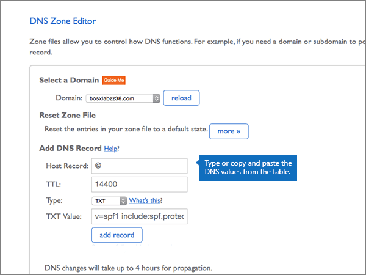
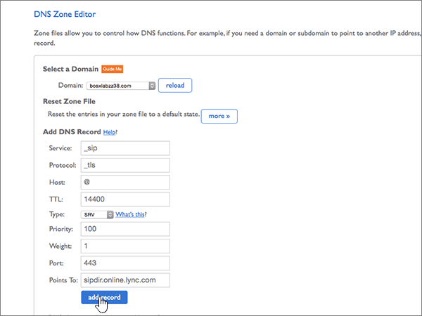

# Erstellen von DNS-Einträgen für Office 365 bei BluehostCreate DNS records at Bluehost for Office 365

 **[Überprüfen Sie die häufig gestellten Fragen (FAQ) zu Domänen](../setup/domains-faq.md)**, wenn Sie nicht finden, wonach Sie suchen.**[Check the Domains FAQ](../setup/domains-faq.md)** if you don't find what you're looking for. 
  
Wenn Bluehost Ihr DNS-Hostinganbieter ist, führen Sie die in diesem Artikel aufgeführten Schritte aus, um Ihre Domäne zu überprüfen und DNS-Einträge für E-Mail, Skype for Business Online und andere Dienste einzurichten.If Bluehost is your DNS hosting provider, follow the steps in this article to verify your domain and set up DNS records for email, Skype for Business Online, and so on.
  
Nachdem Sie diese Einträge bei Bluehost hinzugefügt haben, ist Ihre Domäne für die Verwendung von Office 365-Diensten eingerichtet.After you add these records at Bluehost, your domain will be set up to work with Office 365 services.
  
Informationen zu Webhosting und DNS für Websites mit Office 365 finden Sie unter [Verwenden einer öffentlichen Website mit Office 365](https://support.office.com/article/choose-a-public-website-3325d50e-d131-403c-a278-7f3296fe33a9).To learn about webhosting and DNS for websites with Office 365, see [Use a public website with Office 365](https://support.office.com/article/choose-a-public-website-3325d50e-d131-403c-a278-7f3296fe33a9).
  
> [!NOTE]
> Normalerweise dauert es ungefähr 15 Minuten, bis DNS-Änderungen wirksam werden. Es kann jedoch gelegentlich länger dauern, bis eine von Ihnen vorgenommene Änderung im Internet im DNS-System aktualisiert wurde. Wenn nach dem Hinzufügen von DNS-Einträgen Probleme mit dem E-Mail-Fluss oder andere Probleme auftreten, lesen Sie [Suchen und Beheben von Problemen, nachdem Ihre Domäne oder DNS-Einträge in Office 365 hinzugefügt wurden](../get-help-with-domains/find-and-fix-issues.md).Typically it takes about 15 minutes for DNS changes to take effect. However, it can occasionally take longer for a change you've made to update across the Internet's DNS system. If you're having trouble with mail flow or other issues after adding DNS records, see [Find and fix issues after adding your domain or DNS records in Office 365](../get-help-with-domains/find-and-fix-issues.md). 
  
## Hinzufügen eines TXT-Eintrags zur ÜberprüfungAdd a TXT record for verification

Bevor Sie Ihre Domäne in Office 365 verwenden können, müssen wir uns vergewissern, dass Sie deren Besitzer sind. Ihre Fähigkeit, sich bei Ihrem Konto bei Ihrer Domänenregistrierungsstelle anzumelden und den DNS-Eintrag zu erstellen, ist für Office 365 der Nachweis, dass Sie der Besitzer der Domäne sind.Before you use your domain with Office 365, we have to make sure that you own it. Your ability to log in to your account at your domain registrar and create the DNS record proves to Office 365 that you own the domain.
  
> [!NOTE]
> Dieser Eintrag wird nur verwendet, um zu überprüfen, ob Sie der Besitzer Ihrer Domäne sind. Er hat keine weiteren Auswirkungen. Sie können ihn später ggf. löschen.This record is used only to verify that you own your domain; it doesn't affect anything else. You can delete it later, if you like. 
  
1. Im ersten Schritt navigieren Sie über [diesen Link](https://my.bluehost.com/cgi/dm) zu Ihrer Domänenseite bei Bluehost.To get started, go to your domains page at Bluehost by using [this link](https://my.bluehost.com/cgi/dm). You'll be prompted to log in first.You'll be prompted to log in first.
    
2. Suchen Sie auf der Seite **Domains** im Bereich **Domain** die Zeile mit der Domäne, die Sie ändern möchten, und aktivieren Sie dann das Kontrollkästchen für diese Domäne.On the **domains** page, in the **domain** area, find the row for the domain that you're changing, and then select the check box for that domain. 
    
    (Möglicherweise müssen Sie nach unten scrollen.)(You may have to scroll down.)
    
3. Wählen Sie im Bereich ***domain_name*** in der Zeile **DNS-Zonen-Editor** die Option DNS- **Einträge verwalten**aus.In the ***domain_name*** area, on the **DNS Zone Editor** row, select **Manage DNS records**.
    
4. Geben Sie auf der Seite \* \* DNS-Zonen-Editor \* \* im Bereich **DNS-Eintrag hinzufügen** in den Feldern für den neuen Eintrag die Werte aus der folgenden Tabelle ein, oder kopieren und fügen Sie Sie ein.On the \*\* DNS Zone Editor \*\* page, in the **Add DNS Record** area, in the boxes for the new record, type or copy and paste the values from the following table. 
    
    (Choose the **Type** value from the drop-down list.)(Choose the **Type** value from the drop-down list.) 
    
    |||||
    |:-----|:-----|:-----|:-----|
    |**Host Record****Host Record**   |**TTL****TTL**   |**Type****Type**   |**TXT Value****TXT Value**   |
    |@    |1440014400    |TXTTXT    |MS=ms *XXXXXXXX*MS=ms *XXXXXXXX*    **Hinweis:** Dies ist ein nur Beispiel. Verwenden Sie jeweils Ihren Wert für **die Zieladresse bzw. die Adresse, auf die verwiesen wird** aus der Tabelle in Office 365. [Wie finde ich diese Angabe?](../get-help-with-domains/information-for-dns-records.md)**Note:** This is an example. Use your specific **Destination or Points to Address** value here, from the table in Office 365. [How do I find this?](../get-help-with-domains/information-for-dns-records.md)          |
   
5. Wählen Sie **Add Record**aus.Select **add record**.
    
6. Warten Sie einige Minuten, bevor Sie fortfahren, damit der soeben erstellte Eintrag im Internet aktualisiert werden kann.Wait a few minutes before you continue, so that the record you just created can update across the Internet.
    
Nachdem Sie den Eintrag auf der Website Ihrer Domänenregistrierungsstelle hinzugefügt haben, kehren Sie zu Office 365 zurück und fordern Office 365 auf, nach dem Eintrag zu suchen.Now that you've added the record at your domain registrar's site, you'll go back to Office 365 and request Office 365 to look for the record.
  
Wenn Office 365 den richtigen TXT-Eintrag findet, wird die Domäne überprüft.When Office 365 finds the correct TXT record, your domain is verified.
  
1. Wechseln Sie im Admin Center zur Seite **Einstellungen** \> <a href="https://go.microsoft.com/fwlink/p/?linkid=834818" target="_blank">Domänen</a>.In the admin center, go to the **Settings** \> <a href="https://go.microsoft.com/fwlink/p/?linkid=834818" target="_blank">Domains</a> page.

    
2. Wählen Sie auf der Seite **Domänen** die zu überprüfende Domäne aus.On the **Domains** page, select the domain that you are verifying. 
    
3. Wählen Sie auf der Seite **Setup** die Option **Setup starten** aus.On the **Setup** page, select **Start setup**.
    
4. Wählen Sie auf der Seite **Domäne überprüfen** die Option **Überprüfen** aus.On the **Verify domain** page, select **Verify**.
    
> [!NOTE]
> Normalerweise dauert es ungefähr 15 Minuten, bis DNS-Änderungen wirksam werden. Es kann jedoch gelegentlich länger dauern, bis eine von Ihnen vorgenommene Änderung im Internet im DNS-System aktualisiert wurde. Wenn nach dem Hinzufügen von DNS-Einträgen Probleme mit dem E-Mail-Fluss oder andere Probleme auftreten, lesen Sie [Suchen und Beheben von Problemen, nachdem Ihre Domäne oder DNS-Einträge in Office 365 hinzugefügt wurden](../get-help-with-domains/find-and-fix-issues.md).Typically it takes about 15 minutes for DNS changes to take effect. However, it can occasionally take longer for a change you've made to update across the Internet's DNS system. If you're having trouble with mail flow or other issues after adding DNS records, see [Find and fix issues after adding your domain or DNS records in Office 365](../get-help-with-domains/find-and-fix-issues.md). 
  
## Hinzufügen eines MX-Eintrags, damit E-Mails für Ihre Domäne zu Office 365 geleitet werdenAdd an MX record so email for your domain will come to Office 365

1. Im ersten Schritt navigieren Sie über [diesen Link](https://my.bluehost.com/cgi/dm) zu Ihrer Domänenseite bei Bluehost.To get started, go to your domains page at Bluehost by using [this link](https://my.bluehost.com/cgi/dm). You'll be prompted to log in first.You'll be prompted to log in first.
    
2. Suchen Sie auf der Seite **Domains** im Bereich **Domain** die Zeile mit der Domäne, die Sie ändern möchten, und aktivieren Sie dann das Kontrollkästchen für diese Domäne.On the **domains** page, in the **domain** area, find the row for the domain that you're changing, and then select the check box for that domain. 
    
    (Möglicherweise müssen Sie nach unten scrollen.)(You may have to scroll down.)
    
3. Wählen Sie im Bereich ***domain_name*** in der Zeile **DNS-Zonen-Editor** die Option DNS- **Einträge verwalten**aus.In the ***domain_name*** area, on the **DNS Zone Editor** row, select **Manage DNS records**.
    
4. On the **DNS Zone Editor** page, in the **Add DNS Record** area, in the boxes for the new record, type or copy and paste the values from the following table.On the **DNS Zone Editor** page, in the **Add DNS Record** area, in the boxes for the new record, type or copy and paste the values from the following table. 
    
    (Choose the **Type** value from the drop-down list.)(Choose the **Type** value from the drop-down list.) 
    
    |**Host Record****Host Record**|**TTL****TTL**|**Type****Type**|**Points To****Points To**|**Priority****Priority**|
    |:-----|:-----|:-----|:-----|:-----|
    |@    |1440014400    |MXMX    | *\<Domänenschlüssel\>*  .mail.protection.outlook.com*\<domain-key\>*  .mail.protection.outlook.com   **Hinweis:** Rufen Sie \<Ihren *Domänenschlüssel* \> aus Ihrem Office 365-Konto ab.**Note:** Get your \<*domain-key*\> from your Office 365 account. [Wie finde ich diese Angabe?How do I find this?](../get-help-with-domains/information-for-dns-records.md)          |00    Weitere Informationen zur Priorität finden Sie unter [Was ist MX-Priorität?](https://support.office.com/article/2784cc4d-95be-443d-b5f7-bb5dd867ba83.aspx)For more information about priority, see [What is MX priority?](https://support.office.com/article/2784cc4d-95be-443d-b5f7-bb5dd867ba83.aspx)   |
   
   
  
5. Wählen Sie **Add Record**aus.Select **add record**.
    
    
  
6. Wenn im Abschnitt **MX (Mail Exchanger)** weitere MX-Einträge vorhanden sind, löschen Sie die einzelnen Einträge.If there are any other MX records in the **MX (Mail Exchanger)** section, delete each of them. 
    
    Wählen Sie für einen der anderen MX-Einträge die Option **Löschen aus.**For one of the other MX records, select **Delete.**
    
    
  
7. Wählen Sie im Dialogfeld Bestätigung die Option **OK**aus.In the confirmation dialog box, select **OK**.
    
    
  
8. Gehen Sie entsprechend vor, um alle weiteren bereits aufgeführten MX-Einträge zu löschen.Use the same process to delete any other MX records that were already listed.
    
## Hinzufügen der für Office 365 erforderlichen sechs CNAME-EinträgeAdd the six CNAME records that are required for Office 365

1. Im ersten Schritt navigieren Sie über [diesen Link](https://my.bluehost.com/cgi/dm) zu Ihrer Domänenseite bei Bluehost.To get started, go to your domains page at Bluehost by using [this link](https://my.bluehost.com/cgi/dm). You'll be prompted to log in first.You'll be prompted to log in first.
    
2. Suchen Sie auf der Seite **Domains** im Bereich **Domain** die Zeile mit der Domäne, die Sie ändern möchten, und aktivieren Sie dann das Kontrollkästchen für diese Domäne.On the **domains** page, in the **domain** area, find the row for the domain that you're changing, and then select the check box for that domain. 
    
    (Möglicherweise müssen Sie nach unten scrollen.)(You may have to scroll down.)
    
3. Wählen Sie im Bereich ***domain_name*** in der Zeile **DNS-Zonen-Editor** die Option DNS- **Einträge verwalten**aus.In the ***domain_name*** area, on the **DNS Zone Editor** row, select **Manage DNS records**.
    
4. Suchen Sie im Abschnitt **a (Host)** Records nach der Zeile für den **Auto Ermittlungs** Eintrag, und wählen Sie dann **Löschen** für diese Zeile aus.In the **A (Host)** records section, find the row for the **autodiscover** record, and then select **delete** for that row. 
    
    > [!IMPORTANT]
    > Sie müssen den vorhandenen **AutoErmittlung** seintrag löschen,  *bevor Sie*  den **AutoErmittlung** seintrag hinzufügen, der für Office 365 erforderlich ist. Bluehost gestattet Ihnen nicht, zwei **AutoErmittlung** seinträge gleichzeitig zu pflegen.You must delete the existing **autodiscover** record  *before*  adding the **autodiscover** record that is required by Office 365. Bluehost does not allow you to maintain two **autodiscover** records simultaneously. 
  
    
  
5. Wählen Sie **OK** aus.Select **OK**.
    
    
  
6. Erstellen Sie den ersten der sechs CNAME-Einträge.Create the first of the six CNAME records.
    
    Geben Sie auf der Seite **DNS Zone Editor** im Bereich **Add DNS Record** in den Feldern für den neuen Eintrag die Werte aus der ersten Zeile der folgenden Tabelle ein. Sie können die Werte auch kopieren und einfügen.On the **DNS Zone Editor** page, in the **Add DNS Record** area, in the boxes for the new record, type or copy and paste the values from the first row in the following table. 
    
    (Choose the **Type** value from the drop-down list.)(Choose the **Type** value from the drop-down list.) 
    
    |**Host Record****Host Record**|**TTL****TTL**|**Type****Type**|**Points To****Points To**|
    |:-----|:-----|:-----|:-----|
    |autodiscoverautodiscover    |1440014400    |CNAMECNAME    |autodiscover.outlook.comautodiscover.outlook.com    |
    |sipsip    |1440014400    |CNAMECNAME    |sipdir.online.lync.comsipdir.online.lync.com    |
    |lyncdiscoverlyncdiscover    |1440014400    |CNAMECNAME    |webdir.online.lync.comwebdir.online.lync.com    |
    |enterpriseregistrationenterpriseregistration    |1440014400    |CNAMECNAME    |enterpriseregistration.windows.netenterpriseregistration.windows.net    |
    |enterpriseenrollmententerpriseenrollment    |1440014400    |CNAMECNAME    |enterpriseenrollment-s.manage.microsoft.comenterpriseenrollment-s.manage.microsoft.com    |
   
    
  
7. Wählen Sie **Add Record**aus.Select **add record**.
    
    
  
8. Fügen Sie die fünf anderen CNAME-Einträge hinzu.Add each of the other five CNAME records.
    
    Erstellen Sie weiterhin im Abschnitt **Hinzufügen von DNS-Einträgen** mithilfe der Werte aus der nächsten Zeile in der Tabelle einen Datensatz, und wählen Sie dann erneut **Datensatz hinzufügen** aus, um den Datensatz abzuschließen.Still in the **Add DNS Record** section, create a record by using the values from the next row in the table, and then again select **add record** to complete that record. 
    
    Wiederholen Sie diesen Vorgang, bis Sie alle sechs CNAME-Einträge erstellt haben.Repeat this process until you have created all six CNAME records.
    
## Hinzufügen eines TXT-Eintrags für SPF, um E-Mail-Spam zu verhindernAdd a TXT record for SPF to help prevent email spam

> [!IMPORTANT]
> Es kann bei einer Domäne nur einen TXT-Eintrag für SPF geben. Wenn es bei Ihrer Domäne mehrere SPF-Einträge gibt, treten E-Mail-Fehler sowie Probleme bei der Übermittlung und Spamklassifizierung auf. Wenn es bei Ihrer Domäne bereits einen SPF-Eintrag gibt, erstellen Sie für Office 365 keinen neuen, sondern fügen Sie die erforderlichen Office 365-Werte dem aktuellen Eintrag hinzu. Damit verfügen Sie über einen *einzigen* SPF-Eintrag, in dem beide Wertemengen enthalten sind. Benötigen Sie Beispiele? Sehen Sie sich die folgenden [Externen DNS-Einträge für Office 365 an](https://support.office.com/article/c0531a6f-9e25-4f2d-ad0e-a70bfef09ac0). Zum Überprüfen Ihres SPF-Eintrags können Sie eines dieser [SPF-Überprüfungstools](../setup/domains-faq.md) verwenden.You cannot have more than one TXT record for SPF for a domain. If your domain has more than one SPF record, you'll get email errors, as well as delivery and spam classification issues. If you already have an SPF record for your domain, don't create a new one for Office 365. Instead, add the required Office 365 values to the current record so that you have a  *single*  SPF record that includes both sets of values. Need examples? Check out these [External Domain Name System records for Office 365](https://support.office.com/article/c0531a6f-9e25-4f2d-ad0e-a70bfef09ac0). To validate your SPF record, you can use one of these[SPF validation tools](../setup/domains-faq.md). 
  
1. Im ersten Schritt navigieren Sie über [diesen Link](https://my.bluehost.com/cgi/dm) zu Ihrer Domänenseite bei Bluehost.To get started, go to your domains page at Bluehost by using [this link](https://my.bluehost.com/cgi/dm). You'll be prompted to log in first.You'll be prompted to log in first.
    
2. Suchen Sie auf der Seite **Domains** im Bereich **Domain** die Zeile mit der Domäne, die Sie ändern möchten, und aktivieren Sie dann das Kontrollkästchen für diese Domäne.On the **domains** page, in the **domain** area, find the row for the domain that you're changing, and then select the check box for that domain. 
    
    (Möglicherweise müssen Sie nach unten scrollen.)(You may have to scroll down.)
    
3. Wählen Sie im Bereich ***domain_name*** in der Zeile **DNS-Zonen-Editor** die Option DNS- **Einträge verwalten**aus.In the ***domain_name*** area, on the **DNS Zone Editor** row, select **Manage DNS records**.
    
4. On the **DNS Zone Editor** page, in the **Add DNS Record** area, in the boxes for the new record, type or copy and paste the values from the following table.On the **DNS Zone Editor** page, in the **Add DNS Record** area, in the boxes for the new record, type or copy and paste the values from the following table. 
    
    (Choose the **Type** value from the drop-down list.)(Choose the **Type** value from the drop-down list.) 
        
    |**Host Record****Host Record**|**TTL****TTL**|**Type****Type**|**TXT Value****TXT Value**|
    |:-----|:-----|:-----|:-----|
    |@    |1440014400    |TXTTXT    |v=spf1 include:spf.protection.outlook.com -allv=spf1 include:spf.protection.outlook.com -all   **Hinweis:** Es wird empfohlen, diesen Eintrag zu kopieren und einzufügen, damit alle Abstände korrekt übernommen werden.**Note:** We recommend copying and pasting this entry, so that all of the spacing stays correct.           |
   
    
  
5. Wählen Sie **Add Record**aus.Select **add record**.
    
    
  
## Hinzufügen der für Office 365 erforderlichen zwei SRV-EinträgeAdd the two SRV records that are required for Office 365

1. Im ersten Schritt navigieren Sie über [diesen Link](https://my.bluehost.com/cgi/dm) zu Ihrer Domänenseite bei Bluehost.To get started, go to your domains page at Bluehost by using [this link](https://my.bluehost.com/cgi/dm). You'll be prompted to log in first.You'll be prompted to log in first.
    
2. Suchen Sie auf der Seite **Domains** im Bereich **Domain** die Zeile mit der Domäne, die Sie ändern möchten, und aktivieren Sie dann das Kontrollkästchen für diese Domäne.On the **domains** page, in the **domain** area, find the row for the domain that you're changing, and then select the check box for that domain. 
    
    (Möglicherweise müssen Sie nach unten scrollen.)(You may have to scroll down.)
    
3. Wählen Sie im Bereich ***domain_name*** in der Zeile **DNS-Zonen-Editor** die Option DNS- **Einträge verwalten**aus.In the ***domain_name*** area, on the **DNS Zone Editor** row, select **Manage DNS records**.
    
4. Erstellen Sie den ersten der zwei SRV-Einträge.Create the first of the two SRV records.
    
    Geben Sie auf der Seite **DNS Zone Editor** im Bereich **Add DNS Record** in den Feldern für den neuen Eintrag die Werte aus der ersten Zeile der folgenden Tabelle ein. Sie können die Werte auch kopieren und einfügen.On the **DNS Zone Editor** page, in the **Add DNS Record** area, in the boxes for the new record, type or copy and paste the values from the first row in the following table. 
    
    (Choose the **Type** value from the drop-down list.)(Choose the **Type** value from the drop-down list.) 
    
    |**Service****Service**|**Protocol****Protocol**|**Host****Host**|**TTL****TTL**|**Type****Type**|**Priority****Priority**|**Weight****Weight**|**Port****Port**|**Points To****Points To**|
    |:-----|:-----|:-----|:-----|:-----|:-----|:-----|:-----|:-----|
    |_sip_sip    |_tls_tls    |@    |1440014400    |SRVSRV    |100100    |11    |443443    |sipdir.online.lync.comsipdir.online.lync.com    |
    |_sipfederationtls_sipfederationtls    |_tcp_tcp    |@    |1440014400    |SRVSRV    |100100    |11    |50615061    |sipfed.online.lync.comsipfed.online.lync.com    |
   
    
  
5. Wählen Sie **Add Record**aus.Select **add record**.
    
    
  
6. Fügen Sie den anderen SRV-Eintrag hinzu.Add the other SRV record.
    
    Erstellen Sie weiterhin im Abschnitt **Hinzufügen von DNS-Einträgen** mithilfe der Werte aus der anderen Zeile in der Tabelle einen Datensatz, und wählen Sie dann erneut **Datensatz hinzufügen** aus, um den Datensatz abzuschließen.Still in the **Add DNS Record** section, create a record by using the values from the other row in the table, and then again select **add record** to complete that record. 
    
> [!NOTE]
> Normalerweise dauert es ungefähr 15 Minuten, bis DNS-Änderungen wirksam werden. Es kann jedoch gelegentlich länger dauern, bis eine von Ihnen vorgenommene Änderung im Internet im DNS-System aktualisiert wurde. Wenn nach dem Hinzufügen von DNS-Einträgen Probleme mit dem E-Mail-Fluss oder andere Probleme auftreten, lesen Sie [Suchen und Beheben von Problemen, nachdem Ihre Domäne oder DNS-Einträge in Office 365 hinzugefügt wurden](../get-help-with-domains/find-and-fix-issues.md).Typically it takes about 15 minutes for DNS changes to take effect. However, it can occasionally take longer for a change you've made to update across the Internet's DNS system. If you're having trouble with mail flow or other issues after adding DNS records, see [Find and fix issues after adding your domain or DNS records in Office 365](../get-help-with-domains/find-and-fix-issues.md). 
  

