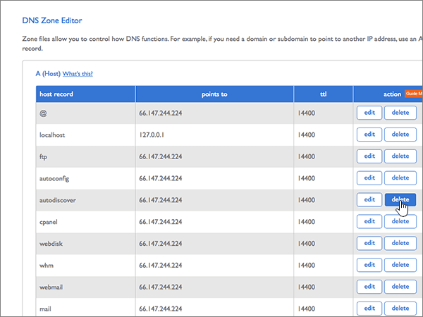

# Erstellen von DNS-Einträgen bei Bluehost für MicrosoftCreate DNS records at Bluehost for Microsoft

 **[Überprüfen Sie die häufig gestellten Fragen (FAQ) zu Domänen](../setup/domains-faq.yml)**, wenn Sie nicht finden, wonach Sie suchen.**[Check the Domains FAQ](../setup/domains-faq.yml)** if you don't find what you're looking for. 
  
Wenn Bluehost Ihr DNS-Hostinganbieter ist, führen Sie die in diesem Artikel aufgeführten Schritte aus, um Ihre Domäne zu überprüfen und DNS-Einträge für E-Mail, Skype for Business Online und andere Dienste einzurichten.If Bluehost is your DNS hosting provider, follow the steps in this article to verify your domain and set up DNS records for email, Skype for Business Online, and so on.
  
Nachdem Sie diese Einträge bei Bluehost hinzugefügt haben, ist Ihre Domäne für die Verwendung mit Microsoft-Diensten eingerichtet.After you add these records at Bluehost, your domain will be set up to work with Microsoft services.

> [!NOTE]
> Normalerweise dauert es ungefähr 15 Minuten, bis DNS-Änderungen wirksam werden. Es kann jedoch gelegentlich länger dauern, bis eine von Ihnen vorgenommene Änderung im Internet im DNS-System aktualisiert wurde. Wenn nach dem Hinzufügen von DNS-Einträgen Probleme mit dem E-Mail-Fluss oder andere Probleme auftreten, lesen Sie [Suchen und Beheben von Problemen, nachdem Ihre Domäne oder DNS-Einträge hinzugefügt wurden](../get-help-with-domains/find-and-fix-issues.md).Typically it takes about 15 minutes for DNS changes to take effect. However, it can occasionally take longer for a change you've made to update across the Internet's DNS system. If you're having trouble with mail flow or other issues after adding DNS records, see [Find and fix issues after adding your domain or DNS records](../get-help-with-domains/find-and-fix-issues.md). 
  
## Hinzufügen eines TXT-Eintrags zur ÜberprüfungAdd a TXT record for verification

Bevor Sie Ihre Domäne mit Microsoft verwenden können, müssen wir uns vergewissern, dass Sie deren Besitzer sind. Ihre Fähigkeit, sich bei Ihrem Konto bei Ihrer Domänenregistrierungsstelle anzumelden und den DNS-Eintrag zu erstellen, ist für Microsoft der Nachweis, dass Sie der Besitzer der Domäne sind.Before you use your domain with Microsoft, we have to make sure that you own it. Your ability to log in to your account at your domain registrar and create the DNS record proves to Microsoft that you own the domain.
  
> [!NOTE]
> Dieser Eintrag wird nur verwendet, um zu überprüfen, ob Sie der Besitzer Ihrer Domäne sind. Er hat keine weiteren Auswirkungen. Sie können ihn später ggf. löschen.This record is used only to verify that you own your domain; it doesn't affect anything else. You can delete it later, if you like. 
  
1. Im ersten Schritt navigieren Sie über [diesen Link](https://my.bluehost.com/cgi/dm) zu Ihrer Domänenseite bei Bluehost.To get started, go to your domains page at Bluehost by using [this link](https://my.bluehost.com/cgi/dm). Sie werden aufgefordert, sich zuerst anzumelden.You'll be prompted to log in first.
    
2. Suchen Sie auf der Seite **Domains** im Bereich **Domain** die Zeile mit der Domäne, die Sie ändern möchten, und aktivieren Sie dann das Kontrollkästchen für diese Domäne.On the **domains** page, in the **domain** area, find the row for the domain that you're changing, and then select the check box for that domain. 
    
    (Möglicherweise müssen Sie nach unten scrollen.)(You may have to scroll down.)
    
3. Wählen Sie im **Bereich _domain_name_*_ in der\* Zeile "DNS-Zonen-Editor" den*\* Eintrag **DNS-Einträge verwalten** aus.In the **_domain_name_*_ area, on the _\* DNS Zone Editor*\* row, select **Manage DNS records**.
    
4. On the **DNS Zone Editor** page, in the **Add DNS Record** area, in the boxes for the new record, type or copy and paste the values from the following table.On the **DNS Zone Editor** page, in the **Add DNS Record** area, in the boxes for the new record, type or copy and paste the values from the following table. 
    
    (Wählen Sie in der Dropdownliste den Wert für **Type** aus.)(Choose the **Type** value from the drop-down list.) 
    
    |||||
    |:-----|:-----|:-----|:-----|
    |**Host Record****Host Record**   |**TTL****TTL**   |**Type****Type**   |**TXT Value****TXT Value**   |
    |@    |1440014400    |TXTTXT    |MS=ms *XXXXXXXX*MS=ms *XXXXXXXX*    **Hinweis:** Dies ist ein Beispiel. Verwenden Sie hier Ihren spezifischen Wert für **Ziel- oder Verweisadresse** aus der Tabelle in [Wie finde ich diese Angabe?](../get-help-with-domains/information-for-dns-records.md).**Note:** This is an example. Use your specific **Destination or Points to Address** value here, from the table. [How do I find this?](../get-help-with-domains/information-for-dns-records.md)          |
   
5. Wählen Sie **Add Record** aus.Select **add record**.
    
6. Warten Sie einige Minuten, bevor Sie fortfahren, damit der soeben erstellte Eintrag im Internet aktualisiert werden kann.Wait a few minutes before you continue, so that the record you just created can update across the Internet.
    
Nachdem Sie den Eintrag auf der Website Ihrer Domänenregistrierungsstelle hinzugefügt haben, kehren Sie zu Microsoft zurück und fordern eine Suche nach dem Eintrag an.Now that you've added the record at your domain registrar's site, you'll go back to Microsoft and request a search for the record.
  
Wenn Microsoft den richtigen TXT-Eintrag findet, ist die Domäne überprüft.When Microsoft finds the correct TXT record, your domain is verified.
  
1. Wechseln Sie im Microsoft Admin Center zur Seite **Einstellungen** \> <a href="https://go.microsoft.com/fwlink/p/?linkid=834818" target="_blank">Domänen</a>.In the Microsoft admin center, go to the **Settings** \> <a href="https://go.microsoft.com/fwlink/p/?linkid=834818" target="_blank">Domains</a> page.

    
2. Wählen Sie auf der Seite **Domänen** die zu überprüfende Domäne aus.On the **Domains** page, select the domain that you are verifying. 
    
3. Wählen Sie auf der Seite **Setup** die Option **Setup starten** aus.On the **Setup** page, select **Start setup**.
    
4. Wählen Sie auf der Seite **Domäne überprüfen** die Option **Überprüfen** aus.On the **Verify domain** page, select **Verify**.
    
> [!NOTE]
> Normalerweise dauert es ungefähr 15 Minuten, bis DNS-Änderungen wirksam werden. Es kann jedoch gelegentlich länger dauern, bis eine von Ihnen vorgenommene Änderung im Internet im DNS-System aktualisiert wurde. Wenn nach dem Hinzufügen von DNS-Einträgen Probleme mit dem E-Mail-Fluss oder andere Probleme auftreten, lesen Sie [Suchen und Beheben von Problemen, nachdem Ihre Domäne oder DNS-Einträge hinzugefügt wurden](../get-help-with-domains/find-and-fix-issues.md).Typically it takes about 15 minutes for DNS changes to take effect. However, it can occasionally take longer for a change you've made to update across the Internet's DNS system. If you're having trouble with mail flow or other issues after adding DNS records, see [Find and fix issues after adding your domain or DNS records](../get-help-with-domains/find-and-fix-issues.md). 
  
## Fügen Sie einen MX-Eintrag hinzu, damit E-Mails für Ihre Domäne an Microsoft geleitet werden.Add an MX record so email for your domain will come to Microsoft

1. Im ersten Schritt navigieren Sie über [diesen Link](https://my.bluehost.com/cgi/dm) zu Ihrer Domänenseite bei Bluehost.To get started, go to your domains page at Bluehost by using [this link](https://my.bluehost.com/cgi/dm). Sie werden aufgefordert, sich zuerst anzumelden.You'll be prompted to log in first.
    
2. Suchen Sie auf der Seite **Domains** im Bereich **Domain** die Zeile mit der Domäne, die Sie ändern möchten, und aktivieren Sie dann das Kontrollkästchen für diese Domäne.On the **domains** page, in the **domain** area, find the row for the domain that you're changing, and then select the check box for that domain. 
    
    (Möglicherweise müssen Sie nach unten scrollen.)(You may have to scroll down.)
    
3. Wählen Sie im **Bereich _domain_name_*_ in der\* Zeile "DNS-Zonen-Editor" den*\* Eintrag **DNS-Einträge verwalten** aus.In the **_domain_name_*_ area, on the _\* DNS Zone Editor*\* row, select **Manage DNS records**.
    
4. On the **DNS Zone Editor** page, in the **Add DNS Record** area, in the boxes for the new record, type or copy and paste the values from the following table.On the **DNS Zone Editor** page, in the **Add DNS Record** area, in the boxes for the new record, type or copy and paste the values from the following table. 
    
    (Wählen Sie in der Dropdownliste den Wert für **Type** aus.)(Choose the **Type** value from the drop-down list.) 
    
    |**Host Record****Host Record**|**TTL****TTL**|**Type****Type**|**Points To****Points To**|**Priority****Priority**|
    |:-----|:-----|:-----|:-----|:-----|
    |@    |1440014400    |MXMX    | *\<domain-key\>*  .mail.protection.outlook.com*\<domain-key\>*  .mail.protection.outlook.com   **Hinweis:** Erhalten Sie Ihren \<*domain-key*\> über Ihr Microsoft-Konto.**Note:** Get your \<*domain-key*\> from your Microsoft account. [Wie finde ich diese Angabe?How do I find this?](../get-help-with-domains/information-for-dns-records.md)          |00    Weitere Informationen zur Priorität finden Sie unter [Was ist MX-Priorität?](https://docs.microsoft.com/microsoft-365/admin/setup/domains-faq)For more information about priority, see [What is MX priority?](https://docs.microsoft.com/microsoft-365/admin/setup/domains-faq)   |
   
   
  
5. Wählen Sie **Add Record** aus.Select **add record**.
    
    
  
6. Wenn im Abschnitt **MX (Mail Exchanger)** weitere MX-Einträge vorhanden sind, löschen Sie die einzelnen Einträge.If there are any other MX records in the **MX (Mail Exchanger)** section, delete each of them. 
    
    Wählen Sie für einen der anderen MX-Einträge die Option **Löschen aus.**For one of the other MX records, select **Delete.**
    
    
  
7. Wählen Sie im Dialogfeld Bestätigung die Option **OK** aus.In the confirmation dialog box, select **OK**.
    
    
  
8. Gehen Sie entsprechend vor, um alle weiteren bereits aufgeführten MX-Einträge zu löschen.Use the same process to delete any other MX records that were already listed.
    
## Hinzufügen der sechs CNAME-Einträge, die für Microsoft erforderlich sindAdd the six CNAME records that are required for Microsoft

1. Im ersten Schritt navigieren Sie über [diesen Link](https://my.bluehost.com/cgi/dm) zu Ihrer Domänenseite bei Bluehost.To get started, go to your domains page at Bluehost by using [this link](https://my.bluehost.com/cgi/dm). Sie werden aufgefordert, sich zuerst anzumelden.You'll be prompted to log in first.
    
2. Suchen Sie auf der Seite **Domains** im Bereich **Domain** die Zeile mit der Domäne, die Sie ändern möchten, und aktivieren Sie dann das Kontrollkästchen für diese Domäne.On the **domains** page, in the **domain** area, find the row for the domain that you're changing, and then select the check box for that domain. 
    
    (Möglicherweise müssen Sie nach unten scrollen.)(You may have to scroll down.)
    
3. Wählen Sie im **Bereich _domain_name_*_ in der\* Zeile "DNS-Zonen-Editor" den*\* Eintrag **DNS-Einträge verwalten** aus.In the **_domain_name_*_ area, on the _\* DNS Zone Editor*\* row, select **Manage DNS records**.
    
4. Suchen Sie im Abschnitt **a (Host)** Records nach der Zeile für den **Auto Ermittlungs** Eintrag, und wählen Sie dann **Löschen** für diese Zeile aus.In the **A (Host)** records section, find the row for the **autodiscover** record, and then select **delete** for that row. 
    
    > [!IMPORTANT]
    > Sie müssen den vorhandenen **Auto Ermittlungs** Daten Satz löschen,  *bevor*  Sie den von Microsoft benötigten **Auto Ermittlungs** Eintrag hinzufügen.You must delete the existing **autodiscover** record  *before*  adding the **autodiscover** record that is required by Microsoft. Bluehost gestattet Ihnen nicht, zwei **AutoErmittlung** seinträge gleichzeitig zu pflegen.Bluehost does not allow you to maintain two **autodiscover** records simultaneously. 
  
    
  
5. Wählen Sie **OK** aus.Select **OK**.
    
    
  
6. Erstellen Sie den ersten der sechs CNAME-Einträge.Create the first of the six CNAME records.
    
    Geben Sie auf der Seite **DNS Zone Editor** im Bereich **Add DNS Record** in den Feldern für den neuen Eintrag die Werte aus der ersten Zeile der folgenden Tabelle ein. Sie können die Werte auch kopieren und einfügen.On the **DNS Zone Editor** page, in the **Add DNS Record** area, in the boxes for the new record, type or copy and paste the values from the first row in the following table. 
    
    (Wählen Sie in der Dropdownliste den Wert für **Type** aus.)(Choose the **Type** value from the drop-down list.) 
    
    |**Host Record****Host Record**|**TTL****TTL**|**Type****Type**|**Points To****Points To**|
    |:-----|:-----|:-----|:-----|
    |autodiscoverautodiscover    |1440014400    |CNAMECNAME    |autodiscover.outlook.comautodiscover.outlook.com    |
    |sipsip    |1440014400    |CNAMECNAME    |sipdir.online.lync.comsipdir.online.lync.com    |
    |lyncdiscoverlyncdiscover    |1440014400    |CNAMECNAME    |webdir.online.lync.comwebdir.online.lync.com    |
    |enterpriseregistrationenterpriseregistration    |1440014400    |CNAMECNAME    |enterpriseregistration.windows.netenterpriseregistration.windows.net    |
    |enterpriseenrollmententerpriseenrollment    |1440014400    |CNAMECNAME    |enterpriseenrollment-s.manage.microsoft.comenterpriseenrollment-s.manage.microsoft.com    |
   
    
  
7. Wählen Sie **Add Record** aus.Select **add record**.
    
    
  
8. Fügen Sie die fünf anderen CNAME-Einträge hinzu.Add each of the other five CNAME records.
    
    Erstellen Sie weiterhin im Abschnitt **Hinzufügen von DNS-Einträgen** mithilfe der Werte aus der nächsten Zeile in der Tabelle einen Datensatz, und wählen Sie dann erneut **Datensatz hinzufügen** aus, um den Datensatz abzuschließen.Still in the **Add DNS Record** section, create a record by using the values from the next row in the table, and then again select **add record** to complete that record. 
    
    Wiederholen Sie diesen Vorgang, bis Sie alle sechs CNAME-Einträge erstellt haben.Repeat this process until you have created all six CNAME records.
    
## Hinzufügen eines TXT-Eintrags für SPF, um E-Mail-Spam zu verhindernAdd a TXT record for SPF to help prevent email spam

> [!IMPORTANT]
> Es kann bei einer Domäne nur einen TXT-Eintrag für SPF geben.You cannot have more than one TXT record for SPF for a domain. Wenn es bei Ihrer Domäne mehrere SPF-Einträge gibt, treten E-Mail-Fehler sowie Probleme bei der Übermittlung und Spamklassifizierung auf.If your domain has more than one SPF record, you'll get email errors, as well as delivery and spam classification issues. Wenn es für Ihre Domäne bereits einen SPF-Eintrag gibt, erstellen Sie für Microsoft keinen neuen,If you already have an SPF record for your domain, don't create a new one for Microsoft. Fügen Sie stattdessen die erforderlichen Microsoft-Werte zum aktuellen Datensatz hinzu, sodass Sie einen  *einzelnen*  SPF-Eintrag haben, der beide Wertegruppen enthält.Instead, add the required Microsoft values to the current record so that you have a  *single*  SPF record that includes both sets of values. Benötigen Sie Beispiele?Need examples? Lesen Sie die Informationen unter [Externe DNS-Einträge für Microsoft](https://docs.microsoft.com/microsoft-365/enterprise/external-domain-name-system-records).Check out these [External Domain Name System records for Microsoft](https://docs.microsoft.com/microsoft-365/enterprise/external-domain-name-system-records). Zum Überprüfen des SPF-Eintrags können Sie eines dieser[SPF-Überprüfungstools](../setup/domains-faq.yml)verwenden.To validate your SPF record, you can use one of these[SPF validation tools](../setup/domains-faq.yml). 
  
1. Im ersten Schritt navigieren Sie über [diesen Link](https://my.bluehost.com/cgi/dm) zu Ihrer Domänenseite bei Bluehost.To get started, go to your domains page at Bluehost by using [this link](https://my.bluehost.com/cgi/dm). Sie werden aufgefordert, sich zuerst anzumelden.You'll be prompted to log in first.
    
2. Suchen Sie auf der Seite **Domains** im Bereich **Domain** die Zeile mit der Domäne, die Sie ändern möchten, und aktivieren Sie dann das Kontrollkästchen für diese Domäne.On the **domains** page, in the **domain** area, find the row for the domain that you're changing, and then select the check box for that domain. 
    
    (Möglicherweise müssen Sie nach unten scrollen.)(You may have to scroll down.)
    
3. Wählen Sie im **Bereich _domain_name_*_ in der\* Zeile "DNS-Zonen-Editor" den*\* Eintrag **DNS-Einträge verwalten** aus.In the **_domain_name_*_ area, on the _\* DNS Zone Editor*\* row, select **Manage DNS records**.
    
4. On the **DNS Zone Editor** page, in the **Add DNS Record** area, in the boxes for the new record, type or copy and paste the values from the following table.On the **DNS Zone Editor** page, in the **Add DNS Record** area, in the boxes for the new record, type or copy and paste the values from the following table. 
    
    (Wählen Sie in der Dropdownliste den Wert für **Type** aus.)(Choose the **Type** value from the drop-down list.) 
        
    |**Host Record****Host Record**|**TTL****TTL**|**Type****Type**|**TXT Value****TXT Value**|
    |:-----|:-----|:-----|:-----|
    |@    |1440014400    |TXTTXT    |v=spf1 include:spf.protection.outlook.com -allv=spf1 include:spf.protection.outlook.com -all   **Hinweis:** Es wird empfohlen, diesen Eintrag zu kopieren und einzufügen, damit alle Abstände korrekt übernommen werden.**Note:** We recommend copying and pasting this entry, so that all of the spacing stays correct.           |
   
    
  
5. Wählen Sie **Add Record** aus.Select **add record**.
    
    
  
## Hinzufügen der für Microsoft erforderlichen zwei SRV-EinträgeAdd the two SRV records that are required for Microsoft

1. Im ersten Schritt navigieren Sie über [diesen Link](https://my.bluehost.com/cgi/dm) zu Ihrer Domänenseite bei Bluehost.To get started, go to your domains page at Bluehost by using [this link](https://my.bluehost.com/cgi/dm). Sie werden aufgefordert, sich zuerst anzumelden.You'll be prompted to log in first.
    
2. Suchen Sie auf der Seite **Domains** im Bereich **Domain** die Zeile mit der Domäne, die Sie ändern möchten, und aktivieren Sie dann das Kontrollkästchen für diese Domäne.On the **domains** page, in the **domain** area, find the row for the domain that you're changing, and then select the check box for that domain. 
    
    (Möglicherweise müssen Sie nach unten scrollen.)(You may have to scroll down.)
    
3. Wählen Sie im **Bereich _domain_name_*_ in der\* Zeile "DNS-Zonen-Editor" den*\* Eintrag **DNS-Einträge verwalten** aus.In the **_domain_name_*_ area, on the _\* DNS Zone Editor*\* row, select **Manage DNS records**.
    
4. Erstellen Sie den ersten der zwei SRV-Einträge.Create the first of the two SRV records.
    
    Geben Sie auf der Seite **DNS Zone Editor** im Bereich **Add DNS Record** in den Feldern für den neuen Eintrag die Werte aus der ersten Zeile der folgenden Tabelle ein. Sie können die Werte auch kopieren und einfügen.On the **DNS Zone Editor** page, in the **Add DNS Record** area, in the boxes for the new record, type or copy and paste the values from the first row in the following table. 
    
    (Wählen Sie in der Dropdownliste den Wert für **Type** aus.)(Choose the **Type** value from the drop-down list.) 
    
    |**Service****Service**|**Protocol****Protocol**|**Host****Host**|**TTL****TTL**|**Type****Type**|**Priority****Priority**|**Weight****Weight**|**Port****Port**|**Points To****Points To**|
    |:-----|:-----|:-----|:-----|:-----|:-----|:-----|:-----|:-----|
    |_sip_sip    |_tls_tls    |@    |1440014400    |SRVSRV    |100100    |1 1    |443443    |sipdir.online.lync.comsipdir.online.lync.com    |
    |_sipfederationtls_sipfederationtls    |_tcp_tcp    |@    |1440014400    |SRVSRV    |100100    |1 1    |50615061    |sipfed.online.lync.comsipfed.online.lync.com    |
   
    
  
5. Wählen Sie **Add Record** aus.Select **add record**.
    
    
  
6. Fügen Sie den anderen SRV-Eintrag hinzu.Add the other SRV record.
    
    Erstellen Sie weiterhin im Abschnitt **Hinzufügen von DNS-Einträgen** mithilfe der Werte aus der anderen Zeile in der Tabelle einen Datensatz, und wählen Sie dann erneut **Datensatz hinzufügen** aus, um den Datensatz abzuschließen.Still in the **Add DNS Record** section, create a record by using the values from the other row in the table, and then again select **add record** to complete that record. 
    
> [!NOTE]
> Normalerweise dauert es ungefähr 15 Minuten, bis DNS-Änderungen wirksam werden. Es kann jedoch gelegentlich länger dauern, bis eine von Ihnen vorgenommene Änderung im Internet im DNS-System aktualisiert wurde. Wenn nach dem Hinzufügen von DNS-Einträgen Probleme mit dem E-Mail-Fluss oder andere Probleme auftreten, lesen Sie [Suchen und Beheben von Problemen, nachdem Ihre Domäne oder DNS-Einträge hinzugefügt wurden](../get-help-with-domains/find-and-fix-issues.md).Typically it takes about 15 minutes for DNS changes to take effect. However, it can occasionally take longer for a change you've made to update across the Internet's DNS system. If you're having trouble with mail flow or other issues after adding DNS records, see [Find and fix issues after adding your domain or DNS records](../get-help-with-domains/find-and-fix-issues.md). 
  

