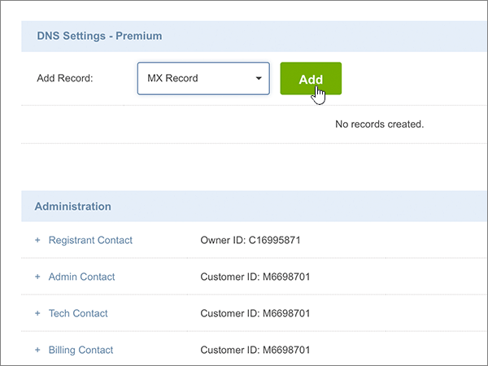
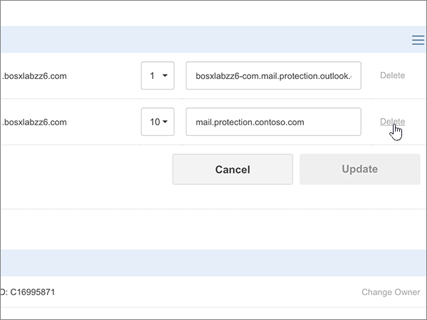

# Erstellen von DNS-Einträgen bei Crazy Domains für MicrosoftCreate DNS records at Crazy Domains for Microsoft

 **[Überprüfen Sie die häufig gestellten Fragen (FAQ) zu Domänen](../setup/domains-faq.md)**, wenn Sie nicht finden, wonach Sie suchen.**[Check the Domains FAQ](../setup/domains-faq.md)** if you don't find what you're looking for. 
  
Wenn Crazy Domains Ihr DNS-Hostinganbieter ist, führen Sie die in diesem Artikel aufgeführten Schritte aus, um Ihre Domäne zu überprüfen und DNS-Einträge für E-Mail, Skype for Business Online und andere Dienste einzurichten.If Crazy Domains is your DNS hosting provider, follow the steps in this article to verify your domain and set up DNS records for email, Skype for Business Online, and so on.
  
Nachdem Sie diese Einträge bei Crazy Domains hinzugefügt haben, ist Ihre Domäne für die Verwendung mit Microsoft-Diensten eingerichtet.After you add these records at Crazy Domains, your domain will be set up to work with Microsoft services.
  

  
> [!NOTE]
> Normalerweise dauert es ungefähr 15 Minuten, bis DNS-Änderungen wirksam werden. Es kann jedoch gelegentlich länger dauern, bis eine von Ihnen vorgenommene Änderung im Internet im DNS-System aktualisiert wurde. Wenn nach dem Hinzufügen von DNS-Einträgen Probleme mit dem E-Mail-Fluss oder andere Probleme auftreten, lesen Sie [Behandeln von Problemen nach Änderung des Domänennamens oder von DNS-Einträgen](../get-help-with-domains/find-and-fix-issues.md).Typically it takes about 15 minutes for DNS changes to take effect. However, it can occasionally take longer for a change you've made to update across the Internet's DNS system. If you're having trouble with mail flow or other issues after adding DNS records, see [Troubleshoot issues after changing your domain name or DNS records](../get-help-with-domains/find-and-fix-issues.md). 
  
## Hinzufügen eines TXT-Eintrags zur ÜberprüfungAdd a TXT record for verification

Bevor Sie Ihre Domäne mit Microsoft verwenden können, müssen wir uns vergewissern, dass Sie deren Besitzer sind. Ihre Fähigkeit, sich bei Ihrem Konto bei Ihrer Domänenregistrierungsstelle anzumelden und den DNS-Eintrag zu erstellen, ist für Microsoft der Nachweis, dass Sie der Besitzer der Domäne sind.Before you use your domain with Microsoft, we have to make sure that you own it. Your ability to log in to your account at your domain registrar and create the DNS record proves to Microsoft that you own the domain.
  
> [!NOTE]
> Dieser Eintrag wird nur verwendet, um zu überprüfen, ob Sie der Besitzer Ihrer Domäne sind. Er hat keine weiteren Auswirkungen. Sie können ihn später ggf. löschen.This record is used only to verify that you own your domain; it doesn't affect anything else. You can delete it later, if you like. 
  
1. Um zu beginnen, navigieren Sie über [diesen Link](https://manage.crazydomains.com/members/domains/) zu Ihrer Domänenseite bei Crazy Domains. Sie werden aufgefordert, sich zuerst anzumelden.To get started, go to your domains page at Crazy Domains by using [this link](https://manage.crazydomains.com/members/domains/). You'll be prompted to log in first.
    
    
  
2. Wählen Sie im Abschnitt **mein Konto** die Option **Domänen**aus.In the **My Account** section, select **Domains**.
    
    
  
3. Wählen Sie auf der Seite **Domänennamen** im Abschnitt **Domäne** den Namen der Domäne aus, die Sie aktualisieren möchten.On the **Domain Names** page, in the **Domain** section, select the name of the domain that you are updating. 
    
    
  
4. Wählen Sie im Abschnitt **DNS-Einstellungen** das Dropdownlisten-Symbol aus.In the **DNS Settings** section, select the drop-down list icon. 
    
    
  
5. Wählen Sie **Add Record** (Eintrag hinzufügen) aus.Select **Add Record**.
    
    
  
6. Wählen Sie in der Dropdownliste **Add Record** den Eintrag **TXT Record** aus.Choose **TXT Record** from the **Add Record** drop-down list. 
    
    
  
7. Klicken Sie auf **Hinzufügen**.Select **Add**.
    
    
  
8. Geben Sie in den Feldern für den neuen Eintrag die Werte aus der folgenden Tabelle ein. Sie können die Werte auch kopieren und einfügen.In the boxes for the new record, type or copy and paste the values from the following table.
    
    |**Sub Domain****Sub Domain**|**Text Record****Text Record**|
    |:-----|:-----|
    |(Dieses Feld leer lassen.)(Leave this field empty.)    |MS=ms *XXXXXXXX*MS=ms *XXXXXXXX*    **Hinweis:** Dies ist ein Beispiel.**Note:** This is an example. Verwenden Sie hier Ihre spezifischen **Ziel-oder Punkt-zu-Adresse** -Werte aus der Tabelle.Use your specific **Destination or Points to Address** value here, from the table.           [Wie finde ich diese Angabe?How do I find this?](../get-help-with-domains/information-for-dns-records.md)          |
   
    
  
9. Wählen Sie **Aktualisieren** aus.Select **Update**.
    
    
  
10. Warten Sie einige Minuten, bevor Sie fortfahren, damit der soeben erstellte Eintrag im Internet aktualisiert werden kann.Wait a few minutes before you continue, so that the record you just created can update across the Internet.
    
Nachdem Sie den Eintrag auf der Website Ihrer Domänenregistrierungsstelle hinzugefügt haben, kehren Sie zu Microsoft zurück und fordern Sie den Eintrag an.Now that you've added the record at your domain registrar's site, you'll go back to Microsoft and request the record.
  
Wenn Microsoft den richtigen TXT-Eintrag findet, ist die Domäne überprüft.When Microsoft finds the correct TXT record, your domain is verified.
  
1. Wechseln Sie im Microsoft Admin Center zur Seite **Einstellungen** \> <a href="https://go.microsoft.com/fwlink/p/?linkid=834818" target="_blank">Domänen</a>.In the Microsoft admin center, go to the **Settings** \> <a href="https://go.microsoft.com/fwlink/p/?linkid=834818" target="_blank">Domains</a> page.

    
2. Wählen Sie auf der Seite **Domänen** die zu überprüfende Domäne aus.On the **Domains** page, select the domain that you are verifying. 
    
    
  
3. Wählen Sie auf der Seite **Setup** die Option **Setup starten** aus.On the **Setup** page, select **Start setup**.
    
    
  
4. Wählen Sie auf der Seite **Domäne überprüfen** die Option **Überprüfen** aus.On the **Verify domain** page, select **Verify**.
    
    
  
> [!NOTE]
>  Normalerweise dauert es ungefähr 15 Minuten, bis DNS-Änderungen wirksam werden. Es kann jedoch gelegentlich länger dauern, bis eine von Ihnen vorgenommene Änderung im Internet im DNS-System aktualisiert wurde. Wenn nach dem Hinzufügen von DNS-Einträgen Probleme mit dem E-Mail-Fluss oder andere Probleme auftreten, lesen Sie [Behandeln von Problemen nach Änderung des Domänennamens oder von DNS-Einträgen](../get-help-with-domains/find-and-fix-issues.md).Typically it takes about 15 minutes for DNS changes to take effect. However, it can occasionally take longer for a change you've made to update across the Internet's DNS system. If you're having trouble with mail flow or other issues after adding DNS records, see [Troubleshoot issues after changing your domain name or DNS records](../get-help-with-domains/find-and-fix-issues.md). 
  
## Fügen Sie einen MX-Eintrag hinzu, damit E-Mails für Ihre Domäne an Microsoft geleitet werden.Add an MX record so email for your domain will come to Microsoft

1. Um zu beginnen, navigieren Sie über [diesen Link](https://manage.crazydomains.com/members/domains/) zu Ihrer Domänenseite bei Crazy Domains. Sie werden aufgefordert, sich zuerst anzumelden.To get started, go to your domains page at Crazy Domains by using [this link](https://manage.crazydomains.com/members/domains/). You'll be prompted to log in first.
    
    
  
2. Wählen Sie im Abschnitt **mein Konto** die Option **Domänen**aus.In the **My Account** section, select **Domains**.
    
    
  
3. Wählen Sie auf der Seite **Domänennamen** im Abschnitt **Domäne** den Namen der Domäne aus, die Sie aktualisieren möchten.On the **Domain Names** page, in the **Domain** section, select the name of the domain that you are updating. 
    
    
  
4. Wählen Sie im Abschnitt **DNS-Einstellungen** das Dropdownlisten-Symbol aus.In the **DNS Settings** section, select the drop-down list icon. 
    
    
  
5. Wählen Sie **Add Record** (Eintrag hinzufügen) aus.Select **Add Record**.
    
    
  
6. Wählen Sie in der Dropdownliste **Add Record:** den Eintrag **MX Record** aus.Choose **MX Record** from the **Add Record:** drop-down list. 
    
    
  
7. Klicken Sie auf **Hinzufügen**.Select **Add**.
    
    
  
8. Geben Sie in den Feldern für den neuen Eintrag die Werte aus der folgenden Tabelle ein. Sie können die Werte auch kopieren und einfügen.In the boxes for the new record, type or copy and paste the values from the following table.
    
    (Wählen Sie in der Dropdownliste den Wert **Priority** aus.)(Choose the **Priority** value from the drop-down list.) 
    
    |**Mail For Zone****Mail For Zone**|**Priority****Priority**|**Assigned To Server****Assigned To Server**|
    |:-----|:-----|:-----|
    |(Dieses Feld leer lassen.)(Leave this field empty.)    |11    Weitere Informationen zur Priorität finden Sie unter [Was ist MX-Priorität?](https://support.office.com/article/2784cc4d-95be-443d-b5f7-bb5dd867ba83.aspx)For more information about priority, see [What is MX priority?](https://support.office.com/article/2784cc4d-95be-443d-b5f7-bb5dd867ba83.aspx)   | *\<Domänenschlüssel\>*  .mail.protection.outlook.com*\<domain-key\>*  .mail.protection.outlook.com    **Hinweis:** Rufen Sie Ihren \* \<Domänenschlüssel\> \* von Ihrem Microsoft-Konto ab.**Note:** Get your  *\<domain-key\>*  from your Microsoft account.           [Wie finde ich diese Angabe?How do I find this?](../get-help-with-domains/information-for-dns-records.md)          |
       
   
  
9. Wählen Sie **Aktualisieren** aus.Select **Update**.
    
    
  
10. Wenn im Abschnitt **MX Record** andere MX-Einträge aufgeführt sind, wählen Sie für einen dieser Einträge die Option **Modify** aus.If there are any other MX records listed in the **MX Record** section, select **Modify** for one of those records. 
    
    
  
11. Wählen Sie **Löschen** aus.Select **Delete**.
    
    
  
12. Wählen Sie **Aktualisieren** aus, um den Löschvorgang zu bestätigen.Select **Update** to confirm the deletion. 
    
    
  
13. Wiederholen Sie diesen Vorgang, um alle anderen MX-Einträge aus der Liste zu entfernen, bis nur noch der Eintrag übrig ist, den Sie zuvor in diesem Verfahren hinzugefügt haben.Use the same process to remove any other MX records in the list, until only the one that you added earlier in this procedure remains.
    
## Hinzufügen der sechs CNAME-Einträge, die für Microsoft erforderlich sindAdd the six CNAME records that are required for Microsoft

1. Um zu beginnen, navigieren Sie über [diesen Link](https://manage.crazydomains.com/members/domains/) zu Ihrer Domänenseite bei Crazy Domains. Sie werden aufgefordert, sich zuerst anzumelden.To get started, go to your domains page at Crazy Domains by using [this link](https://manage.crazydomains.com/members/domains/). You'll be prompted to log in first.
    
    
  
2. Wählen Sie im Abschnitt **mein Konto** die Option **Domänen**aus.In the **My Account** section, select **Domains**.
    
    
  
3. Wählen Sie auf der Seite **Domänennamen** im Abschnitt **Domäne** den Namen der Domäne aus, die Sie aktualisieren möchten.On the **Domain Names** page, in the **Domain** section, select the name of the domain that you are updating. 
    
    
  
4. Wählen Sie im Abschnitt **DNS-Einstellungen** das Dropdownlisten-Symbol aus.In the **DNS Settings** section, select the drop-down list icon. 
    
    
  
5. Wählen Sie **Add Record** (Eintrag hinzufügen) aus.Select **Add Record**.
    
    
  
6. Wählen Sie in der Dropdownliste **Add Record** den Eintrag **CNAME Record** aus.Choose **CNAME Record** from the **Add Record:** drop-down list. 
    
    
  
7. Klicken Sie auf **Hinzufügen**.Select **Add**.
    
    
  
8. Fügen Sie den ersten der sechs CNAME-Einträge hinzu.Add the first of the six CNAME records.
    
    Geben Sie in den Feldern für den neuen Eintrag die Werte aus der ersten Zeile der folgenden Tabelle ein. Sie können die Werte auch kopieren und einfügen.In the boxes for the new record, type or copy and paste the values from the first row of the following table.
    
    |**Sub Domain****Sub Domain**|**Alias for****Alias for**|
    |:-----|:-----|
    |autodiscoverautodiscover    |autodiscover.outlook.comautodiscover.outlook.com    |
    |sipsip    |sipdir.online.lync.comsipdir.online.lync.com    |
    |lyncdiscoverlyncdiscover    |webdir.online.lync.comwebdir.online.lync.com    |
    |enterpriseregistrationenterpriseregistration    |enterpriseregistration.windows.netenterpriseregistration.windows.net    |
    |enterpriseenrollmententerpriseenrollment    |enterpriseenrollment-s.manage.microsoft.comenterpriseenrollment-s.manage.microsoft.com    |
   
    
  
9. Wählen Sie **CNAME-Eintrag hinzufügen**aus.Select **Add CNAME Record**.
    
    
  
10. Fügen Sie den zweiten CNAME-Eintrag hinzu.Add the second CNAME record.
    
    Verwenden Sie in den Feldern für den neuen Datensatz die Werte aus der nächsten Zeile in der Tabelle, und wählen Sie dann erneut **CNAME-Eintrag hinzufügen**aus.In the boxes for the new record, use the values from the next row in the table, and then again select **Add CNAME Record**.
    
    Wiederholen Sie diesen Vorgang, bis Sie alle sechs CNAME-Einträge erstellt haben.Repeat this process until you have created all six CNAME records.
    
11. Wählen Sie **Aktualisieren** aus, um die Änderungen zu speichern.Select **Update** to save your changes. 
    
    
  
## Hinzufügen eines TXT-Eintrags für SPF, um E-Mail-Spam zu verhindernAdd a TXT record for SPF to help prevent email spam

> [!IMPORTANT]
> Es kann bei einer Domäne nur einen TXT-Eintrag für SPF geben.You cannot have more than one TXT record for SPF for a domain. Wenn es bei Ihrer Domäne mehrere SPF-Einträge gibt, treten E-Mail-Fehler sowie Probleme bei der Übermittlung und Spamklassifizierung auf.If your domain has more than one SPF record, you'll get email errors, as well as delivery and spam classification issues. Wenn es für Ihre Domäne bereits einen SPF-Eintrag gibt, erstellen Sie für Microsoft keinen neuen,If you already have an SPF record for your domain, don't create a new one for Microsoft. Fügen Sie stattdessen die erforderlichen Microsoft-Werte zum aktuellen Datensatz hinzu, sodass Sie einen *einzelnen* SPF-Eintrag haben, der beide Wertegruppen enthält.Instead, add the required Microsoft values to the current record so that you have a  *single*  SPF record that includes both sets of values. 
  
1. Um zu beginnen, navigieren Sie über [diesen Link](https://manage.crazydomains.com/members/domains/) zu Ihrer Domänenseite bei Crazy Domains. Sie werden aufgefordert, sich zuerst anzumelden.To get started, go to your domains page at Crazy Domains by using [this link](https://manage.crazydomains.com/members/domains/). You'll be prompted to log in first.
    
    
  
2. Wählen Sie im Abschnitt **mein Konto** die Option **Domänen**aus.In the **My Account** section, select **Domains**.
    
    
  
3. Wählen Sie auf der Seite **Domänennamen** im Abschnitt **Domäne** den Namen der Domäne aus, die Sie aktualisieren möchten.On the **Domain Names** page, in the **Domain** section, select the name of the domain that you are updating. 
    
    
  
4. Wählen Sie im Abschnitt **DNS-Einstellungen** das Dropdownlisten-Symbol aus.In the **DNS Settings** section, select the drop-down list icon. 
    
    
  
5. Wählen Sie **Add Record** (Eintrag hinzufügen) aus.Select **Add Record**.
    
    
  
6. Wählen Sie in der Dropdownliste **Add Record:** den Eintrag **TXT Record** aus.Choose **TXT Record** from the **Add Record:** drop-down list. 
    
    
  
7. Klicken Sie auf **Hinzufügen**.Select **Add**.
    
    
  
8. Geben Sie in den Feldern für den neuen Eintrag die Werte aus der folgenden Tabelle ein. Sie können die Werte auch kopieren und einfügen.In the boxes for the new record, type or paste the values from the following table.
    
    |**Sub Domain****Sub Domain**|**Text Record****Text Record**|
    |:-----|:-----|
    |(Dieses Feld leer lassen.)(Leave this field empty.)    |v=spf1 include:spf.protection.outlook.com -allv=spf1 include:spf.protection.outlook.com -all    **Hinweis:** Es wird empfohlen, diesen Eintrag zu kopieren und einzufügen, damit alle Abstände korrekt übernommen werden.**Note:** We recommend copying and pasting this entry, so that all of the spacing stays correct.           |
   
    
  
9. Wählen Sie **Aktualisieren** aus.Select **Update**.
    
    
  
## Hinzufügen der für Microsoft erforderlichen zwei SRV-EinträgeAdd the two SRV records that are required for Microsoft

1. Um zu beginnen, navigieren Sie über [diesen Link](https://manage.crazydomains.com/members/domains/) zu Ihrer Domänenseite bei Crazy Domains. Sie werden aufgefordert, sich zuerst anzumelden.To get started, go to your domains page at Crazy Domains by using [this link](https://manage.crazydomains.com/members/domains/). You'll be prompted to log in first.
    
    
  
2. Wählen Sie im Abschnitt **mein Konto** die Option **Domänen**aus.In the **My Account** section, select **Domains**.
    
    
  
3. Wählen Sie auf der Seite **Domänennamen** im Abschnitt **Domäne** den Namen der Domäne aus, die Sie aktualisieren möchten.On the **Domain Names** page, in the **Domain** section, select the name of the domain that you are updating. 
    
    
  
4. Wählen Sie im Abschnitt **DNS-Einstellungen** das Dropdownlisten-Symbol aus.In the **DNS Settings** section, select the drop-down list icon. 
    
    
  
5. Wählen Sie **Add Record** (Eintrag hinzufügen) aus.Select **Add Record**.
    
    
  
6. Wählen Sie in der Dropdownliste **Add Record:** den Eintrag **SRV Record** aus.Choose **SRV Record** from the **Add Record:** drop-down list. 
    
    
  
7. Klicken Sie auf **Hinzufügen**.Select **Add**.
    
    
  
8. Fügen Sie den ersten der zwei SRV-Einträge hinzu.Add the first of the two SRV records.
    
    Geben Sie in den Feldern für den neuen Eintrag die Werte aus der ersten Zeile der folgenden Tabelle ein. Sie können die Werte auch kopieren und einfügen.In the boxes for the new record, type or copy and paste the values from the first row of the following table.
    
    |**Record Type****Record Type**|**Sub Domain****Sub Domain**|**Priority****Priority**|**Weight****Weight**|**Port****Port**|**Target****Target**|
    |:-----|:-----|:-----|:-----|:-----|:-----|
    |SRV-EintragSRV Record    |_sip._tls_sip._tls    |100100    |11    |443443    |sipdir.online.lync.comsipdir.online.lync.com    |
    |SRV RecordSRV Record    |_sipfederationtls._tcp_sipfederationtls._tcp    |100100    |11    |50615061    |sipfed.online.lync.comsipfed.online.lync.com    |
   
    
  
9. Wählen Sie **SRV-Eintrag hinzufügen**aus.Select **Add SRV Record**.
    
    
  
10. Fügen Sie den anderen SRV-Eintrag hinzu.Add the other SRV record.
    
    Geben Sie in den Feldern für den neuen Eintrag die Werte aus der zweiten Zeile der Tabelle ein.In the boxes for the new record, use the values from the second row in the table.
    
11. Wählen Sie **Aktualisieren** aus, um die Änderungen zu speichern.Select **Update** to save your changes. 
    
    
  
> [!NOTE]
> Normalerweise dauert es ungefähr 15 Minuten, bis DNS-Änderungen wirksam werden. Es kann jedoch gelegentlich länger dauern, bis eine von Ihnen vorgenommene Änderung im Internet im DNS-System aktualisiert wurde. Wenn nach dem Hinzufügen von DNS-Einträgen Probleme mit dem E-Mail-Fluss oder andere Probleme auftreten, lesen Sie [Behandeln von Problemen nach Änderung des Domänennamens oder von DNS-Einträgen](../get-help-with-domains/find-and-fix-issues.md).Typically it takes about 15 minutes for DNS changes to take effect. However, it can occasionally take longer for a change you've made to update across the Internet's DNS system. If you're having trouble with mail flow or other issues after adding DNS records, see [Troubleshoot issues after changing your domain name or DNS records](../get-help-with-domains/find-and-fix-issues.md). 
  
