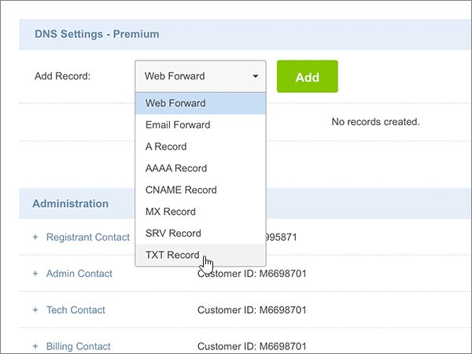

# Erstellen von DNS-Einträgen bei Crazy Domains für Microsoft

 **[Überprüfen Sie die häufig gestellten Fragen (FAQ) zu Domänen](../setup/domains-faq.md)**, wenn Sie nicht finden, wonach Sie suchen. 
  
Wenn Crazy Domains Ihr DNS-Hostinganbieter ist, führen Sie die in diesem Artikel aufgeführten Schritte aus, um Ihre Domäne zu überprüfen und DNS-Einträge für E-Mail, Skype for Business Online und andere Dienste einzurichten.
  
Nachdem Sie diese Einträge bei Crazy Domains hinzugefügt haben, ist Ihre Domäne für die Verwendung mit Microsoft-Diensten eingerichtet.
  

  
> [!NOTE]
> Normalerweise dauert es ungefähr 15 Minuten, bis DNS-Änderungen wirksam werden. Es kann jedoch gelegentlich länger dauern, bis eine von Ihnen vorgenommene Änderung im Internet im DNS-System aktualisiert wurde. Wenn nach dem Hinzufügen von DNS-Einträgen Probleme mit dem E-Mail-Fluss oder andere Probleme auftreten, lesen Sie [Behandeln von Problemen nach Änderung des Domänennamens oder von DNS-Einträgen](../get-help-with-domains/find-and-fix-issues.md). 
  
## Hinzufügen eines TXT-Eintrags zur Überprüfung

Bevor Sie Ihre Domäne mit Microsoft verwenden können, müssen wir uns vergewissern, dass Sie deren Besitzer sind. Ihre Fähigkeit, sich bei Ihrem Konto bei Ihrer Domänenregistrierungsstelle anzumelden und den DNS-Eintrag zu erstellen, ist für Microsoft der Nachweis, dass Sie der Besitzer der Domäne sind.
  
> [!NOTE]
> Dieser Eintrag wird nur verwendet, um zu überprüfen, ob Sie der Besitzer Ihrer Domäne sind. Er hat keine weiteren Auswirkungen. Sie können ihn später ggf. löschen. 
  
1. Um zu beginnen, navigieren Sie über [diesen Link](https://manage.crazydomains.com/members/domains/) zu Ihrer Domänenseite bei Crazy Domains. Sie werden aufgefordert, sich zuerst anzumelden.
    
    
  
2. Wählen Sie im Abschnitt **mein Konto** die Option **Domänen**aus.
    
    
  
3. Wählen Sie auf der Seite **Domänennamen** im Abschnitt **Domäne** den Namen der Domäne aus, die Sie aktualisieren möchten. 
    
    
  
4. Wählen Sie im Abschnitt **DNS-Einstellungen** das Dropdownlisten-Symbol aus. 
    
    
  
5. Wählen Sie **Add Record** (Eintrag hinzufügen) aus.
    
    
  
6. Wählen Sie in der Dropdownliste **Add Record** den Eintrag **TXT Record** aus. 
    
    
  
7. Klicken Sie auf **Hinzufügen**.
    
    
  
8. Geben Sie in den Feldern für den neuen Eintrag die Werte aus der folgenden Tabelle ein. Sie können die Werte auch kopieren und einfügen.
    
    |**Sub Domain**|**Text Record**|
    |:-----|:-----|
    |(Dieses Feld leer lassen.)    |MS=ms *XXXXXXXX*    **Hinweis:** Dies ist ein Beispiel. Verwenden Sie hier Ihre spezifischen **Ziel-oder Punkt-zu-Adresse** -Werte aus der Tabelle.           [Wie finde ich diese Angabe?](../get-help-with-domains/information-for-dns-records.md)          |
   
    
  
9. Wählen Sie **Aktualisieren** aus.
    
    
  
10. Warten Sie einige Minuten, bevor Sie fortfahren, damit der soeben erstellte Eintrag im Internet aktualisiert werden kann.
    
Nachdem Sie den Eintrag auf der Website Ihrer Domänenregistrierungsstelle hinzugefügt haben, kehren Sie zu Microsoft zurück und fordern Sie den Eintrag an.
  
Wenn Microsoft den richtigen TXT-Eintrag findet, ist die Domäne überprüft.
  
1. Wechseln Sie im Microsoft Admin Center zur Seite **Einstellungen** \> <a href="https://go.microsoft.com/fwlink/p/?linkid=834818" target="_blank">Domänen</a>.

    
2. Wählen Sie auf der Seite **Domänen** die zu überprüfende Domäne aus. 
    
    
  
3. Wählen Sie auf der Seite **Setup** die Option **Setup starten** aus.
    
    
  
4. Wählen Sie auf der Seite **Domäne überprüfen** die Option **Überprüfen** aus.
    
    
  
> [!NOTE]
>  Normalerweise dauert es ungefähr 15 Minuten, bis DNS-Änderungen wirksam werden. Es kann jedoch gelegentlich länger dauern, bis eine von Ihnen vorgenommene Änderung im Internet im DNS-System aktualisiert wurde. Wenn nach dem Hinzufügen von DNS-Einträgen Probleme mit dem E-Mail-Fluss oder andere Probleme auftreten, lesen Sie [Behandeln von Problemen nach Änderung des Domänennamens oder von DNS-Einträgen](../get-help-with-domains/find-and-fix-issues.md). 
  
## Fügen Sie einen MX-Eintrag hinzu, damit E-Mails für Ihre Domäne an Microsoft geleitet werden.

1. Um zu beginnen, navigieren Sie über [diesen Link](https://manage.crazydomains.com/members/domains/) zu Ihrer Domänenseite bei Crazy Domains. Sie werden aufgefordert, sich zuerst anzumelden.
    
    
  
2. Wählen Sie im Abschnitt **mein Konto** die Option **Domänen**aus.
    
    
  
3. Wählen Sie auf der Seite **Domänennamen** im Abschnitt **Domäne** den Namen der Domäne aus, die Sie aktualisieren möchten. 
    
    
  
4. Wählen Sie im Abschnitt **DNS-Einstellungen** das Dropdownlisten-Symbol aus. 
    
    
  
5. Wählen Sie **Add Record** (Eintrag hinzufügen) aus.
    
    
  
6. Wählen Sie in der Dropdownliste **Add Record:** den Eintrag **MX Record** aus. 
    
    
  
7. Klicken Sie auf **Hinzufügen**.
    
    
  
8. Geben Sie in den Feldern für den neuen Eintrag die Werte aus der folgenden Tabelle ein. Sie können die Werte auch kopieren und einfügen.
    
    (Wählen Sie in der Dropdownliste den Wert **Priority** aus.) 
    
    |**Mail For Zone**|**Priority**|**Assigned To Server**|
    |:-----|:-----|:-----|
    |(Dieses Feld leer lassen.)    |1     Weitere Informationen zur Priorität finden Sie unter [Was ist MX-Priorität?](https://docs.microsoft.com/microsoft-365/admin/setup/domains-faq)   | *\<domain-key\>*. Mail.Protection.Outlook.com    **Hinweis:** Holen Sie sich Ihr *\<domain-key\>* Microsoft-Konto.           [Wie finde ich diese Angabe?](../get-help-with-domains/information-for-dns-records.md)          |
       
   
  
9. Wählen Sie **Aktualisieren** aus.
    
    
  
10. Wenn im Abschnitt **MX Record** andere MX-Einträge aufgeführt sind, wählen Sie für einen dieser Einträge die Option **Modify** aus. 
    
    
  
11. Wählen Sie **Löschen** aus.
    
    
  
12. Wählen Sie **Aktualisieren** aus, um den Löschvorgang zu bestätigen. 
    
    
  
13. Wiederholen Sie diesen Vorgang, um alle anderen MX-Einträge aus der Liste zu entfernen, bis nur noch der Eintrag übrig ist, den Sie zuvor in diesem Verfahren hinzugefügt haben.
    
## Hinzufügen der sechs CNAME-Einträge, die für Microsoft erforderlich sind

1. Um zu beginnen, navigieren Sie über [diesen Link](https://manage.crazydomains.com/members/domains/) zu Ihrer Domänenseite bei Crazy Domains. Sie werden aufgefordert, sich zuerst anzumelden.
    
    
  
2. Wählen Sie im Abschnitt **mein Konto** die Option **Domänen**aus.
    
    
  
3. Wählen Sie auf der Seite **Domänennamen** im Abschnitt **Domäne** den Namen der Domäne aus, die Sie aktualisieren möchten. 
    
    
  
4. Wählen Sie im Abschnitt **DNS-Einstellungen** das Dropdownlisten-Symbol aus. 
    
    
  
5. Wählen Sie **Add Record** (Eintrag hinzufügen) aus.
    
    
  
6. Wählen Sie in der Dropdownliste **Add Record** den Eintrag **CNAME Record** aus. 
    
    
  
7. Klicken Sie auf **Hinzufügen**.
    
    
  
8. Fügen Sie den ersten der sechs CNAME-Einträge hinzu.
    
    Geben Sie in den Feldern für den neuen Eintrag die Werte aus der ersten Zeile der folgenden Tabelle ein. Sie können die Werte auch kopieren und einfügen.
    
    |**Sub Domain**|**Alias for**|
    |:-----|:-----|
    |autodiscover    |autodiscover.outlook.com    |
    |sip    |sipdir.online.lync.com    |
    |lyncdiscover    |webdir.online.lync.com    |
    |enterpriseregistration    |enterpriseregistration.windows.net    |
    |enterpriseenrollment    |enterpriseenrollment-s.manage.microsoft.com    |
   
    
  
9. Wählen Sie **CNAME-Eintrag hinzufügen**aus.
    
    
  
10. Fügen Sie den zweiten CNAME-Eintrag hinzu.
    
    Verwenden Sie in den Feldern für den neuen Datensatz die Werte aus der nächsten Zeile in der Tabelle, und wählen Sie dann erneut **CNAME-Eintrag hinzufügen**aus.
    
    Wiederholen Sie diesen Vorgang, bis Sie alle sechs CNAME-Einträge erstellt haben.
    
11. Wählen Sie **Aktualisieren** aus, um die Änderungen zu speichern. 
    
    
  
## Hinzufügen eines TXT-Eintrags für SPF, um E-Mail-Spam zu verhindern

> [!IMPORTANT]
> Es kann bei einer Domäne nur einen TXT-Eintrag für SPF geben. Wenn es bei Ihrer Domäne mehrere SPF-Einträge gibt, treten E-Mail-Fehler sowie Probleme bei der Übermittlung und Spamklassifizierung auf. Wenn es für Ihre Domäne bereits einen SPF-Eintrag gibt, erstellen Sie für Microsoft keinen neuen, Fügen Sie stattdessen die erforderlichen Microsoft-Werte zum aktuellen Datensatz hinzu, sodass Sie einen *einzelnen* SPF-Eintrag haben, der beide Wertegruppen enthält. 
  
1. Um zu beginnen, navigieren Sie über [diesen Link](https://manage.crazydomains.com/members/domains/) zu Ihrer Domänenseite bei Crazy Domains. Sie werden aufgefordert, sich zuerst anzumelden.
    
    
  
2. Wählen Sie im Abschnitt **mein Konto** die Option **Domänen**aus.
    
    
  
3. Wählen Sie auf der Seite **Domänennamen** im Abschnitt **Domäne** den Namen der Domäne aus, die Sie aktualisieren möchten. 
    
    
  
4. Wählen Sie im Abschnitt **DNS-Einstellungen** das Dropdownlisten-Symbol aus. 
    
    
  
5. Wählen Sie **Add Record** (Eintrag hinzufügen) aus.
    
    
  
6. Wählen Sie in der Dropdownliste **Add Record:** den Eintrag **TXT Record** aus. 
    
    
  
7. Klicken Sie auf **Hinzufügen**.
    
    
  
8. Geben Sie in den Feldern für den neuen Eintrag die Werte aus der folgenden Tabelle ein. Sie können die Werte auch kopieren und einfügen.
    
    |**Sub Domain**|**Text Record**|
    |:-----|:-----|
    |(Dieses Feld leer lassen.)    |v=spf1 include:spf.protection.outlook.com -all    **Hinweis:** Es wird empfohlen, diesen Eintrag zu kopieren und einzufügen, damit alle Abstände korrekt übernommen werden.           |
   
    
  
9. Wählen Sie **Aktualisieren** aus.
    
    
  
## Hinzufügen der für Microsoft erforderlichen zwei SRV-Einträge

1. Um zu beginnen, navigieren Sie über [diesen Link](https://manage.crazydomains.com/members/domains/) zu Ihrer Domänenseite bei Crazy Domains. Sie werden aufgefordert, sich zuerst anzumelden.
    
    
  
2. Wählen Sie im Abschnitt **mein Konto** die Option **Domänen**aus.
    
    
  
3. Wählen Sie auf der Seite **Domänennamen** im Abschnitt **Domäne** den Namen der Domäne aus, die Sie aktualisieren möchten. 
    
    
  
4. Wählen Sie im Abschnitt **DNS-Einstellungen** das Dropdownlisten-Symbol aus. 
    
    
  
5. Wählen Sie **Add Record** (Eintrag hinzufügen) aus.
    
    
  
6. Wählen Sie in der Dropdownliste **Add Record:** den Eintrag **SRV Record** aus. 
    
    
  
7. Klicken Sie auf **Hinzufügen**.
    
    
  
8. Fügen Sie den ersten der zwei SRV-Einträge hinzu.
    
    Geben Sie in den Feldern für den neuen Eintrag die Werte aus der ersten Zeile der folgenden Tabelle ein. Sie können die Werte auch kopieren und einfügen.
    
    |**Record Type**|**Sub Domain**|**Priority**|**Weight**|**Port**|**Target**|
    |:-----|:-----|:-----|:-----|:-----|:-----|
    |SRV-Eintrag    |_sip._tls    |100    |1     |443    |sipdir.online.lync.com    |
    |SRV Record    |_sipfederationtls._tcp    |100    |1     |5061    |sipfed.online.lync.com    |
   
    
  
9. Wählen Sie **SRV-Eintrag hinzufügen**aus.
    
    
  
10. Fügen Sie den anderen SRV-Eintrag hinzu.
    
    Geben Sie in den Feldern für den neuen Eintrag die Werte aus der zweiten Zeile der Tabelle ein.
    
11. Wählen Sie **Aktualisieren** aus, um die Änderungen zu speichern. 
    
    
  
> [!NOTE]
> Normalerweise dauert es ungefähr 15 Minuten, bis DNS-Änderungen wirksam werden. Es kann jedoch gelegentlich länger dauern, bis eine von Ihnen vorgenommene Änderung im Internet im DNS-System aktualisiert wurde. Wenn nach dem Hinzufügen von DNS-Einträgen Probleme mit dem E-Mail-Fluss oder andere Probleme auftreten, lesen Sie [Behandeln von Problemen nach Änderung des Domänennamens oder von DNS-Einträgen](../get-help-with-domains/find-and-fix-issues.md). 
  
