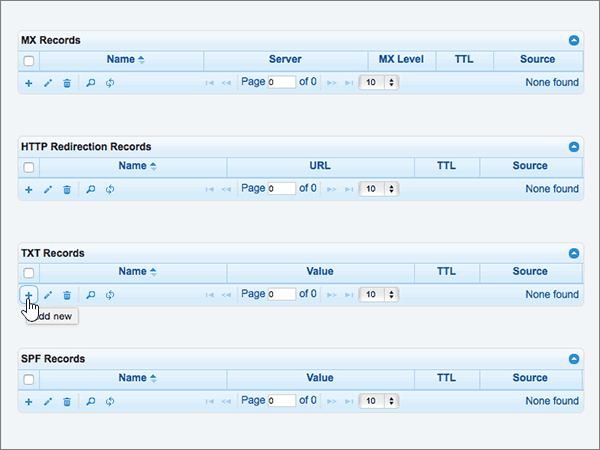

# Erstellen von DNS-Einträgen bei DNSMadeEasy für MicrosoftCreate DNS records at DNSMadeEasy for Microsoft

 **[Überprüfen Sie die häufig gestellten Fragen (FAQ) zu Domänen](../setup/domains-faq.md)**, wenn Sie nicht finden, wonach Sie suchen.**[Check the Domains FAQ](../setup/domains-faq.md)** if you don't find what you're looking for. 
  
Wenn DNSMadeEasy Ihr DNS-Hostinganbieter ist, führen Sie die in diesem Artikel aufgeführten Schritte aus, um Ihre Domäne zu überprüfen und DNS-Einträge für E-Mail, Skype for Business Online und andere Dienste einzurichten.If DNSMadeEasy is your DNS hosting provider, follow the steps in this article to verify your domain and set up DNS records for email, Skype for Business Online, and so on.
  
Nachdem Sie diese Einträge bei DNSMadeEasy hinzugefügt haben, ist Ihre Domäne für die Verwendung mit Microsoft-Diensten eingerichtet.After you add these records at DNSMadeEasy, your domain will be set up to work with Microsoft services.
  
Informationen über Webhosting und DNS für Websites mit Microsoft finden Sie unter [Verwenden einer öffentlichen Website mit Microsoft](https://support.office.com/article/choose-a-public-website-3325d50e-d131-403c-a278-7f3296fe33a9).To learn about webhosting and DNS for websites with Microsoft, see [Use a public website with Microsoft](https://support.office.com/article/choose-a-public-website-3325d50e-d131-403c-a278-7f3296fe33a9).
  
> [!NOTE]
> Normalerweise dauert es ungefähr 15 Minuten, bis DNS-Änderungen wirksam werden. Es kann jedoch gelegentlich länger dauern, bis eine Änderung vorgenommen wurde, die Sie über das DNS-System des Internets aktualisiert haben. Wenn Sie Probleme mit dem Nachrichtenfluss oder anderen Problemen haben, nachdem Sie DNS-Einträge hinzugefügt haben, finden Sie unter [Suchen und Beheben von Problemen nach dem Hinzufügen Ihrer Domäne oder DNS-Einträge](../get-help-with-domains/find-and-fix-issues.md).Typically it takes about 15 minutes for DNS changes to take effect. However, it can occasionally take longer for a change you've made to update across the Internet's DNS system. If you're having trouble with mail flow or other issues after adding DNS records, see [Find and fix issues after adding your domain or DNS records](../get-help-with-domains/find-and-fix-issues.md). 
  
## Hinzufügen eines TXT-Eintrags zur ÜberprüfungAdd a TXT record for verification

Bevor Sie Ihre Domäne mit Microsoft verwenden, müssen wir sicherstellen, dass Sie Sie besitzen. Ihre Fähigkeit, sich bei Ihrem Konto bei Ihrer Domänenregistrierungsstelle anzumelden und den DNS-Eintrag zu erstellen, beweist Microsoft, dass Sie die Domäne besitzen.Before you use your domain with Microsoft, we have to make sure that you own it. Your ability to log in to your account at your domain registrar and create the DNS record proves to Microsoft that you own the domain.
  
> [!NOTE]
> Dieser Eintrag wird nur verwendet, um zu überprüfen, ob Sie der Besitzer Ihrer Domäne sind. Er hat keine weiteren Auswirkungen. Sie können ihn später ggf. löschen.This record is used only to verify that you own your domain; it doesn't affect anything else. You can delete it later, if you like. 
  
> [!IMPORTANT]
> Bei DNSMadeEasy-Konten wurde die Domäne, die Sie hinzugefügt haben, bei einer anderen Domänenregistrierungsstelle gekauft. DNSMadeEasy bietet keine Domänenregistrierungsdienste. Die Möglichkeit, sich bei DNSMadeEasy anzumelden und den DNS-Eintrag zu erstellen, ist als Nachweis des Besitzes ausreichend.For DNSMadeEasy accounts, the domain you added was purchased from a separate domain registrar. DNSMadeEasy does not offer domain registration services. Your ability to log in at DNSMadeEasy and create the DNS record is sufficient proof of ownership. 
  
1. Um zu beginnen, navigieren Sie über [diesen Link](https://cp.dnsmadeeasy.com/) zu Ihrer Domänenseite bei DNSMadeEasy. Sie werden aufgefordert, sich zuerst anzumelden.To get started, go to your domains page at DNSMadeEasy by using [this link](https://cp.dnsmadeeasy.com/). You'll be prompted to login first.
    
2. Wählen Sie auf der Seite **Verwaltungskonsole** im Bereich **der kürzlich aktualisierten Domänen** die Domäne aus, die Sie aktualisieren möchten.On the **Management Console** page, in the **Recently Updated Domains** area, select the domain that you want to update. 
    
3. Wählen Sie auf der Seite **Managed DNS** im Bereich **TXT Records** das Steuerelement (**+**) (**Add new**) aus.On the **Managed DNS** page, in the **TXT Records** area, select the ( **+**) control ( **Add new**).
    
    (Möglicherweise müssen Sie nach unten scrollen.)(You may have to scroll down.)
    
4. Geben Sie im Bereich **Add TXT Records** in den Feldern für den neuen Eintrag die Werte aus der folgenden Tabelle ein. Sie können die Werte auch kopieren und einfügen.In the **Add TXT Records** area, in the boxes for the new record, type or copy and paste the values from the following table. 
    
    ||||
    |:-----|:-----|:-----|
    |**Name****Name**   |**Wert****Value**   |**TTL****TTL**   |
    |(Dieses Feld leer lassen.)(Leave this field empty.)    |MS=ms *XXXXXXXX*MS=ms *XXXXXXXX*    **Hinweis:** Dies ist ein Beispiel. Verwenden Sie hier Ihre spezifischen **Ziel-oder Punkt-zu-Adresse** -Werte aus der Tabelle. [Wie finde ich diese?](../get-help-with-domains/information-for-dns-records.md)**Note:** This is an example. Use your specific **Destination or Points to Address** value here, from the table. [How do I find this?](../get-help-with-domains/information-for-dns-records.md)          |18001800    |
   
5. Wählen Sie **Submit** aus.Select **Submit**.
    
6. Warten Sie einige Minuten, bevor Sie fortfahren, damit der soeben erstellte Eintrag im Internet aktualisiert werden kann.Wait a few minutes before you continue, so that the record you just created can update across the Internet.
    
Nachdem Sie den Eintrag auf der Website Ihrer Domänenregistrierungsstelle hinzugefügt haben, kehren Sie zu Microsoft zurück und fordern den Eintrag an.Now that you've added the record at your domain registrar's site, you'll go back to Microsoft and request the record.
  
Wenn Microsoft den richtigen TXT-Eintrag findet, wird Ihre Domäne überprüft.When Microsoft finds the correct TXT record, your domain is verified.
  
1. Wechseln Sie im Microsoft Admin Center zur Seite mit den **Einstellungs** \> <a href="https://go.microsoft.com/fwlink/p/?linkid=834818" target="_blank">Domänen</a> .In the Microsoft admin center, go to the **Settings** \> <a href="https://go.microsoft.com/fwlink/p/?linkid=834818" target="_blank">Domains</a> page.

    
2. Wählen Sie auf der Seite **Domänen** die zu überprüfende Domäne aus.On the **Domains** page, select the domain that you are verifying. 
    
3. Wählen Sie auf der Seite **Setup** die Option **Setup starten** aus.On the **Setup** page, select **Start setup**.
    
4. Wählen Sie auf der Seite **Domäne überprüfen** die Option **Überprüfen** aus.On the **Verify domain** page, select **Verify**.
    
> [!NOTE]
> Normalerweise dauert es ungefähr 15 Minuten, bis DNS-Änderungen wirksam werden. Es kann jedoch gelegentlich länger dauern, bis eine Änderung vorgenommen wurde, die Sie über das DNS-System des Internets aktualisiert haben. Wenn Sie Probleme mit dem Nachrichtenfluss oder anderen Problemen haben, nachdem Sie DNS-Einträge hinzugefügt haben, finden Sie unter [Suchen und Beheben von Problemen nach dem Hinzufügen Ihrer Domäne oder DNS-Einträge](../get-help-with-domains/find-and-fix-issues.md).Typically it takes about 15 minutes for DNS changes to take effect. However, it can occasionally take longer for a change you've made to update across the Internet's DNS system. If you're having trouble with mail flow or other issues after adding DNS records, see [Find and fix issues after adding your domain or DNS records](../get-help-with-domains/find-and-fix-issues.md). 
  
## Hinzufügen eines MX-Eintrags, damit e-Mails für Ihre Domäne an Microsoft gelangenAdd an MX record so email for your domain will come to Microsoft

1. Um zu beginnen, navigieren Sie über [diesen Link](https://cp.dnsmadeeasy.com/) zu Ihrer Domänenseite bei DNSMadeEasy. Sie werden aufgefordert, sich zuerst anzumelden.To get started, go to your domains page at DNSMadeEasy by using [this link](https://cp.dnsmadeeasy.com/). You'll be prompted to login first.
    
2. Wählen Sie auf der Seite **Verwaltungskonsole** im Bereich **der kürzlich aktualisierten Domänen** die Domäne aus, die Sie aktualisieren möchten.On the **Management Console** page, in the **Recently Updated Domains** area, select the domain that you want to update. 
    
    Wählen Sie auf der Seite **Verwaltungskonsole** im Bereich **der kürzlich aktualisierten Domänen** die Domäne aus, die Sie aktualisieren möchten.On the **Management Console** page, in the **Recently Updated Domains** area, select the domain that you want to update. 
    
    
  
3. Wählen Sie auf der Seite **Managed DNS** im Bereich **MX Records** das Steuerelement **(+)** (**Add new**) aus.On the **Managed DNS** page, in the **MX Records** area, select the **(+)** control ( **Add new**).
    
    (Möglicherweise müssen Sie nach unten scrollen.)(You may have to scroll down.)
    
    
  
4. Geben Sie im Bereich **Add MX Records** in den Feldern für den neuen Eintrag die Werte aus der folgenden Tabelle ein. Sie können die Werte auch kopieren und einfügen.In the **Add MX Records** area, in the boxes for the new record, type or copy and paste the values from the following table. 
    
    (Möglicherweise müssen Sie nach unten scrollen.)(You may have to scroll down.)
    
    |**Name****Name**|**Server****Server**|**MX Level****MX Level**|**TTL****TTL**|
    |:-----|:-----|:-----|:-----|
    |(Dieses Feld leer lassen.)(Leave this field empty.)    | *\<Domänenschlüssel\>*  .mail.protection.outlook.com*\<domain-key\>*  .mail.protection.outlook.com    **Dieser Wert MUSS mit einem Punkt (.) enden.****This value MUST end with a period (.)**   **Hinweis:** Rufen Sie \<Ihren *Domänenschlüssel* \> von Ihrem Microsoft-Konto ab. [Wie finde ich diese?](../get-help-with-domains/information-for-dns-records.md)**Note:** Get your \<*domain-key*\> from your Microsoft account. [How do I find this?](../get-help-with-domains/information-for-dns-records.md)          |1010    Weitere Informationen zur Priorität finden Sie unter [Was ist MX-Priorität?](https://support.office.com/article/2784cc4d-95be-443d-b5f7-bb5dd867ba83.aspx)For more information about priority, see [What is MX priority?](https://support.office.com/article/2784cc4d-95be-443d-b5f7-bb5dd867ba83.aspx)   |18001800    |
   
    
  
5. Wählen Sie **Submit** aus.Select **Submit**.
    
    
  
6. Wenn es im Abschnitt **MX Records** andere MX-Einträge gibt, löschen Sie alle Einträge, indem Sie sie alle auswählen.If there are any other MX records listed in the **MX Records** section, delete all of them by selecting each one. 
    
    
  
7. Wenn Sie alle Einträge markiert sind, wählen Sie **Delete selected** aus.When all records are selected, select **Delete selected**.
    
    
  
8. Wählen Sie im Dialogfeld **Delete MX Records** den Befehl **Delete** aus, um Ihre Änderungen zu bestätigen.In the **Delete MX Records** dialog box, select **Delete** to confirm your changes. 
    
    
  
## Hinzufügen der fünf für Microsoft erforderlichen CNAME-EinträgeAdd the five CNAME records that are required for Microsoft

1. Um zu beginnen, navigieren Sie über [diesen Link](https://cp.dnsmadeeasy.com/) zu Ihrer Domänenseite bei DNSMadeEasy. Sie werden aufgefordert, sich zuerst anzumelden.To get started, go to your domains page at DNSMadeEasy by using [this link](https://cp.dnsmadeeasy.com/). You'll be prompted to login first.
    
2. Wählen Sie auf der Seite **Verwaltungskonsole** im Bereich **der kürzlich aktualisierten Domänen** die Domäne aus, die Sie aktualisieren möchten.On the **Management Console** page, in the **Recently Updated Domains** area, select the domain that you want to update. 
    
3. Wählen Sie auf der Seite **Managed DNS** im Bereich **CNAME Records** das Steuerelement **(+)** (**Add new**) aus.On the **Managed DNS** page, in the **CNAME Records** area, select the **(+)** control ( **Add new**).
    
    (Möglicherweise müssen Sie nach unten scrollen.)(You may have to scroll down.)
    
    
  
4. Fügen Sie den ersten der fünf CNAME-Einträge hinzu.Add the first of the five CNAME records.
    
    Geben Sie im Bereich **Add CNAME Records** in den Feldern für den neuen Eintrag die Werte aus der ersten Zeile der folgenden Tabelle ein. Sie können die Werte auch kopieren und einfügen.In the **Add CNAME Records** area, in the boxes for the new record, type or copy and paste the values from the first row in the following table. 
    
    |**Name****Name**|**Alias für****Alias to**|**TTL****TTL**|
    |:-----|:-----|:-----|
    |autodiscoverautodiscover    |autodiscover.outlook.com.autodiscover.outlook.com.    **Dieser Wert MUSS mit einem Punkt (.) enden.****This value MUST end with a period (.)**   |18001800    |
    |sipsip    |sipdir.online.lync.com.sipdir.online.lync.com.    **Dieser Wert MUSS mit einem Punkt (.) enden.****This value MUST end with a period (.)**   |18001800    |
    |lyncdiscoverlyncdiscover    |webdir.online.lync.com.webdir.online.lync.com.    **Dieser Wert MUSS mit einem Punkt (.) enden.****This value MUST end with a period (.)**   |18001800    |
    |enterpriseregistrationenterpriseregistration    |enterpriseregistration.windows.net.enterpriseregistration.windows.net.    **Dieser Wert MUSS mit einem Punkt (.) enden.****This value MUST end with a period (.)**   |18001800    |
    |enterpriseenrollmententerpriseenrollment    |enterpriseenrollment-s.manage.microsoft.com.enterpriseenrollment-s.manage.microsoft.com.    **Dieser Wert MUSS mit einem Punkt (.) enden.****This value MUST end with a period (.)**   |18001800    |
   
    
  
5. Wählen Sie **Submit** aus.Select **Submit**.
    
    
  
6. Fügen Sie die vier anderen CNAME-Einträge hinzu.Add each of the other four CNAME records.
    
    Wählen Sie im Abschnitt **CNAME Records** das Steuerelement **(+)** (**Add new**) aus, erstellen Sie einen Eintrag mit den Werten aus der nächsten Zeile in der Tabelle, und wählen Sie dann erneut **Submit** aus, um diesen Eintrag abzuschließen.In the **CNAME Records** section, select the **(+)** control ( **Add new**), create a record by using the values from the next row in the table, and then again select **Submit** to complete that record. 
    
    Wiederholen Sie diesen Vorgang, bis Sie alle fünf CNAME-Einträge erstellt haben.Repeat this process until you have created all five CNAME records.
    
## Hinzufügen eines TXT-Eintrags für SPF, um E-Mail-Spam zu verhindernAdd a TXT record for SPF to help prevent email spam

> [!IMPORTANT]
> Sie können für eine Domäne nicht mehr als einen TXT-Eintrag für SPF haben. Wenn Ihre Domäne über mehr als einen SPF-Eintrag verfügt, erhalten Sie sowohl e-Mail-Fehler als auch Zustellungs-und Spam Klassifikations Probleme. Wenn Sie bereits einen SPF-Eintrag für Ihre Domäne haben, erstellen Sie keinen neuen für Microsoft. Fügen Sie stattdessen die erforderlichen Microsoft-Werte zum aktuellen Datensatz hinzu, sodass Sie einen *einzelnen* SPF-Eintrag haben, der beide Wertegruppen enthält. Benötigen Sie Beispiele? Sehen Sie sich diese [externen Domänennamen-System Einträge für Microsoft an](https://support.office.com/article/c0531a6f-9e25-4f2d-ad0e-a70bfef09ac0). Zum Überprüfen des SPF-Eintrags können Sie eines dieser[SPF-Überprüfungstools](../setup/domains-faq.md)verwenden.You cannot have more than one TXT record for SPF for a domain. If your domain has more than one SPF record, you'll get email errors, as well as delivery and spam classification issues. If you already have an SPF record for your domain, don't create a new one for Microsoft. Instead, add the required Microsoft values to the current record so that you have a  *single*  SPF record that includes both sets of values. Need examples? Check out these [External Domain Name System records for Microsoft](https://support.office.com/article/c0531a6f-9e25-4f2d-ad0e-a70bfef09ac0). To validate your SPF record, you can use one of these[SPF validation tools](../setup/domains-faq.md). 
  
1. Um zu beginnen, navigieren Sie über [diesen Link](https://cp.dnsmadeeasy.com/) zu Ihrer Domänenseite bei DNSMadeEasy. Sie werden aufgefordert, sich zuerst anzumelden.To get started, go to your domains page at DNSMadeEasy by using [this link](https://cp.dnsmadeeasy.com/). You'll be prompted to login first.
    
2. Wählen Sie auf der Seite **Verwaltungskonsole** im Bereich **der kürzlich aktualisierten Domänen** die Domäne aus, die Sie aktualisieren möchten.On the **Management Console** page, in the **Recently Updated Domains** area, select the domain that you want to update. 
    
3. Wählen Sie auf der Seite **Managed DNS** im Bereich **TXT Records** das Steuerelement **(+)** (**Add new**) aus.On the **Managed DNS** page, in the **TXT Records** area, select the **(+)** control ( **Add new**).
    
    (Möglicherweise müssen Sie nach unten scrollen.)(You may have to scroll down.)
    
    
  
4. Geben Sie im Bereich **Add TXT Records** in den Feldern für den neuen Eintrag die Werte aus der folgenden Tabelle ein. Sie können die Werte auch kopieren und einfügen.In the **Add TXT Records** area, in the boxes for the new record, type or copy and paste the values from the following table. 
    
    |**Name****Name**|**Wert****Value**|**TTL****TTL**|
    |:-----|:-----|:-----|
    |(Dieses Feld leer lassen.)(Leave this field empty.)    |v=spf1 include:spf.protection.outlook.com -allv=spf1 include:spf.protection.outlook.com -all    **Hinweis:** Es wird empfohlen, diesen Eintrag zu kopieren und einzufügen, damit alle Abstände korrekt übernommen werden.**Note:** We recommend copying and pasting this entry, so that all of the spacing stays correct.           |18001800    |
   
    
  
5. Wählen Sie **Submit** aus.Select **Submit**.
    
    
  
## Fügen Sie die beiden SRV-Einträge hinzu, die für Microsoft erforderlich sind.Add the two SRV records that are required for Microsoft

1. Um zu beginnen, navigieren Sie über [diesen Link](https://cp.dnsmadeeasy.com/) zu Ihrer Domänenseite bei DNSMadeEasy. Sie werden aufgefordert, sich zuerst anzumelden.To get started, go to your domains page at DNSMadeEasy by using [this link](https://cp.dnsmadeeasy.com/). You'll be prompted to login first.
    
2. Wählen Sie auf der Seite **Verwaltungskonsole** im Bereich **der kürzlich aktualisierten Domänen** die Domäne aus, die Sie aktualisieren möchten.On the **Management Console** page, in the **Recently Updated Domains** area, select the domain that you want to update. 
    
3. Wählen Sie auf der Seite **Managed DNS** im Bereich **SRV Records** das Steuerelement **(+)** (**Add new**) aus.On the **Managed DNS** page, in the **SRV Records** area, select the **(+)** control ( **Add new**).
    
    (Möglicherweise müssen Sie nach unten scrollen.)(You may have to scroll down)
    
    
  
4. Fügen Sie den ersten der zwei SRV-Einträge hinzu.Add the first of the two SRV records.
    
    Geben Sie im Bereich **Add SRV Records** in den Feldern für den neuen Eintrag die Werte aus der ersten Zeile der folgenden Tabelle ein. Sie können die Werte auch kopieren und einfügen.In the **Add SRV Records** area, in the boxes for the new record, type or copy and paste the values from the first row in the following table. 
    
    |**Name****Name**|**Priority****Priority**|**Weight****Weight**|**Port****Port**|**Host****Host**|**TTL****TTL**|
    |:-----|:-----|:-----|:-----|:-----|:-----|
    |_sip._tls_sip._tls    |100100    |11    |443443    |sipdir.online.lync.com.sipdir.online.lync.com.    **Dieser Wert MUSS mit einem Punkt (.) enden.****This value MUST end with a period (.)**   |18001800    |
    |_sipfederationtls._tcp_sipfederationtls._tcp    |100100    |11    |50615061    |sipfed.online.lync.com.sipfed.online.lync.com.    **Dieser Wert MUSS mit einem Punkt (.) enden.****This value MUST end with a period (.)**   |18001800    |
   
    
  
5. Wählen Sie **Submit** aus.Select **Submit**.
    
    
  
6. Fügen Sie den anderen SRV-Eintrag hinzu.Add the other SRV record.
    
    Wählen Sie im Abschnitt **SRV Records** das Steuerelement **(+)** (**Add new**) aus, erstellen Sie einen Eintrag mit den Werten aus der nächsten Zeile in der Tabelle, und wählen Sie dann erneut **Submit** aus, um diesen Eintrag abzuschließen.In the **SRV Records** section, select the **(+)** control ( **Add new**), create a record by using the values from the next row in the table, and then again select **Submit** to complete that record. 
    
> [!NOTE]
> Normalerweise dauert es ungefähr 15 Minuten, bis DNS-Änderungen wirksam werden. Es kann jedoch gelegentlich länger dauern, bis eine Änderung vorgenommen wurde, die Sie über das DNS-System des Internets aktualisiert haben. Wenn Sie Probleme mit dem Nachrichtenfluss oder anderen Problemen haben, nachdem Sie DNS-Einträge hinzugefügt haben, finden Sie unter [Suchen und Beheben von Problemen nach dem Hinzufügen Ihrer Domäne oder DNS-Einträge](../get-help-with-domains/find-and-fix-issues.md).Typically it takes about 15 minutes for DNS changes to take effect. However, it can occasionally take longer for a change you've made to update across the Internet's DNS system. If you're having trouble with mail flow or other issues after adding DNS records, see [Find and fix issues after adding your domain or DNS records](../get-help-with-domains/find-and-fix-issues.md). 
  

