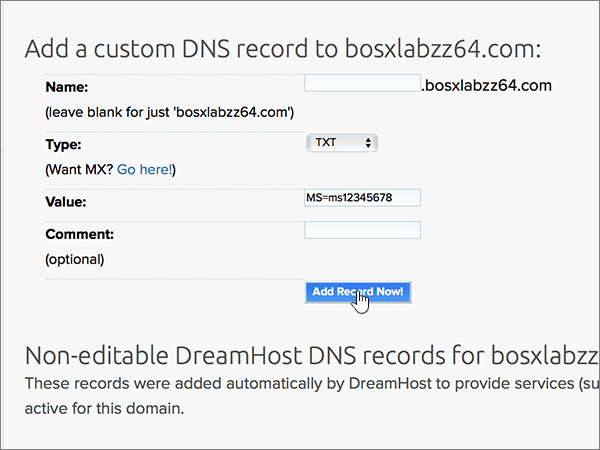

# Erstellen von DNS-Einträgen bei DreamHost für MicrosoftCreate DNS records at Dreamhost for Microsoft

 **[Überprüfen Sie die häufig gestellten Fragen (FAQ) zu Domänen](../setup/domains-faq.md)**, wenn Sie nicht finden, wonach Sie suchen.**[Check the Domains FAQ](../setup/domains-faq.md)** if you don't find what you're looking for. 
  
[] Wenn DreamHost Ihr DNS-Hostinganbieter ist, führen Sie die in diesem Artikel aufgeführten Schritte aus, um Ihre Domäne zu überprüfen und DNS-Einträge für E-Mail, Lync und andere Dienste einzurichten.If DreamHost is your DNS hosting provider, follow the steps in this article to verify your domain and set up DNS records for email, Lync, and so on.
 
Nachdem Sie diese Einträge bei DreamHost hinzugefügt haben, ist Ihre Domäne für die Verwendung mit Microsoft-Diensten eingerichtet.After you add these records at DreamHost, your domain will be set up to work with Microsoft services.
  
  
> [!NOTE]
> Normalerweise dauert es ungefähr 15 Minuten, bis DNS-Änderungen wirksam werden. Es kann jedoch gelegentlich länger dauern, bis eine von Ihnen vorgenommene Änderung im Internet im DNS-System aktualisiert wurde. Wenn nach dem Hinzufügen von DNS-Einträgen Probleme mit dem E-Mail-Fluss oder andere Probleme auftreten, lesen Sie [Behandeln von Problemen nach Änderung des Domänennamens oder von DNS-Einträgen](../get-help-with-domains/find-and-fix-issues.md).Typically it takes about 15 minutes for DNS changes to take effect. However, it can occasionally take longer for a change you've made to update across the Internet's DNS system. If you're having trouble with mail flow or other issues after adding DNS records, see [Troubleshoot issues after changing your domain name or DNS records](../get-help-with-domains/find-and-fix-issues.md). 
  
## Hinzufügen eines TXT-Eintrags zur ÜberprüfungAdd a TXT record for verification

Bevor Sie Ihre Domäne mit Microsoft verwenden können, müssen wir uns vergewissern, dass Sie deren Besitzer sind. Ihre Fähigkeit, sich bei Ihrem Konto bei Ihrer Domänenregistrierungsstelle anzumelden und den DNS-Eintrag zu erstellen, ist für Microsoft der Nachweis, dass Sie der Besitzer der Domäne sind.Before you use your domain with Microsoft, we have to make sure that you own it. Your ability to log in to your account at your domain registrar and create the DNS record proves to Microsoft that you own the domain.
  
> [!NOTE]
> Dieser Eintrag wird nur verwendet, um zu überprüfen, ob Sie der Besitzer Ihrer Domäne sind. Er hat keine weiteren Auswirkungen. Sie können ihn später ggf. löschen.This record is used only to verify that you own your domain; it doesn't affect anything else. You can delete it later, if you like. 
  
1. Navigieren Sie zuerst über [diesen Link](https://panel.dreamhost.com/) zu Ihrer Domänenseite bei DreamHost. Sie werden aufgefordert, sich anzumelden.To get started, go to your domains page at DreamHost by using [this link](https://panel.dreamhost.com/). You'll be prompted to Sign in.
    
    
  
2. Wählen Sie auf der Seite **Dashboard** die Option **Domänen**aus, und verwalten Sie dann **Domänen**.On the **Dashboard** page, select **Domains**, and then **Manage Domains**.
    
    
  
3. Wählen Sie auf der Seite **Domänen verwalten** im Abschnitt **Domäne** die Option **DNS** für die Domäne aus, die Sie bearbeiten möchten.On the **Manage Domains** page, in the **Domain** section, select **DNS** for the domain that you want to edit. 
    
    
  
4. In the **Add a custom DNS record** section, in the boxes for the new record, type or copy and paste the values from the following table.In the **Add a custom DNS record** section, in the boxes for the new record, type or copy and paste the values from the following table. 
    
    (You may have to scroll down.)(You may have to scroll down.)
    
    (Choose the **Type** value from the drop-down list.)(Choose the **Type** value from the drop-down list.) 
    
    |**Name****Name**|**Type****Type**|**Wert****Value**|**Kommentar****Comment**|
    |:-----|:-----|:-----|:-----|
    |(Leave this field empty.)(Leave this field empty.)    |TXTTXT    |MS=ms *XXXXXXXX*MS=ms *XXXXXXXX*    **Hinweis:** Dies ist ein Beispiel.**Note:** This is an example. Verwenden Sie hier Ihre spezifischen **Ziel-oder Punkt-zu-Adresse** -Werte aus der Tabelle.Use your specific **Destination or Points to Address** value here, from the table.           [Wie finde ich diese Angabe?How do I find this?](../get-help-with-domains/information-for-dns-records.md)          |(Dieses Feld ist optional.)(This field is optional.)    |
   
   
  
5. Wählen Sie **jetzt Record hinzufügen!**Select **Add Record Now!**
    
    
  
6. Warten Sie einige Minuten, bevor Sie fortfahren, damit der soeben erstellte Eintrag im Internet aktualisiert werden kann.Wait a few minutes before you continue, so that the record you just created can update across the Internet.
    
Nachdem Sie den Eintrag auf der Website Ihrer Domänenregistrierungsstelle hinzugefügt haben, kehren Sie zu Microsoft zurück und fordern Sie den Eintrag an.Now that you've added the record at your domain registrar's site, you'll go back to Microsoft and request the record.
  
Wenn Microsoft den richtigen TXT-Eintrag findet, ist die Domäne überprüft.When Microsoft finds the correct TXT record, your domain is verified.
  
1. Wechseln Sie im Microsoft Admin Center zur Seite **Einstellungen** \> <a href="https://go.microsoft.com/fwlink/p/?linkid=834818" target="_blank">Domänen</a>.In the Microsoft admin center, go to the **Settings** \> <a href="https://go.microsoft.com/fwlink/p/?linkid=834818" target="_blank">Domains</a> page.

    
2. Wählen Sie auf der Seite **Domänen** die zu überprüfende Domäne aus.On the **Domains** page, select the domain that you are verifying. 
    
    
  
3. Wählen Sie auf der Seite **Setup** die Option **Setup starten** aus.On the **Setup** page, select **Start setup**.
    
    
  
4. Wählen Sie auf der Seite **Domäne überprüfen** die Option **Überprüfen** aus.On the **Verify domain** page, select **Verify**.
    
    
  
> [!NOTE]
>  Normalerweise dauert es ungefähr 15 Minuten, bis DNS-Änderungen wirksam werden. Es kann jedoch gelegentlich länger dauern, bis eine von Ihnen vorgenommene Änderung im Internet im DNS-System aktualisiert wurde. Wenn nach dem Hinzufügen von DNS-Einträgen Probleme mit dem E-Mail-Fluss oder andere Probleme auftreten, lesen Sie [Behandeln von Problemen nach Änderung des Domänennamens oder von DNS-Einträgen](../get-help-with-domains/find-and-fix-issues.md).Typically it takes about 15 minutes for DNS changes to take effect. However, it can occasionally take longer for a change you've made to update across the Internet's DNS system. If you're having trouble with mail flow or other issues after adding DNS records, see [Troubleshoot issues after changing your domain name or DNS records](../get-help-with-domains/find-and-fix-issues.md). 
  

  
## Fügen Sie einen MX-Eintrag hinzu, damit E-Mails für Ihre Domäne an Microsoft geleitet werden.Add an MX record so email for your domain will come to Microsoft

Führen Sie die folgenden Schritte aus.Follow the steps below.
  
1. Navigieren Sie zuerst über [diesen Link](https://panel.dreamhost.com/) zu Ihrer Domänenseite bei DreamHost. Sie werden aufgefordert, sich anzumelden.To get started, go to your domains page at DreamHost by using [this link](https://panel.dreamhost.com/). You'll be prompted to Sign in.
    
    
  
2. Wählen Sie auf der Seite **Dashboard** die Option **e-Mail**und dann **benutzerdefiniertes MX**aus.On the **Dashboard** page, select **Mail**, and then **Custom MX**.
    
    
  
3. Wählen Sie im Abschnitt **e-Mail-Zustellung verwalten** in der Spalte **Aktionen** die Option **Bearbeiten** für die Domäne aus, die Sie bearbeiten möchten.In the **Manage Mail Delivery** section, in the **Actions** column, select **Edit** for the domain that you want to edit. 
    
    
  
4. Geben Sie im Abschnitt **Custom MX Record** in den Feldern für den neuen Eintrag die Werte aus der folgenden Tabelle ein. Sie können die Werte auch kopieren und einfügen.In the **Custom MX Record** section, in the boxes for the new record, type or copy and paste the following values from the following table. 
    
    (Möglicherweise müssen Sie nach unten scrollen.)(You may have to scroll down.)
    
    (Wenn weitere MX-Einträge vorhanden sind, markieren Sie diese Einträge zum Löschen.)(If there are any other existing MX records, mark those records to be deleted.)
    
    |**MX-Eintrag (erforderlich)****MX Record (required)**|
    |:-----|
    |0 *\<domain-key\>* . Mail.Protection.Outlook.com.0  *\<domain-key\>*  .mail.protection.outlook.com.    **Dieser Wert MUSS mit einem Punkt (.) enden.****This value MUST end with a period (.)**   Die 0 ist der MX-Prioritätswert. Fügen Sie ihn am Anfang des MX-Werts hinzu, vom Rest des Werts durch ein Leerzeichen getrennt.  The 0 is the MX priority value. Add it to the beginning of the MX value, separated from the remainder of the value by a space.    **Hinweis:** Holen Sie sich Ihr *\<domain-key\>* Microsoft-Konto.**Note:** Get your  *\<domain-key\>*  from your Microsoft account.           [Wie finde ich diese Angabe?How do I find this?](../get-help-with-domains/information-for-dns-records.md)          |
   
    
  
5. Wählen Sie **diese Domäne ändern aus, um benutzerdefinierte MX-Einträge jetzt zu verwenden!**Select **Change this domain to use custom MX records now!**
    
    
  
6. If there are any other existing MX records, delete each record by selecting the entry and then pressing the **Delete** key on your keyboard.If there are any other existing MX records, delete each record by selecting the entry and then pressing the **Delete** key on your keyboard. 
    
    
  
7. Wenn Sie alle Einträge gelöscht haben, wählen Sie **jetzt Ihre benutzerdefinierten MX-Einträge aktualisieren aus.**If you have deleted any records, select **Update your custom MX records now!**
    
    

  
## Hinzufügen der sechs CNAME-Einträge, die für Microsoft erforderlich sindAdd the six CNAME records that are required for Microsoft

Führen Sie die folgenden Schritte aus.Follow the steps below.
  
1. Navigieren Sie zuerst über [diesen Link](https://panel.dreamhost.com/) zu Ihrer Domänenseite bei DreamHost. Sie werden aufgefordert, sich anzumelden.To get started, go to your domains page at DreamHost by using [this link](https://panel.dreamhost.com/). You'll be prompted to Sign in.
    
    
  
2. Wählen Sie auf der Seite **Dashboard** die Option **Domänen**aus, und verwalten Sie dann **Domänen**.On the **Dashboard** page, select **Domains**, and then **Manage Domains**.
    
    
  
3. Wählen Sie auf der Seite **Domänen verwalten** im Abschnitt **Domäne** die Option **DNS** für die Domäne aus, die Sie bearbeiten möchten.On the **Manage Domains** page, in the **Domain** section, select **DNS** for the domain that you want to edit. 
    
    
  
4. Geben Sie im Abschnitt **Add a custom DNS record** in den Feldern für den neuen Eintrag die Werte aus der ersten Zeile der folgenden Tabelle ein. Sie können die Werte auch kopieren und einfügen.In the **Add a custom DNS record** section, in the boxes for the new record, type or copy and paste the values from the first row in the following table. 
    
    (You may have to scroll down.)(You may have to scroll down.)
    
    (Choose the **Type** value from the drop-down list.)(Choose the **Type** value from the drop-down list.) 
    
    |**Name****Name**|**Type****Type**|**Wert****Value**|**Kommentar****Comment**|
    |:-----|:-----|:-----|:-----|
    |autodiscoverautodiscover    |CNAMECNAME    |autodiscover.outlook.com.autodiscover.outlook.com.    **Dieser Wert MUSS mit einem Punkt (.) enden.****This value MUST end with a period (.)**   |(Dieses Feld ist optional.)(This field is optional.)    |
    |sipsip    |CNAMECNAME    |sipdir.online.lync.com.sipdir.online.lync.com.    **Dieser Wert MUSS mit einem Punkt (.) enden.****This value MUST end with a period (.)**   |(Dieses Feld ist optional.)(This field is optional.)    |
    |lyncdiscoverlyncdiscover    |CNAMECNAME    |webdir.online.lync.com.webdir.online.lync.com.    **Dieser Wert MUSS mit einem Punkt (.) enden.****This value MUST end with a period (.)**   |(Dieses Feld ist optional.)(This field is optional.)    |
    |enterpriseregistrationenterpriseregistration    |CNAMECNAME    |enterpriseregistration.windows.net.enterpriseregistration.windows.net.    **Dieser Wert MUSS mit einem Punkt (.) enden.****This value MUST end with a period (.)**   |(Dieses Feld ist optional.)(This field is optional.)    |
    |enterpriseenrollmententerpriseenrollment    |CNAMECNAME    |enterpriseenrollment-s.manage.microsoft.com.enterpriseenrollment-s.manage.microsoft.com.    **Dieser Wert MUSS mit einem Punkt (.) enden.****This value MUST end with a period (.)**   |(Dieses Feld ist optional.)(This field is optional.)    |
   
    
  
5. Wählen Sie **jetzt Record hinzufügen!**Select **Add Record Now!**
    
    
  
6. Verwenden Sie die beiden vorherigen Schritte und die Werte aus den anderen fünf Zeilen in der Tabelle, und fügen Sie jeden der anderen fünf CNAME-Einträge hinzu.Using the preceding two steps and the values from the other five rows in the table, add each of the other five CNAME records.

  
## Hinzufügen eines TXT-Eintrags für SPF, um E-Mail-Spam zu verhindernAdd a TXT record for SPF to help prevent email spam

> [!IMPORTANT]
> Es kann bei einer Domäne nur einen TXT-Eintrag für SPF geben.You cannot have more than one TXT record for SPF for a domain. Wenn es bei Ihrer Domäne mehrere SPF-Einträge gibt, treten E-Mail-Fehler sowie Probleme bei der Übermittlung und Spamklassifizierung auf.If your domain has more than one SPF record, you'll get email errors, as well as delivery and spam classification issues. Wenn es für Ihre Domäne bereits einen SPF-Eintrag gibt, erstellen Sie für Microsoft keinen neuen,If you already have an SPF record for your domain, don't create a new one for Microsoft. Fügen Sie stattdessen die erforderlichen Microsoft-Werte zum aktuellen Datensatz hinzu, sodass Sie einen *einzelnen* SPF-Eintrag haben, der beide Wertegruppen enthält.Instead, add the required Microsoft values to the current record so that you have a  *single*  SPF record that includes both sets of values.
  
Führen Sie die folgenden Schritte aus.Follow the steps below.
  
1. Navigieren Sie zuerst über [diesen Link](https://panel.dreamhost.com/) zu Ihrer Domänenseite bei DreamHost. Sie werden aufgefordert, sich anzumelden.To get started, go to your domains page at DreamHost by using [this link](https://panel.dreamhost.com/). You'll be prompted to Sign in.
    
    
  
2. Wählen Sie auf der Seite **Dashboard** die Option **Domänen**aus, und verwalten Sie dann **Domänen**.On the **Dashboard** page, select **Domains**, and then **Manage Domains**.
    
    
  
3. Wählen Sie auf der Seite **Domänen verwalten** im Abschnitt **Domäne** die Option **DNS** für die Domäne aus, die Sie bearbeiten möchten.On the **Manage Domains** page, in the **Domain** section, select **DNS** for the domain that you want to edit. 
    
    
  
4. Geben Sie im Abschnitt **Add a custom DNS record** in den Feldern für den neuen Eintrag die Werte aus der ersten Zeile der folgenden Tabelle ein. Sie können die Werte auch kopieren und einfügen.In the **Add a custom DNS record** section, in the boxes for the new record, type or copy and paste the values from the first row in the following table. 
    
    (You may have to scroll down.)(You may have to scroll down.)
    
    (Choose the **Type** value from the drop-down list.)(Choose the **Type** value from the drop-down list.) 
    
    |**Name****Name**|**Type****Type**|**Wert****Value**|**Kommentar****Comment**|
    |:-----|:-----|:-----|:-----|
    |(Leave this field empty.)(Leave this field empty.)    |TXTTXT    |v=spf1 include:spf.protection.outlook.com -allv=spf1 include:spf.protection.outlook.com -all    **Hinweis:** Es wird empfohlen, diesen Eintrag zu kopieren und einzufügen, damit alle Abstände korrekt übernommen werden.**Note:** We recommend copying and pasting this entry, so that all of the spacing stays correct.           |(Dieses Feld ist optional.)(This field is optional.)    |
   
   
  
5. Wählen Sie **jetzt Record hinzufügen!**Select **Add Record Now!**
    
    
  
6. Fügen Sie den anderen SRV-Eintrag hinzu, indem Sie die beiden vorherigen Schritte unter Verwendung der Werte aus der zweiten Zeile in der Tabelle ausführen.Using the preceding two steps and the values from the second row in the table, add the other SRV record.
    
  
## Hinzufügen der für Microsoft erforderlichen zwei SRV-EinträgeAdd the two SRV records that are required for Microsoft

Führen Sie die folgenden Schritte aus.Follow the steps below.
  
1. Navigieren Sie zuerst über [diesen Link](https://panel.dreamhost.com/) zu Ihrer Domänenseite bei DreamHost. Sie werden aufgefordert, sich anzumelden.To get started, go to your domains page at DreamHost by using [this link](https://panel.dreamhost.com/). You'll be prompted to Sign in.
    
    
  
2. Wählen Sie auf der Seite **Dashboard** die Option **Domänen**aus, und verwalten Sie dann **Domänen**.On the **Dashboard** page, select **Domains**, and then **Manage Domains**.
    
    
  
3. Wählen Sie auf der Seite **Domänen verwalten** im Abschnitt **Domäne** die Option **DNS** für die Domäne aus, die Sie bearbeiten möchten.On the **Manage Domains** page, in the **Domain** section, select **DNS** for the domain that you want to edit. 
    
    
  
4. Geben Sie im Abschnitt **Add a custom DNS record** in den Feldern für den neuen Eintrag die Werte aus der ersten Zeile der folgenden Tabelle ein. Sie können die Werte auch kopieren und einfügen.In the **Add a custom DNS record** section, in the boxes for the new record, type or copy and paste the values from the first row in the following table. 
    
    (You may have to scroll down.)(You may have to scroll down.)
    
    (Choose the **Type** value from the drop-down list.)(Choose the **Type** value from the drop-down list.) 
    
    |**Name****Name**|**Type****Type**|**Wert****Value**|**Kommentar****Comment**|
    |:-----|:-----|:-----|:-----|
    |_sip._tls_sip._tls    |SRVSRV    |100 1 443100 1 443    sipdir.online.lync.com.sipdir.online.lync.com.    **Dieser Wert MUSS mit einem Punkt (.) enden.****This value MUST end with a period (.)**   |(Dieses Feld ist optional.)(This field is optional.)    |
    |_sipfederationtls._tcp_sipfederationtls._tcp    |SRVSRV    |100 1 5061100 1 5061    sipfed.online.lync.com.sipfed.online.lync.com.    **Dieser Wert MUSS mit einem Punkt (.) enden.****This value MUST end with a period (.)**   |(Dieses Feld ist optional.)(This field is optional.)    |
   
    
  
5. Wählen Sie **jetzt Record hinzufügen!**.Select **Add Record Now!**.
    
    
  
6. Fügen Sie den anderen SRV-Eintrag hinzu, indem Sie die beiden vorherigen Schritte unter Verwendung der Werte aus der zweiten Zeile in der Tabelle ausführen.Using the preceding two steps and the values from the second row in the table, add the other SRV record.
    
> [!NOTE]
>  Normalerweise dauert es ungefähr 15 Minuten, bis DNS-Änderungen wirksam werden. Es kann jedoch gelegentlich länger dauern, bis eine von Ihnen vorgenommene Änderung im Internet im DNS-System aktualisiert wurde. Wenn nach dem Hinzufügen von DNS-Einträgen Probleme mit dem E-Mail-Fluss oder andere Probleme auftreten, lesen Sie [Behandeln von Problemen nach Änderung des Domänennamens oder von DNS-Einträgen](../get-help-with-domains/find-and-fix-issues.md).Typically it takes about 15 minutes for DNS changes to take effect. However, it can occasionally take longer for a change you've made to update across the Internet's DNS system. If you're having trouble with mail flow or other issues after adding DNS records, see [Troubleshoot issues after changing your domain name or DNS records](../get-help-with-domains/find-and-fix-issues.md). 

  
