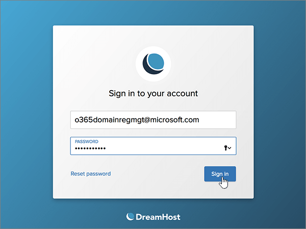

# Erstellen von DNS-Einträgen bei DreamHost für Microsoft

 **[Überprüfen Sie die häufig gestellten Fragen (FAQ) zu Domänen](../setup/domains-faq.md)**, wenn Sie nicht finden, wonach Sie suchen. 
  
[] Wenn DreamHost Ihr DNS-Hostinganbieter ist, führen Sie die in diesem Artikel aufgeführten Schritte aus, um Ihre Domäne zu überprüfen und DNS-Einträge für E-Mail, Lync und andere Dienste einzurichten.
 
Nachdem Sie diese Einträge bei DreamHost hinzugefügt haben, ist Ihre Domäne für die Verwendung mit Microsoft-Diensten eingerichtet.
  
  
> [!NOTE]
> Normalerweise dauert es ungefähr 15 Minuten, bis DNS-Änderungen wirksam werden. Es kann jedoch gelegentlich länger dauern, bis eine von Ihnen vorgenommene Änderung im Internet im DNS-System aktualisiert wurde. Wenn nach dem Hinzufügen von DNS-Einträgen Probleme mit dem E-Mail-Fluss oder andere Probleme auftreten, lesen Sie [Behandeln von Problemen nach Änderung des Domänennamens oder von DNS-Einträgen](../get-help-with-domains/find-and-fix-issues.md). 
  
## Hinzufügen eines TXT-Eintrags zur Überprüfung

Bevor Sie Ihre Domäne mit Microsoft verwenden können, müssen wir uns vergewissern, dass Sie deren Besitzer sind. Ihre Fähigkeit, sich bei Ihrem Konto bei Ihrer Domänenregistrierungsstelle anzumelden und den DNS-Eintrag zu erstellen, ist für Microsoft der Nachweis, dass Sie der Besitzer der Domäne sind.
  
> [!NOTE]
> Dieser Eintrag wird nur verwendet, um zu überprüfen, ob Sie der Besitzer Ihrer Domäne sind. Er hat keine weiteren Auswirkungen. Sie können ihn später ggf. löschen. 
  
1. Navigieren Sie zuerst über [diesen Link](https://panel.dreamhost.com/) zu Ihrer Domänenseite bei DreamHost. Sie werden aufgefordert, sich anzumelden.
    
    
  
2. Wählen Sie auf der Seite **Dashboard** die Option **Domänen**aus, und verwalten Sie dann **Domänen**.
    
    
  
3. Wählen Sie auf der Seite **Domänen verwalten** im Abschnitt **Domäne** die Option **DNS** für die Domäne aus, die Sie bearbeiten möchten. 
    
    
  
4. In the **Add a custom DNS record** section, in the boxes for the new record, type or copy and paste the values from the following table. 
    
    (You may have to scroll down.)
    
    (Choose the **Type** value from the drop-down list.) 
    
    |**Name**|**Type**|**Wert**|**Kommentar**|
    |:-----|:-----|:-----|:-----|
    |(Leave this field empty.)    |TXT    |MS=ms *XXXXXXXX*    **Hinweis:** Dies ist ein Beispiel. Verwenden Sie hier Ihre spezifischen **Ziel-oder Punkt-zu-Adresse** -Werte aus der Tabelle.           [Wie finde ich diese Angabe?](../get-help-with-domains/information-for-dns-records.md)          |(Dieses Feld ist optional.)    |
   
   
  
5. Wählen Sie **jetzt Record hinzufügen!**
    
    
  
6. Warten Sie einige Minuten, bevor Sie fortfahren, damit der soeben erstellte Eintrag im Internet aktualisiert werden kann.
    
Nachdem Sie den Eintrag auf der Website Ihrer Domänenregistrierungsstelle hinzugefügt haben, kehren Sie zu Microsoft zurück und fordern Sie den Eintrag an.
  
Wenn Microsoft den richtigen TXT-Eintrag findet, ist die Domäne überprüft.
  
1. Wechseln Sie im Microsoft Admin Center zur Seite **Einstellungen** \> <a href="https://go.microsoft.com/fwlink/p/?linkid=834818" target="_blank">Domänen</a>.

    
2. Wählen Sie auf der Seite **Domänen** die zu überprüfende Domäne aus. 
    
    
  
3. Wählen Sie auf der Seite **Setup** die Option **Setup starten** aus.
    
    
  
4. Wählen Sie auf der Seite **Domäne überprüfen** die Option **Überprüfen** aus.
    
    
  
> [!NOTE]
>  Normalerweise dauert es ungefähr 15 Minuten, bis DNS-Änderungen wirksam werden. Es kann jedoch gelegentlich länger dauern, bis eine von Ihnen vorgenommene Änderung im Internet im DNS-System aktualisiert wurde. Wenn nach dem Hinzufügen von DNS-Einträgen Probleme mit dem E-Mail-Fluss oder andere Probleme auftreten, lesen Sie [Behandeln von Problemen nach Änderung des Domänennamens oder von DNS-Einträgen](../get-help-with-domains/find-and-fix-issues.md). 
  

  
## Fügen Sie einen MX-Eintrag hinzu, damit E-Mails für Ihre Domäne an Microsoft geleitet werden.

Führen Sie die folgenden Schritte aus.
  
1. Navigieren Sie zuerst über [diesen Link](https://panel.dreamhost.com/) zu Ihrer Domänenseite bei DreamHost. Sie werden aufgefordert, sich anzumelden.
    
    
  
2. Wählen Sie auf der Seite **Dashboard** die Option **e-Mail**und dann **benutzerdefiniertes MX**aus.
    
    
  
3. Wählen Sie im Abschnitt **e-Mail-Zustellung verwalten** in der Spalte **Aktionen** die Option **Bearbeiten** für die Domäne aus, die Sie bearbeiten möchten. 
    
    
  
4. Geben Sie im Abschnitt **Custom MX Record** in den Feldern für den neuen Eintrag die Werte aus der folgenden Tabelle ein. Sie können die Werte auch kopieren und einfügen. 
    
    (Möglicherweise müssen Sie nach unten scrollen.)
    
    (Wenn weitere MX-Einträge vorhanden sind, markieren Sie diese Einträge zum Löschen.)
    
    |**MX-Eintrag (erforderlich)**|
    |:-----|
    |0 *\<domain-key\>* . Mail.Protection.Outlook.com.    **Dieser Wert MUSS mit einem Punkt (.) enden.**   Die 0 ist der MX-Prioritätswert. Fügen Sie ihn am Anfang des MX-Werts hinzu, vom Rest des Werts durch ein Leerzeichen getrennt.    **Hinweis:** Holen Sie sich Ihr *\<domain-key\>* Microsoft-Konto.           [Wie finde ich diese Angabe?](../get-help-with-domains/information-for-dns-records.md)          |
   
    
  
5. Wählen Sie **diese Domäne ändern aus, um benutzerdefinierte MX-Einträge jetzt zu verwenden!**
    
    
  
6. If there are any other existing MX records, delete each record by selecting the entry and then pressing the **Delete** key on your keyboard. 
    
    
  
7. Wenn Sie alle Einträge gelöscht haben, wählen Sie **jetzt Ihre benutzerdefinierten MX-Einträge aktualisieren aus.**
    
    

  
## Hinzufügen der sechs CNAME-Einträge, die für Microsoft erforderlich sind

Führen Sie die folgenden Schritte aus.
  
1. Navigieren Sie zuerst über [diesen Link](https://panel.dreamhost.com/) zu Ihrer Domänenseite bei DreamHost. Sie werden aufgefordert, sich anzumelden.
    
    
  
2. Wählen Sie auf der Seite **Dashboard** die Option **Domänen**aus, und verwalten Sie dann **Domänen**.
    
    
  
3. Wählen Sie auf der Seite **Domänen verwalten** im Abschnitt **Domäne** die Option **DNS** für die Domäne aus, die Sie bearbeiten möchten. 
    
    
  
4. Geben Sie im Abschnitt **Add a custom DNS record** in den Feldern für den neuen Eintrag die Werte aus der ersten Zeile der folgenden Tabelle ein. Sie können die Werte auch kopieren und einfügen. 
    
    (You may have to scroll down.)
    
    (Choose the **Type** value from the drop-down list.) 
    
    |**Name**|**Type**|**Wert**|**Kommentar**|
    |:-----|:-----|:-----|:-----|
    |autodiscover    |CNAME    |autodiscover.outlook.com.    **Dieser Wert MUSS mit einem Punkt (.) enden.**   |(Dieses Feld ist optional.)    |
    |sip    |CNAME    |sipdir.online.lync.com.    **Dieser Wert MUSS mit einem Punkt (.) enden.**   |(Dieses Feld ist optional.)    |
    |lyncdiscover    |CNAME    |webdir.online.lync.com.    **Dieser Wert MUSS mit einem Punkt (.) enden.**   |(Dieses Feld ist optional.)    |
    |enterpriseregistration    |CNAME    |enterpriseregistration.windows.net.    **Dieser Wert MUSS mit einem Punkt (.) enden.**   |(Dieses Feld ist optional.)    |
    |enterpriseenrollment    |CNAME    |enterpriseenrollment-s.manage.microsoft.com.    **Dieser Wert MUSS mit einem Punkt (.) enden.**   |(Dieses Feld ist optional.)    |
   
    
  
5. Wählen Sie **jetzt Record hinzufügen!**
    
    
  
6. Verwenden Sie die beiden vorherigen Schritte und die Werte aus den anderen fünf Zeilen in der Tabelle, und fügen Sie jeden der anderen fünf CNAME-Einträge hinzu.

  
## Hinzufügen eines TXT-Eintrags für SPF, um E-Mail-Spam zu verhindern

> [!IMPORTANT]
> Es kann bei einer Domäne nur einen TXT-Eintrag für SPF geben. Wenn es bei Ihrer Domäne mehrere SPF-Einträge gibt, treten E-Mail-Fehler sowie Probleme bei der Übermittlung und Spamklassifizierung auf. Wenn es für Ihre Domäne bereits einen SPF-Eintrag gibt, erstellen Sie für Microsoft keinen neuen, Fügen Sie stattdessen die erforderlichen Microsoft-Werte zum aktuellen Datensatz hinzu, sodass Sie einen *einzelnen* SPF-Eintrag haben, der beide Wertegruppen enthält.
  
Führen Sie die folgenden Schritte aus.
  
1. Navigieren Sie zuerst über [diesen Link](https://panel.dreamhost.com/) zu Ihrer Domänenseite bei DreamHost. Sie werden aufgefordert, sich anzumelden.
    
    
  
2. Wählen Sie auf der Seite **Dashboard** die Option **Domänen**aus, und verwalten Sie dann **Domänen**.
    
    
  
3. Wählen Sie auf der Seite **Domänen verwalten** im Abschnitt **Domäne** die Option **DNS** für die Domäne aus, die Sie bearbeiten möchten. 
    
    
  
4. Geben Sie im Abschnitt **Add a custom DNS record** in den Feldern für den neuen Eintrag die Werte aus der ersten Zeile der folgenden Tabelle ein. Sie können die Werte auch kopieren und einfügen. 
    
    (You may have to scroll down.)
    
    (Choose the **Type** value from the drop-down list.) 
    
    |**Name**|**Type**|**Wert**|**Kommentar**|
    |:-----|:-----|:-----|:-----|
    |(Leave this field empty.)    |TXT    |v=spf1 include:spf.protection.outlook.com -all    **Hinweis:** Es wird empfohlen, diesen Eintrag zu kopieren und einzufügen, damit alle Abstände korrekt übernommen werden.           |(Dieses Feld ist optional.)    |
   
   
  
5. Wählen Sie **jetzt Record hinzufügen!**
    
    
  
6. Fügen Sie den anderen SRV-Eintrag hinzu, indem Sie die beiden vorherigen Schritte unter Verwendung der Werte aus der zweiten Zeile in der Tabelle ausführen.
    
  
## Hinzufügen der für Microsoft erforderlichen zwei SRV-Einträge

Führen Sie die folgenden Schritte aus.
  
1. Navigieren Sie zuerst über [diesen Link](https://panel.dreamhost.com/) zu Ihrer Domänenseite bei DreamHost. Sie werden aufgefordert, sich anzumelden.
    
    
  
2. Wählen Sie auf der Seite **Dashboard** die Option **Domänen**aus, und verwalten Sie dann **Domänen**.
    
    
  
3. Wählen Sie auf der Seite **Domänen verwalten** im Abschnitt **Domäne** die Option **DNS** für die Domäne aus, die Sie bearbeiten möchten. 
    
    
  
4. Geben Sie im Abschnitt **Add a custom DNS record** in den Feldern für den neuen Eintrag die Werte aus der ersten Zeile der folgenden Tabelle ein. Sie können die Werte auch kopieren und einfügen. 
    
    (You may have to scroll down.)
    
    (Choose the **Type** value from the drop-down list.) 
    
    |**Name**|**Type**|**Wert**|**Kommentar**|
    |:-----|:-----|:-----|:-----|
    |_sip._tls    |SRV    |100 1 443    sipdir.online.lync.com.    **Dieser Wert MUSS mit einem Punkt (.) enden.**   |(Dieses Feld ist optional.)    |
    |_sipfederationtls._tcp    |SRV    |100 1 5061    sipfed.online.lync.com.    **Dieser Wert MUSS mit einem Punkt (.) enden.**   |(Dieses Feld ist optional.)    |
   
    
  
5. Wählen Sie **jetzt Record hinzufügen!**.
    
    
  
6. Fügen Sie den anderen SRV-Eintrag hinzu, indem Sie die beiden vorherigen Schritte unter Verwendung der Werte aus der zweiten Zeile in der Tabelle ausführen.
    
> [!NOTE]
>  Normalerweise dauert es ungefähr 15 Minuten, bis DNS-Änderungen wirksam werden. Es kann jedoch gelegentlich länger dauern, bis eine von Ihnen vorgenommene Änderung im Internet im DNS-System aktualisiert wurde. Wenn nach dem Hinzufügen von DNS-Einträgen Probleme mit dem E-Mail-Fluss oder andere Probleme auftreten, lesen Sie [Behandeln von Problemen nach Änderung des Domänennamens oder von DNS-Einträgen](../get-help-with-domains/find-and-fix-issues.md). 

  
