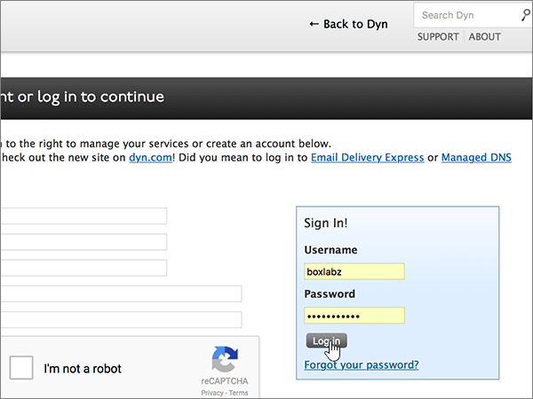
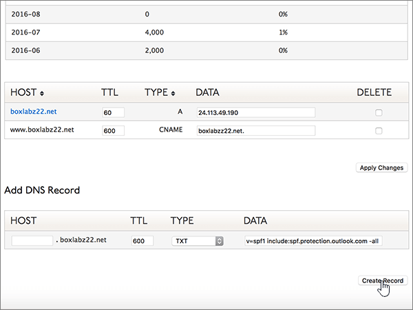

# Erstellen von DNS-Einträgen für Office 365 bei Dyn.comCreate DNS records at Dyn.com for Office 365

 **[Überprüfen Sie die häufig gestellten Fragen (FAQ) zu Domänen](../setup/domains-faq.md)**, wenn Sie nicht finden, wonach Sie suchen.**[Check the Domains FAQ](../setup/domains-faq.md)** if you don't find what you're looking for. 
  
Wenn Dyn.com Ihr DNS-Hostinganbieter ist, führen Sie die in diesem Artikel aufgeführten Schritte aus, um Ihre Domäne zu überprüfen und DNS-Einträge für E-Mail, Skype for Business Online und andere Dienste einzurichten.If Dyn.com is your DNS hosting provider, follow the steps in this article to verify your domain and set up DNS records for email, Skype for Business Online, and so on.
 
Informationen zu Webhosting und DNS für Websites mit Office 365 finden Sie unter [Verwenden einer öffentlichen Website mit Office 365](https://support.office.com/article/choose-a-public-website-3325d50e-d131-403c-a278-7f3296fe33a9).To learn about webhosting and DNS for websites with Office 365, see [Use a public website with Office 365](https://support.office.com/article/choose-a-public-website-3325d50e-d131-403c-a278-7f3296fe33a9).
  
> [!NOTE]
>  Normalerweise dauert es ungefähr 15 Minuten, bis DNS-Änderungen wirksam werden. Es kann jedoch gelegentlich länger dauern, bis eine von Ihnen vorgenommene Änderung im Internet im DNS-System aktualisiert wurde. Wenn nach dem Hinzufügen von DNS-Einträgen Probleme mit dem E-Mail-Fluss oder andere Probleme auftreten, lesen Sie [Behandeln von Problemen nach Änderung des Domänennamens oder von DNS-Einträgen](../get-help-with-domains/find-and-fix-issues.md).Typically it takes about 15 minutes for DNS changes to take effect. However, it can occasionally take longer for a change you've made to update across the Internet's DNS system. If you're having trouble with mail flow or other issues after adding DNS records, see [Troubleshoot issues after changing your domain name or DNS records](../get-help-with-domains/find-and-fix-issues.md). 
  
## Hinzufügen eines TXT-Eintrags zur ÜberprüfungAdd a TXT record for verification

1. Um zu beginnen, navigieren Sie über [diesen Link](https://account.dyn.com/dns/) zu Ihrer Domänenseite bei Dyn.com. Sie werden aufgefordert, sich zuerst anzumelden.To get started, go to your domains page at Dyn.com by using [this link](https://account.dyn.com/dns/). You'll be prompted to login first.
    
    
  
2. Wählen Sie auf der Seite **Dienste auf Zonenebene** **dyn Standard-DNS-Dienst** für die Domäne aus, die Sie bearbeiten möchten.On the **Zone Level Services** page, select **Dyn Standard DNS Service** for the domain that you want to edit. 
    
3. Wählen Sie auf der Seite **DNS** für Ihre Domäne die Option **Einstellungen**aus.On the **DNS** page for your domain, select **Preferences**.
    
4. Wählen Sie **Expert-Schnittstelle aktivieren**aus.Select **Enable Expert Interface**.
    
5. In the **Add DNS Record** section, in the boxes for the new record, type or copy and paste the values from the following table.In the **Add DNS Record** section, in the boxes for the new record, type or copy and paste the values from the following table. 
    
    (Choose the **Type** value from the drop-down list.)(Choose the **Type** value from the drop-down list.) 
    
    |**Host****Host**|**TTL****TTL**|**Type****Type**|**Data****Data**|
    |:-----|:-----|:-----|:-----|
    |(Leave this field empty.)(Leave this field empty.)    |600600    |TXTTXT    |MS=ms *XXXXXXXX*MS=ms *XXXXXXXX*    **Hinweis:** Dies ist ein Beispiel. Verwenden Sie hier Ihren spezifischen Wert von **Ziel oder verweisende Adresse** aus der Tabelle in Office 365.           [Wie finde ich diese Angabe?](../get-help-with-domains/information-for-dns-records.md)**Note:** This is an example. Use your specific **Destination or Points to Address** value here, from the table in Office 365.           [How do I find this?](../get-help-with-domains/information-for-dns-records.md)          |
       
   
  
6. Wählen Sie **Create Record**aus.Select **Create Record**.
    
    
  
7. Warten Sie einige Minuten, bevor Sie fortfahren, damit der soeben erstellte Eintrag im Internet aktualisiert werden kann.Wait a few minutes before you continue, so that the record you just created can update across the Internet.
    
Nachdem Sie den Eintrag auf der Website Ihrer Domänenregistrierungsstelle hinzugefügt haben, kehren Sie zu Office 365 zurück und fordern Office 365 auf, nach dem Eintrag zu suchen.Now that you've added the record at your domain registrar's site, you'll go back to Office 365 and request Office 365 to look for the record.
  
Wenn Office 365 den richtigen TXT-Eintrag findet, wird die Domäne überprüft.When Office 365 finds the correct TXT record, your domain is verified.
  
1. Wechseln Sie im Admin Center zur Seite **Einstellungen** \> <a href="https://go.microsoft.com/fwlink/p/?linkid=834818" target="_blank">Domänen</a>.In the admin center, go to the **Settings** \> <a href="https://go.microsoft.com/fwlink/p/?linkid=834818" target="_blank">Domains</a> page.

    
2. Wählen Sie auf der Seite **Domänen** die zu überprüfende Domäne aus.On the **Domains** page, select the domain that you are verifying. 
    
    
  
3. Wählen Sie auf der Seite **Setup** die Option **Setup starten** aus.On the **Setup** page, select **Start setup**.
    
    
  
4. Wählen Sie auf der Seite **Domäne überprüfen** die Option **Überprüfen** aus.On the **Verify domain** page, select **Verify**.
    
    
  
> [!NOTE]
>  Normalerweise dauert es ungefähr 15 Minuten, bis DNS-Änderungen wirksam werden. Es kann jedoch gelegentlich länger dauern, bis eine von Ihnen vorgenommene Änderung im Internet im DNS-System aktualisiert wurde. Wenn nach dem Hinzufügen von DNS-Einträgen Probleme mit dem E-Mail-Fluss oder andere Probleme auftreten, lesen Sie [Behandeln von Problemen nach Änderung des Domänennamens oder von DNS-Einträgen](../get-help-with-domains/find-and-fix-issues.md).Typically it takes about 15 minutes for DNS changes to take effect. However, it can occasionally take longer for a change you've made to update across the Internet's DNS system. If you're having trouble with mail flow or other issues after adding DNS records, see [Troubleshoot issues after changing your domain name or DNS records](../get-help-with-domains/find-and-fix-issues.md). 
  
## Hinzufügen eines MX-Eintrags, damit E-Mails für Ihre Domäne zu Office 365 geleitet werdenAdd an MX record so email for your domain will come to Office 365

1. Um zu beginnen, navigieren Sie über [diesen Link](https://account.dyn.com/dns/) zu Ihrer Domänenseite bei Dyn.com. Sie werden aufgefordert, sich zuerst anzumelden.To get started, go to your domains page at Dyn.com by using [this link](https://account.dyn.com/dns/). You'll be prompted to login first.
    
    
  
2. Wählen Sie auf der Seite **Dienste auf Zonenebene** **dyn Standard-DNS-Dienst** für die Domäne aus, die Sie bearbeiten möchten.On the **Zone Level Services** page, select **Dyn Standard DNS Service** for the domain that you want to edit. 
    
3. Wählen Sie auf der Seite DNS für Ihre Domäne die Option **Einstellungen**aus.On the DNS page for your domain, select **Preferences**.
    
4. Wählen Sie **Expert-Schnittstelle aktivieren**aus.Select **Enable Expert Interface**.
    
5. In the **Add DNS Record** section, in the boxes for the new record, type or copy and paste the values from the following table.In the **Add DNS Record** section, in the boxes for the new record, type or copy and paste the values from the following table. 
    
    (Choose the **Type** value from the drop-down list.)(Choose the **Type** value from the drop-down list.) 
    
    |**Host****Host**|**TTL****TTL**|**Type****Type**|**Data****Data**|
    |:-----|:-----|:-----|:-----|
    |(Leave this field empty.)(Leave this field empty.)    |600600    |MXMX    |10  *\<Domänenschlüssel\>*  .mail.protection.outlook.com.10  *\<domain-key\>*  .mail.protection.outlook.com.    **Dieser Wert MUSS mit einem Punkt (.) enden.****This value MUST end with a period (.)**   Die **10** ist der MX-Prioritätswert. Fügen Sie ihn am Anfang des MX-Werts hinzu, vom Rest des Werts durch ein Leerzeichen getrennt.  The **10** is the MX priority value. Add it to the beginning of the MX value, separated from the remainder of the value by a space.    **Hinweis:** Rufen Sie Ihren \* \<Domänenschlüssel\> \* aus Ihrem Office 365-Konto ab.**Note:** Get your  *\<domain-key\>*  from your Office 365 account.           [Wie finde ich diese Angabe?How do I find this?](../get-help-with-domains/information-for-dns-records.md)           Weitere Informationen zur Priorität finden Sie unter [Was ist MX-Priorität?](https://support.office.com/article/2784cc4d-95be-443d-b5f7-bb5dd867ba83.aspx)For more information about priority, see [What is MX priority?](https://support.office.com/article/2784cc4d-95be-443d-b5f7-bb5dd867ba83.aspx)   |
   
    
  
6. Wählen Sie **Create Record**aus.Select **Create Record**.
    
    
  
7. Falls es andere MX-Einträge gibt, entfernen Sie diese durch Aktivieren des Kontrollkästchens für jeden Eintrag in der Spalte **Löschen**.If there are any other MX records, remove them by selecting the check box for each one in the **Delete** column. 
    
    
  
8. Wählen Sie **Änderungen übernehmen**aus.Select **Apply Changes**.
    
    
  
## Hinzufügen der für Office 365 erforderlichen sechs CNAME-EinträgeAdd the six CNAME records that are required for Office 365

1. Um zu beginnen, navigieren Sie über [diesen Link](https://account.dyn.com/dns/) zu Ihrer Domänenseite bei Dyn.com. Sie werden aufgefordert, sich zuerst anzumelden.To get started, go to your domains page at Dyn.com by using [this link](https://account.dyn.com/dns/). You'll be prompted to login first.
    
    
  
2. Wählen Sie auf der Seite **Dienste auf Zonenebene** **dyn Standard-DNS-Dienst** für die Domäne aus, die Sie bearbeiten möchten.On the **Zone Level Services** page, select **Dyn Standard DNS Service** for the domain that you want to edit. 
    
3. Wählen Sie auf der Seite **DNS** für Ihre Domäne die Option **Einstellungen**aus.On the **DNS** page for your domain, select **Preferences**.
    
4. Wählen Sie **Expert-Schnittstelle aktivieren**aus.Select **Enable Expert Interface**.
    
5. Fügen Sie den ersten der sechs CNAME-Einträge hinzu.Add the first of the six CNAME records.
    
    Geben Sie im Bereich **Add DNS Record** in den Feldern für den neuen Eintrag die Werte aus der ersten Zeile der folgenden Tabelle ein. Sie können die Werte auch kopieren und einfügen.In the **Add DNS Record** section, in the boxes for the new record, type or copy and paste the values from the first row of the following table. 
    
    (Wählen Sie in der Dropdownliste den Wert für **Type** aus.)(Choose the **Type** value from the drop-down list.) 
    
    |**Host****Host**|**TTL****TTL**|**Type****Type**|**Data****Data**|
    |:-----|:-----|:-----|:-----|
    |autodiscoverautodiscover    |600600    |CNAMECNAME    |autodiscover.outlook.com.autodiscover.outlook.com.    **Dieser Wert MUSS mit einem Punkt (.) enden.****This value MUST end with a period (.)**   |
    |sipsip    |600600    |CNAMECNAME    |sipdir.online.lync.com.sipdir.online.lync.com.    **Dieser Wert MUSS mit einem Punkt (.) enden.****This value MUST end with a period (.)**   |
    |lyncdiscoverlyncdiscover    |600600    |CNAMECNAME    |webdir.online.lync.com.webdir.online.lync.com.    **Dieser Wert MUSS mit einem Punkt (.) enden.****This value MUST end with a period (.)**   |
    |enterpriseregistrationenterpriseregistration    |600600    |CNAMECNAME    |enterpriseregistration.windows.net.enterpriseregistration.windows.net.    **Dieser Wert MUSS mit einem Punkt (.) enden.****This value MUST end with a period (.)**   |
    |enterpriseenrollmententerpriseenrollment    |600600    |CNAMECNAME    |enterpriseenrollment-s.manage.microsoft.com.enterpriseenrollment-s.manage.microsoft.com.    **Dieser Wert MUSS mit einem Punkt (.) enden.****This value MUST end with a period (.)**   |
   
    
  
6. Wählen Sie **Create Record**aus.Select **Create Record**.
    
    
  
7. Fügen Sie die fünf restlichen CNAME-Einträge hinzu.Add the remaining five CNAME records.
    
    Erstellen Sie im Abschnitt **DNS-Eintrag hinzufügen** einen Datensatz mithilfe der Werte aus der nächsten Zeile in der Tabelle, und wählen Sie dann erneut **Datensatz erstellen** aus, um den Datensatz abzuschließen.In the **Add DNS Record** section, create a record by using the values from the next row in the table, and then again select **Create Record** to complete that record. 
    
    Wiederholen Sie diesen Vorgang, bis Sie alle sechs CNAME-Einträge erstellt haben.Repeat this process until you have created all six CNAME records.
    
## Hinzufügen eines TXT-Eintrags für SPF, um E-Mail-Spam zu verhindernAdd a TXT record for SPF to help prevent email spam

> [!IMPORTANT]
> Es kann bei einer Domäne nur einen TXT-Eintrag für SPF geben.You cannot have more than one TXT record for SPF for a domain. Wenn es bei Ihrer Domäne mehrere SPF-Einträge gibt, treten E-Mail-Fehler sowie Probleme bei der Übermittlung und Spamklassifizierung auf.If your domain has more than one SPF record, you'll get email errors, as well as delivery and spam classification issues. If you already have an SPF record for your domain, don't create a new one for Office 365.If you already have an SPF record for your domain, don't create a new one for Office 365. Damit verfügen Sie über einen  *einzigen*  SPF-Eintrag, in dem beide Wertemengen enthalten sind.Instead, add the required Office 365 values to the current record so that you have a  *single*  SPF record that includes both sets of values.
  
1. Um zu beginnen, navigieren Sie über [diesen Link](https://account.dyn.com/dns/) zu Ihrer Domänenseite bei Dyn.com. Sie werden aufgefordert, sich zuerst anzumelden.To get started, go to your domains page at Dyn.com by using [this link](https://account.dyn.com/dns/). You'll be prompted to login first.
    
    
  
2. Wählen Sie auf der Seite **Dienste auf Zonenebene** **dyn Standard-DNS-Dienst** für die Domäne aus, die Sie bearbeiten möchten.On the **Zone Level Services** page, select **Dyn Standard DNS Service** for the domain that you want to edit. 
    
3. Wählen Sie auf der Seite **DNS** für Ihre Domäne die Option **Einstellungen**aus.On the **DNS** page for your domain, select **Preferences**.
    
4. Wählen Sie **Expert-Schnittstelle aktivieren**aus.Select **Enable Expert Interface**.
    
5. In the **Add DNS Record** section, in the boxes for the new record, type or copy and paste the values from the following table.In the **Add DNS Record** section, in the boxes for the new record, type or copy and paste the values from the following table. 
    
    (Choose the **Type** value from the drop-down list.)(Choose the **Type** value from the drop-down list.) 
    
    |**Host****Host**|**TTL****TTL**|**Type****Type**|**Data****Data**|
    |:-----|:-----|:-----|:-----|
    |(Leave this field empty.)(Leave this field empty.)    |600600    |TXTTXT    |v=spf1 include:spf.protection.outlook.com -allv=spf1 include:spf.protection.outlook.com -all    **Hinweis:** Es wird empfohlen, diesen Eintrag zu kopieren und einzufügen, damit alle Abstände korrekt übernommen werden.**Note:** We recommend copying and pasting this entry, so that all of the spacing stays correct.           |
   
    
  
6. Wählen Sie **Create Record**aus.Select **Create Record**.
    
    
  
## Hinzufügen der für Office 365 erforderlichen zwei SRV-EinträgeAdd the two SRV records that are required for Office 365

1. Um zu beginnen, navigieren Sie über [diesen Link](https://account.dyn.com/dns/) zu Ihrer Domänenseite bei Dyn.com.To get started, go to your domains page at Dyn.com by using [this link](https://account.dyn.com/dns/). Sie werden aufgefordert, sich zuerst anzumelden.You'll be prompted to login first 
    
    
  
2. Wählen Sie auf der Seite **Dienste auf Zonenebene** **dyn Standard-DNS-Dienst** für die Domäne aus, die Sie bearbeiten möchten.On the **Zone Level Services** page, select **Dyn Standard DNS Service** for the domain that you want to edit. 
    
3. Wählen Sie auf der Seite **DNS** für Ihre Domäne die Option **Einstellungen**aus.On the **DNS** page for your domain, select **Preferences**.
    
4. Wählen Sie **Expert-Schnittstelle aktivieren**aus.Select **Enable Expert Interface**.
    
5. Fügen Sie den ersten der zwei SRV-Einträge hinzu.Add the first of the two SRV records.
    
    Geben Sie im Bereich **Add DNS Record** in den Feldern für den neuen Eintrag die Werte aus der ersten Zeile der folgenden Tabelle ein. Sie können die Werte auch kopieren und einfügen.In the **Add DNS Record** section, in the boxes for the new record, type or copy and paste the values from the first row of the following table. 
    
    (Wählen Sie in der Dropdownliste den Wert für **Type** aus.)(Choose the **Type** value from the drop-down list.) 
    
    |**Host****Host**|**TTL****TTL**|**Type****Type**|**Data****Data**|
    |:-----|:-----|:-----|:-----|
    |_sip._tls_sip._tls|600600|SRVSRV|100 1 443 sipdir.online.lync.com.100 1 443 sipdir.online.lync.com. **Dieser Wert MUSS mit einem Punkt (.) enden.****This value MUST end with a period (.)** **Hinweis:** Es wird empfohlen, diesen Eintrag zu kopieren und einzufügen, damit alle Abstände korrekt übernommen werden.**Note:** We recommend copying and pasting this entry, so that all of the spacing stays correct.           |
    |_sipfederationtls._tcp_sipfederationtls._tcp|600600|SRVSRV|100 1 5061 sipfed.online.lync.com.100 1 5061 sipfed.online.lync.com. **Dieser Wert MUSS mit einem Punkt (.) enden.****This value MUST end with a period (.)**  **Hinweis:** Es wird empfohlen, diesen Eintrag zu kopieren und einzufügen, damit alle Abstände korrekt übernommen werden.**Note:** We recommend copying and pasting this entry, so that all of the spacing stays correct.           |
   
    
  
6. Wählen Sie **Create Record**aus.Select **Create Record**.
    
    
  
7. Fügen Sie den anderen SRV-Eintrag hinzu.Add the other SRV record.
    
    Erstellen Sie im Abschnitt **DNS-Eintrag hinzufügen** einen Datensatz mithilfe der Werte aus der zweiten Zeile in der Tabelle, und wählen Sie dann erneut **Datensatz erstellen** aus, um den Datensatz abzuschließen.In the **Add DNS Record** section, create a record by using the values from the second row in the table, and then again select **Create Record** to complete that record. 
    
> [!NOTE]
>  Normalerweise dauert es ungefähr 15 Minuten, bis DNS-Änderungen wirksam werden. Es kann jedoch gelegentlich länger dauern, bis eine von Ihnen vorgenommene Änderung im Internet im DNS-System aktualisiert wurde. Wenn nach dem Hinzufügen von DNS-Einträgen Probleme mit dem E-Mail-Fluss oder andere Probleme auftreten, lesen Sie [Behandeln von Problemen nach Änderung des Domänennamens oder von DNS-Einträgen](../get-help-with-domains/find-and-fix-issues.md).Typically it takes about 15 minutes for DNS changes to take effect. However, it can occasionally take longer for a change you've made to update across the Internet's DNS system. If you're having trouble with mail flow or other issues after adding DNS records, see [Troubleshoot issues after changing your domain name or DNS records](../get-help-with-domains/find-and-fix-issues.md). 
  
