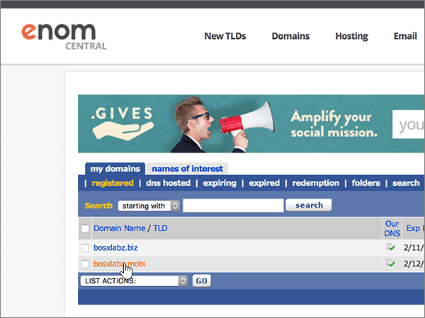
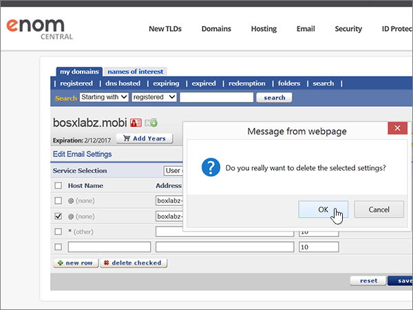
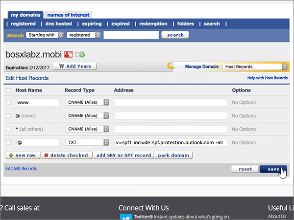

# Erstellen von DNS-Einträgen bei eNomCentral für Microsoft

 **[Überprüfen Sie die häufig gestellten Fragen (FAQ) zu Domänen](../setup/domains-faq.yml)**, wenn Sie nicht finden, wonach Sie suchen.

Wenn "eNomCentral" Ihr DNS-Hostinganbieter ist, führen Sie die in diesem Artikel aufgeführten Schritte aus, um Ihre Domäne zu überprüfen und DNS-Einträge für E-Mail, Skype for Business Online und andere Dienste einzurichten.

Nachdem Sie diese Datensätze bei eNomCentral hinzugefügt haben, wird Ihre Domäne für die Arbeit mit Microsoft-Diensten eingerichtet.

> [!NOTE]
> Normalerweise dauert es ungefähr 15 Minuten, bis DNS-Änderungen wirksam werden. Es kann jedoch gelegentlich länger dauern, bis eine von Ihnen vorgenommene Änderung im Internet im DNS-System aktualisiert wurde. Wenn nach dem Hinzufügen von DNS-Einträgen Probleme mit dem E-Mail-Fluss oder andere Probleme auftreten, lesen Sie [Behandeln von Problemen nach Änderung des Domänennamens oder von DNS-Einträgen](../get-help-with-domains/find-and-fix-issues.md).

## Hinzufügen eines TXT-Eintrags zur Überprüfung

Bevor Sie Ihre Domäne mit Microsoft verwenden können, müssen wir uns vergewissern, dass Sie deren Besitzer sind. Ihre Fähigkeit, sich bei Ihrem Konto bei Ihrer Domänenregistrierungsstelle anzumelden und den DNS-Eintrag zu erstellen, ist für Microsoft der Nachweis, dass Sie der Besitzer der Domäne sind.

> [!NOTE]
> Dieser Eintrag wird nur verwendet, um zu überprüfen, ob Sie der Besitzer Ihrer Domäne sind. Er hat keine weiteren Auswirkungen. Sie können ihn später ggf. löschen.

Führen Sie die folgenden Schritte aus, oder [schauen Sie sich das Video an (beginnen Sie bei 0:46)](https://support.microsoft.com/office/3766a9e8-77dd-4a42-908d-89b076143e7d).

1. Im ersten Schritt navigieren Sie über [diesen Link](https://www.enomcentral.com/domains/Domain-Manager.aspx?tab=registered) zu Ihrer Domänenseite bei eNom Central. Sie werden aufgefordert, sich anzumelden.

   

2. Wählen **Sie unter** meine Domänen den Namen der Domäne aus, die Sie bearbeiten möchten.

   

3. Wählen Sie in der Dropdownliste **Manage Domain** den Eintrag **Host Records**.

   

4. Geben Sie in den Feldern für den neuen Eintrag die Werte aus der folgenden Tabelle ein. Sie können die Werte auch kopieren und einfügen.

   Wählen Sie **in der** Dropdownliste den Wert Datensatztyp aus.

   |Hostname|Record Type|Adresse|
   |---|---|---|
   |@|TXT|MS=ms *XXXXXXXX*    **Hinweis:** Dies ist ein Beispiel. Verwenden Sie hier Ihren spezifischen Wert für **Ziel- oder Verweisadresse** aus der Tabelle in [Wie finde ich diese Angabe?](../get-help-with-domains/information-for-dns-records.md).|

   

5. Wählen Sie **Speichern aus.**

   

6. Warten Sie einige Minuten, bevor Sie fortfahren, damit der soeben erstellte Eintrag im Internet aktualisiert werden kann.

Nachdem Sie den Eintrag auf der Website Ihrer Domänenregistrierungsstelle hinzugefügt haben, kehren Sie zu Microsoft 365 zurück und fordern Microsoft 365 auf, nach dem Eintrag zu suchen.

Wenn Microsoft den richtigen TXT-Eintrag findet, ist die Domäne überprüft.

1. Wechseln Sie im Microsoft Admin Center zur Seite **Einstellungen** \> <a href="https://go.microsoft.com/fwlink/p/?linkid=834818" target="_blank">Domänen</a>.

2. Wählen Sie auf der Seite **Domänen** die zu überprüfende Domäne aus.

3. Wählen Sie auf der Seite **Setup** die Option **Setup starten** aus.

4. Wählen Sie auf der Seite **Domäne überprüfen** die Option **Überprüfen** aus.

> [!NOTE]
> Normalerweise dauert es ungefähr 15 Minuten, bis DNS-Änderungen wirksam werden. Es kann jedoch gelegentlich länger dauern, bis eine von Ihnen vorgenommene Änderung im Internet im DNS-System aktualisiert wurde. Wenn nach dem Hinzufügen von DNS-Einträgen Probleme mit dem E-Mail-Fluss oder andere Probleme auftreten, lesen Sie [Behandeln von Problemen nach Änderung des Domänennamens oder von DNS-Einträgen](../get-help-with-domains/find-and-fix-issues.md).

## Fügen Sie einen MX-Eintrag hinzu, damit E-Mails für Ihre Domäne an Microsoft geleitet werden.

Führen Sie die folgenden Schritte aus, oder [schauen Sie sich das Video an (beginnen Sie bei 3:40)](https://support.microsoft.com/office/3766a9e8-77dd-4a42-908d-89b076143e7d).

1. Im ersten Schritt navigieren Sie über [diesen Link](https://www.enomcentral.com/domains/Domain-Manager.aspx?tab=registered) zu Ihrer Domänenseite bei eNom Central. Sie werden aufgefordert, sich anzumelden.

   

2. Wählen **Sie unter** meine Domänen den Namen der Domäne aus, die Sie bearbeiten möchten.

   

3. Wählen Sie in der Dropdownliste **Manage Domain** den Eintrag **Email Settings** aus.

   

4. Wählen Sie in der Dropdownliste **Service Selection** die Option **User (MX)** aus.

   

5. In the boxes for the new record, type or copy and paste the values from the following table.

   |Hostname|Adresse|Pref|
   |---|---|---|
   |@| *\<domain-key\>*  .mail.protection.outlook.com.    **Dieser Wert MUSS mit einem Punkt (.) enden.**   **Hinweis:** Erhalten Sie Ihren *\<domain-key\>* über Ihr Microsoft-Konto. [Wie finde ich diese Angabe?](../get-help-with-domains/information-for-dns-records.md)|10      Weitere Informationen zur Priorität finden Sie unter [Was ist MX-Priorität?](../setup/domains-faq.yml)|

   

6. Wählen Sie **Speichern aus.**

   

7. Wenn bereits andere MX-Einträge vorhanden sind, aktivieren Sie die Kontrollkästchen für diese Einträge, um sie auszuwählen.

   

8. Wählen **Sie Lösch aktiviert aus.**

   

## Hinzufügen der für Microsoft erforderlichen CNAME-Einträge

Führen Sie die folgenden Schritte aus, oder [schauen Sie sich das Video an (beginnen Sie bei 4:24)](https://support.microsoft.com/office/3766a9e8-77dd-4a42-908d-89b076143e7d).

1. Im ersten Schritt navigieren Sie über [diesen Link](https://www.enomcentral.com/domains/Domain-Manager.aspx?tab=registered) zu Ihrer Domänenseite bei eNom Central. Sie werden aufgefordert, sich anzumelden.

   

2. Wählen **Sie unter** meine Domänen den Namen der Domäne aus, die Sie bearbeiten möchten.

   

3. Wählen Sie in der Dropdownliste **Manage Domain** den Eintrag **Host Records**.

   

4. Wählen **Sie neue Zeile aus.**

   

5. Geben Sie in den Feldern für die sechs neuen Einträge die folgenden Werte ein. Sie können die Werte auch kopieren und einfügen.

   Wählen Sie **in der** Dropdownliste den Wert Datensatztyp aus.

   |Hostname|Record Type|Adresse|
   |---|---|---|
   |autodiscover|CNAME (Alias)|autodiscover.outlook.com.    **Dieser Wert MUSS mit einem Punkt (.) enden.**|
   |sip|CNAME (Alias)|sipdir.online.lync.com.    **Dieser Wert MUSS mit einem Punkt (.) enden.**|
   |lyncdiscover|CNAME (Alias)|webdir.online.lync.com.    **Dieser Wert MUSS mit einem Punkt (.) enden.**|
   |enterpriseregistration|CNAME (Alias)|enterpriseregistration.windows.net.    **Dieser Wert MUSS mit einem Punkt (.) enden.**|
   |enterpriseenrollment|CNAME (Alias)|enterpriseenrollment-s.manage.microsoft.com.    **Dieser Wert MUSS mit einem Punkt (.) enden.**|

   

6. Wählen Sie **Speichern aus.**

   

## Hinzufügen eines TXT-Eintrags für SPF, um E-Mail-Spam zu verhindern

> [!IMPORTANT]
> Es kann bei einer Domäne nur einen TXT-Eintrag für SPF geben. Wenn es bei Ihrer Domäne mehrere SPF-Einträge gibt, treten E-Mail-Fehler sowie Probleme bei der Übermittlung und Spamklassifizierung auf. Wenn es für Ihre Domäne bereits einen SPF-Eintrag gibt, erstellen Sie für Microsoft keinen neuen, sondern fügen Sie die erforderlichen Microsoft-Werte dem aktuellen Eintrag hinzu. Damit verfügen Sie über einen *einzigen* SPF-Eintrag, in dem beide Wertemengen enthalten sind.

Führen Sie die folgenden Schritte aus, oder [schauen Sie sich das Video an (beginnen Sie bei 5:12)](https://support.microsoft.com/office/3766a9e8-77dd-4a42-908d-89b076143e7d).

1. Im ersten Schritt navigieren Sie über [diesen Link](https://www.enomcentral.com/domains/Domain-Manager.aspx?tab=registered) zu Ihrer Domänenseite bei eNom Central. Sie werden aufgefordert, sich anzumelden.

   

2. Wählen **Sie unter** meine Domänen den Namen der Domäne aus, die Sie bearbeiten möchten.

   

3. Wählen Sie in der Dropdownliste **Manage Domain** den Eintrag **Host Records**.

   

4. Geben Sie in den Feldern für den neuen Eintrag die Werte aus der folgenden Tabelle ein. Sie können die Werte auch kopieren und einfügen.

   Wählen Sie **in der** Dropdownliste den Wert Datensatztyp aus.

   |Hostname|Record Type|Adresse|
   |---|---|---|
   |@|TXT|v=spf1 include:spf.protection.outlook.com -all   **Hinweis:** Es wird empfohlen, diesen Eintrag zu kopieren und einzufügen, damit alle Abstände korrekt übernommen werden.|

   

5. Wählen Sie **Speichern aus.**

   

## Hinzufügen der für Microsoft erforderlichen zwei SRV-Einträge

Führen Sie die folgenden Schritte aus, oder [schauen Sie sich das Video an (beginnen Sie bei 5:50)](https://support.microsoft.com/office/3766a9e8-77dd-4a42-908d-89b076143e7d).

1. Im ersten Schritt navigieren Sie über [diesen Link](https://www.enomcentral.com/domains/Domain-Manager.aspx?tab=registered) zu Ihrer Domänenseite bei eNom Central. Sie werden aufgefordert, sich anzumelden.

   

2. Wählen **Sie unter** meine Domänen den Namen der Domäne aus, die Sie bearbeiten möchten.

   

3. Wählen Sie in der Dropdownliste **Manage Domain** den Eintrag **Host Records**.

   

4. Wählen Sie rechts neben **der neuen Zeile** die Option **SRV- oder SPF-Eintrag hinzufügen aus.**

   

5. Geben Sie in die Felder für die zwei neuen Einträge die Werte aus der folgenden Tabelle ein. Sie können die Werte auch kopieren und einfügen.

   |Dienst|Protokoll|Priorität|Schriftbreite|Port|Target (Hostname)|
   |---|---|---|---|---|---|
   |_sip|_tls|100|1|443|sipdir.online.lync.com.    **Dieser Wert MUSS mit einem Punkt (.) enden.**|
   |_sipfederationtls|_tcp|100|1|5061|sipfed.online.lync.com.    **Dieser Wert MUSS mit einem Punkt (.) enden.**|

   

6. Speichern **auswählen**

   

> [!NOTE]
> Normalerweise dauert es ungefähr 15 Minuten, bis DNS-Änderungen wirksam werden. Es kann jedoch gelegentlich länger dauern, bis eine von Ihnen vorgenommene Änderung im Internet im DNS-System aktualisiert wurde. Wenn nach dem Hinzufügen von DNS-Einträgen Probleme mit dem E-Mail-Fluss oder andere Probleme auftreten, lesen Sie [Behandeln von Problemen nach Änderung des Domänennamens oder von DNS-Einträgen](../get-help-with-domains/find-and-fix-issues.md).