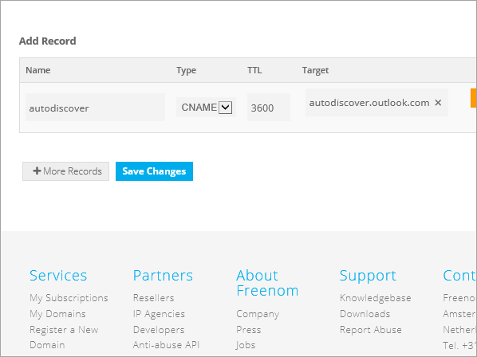

# Erstellen von DNS-Einträgen bei Freenom für MicrosoftCreate DNS records at Freenom for Microsoft

[] [Überprüfen Sie die häufig gestellten Fragen (FAQ) zu Domänen](../setup/domains-faq.md) , wenn Sie nicht finden, wonach Sie suchen.[Check the Domains FAQ ](../setup/domains-faq.md) if you don't find what you're looking for. 
  
> [!CAUTION]
> Die Freenom-Website unterstützt keine SRV-Einträge, was bedeutet, dass mehrere Skype for Business Online und Outlook Web App Funktionen nicht funktionieren.The Freenom website doesn't support SRV records, which means that several Skype for Business Online and Outlook Web App features won't work. Unabhängig davon, welchen Microsoft-Plan Sie verwenden, gibt es erhebliche Diensteinschränkungen, und Sie möchten möglicherweise zu einem anderen DNS-Hostanbieter wechseln.No matter which Microsoft plan you use, there are significant service limitations, and you may want to switch to a different DNS hosting provider. 
  
Wenn Sie trotz der Diensteinschränkungen ihre eigenen Microsoft-DNS-Einträge bei Freenom verwalten möchten, befolgen Sie die Schritte in diesem Artikel, um Ihre Domäne zu überprüfen und DNS-Einträge für e-Mail und andere Dienste einzurichten.If despite the service limitations, you choose to manage your own Microsoft DNS records at Freenom, follow the steps in this article to verify your domain and set up DNS records for email and other services.
  
Informationen über Webhosting und DNS für Websites mit Microsoft finden Sie unter [Verwenden einer öffentlichen Website mit Microsoft](https://support.office.com/article/a8178510-501d-4bd8-9921-b04f2e9517a5.aspx).To learn about webhosting and DNS for websites with Microsoft, see [Use a public website with Microsoft](https://support.office.com/article/a8178510-501d-4bd8-9921-b04f2e9517a5.aspx).
  
> [!NOTE]
> Normalerweise dauert es ungefähr 15 Minuten, bis DNS-Änderungen wirksam werden. Es kann jedoch gelegentlich länger dauern, bis eine von Ihnen vorgenommene Änderung im Internet im DNS-System aktualisiert wurde. Wenn nach dem Hinzufügen von DNS-Einträgen Probleme mit dem E-Mail-Fluss oder andere Probleme auftreten, lesen Sie [Behandeln von Problemen nach Änderung des Domänennamens oder von DNS-Einträgen](../get-help-with-domains/find-and-fix-issues.md).Typically it takes about 15 minutes for DNS changes to take effect. However, it can occasionally take longer for a change you've made to update across the Internet's DNS system. If you're having trouble with mail flow or other issues after adding DNS records, see [Troubleshoot issues after changing your domain name or DNS records](../get-help-with-domains/find-and-fix-issues.md). 
  
## Hinzufügen eines TXT-Eintrags zur ÜberprüfungAdd a TXT record for verification

Bevor Sie Ihre Domäne mit Microsoft verwenden, müssen wir sicherstellen, dass Sie Sie besitzen.Before you use your domain with Microsoft, we have to make sure that you own it. Ihre Fähigkeit, sich bei Ihrem Konto bei Ihrer Domänenregistrierungsstelle anzumelden und den DNS-Eintrag zu erstellen, beweist Microsoft, dass Sie die Domäne besitzen.Your ability to log in to your account at your domain registrar and create the DNS record proves to Microsoft that you own the domain.
  
> [!NOTE]
> Dieser Eintrag wird nur verwendet, um zu überprüfen, ob Sie der Besitzer Ihrer Domäne sind. Er hat keine weiteren Auswirkungen. Sie können ihn später ggf. löschen.This record is used only to verify that you own your domain; it doesn't affect anything else. You can delete it later, if you like. 
  
1. Um zu beginnen, navigieren Sie über [diesen Link](https://my.freenom.com/)zu ihrer Domänen Seite in Freenom.To get started, go to your domains page in Freenom by using [this link](https://my.freenom.com/). Sie werden aufgefordert, sich anzumelden.You'll be prompted to log in.
    
    
  
2. Wählen Sie **Dienste**aus, und wählen Sie dann **Meine Domänen**aus.Select **Services**, and then select **My Domains**.
    
    
  
3. Wählen Sie für die Domäne, die Sie bearbeiten möchten, die Option **Domäne verwalten**aus.For the domain that you want to edit, select **Manage Domain**.
    
    
  
4. Wählen Sie **Freenom DNS verwalten**aus.Select **Manage Freenom DNS**.
    
    
  
5. Wählen Sie unter **Add Record** (Eintrag hinzufügen) in der Spalte **Type** (Typ) im Menü **TXT** aus.Under **Add Record**, in the **Type** column, choose **TXT** from the menu. 
    
    
  
6. Geben Sie in den Feldern für den neuen Eintrag die Werte aus der folgenden Tabelle ein. Sie können die Werte auch kopieren und einfügen.In the boxes for the new record, type or copy and paste the values from the following table. 
    
    |**Name****Name**|**Type****Type**|**TTL****TTL**|**Target****Target**|
    |:-----|:-----|:-----|:-----|
    |(leer lassen)(leave blank)    |TXTTXT    |3600 (Sekunden)3600 (seconds)    |MS = msXXXXXXXXMS=msXXXXXXXX    **Hinweis:** Dies ist ein Beispiel.**Note:** This is an example. Verwenden Sie hier Ihre spezifischen **Ziel-oder Punkt-zu-Adresse** -Werte aus der Tabelle.Use your specific **Destination or Points to Address** value here, from the table.           [Wie finde ich diese Angabe?How do I find this?](../get-help-with-domains/information-for-dns-records.md)          |
   
    
  
7. Wählen Sie **Save Changes**aus.Select **Save Changes**.
    
    
  
8. Warten Sie einige Minuten, bevor Sie fortfahren, damit der soeben erstellte Eintrag im Internet aktualisiert werden kann.Wait a few minutes before you continue, so that the record you just created can update across the Internet.
    
Nachdem Sie den Eintrag auf der Website Ihrer Domänenregistrierungsstelle hinzugefügt haben, kehren Sie zu Microsoft zurück und fordern den Eintrag an.Now that you've added the record at your domain registrar's site, you'll go back to Microsoft and request the record.
  
Wenn Microsoft den richtigen TXT-Eintrag findet, wird Ihre Domäne überprüft.When Microsoft finds the correct TXT record, your domain is verified.
  
1. Wechseln Sie im Microsoft Admin Center zur Seite mit den **Einstellungs** \> <a href="https://go.microsoft.com/fwlink/p/?linkid=834818" target="_blank">Domänen</a> .In the Microsoft admin center, go to the **Settings** \> <a href="https://go.microsoft.com/fwlink/p/?linkid=834818" target="_blank">Domains</a> page.

    
2. Wählen Sie auf der Seite **Domänen** die zu überprüfende Domäne aus.On the **Domains** page, select the domain that you are verifying. 
    
    
  
3. Wählen Sie auf der Seite **Setup** die Option **Setup starten** aus.On the **Setup** page, select **Start setup**.
    
    
  
4. Wählen Sie auf der Seite **Domäne überprüfen** die Option **Überprüfen** aus.On the **Verify domain** page, select **Verify**.
    
    
  
> [!NOTE]
>  Normalerweise dauert es ungefähr 15 Minuten, bis DNS-Änderungen wirksam werden. Es kann jedoch gelegentlich länger dauern, bis eine von Ihnen vorgenommene Änderung im Internet im DNS-System aktualisiert wurde. Wenn nach dem Hinzufügen von DNS-Einträgen Probleme mit dem E-Mail-Fluss oder andere Probleme auftreten, lesen Sie [Behandeln von Problemen nach Änderung des Domänennamens oder von DNS-Einträgen](../get-help-with-domains/find-and-fix-issues.md).Typically it takes about 15 minutes for DNS changes to take effect. However, it can occasionally take longer for a change you've made to update across the Internet's DNS system. If you're having trouble with mail flow or other issues after adding DNS records, see [Troubleshoot issues after changing your domain name or DNS records](../get-help-with-domains/find-and-fix-issues.md). 
  
## Hinzufügen eines MX-Eintrags, damit e-Mails für Ihre Domäne an Microsoft gelangenAdd an MX record so email for your domain will come to Microsoft

1. Um zu beginnen, navigieren Sie über [diesen Link](https://my.freenom.com/)zu ihrer Domänen Seite in Freenom.To get started, go to your domains page in Freenom by using [this link](https://my.freenom.com/). Sie werden aufgefordert, sich anzumelden.You'll be prompted to log in.
    
    
  
2. Wählen Sie **Dienste**aus, und wählen Sie dann **Meine Domänen**aus.Select **Services**, and then select **My Domains**.
    
    
  
3. Wählen Sie für die Domäne, die Sie bearbeiten möchten, die Option **Domäne verwalten**aus.For the domain that you want to edit, select **Manage Domain**.
    
    
  
4. Legen Sie den Namen dient für Ihre Domäne auf die standardmäßigen Freenom Namenserver.Set the name serves for your domain to the default Freenom name servers. Wählen Sie **Verwaltungs Tools**aus, und wählen Sie dann Namen **Server**aus.Select **Management Tools**, and then select **Nameservers**.
    
    
  
5. Stellen Sie sicher, dass **Standardnamen Server verwenden** ausgewählt ist, und wählen Sie dann Namen von Namen **Servern ändern**aus.Make sure **Use default nameservers** is selected, and then select **Change Nameservers**.
    
    
  
6. Wählen Sie **Freenom DNS verwalten**aus.Select **Manage Freenom DNS**.
    
    
  
7. Wählen Sie unter **Add Record** (Eintrag hinzufügen) in der Spalte **Type** (Typ) im Menü **MX** aus.Under **Add Record**, in the **Type** column, choose **MX** from the menu. 
    
    
  
8. Geben Sie in den Feldern für den neuen Eintrag die Werte aus der ersten Zeile der folgenden Tabelle ein. Sie können die Werte auch kopieren und einfügen.In the boxes for the new record, type or copy and paste the values from the first row of the following table. 
    
    |**Name****Name**|**Type****Type**|**TTL****TTL**|**Target****Target**|**Priorität****Priority**|
    |:-----|:-----|:-----|:-----|:-----|
    |(leer lassen)(leave blank)    |MX (Mail Exchanger)MX (Mail Exchanger)    |3600 (Sekunden)3600 (seconds)    |\<Domain-Key\>. Mail.Protection.Outlook.com\<domain-key\>.mail.protection.outlook.com    **Hinweis:** Rufen Sie Ihren \* \<Domänenschlüssel\> \* von Ihrem Microsoft-Konto ab.**Note:** Get your  *\<domain-key\>*  from your Microsoft account.   [Wie finde ich diese Angabe?How do I find this?](../get-help-with-domains/information-for-dns-records.md)          |10  10    Weitere Informationen zur Priorität finden Sie unter [Was ist MX-Priorität?](https://support.office.com/article/17d415c1-067e-4974-84d5-aaeaf3a0c0a9)For more information about priority, see [What is MX priority?](https://support.office.com/article/17d415c1-067e-4974-84d5-aaeaf3a0c0a9)   |
   
   
  
9. Wählen Sie **Save Changes**aus.Select **Save Changes**.
    
    
  
10. Wenn es weitere MX-Einträge gibt, löschen Sie sie alle: Wählen Sie für jeden Eintrag Delete (Löschen) aus.If there are any other MX records, delete them all. Wählen Sie für jeden Datensatz **Löschen**aus.For each record, select **Delete**. Wenn die Nachricht möchten **Sie diesen Eintrag wirklich entfernen?** angezeigt wird, klicken Sie auf **OK**.When the message **Do you really want to remove this entry?** appears, select **OK**.
    
## Hinzufügen der für Microsoft erforderlichen CNAME-EinträgeAdd the CNAME records that are required for Microsoft

1. Um zu beginnen, navigieren Sie über [diesen Link](https://my.freenom.com/)zu ihrer Domänen Seite in Freenom.To get started, go to your domains page in Freenom by using [this link](https://my.freenom.com/). Sie werden aufgefordert, sich anzumelden.You'll be prompted to log in.
    
    
  
2. Wählen Sie **Dienste**aus, und wählen Sie dann **Meine Domänen**aus.Select **Services**, and then select **My Domains**.
    
    
  
3. Wählen Sie für die Domäne, die Sie bearbeiten möchten, die Option **Domäne verwalten**aus.For the domain that you want to edit, select **Manage Domain**.
    
    
  
4. Wählen Sie **Freenom DNS verwalten**aus.Select **Manage Freenom DNS**.
    
    
  
5. Wählen Sie unter **Add Record** (Eintrag hinzufügen) in der Spalte **Type** (Typ) im Menü **SNAME** aus.Under **Add Record**, in the **Type** column, choose **CNAME** from the menu. 
    
    
  
6. Erstellen Sie den ersten CNAME-Eintrag. Geben Sie dann in den Feldern für den neuen Eintrag die Werte aus der ersten Zeile der folgenden Tabelle ein. Sie können die Werte auch kopieren und einfügen.Create the first CNAME record. In the boxes for the new record, type or copy and paste the values from the first row of the following table. 
    
    |**Name****Name**|**Eintragstyp****Record type**|**TTL****TTL**|**Target****Target**|
    |:-----|:-----|:-----|:-----|
    |autodiscoverautodiscover    |CNAMECNAME    |3600 (Sekunden)3600 (seconds)    |autodiscover.outlook.comautodiscover.outlook.com    |
    |sipsip    |CNAMECNAME    |3600 (Sekunden)3600 (seconds)    |sipdir.online.lync.comsipdir.online.lync.com    |
    |lyncdiscoverlyncdiscover    |CNAMECNAME    |3600 (Sekunden)3600 (seconds)    |webdir.online.lync.comwebdir.online.lync.com    |
    |enterpriseregistrationenterpriseregistration    |CNAMECNAME    |3600 (Sekunden)3600 (seconds)    |enterpriseregistration.windows.netenterpriseregistration.windows.net    |
    |enterpriseenrollmententerpriseenrollment    |CNAMECNAME    |3600 (Sekunden)3600 (seconds)    |enterpriseenrollment-s.manage.microsoft.comenterpriseenrollment-s.manage.microsoft.com    |
   
    
  
7. Wählen Sie **Save Changes**aus.Select **Save Changes**.
    
    
  
8. Wiederholen Sie die vorherigen Schritte, um die anderen fünf CNAME-Einträge zu erstellen.Repeat the previous steps to create the other five CNAME records. 
    
    Geben Sie für jeden Eintrag die Werte aus der nächsten Zeile der Tabelle oben in die Felder für diesen Eintrag ein. Sie können die Werte auch kopieren und einfügen.For each record, type or copy and paste the values from the next row of the table above into the boxes for that record.
    
## Hinzufügen eines TXT-Eintrags für SPF, um E-Mail-Spam zu verhindernAdd a TXT record for SPF to help prevent email spam

> [!IMPORTANT]
> Es kann bei einer Domäne nur einen TXT-Eintrag für SPF geben.You cannot have more than one TXT record for SPF for a domain. Wenn es bei Ihrer Domäne mehrere SPF-Einträge gibt, treten E-Mail-Fehler sowie Probleme bei der Übermittlung und Spamklassifizierung auf.If your domain has more than one SPF record, you'll get email errors, as well as delivery and spam classification issues. Wenn Sie bereits einen SPF-Eintrag für Ihre Domäne haben, erstellen Sie keinen neuen für Microsoft.If you already have an SPF record for your domain, don't create a new one for Microsoft. Fügen Sie stattdessen die erforderlichen Microsoft-Werte zum aktuellen Datensatz hinzu, sodass Sie einen *einzelnen* SPF-Eintrag haben, der beide Wertegruppen enthält.Instead, add the required Microsoft values to the current record so that you have a  *single*  SPF record that includes both sets of values. 

1. Um zu beginnen, navigieren Sie über [diesen Link](https://my.freenom.com/)zu ihrer Domänen Seite in Freenom.To get started, go to your domains page in Freenom by using [this link](https://my.freenom.com/). Sie werden aufgefordert, sich anzumelden.You'll be prompted to log in.
    
    
  
2. Wählen Sie **Dienste**aus, und wählen Sie dann **Meine Domänen**aus.Select **Services**, and then select **My Domains**.
    
    
  
3. Wählen Sie für die Domäne, die Sie bearbeiten möchten, die Option **Domäne verwalten**aus.For the domain that you want to edit, select **Manage Domain**.
    
    
  
4. Wählen Sie **Freenom DNS verwalten**aus.Select **Manage Freenom DNS**.
    
    
  
5. Wählen Sie unter **Add Record** (Eintrag hinzufügen) in der Spalte **Type** (Typ) im Menü **TXT** aus.Under **Add Record**, in the **Type** column, choose **TXT** from the menu. 
    
    
  
6. Geben Sie in den Feldern für den neuen Eintrag die folgenden Werte ein. Sie können die Werte auch kopieren und einfügen.In the boxes for the new record, type or copy and paste the following values. 
    
    |**Name****Name**|**Eintragstyp****Record type**|**TTL****TTL**|**Target****Target**|
    |:-----|:-----|:-----|:-----|
    |(leer lassen)(leave blank)    |TXTTXT    |3600 (Sekunden)3600 (seconds)    |v=spf1 include:spf.protection.outlook.com -allv=spf1 include:spf.protection.outlook.com -all   **Hinweis:** Es wird empfohlen, diesen Eintrag zu kopieren und einzufügen, damit alle Abstände korrekt übernommen werden.**Note:** We recommend copying and pasting this entry, so that all of the spacing stays correct.           |
   
    
  
7. Wählen Sie **Save Changes**aus.Select **Save Changes**.
    
    
  

