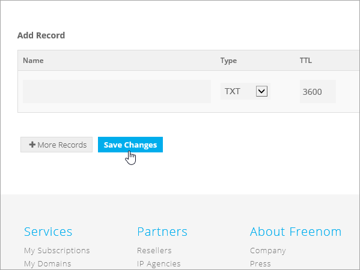
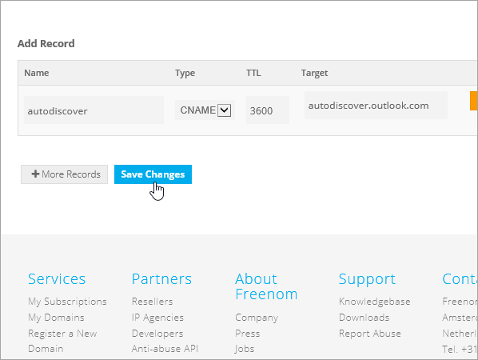

# Erstellen von DNS-Einträgen bei Freenom für Microsoft

[] [Überprüfen Sie die häufig gestellten Fragen (FAQ) zu Domänen](../setup/domains-faq.md) , wenn Sie nicht finden, wonach Sie suchen. 
  
> [!CAUTION]
> Die Freenom-Website unterstützt keine SRV-Einträge, was bedeutet, dass mehrere Skype for Business Online und Outlook Web App Funktionen nicht funktionieren. Unabhängig davon, welchen Microsoft-Plan Sie verwenden, gibt es erhebliche Diensteinschränkungen, und Sie möchten möglicherweise zu einem anderen DNS-Hostanbieter wechseln. 
  
Wenn Sie trotz der Diensteinschränkungen ihre eigenen Microsoft-DNS-Einträge bei Freenom verwalten möchten, befolgen Sie die Schritte in diesem Artikel, um Ihre Domäne zu überprüfen und DNS-Einträge für e-Mail und andere Dienste einzurichten.
  
  
> [!NOTE]
> Normalerweise dauert es ungefähr 15 Minuten, bis DNS-Änderungen wirksam werden. Es kann jedoch gelegentlich länger dauern, bis eine von Ihnen vorgenommene Änderung im Internet im DNS-System aktualisiert wurde. Wenn nach dem Hinzufügen von DNS-Einträgen Probleme mit dem E-Mail-Fluss oder andere Probleme auftreten, lesen Sie [Behandeln von Problemen nach Änderung des Domänennamens oder von DNS-Einträgen](../get-help-with-domains/find-and-fix-issues.md). 
  
## Hinzufügen eines TXT-Eintrags zur Überprüfung

Bevor Sie Ihre Domäne mit Microsoft verwenden können, müssen wir uns vergewissern, dass Sie deren Besitzer sind. Ihre Fähigkeit, sich bei Ihrem Konto bei Ihrer Domänenregistrierungsstelle anzumelden und den DNS-Eintrag zu erstellen, ist für Microsoft der Nachweis, dass Sie der Besitzer der Domäne sind.
  
> [!NOTE]
> Dieser Eintrag wird nur verwendet, um zu überprüfen, ob Sie der Besitzer Ihrer Domäne sind. Er hat keine weiteren Auswirkungen. Sie können ihn später ggf. löschen. 
  
1. Um zu beginnen, navigieren Sie über [diesen Link](https://my.freenom.com/)zu ihrer Domänen Seite in Freenom. Sie werden aufgefordert, sich anzumelden.
    
    
  
2. Wählen Sie **Dienste**aus, und wählen Sie dann **Meine Domänen**aus.
    
    
  
3. Wählen Sie für die Domäne, die Sie bearbeiten möchten, die Option **Domäne verwalten**aus.
    
    
  
4. Wählen Sie **Freenom DNS verwalten**aus.
    
    
  
5. Wählen Sie unter **Add Record** (Eintrag hinzufügen) in der Spalte **Type** (Typ) im Menü **TXT** aus. 
    
    
  
6. Geben Sie in den Feldern für den neuen Eintrag die Werte aus der folgenden Tabelle ein. Sie können die Werte auch kopieren und einfügen. 
    
    |**Name**|**Typ**|**TTL**|**Target**|
    |:-----|:-----|:-----|:-----|
    |(leer lassen)    |TXT    |3600 (Sekunden)    |MS = msXXXXXXXX    **Hinweis:** Dies ist ein Beispiel. Verwenden Sie hier Ihre spezifischen **Ziel-oder Punkt-zu-Adresse** -Werte aus der Tabelle.           [Wie finde ich diese Angabe?](../get-help-with-domains/information-for-dns-records.md)          |
   
    
  
7. Wählen Sie **Save Changes**aus.
    
    
  
8. Warten Sie einige Minuten, bevor Sie fortfahren, damit der soeben erstellte Eintrag im Internet aktualisiert werden kann.
    
Nachdem Sie den Eintrag auf der Website Ihrer Domänenregistrierungsstelle hinzugefügt haben, kehren Sie zu Microsoft zurück und fordern Sie den Eintrag an.
  
Wenn Microsoft den richtigen TXT-Eintrag findet, ist die Domäne überprüft.
  
1. Wechseln Sie im Microsoft Admin Center zur Seite **Einstellungen** \> <a href="https://go.microsoft.com/fwlink/p/?linkid=834818" target="_blank">Domänen</a>.

    
2. Wählen Sie auf der Seite **Domänen** die zu überprüfende Domäne aus. 
    
    
  
3. Wählen Sie auf der Seite **Setup** die Option **Setup starten** aus.
    
    
  
4. Wählen Sie auf der Seite **Domäne überprüfen** die Option **Überprüfen** aus.
    
    
  
> [!NOTE]
>  Normalerweise dauert es ungefähr 15 Minuten, bis DNS-Änderungen wirksam werden. Es kann jedoch gelegentlich länger dauern, bis eine von Ihnen vorgenommene Änderung im Internet im DNS-System aktualisiert wurde. Wenn nach dem Hinzufügen von DNS-Einträgen Probleme mit dem E-Mail-Fluss oder andere Probleme auftreten, lesen Sie [Behandeln von Problemen nach Änderung des Domänennamens oder von DNS-Einträgen](../get-help-with-domains/find-and-fix-issues.md). 
  
## Fügen Sie einen MX-Eintrag hinzu, damit E-Mails für Ihre Domäne an Microsoft geleitet werden.

1. Um zu beginnen, navigieren Sie über [diesen Link](https://my.freenom.com/)zu ihrer Domänen Seite in Freenom. Sie werden aufgefordert, sich anzumelden.
    
    
  
2. Wählen Sie **Dienste**aus, und wählen Sie dann **Meine Domänen**aus.
    
    
  
3. Wählen Sie für die Domäne, die Sie bearbeiten möchten, die Option **Domäne verwalten**aus.
    
    
  
4. Legen Sie den Namen dient für Ihre Domäne auf die standardmäßigen Freenom Namenserver. Wählen Sie **Verwaltungs Tools**aus, und wählen Sie dann Namen **Server**aus.
    
    
  
5. Stellen Sie sicher, dass **Standardnamen Server verwenden** ausgewählt ist, und wählen Sie dann Namen von Namen **Servern ändern**aus.
    
    
  
6. Wählen Sie **Freenom DNS verwalten**aus.
    
    
  
7. Wählen Sie unter **Add Record** (Eintrag hinzufügen) in der Spalte **Type** (Typ) im Menü **MX** aus. 
    
    
  
8. Geben Sie in den Feldern für den neuen Eintrag die Werte aus der ersten Zeile der folgenden Tabelle ein. Sie können die Werte auch kopieren und einfügen. 
    
    |**Name**|**Typ**|**TTL**|**Target**|**Priorität**|
    |:-----|:-----|:-----|:-----|:-----|
    |(leer lassen)    |MX (Mail Exchanger)    |3600 (Sekunden)    |\<Domain-Key\>. Mail.Protection.Outlook.com    **Hinweis:** Rufen Sie Ihren * \<Domänenschlüssel\> * von Ihrem Microsoft-Konto ab.   [Wie finde ich diese Angabe?](../get-help-with-domains/information-for-dns-records.md)          |10      Weitere Informationen zur Priorität finden Sie unter [Was ist MX-Priorität?](https://support.office.com/article/17d415c1-067e-4974-84d5-aaeaf3a0c0a9)   |
   
   
  
9. Wählen Sie **Save Changes**aus.
    
    
  
10. Wenn es weitere MX-Einträge gibt, löschen Sie sie alle: Wählen Sie für jeden Eintrag Delete (Löschen) aus. Wählen Sie für jeden Datensatz **Löschen**aus. Wenn die Nachricht möchten **Sie diesen Eintrag wirklich entfernen?** angezeigt wird, klicken Sie auf **OK**.
    
## Hinzufügen der für Microsoft erforderlichen CNAME-Einträge

1. Um zu beginnen, navigieren Sie über [diesen Link](https://my.freenom.com/)zu ihrer Domänen Seite in Freenom. Sie werden aufgefordert, sich anzumelden.
    
    
  
2. Wählen Sie **Dienste**aus, und wählen Sie dann **Meine Domänen**aus.
    
    
  
3. Wählen Sie für die Domäne, die Sie bearbeiten möchten, die Option **Domäne verwalten**aus.
    
    
  
4. Wählen Sie **Freenom DNS verwalten**aus.
    
    
  
5. Wählen Sie unter **Add Record** (Eintrag hinzufügen) in der Spalte **Type** (Typ) im Menü **SNAME** aus. 
    
    
  
6. Erstellen Sie den ersten CNAME-Eintrag. Geben Sie dann in den Feldern für den neuen Eintrag die Werte aus der ersten Zeile der folgenden Tabelle ein. Sie können die Werte auch kopieren und einfügen. 
    
    |**Name**|**Eintragstyp**|**TTL**|**Target**|
    |:-----|:-----|:-----|:-----|
    |autodiscover    |CNAME    |3600 (Sekunden)    |autodiscover.outlook.com    |
    |sip    |CNAME    |3600 (Sekunden)    |sipdir.online.lync.com    |
    |lyncdiscover    |CNAME    |3600 (Sekunden)    |webdir.online.lync.com    |
    |enterpriseregistration    |CNAME    |3600 (Sekunden)    |enterpriseregistration.windows.net    |
    |enterpriseenrollment    |CNAME    |3600 (Sekunden)    |enterpriseenrollment-s.manage.microsoft.com    |
   
    
  
7. Wählen Sie **Save Changes**aus.
    
    
  
8. Wiederholen Sie die vorherigen Schritte, um die anderen fünf CNAME-Einträge zu erstellen. 
    
    Geben Sie für jeden Eintrag die Werte aus der nächsten Zeile der Tabelle oben in die Felder für diesen Eintrag ein. Sie können die Werte auch kopieren und einfügen.
    
## Hinzufügen eines TXT-Eintrags für SPF, um E-Mail-Spam zu verhindern

> [!IMPORTANT]
> Es kann bei einer Domäne nur einen TXT-Eintrag für SPF geben. Wenn es bei Ihrer Domäne mehrere SPF-Einträge gibt, treten E-Mail-Fehler sowie Probleme bei der Übermittlung und Spamklassifizierung auf. Wenn es für Ihre Domäne bereits einen SPF-Eintrag gibt, erstellen Sie für Microsoft keinen neuen, Fügen Sie stattdessen die erforderlichen Microsoft-Werte zum aktuellen Datensatz hinzu, sodass Sie einen *einzelnen* SPF-Eintrag haben, der beide Wertegruppen enthält. 

1. Um zu beginnen, navigieren Sie über [diesen Link](https://my.freenom.com/)zu ihrer Domänen Seite in Freenom. Sie werden aufgefordert, sich anzumelden.
    
    
  
2. Wählen Sie **Dienste**aus, und wählen Sie dann **Meine Domänen**aus.
    
    
  
3. Wählen Sie für die Domäne, die Sie bearbeiten möchten, die Option **Domäne verwalten**aus.
    
    
  
4. Wählen Sie **Freenom DNS verwalten**aus.
    
    
  
5. Wählen Sie unter **Add Record** (Eintrag hinzufügen) in der Spalte **Type** (Typ) im Menü **TXT** aus. 
    
    
  
6. Geben Sie in den Feldern für den neuen Eintrag die folgenden Werte ein. Sie können die Werte auch kopieren und einfügen. 
    
    |**Name**|**Eintragstyp**|**TTL**|**Target**|
    |:-----|:-----|:-----|:-----|
    |(leer lassen)    |TXT    |3600 (Sekunden)    |v=spf1 include:spf.protection.outlook.com -all   **Hinweis:** Es wird empfohlen, diesen Eintrag zu kopieren und einzufügen, damit alle Abstände korrekt übernommen werden.           |
   
    
  
7. Wählen Sie **Save Changes**aus.
    
    
  

