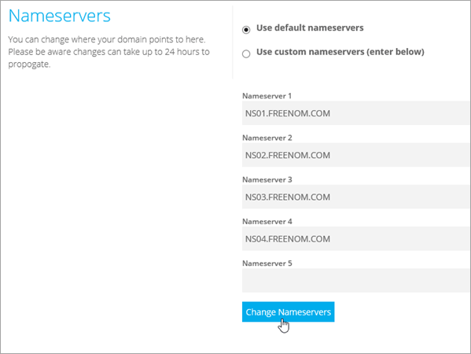
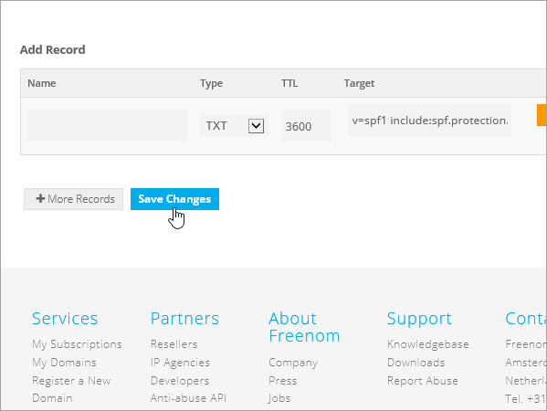

# Erstellen von DNS-Einträgen für Office 365 bei FreenomCreate DNS records at Freenom for Office 365

[] [Überprüfen Sie die häufig gestellten Fragen (FAQ) zu Domänen](../setup/domains-faq.md) , wenn Sie nicht finden, wonach Sie suchen.[Check the Domains FAQ ](../setup/domains-faq.md) if you don't find what you're looking for. 
  
> [!CAUTION]
> Die Freenom-Website unterstützt keine SRV-Einträge. Das bedeutet, dass mehrere Features von Skype for Business Online und Outlook Web App nicht funktionieren. Unabhängig vom verwendeten Office 365-Plan bestehen erhebliche Diensteinschränkungen, und es kann sinnvoll sein, zu einem anderen DNS-Hostinganbieter zu wechseln.The Freenom website doesn't support SRV records, which means that several Skype for Business Online and Outlook Web App features won't work. No matter which Office 365 plan you use, there are significant service limitations, and you may want to switch to a different DNS hosting provider. 
  
Wenn Sie trotz dieser Diensteinschränkungen Ihre Office 365-DNS-Einträge bei Freenom selbst verwalten möchten, folgen Sie den Schritten in diesem Artikel, um die Domäne zu überprüfen und DNS-Einträge für E-Mail und andere Dienste einzurichten.If despite the service limitations, you choose to manage your own Office 365 DNS records at Freenom, follow the steps in this article to verify your domain and set up DNS records for email and other services.
  
Informationen zu Webhosting und DNS für Websites mit Office 365 finden Sie unter [Verwenden einer öffentlichen Website mit Office 365](https://support.office.com/article/a8178510-501d-4bd8-9921-b04f2e9517a5.aspx).To learn about webhosting and DNS for websites with Office 365, see [Use a public website with Office 365](https://support.office.com/article/a8178510-501d-4bd8-9921-b04f2e9517a5.aspx).
  
> [!NOTE]
> Normalerweise dauert es ungefähr 15 Minuten, bis DNS-Änderungen wirksam werden. Es kann jedoch gelegentlich länger dauern, bis eine von Ihnen vorgenommene Änderung im Internet im DNS-System aktualisiert wurde. Wenn nach dem Hinzufügen von DNS-Einträgen Probleme mit dem E-Mail-Fluss oder andere Probleme auftreten, lesen Sie [Behandeln von Problemen nach Änderung des Domänennamens oder von DNS-Einträgen](../get-help-with-domains/find-and-fix-issues.md).Typically it takes about 15 minutes for DNS changes to take effect. However, it can occasionally take longer for a change you've made to update across the Internet's DNS system. If you're having trouble with mail flow or other issues after adding DNS records, see [Troubleshoot issues after changing your domain name or DNS records](../get-help-with-domains/find-and-fix-issues.md). 
  
## Hinzufügen eines TXT-Eintrags zur ÜberprüfungAdd a TXT record for verification

Bevor Sie Ihre Domäne in Office 365 verwenden können, müssen wir uns vergewissern, dass Sie deren Besitzer sind. Ihre Fähigkeit, sich bei Ihrem Konto bei Ihrer Domänenregistrierungsstelle anzumelden und den DNS-Eintrag zu erstellen, ist für Office 365 der Nachweis, dass Sie der Besitzer der Domäne sind.Before you use your domain with Office 365, we have to make sure that you own it. Your ability to log in to your account at your domain registrar and create the DNS record proves to Office 365 that you own the domain.
  
> [!NOTE]
> Dieser Eintrag wird nur verwendet, um zu überprüfen, ob Sie der Besitzer Ihrer Domäne sind. Er hat keine weiteren Auswirkungen. Sie können ihn später ggf. löschen.This record is used only to verify that you own your domain; it doesn't affect anything else. You can delete it later, if you like. 
  
1. Um zu beginnen, navigieren Sie über [diesen Link](https://my.freenom.com/)zu ihrer Domänen Seite in Freenom.To get started, go to your domains page in Freenom by using [this link](https://my.freenom.com/). Sie werden aufgefordert, sich anzumelden.You'll be prompted to log in.
    
    
  
2. Wählen Sie **Dienste**aus, und wählen Sie dann **Meine Domänen**aus.Select **Services**, and then select **My Domains**.
    
    
  
3. Wählen Sie für die Domäne, die Sie bearbeiten möchten, die Option **Domäne verwalten**aus.For the domain that you want to edit, select **Manage Domain**.
    
    
  
4. Wählen Sie **Freenom DNS verwalten**aus.Select **Manage Freenom DNS**.
    
    
  
5. Wählen Sie unter **Add Record** (Eintrag hinzufügen) in der Spalte **Type** (Typ) im Menü **TXT** aus.Under **Add Record**, in the **Type** column, choose **TXT** from the menu. 
    
    
  
6. Geben Sie in den Feldern für den neuen Eintrag die Werte aus der folgenden Tabelle ein. Sie können die Werte auch kopieren und einfügen.In the boxes for the new record, type or copy and paste the values from the following table. 
    
    |**Name****Name**|**Typ****Type**|**TTL****TTL**|**Target****Target**|
    |:-----|:-----|:-----|:-----|
    |(leer lassen)(leave blank)    |TXTTXT    |3600 (Sekunden)3600 (seconds)    |MS = msXXXXXXXXMS=msXXXXXXXX    **Hinweis:** Dies ist ein Beispiel. Verwenden Sie hier Ihren spezifischen Wert von **Ziel oder verweisende Adresse** aus der Tabelle in Office 365.           [Wie finde ich diese Angabe?](../get-help-with-domains/information-for-dns-records.md)**Note:** This is an example. Use your specific **Destination or Points to Address** value here, from the table in Office 365.           [How do I find this?](../get-help-with-domains/information-for-dns-records.md)          |
   
    
  
7. Wählen Sie **Save Changes**aus.Select **Save Changes**.
    
    
  
8. Warten Sie einige Minuten, bevor Sie fortfahren, damit der soeben erstellte Eintrag im Internet aktualisiert werden kann.Wait a few minutes before you continue, so that the record you just created can update across the Internet.
    
Nachdem Sie den Eintrag auf der Website Ihrer Domänenregistrierungsstelle hinzugefügt haben, kehren Sie zu Office 365 zurück und fordern Office 365 auf, nach dem Eintrag zu suchen.Now that you've added the record at your domain registrar's site, you'll go back to Office 365 and request Office 365 to look for the record.
  
Wenn Office 365 den richtigen TXT-Eintrag findet, wird die Domäne überprüft.When Office 365 finds the correct TXT record, your domain is verified.
  
1. Wechseln Sie im Admin Center zur Seite **Einstellungen** \> <a href="https://go.microsoft.com/fwlink/p/?linkid=834818" target="_blank">Domänen</a>.In the admin center, go to the **Settings** \> <a href="https://go.microsoft.com/fwlink/p/?linkid=834818" target="_blank">Domains</a> page.

    
2. Wählen Sie auf der Seite **Domänen** die zu überprüfende Domäne aus.On the **Domains** page, select the domain that you are verifying. 
    
    
  
3. Wählen Sie auf der Seite **Setup** die Option **Setup starten** aus.On the **Setup** page, select **Start setup**.
    
    
  
4. Wählen Sie auf der Seite **Domäne überprüfen** die Option **Überprüfen** aus.On the **Verify domain** page, select **Verify**.
    
    
  
> [!NOTE]
>  Normalerweise dauert es ungefähr 15 Minuten, bis DNS-Änderungen wirksam werden. Es kann jedoch gelegentlich länger dauern, bis eine von Ihnen vorgenommene Änderung im Internet im DNS-System aktualisiert wurde. Wenn nach dem Hinzufügen von DNS-Einträgen Probleme mit dem E-Mail-Fluss oder andere Probleme auftreten, lesen Sie [Behandeln von Problemen nach Änderung des Domänennamens oder von DNS-Einträgen](../get-help-with-domains/find-and-fix-issues.md).Typically it takes about 15 minutes for DNS changes to take effect. However, it can occasionally take longer for a change you've made to update across the Internet's DNS system. If you're having trouble with mail flow or other issues after adding DNS records, see [Troubleshoot issues after changing your domain name or DNS records](../get-help-with-domains/find-and-fix-issues.md). 
  
## Hinzufügen eines MX-Eintrags, damit E-Mails für Ihre Domäne zu Office 365 geleitet werdenAdd an MX record so email for your domain will come to Office 365

1. Um zu beginnen, navigieren Sie über [diesen Link](https://my.freenom.com/)zu ihrer Domänen Seite in Freenom.To get started, go to your domains page in Freenom by using [this link](https://my.freenom.com/). Sie werden aufgefordert, sich anzumelden.You'll be prompted to log in.
    
    
  
2. Wählen Sie **Dienste**aus, und wählen Sie dann **Meine Domänen**aus.Select **Services**, and then select **My Domains**.
    
    
  
3. Wählen Sie für die Domäne, die Sie bearbeiten möchten, die Option **Domäne verwalten**aus.For the domain that you want to edit, select **Manage Domain**.
    
    
  
4. Legen Sie den Namen dient für Ihre Domäne auf die standardmäßigen Freenom Namenserver.Set the name serves for your domain to the default Freenom name servers. Wählen Sie **Verwaltungs Tools**aus, und wählen Sie dann Namen **Server**aus.Select **Management Tools**, and then select **Nameservers**.
    
    
  
5. Stellen Sie sicher, dass **Standardnamen Server verwenden** ausgewählt ist, und wählen Sie dann Namen von Namen **Servern ändern**aus.Make sure **Use default nameservers** is selected, and then select **Change Nameservers**.
    
    
  
6. Wählen Sie **Freenom DNS verwalten**aus.Select **Manage Freenom DNS**.
    
    
  
7. Wählen Sie unter **Add Record** (Eintrag hinzufügen) in der Spalte **Type** (Typ) im Menü **MX** aus.Under **Add Record**, in the **Type** column, choose **MX** from the menu. 
    
    
  
8. Geben Sie in den Feldern für den neuen Eintrag die Werte aus der ersten Zeile der folgenden Tabelle ein. Sie können die Werte auch kopieren und einfügen.In the boxes for the new record, type or copy and paste the values from the first row of the following table. 
    
    |**Name****Name**|**Typ****Type**|**TTL****TTL**|**Target****Target**|**Priorität****Priority**|
    |:-----|:-----|:-----|:-----|:-----|
    |(leer lassen)(leave blank)    |MX (Mail Exchanger)MX (Mail Exchanger)    |3600 (Sekunden)3600 (seconds)    |\<Domain-Key\>. Mail.Protection.Outlook.com\<domain-key\>.mail.protection.outlook.com    **Hinweis:** Rufen Sie Ihren \* \<Domänenschlüssel\> \* aus Ihrem Office 365-Konto ab.**Note:** Get your  *\<domain-key\>*  from your Office 365 account.   [Wie finde ich diese Angabe?How do I find this?](../get-help-with-domains/information-for-dns-records.md)          |10  10    Weitere Informationen zur Priorität finden Sie unter [Was ist MX-Priorität?](https://support.office.com/article/17d415c1-067e-4974-84d5-aaeaf3a0c0a9)For more information about priority, see [What is MX priority?](https://support.office.com/article/17d415c1-067e-4974-84d5-aaeaf3a0c0a9)   |
   
   
  
9. Wählen Sie **Save Changes**aus.Select **Save Changes**.
    
    
  
10. Wenn es weitere MX-Einträge gibt, löschen Sie sie alle: Wählen Sie für jeden Eintrag Delete (Löschen) aus.If there are any other MX records, delete them all. Wählen Sie für jeden Datensatz **Löschen**aus.For each record, select **Delete**. Wenn die Nachricht möchten **Sie diesen Eintrag wirklich entfernen?** angezeigt wird, klicken Sie auf **OK**.When the message **Do you really want to remove this entry?** appears, select **OK**.
    
## Hinzufügen der für Office 365 erforderlichen CNAME-EinträgeAdd the CNAME records that are required for Office 365

1. Um zu beginnen, navigieren Sie über [diesen Link](https://my.freenom.com/)zu ihrer Domänen Seite in Freenom.To get started, go to your domains page in Freenom by using [this link](https://my.freenom.com/). Sie werden aufgefordert, sich anzumelden.You'll be prompted to log in.
    
    
  
2. Wählen Sie **Dienste**aus, und wählen Sie dann **Meine Domänen**aus.Select **Services**, and then select **My Domains**.
    
    
  
3. Wählen Sie für die Domäne, die Sie bearbeiten möchten, die Option **Domäne verwalten**aus.For the domain that you want to edit, select **Manage Domain**.
    
    
  
4. Wählen Sie **Freenom DNS verwalten**aus.Select **Manage Freenom DNS**.
    
    
  
5. Wählen Sie unter **Add Record** (Eintrag hinzufügen) in der Spalte **Type** (Typ) im Menü **SNAME** aus.Under **Add Record**, in the **Type** column, choose **CNAME** from the menu. 
    
    
  
6. Erstellen Sie den ersten CNAME-Eintrag. Geben Sie dann in den Feldern für den neuen Eintrag die Werte aus der ersten Zeile der folgenden Tabelle ein. Sie können die Werte auch kopieren und einfügen.Create the first CNAME record. In the boxes for the new record, type or copy and paste the values from the first row of the following table. 
    
    |**Name****Name**|**Eintragstyp****Record type**|**TTL****TTL**|**Target****Target**|
    |:-----|:-----|:-----|:-----|
    |autodiscoverautodiscover    |CNAMECNAME    |3600 (Sekunden)3600 (seconds)    |autodiscover.outlook.comautodiscover.outlook.com    |
    |sipsip    |CNAMECNAME    |3600 (Sekunden)3600 (seconds)    |sipdir.online.lync.comsipdir.online.lync.com    |
    |lyncdiscoverlyncdiscover    |CNAMECNAME    |3600 (Sekunden)3600 (seconds)    |webdir.online.lync.comwebdir.online.lync.com    |
    |enterpriseregistrationenterpriseregistration    |CNAMECNAME    |3600 (Sekunden)3600 (seconds)    |enterpriseregistration.windows.netenterpriseregistration.windows.net    |
    |enterpriseenrollmententerpriseenrollment    |CNAMECNAME    |3600 (Sekunden)3600 (seconds)    |enterpriseenrollment-s.manage.microsoft.comenterpriseenrollment-s.manage.microsoft.com    |
   
    
  
7. Wählen Sie **Save Changes**aus.Select **Save Changes**.
    
    
  
8. Wiederholen Sie die vorherigen Schritte, um die anderen fünf CNAME-Einträge zu erstellen.Repeat the previous steps to create the other five CNAME records. 
    
    Geben Sie für jeden Eintrag die Werte aus der nächsten Zeile der Tabelle oben in die Felder für diesen Eintrag ein. Sie können die Werte auch kopieren und einfügen.For each record, type or copy and paste the values from the next row of the table above into the boxes for that record.
    
## Hinzufügen eines TXT-Eintrags für SPF, um E-Mail-Spam zu verhindernAdd a TXT record for SPF to help prevent email spam

> [!IMPORTANT]
> Es kann bei einer Domäne nur einen TXT-Eintrag für SPF geben.You cannot have more than one TXT record for SPF for a domain. Wenn es bei Ihrer Domäne mehrere SPF-Einträge gibt, treten E-Mail-Fehler sowie Probleme bei der Übermittlung und Spamklassifizierung auf.If your domain has more than one SPF record, you'll get email errors, as well as delivery and spam classification issues. If you already have an SPF record for your domain, don't create a new one for Office 365.If you already have an SPF record for your domain, don't create a new one for Office 365. Damit verfügen Sie über einen  *einzigen*  SPF-Eintrag, in dem beide Wertemengen enthalten sind.Instead, add the required Office 365 values to the current record so that you have a  *single*  SPF record that includes both sets of values. 

1. Um zu beginnen, navigieren Sie über [diesen Link](https://my.freenom.com/)zu ihrer Domänen Seite in Freenom.To get started, go to your domains page in Freenom by using [this link](https://my.freenom.com/). Sie werden aufgefordert, sich anzumelden.You'll be prompted to log in.
    
    
  
2. Wählen Sie **Dienste**aus, und wählen Sie dann **Meine Domänen**aus.Select **Services**, and then select **My Domains**.
    
    
  
3. Wählen Sie für die Domäne, die Sie bearbeiten möchten, die Option **Domäne verwalten**aus.For the domain that you want to edit, select **Manage Domain**.
    
    
  
4. Wählen Sie **Freenom DNS verwalten**aus.Select **Manage Freenom DNS**.
    
    
  
5. Wählen Sie unter **Add Record** (Eintrag hinzufügen) in der Spalte **Type** (Typ) im Menü **TXT** aus.Under **Add Record**, in the **Type** column, choose **TXT** from the menu. 
    
    
  
6. Geben Sie in den Feldern für den neuen Eintrag die folgenden Werte ein. Sie können die Werte auch kopieren und einfügen.In the boxes for the new record, type or copy and paste the following values. 
    
    |**Name****Name**|**Eintragstyp****Record type**|**TTL****TTL**|**Target****Target**|
    |:-----|:-----|:-----|:-----|
    |(leer lassen)(leave blank)    |TXTTXT    |3600 (Sekunden)3600 (seconds)    |v=spf1 include:spf.protection.outlook.com -allv=spf1 include:spf.protection.outlook.com -all   **Hinweis:** Es wird empfohlen, diesen Eintrag zu kopieren und einzufügen, damit alle Abstände korrekt übernommen werden.**Note:** We recommend copying and pasting this entry, so that all of the spacing stays correct.           |
   
    
  
7. Wählen Sie **Save Changes**aus.Select **Save Changes**.
    
    
  

