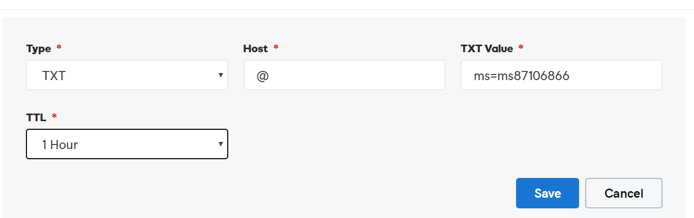

# Erstellen von DNS-Einträgen für Office 365 bei GoDaddy

 **[Überprüfen Sie die häufig gestellten Fragen (FAQ) zu Domänen](../setup/domains-faq.md)**, wenn Sie nicht finden, wonach Sie suchen.

Wenn GoDaddy Ihr DNS-Hostinganbieter ist, führen Sie die in diesem Artikel aufgeführten Schritte aus, um Ihre Domäne zu überprüfen und DNS-Einträge für E-Mail, Skype for Business Online und andere Dienste einzurichten.

Nachdem Sie diese Einträge bei GoDaddy hinzugefügt haben, ist Ihre Domäne für die Verwendung von Office 365-Diensten eingerichtet.

Informationen zu Webhosting und DNS für Websites mit Office 365 finden Sie unter [Verwenden einer öffentlichen Website mit Office 365](https://support.office.com/article/choose-a-public-website-3325d50e-d131-403c-a278-7f3296fe33a9).

> [!NOTE]
> Normalerweise dauert es ungefähr 15 Minuten, bis DNS-Änderungen wirksam werden. Es kann jedoch gelegentlich länger dauern, bis eine von Ihnen vorgenommene Änderung im Internet im DNS-System aktualisiert wurde. Wenn nach dem Hinzufügen von DNS-Einträgen Probleme mit dem E-Mail-Fluss oder andere Probleme auftreten, lesen Sie [Behandeln von Problemen nach Änderung des Domänennamens oder von DNS-Einträgen](../get-help-with-domains/find-and-fix-issues.md).

## Hinzufügen eines TXT-Eintrags zur Überprüfung

Bevor Sie Ihre Domäne in Office 365 verwenden können, müssen wir uns vergewissern, dass Sie deren Besitzer sind. Ihre Fähigkeit, sich bei Ihrem Konto bei Ihrer Domänenregistrierungsstelle anzumelden und den DNS-Eintrag zu erstellen, ist für Office 365 der Nachweis, dass Sie der Besitzer der Domäne sind.

> [!NOTE]
> Dieser Eintrag wird nur verwendet, um zu überprüfen, ob Sie der Besitzer Ihrer Domäne sind. Er hat keine weiteren Auswirkungen. Sie können ihn später ggf. löschen.

Führen Sie die folgenden Schritte aus.

1. Um zu beginnen, navigieren Sie über [diesen Link](https://account.godaddy.com/products/?go_redirect=disabled) zu Ihrer Domänenseite bei GoDaddy. Sie werden aufgefordert, sich anzumelden.

    

2. Wählen Sie unter **Domänen**die Option DNS unter der Domäne aus, die Sie bearbeiten möchten.

    

3. Klicken Sie auf **Hinzufügen**.

    

4. Wählen Sie in der Dropdownliste **TXT (Text)** aus. Geben Sie in den Feldern für den neuen Eintrag die Werte aus der folgenden Tabelle ein. Sie können die Werte auch kopieren und einfügen.

    |**Record type** |**Host**|**TXT VALUE**|**TTL** |
    |:-----|:-----|:-----|:-----|
    |TXT (Text)|@|MS=ms *XXXXXXXX* **Hinweis:** Dies ist ein nur Beispiel. Verwenden Sie hier Ihren spezifischen Wert von **Ziel oder verweisende Adresse** aus der Tabelle in Office 365. [Wie finde ich diese Angabe?](../get-help-with-domains/information-for-dns-records.md)|1 hour   (Wählen Sie in der Dropdownliste einen Wert aus.)|

      

5. Klicken Sie auf **Speichern**.

6. Warten Sie einige Minuten, bevor Sie fortfahren, damit der soeben erstellte Eintrag im Internet aktualisiert werden kann.

Nachdem Sie den Eintrag auf der Website Ihrer Domänenregistrierungsstelle hinzugefügt haben, kehren Sie zu Office 365 zurück und fordern Office 365 auf, nach dem Eintrag zu suchen.

Wenn Office 365 den richtigen TXT-Eintrag findet, wird die Domäne überprüft.
  
1. Wechseln Sie im Admin Center zur Seite **Einstellungen** \> <a href="https://go.microsoft.com/fwlink/p/?linkid=834818" target="_blank">Domänen</a>.

    
2. Wählen Sie auf der Seite **Domänen** die zu überprüfende Domäne aus. 
    
    
  
3. Wählen Sie auf der Seite **Setup** die Option **Setup starten** aus.

4. Wählen Sie auf der Seite **Domäne überprüfen** die Option **Überprüfen** aus.

> [!NOTE]
>  Normalerweise dauert es ungefähr 15 Minuten, bis DNS-Änderungen wirksam werden. Es kann jedoch gelegentlich länger dauern, bis eine von Ihnen vorgenommene Änderung im Internet im DNS-System aktualisiert wurde. Wenn nach dem Hinzufügen von DNS-Einträgen Probleme mit dem E-Mail-Fluss oder andere Probleme auftreten, lesen Sie [Behandeln von Problemen nach Änderung des Domänennamens oder von DNS-Einträgen](../get-help-with-domains/find-and-fix-issues.md).

## Hinzufügen eines MX-Eintrags, damit E-Mails für Ihre Domäne zu Office 365 geleitet werden

Führen Sie die folgenden Schritte aus.

1. Um zu beginnen, navigieren Sie über [diesen Link](https://account.godaddy.com/products/?go_redirect=disabled) zu Ihrer Domänenseite bei GoDaddy. Sie werden aufgefordert, sich anzumelden.

    

2. Wählen Sie unter **Domänen**die Option DNS unter der Domäne aus, die Sie bearbeiten möchten.

    

3. Klicken Sie auf **Hinzufügen**.

    

4. Wählen Sie in der Dropdownliste **MX (Mail Exchanger)** aus.

    

5. Geben Sie in den Feldern für den neuen Eintrag die Werte aus der folgenden Tabelle ein. Sie können die Werte auch kopieren und einfügen.

    (Wählen Sie in der Dropdownliste den Wert **TTL** aus.)

    |**Record type**|**Host**|**Points to**|**Priorität**|**TTL**|
    |:-----|:-----|:-----|:-----|:-----|
    |MX (Mail Exchanger)    |@    | *\<Domänenschlüssel\>*  .mail.protection.outlook.com    **Hinweis:** Rufen Sie Ihren * \<Domänenschlüssel\> * aus Ihrem Office 365-Konto ab.           [Wie finde ich diese Angabe?](../get-help-with-domains/information-for-dns-records.md)          |10      Weitere Informationen zur Priorität finden Sie unter [Was ist MX-Priorität?](https://support.office.com/article/2784cc4d-95be-443d-b5f7-bb5dd867ba83.aspx)   |1 Stunde    |

6. Klicken Sie auf **Speichern**.

## Hinzufügen der für Office 365 erforderlichen CNAME-Einträge

Führen Sie die folgenden Schritte aus.

1. Um zu beginnen, navigieren Sie über [diesen Link](https://account.godaddy.com/products/?go_redirect=disabled) zu Ihrer Domänenseite bei GoDaddy. Sie werden aufgefordert, sich anzumelden.

    

2. Wählen Sie unter **Domänen**die Option DNS unter der Domäne aus, die Sie bearbeiten möchten.

    

3. Klicken Sie auf **Hinzufügen**.

    

4. Wählen Sie in der Dropdownliste **CNAME (Alias)** aus.

    

5. Erstellen Sie den ersten CNAME-Eintrag.

    Geben Sie in den Feldern für den neuen Eintrag die Werte aus der ersten Zeile der folgenden Tabelle ein. Sie können die Werte auch kopieren und einfügen.

    (Wählen Sie in der Dropdownliste den Wert **TTL** aus.)

    |**Record type**|**Host**|**Points to**|**TTL**|
    |:-----|:-----|:-----|:-----|
    |CNAME (Alias)    |autodiscover    |autodiscover.outlook.com    |1 Stunde    |
    |CNAME (Alias)    |sip    |sipdir.online.lync.com    |1 Stunde    |
    |CNAME (Alias)    |lyncdiscover    |webdir.online.lync.com    |1 Stunde    |
    |CNAME (Alias)    |enterpriseregistration    |enterpriseregistration.windows.net    |1 hour    |
    |CNAME (Alias)    |enterpriseenrollment    |enterpriseenrollment.manage.microsoft.com    |1 Stunde    |

6. Wiederholen Sie diese Schritte, um den nächsten CNAME-Eintrag hinzuzufügen, bis Sie alle sechs CNAME-Einträge erstellt haben.

## Hinzufügen eines TXT-Eintrags für SPF, um E-Mail-Spam zu verhindern

> [!IMPORTANT]
> Es kann bei einer Domäne nur einen TXT-Eintrag für SPF geben. Wenn es bei Ihrer Domäne mehrere SPF-Einträge gibt, treten E-Mail-Fehler sowie Probleme bei der Übermittlung und Spamklassifizierung auf. If you already have an SPF record for your domain, don't create a new one for Office 365. Damit verfügen Sie über einen  *einzigen*  SPF-Eintrag, in dem beide Wertemengen enthalten sind.

Führen Sie die folgenden Schritte aus.

1. Um zu beginnen, navigieren Sie über [diesen Link](https://account.godaddy.com/products/?go_redirect=disabled) zu Ihrer Domänenseite bei GoDaddy. Sie werden aufgefordert, sich anzumelden.

    

2. Wählen Sie unter **Domänen**die Option DNS unter der Domäne aus, die Sie bearbeiten möchten.

    

3. Klicken Sie auf **Hinzufügen**.

    

4. Wählen Sie in der Dropdownliste **TXT (Text)** aus.

    

5. Geben Sie in den Feldern für den neuen Eintrag die folgenden Werte ein. Sie können die Werte auch kopieren und einfügen.

    (Wählen Sie in den Dropdownlisten den Wert **TTL** aus.)

    |**Record type**|**Host**|**TXT VALUE**|**TTL**|
    |:-----|:-----|:-----|:-----|
    |TXT (Text)    |@    |v=spf1 include:spf.protection.outlook.com -all    **Hinweis:** Es wird empfohlen, diesen Eintrag zu kopieren und einzufügen, damit alle Abstände korrekt übernommen werden.           |1 Stunde    |

    

6. Klicken Sie auf **Speichern**.

## Hinzufügen der für Office 365 erforderlichen zwei SRV-Einträge

Führen Sie die folgenden Schritte aus.

1. Um zu beginnen, navigieren Sie über [diesen Link](https://account.godaddy.com/products/?go_redirect=disabled) zu Ihrer Domänenseite bei GoDaddy. Sie werden aufgefordert, sich anzumelden.

    

2. Wählen Sie unter **Domänen**die Option DNS unter der Domäne aus, die Sie bearbeiten möchten.

    

3. Klicken Sie auf **Hinzufügen**.

    

4. Wählen Sie in der Dropdownliste **SRV (Service)** aus.

    

5. Erstellen Sie den ersten SRV-Eintrag.

    Geben Sie in den Feldern für den neuen Eintrag die Werte aus der ersten Zeile der folgenden Tabelle ein. Sie können die Werte auch kopieren und einfügen.

    (Wählen Sie in den Dropdownlisten die Werte für **Record Type** und **TTL** aus.)

    |**Eintragstyp**|**Name**|**Target**|**Protocol**|**Service**|**Priority**|**Weight**|**Port**|**TTL**|
    |:-----|:-----|:-----|:-----|:-----|:-----|:-----|:-----|:-----|
    |SRV (Service)    |@    |sipdir.online.lync.com    |_tls    |_sip    |100    |1    |443    |1 hour    |
    |SRV (Dienst)    |@    |sipfed.online.lync.com    |_tcp    |_sipfederationtls    |100    |1    |5061    |1 Stunde    |

    

6. Wiederholen Sie **Schritt 5** , um den anderen SRV-Eintrag zu erstellen.

7. Klicken Sie auf **Speichern**.

> [!NOTE]
> Normalerweise dauert es ungefähr 15 Minuten, bis DNS-Änderungen wirksam werden. Es kann jedoch gelegentlich länger dauern, bis eine von Ihnen vorgenommene Änderung im Internet im DNS-System aktualisiert wurde. Wenn nach dem Hinzufügen von DNS-Einträgen Probleme mit dem E-Mail-Fluss oder andere Probleme auftreten, lesen Sie [Behandeln von Problemen nach Änderung des Domänennamens oder von DNS-Einträgen](../get-help-with-domains/find-and-fix-issues.md).
