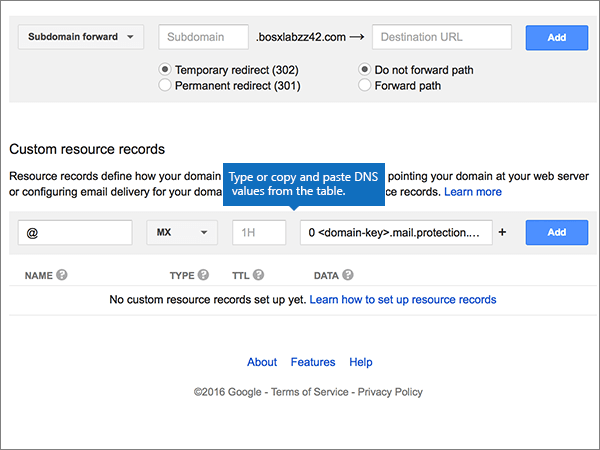

# Erstellen von DNS-Einträgen für Microsoft bei Google DomainsCreate DNS records at Google Domains for Microsoft

 **[Überprüfen Sie die häufig gestellten Fragen (FAQ) zu Domänen](../setup/domains-faq.md)**, wenn Sie nicht finden, wonach Sie suchen.**[Check the Domains FAQ](../setup/domains-faq.md)** if you don't find what you're looking for. 
  
Wenn Google Domains Ihr DNS-Hostinganbieter ist, führen Sie die in diesem Artikel aufgeführten Schritte aus, um Ihre Domäne zu überprüfen und DNS-Einträge für E-Mail, Lync und andere Dienste einzurichten.If Google Domains is your DNS hosting provider, follow the steps in this article to verify your domain and set up DNS records for email, Lync, and so on.
  
Nachdem Sie diese Einträge bei Google Domains hinzugefügt haben, ist Ihre Domäne für die Verwendung von Microsoft-Diensten eingerichtet.After you add these records at Google Domains, your domain will be set up to work with Microsoft services.
  

  
> [!NOTE]
> In der Regel dauert es etwa 15 Minuten, bis DNS-Änderungen wirksam werden.Typically it takes about 15 minutes for DNS changes to take effect. Es kann jedoch gelegentlich länger dauern, bis eine von Ihnen vorgenommene Änderung im Internet im DNS-System aktualisiert wurde.However, it can occasionally take longer for a change you've made to update across the Internet's DNS system. Wenn nach dem Hinzufügen von DNS-Einträgen Probleme mit dem E-Mail-Fluss oder andere Probleme auftreten, lesen Sie [Suchen und Beheben von Problemen, nachdem Ihre Domäne oder DNS-Einträge in Microsoft hinzugefügt wurden](../get-help-with-domains/find-and-fix-issues.md).If you're having trouble with mail flow or other issues after adding DNS records, see [Find and fix issues after adding your domain or DNS records in Microsoft](../get-help-with-domains/find-and-fix-issues.md). 
  
## Hinzufügen eines TXT-Eintrags zur ÜberprüfungAdd a TXT record for verification

Before you use your domain with Microsoft, we have to make sure that you own it.Before you use your domain with Microsoft, we have to make sure that you own it. Your ability to log in to your account at your domain registrar and create the DNS record proves to Microsoft that you own the domain.Your ability to log in to your account at your domain registrar and create the DNS record proves to Microsoft that you own the domain.
  
> [!NOTE]
> This record is used only to verify that you own your domain; it doesn't affect anything else.This record is used only to verify that you own your domain; it doesn't affect anything else. You can delete it later, if you like.You can delete it later, if you like. 
  
1. To get started, go to your domains page at Google Domains by using [this link](https://domains.google.com/registrar).To get started, go to your domains page at Google Domains by using [this link](https://domains.google.com/registrar). You'll be prompted to sign in.You'll be prompted to sign in. To do so:To do so:
    
1. Wählen Sie **Sign In** aus.Select **Sign In**.
    
2. Geben Sie Ihre Anmeldeinformationen ein, und wählen Sie dann erneut **Sign In** aus.Enter your login credentials, and then again select **Sign In**.
    
2. Suchen Sie auf der Seite **My domains** die Domäne, die Sie mit Microsoft verwenden möchten, und wählen Sie den Link **MANAGE** daneben aus.On the **My domains** page, find the domain you want to use with Microsoft, and select the **MANAGE** link next to it. Wählen Sie im linken Navigationsbereich **DNS** aus.In the left navigation, select **DNS**.
    
3. Geben Sie im Bereich **Custom resource records** in den Feldern für den neuen Eintrag die Werte aus der folgenden Tabelle ein. Sie können die Werte auch kopieren und einfügen.In the **Custom resource records** section, in the boxes for the new record, type or copy and paste the values from the following table. 
    
    (Möglicherweise müssen Sie nach unten scrollen.)(You may have to scroll down.)
    
    (Wählen Sie in der Dropdownliste den Wert für **Type** aus.)(Choose the **Type** value from the drop-down list.) 
    
    |||||
    |:-----|:-----|:-----|:-----|
    |**Name****Name**   |**Type****Type**   |**TTL****TTL**   |**Data****Data**   |
    |@    |TXTTXT    |1H1H    |MS=ms *XXXXXXXX*MS=ms *XXXXXXXX*    **Note:** This is an example.**Note:** This is an example. Use your specific **Destination or Points to Address** value here, from the table.Use your specific **Destination or Points to Address** value here, from the table. [How do I find this?How do I find this?](../get-help-with-domains/information-for-dns-records.md)          |
   
4. Klicken Sie auf **Hinzufügen**.Select **Add**.
    
5. Warten Sie einige Minuten, bevor Sie fortfahren, damit der soeben erstellte Eintrag im Internet aktualisiert werden kann.Wait a few minutes before you continue, so that the record you just created can update across the Internet.
    
Nachdem Sie den Eintrag auf der Website Ihrer Domänenregistrierungsstelle hinzugefügt haben, kehren Sie zu Microsoft zurück und fordern Sie den Eintrag an.Now that you've added the record at your domain registrar's site, you'll go back to Microsoft and request the record.
  
Wenn Microsoft den richtigen TXT-Eintrag findet, ist die Domäne überprüft.When Microsoft finds the correct TXT record, your domain is verified.
  
1. Wechseln Sie im Microsoft Admin Center zur Seite **Einstellungen** \> <a href="https://go.microsoft.com/fwlink/p/?linkid=834818" target="_blank">Domänen</a>.In the Microsoft admin center, go to the **Settings** \> <a href="https://go.microsoft.com/fwlink/p/?linkid=834818" target="_blank">Domains</a> page.

    
2. Wählen Sie auf der Seite **Domänen** die zu überprüfende Domäne aus.On the **Domains** page, select the domain that you are verifying. 
    
3. Wählen Sie auf der Seite **Setup** die Option **Setup starten** aus.On the **Setup** page, select **Start setup**.
    
4. Wählen Sie auf der Seite **Domäne überprüfen** die Option **Überprüfen** aus.On the **Verify domain** page, select **Verify**.
    
> [!NOTE]
> Typically it takes about 15 minutes for DNS changes to take effect.Typically it takes about 15 minutes for DNS changes to take effect. However, it can occasionally take longer for a change you've made to update across the Internet's DNS system.However, it can occasionally take longer for a change you've made to update across the Internet's DNS system. If you're having trouble with mail flow or other issues after adding DNS records, see [Find and fix issues after adding your domain or DNS records](../get-help-with-domains/find-and-fix-issues.md).If you're having trouble with mail flow or other issues after adding DNS records, see [Find and fix issues after adding your domain or DNS records](../get-help-with-domains/find-and-fix-issues.md). 

  
## Fügen Sie einen MX-Eintrag hinzu, damit E-Mails für Ihre Domäne an Microsoft geleitet werden.Add an MX record so email for your domain will come to Microsoft

1. To get started, go to your domains page at Google Domains by using [this link](https://domains.google.com/registrar).To get started, go to your domains page at Google Domains by using [this link](https://domains.google.com/registrar). You'll be prompted to sign in.You'll be prompted to sign in. To do so:To do so:
    
2. Wählen Sie **Sign In** aus.Select **Sign In**.
    
3. Geben Sie Ihre Anmeldeinformationen ein, und wählen Sie dann erneut **Sign In** aus.Enter your login credentials, and then again select **Sign In**.
4. Wählen Sie auf der Seite **Domains** im Abschnitt **Domain** die Option **Configure DNS** für die Domäne aus, die Sie bearbeiten möchten.On the **Domains** page, in the **Domain** section, select **Configure DNS** for the domain that you want to edit.
    
    > [!IMPORTANT]
    > Wenn Sie über ein G Suite-E-Mail-Konto verfügen, müssen Sie zuerst die diesem Konto zugeordneten MX-Einträge löschen.If you have a G Suite email account, you must first delete the MX records associated with that account. Die G Suite-MX-Einträge verhindern, dass Sie andere MX-Einträge hinzufügen, einschließlich der für Microsoft erforderlichen Einträge.The G Suite MX records prevent you from adding any other MX records, including those required for Microsoft. Beachten Sie, dass Ihr G Suite-Konto durch das Löschen der G Suite-Einträge nicht gelöscht wird.Note that deleting the G Suite records does not delete your G Suite account. Gehen Sie folgendermaßen vor, um Ihre G Suite-MX-Einträge zu löschen.To delete your G Suite MX records, use the following steps. 
  
5. Wählen Sie im Abschnitt **Synthetic records** im Bereich **G Suite** die Option **Delete** aus.In the **Synthetic records** section, in the **G Suite** area, select **Delete**.
    
    (Möglicherweise müssen Sie nach unten scrollen.)(You may have to scroll down.)
    
    
  
6. Wählen Sie **Löschen** aus.Select **Delete**.
    
    
  
7. Geben Sie im Bereich **Custom resource records** in den Feldern für den neuen Eintrag die Werte aus der folgenden Tabelle ein. Sie können die Werte auch kopieren und einfügen.In the **Custom resource records** section, in the boxes for the new record, type or copy and paste the values from the following table. 
    
    (Möglicherweise müssen Sie nach unten scrollen.)(You may have to scroll down.)
    
    (Wählen Sie in der Dropdownliste den Wert für **Type** aus.)(Choose the **Type** value from the drop-down list.) 
    
    |**Name****Name**|**Type****Type**|**TTL****TTL**|**Data****Data**|
    |:-----|:-----|:-----|:-----|
    |@    |MXMX    |1H1H    |0  *\<domain-key\>*  .mail.protection.outlook.com.0  *\<domain-key\>*  .mail.protection.outlook.com.    **Dieser Wert MUSS mit einem Punkt (.) enden.****This value MUST end with a period (.)**   The **0** is the MX priority value.The **0** is the MX priority value. Add it to the beginning of the MX value, separated from the remainder of the value by a space.Add it to the beginning of the MX value, separated from the remainder of the value by a space.    **Hinweis:** Erhalten Sie Ihren \<*domain-key*\> über Ihr Microsoft-Konto.**Note:** Get your \<*domain-key*\> from your Microsoft account.  [Wie finde ich diese Angabe?How do I find this?](../get-help-with-domains/information-for-dns-records.md)          Weitere Informationen zur Priorität finden Sie unter [Was ist MX-Priorität?](https://docs.microsoft.com/microsoft-365/admin/setup/domains-faq)For more information about priority, see [What is MX priority?](https://docs.microsoft.com/microsoft-365/admin/setup/domains-faq)   |
   
    
  
5. Wählen Sie **Add** aus.Select **Add**.
    
    
  
6. Wenn es weitere benutzerdefinierte MX-Einträge gibt, entfernen Sie sie.If there are any other Custom MX records, remove them.
    
1. Wählen Sie **Edit** in der Zeile mit dem MX-Eintrag aus.Select **Edit** in the MX record row. 
    
    
  
2. Wählen Sie für jeden weiteren benutzerdefinierten MX-Eintrag den Eintrag im Feld **Data** aus, und drücken Sie dann die** **ENTF-TASTE auf der Tastatur, um diesen Eintrag zu löschen.For each of the other Custom MX records, select the entry in the **Data** box and then press the **Delete** key on your keyboard to delete that record. 
    
    Fahren Sie fort, bis Sie den **Data**-Eintrag für jeden anderen MX-Eintrag gelöscht haben.Continue until you have deleted the **Data** entry for each of the other MX records. 
    
    
  
7. Wenn Sie den **Data**-Eintrag für jeden anderen MX-Eintrag gelöscht haben, wählen Sie **Save** aus, um Ihre Änderungen zu speichern.When you have deleted the **Data** entry for each of the other MX records, select **Save** to save your changes. 
    
    
  
## Hinzufügen der fünf für Microsoft erforderlichen CNAME-EinträgeAdd the five CNAME records that are required for Microsoft

1. Wechseln Sie im ersten Schritt zu Ihrer [Google Domains-Seite] (https://domains.google.com/registrar), und melden Sie sich an.To get started, go to your [Google Domains page] (https://domains.google.com/registrar) and sign in.
    
2. Wählen Sie auf der Seite **Domains** im Abschnitt **Domain** die Option **Configure DNS** für die Domäne aus, die Sie bearbeiten möchten.On the **Domains** page, in the **Domain** section, select **Configure DNS** for the domain that you want to edit. 
    
3. Fügen Sie den ersten CNAME-Eintrag hinzu.Add the first CNAME record.
    
    Geben Sie im Bereich **Custom resource records** in den Feldern für den neuen Eintrag die Werte aus der ersten Zeile der folgenden Tabelle ein. Sie können die Werte auch kopieren und einfügen.In the **Custom resource records** section, in the boxes for the new record, type or copy and paste the values from first row of the following table. 
    
    (Möglicherweise müssen Sie nach unten scrollen.)(You may have to scroll down.)
    
    (Wählen Sie in der Dropdownliste den Wert für **Type** aus.)(Choose the **Type** value from the drop-down list.) 
    
    |**Name****Name**|**Type****Type**|**TTL****TTL**|**Data****Data**|
    |:-----|:-----|:-----|:-----|
    |autodiscoverautodiscover    |CNAMECNAME    |1H1H    |autodiscover.outlook.com.autodiscover.outlook.com.    **Dieser Wert MUSS mit einem Punkt (.) enden.****This value MUST end with a period (.)**   |
    |sipsip    |CNAMECNAME    |1H1H    |sipdir.online.lync.com.sipdir.online.lync.com.    **Dieser Wert MUSS mit einem Punkt (.) enden.****This value MUST end with a period (.)**   |
    |lyncdiscoverlyncdiscover    |CNAMECNAME    |1H1H    |webdir.online.lync.com.webdir.online.lync.com.    **Dieser Wert MUSS mit einem Punkt (.) enden.****This value MUST end with a period (.)**   |
    |enterpriseregistrationenterpriseregistration    |CNAMECNAME    |1H1H    |enterpriseregistration.windows.net.enterpriseregistration.windows.net.    **Dieser Wert MUSS mit einem Punkt (.) enden.****This value MUST end with a period (.)**   |
    |enterpriseenrollmententerpriseenrollment    |CNAMECNAME    |1H1H    |enterpriseenrollment-s.manage.microsoft.com.enterpriseenrollment-s.manage.microsoft.com.    **Dieser Wert MUSS mit einem Punkt (.) enden.****This value MUST end with a period (.)**   |
   
    
  
4. Wählen Sie **Add** aus.Select **Add**.
    
    
  
5. Fügen Sie die anderen vier CNAME-Einträge hinzu.Add the other four CNAME records.
    
    Erstellen Sie im Abschnitt **Custom resource records** einen Eintrag mit den Werten aus der nächsten Zeile in der Tabelle, und wählen Sie dann erneut die Option **Add** aus, um diesen Eintrag abzuschließen.In the **Custom resource records** section, create a record by using the values from the next row in the table, and then again select **Add** to complete that record. 
    
    Wiederholen Sie diesen Vorgang, bis Sie alle erforderlichen CNAME-Einträge erstellt haben.Repeat this process until you have created all of the required CNAME records.
    
## Hinzufügen eines TXT-Eintrags für SPF, um E-Mail-Spam zu verhindernAdd a TXT record for SPF to help prevent email spam

> [!IMPORTANT]
> Es kann bei einer Domäne nur einen TXT-Eintrag für SPF geben.You cannot have more than one TXT record for SPF for a domain. Wenn es bei Ihrer Domäne mehrere SPF-Einträge gibt, treten E-Mail-Fehler sowie Probleme bei der Übermittlung und Spamklassifizierung auf.If your domain has more than one SPF record, you'll get email errors, as well as delivery and spam classification issues. Wenn es für Ihre Domäne bereits einen SPF-Eintrag gibt, erstellen Sie für Microsoft keinen neuen,If you already have an SPF record for your domain, don't create a new one for Microsoft. sondern fügen Sie die erforderlichen Microsoft-Werte dem aktuellen Eintrag hinzu. Damit verfügen Sie über einen einzigen SPF-Eintrag, in dem beide Wertemengen enthalten sind.Instead, add the required Microsoft values to the current record so that you have a single SPF record that includes both sets of values. Benötigen Sie Beispiele?Need examples? Lesen Sie die Informationen unter [Externe DNS-Einträge für Microsoft](https://docs.microsoft.com/office365/enterprise/external-domain-name-system-records#bkmk_spfrecords).Check out these [External Domain Name System records for Microsoft](https://docs.microsoft.com/office365/enterprise/external-domain-name-system-records#bkmk_spfrecords). Zum Überprüfen Ihres SPF-Eintrags können Sie eines dieser [SPF-Überprüfungstools](../setup/domains-faq.md) verwenden.To validate your SPF record, you can use one of these [SPF validation tools](../setup/domains-faq.md). 
  
1. To get started, go to your domains page at Google Domains by using [this link](https://domains.google.com/registrar).To get started, go to your domains page at Google Domains by using [this link](https://domains.google.com/registrar). You'll be prompted to sign in.You'll be prompted to sign in. To do so:To do so:
    
1. Wählen Sie **Sign In** aus.Select **Sign In**.
    
2. Geben Sie Ihre Anmeldeinformationen ein, und wählen Sie dann erneut **Sign In** aus.Enter your login credentials, and then again select **Sign In**.
    
3. Wählen Sie auf der Seite **Domains** im Abschnitt **Domain** die Option **Configure DNS** für die Domäne aus, die Sie bearbeiten möchten.On the **Domains** page, in the **Domain** section, select **Configure DNS** for the domain that you want to edit. 
    
4. Wählen Sie im Abschnitt **Custom resource records** in der Zeile mit dem TXT-Eintrag die Option **Edit** aus.In the **Custom resource records** section, on the TXT record row, select **Edit**. 
    
    > [!IMPORTANT]
    > Google Domains stores TXT records as a set that may contain multiple records.Google Domains stores TXT records as a set that may contain multiple records. When you have at least one other TXT record, such as the TXT record you used to verify your domain, you must add TXT new records to that record set.When you have at least one other TXT record, such as the TXT record you used to verify your domain, you must add TXT new records to that record set. Any attempt to enter additional TXT records as separate entries will result in a **Duplicate record** error message.Any attempt to enter additional TXT records as separate entries will result in a **Duplicate record** error message. 
  
    
  
5. Wählen Sie das Steuerelement **(+)** aus.Select the **(+)** control. 
    
    
  
6. Geben Sie in den Feldern für den neuen Eintrag die Werte aus der folgenden Tabelle ein. Sie können die Werte auch kopieren und einfügen.In the boxes for the new record, type or copy and paste the values from the following table.
    
    (Möglicherweise müssen Sie nach unten scrollen.)(You may have to scroll down.)
    
    |**Daten****Data**|
    |:-----|
    |v=spf1 include:spf.protection.outlook.com -allv=spf1 include:spf.protection.outlook.com -all    

    > [!NOTE]
    > Es wird empfohlen, diesen Eintrag zu kopieren und einzufügen, damit alle Abstände korrekt übernommen werden.We recommend copying and pasting this entry, so that all of the spacing stays correct.           
   
   
  
7. Wählen Sie **Save** aus.Select **Save**.
    
    
  
## Hinzufügen der für Microsoft erforderlichen zwei SRV-EinträgeAdd the two SRV records that are required for Microsoft

1. To get started, go to your domains page at Google Domains by using [this link](https://domains.google.com/registrar).To get started, go to your domains page at Google Domains by using [this link](https://domains.google.com/registrar). You'll be prompted to sign in.You'll be prompted to sign in. To do so:To do so:
    
2. Wählen Sie **Sign In** aus.Select **Sign In**.
    
3. Geben Sie Ihre Anmeldeinformationen ein, und wählen Sie dann erneut **Sign In** aus.Enter your login credentials, and then again select **Sign In**.
    
4. Wählen Sie auf der Seite **Domains** im Abschnitt **Domain** die Option **Configure DNS** für die Domäne aus, die Sie bearbeiten möchten.On the **Domains** page, in the **Domain** section, select **Configure DNS** for the domain that you want to edit. 
    
5. Fügen Sie den ersten SRV-Eintrag hinzu.Add the first SRV record.
    
    Geben Sie im Bereich **Custom resource records** in den Feldern für den neuen Eintrag die Werte aus der folgenden Tabelle ein. Sie können die Werte auch kopieren und einfügen.In the **Custom resource records** section, in the boxes for the new record, type or copy and paste the values from the following table. 
    
    (Möglicherweise müssen Sie nach unten scrollen.)(You may have to scroll down.)
    
    (Wählen Sie in der Dropdownliste den Wert für **Type** aus.)(Choose the **Type** value from the drop-down list.) 
    
    |**Name****Name**|**Type****Type**|**TTL****TTL**|**Data****Data**|
    |:-----|:-----|:-----|:-----|
    |_sip._tls_sip._tls|SRVSRV|1H1H|100 1 443 sipdir.online.lync.com.100 1 443 sipdir.online.lync.com. **Dieser Wert MUSS mit einem Punkt (.) enden.** **Hinweis:** Es wird empfohlen, diesen Eintrag zu kopieren und einzufügen, damit alle Abstände korrekt übernommen werden.**This value MUST end with a period (.)** **Note:** We recommend copying and pasting this entry, so that all of the spacing stays correct.           |
    |_sipfederationtls._tcp_sipfederationtls._tcp|SRVSRV|1H1H|100 1 5061 sipfed.online.lync.com.100 1 5061 sipfed.online.lync.com. **Dieser Wert MUSS mit einem Punkt (.) enden.****This value MUST end with a period (.)**

    Es wird empfohlen, diesen Eintrag zu kopieren und einzufügen, damit alle Abstände korrekt übernommen werden.We recommend copying and pasting this entry, so that all of the spacing stays correct.       
   
    
  
6. Wählen Sie **Add** aus.Select **Add**.
    
    
  
7. Fügen Sie den anderen SRV-Eintrag hinzu.Add the other SRV record.
    
    Erstellen Sie im Abschnitt **Custom resource records** einen Eintrag mit den Werten aus der zweiten Zeile in der Tabelle, und wählen Sie dann erneut die Option **Add** aus, um diesen Eintrag abzuschließen.In the **Custom resource records** section, create a record by using the values from the second row in the table, and then again select **Add** to complete that record. 
    
    > [!NOTE]
    > Typically it takes about 15 minutes for DNS changes to take effect.Typically it takes about 15 minutes for DNS changes to take effect. However, it can occasionally take longer for a change you've made to update across the Internet's DNS system.However, it can occasionally take longer for a change you've made to update across the Internet's DNS system. If you're having trouble with mail flow or other issues after adding DNS records, see [Find and fix issues after adding your domain or DNS records](../get-help-with-domains/find-and-fix-issues.md).If you're having trouble with mail flow or other issues after adding DNS records, see [Find and fix issues after adding your domain or DNS records](../get-help-with-domains/find-and-fix-issues.md). 
  
