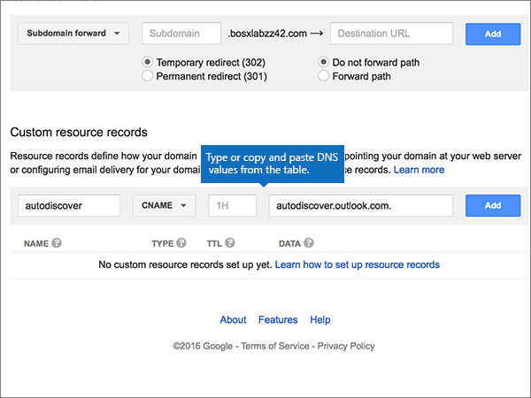

# Erstellen von DNS-Einträgen für Microsoft bei Google Domains

 **[Überprüfen Sie die häufig gestellten Fragen (FAQ) zu Domänen](../setup/domains-faq.yml)**, wenn Sie nicht finden, wonach Sie suchen. 
  
Wenn Google Domains Ihr DNS-Hostinganbieter ist, führen Sie die in diesem Artikel aufgeführten Schritte aus, um Ihre Domäne zu überprüfen und DNS-Einträge für E-Mail, Lync und andere Dienste einzurichten.
  
Nachdem Sie diese Einträge bei Google Domains hinzugefügt haben, ist Ihre Domäne für die Verwendung von Microsoft-Diensten eingerichtet.
  

  
> [!NOTE]
> In der Regel dauert es etwa 15 Minuten, bis DNS-Änderungen wirksam werden. Es kann jedoch gelegentlich länger dauern, bis eine von Ihnen vorgenommene Änderung im Internet im DNS-System aktualisiert wurde. Wenn nach dem Hinzufügen von DNS-Einträgen Probleme mit dem E-Mail-Fluss oder andere Probleme auftreten, lesen Sie [Suchen und Beheben von Problemen, nachdem Ihre Domäne oder DNS-Einträge in Microsoft hinzugefügt wurden](../get-help-with-domains/find-and-fix-issues.md). 
  
## Hinzufügen eines TXT-Eintrags zur Überprüfung

Bevor Sie Ihre Domäne mit Microsoft verwenden können, müssen wir uns vergewissern, dass Sie deren Besitzer sind. Ihre Fähigkeit, sich bei Ihrem Konto bei Ihrer Domänenregistrierungsstelle anzumelden und den DNS-Eintrag zu erstellen, ist für Microsoft der Nachweis, dass Sie der Besitzer der Domäne sind.
  
> [!NOTE]
> Dieser Eintrag wird nur verwendet, um zu überprüfen, ob Sie der Besitzer Ihrer Domäne sind. Er hat keine weiteren Auswirkungen. Sie können ihn später ggf. löschen. 
  
1. Im ersten Schritt navigieren Sie über [diesen Link](https://domains.google.com/registrar) zu Ihrer Domänenseite bei Google Domains. Sie werden aufgefordert, sich anzumelden. Gehen Sie dazu wie folgt vor:
    
1. Wählen Sie **Sign In** aus.
    
2. Geben Sie Ihre Anmeldeinformationen ein, und wählen Sie dann erneut **Sign In** aus.
    
2. Suchen Sie auf der Seite **My domains** die Domäne, die Sie mit Microsoft verwenden möchten, und wählen Sie den Link **MANAGE** daneben aus. Wählen Sie im linken Navigationsbereich **DNS** aus.
    
3. Geben Sie im Bereich **Custom resource records** in den Feldern für den neuen Eintrag die Werte aus der folgenden Tabelle ein. Sie können die Werte auch kopieren und einfügen. 
    
    (Möglicherweise müssen Sie nach unten scrollen.)
    
    (Wählen Sie in der Dropdownliste den Wert für **Type** aus.) 
    
    |||||
    |:-----|:-----|:-----|:-----|
    |**Name**   |**Type**   |**TTL**   |**Data**   |
    |@    |TXT    |1H    |MS=ms *XXXXXXXX*    **Hinweis:** Dies ist ein Beispiel. Verwenden Sie hier Ihren spezifischen Wert für **Ziel- oder Verweisadresse** aus der Tabelle in [Wie finde ich diese Angabe?](../get-help-with-domains/information-for-dns-records.md).          |
   
4. Klicken Sie auf **Hinzufügen**.
    
5. Warten Sie einige Minuten, bevor Sie fortfahren, damit der soeben erstellte Eintrag im Internet aktualisiert werden kann.
    
Nachdem Sie den Eintrag auf der Website Ihrer Domänenregistrierungsstelle hinzugefügt haben, kehren Sie zu Microsoft zurück und fordern Sie den Eintrag an.
  
Wenn Microsoft den richtigen TXT-Eintrag findet, ist die Domäne überprüft.
  
1. Wechseln Sie im Microsoft Admin Center zur Seite **Einstellungen** \> <a href="https://go.microsoft.com/fwlink/p/?linkid=834818" target="_blank">Domänen</a>.

    
2. Wählen Sie auf der Seite **Domänen** die zu überprüfende Domäne aus. 
    
3. Wählen Sie auf der Seite **Setup** die Option **Setup starten** aus.
    
4. Wählen Sie auf der Seite **Domäne überprüfen** die Option **Überprüfen** aus.
    
> [!NOTE]
> Normalerweise dauert es ungefähr 15 Minuten, bis DNS-Änderungen wirksam werden. Es kann jedoch gelegentlich länger dauern, bis eine von Ihnen vorgenommene Änderung im Internet im DNS-System aktualisiert wurde. Wenn nach dem Hinzufügen von DNS-Einträgen Probleme mit dem E-Mail-Fluss oder andere Probleme auftreten, lesen Sie [Suchen und Beheben von Problemen, nachdem Ihre Domäne oder DNS-Einträge hinzugefügt wurden](../get-help-with-domains/find-and-fix-issues.md). 

  
## Fügen Sie einen MX-Eintrag hinzu, damit E-Mails für Ihre Domäne an Microsoft geleitet werden.

1. Im ersten Schritt navigieren Sie über [diesen Link](https://domains.google.com/registrar) zu Ihrer Domänenseite bei Google Domains. Sie werden aufgefordert, sich anzumelden. Gehen Sie dazu wie folgt vor:
    
2. Wählen Sie **Sign In** aus.
    
3. Geben Sie Ihre Anmeldeinformationen ein, und wählen Sie dann erneut **Sign In** aus.
4. Wählen Sie auf der Seite **Domains** im Abschnitt **Domain** die Option **Configure DNS** für die Domäne aus, die Sie bearbeiten möchten.
    
    > [!IMPORTANT]
    > Wenn Sie über ein G Suite-E-Mail-Konto verfügen, müssen Sie zuerst die diesem Konto zugeordneten MX-Einträge löschen. Die G Suite-MX-Einträge verhindern, dass Sie andere MX-Einträge hinzufügen, einschließlich der für Microsoft erforderlichen Einträge. Beachten Sie, dass Ihr G Suite-Konto durch das Löschen der G Suite-Einträge nicht gelöscht wird. Gehen Sie folgendermaßen vor, um Ihre G Suite-MX-Einträge zu löschen. 
  
5. Wählen Sie im Abschnitt **Synthetic records** im Bereich **G Suite** die Option **Delete** aus.
    
    (Möglicherweise müssen Sie nach unten scrollen.)
    
    
  
6. Wählen Sie **Löschen** aus.
    
    
  
7. Geben Sie im Bereich **Custom resource records** in den Feldern für den neuen Eintrag die Werte aus der folgenden Tabelle ein. Sie können die Werte auch kopieren und einfügen. 
    
    (Möglicherweise müssen Sie nach unten scrollen.)
    
    (Wählen Sie in der Dropdownliste den Wert für **Type** aus.) 
    
    |**Name**|**Type**|**TTL**|**Data**|
    |:-----|:-----|:-----|:-----|
    |@    |MX    |1H    |0  *\<domain-key\>*  .mail.protection.outlook.com.    **Dieser Wert MUSS mit einem Punkt (.) enden.**   Die **0** ist der MX-Prioritätswert. Fügen Sie ihn am Anfang des MX-Werts hinzu, vom Rest des Werts durch ein Leerzeichen getrennt.    **Hinweis:** Erhalten Sie Ihren \<*domain-key*\> über Ihr Microsoft-Konto.  [Wie finde ich diese Angabe?](../get-help-with-domains/information-for-dns-records.md)          Weitere Informationen zur Priorität finden Sie unter [Was ist MX-Priorität?](../setup/domains-faq.yml)   |
   
    
  
5. Wählen Sie **Add** aus.
    
    
  
6. Wenn es weitere benutzerdefinierte MX-Einträge gibt, entfernen Sie sie.
    
1. Wählen Sie **Edit** in der Zeile mit dem MX-Eintrag aus. 
    
    
  
2. Wählen Sie für jeden weiteren benutzerdefinierten MX-Eintrag den Eintrag im Feld **Data** aus, und drücken Sie dann die **** ENTF-TASTE auf der Tastatur, um diesen Eintrag zu löschen. 
    
    Fahren Sie fort, bis Sie den **Data**-Eintrag für jeden anderen MX-Eintrag gelöscht haben. 
    
    
  
7. Wenn Sie den **Data**-Eintrag für jeden anderen MX-Eintrag gelöscht haben, wählen Sie **Save** aus, um Ihre Änderungen zu speichern. 
    
    
  
## Hinzufügen der fünf für Microsoft erforderlichen CNAME-Einträge

1. Wechseln Sie im ersten Schritt zu Ihrer [Google Domains-Seite] (https://domains.google.com/registrar), und melden Sie sich an.
    
2. Wählen Sie auf der Seite **Domains** im Abschnitt **Domain** die Option **Configure DNS** für die Domäne aus, die Sie bearbeiten möchten. 
    
3. Fügen Sie den ersten CNAME-Eintrag hinzu.
    
    Geben Sie im Bereich **Custom resource records** in den Feldern für den neuen Eintrag die Werte aus der ersten Zeile der folgenden Tabelle ein. Sie können die Werte auch kopieren und einfügen. 
    
    (Möglicherweise müssen Sie nach unten scrollen.)
    
    (Wählen Sie in der Dropdownliste den Wert für **Type** aus.) 
    
    |**Name**|**Type**|**TTL**|**Data**|
    |:-----|:-----|:-----|:-----|
    |autodiscover    |CNAME    |1H    |autodiscover.outlook.com.    **Dieser Wert MUSS mit einem Punkt (.) enden.**   |
    |sip    |CNAME    |1H    |sipdir.online.lync.com.    **Dieser Wert MUSS mit einem Punkt (.) enden.**   |
    |lyncdiscover    |CNAME    |1H    |webdir.online.lync.com.    **Dieser Wert MUSS mit einem Punkt (.) enden.**   |
    |enterpriseregistration    |CNAME    |1H    |enterpriseregistration.windows.net.    **Dieser Wert MUSS mit einem Punkt (.) enden.**   |
    |enterpriseenrollment    |CNAME    |1H    |enterpriseenrollment-s.manage.microsoft.com.    **Dieser Wert MUSS mit einem Punkt (.) enden.**   |
   
    
  
4. Wählen Sie **Add** aus.
    
    
  
5. Fügen Sie die anderen vier CNAME-Einträge hinzu.
    
    Erstellen Sie im Abschnitt **Custom resource records** einen Eintrag mit den Werten aus der nächsten Zeile in der Tabelle, und wählen Sie dann erneut die Option **Add** aus, um diesen Eintrag abzuschließen. 
    
    Wiederholen Sie diesen Vorgang, bis Sie alle erforderlichen CNAME-Einträge erstellt haben.
    
## Hinzufügen eines TXT-Eintrags für SPF, um E-Mail-Spam zu verhindern

> [!IMPORTANT]
> Es kann bei einer Domäne nur einen TXT-Eintrag für SPF geben. Wenn es bei Ihrer Domäne mehrere SPF-Einträge gibt, treten E-Mail-Fehler sowie Probleme bei der Übermittlung und Spamklassifizierung auf. Wenn es für Ihre Domäne bereits einen SPF-Eintrag gibt, erstellen Sie für Microsoft keinen neuen, sondern fügen Sie die erforderlichen Microsoft-Werte dem aktuellen Eintrag hinzu. Damit verfügen Sie über einen einzigen SPF-Eintrag, in dem beide Wertemengen enthalten sind. Benötigen Sie Beispiele? Lesen Sie die Informationen unter [Externe DNS-Einträge für Microsoft](../../enterprise/external-domain-name-system-records.md#bkmk_spfrecords). Zum Überprüfen Ihres SPF-Eintrags können Sie eines dieser [SPF-Überprüfungstools](../setup/domains-faq.yml) verwenden. 
  
1. Im ersten Schritt navigieren Sie über [diesen Link](https://domains.google.com/registrar) zu Ihrer Domänenseite bei Google Domains. Sie werden aufgefordert, sich anzumelden. Gehen Sie dazu wie folgt vor:
    
1. Wählen Sie **Sign In** aus.
    
2. Geben Sie Ihre Anmeldeinformationen ein, und wählen Sie dann erneut **Sign In** aus.
    
3. Wählen Sie auf der Seite **Domains** im Abschnitt **Domain** die Option **Configure DNS** für die Domäne aus, die Sie bearbeiten möchten. 
    
4. Wählen Sie im Abschnitt **Custom resource records** in der Zeile mit dem TXT-Eintrag die Option **Edit** aus. 
    
    > [!IMPORTANT]
    > Google Domains speichert TXT-Einträge als Satz, der mehrere Datensätze enthalten kann. Wenn Sie über mindestens einen weiteren TXT-Eintrag verfügen, z. B. den zur Überprüfung Ihrer Domäne verwendeten TXT-Eintrag, müssen Sie dieser Datensatzgruppe neue TXT-Einträge hinzufügen. Jeder Versuch, TXT-Einträge als getrennte Einträge einzugeben, führt zu einer Fehlermeldung wegen eines **doppelten Datensatzes**. 
  
    
  
5. Wählen Sie das Steuerelement **(+)** aus. 
    
    
  
6. Geben Sie in den Feldern für den neuen Eintrag die Werte aus der folgenden Tabelle ein. Sie können die Werte auch kopieren und einfügen.
    
    (Möglicherweise müssen Sie nach unten scrollen.)
    
    |**Daten**|
    |:-----|
    |v=spf1 include:spf.protection.outlook.com -all    

    > [!NOTE]
    > Es wird empfohlen, diesen Eintrag zu kopieren und einzufügen, damit alle Abstände korrekt übernommen werden.           
   
   
  
7. Wählen Sie **Save** aus.
    
    
  
## Hinzufügen der für Microsoft erforderlichen zwei SRV-Einträge

1. Im ersten Schritt navigieren Sie über [diesen Link](https://domains.google.com/registrar) zu Ihrer Domänenseite bei Google Domains. Sie werden aufgefordert, sich anzumelden. Gehen Sie dazu wie folgt vor:
    
2. Wählen Sie **Sign In** aus.
    
3. Geben Sie Ihre Anmeldeinformationen ein, und wählen Sie dann erneut **Sign In** aus.
    
4. Wählen Sie auf der Seite **Domains** im Abschnitt **Domain** die Option **Configure DNS** für die Domäne aus, die Sie bearbeiten möchten. 
    
5. Fügen Sie den ersten SRV-Eintrag hinzu.
    
    Geben Sie im Bereich **Custom resource records** in den Feldern für den neuen Eintrag die Werte aus der folgenden Tabelle ein. Sie können die Werte auch kopieren und einfügen. 
    
    (Möglicherweise müssen Sie nach unten scrollen.)
    
    (Wählen Sie in der Dropdownliste den Wert für **Type** aus.) 
    
    |**Name**|**Type**|**TTL**|**Data**|
    |:-----|:-----|:-----|:-----|
    |_sip._tls|SRV|1H|100 1 443 sipdir.online.lync.com. **Dieser Wert MUSS mit einem Punkt (.) enden.** **Hinweis:** Es wird empfohlen, diesen Eintrag zu kopieren und einzufügen, damit alle Abstände korrekt übernommen werden.           |
    |_sipfederationtls._tcp|SRV|1H|100 1 5061 sipfed.online.lync.com. **Dieser Wert MUSS mit einem Punkt (.) enden.**

    Es wird empfohlen, diesen Eintrag zu kopieren und einzufügen, damit alle Abstände korrekt übernommen werden.       
   
    
  
6. Wählen Sie **Add** aus.
    
    
  
7. Fügen Sie den anderen SRV-Eintrag hinzu.
    
    Erstellen Sie im Abschnitt **Custom resource records** einen Eintrag mit den Werten aus der zweiten Zeile in der Tabelle, und wählen Sie dann erneut die Option **Add** aus, um diesen Eintrag abzuschließen. 
    
    > [!NOTE]
    > Normalerweise dauert es ungefähr 15 Minuten, bis DNS-Änderungen wirksam werden. Es kann jedoch gelegentlich länger dauern, bis eine von Ihnen vorgenommene Änderung im Internet im DNS-System aktualisiert wurde. Wenn nach dem Hinzufügen von DNS-Einträgen Probleme mit dem E-Mail-Fluss oder andere Probleme auftreten, lesen Sie [Suchen und Beheben von Problemen, nachdem Ihre Domäne oder DNS-Einträge hinzugefügt wurden](../get-help-with-domains/find-and-fix-issues.md). 
