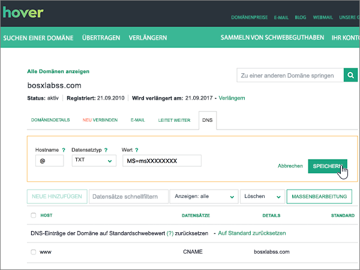

# Erstellen von DNS-Einträgen für Office 365 bei Hover

 **[Überprüfen Sie die häufig gestellten Fragen (FAQ) zu Domänen](../setup/domains-faq.md)**, wenn Sie nicht finden, wonach Sie suchen. 
  
Wenn Hover Ihr DNS-Hostinganbieter ist, führen Sie die in diesem Artikel aufgeführten Schritte aus, um Ihre Domäne zu überprüfen und DNS-Einträge für E-Mail, Skype for Business Online und andere Dienste einzurichten.
     
Nachdem Sie diese Einträge bei Hover hinzugefügt haben, ist Ihre Domäne für die Verwendung von Office 365-Diensten eingerichtet.
  
Informationen zu Webhosting und DNS für Websites mit Office 365 finden Sie unter [Verwenden einer öffentlichen Website mit Office 365](https://support.office.com/article/choose-a-public-website-3325d50e-d131-403c-a278-7f3296fe33a9).
  
> [!NOTE]
>  Normalerweise dauert es ungefähr 15 Minuten, bis DNS-Änderungen wirksam werden. Es kann jedoch gelegentlich länger dauern, bis eine von Ihnen vorgenommene Änderung im Internet im DNS-System aktualisiert wurde. Wenn nach dem Hinzufügen von DNS-Einträgen Probleme mit dem E-Mail-Fluss oder andere Probleme auftreten, lesen Sie [Behandeln von Problemen nach Änderung des Domänennamens oder von DNS-Einträgen](../get-help-with-domains/find-and-fix-issues.md). 
  
## Hinzufügen eines TXT-Eintrags zur Überprüfung

Bevor Sie Ihre Domäne in Office 365 verwenden können, müssen wir uns vergewissern, dass Sie deren Besitzer sind. Ihre Fähigkeit, sich bei Ihrem Konto bei Ihrer Domänenregistrierungsstelle anzumelden und den DNS-Eintrag zu erstellen, ist für Office 365 der Nachweis, dass Sie der Besitzer der Domäne sind.
  
> [!NOTE]
> Dieser Eintrag wird nur verwendet, um zu überprüfen, ob Sie der Besitzer Ihrer Domäne sind. Er hat keine weiteren Auswirkungen. Sie können ihn später ggf. löschen. 
  
Führen Sie die folgenden Schritte aus, oder [schauen Sie sich das Video an](https://support.office.com/article/Video-Create-DNS-records-at-Hover-for-Office-365-182bd58e-8fe4-4717-9233-3a3546b72ad2?ui=en-US&amp;rs=en-US&amp;ad=US).
  
1. Um zu beginnen, navigieren Sie über [diesen Link](https://www.hover.com/domains) zu Ihrer Domänenseite bei Hover. Sie werden aufgefordert, sich anzumelden.
    
    
  
2. Wählen Sie unter **Ihre Domänen verwalten**den Namen der Domäne aus, die Sie bearbeiten möchten.
    
    
  
3. Wählen Sie die Registerkarte **DNS** aus. 
    
    
  
4. Wählen Sie **Neu hinzufügen**aus.
    
    
  
5. In the boxes for the new record, select **TXT** for the **Record Type**, and then type or copy and paste the values from the following table.
    
    ||||
    |:-----|:-----|:-----|
    |Hostname    |Eintragstyp    |Value    |
    |@    |TXT    |MS=ms *XXXXXXXX*    **Hinweis:** Dies ist ein Beispiel. Verwenden Sie hier Ihren spezifischen Wert von **Ziel oder verweisende Adresse** aus der Tabelle in Office 365.           [Wie finde ich diese Angabe?](../get-help-with-domains/information-for-dns-records.md)          |
   
    
  
6. Klicken Sie auf **Speichern**.
    
    
  
7. Warten Sie einige Minuten, bevor Sie fortfahren, damit der soeben erstellte Eintrag im Internet aktualisiert werden kann.
    
Nachdem Sie den Eintrag auf der Website Ihrer Domänenregistrierungsstelle hinzugefügt haben, kehren Sie zu Office 365 zurück und fordern Office 365 auf, nach dem Eintrag zu suchen.
  
Wenn Office 365 den richtigen TXT-Eintrag findet, wird die Domäne überprüft.
  
1. Wechseln Sie im Admin Center zur Seite **Einstellungen** \> <a href="https://go.microsoft.com/fwlink/p/?linkid=834818" target="_blank">Domänen</a>.
    
2. Wählen Sie auf der Seite **Domänen** die zu überprüfende Domäne aus. 
    
    
  
3. Wählen Sie auf der Seite **Setup** die Option **Setup starten** aus.
    
    
  
4. Wählen Sie auf der Seite **Domäne überprüfen** die Option **Überprüfen** aus.
    
    
  
> [!NOTE]
>  Normalerweise dauert es ungefähr 15 Minuten, bis DNS-Änderungen wirksam werden. Es kann jedoch gelegentlich länger dauern, bis eine von Ihnen vorgenommene Änderung im Internet im DNS-System aktualisiert wurde. Wenn nach dem Hinzufügen von DNS-Einträgen Probleme mit dem E-Mail-Fluss oder andere Probleme auftreten, lesen Sie [Behandeln von Problemen nach Änderung des Domänennamens oder von DNS-Einträgen](../get-help-with-domains/find-and-fix-issues.md). 
  
## Hinzufügen eines MX-Eintrags, damit E-Mails für Ihre Domäne zu Office 365 geleitet werden

Führen Sie die folgenden Schritte aus, oder [schauen Sie sich das Video an](https://support.office.com/article/Video-Create-DNS-records-at-Hover-for-Office-365-182bd58e-8fe4-4717-9233-3a3546b72ad2?ui=en-US&amp;rs=en-US&amp;ad=US).
  
1. Um zu beginnen, navigieren Sie über [diesen Link](https://www.hover.com/domains) zu Ihrer Domänenseite bei Hover. Sie werden aufgefordert, sich anzumelden.
    
    
  
2. Wählen Sie unter **Ihre Domänen verwalten**den Namen der Domäne aus, die Sie bearbeiten möchten.
    
    
  
3. Wählen Sie die Registerkarte **DNS** aus. 
    
    
  
4. Wählen Sie **Neu hinzufügen**aus.
    
    
  
5. Wählen Sie in den Feldern für den neuen Eintrag für **Record Type** die Option **MX** aus, und geben Sie dann die Werte aus der folgenden Tabelle ein. Sie können die Werte auch kopieren und einfügen.
    
    |**Hostname**|**Record Type**|**Priorität**|**Hostname**|
    |:-----|:-----|:-----|:-----|
    |@    |MX    |0    Weitere Informationen zur Priorität finden Sie unter [Was ist MX-Priorität?](https://support.office.com/article/2784cc4d-95be-443d-b5f7-bb5dd867ba83.aspx)   | *\<Domänenschlüssel\>*  .mail.protection.outlook.com    **Hinweis:** Rufen Sie Ihren * \<Domänenschlüssel\> * aus Ihrem Office 365-Konto ab.           [Wie finde ich diese Angabe?](../get-help-with-domains/information-for-dns-records.md)          |
   
    
  
6. Klicken Sie auf **Speichern**.
    
    
  
7. Wenn andere MX-Einträge vorhanden sind, führen Sie die beiden folgenden Schritte aus, um diese zu entfernen:
    
    Klicken Sie zuerst auf einen Datensatz, den Sie entfernen möchten, und wählen Sie dann **Löschen**aus.
    
    
  
    Klicken Sie zweitens auf **Ja** , um den Löschvorgang zu bestätigen. 
    
    
  
    Wiederholen Sie diesen Vorgang, bis Sie alle MX-Einträge mit Ausnahme des Eintrags, den Sie zuvor in diesem Verfahren hinzugefügt haben, gelöscht sind.
    
## Hinzufügen der für Office 365 erforderlichen CNAME-Einträge

Führen Sie die folgenden Schritte aus, oder [schauen Sie sich das Video an](https://support.office.com/article/Video-Create-DNS-records-at-Hover-for-Office-365-182bd58e-8fe4-4717-9233-3a3546b72ad2?ui=en-US&amp;rs=en-US&amp;ad=US).
  
1. Um zu beginnen, navigieren Sie über [diesen Link](https://www.hover.com/domains) zu Ihrer Domänenseite bei Hover. Sie werden aufgefordert, sich anzumelden.
    
    
  
2. Wählen Sie unter **Ihre Domänen verwalten**den Namen der Domäne aus, die Sie bearbeiten möchten.
    
    
  
3. Wählen Sie die Registerkarte **DNS** aus. 
    
    
  
4. Fügen Sie den ersten der sechs CNAME-Einträge hinzu.
    
    Wählen Sie **Neu hinzufügen**aus.
    
    
  
5. Wählen Sie in den leeren Feldern für den neuen Eintrag für **Record Type** die Option **CNAME** aus, und geben Sie dann die Werte aus der ersten Zeile in der folgenden Tabelle ein. Sie können die Werte auch kopieren und einfügen.
    
    |**Hostname**|**Record Type**|**Zielhost**|
    |:-----|:-----|:-----|
    |autodiscover    |CNAME    |autodiscover.outlook.com    |
    |sip    |CNAME    |sipdir.online.lync.com    |
    |lyncdiscover    |CNAME    |webdir.online.lync.com    |
    |enterpriseregistration    |CNAME    |enterpriseregistration.windows.net    |
    |enterpriseenrollment    |CNAME    |enterpriseenrollment-s.manage.microsoft.com    |
   
    
  
6. Klicken Sie auf **Speichern**.
    
    
  
7. Fügen Sie die anderen fünf CNAME-Einträge hinzu, indem Sie die vorangegangenen drei Schritte mit den Werten aus den anderen fünf Zeilen in der Tabelle wiederholen.
    
## Hinzufügen eines TXT-Eintrags für SPF, um E-Mail-Spam zu verhindern

> [!IMPORTANT]
> Es kann bei einer Domäne nur einen TXT-Eintrag für SPF geben. Wenn es bei Ihrer Domäne mehrere SPF-Einträge gibt, treten E-Mail-Fehler sowie Probleme bei der Übermittlung und Spamklassifizierung auf. If you already have an SPF record for your domain, don't create a new one for Office 365. Damit verfügen Sie über einen  *einzigen*  SPF-Eintrag, in dem beide Wertemengen enthalten sind. 
  
Führen Sie die folgenden Schritte aus, oder [schauen Sie sich das Video an](https://support.office.com/article/Video-Create-DNS-records-at-Hover-for-Office-365-182bd58e-8fe4-4717-9233-3a3546b72ad2?ui=en-US&amp;rs=en-US&amp;ad=US).
  
1. Um zu beginnen, navigieren Sie über [diesen Link](https://www.hover.com/domains) zu Ihrer Domänenseite bei Hover. Sie werden aufgefordert, sich anzumelden.
    
    
  
2. Wählen Sie unter **Ihre Domänen verwalten**den Namen der Domäne aus, die Sie bearbeiten möchten.
    
    
  
3. Wählen Sie die Registerkarte **DNS** aus. 
    
    
  
4. Wählen Sie **Neu hinzufügen**aus.
    
    
  
5. In the boxes for the new record, select **TXT** for the **Record Type**, and then type or copy and paste the values from the following table.
    
    |**Hostname**|**Record Type**|**Value**|
    |:-----|:-----|:-----|
    |@    |TXT    |v=spf1 include:spf.protection.outlook.com -all   **Hinweis:** Es wird empfohlen, diesen Eintrag zu kopieren und einzufügen, damit alle Abstände korrekt übernommen werden.           |
   
    
  
6. Klicken Sie auf **Speichern**.
    
    
  
## Hinzufügen der für Office 365 erforderlichen zwei SRV-Einträge

Führen Sie die folgenden Schritte aus, oder [schauen Sie sich das Video an](https://support.office.com/article/Video-Create-DNS-records-at-Hover-for-Office-365-182bd58e-8fe4-4717-9233-3a3546b72ad2?ui=en-US&amp;rs=en-US&amp;ad=US).
  
1. Um zu beginnen, navigieren Sie über [diesen Link](https://www.hover.com/domains) zu Ihrer Domänenseite bei Hover. Sie werden aufgefordert, sich anzumelden.
    
    
  
2. Wählen Sie unter **Ihre Domänen verwalten**den Namen der Domäne aus, die Sie bearbeiten möchten.
    
    
  
3. Wählen Sie die Registerkarte **DNS** aus. 
    
    
  
4. Fügen Sie den ersten der zwei SRV-Einträge hinzu.
    
    Wählen Sie **Neu hinzufügen**aus.
    
    
  
5. Wählen Sie in den leeren Feldern für den neuen Eintrag für **Record Type** die Option **SRV** aus, und geben Sie dann die Werte aus der ersten Zeile in der folgenden Tabelle ein. Sie können die Werte auch kopieren und einfügen.
    
    |**Hostname**|**Record Type**|**Priority**|**Weight**|**Port**|**Target**|
    |:-----|:-----|:-----|:-----|:-----|:-----|
    |_sip._tls    |SRV    |100    |1    |443    |sipdir.online.lync.com    |
    |_sipfederationtls._tcp    |SRV    |100    |1    |5061    |sipfed.online.lync.com    |
   
    
  
6. Klicken Sie auf **Speichern**.
    
    
  
7. Fügen Sie den anderen SRV-Eintrag hinzu, indem Sie die vorangegangenen drei Schritte mit den Werten aus der zweiten Zeile in der Tabelle wiederholen.
    
> [!NOTE]
> Normalerweise dauert es ungefähr 15 Minuten, bis DNS-Änderungen wirksam werden. Es kann jedoch gelegentlich länger dauern, bis eine von Ihnen vorgenommene Änderung im Internet im DNS-System aktualisiert wurde. Wenn nach dem Hinzufügen von DNS-Einträgen Probleme mit dem E-Mail-Fluss oder andere Probleme auftreten, lesen Sie [Behandeln von Problemen nach Änderung des Domänennamens oder von DNS-Einträgen](../get-help-with-domains/find-and-fix-issues.md). 
  
