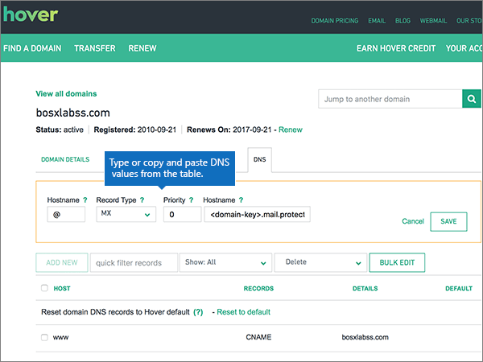

# Erstellen von DNS-Einträgen bei Hover für MicrosoftCreate DNS records at Hover for Microsoft

 **[Überprüfen Sie die häufig gestellten Fragen (FAQ) zu Domänen](../setup/domains-faq.md)**, wenn Sie nicht finden, wonach Sie suchen.**[Check the Domains FAQ](../setup/domains-faq.md)** if you don't find what you're looking for. 
  
Wenn Hover Ihr DNS-Hostinganbieter ist, führen Sie die in diesem Artikel aufgeführten Schritte aus, um Ihre Domäne zu überprüfen und DNS-Einträge für E-Mail, Skype for Business Online und andere Dienste einzurichten.If Hover is your DNS hosting provider, follow the steps in this article to verify your domain and set up DNS records for email, Skype for Business Online, and so on.
     
Nachdem Sie diese Einträge bei Hover hinzugefügt haben, ist Ihre Domäne für die Verwendung mit Microsoft-Diensten eingerichtet.After you add these records at Hover, your domain will be set up to work with Microsoft services.
  

  
> [!NOTE]
>  Typically it takes about 15 minutes for DNS changes to take effect.Typically it takes about 15 minutes for DNS changes to take effect. However, it can occasionally take longer for a change you've made to update across the Internet's DNS system.However, it can occasionally take longer for a change you've made to update across the Internet's DNS system. If you're having trouble with mail flow or other issues after adding DNS records, see [Troubleshoot issues after changing your domain name or DNS records](../get-help-with-domains/find-and-fix-issues.md).If you're having trouble with mail flow or other issues after adding DNS records, see [Troubleshoot issues after changing your domain name or DNS records](../get-help-with-domains/find-and-fix-issues.md). 
  
## Hinzufügen eines TXT-Eintrags zur ÜberprüfungAdd a TXT record for verification

Before you use your domain with Microsoft, we have to make sure that you own it.Before you use your domain with Microsoft, we have to make sure that you own it. Your ability to log in to your account at your domain registrar and create the DNS record proves to Microsoft that you own the domain.Your ability to log in to your account at your domain registrar and create the DNS record proves to Microsoft that you own the domain.
  
> [!NOTE]
> This record is used only to verify that you own your domain; it doesn't affect anything else.This record is used only to verify that you own your domain; it doesn't affect anything else. You can delete it later, if you like.You can delete it later, if you like. 
  
Führen Sie die folgenden Schritte aus, oder [schauen Sie sich das Video an](https://support.microsoft.com/office/182bd58e-8fe4-4717-9233-3a3546b72ad2).Follow the steps below or [watch the video](https://support.microsoft.com/office/182bd58e-8fe4-4717-9233-3a3546b72ad2).
  
1. To get started, go to your domains page at Hover by using [this link](https://www.hover.com/domains).To get started, go to your domains page at Hover by using [this link](https://www.hover.com/domains). You'll be prompted to sign in.You'll be prompted to sign in.
    
    
  
2. Wählen Sie unter **Ihre Domänen verwalten**den Namen der Domäne aus, die Sie bearbeiten möchten.Under **Manage Your Domains**, select the name of the domain that you want to edit.
    
    
  
3. Wählen Sie die Registerkarte **DNS** aus.Select the **DNS** tab. 
    
    
  
4. Wählen Sie **Neu hinzufügen**aus.Select **Add New**.
    
    
  
5. In the boxes for the new record, select **TXT** for the **Record Type**, and then type or copy and paste the values from the following table.In the boxes for the new record, select **TXT** for the **Record Type**, and then type or copy and paste the values from the following table.
    
    ||||
    |:-----|:-----|:-----|
    |HostnameHostname    |EintragstypRecord Type    |ValueValue    |
    |@    |TXTTXT    |MS=ms *XXXXXXXX*MS=ms *XXXXXXXX*    **Hinweis:** Dies ist ein Beispiel.**Note:** This is an example. Verwenden Sie hier Ihre spezifischen **Ziel-oder Punkt-zu-Adresse** -Werte aus der Tabelle.Use your specific **Destination or Points to Address** value here, from the table.           [Wie finde ich diese Angabe?How do I find this?](../get-help-with-domains/information-for-dns-records.md)          |
   
    
  
6. Wählen Sie **Speichern**.Select **Save**.
    
    
  
7. Warten Sie einige Minuten, bevor Sie fortfahren, damit der soeben erstellte Eintrag im Internet aktualisiert werden kann.Wait a few minutes before you continue, so that the record you just created can update across the Internet.
    
Nachdem Sie den Eintrag auf der Website Ihrer Domänenregistrierungsstelle hinzugefügt haben, kehren Sie zu Microsoft 365 zurück und fordern Microsoft 365 auf, nach dem Eintrag zu suchen.Now that you've added the record at your domain registrar's site, you'll go back to Microsoft 365 and request Microsoft 365 to look for the record.
  
Wenn Microsoft den richtigen TXT-Eintrag findet, ist die Domäne überprüft.When Microsoft finds the correct TXT record, your domain is verified.
  
1. Wechseln Sie im Microsoft Admin Center zur Seite **Einstellungen** \> <a href="https://go.microsoft.com/fwlink/p/?linkid=834818" target="_blank">Domänen</a>.In the Microsoft admin center, go to the **Settings** \> <a href="https://go.microsoft.com/fwlink/p/?linkid=834818" target="_blank">Domains</a> page.
    
2. Wählen Sie auf der Seite **Domänen** die zu überprüfende Domäne aus.On the **Domains** page, select the domain that you are verifying. 
    
    
  
3. Wählen Sie auf der Seite **Setup** die Option **Setup starten** aus.On the **Setup** page, select **Start setup**.
    
    
  
4. Wählen Sie auf der Seite **Domäne überprüfen** die Option **Überprüfen** aus.On the **Verify domain** page, select **Verify**.
    
    
  
> [!NOTE]
>  Typically it takes about 15 minutes for DNS changes to take effect.Typically it takes about 15 minutes for DNS changes to take effect. However, it can occasionally take longer for a change you've made to update across the Internet's DNS system.However, it can occasionally take longer for a change you've made to update across the Internet's DNS system. If you're having trouble with mail flow or other issues after adding DNS records, see [Troubleshoot issues after changing your domain name or DNS records](../get-help-with-domains/find-and-fix-issues.md).If you're having trouble with mail flow or other issues after adding DNS records, see [Troubleshoot issues after changing your domain name or DNS records](../get-help-with-domains/find-and-fix-issues.md). 
  
## Fügen Sie einen MX-Eintrag hinzu, damit E-Mails für Ihre Domäne an Microsoft geleitet werden.Add an MX record so email for your domain will come to Microsoft

Führen Sie die folgenden Schritte aus, oder [schauen Sie sich das Video an](https://support.microsoft.com/office/182bd58e-8fe4-4717-9233-3a3546b72ad2).Follow the steps below or [watch the video](https://support.microsoft.com/office/182bd58e-8fe4-4717-9233-3a3546b72ad2).
  
1. To get started, go to your domains page at Hover by using [this link](https://www.hover.com/domains).To get started, go to your domains page at Hover by using [this link](https://www.hover.com/domains). You'll be prompted to sign in.You'll be prompted to sign in.
    
    
  
2. Wählen Sie unter **Ihre Domänen verwalten**den Namen der Domäne aus, die Sie bearbeiten möchten.Under **Manage Your Domains**, select the name of the domain that you want to edit.
    
    
  
3. Wählen Sie die Registerkarte **DNS** aus.Select the **DNS** tab. 
    
    
  
4. Wählen Sie **Neu hinzufügen**aus.Select **Add New**.
    
    
  
5. Wählen Sie in den Feldern für den neuen Eintrag für **Record Type** die Option **MX** aus, und geben Sie dann die Werte aus der folgenden Tabelle ein. Sie können die Werte auch kopieren und einfügen.In the boxes for the new record, select **MX** for the **Record Type**, and then type or copy and paste the values from the following table.
    
    |**Hostname****Hostname**|**Record Type****Record Type**|**Priorität****Priority**|**Hostname****Hostname**|
    |:-----|:-----|:-----|:-----|
    |@    |MXMX    |00    Weitere Informationen zur Priorität finden Sie unter [Was ist MX-Priorität?](https://docs.microsoft.com/microsoft-365/admin/setup/domains-faq)For more information about priority, see [What is MX priority?](https://docs.microsoft.com/microsoft-365/admin/setup/domains-faq)   | *\<domain-key\>*. Mail.Protection.Outlook.com*\<domain-key\>*  .mail.protection.outlook.com    **Hinweis:** Holen Sie sich Ihr *\<domain-key\>* Microsoft-Konto.**Note:** Get your  *\<domain-key\>*  from your Microsoft account.           [Wie finde ich diese Angabe?How do I find this?](../get-help-with-domains/information-for-dns-records.md)          |
   
    
  
6. Wählen Sie **Speichern**.Select **Save**.
    
    
  
7. Wenn andere MX-Einträge vorhanden sind, führen Sie die beiden folgenden Schritte aus, um diese zu entfernen:If there are any other MX records, use the following two-step process to remove each of them:
    
    Klicken Sie zuerst auf einen Datensatz, den Sie entfernen möchten, und wählen Sie dann **Löschen**aus.First, mousing over a record that you want to remove, select **Delete**.
    
    
  
    Klicken Sie zweitens auf **Ja** , um den Löschvorgang zu bestätigen.Second, select **Yes** to confirm each deletion. 
    
    
  
    Wiederholen Sie diesen Vorgang, bis Sie alle MX-Einträge mit Ausnahme des Eintrags, den Sie zuvor in diesem Verfahren hinzugefügt haben, gelöscht sind.Repeat this process until you have deleted all MX records except for the one that you added earlier in this procedure.
    
## Hinzufügen der für Microsoft erforderlichen CNAME-EinträgeAdd the CNAME records that are required for Microsoft

Führen Sie die folgenden Schritte aus, oder [schauen Sie sich das Video an](https://support.microsoft.com/office/182bd58e-8fe4-4717-9233-3a3546b72ad2).Follow the steps below or [watch the video](https://support.microsoft.com/office/182bd58e-8fe4-4717-9233-3a3546b72ad2).
  
1. To get started, go to your domains page at Hover by using [this link](https://www.hover.com/domains).To get started, go to your domains page at Hover by using [this link](https://www.hover.com/domains). You'll be prompted to sign in.You'll be prompted to sign in.
    
    
  
2. Wählen Sie unter **Ihre Domänen verwalten**den Namen der Domäne aus, die Sie bearbeiten möchten.Under **Manage Your Domains**, select the name of the domain that you want to edit.
    
    
  
3. Wählen Sie die Registerkarte **DNS** aus.Select the **DNS** tab. 
    
    
  
4. Fügen Sie den ersten der sechs CNAME-Einträge hinzu.Add the first of the six CNAME records.
    
    Wählen Sie **Neu hinzufügen**aus.Select **Add New**.
    
    
  
5. Wählen Sie in den leeren Feldern für den neuen Eintrag für **Record Type** die Option **CNAME** aus, und geben Sie dann die Werte aus der ersten Zeile in der folgenden Tabelle ein. Sie können die Werte auch kopieren und einfügen.In the empty boxes for the new record, select **CNAME** for the **Record Type**, and then type or copy and paste the values from the first row in the following table.
    
    |**Hostname****Hostname**|**Record Type****Record Type**|**Zielhost****Target Host**|
    |:-----|:-----|:-----|
    |autodiscoverautodiscover    |CNAMECNAME    |autodiscover.outlook.comautodiscover.outlook.com    |
    |sipsip    |CNAMECNAME    |sipdir.online.lync.comsipdir.online.lync.com    |
    |lyncdiscoverlyncdiscover    |CNAMECNAME    |webdir.online.lync.comwebdir.online.lync.com    |
    |enterpriseregistrationenterpriseregistration    |CNAMECNAME    |enterpriseregistration.windows.netenterpriseregistration.windows.net    |
    |enterpriseenrollmententerpriseenrollment    |CNAMECNAME    |enterpriseenrollment-s.manage.microsoft.comenterpriseenrollment-s.manage.microsoft.com    |
   
    
  
6. Wählen Sie **Speichern**.Select **Save**.
    
    
  
7. Fügen Sie die anderen fünf CNAME-Einträge hinzu, indem Sie die vorangegangenen drei Schritte mit den Werten aus den anderen fünf Zeilen in der Tabelle wiederholen.Using the preceding three steps and the values from the other five rows in the table, add each of the other five CNAME records.
    
## Hinzufügen eines TXT-Eintrags für SPF, um E-Mail-Spam zu verhindernAdd a TXT record for SPF to help prevent email spam

> [!IMPORTANT]
> Es kann bei einer Domäne nur einen TXT-Eintrag für SPF geben.You cannot have more than one TXT record for SPF for a domain. Wenn es bei Ihrer Domäne mehrere SPF-Einträge gibt, treten E-Mail-Fehler sowie Probleme bei der Übermittlung und Spamklassifizierung auf.If your domain has more than one SPF record, you'll get email errors, as well as delivery and spam classification issues. Wenn es für Ihre Domäne bereits einen SPF-Eintrag gibt, erstellen Sie für Microsoft keinen neuen,If you already have an SPF record for your domain, don't create a new one for Microsoft. Fügen Sie stattdessen die erforderlichen Microsoft-Werte zum aktuellen Datensatz hinzu, sodass Sie einen *einzelnen* SPF-Eintrag haben, der beide Wertegruppen enthält.Instead, add the required Microsoft values to the current record so that you have a  *single*  SPF record that includes both sets of values. 
  
Führen Sie die folgenden Schritte aus, oder [schauen Sie sich das Video an](https://support.microsoft.com/office/182bd58e-8fe4-4717-9233-3a3546b72ad2).Follow the steps below or [watch the video](https://support.microsoft.com/office/182bd58e-8fe4-4717-9233-3a3546b72ad2).
  
1. To get started, go to your domains page at Hover by using [this link](https://www.hover.com/domains).To get started, go to your domains page at Hover by using [this link](https://www.hover.com/domains). You'll be prompted to sign in.You'll be prompted to sign in.
    
    
  
2. Wählen Sie unter **Ihre Domänen verwalten**den Namen der Domäne aus, die Sie bearbeiten möchten.Under **Manage Your Domains**, select the name of the domain that you want to edit.
    
    
  
3. Wählen Sie die Registerkarte **DNS** aus.Select the **DNS** tab. 
    
    
  
4. Wählen Sie **Neu hinzufügen**aus.Select **Add New**.
    
    
  
5. In the boxes for the new record, select **TXT** for the **Record Type**, and then type or copy and paste the values from the following table.In the boxes for the new record, select **TXT** for the **Record Type**, and then type or copy and paste the values from the following table.
    
    |**Hostname****Hostname**|**Record Type****Record Type**|**Value****Value**|
    |:-----|:-----|:-----|
    |@    |TXTTXT    |v=spf1 include:spf.protection.outlook.com -allv=spf1 include:spf.protection.outlook.com -all   **Hinweis:** Es wird empfohlen, diesen Eintrag zu kopieren und einzufügen, damit alle Abstände korrekt übernommen werden.**Note:** We recommend copying and pasting this entry, so that all of the spacing stays correct.           |
   
    
  
6. Wählen Sie **Speichern**.Select **Save**.
    
    
  
## Hinzufügen der für Microsoft erforderlichen zwei SRV-EinträgeAdd the two SRV records that are required for Microsoft

Führen Sie die folgenden Schritte aus, oder [schauen Sie sich das Video an](https://support.microsoft.com/office/182bd58e-8fe4-4717-9233-3a3546b72ad2).Follow the steps below or [watch the video](https://support.microsoft.com/office/182bd58e-8fe4-4717-9233-3a3546b72ad2).
  
1. To get started, go to your domains page at Hover by using [this link](https://www.hover.com/domains).To get started, go to your domains page at Hover by using [this link](https://www.hover.com/domains). You'll be prompted to sign in.You'll be prompted to sign in.
    
    
  
2. Wählen Sie unter **Ihre Domänen verwalten**den Namen der Domäne aus, die Sie bearbeiten möchten.Under **Manage Your Domains**, select the name of the domain that you want to edit.
    
    
  
3. Wählen Sie die Registerkarte **DNS** aus.Select the **DNS** tab. 
    
    
  
4. Fügen Sie den ersten der zwei SRV-Einträge hinzu.Add the first of the two SRV records.
    
    Wählen Sie **Neu hinzufügen**aus.Select **Add New**.
    
    
  
5. Wählen Sie in den leeren Feldern für den neuen Eintrag für **Record Type** die Option **SRV** aus, und geben Sie dann die Werte aus der ersten Zeile in der folgenden Tabelle ein. Sie können die Werte auch kopieren und einfügen.In the empty boxes for the new record, select **SRV** for the **Record Type**, and then type or copy and paste the values from the first row in the following table.
    
    |**Hostname****Hostname**|**Record Type****Record Type**|**Priority****Priority**|**Weight****Weight**|**Port****Port**|**Target****Target**|
    |:-----|:-----|:-----|:-----|:-----|:-----|
    |_sip._tls_sip._tls    |SRVSRV    |100100    |1 1    |443443    |sipdir.online.lync.comsipdir.online.lync.com    |
    |_sipfederationtls._tcp_sipfederationtls._tcp    |SRVSRV    |100100    |1 1    |50615061    |sipfed.online.lync.comsipfed.online.lync.com    |
   
    
  
6. Wählen Sie **Speichern**.Select **Save**.
    
    
  
7. Fügen Sie den anderen SRV-Eintrag hinzu, indem Sie die vorangegangenen drei Schritte mit den Werten aus der zweiten Zeile in der Tabelle wiederholen.Using the preceding three steps and the values from the second row in the table, add the other SRV record.
    
> [!NOTE]
> Typically it takes about 15 minutes for DNS changes to take effect.Typically it takes about 15 minutes for DNS changes to take effect. However, it can occasionally take longer for a change you've made to update across the Internet's DNS system.However, it can occasionally take longer for a change you've made to update across the Internet's DNS system. If you're having trouble with mail flow or other issues after adding DNS records, see [Troubleshoot issues after changing your domain name or DNS records](../get-help-with-domains/find-and-fix-issues.md).If you're having trouble with mail flow or other issues after adding DNS records, see [Troubleshoot issues after changing your domain name or DNS records](../get-help-with-domains/find-and-fix-issues.md). 
  
