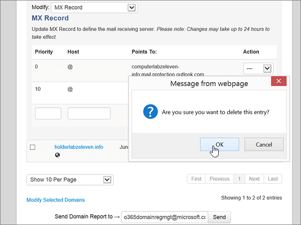
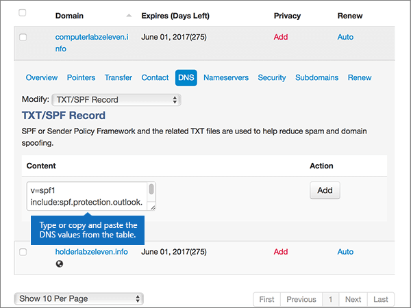

# Erstellen von DNS-Einträgen für Office 365 bei MyDomainCreate DNS records at MyDomain for Office 365

  
 **[Überprüfen Sie die häufig gestellten Fragen (FAQ) zu Domänen](../setup/domains-faq.md)**, wenn Sie nicht finden, wonach Sie suchen.**[Check the Domains FAQ](../setup/domains-faq.md)** if you don't find what you're looking for. 
  
> [!CAUTION]
> Die MyDomain-Website unterstützt keine SRV-Einträge. Das bedeutet, dass mehrere Features von Skype for Business Online und Outlook Web App nicht funktionieren. Unabhängig vom verwendeten Office 365-Plan bestehen bei der Verwaltung Ihrer DNS-Einträge bei MyDomain [erhebliche Diensteinschränkungen](https://support.office.com/article/7ae9a655-041d-4724-aa92-60392ee390c2.aspx), und Sie sollten möglicherweise zu einem anderen DNS-Hostinganbieter wechseln.The MyDomain website doesn't support SRV records, which means several Skype for Business Online and Outlook Web App features won't work. No matter which Office 365 plan you use, if you manage your DNS records at MyDomain, there are [significant service limitations](https://support.office.com/article/7ae9a655-041d-4724-aa92-60392ee390c2.aspx), and you might want to switch to a different DNS hosting provider. 
  
Wenn Sie sich trotz der Diensteinschränkungen dafür entscheiden, Ihre eigenen DNS-Einträge für Office 365 bei MyDomain zu verwalten, führen Sie die Schritte in diesem Artikel aus, um die DNS-Einträge für E-Mail, Skype for Business Online und andere Dienste einzurichten.If you choose to manage your own Office 365 DNS records at MyDomain despite the service limitations, follow the steps in this article to set up your DNS records for email, Skype for Business Online, and so on.
    
Nachdem Sie diese Einträge bei MyDomain hinzugefügt haben, ist Ihre Domäne für die Verwendung von Office 365-Diensten eingerichtet.After you add these records at MyDomain, your domain will be set up to work with Office 365 services.
  
Informationen zu Webhosting und DNS für Websites mit Office 365 finden Sie unter [Verwenden einer öffentlichen Website mit Office 365](https://support.office.com/article/choose-a-public-website-3325d50e-d131-403c-a278-7f3296fe33a9).To learn about webhosting and DNS for websites with Office 365, see [Use a public website with Office 365](https://support.office.com/article/choose-a-public-website-3325d50e-d131-403c-a278-7f3296fe33a9).
  
> [!NOTE]
> Normalerweise dauert es ungefähr 15 Minuten, bis DNS-Änderungen wirksam werden. Es kann jedoch gelegentlich länger dauern, bis eine von Ihnen vorgenommene Änderung im Internet im DNS-System aktualisiert wurde. Wenn nach dem Hinzufügen von DNS-Einträgen Probleme mit dem E-Mail-Fluss oder andere Probleme auftreten, lesen Sie [Suchen und Beheben von Problemen, nachdem Ihre Domäne oder DNS-Einträge in Office 365 hinzugefügt wurden](../get-help-with-domains/find-and-fix-issues.md).Typically it takes about 15 minutes for DNS changes to take effect. However, it can occasionally take longer for a change you've made to update across the Internet's DNS system. If you're having trouble with mail flow or other issues after adding DNS records, see [Find and fix issues after adding your domain or DNS records in Office 365](../get-help-with-domains/find-and-fix-issues.md). 
  
## Hinzufügen eines TXT-Eintrags zur ÜberprüfungAdd a TXT record for verification

Bevor Sie Ihre Domäne in Office 365 verwenden können, müssen wir uns vergewissern, dass Sie deren Besitzer sind. Ihre Fähigkeit, sich bei Ihrem Konto bei Ihrer Domänenregistrierungsstelle anzumelden und den DNS-Eintrag zu erstellen, ist für Office 365 der Nachweis, dass Sie der Besitzer der Domäne sind.Before you use your domain with Office 365, we have to make sure that you own it. Your ability to log in to your account at your domain registrar and create the DNS record proves to Office 365 that you own the domain.
  
> [!NOTE]
> Dieser Eintrag wird nur verwendet, um zu überprüfen, ob Sie der Besitzer Ihrer Domäne sind. Er hat keine weiteren Auswirkungen. Sie können ihn später ggf. löschen.This record is used only to verify that you own your domain; it doesn't affect anything else. You can delete it later, if you like. 
  
1. Im ersten Schritt navigieren Sie über [diesen Link](https://www.mydomain.com/controlpanel) zu Ihrer Domänenseite bei MyDomain. Sie werden aufgefordert, sich zuerst anzumelden.To get started, go to your domains page at MyDomain by using [this link](https://www.mydomain.com/controlpanel). You'll be prompted to log in first.
    
2. Wählen Sie im Abschnitt **Meine Favorien** die Option **Domain Central** aus.In the **My Favorites** section, select **Domain Central**.
    
3. Wählen Sie unter **Domain** den Namen der Domäne aus, die Sie bearbeiten möchten.Under **Domain**, select the name of the domain that you want to edit.
    
4. Wählen Sie in der Zeile **Overview** die Option **DNS** aus.In the **Overview** row, select **DNS**.
    
5. Wählen Sie in der Dropdownliste **Modify** den Eintrag **TXT/SPF Record** aus.From the **Modify** drop-down list, choose **TXT/SPF Record**.
    
6. Geben Sie unter **Content** im Feld für den neuen Eintrag den Wert aus der folgenden Tabelle ein. Sie können den Wert auch kopieren und einfügen.Under **Content**, in the box for the new record, type or copy and paste the value from the following table.
    
    ||
    |:-----|
    |**Inhalt****Content**   |
    |MS=ms *XXXXXXXX*MS=ms *XXXXXXXX*    **Hinweis:** Dies ist ein nur Beispiel. Verwenden Sie jeweils Ihren Wert für **die Zieladresse bzw. die Adresse, auf die verwiesen wird** aus der Tabelle in Office 365. [Wie finde ich diese Angabe?](../get-help-with-domains/information-for-dns-records.md)**Note:** This is an example. Use your specific **Destination or Points to Address** value here, from the table in Office 365. [How do I find this?](../get-help-with-domains/information-for-dns-records.md)          |
   
7. Klicken Sie auf **Hinzufügen**.Select **Add**.
    
8. Warten Sie einige Minuten, bevor Sie fortfahren, damit der soeben erstellte Eintrag im Internet aktualisiert werden kann.Wait a few minutes before you continue, so that the record you just created can update across the Internet.
    
Nachdem Sie den Eintrag auf der Website Ihrer Domänenregistrierungsstelle hinzugefügt haben, kehren Sie zu Office 365 zurück und fordern Office 365 auf, nach dem Eintrag zu suchen.Now that you've added the record at your domain registrar's site, you'll go back to Office 365 and request Office 365 to look for the record.
  
Wenn Office 365 den richtigen TXT-Eintrag findet, wird die Domäne überprüft.When Office 365 finds the correct TXT record, your domain is verified.
  
1. Wechseln Sie im Admin Center zur Seite **Einstellungen** \> <a href="https://go.microsoft.com/fwlink/p/?linkid=834818" target="_blank">Domänen</a>.In the admin center, go to the **Settings** \> <a href="https://go.microsoft.com/fwlink/p/?linkid=834818" target="_blank">Domains</a> page.
    
2. Wählen Sie auf der Seite **Domänen** die zu überprüfende Domäne aus.On the **Domains** page, select the domain that you are verifying. 
    
3. Wählen Sie auf der Seite **Setup** die Option **Setup starten** aus.On the **Setup** page, select **Start setup**.
    
4. Wählen Sie auf der Seite **Domäne überprüfen** die Option **Überprüfen** aus.On the **Verify domain** page, select **Verify**.
    
> [!NOTE]
> Normalerweise dauert es ungefähr 15 Minuten, bis DNS-Änderungen wirksam werden. Es kann jedoch gelegentlich länger dauern, bis eine von Ihnen vorgenommene Änderung im Internet im DNS-System aktualisiert wurde. Wenn nach dem Hinzufügen von DNS-Einträgen Probleme mit dem E-Mail-Fluss oder andere Probleme auftreten, lesen Sie [Suchen und Beheben von Problemen, nachdem Ihre Domäne oder DNS-Einträge in Office 365 hinzugefügt wurden](../get-help-with-domains/find-and-fix-issues.md).Typically it takes about 15 minutes for DNS changes to take effect. However, it can occasionally take longer for a change you've made to update across the Internet's DNS system. If you're having trouble with mail flow or other issues after adding DNS records, see [Find and fix issues after adding your domain or DNS records in Office 365](../get-help-with-domains/find-and-fix-issues.md). 
  
## Hinzufügen eines MX-Eintrags, damit E-Mails für Ihre Domäne zu Office 365 geleitet werdenAdd an MX record so email for your domain will come to Office 365

1. Im ersten Schritt navigieren Sie über [diesen Link](https://www.mydomain.com/controlpanel) zu Ihrer Domänenseite bei MyDomain. Sie werden aufgefordert, sich zuerst anzumelden.To get started, go to your domains page at MyDomain by using [this link](https://www.mydomain.com/controlpanel). You'll be prompted to log in first.
    
2. Wählen Sie im Abschnitt **Meine Favorien** die Option **Domain Central** aus.In the **My Favorites** section, select **Domain Central**.
    
3. Wählen Sie unter **Domain** den Namen der Domäne aus, die Sie bearbeiten möchten.Under **Domain**, select the name of the domain that you want to edit.
    
4. Wählen Sie in der Zeile **Overview** die Option **DNS** aus.In the **Overview** row, select **DNS**.
    
5. Wählen Sie in der Dropdownliste **Modify** den Eintrag **MX Record** aus.From the **Modify** drop-down list, choose **MX Record**.
    
    
  
6. Geben Sie in den Feldern für den neuen Eintrag die Werte aus der folgenden Tabelle ein. Sie können die Werte auch kopieren und einfügen.In the boxes for the new record, type or copy and paste the values from the following table.
    
    |**Priority****Priority**|**Host****Host**|**Points To:****Points To:**|
    |:-----|:-----|:-----|
    |00    Weitere Informationen zur Priorität finden Sie unter [Was ist MX-Priorität?](https://support.office.com/article/2784cc4d-95be-443d-b5f7-bb5dd867ba83.aspx)For more information about priority, see [What is MX priority?](https://support.office.com/article/2784cc4d-95be-443d-b5f7-bb5dd867ba83.aspx)   |@    | *\<Domänenschlüssel\>*  .mail.protection.outlook.com*\<domain-key\>*  .mail.protection.outlook.com    **Hinweis:** Rufen Sie Ihren Domänenschlüssel (\<*domain-key*\>) aus Ihrem Office 365-Konto ab.**Note:** Get your \<*domain-key*\> from your Office 365 account. > [Wie finde ich diese Angabe?](../get-help-with-domains/information-for-dns-records.md) > [How do I find this?](../get-help-with-domains/information-for-dns-records.md)          |
   
    
  
7. Klicken Sie auf **Hinzufügen**.Select **Add**.
    
    
  
8. Wenn andere MX-Einträge vorhanden sind, entfernen Sie diese, indem Sie **Remove** in der Spalte **Action** der einzelnen Einträge auswählen.If there are any other existing MX records, select **Remove** in the **Action** column for each one to delete it. 
    
    
  
9. Wählen Sie **OK** aus.Select **OK**.
    
    
  
## Hinzufügen der für Office 365 erforderlichen CNAME-EinträgeAdd the CNAME records that are required for Office 365

1. Im ersten Schritt navigieren Sie über [diesen Link](https://www.mydomain.com/controlpanel) zu Ihrer Domänenseite bei MyDomain. Sie werden aufgefordert, sich zuerst anzumelden.To get started, go to your domains page at MyDomain by using [this link](https://www.mydomain.com/controlpanel). You'll be prompted to log in first.
    
2. Wählen Sie im Abschnitt **Meine Favorien** die Option **Domain Central** aus.In the **My Favorites** section, select **Domain Central**.
    
3. Wählen Sie unter **Domain** den Namen der Domäne aus, die Sie bearbeiten möchten.Under **Domain**, select the name of the domain that you want to edit.
    
4. Wählen Sie in der Zeile **Overview** die Option **DNS** aus.In the **Overview** row, select **DNS**.
    
5. Wählen Sie in der Dropdownliste **Modify** den Eintrag **CNAME Alias** aus.From the **Modify** drop-down list, choose **CNAME Alias**.
    
    
  
6. Fügen Sie den ersten CNAME-Eintrag hinzu.Add the first CNAME record.
    
    Geben Sie in den Feldern für den neuen Eintrag die Werte aus der ersten Zeile der folgenden Tabelle ein. Sie können die Werte auch kopieren und einfügen.In the boxes for the new record, type or copy and paste the values from the first row of the following table.
    
    |**Host****Host**|**Points To:****Points To:**|
    |:-----|:-----|
    |autodiscoverautodiscover    |autodiscover.outlook.comautodiscover.outlook.com    |
    |sipsip    |sipdir.online.lync.comsipdir.online.lync.com    |
    |lyncdiscoverlyncdiscover    |webdir.online.lync.comwebdir.online.lync.com    |
    |enterpriseregistrationenterpriseregistration    |enterpriseregistration.windows.netenterpriseregistration.windows.net    |
    |enterpriseenrollmententerpriseenrollment    |enterpriseenrollment-s.manage.microsoft.comenterpriseenrollment-s.manage.microsoft.com    |
   
    
  
7. Wählen Sie **Hinzufügen** aus, um den ersten Eintrag hinzuzufügen.Select **Add** to add the first record. 
    
    
  
8. Fügen Sie den zweiten CNAME-Eintrag hinzu.Add the second CNAME record.
    
    Verwenden Sie die Werte aus der zweiten Zeile der obigen Tabelle, und wählen Sie dann **Hinzufügen** aus, um den zweiten Eintrag hinzuzufügen.Use the values from the second row of the table above, and then select **Add** to add the second record. 
    
    Fügen Sie die übrigen Einträge auf gleiche Weise hinzu. Verwenden Sie dabei die Werte aus der dritten, vierten, fünften und sechsten Zeile der Tabelle.Add the remaining records in the same way, using the values from the third, fourth, fifth, and sixth rows of the table.
    
## Hinzufügen eines TXT-Eintrags für SPF, um E-Mail-Spam zu verhindernAdd a TXT record for SPF to help prevent email spam

> [!IMPORTANT]
> Es kann bei einer Domäne nur einen TXT-Eintrag für SPF geben.You cannot have more than one TXT record for SPF for a domain. Wenn es bei Ihrer Domäne mehrere SPF-Einträge gibt, treten E-Mail-Fehler sowie Probleme bei der Übermittlung und Spamklassifizierung auf.If your domain has more than one SPF record, you'll get email errors, as well as delivery and spam classification issues. If you already have an SPF record for your domain, don't create a new one for Office 365.If you already have an SPF record for your domain, don't create a new one for Office 365. Damit verfügen Sie über einen einzigen SPF-Eintrag, in dem beide Wertemengen enthalten sind.Instead, add the required Office 365 values to the current record so that you have a single SPF record that includes both sets of values. Benötigen Sie Beispiele?Need examples? Schauen Sie sich diese [Details und SPF-Beispieleinträge](https://support.office.com/article/c0531a6f-9e25-4f2d-ad0e-a70bfef09ac0#bkmk_spfrecords) an.Check out these [External Domain Name System records for Office 365](https://support.office.com/article/c0531a6f-9e25-4f2d-ad0e-a70bfef09ac0#bkmk_spfrecords). Zum Überprüfen Ihres SPF-Eintrags können Sie eines dieser [SPF-Überprüfungstools](../setup/domains-faq.md) verwenden.To validate your SPF record, you can use one of these [SPF validation tools](../setup/domains-faq.md). 
  
1. Im ersten Schritt navigieren Sie über [diesen Link](https://www.mydomain.com/controlpanel) zu Ihrer Domänenseite bei MyDomain. Sie werden aufgefordert, sich zuerst anzumelden.To get started, go to your domains page at MyDomain by using [this link](https://www.mydomain.com/controlpanel). You'll be prompted to log in first.
    
2. Wählen Sie im Abschnitt **Meine Favorien** die Option **Domain Central** aus.In the **My Favorites** section, select **Domain Central**.
    
3. Wählen Sie unter **Domain** den Namen der Domäne aus, die Sie bearbeiten möchten.Under **Domain**, select the name of the domain that you want to edit.
    
4. Wählen Sie in der Zeile **Overview** die Option **DNS** aus.In the **Overview** row, select **DNS**.
    
5. Wählen Sie in der Dropdownliste **Modify** den Eintrag **TXT/SPF Record** aus.From the **Modify** drop-down list, choose **TXT/SPF Record**.
    
    
  
6. Geben Sie unter **Content** im Feld für den neuen Eintrag den Wert aus der folgenden Tabelle ein. Sie können den Wert auch kopieren und einfügen.Under **Content**, in the box for the new record, type or copy and paste the value from the following table.
    
    |**Inhalt****Content**|
    |:-----|
    |v=spf1 include:spf.protection.outlook.com -allv=spf1 include:spf.protection.outlook.com -all    **Hinweis:** Es wird empfohlen, diesen Eintrag zu kopieren und einzufügen, damit alle Abstände korrekt übernommen werden.**Note:** We recommend copying and pasting this entry, so that all of the spacing stays correct.           |
   
    
  
7. Klicken Sie auf **Hinzufügen**.Select **Add**.
    
    
  
## Hinzufügen der für Office 365 erforderlichen zwei SRV-EinträgeAdd the two SRV records that are required for Office 365

> [!CAUTION]
> Die MyDomain-Website unterstützt keine SRV-Einträge. Das bedeutet, dass mehrere Features von Skype for Business Online und Outlook Web App nicht funktionieren. Unabhängig vom verwendeten Office 365-Plan bestehen bei der Verwaltung Ihrer DNS-Einträge bei MyDomain [erhebliche Diensteinschränkungen](https://support.office.com/article/7ae9a655-041d-4724-aa92-60392ee390c2.aspx), und Sie sollten möglicherweise zu einem anderen DNS-Hostinganbieter wechseln.The MyDomain website doesn't support SRV records, which means several Skype for Business Online and Outlook Web App features won't work. No matter which Office 365 plan you use, if you manage your DNS records at MyDomain, there are [significant service limitations](https://support.office.com/article/7ae9a655-041d-4724-aa92-60392ee390c2.aspx), and you might want to switch to a different DNS hosting provider. 
  
> [!NOTE]
> Normalerweise dauert es ungefähr 15 Minuten, bis DNS-Änderungen wirksam werden. Es kann jedoch gelegentlich länger dauern, bis eine von Ihnen vorgenommene Änderung im Internet im DNS-System aktualisiert wurde. Wenn nach dem Hinzufügen von DNS-Einträgen Probleme mit dem E-Mail-Fluss oder andere Probleme auftreten, lesen Sie [Suchen und Beheben von Problemen, nachdem Ihre Domäne oder DNS-Einträge in Office 365 hinzugefügt wurden](../get-help-with-domains/find-and-fix-issues.md).Typically it takes about 15 minutes for DNS changes to take effect. However, it can occasionally take longer for a change you've made to update across the Internet's DNS system. If you're having trouble with mail flow or other issues after adding DNS records, see [Find and fix issues after adding your domain or DNS records in Office 365](../get-help-with-domains/find-and-fix-issues.md). 
  
