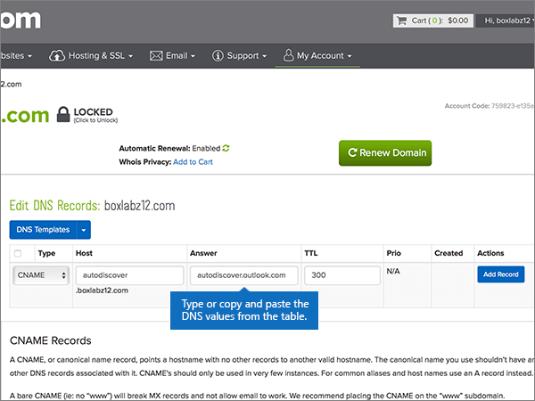
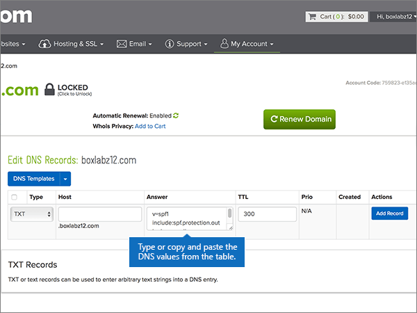

# Erstellen von DNS-Einträgen bei Name.com für MicrosoftCreate DNS records at name.com for Microsoft

 **[Überprüfen Sie die häufig gestellten Fragen (FAQ) zu Domänen](../setup/domains-faq.md)**, wenn Sie nicht finden, wonach Sie suchen.**[Check the Domains FAQ](../setup/domains-faq.md)** if you don't find what you're looking for. 
  
Wenn name.com Ihr DNS-Hostinganbieter ist, führen Sie die in diesem Artikel aufgeführten Schritte aus, um Ihre Domäne zu überprüfen und DNS-Einträge für E-Mail, Skype for Business Online und andere Dienste einzurichten.If name.com is your DNS hosting provider, follow the steps in this article to verify your domain and set up DNS records for email, Skype for Business Online, and so on.
  
Nachdem Sie diese Einträge bei Name.com hinzugefügt haben, ist Ihre Domäne für die Verwendung mit Microsoft-Diensten eingerichtet.After you add these records at name.com, your domain will be set up to work with Microsoft services.
  
Informationen zu Webhosting und DNS für Websites mit Microsoft finden Sie unter [Verwenden einer öffentlichen Website mit Microsoft](https://support.office.com/article/choose-a-public-website-3325d50e-d131-403c-a278-7f3296fe33a9).To learn about webhosting and DNS for websites with Microsoft, see [Use a public website with Microsoft](https://support.office.com/article/choose-a-public-website-3325d50e-d131-403c-a278-7f3296fe33a9).
  
> [!NOTE]
> Normalerweise dauert es ungefähr 15 Minuten, bis DNS-Änderungen wirksam werden. Es kann jedoch gelegentlich länger dauern, bis eine von Ihnen vorgenommene Änderung im Internet im DNS-System aktualisiert wurde. Wenn nach dem Hinzufügen von DNS-Einträgen Probleme mit dem E-Mail-Fluss oder andere Probleme auftreten, lesen Sie [Behandeln von Problemen nach Änderung des Domänennamens oder von DNS-Einträgen](../get-help-with-domains/find-and-fix-issues.md).Typically it takes about 15 minutes for DNS changes to take effect. However, it can occasionally take longer for a change you've made to update across the Internet's DNS system. If you're having trouble with mail flow or other issues after adding DNS records, see [Troubleshoot issues after changing your domain name or DNS records](../get-help-with-domains/find-and-fix-issues.md). 
  
## Hinzufügen eines TXT-Eintrags zur ÜberprüfungAdd a TXT record for verification

Bevor Sie Ihre Domäne mit Microsoft verwenden können, müssen wir uns vergewissern, dass Sie deren Besitzer sind. Ihre Fähigkeit, sich bei Ihrem Konto bei Ihrer Domänenregistrierungsstelle anzumelden und den DNS-Eintrag zu erstellen, ist für Microsoft der Nachweis, dass Sie der Besitzer der Domäne sind.Before you use your domain with Microsoft, we have to make sure that you own it. Your ability to log in to your account at your domain registrar and create the DNS record proves to Microsoft that you own the domain.
  
> [!NOTE]
> Dieser Eintrag wird nur verwendet, um zu überprüfen, ob Sie der Besitzer Ihrer Domäne sind. Er hat keine weiteren Auswirkungen. Sie können ihn später ggf. löschen.This record is used only to verify that you own your domain; it doesn't affect anything else. You can delete it later, if you like. 
  
1. Um zu beginnen, navigieren Sie über [diesen Link](https://www.name.com/account/domain) zu Ihrer Domänenseite bei name.com. Sie werden zuerst aufgefordert, sich anzumelden.To get started, go to your domains page at name.com by using [this link](https://www.name.com/account/domain). You'll be prompted to log in first.
    
    
  
2. Wählen Sie unter **Meine Domänen**den Namen der Domäne aus, die Sie ändern möchten.Under **My Domains**, select the name of the domain that you want to modify.
    
    
  
3. Wählen Sie in der Spalte **Details** die Option **DNS Records**aus.In the **Details** column, select **DNS Records**. 
    
    
  
4. Geben Sie in den Feldern für den neuen Eintrag die Werte aus der folgenden Tabelle ein. Sie können die Werte auch kopieren und einfügen.In the boxes for the new record, type or copy and paste the values from the following table.
    
    (Choose the **Type** value from the drop-down list.)(Choose the **Type** value from the drop-down list.) 
    
    |||||
    |:-----|:-----|:-----|:-----|
    |**Typ****Type**   |**Host****Host**   |**Answer****Answer**   |**TTL****TTL**   |
    |TXTTXT    |(Leave this field empty.)(Leave this field empty.)    |MS=ms *XXXXXXXX*MS=ms *XXXXXXXX*    **Hinweis:** Dies ist ein Beispiel.**Note:** This is an example. Verwenden Sie hier Ihre spezifischen **Ziel-oder Punkt-zu-Adresse** -Werte aus der Tabelle.Use your specific **Destination or Points to Address** value here, from the table.           [Wie finde ich diese Angabe?How do I find this?](../get-help-with-domains/information-for-dns-records.md)          |Use the default value (300).Use the default value (300).    |
   
    
  
5. Wählen Sie **Add Record** (Eintrag hinzufügen) aus.Select **Add Record**.
    
    
  
6. Warten Sie einige Minuten, bevor Sie fortfahren, damit der soeben erstellte Eintrag im Internet aktualisiert werden kann.Wait a few minutes before you continue, so that the record you just created can update across the Internet.
    
Nachdem Sie den Eintrag auf der Website Ihrer Domänenregistrierungsstelle hinzugefügt haben, kehren Sie zu Microsoft zurück und fordern Sie den Eintrag an.Now that you've added the record at your domain registrar's site, you'll go back to Microsoft and request the record.
  
Wenn Microsoft den richtigen TXT-Eintrag findet, ist die Domäne überprüft.When Microsoft finds the correct TXT record, your domain is verified.
  
1. Wechseln Sie im Admin Center zur Seite **Einstellungen** \> <a href="https://go.microsoft.com/fwlink/p/?linkid=834818" target="_blank">Domänen</a>.In the admin center, go to the **Settings** \> <a href="https://go.microsoft.com/fwlink/p/?linkid=834818" target="_blank">Domains</a> page.
    
2. Wählen Sie auf der Seite **Domänen** die zu überprüfende Domäne aus.On the **Domains** page, select the domain that you are verifying. 
    
    
  
3. Wählen Sie auf der Seite **Setup** die Option **Setup starten** aus.On the **Setup** page, select **Start setup**.
    
    
  
4. Wählen Sie auf der Seite **Domäne überprüfen** die Option **Überprüfen** aus.On the **Verify domain** page, select **Verify**.
    
    
  
> [!NOTE]
> Normalerweise dauert es ungefähr 15 Minuten, bis DNS-Änderungen wirksam werden. Es kann jedoch gelegentlich länger dauern, bis eine von Ihnen vorgenommene Änderung im Internet im DNS-System aktualisiert wurde. Wenn nach dem Hinzufügen von DNS-Einträgen Probleme mit dem E-Mail-Fluss oder andere Probleme auftreten, lesen Sie [Behandeln von Problemen nach Änderung des Domänennamens oder von DNS-Einträgen](../get-help-with-domains/find-and-fix-issues.md).Typically it takes about 15 minutes for DNS changes to take effect. However, it can occasionally take longer for a change you've made to update across the Internet's DNS system. If you're having trouble with mail flow or other issues after adding DNS records, see [Troubleshoot issues after changing your domain name or DNS records](../get-help-with-domains/find-and-fix-issues.md). 
  
## Fügen Sie einen MX-Eintrag hinzu, damit E-Mails für Ihre Domäne an Microsoft geleitet werden.Add an MX record so email for your domain will come to Microsoft

1. Um zu beginnen, navigieren Sie über [diesen Link](https://www.name.com/account/domain) zu Ihrer Domänenseite bei name.com. Sie werden zuerst aufgefordert, sich anzumelden.To get started, go to your domains page at name.com by using [this link](https://www.name.com/account/domain). You'll be prompted to log in first.
    
    
  
2. Wählen Sie unter **Meine Domänen**den Namen der Domäne aus, die Sie ändern möchten.Under **My Domains**, select the name of the domain that you want to modify.
    
    
  
3. Wählen Sie in der Spalte **Details** die Option **DNS Records**aus.In the **Details** column, select **DNS Records**. 
    
    
  
4. Geben Sie in den Feldern für den neuen Eintrag die Werte aus der folgenden Tabelle ein. Sie können die Werte auch kopieren und einfügen.In the boxes for the new record, type or copy and paste the values from the following table.
    
    (Choose the **Type** value from the drop-down list.)(Choose the **Type** value from the drop-down list.) 
    
    |**Typ****Type**|**Host****Host**|**Answer****Answer**|**TTL****TTL**|**Prio****Prio**|
    |:-----|:-----|:-----|:-----|:-----|
    |MXMX    |(Dieses Feld leer lassen.)(Leave this field empty.)    | *\<Domänenschlüssel\>*  .mail.protection.outlook.com*\<domain-key\>*  .mail.protection.outlook.com    **Hinweis:** Rufen Sie Ihren \* \<Domänenschlüssel\> \* von Ihrem Microsoft-Konto ab.**Note:** Get your  *\<domain-key\>*  from your Microsoft account.           [Wie finde ich diese Angabe?How do I find this?](../get-help-with-domains/information-for-dns-records.md)          |Use the default value (300).Use the default value (300).    |00    Weitere Informationen zur Priorität finden Sie unter [Was ist MX-Priorität?](https://support.office.com/article/2784cc4d-95be-443d-b5f7-bb5dd867ba83.aspx)For more information about priority, see [What is MX priority?](https://support.office.com/article/2784cc4d-95be-443d-b5f7-bb5dd867ba83.aspx)   |
   
   
  
5. Wählen Sie **Add Record** (Eintrag hinzufügen) aus.Select **Add Record**.
    
    
  
6. Wenn andere MX-Einträge vorhanden sind, löschen Sie diese, indem Sie die beiden folgenden Schritte ausführen:If there are any other MX records, delete each of them by using the following two-step procedure:
    
    Wählen Sie für jeden anderen MX-Eintrag in der Spalte **Aktionen** die Option **Löschen** aus.For each other MX record, select **Delete** in the **Actions** column. 
    
    
  
    Um die Löschung zu bestätigen, wählen Sie erneut in der Spalte **Aktionen** die Option **Löschen** aus.To confirm each deletion, select **Delete** in the **Actions** column again. 
    
    
  
    Wiederholen Sie diese beiden Schritte, bis Sie alle anderen MX-Einträge gelöscht haben.Repeat this two-step procedure until you have deleted each of the other MX records.
    
## Hinzufügen der für Microsoft erforderlichen CNAME-EinträgeAdd the CNAME records that are required for Microsoft

1. Um zu beginnen, navigieren Sie über [diesen Link](https://www.name.com/account/domain) zu Ihrer Domänenseite bei name.com. Sie werden zuerst aufgefordert, sich anzumelden.To get started, go to your domains page at name.com by using [this link](https://www.name.com/account/domain). You'll be prompted to log in first.
    
    
  
2. Wählen Sie unter **Meine Domänen**den Namen der Domäne aus, die Sie ändern möchten.Under **My Domains**, select the name of the domain that you want to modify.
    
    
  
3. Wählen Sie in der Spalte **Details** die Option **DNS Records**aus.In the **Details** column, select **DNS Records**. 
    
    
  
4. Fügen Sie den ersten CNAME-Eintrag hinzu.Add the first CNAME record.
    
    Geben Sie in den Feldern für den neuen Eintrag die Werte aus der ersten Zeile der folgenden Tabelle ein. Sie können die Werte auch kopieren und einfügen.In the boxes for the new record, type or copy and paste the values from the first row of the following table.
    
    (Wählen Sie in der Dropdownliste den Wert für **Type** aus.)(Choose the **Type** value from the drop-down list.) 
    
    |**Typ****Type**|**Host****Host**|**Answer****Answer**|**TTL****TTL**|
    |:-----|:-----|:-----|:-----|
    |CNAMECNAME    |autodiscoverautodiscover    |autodiscover.outlook.comautodiscover.outlook.com    |Verwenden Sie den Standardwert (300).Use the default value (300).    |
    |CNAMECNAME    |sipsip    |sipdir.online.lync.comsipdir.online.lync.com    |Verwenden Sie den Standardwert (300).Use the default value (300).    |
    |CNAMECNAME    |lyncdiscoverlyncdiscover    |webdir.online.lync.comwebdir.online.lync.com    |Verwenden Sie den Standardwert (300).Use the default value (300).    |
    |CNAMECNAME    |enterpriseregistrationenterpriseregistration    |enterpriseregistration.windows.netenterpriseregistration.windows.net    |Verwenden Sie den Standardwert (300).Use the default value (300).    |
    |CNAMECNAME    |enterpriseenrollmententerpriseenrollment    |enterpriseenrollment-s.manage.microsoft.comenterpriseenrollment-s.manage.microsoft.com    |Verwenden Sie den Standardwert (300).Use the default value (300).    |
   
   
  
5. Wählen Sie **Add Record** aus, um den ersten Datensatz hinzuzufügen.Select **Add Record** to add the first record. 
    
    
  
6. Fügen Sie den zweiten CNAME-Eintrag hinzu.Add the second CNAME record.
    
    Verwenden Sie die Werte aus der zweiten Zeile der obigen Tabelle, und wählen Sie dann **Add Record** aus, um den zweiten Datensatz hinzuzufügen.Use the values from the second row of the table above, and then select **Add Record** to add the second record. 
    
    Fügen Sie die übrigen Einträge auf gleiche Weise hinzu. Verwenden Sie dabei die Werte aus der dritten, vierten, fünften und sechsten Zeile der Tabelle.Add the remaining records in the same way, using the values from the third, fourth, fifth, and sixth rows of the table.
    
## Hinzufügen eines TXT-Eintrags für SPF, um E-Mail-Spam zu verhindernAdd a TXT record for SPF to help prevent email spam

> [!IMPORTANT]
> Es kann bei einer Domäne nur einen TXT-Eintrag für SPF geben.You cannot have more than one TXT record for SPF for a domain. Wenn es bei Ihrer Domäne mehrere SPF-Einträge gibt, treten E-Mail-Fehler sowie Probleme bei der Übermittlung und Spamklassifizierung auf.If your domain has more than one SPF record, you'll get email errors, as well as delivery and spam classification issues. Wenn es für Ihre Domäne bereits einen SPF-Eintrag gibt, erstellen Sie für Microsoft keinen neuen,If you already have an SPF record for your domain, don't create a new one for Microsoft. Fügen Sie stattdessen die erforderlichen Microsoft-Werte zum aktuellen Datensatz hinzu, sodass Sie einen *einzelnen* SPF-Eintrag haben, der beide Wertegruppen enthält.Instead, add the required Microsoft values to the current record so that you have a  *single*  SPF record that includes both sets of values. 
  
1. Um zu beginnen, navigieren Sie über [diesen Link](https://www.name.com/account/domain) zu Ihrer Domänenseite bei name.com. Sie werden zuerst aufgefordert, sich anzumelden.To get started, go to your domains page at name.com by using [this link](https://www.name.com/account/domain). You'll be prompted to log in first.
    
    
  
2. Wählen Sie unter **Meine Domänen**den Namen der Domäne aus, die Sie ändern möchten.Under **My Domains**, select the name of the domain that you want to modify.

    
  
3. Wählen Sie in der Spalte **Details** die Option **DNS Records**aus.In the **Details** column, select **DNS Records**. 
    
    
  
4. Geben Sie in den Feldern für den neuen Eintrag die Werte aus der folgenden Tabelle ein. Sie können die Werte auch kopieren und einfügen.In the boxes for the new record, type or copy and paste the values from the following table.
    
    (Choose the **Type** value from the drop-down list.)(Choose the **Type** value from the drop-down list.) 
    
    |**Typ****Type**|**Host****Host**|**Answer****Answer**|**TTL****TTL**|
    |:-----|:-----|:-----|:-----|
    |TXTTXT    |(Dieses Feld leer lassen.)(Leave this field empty.)    |v=spf1 include:spf.protection.outlook.com -allv=spf1 include:spf.protection.outlook.com -all    **Hinweis:** Es wird empfohlen, diesen Eintrag zu kopieren und einzufügen, damit alle Abstände korrekt übernommen werden.**Note:** We recommend copying and pasting this entry, so that all of the spacing stays correct.           |Use the default value (300).Use the default value (300).    |
   
   
  
5. Wählen Sie **Add Record** (Eintrag hinzufügen) aus.Select **Add Record**.
    
    
  
## Hinzufügen der für Microsoft erforderlichen zwei SRV-EinträgeAdd the two SRV records that are required for Microsoft

1. Um zu beginnen, navigieren Sie über [diesen Link](https://www.name.com/account/domain) zu Ihrer Domänenseite bei name.com. Sie werden zuerst aufgefordert, sich anzumelden.To get started, go to your domains page at name.com by using [this link](https://www.name.com/account/domain). You'll be prompted to log in first.
    
    
  
2. Wählen Sie unter **Meine Domänen**den Namen der Domäne aus, die Sie ändern möchten.Under **My Domains**, select the name of the domain that you want to modify.
    
    
  
3. Wählen Sie in der Spalte **Details** die Option **DNS Records +** aus.In the **Details** column, select **DNS Records+**. 
    
    
  
4. Fügen Sie den ersten SRV-Eintrag hinzu:Add the first SRV record:
    
    Geben Sie in den Feldern für den neuen Eintrag die Werte aus der ersten Zeile der folgenden Tabelle ein. Sie können die Werte auch kopieren und einfügen.In the boxes for the new record, type or copy and paste the values from the first row of the following table.
    
    (Wählen Sie in der Dropdownliste den Wert für **Type** aus.)(Choose the **Type** value from the drop-down list.) 
    
    |**Type****Type**|**Service****Service**|**Weight****Weight**|**TTL****TTL**|**Prio****Prio**|**Protocol****Protocol**|**Port****Port**|**Target****Target**|
    |:-----|:-----|:-----|:-----|:-----|:-----|:-----|:-----|
    |SRVSRV|sipsip|11|Verwenden Sie den Standardwert (300).Use the default value (300).|100100|tlstls|443443|sipdir.online.lync.comsipdir.online.lync.com   **Hinweis:** Es wird empfohlen, diesen Eintrag zu kopieren und einzufügen, damit alle Abstände korrekt übernommen werden.**Note:** We recommend copying and pasting this entry, so that all of the spacing stays correct.           |
    |SRVSRV|sipfederationtlssipfederationtls|11|Verwenden Sie den Standardwert (300).Use the default value (300).|100100|tcptcp|50615061|sipfed.online.lync.comsipfed.online.lync.com  **Hinweis:** Es wird empfohlen, diesen Eintrag zu kopieren und einzufügen, damit alle Abstände korrekt übernommen werden.**Note:** We recommend copying and pasting this entry, so that all of the spacing stays correct.           |
   
   
  
5. Wählen Sie **Add Record** (Eintrag hinzufügen) aus.Select **Add Record**.

    
  
6. Fügen Sie den zweiten SRV-Eintrag hinzu:Add the second SRV record:

Verwenden Sie die Werte aus der nächsten Zeile der obigen Tabelle, und wählen Sie dann **Add Record** aus, um den zweiten Datensatz hinzuzufügen.Use the values from the next row of the table above, and then select **Add Record** to add the second record.

>[!NOTE]
>Normalerweise dauert es ungefähr 15 Minuten, bis DNS-Änderungen wirksam werden. Es kann jedoch gelegentlich länger dauern, bis eine von Ihnen vorgenommene Änderung im Internet im DNS-System aktualisiert wurde. Wenn nach dem Hinzufügen von DNS-Einträgen Probleme mit dem E-Mail-Fluss oder andere Probleme auftreten, lesen Sie [Behandeln von Problemen nach Änderung des Domänennamens oder von DNS-Einträgen](../get-help-with-domains/find-and-fix-issues.md).Typically it takes about 15 minutes for DNS changes to take effect. However, it can occasionally take longer for a change you've made to update across the Internet's DNS system. If you're having trouble with mail flow or other issues after adding DNS records, see [Troubleshoot issues after changing your domain name or DNS records](../get-help-with-domains/find-and-fix-issues.md).
