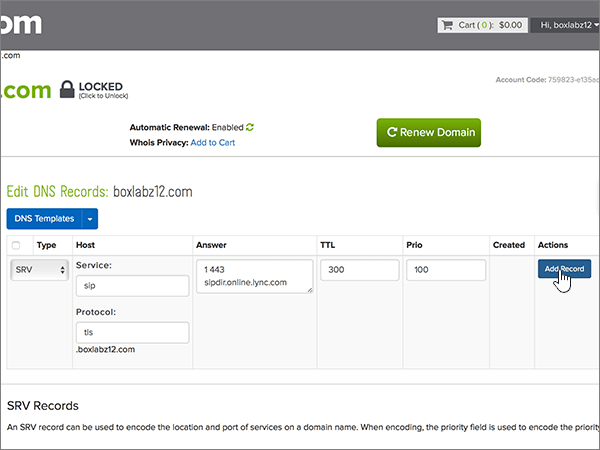

# Erstellen von DNS-Einträgen bei Name.com für Microsoft

 **[Überprüfen Sie die häufig gestellten Fragen (FAQ) zu Domänen](../setup/domains-faq.md)**, wenn Sie nicht finden, wonach Sie suchen. 
  
Wenn name.com Ihr DNS-Hostinganbieter ist, führen Sie die in diesem Artikel aufgeführten Schritte aus, um Ihre Domäne zu überprüfen und DNS-Einträge für E-Mail, Skype for Business Online und andere Dienste einzurichten.
  
Nachdem Sie diese Einträge bei Name.com hinzugefügt haben, ist Ihre Domäne für die Verwendung mit Microsoft-Diensten eingerichtet.

  
> [!NOTE]
> Normalerweise dauert es ungefähr 15 Minuten, bis DNS-Änderungen wirksam werden. Es kann jedoch gelegentlich länger dauern, bis eine von Ihnen vorgenommene Änderung im Internet im DNS-System aktualisiert wurde. Wenn nach dem Hinzufügen von DNS-Einträgen Probleme mit dem E-Mail-Fluss oder andere Probleme auftreten, lesen Sie [Behandeln von Problemen nach Änderung des Domänennamens oder von DNS-Einträgen](../get-help-with-domains/find-and-fix-issues.md). 
  
## Hinzufügen eines TXT-Eintrags zur Überprüfung

Bevor Sie Ihre Domäne mit Microsoft verwenden können, müssen wir uns vergewissern, dass Sie deren Besitzer sind. Ihre Fähigkeit, sich bei Ihrem Konto bei Ihrer Domänenregistrierungsstelle anzumelden und den DNS-Eintrag zu erstellen, ist für Microsoft der Nachweis, dass Sie der Besitzer der Domäne sind.
  
> [!NOTE]
> Dieser Eintrag wird nur verwendet, um zu überprüfen, ob Sie der Besitzer Ihrer Domäne sind. Er hat keine weiteren Auswirkungen. Sie können ihn später ggf. löschen. 
  
1. Um zu beginnen, navigieren Sie über [diesen Link](https://www.name.com/account/domain) zu Ihrer Domänenseite bei name.com. Sie werden zuerst aufgefordert, sich anzumelden.
    
    
  
2. Wählen Sie unter **Meine Domänen**den Namen der Domäne aus, die Sie ändern möchten.
    
    
  
3. Wählen Sie in der Spalte **Details** die Option **DNS Records**aus. 
    
    
  
4. Geben Sie in den Feldern für den neuen Eintrag die Werte aus der folgenden Tabelle ein. Sie können die Werte auch kopieren und einfügen.
    
    (Wählen Sie in der Dropdownliste den Wert für **Type** aus.) 
    
    |||||
    |:-----|:-----|:-----|:-----|
    |**Type**   |**Host**   |**Answer**   |**TTL**   |
    |TXT    |(Dieses Feld leer lassen.)    |MS=ms *XXXXXXXX*    **Hinweis:** Dies ist ein Beispiel. Verwenden Sie hier Ihre spezifischen **Ziel-oder Punkt-zu-Adresse** -Werte aus der Tabelle.           [Wie finde ich diese Angabe?](../get-help-with-domains/information-for-dns-records.md)          |Verwenden Sie den Standardwert (300).    |
   
    
  
5. Wählen Sie **Add Record** (Eintrag hinzufügen) aus.
    
    
  
6. Warten Sie einige Minuten, bevor Sie fortfahren, damit der soeben erstellte Eintrag im Internet aktualisiert werden kann.
    
Nachdem Sie den Eintrag auf der Website Ihrer Domänenregistrierungsstelle hinzugefügt haben, kehren Sie zu Microsoft zurück und fordern Sie den Eintrag an.
  
Wenn Microsoft den richtigen TXT-Eintrag findet, ist die Domäne überprüft.
  
1. Wechseln Sie im Admin Center zur Seite **Einstellungen** \> <a href="https://go.microsoft.com/fwlink/p/?linkid=834818" target="_blank">Domänen</a>.
    
2. Wählen Sie auf der Seite **Domänen** die zu überprüfende Domäne aus. 
    
    
  
3. Wählen Sie auf der Seite **Setup** die Option **Setup starten** aus.
    
    
  
4. Wählen Sie auf der Seite **Domäne überprüfen** die Option **Überprüfen** aus.
    
    
  
> [!NOTE]
> Normalerweise dauert es ungefähr 15 Minuten, bis DNS-Änderungen wirksam werden. Es kann jedoch gelegentlich länger dauern, bis eine von Ihnen vorgenommene Änderung im Internet im DNS-System aktualisiert wurde. Wenn nach dem Hinzufügen von DNS-Einträgen Probleme mit dem E-Mail-Fluss oder andere Probleme auftreten, lesen Sie [Behandeln von Problemen nach Änderung des Domänennamens oder von DNS-Einträgen](../get-help-with-domains/find-and-fix-issues.md). 
  
## Fügen Sie einen MX-Eintrag hinzu, damit E-Mails für Ihre Domäne an Microsoft geleitet werden.

1. Um zu beginnen, navigieren Sie über [diesen Link](https://www.name.com/account/domain) zu Ihrer Domänenseite bei name.com. Sie werden zuerst aufgefordert, sich anzumelden.
    
    
  
2. Wählen Sie unter **Meine Domänen**den Namen der Domäne aus, die Sie ändern möchten.
    
    
  
3. Wählen Sie in der Spalte **Details** die Option **DNS Records**aus. 
    
    
  
4. Geben Sie in den Feldern für den neuen Eintrag die Werte aus der folgenden Tabelle ein. Sie können die Werte auch kopieren und einfügen.
    
    (Wählen Sie in der Dropdownliste den Wert für **Type** aus.) 
    
    |**Type**|**Host**|**Answer**|**TTL**|**Prio**|
    |:-----|:-----|:-----|:-----|:-----|
    |MX    |(Dieses Feld leer lassen.)    | *\<domain-key\>*  .mail.protection.outlook.com    **Hinweis:** Holen Sie sich Ihr  *\<domain-key\>*  Microsoft-Konto.           [Wie finde ich diese Angabe?](../get-help-with-domains/information-for-dns-records.md)          |Verwenden Sie den Standardwert (300).    |0    Weitere Informationen zur Priorität finden Sie unter [Was ist MX-Priorität?](https://docs.microsoft.com/microsoft-365/admin/setup/domains-faq)   |
   
   
  
5. Wählen Sie **Add Record** (Eintrag hinzufügen) aus.
    
    
  
6. Wenn andere MX-Einträge vorhanden sind, löschen Sie diese, indem Sie die beiden folgenden Schritte ausführen:
    
    Wählen Sie für jeden anderen MX-Eintrag in der Spalte **Aktionen** die Option **Löschen** aus. 
    
    
  
    Um die Löschung zu bestätigen, wählen Sie erneut in der Spalte **Aktionen** die Option **Löschen** aus. 
    
    
  
    Wiederholen Sie diese beiden Schritte, bis Sie alle anderen MX-Einträge gelöscht haben.
    
## Hinzufügen der für Microsoft erforderlichen CNAME-Einträge

1. Um zu beginnen, navigieren Sie über [diesen Link](https://www.name.com/account/domain) zu Ihrer Domänenseite bei name.com. Sie werden zuerst aufgefordert, sich anzumelden.
    
    
  
2. Wählen Sie unter **Meine Domänen**den Namen der Domäne aus, die Sie ändern möchten.
    
    
  
3. Wählen Sie in der Spalte **Details** die Option **DNS Records**aus. 
    
    
  
4. Fügen Sie den ersten CNAME-Eintrag hinzu.
    
    Geben Sie in den Feldern für den neuen Eintrag die Werte aus der ersten Zeile der folgenden Tabelle ein. Sie können die Werte auch kopieren und einfügen.
    
    (Wählen Sie in der Dropdownliste den Wert für **Type** aus.) 
    
    |**Type**|**Host**|**Answer**|**TTL**|
    |:-----|:-----|:-----|:-----|
    |CNAME    |autodiscover    |autodiscover.outlook.com    |Verwenden Sie den Standardwert (300).    |
    |CNAME    |sip    |sipdir.online.lync.com    |Verwenden Sie den Standardwert (300).    |
    |CNAME    |lyncdiscover    |webdir.online.lync.com    |Verwenden Sie den Standardwert (300).    |
    |CNAME    |enterpriseregistration    |enterpriseregistration.windows.net    |Verwenden Sie den Standardwert (300).    |
    |CNAME    |enterpriseenrollment    |enterpriseenrollment-s.manage.microsoft.com    |Verwenden Sie den Standardwert (300).    |
   
   
  
5. Wählen Sie **Add Record** aus, um den ersten Datensatz hinzuzufügen. 
    
    
  
6. Fügen Sie den zweiten CNAME-Eintrag hinzu.
    
    Verwenden Sie die Werte aus der zweiten Zeile der obigen Tabelle, und wählen Sie dann **Add Record** aus, um den zweiten Datensatz hinzuzufügen. 
    
    Fügen Sie die übrigen Einträge auf gleiche Weise hinzu. Verwenden Sie dabei die Werte aus der dritten, vierten, fünften und sechsten Zeile der Tabelle.
    
## Hinzufügen eines TXT-Eintrags für SPF, um E-Mail-Spam zu verhindern

> [!IMPORTANT]
> Es kann bei einer Domäne nur einen TXT-Eintrag für SPF geben. Wenn es bei Ihrer Domäne mehrere SPF-Einträge gibt, treten E-Mail-Fehler sowie Probleme bei der Übermittlung und Spamklassifizierung auf. Wenn es für Ihre Domäne bereits einen SPF-Eintrag gibt, erstellen Sie für Microsoft keinen neuen, Fügen Sie stattdessen die erforderlichen Microsoft-Werte zum aktuellen Datensatz hinzu, sodass Sie einen  *einzelnen*  SPF-Eintrag haben, der beide Wertegruppen enthält. 
  
1. Um zu beginnen, navigieren Sie über [diesen Link](https://www.name.com/account/domain) zu Ihrer Domänenseite bei name.com. Sie werden zuerst aufgefordert, sich anzumelden.
    
    
  
2. Wählen Sie unter **Meine Domänen**den Namen der Domäne aus, die Sie ändern möchten.

    
  
3. Wählen Sie in der Spalte **Details** die Option **DNS Records**aus. 
    
    
  
4. Geben Sie in den Feldern für den neuen Eintrag die Werte aus der folgenden Tabelle ein. Sie können die Werte auch kopieren und einfügen.
    
    (Wählen Sie in der Dropdownliste den Wert für **Type** aus.) 
    
    |**Type**|**Host**|**Answer**|**TTL**|
    |:-----|:-----|:-----|:-----|
    |TXT    |(Dieses Feld leer lassen.)    |v=spf1 include:spf.protection.outlook.com -all    **Hinweis:** Es wird empfohlen, diesen Eintrag zu kopieren und einzufügen, damit alle Abstände korrekt übernommen werden.           |Use the default value (300).    |
   
   
  
5. Wählen Sie **Add Record** (Eintrag hinzufügen) aus.
    
    
  
## Hinzufügen der für Microsoft erforderlichen zwei SRV-Einträge

1. Um zu beginnen, navigieren Sie über [diesen Link](https://www.name.com/account/domain) zu Ihrer Domänenseite bei name.com. Sie werden zuerst aufgefordert, sich anzumelden.
    
    
  
2. Wählen Sie unter **Meine Domänen**den Namen der Domäne aus, die Sie ändern möchten.
    
    
  
3. Wählen Sie in der Spalte **Details** die Option **DNS Records +** aus. 
    
    
  
4. Fügen Sie den ersten SRV-Eintrag hinzu:
    
    Geben Sie in den Feldern für den neuen Eintrag die Werte aus der ersten Zeile der folgenden Tabelle ein. Sie können die Werte auch kopieren und einfügen.
    
    (Wählen Sie in der Dropdownliste den Wert für **Type** aus.) 
    
    |**Type**|**Service**|**Weight**|**TTL**|**Prio**|**Protocol**|**Port**|**Target**|
    |:-----|:-----|:-----|:-----|:-----|:-----|:-----|:-----|
    |SRV|sip|1|Verwenden Sie den Standardwert (300).|100|tls|443|sipdir.online.lync.com   **Hinweis:** Es wird empfohlen, diesen Eintrag zu kopieren und einzufügen, damit alle Abstände korrekt übernommen werden.           |
    |SRV|sipfederationtls|1|Verwenden Sie den Standardwert (300).|100|tcp|5061|sipfed.online.lync.com  **Hinweis:** Es wird empfohlen, diesen Eintrag zu kopieren und einzufügen, damit alle Abstände korrekt übernommen werden.           |
   
   
  
5. Wählen Sie **Add Record** (Eintrag hinzufügen) aus.

    
  
6. Fügen Sie den zweiten SRV-Eintrag hinzu:

Verwenden Sie die Werte aus der nächsten Zeile der obigen Tabelle, und wählen Sie dann **Add Record** aus, um den zweiten Datensatz hinzuzufügen.

>[!NOTE]
>Normalerweise dauert es ungefähr 15 Minuten, bis DNS-Änderungen wirksam werden. Es kann jedoch gelegentlich länger dauern, bis eine von Ihnen vorgenommene Änderung im Internet im DNS-System aktualisiert wurde. Wenn nach dem Hinzufügen von DNS-Einträgen Probleme mit dem E-Mail-Fluss oder andere Probleme auftreten, lesen Sie [Behandeln von Problemen nach Änderung des Domänennamens oder von DNS-Einträgen](../get-help-with-domains/find-and-fix-issues.md).
