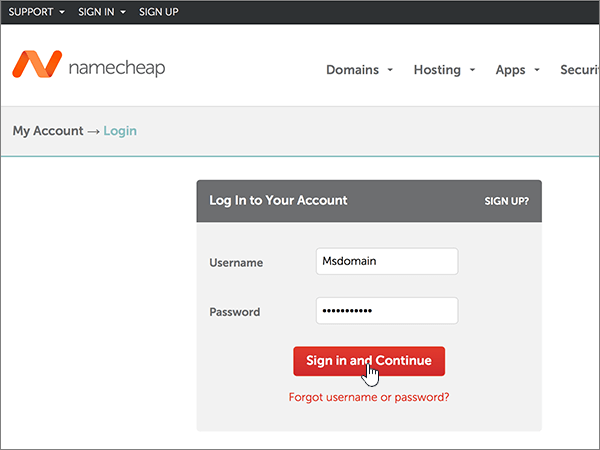
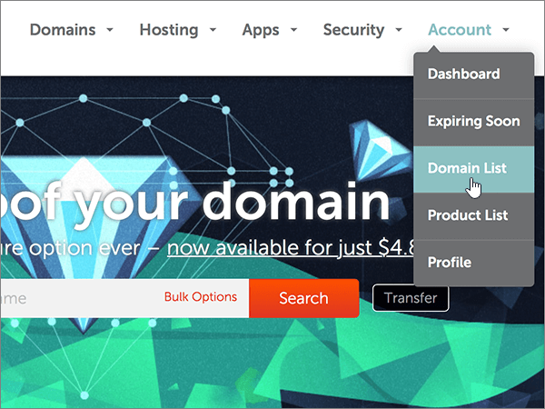

# Erstellen von DNS-Einträgen für Office 365 bei NamecheapCreate DNS records at Namecheap for Office 365

 **[Überprüfen Sie die häufig gestellten Fragen (FAQ) zu Domänen](../setup/domains-faq.md)**, wenn Sie nicht finden, wonach Sie suchen.**[Check the Domains FAQ](../setup/domains-faq.md)** if you don't find what you're looking for. 
  
[] Wenn Namecheap Ihr DNS-Hostinganbieter ist, führen Sie die in diesem Artikel aufgeführten Schritte aus, um Ihre Domäne zu überprüfen und DNS-Einträge für E-Mail, Skype for Business Online und andere Dienste einzurichten.If Namecheap is your DNS hosting provider, follow the steps in this article to verify your domain and set up DNS records for email, Skype for Business Online, and so on.
  
Nachdem Sie diese Einträge bei Namecheap hinzugefügt haben, ist Ihre Domäne für die Verwendung von Office 365-Diensten eingerichtet.After you add these records at Namecheap, your domain will be set up to work with Office 365 services.
  
> [!NOTE]
> Normalerweise dauert es ungefähr 15 Minuten, bis DNS-Änderungen wirksam werden. Es kann jedoch gelegentlich länger dauern, bis eine von Ihnen vorgenommene Änderung im Internet im DNS-System aktualisiert wurde. Wenn nach dem Hinzufügen von DNS-Einträgen Probleme mit dem E-Mail-Fluss oder andere Probleme auftreten, lesen Sie [Behandeln von Problemen nach Änderung des Domänennamens oder von DNS-Einträgen](../get-help-with-domains/find-and-fix-issues.md).Typically it takes about 15 minutes for DNS changes to take effect. However, it can occasionally take longer for a change you've made to update across the Internet's DNS system. If you're having trouble with mail flow or other issues after adding DNS records, see [Troubleshoot issues after changing your domain name or DNS records](../get-help-with-domains/find-and-fix-issues.md). 
  
## Hinzufügen eines TXT-Eintrags zur ÜberprüfungAdd a TXT record for verification

Bevor Sie Ihre Domäne in Office 365 verwenden können, müssen wir uns vergewissern, dass Sie deren Besitzer sind. Ihre Fähigkeit, sich bei Ihrem Konto bei Ihrer Domänenregistrierungsstelle anzumelden und den DNS-Eintrag zu erstellen, ist für Office 365 der Nachweis, dass Sie der Besitzer der Domäne sind.Before you use your domain with Office 365, we have to make sure that you own it. Your ability to log in to your account at your domain registrar and create the DNS record proves to Office 365 that you own the domain.
  
> [!NOTE]
> Dieser Eintrag wird nur verwendet, um zu überprüfen, ob Sie der Besitzer Ihrer Domäne sind. Er hat keine weiteren Auswirkungen. Sie können ihn später ggf. löschen.This record is used only to verify that you own your domain; it doesn't affect anything else. You can delete it later, if you like. 
  
Führen Sie die folgenden Schritte aus.Follow the steps below.
  
1. Um zu beginnen, navigieren Sie über [diesen Link](https://www.namecheap.com/myaccount/login.aspx?ReturnUrl=%2f) zu Ihrer Domänenseite bei Namecheap. Sie werden aufgefordert, sich zuerst anzumelden ("Sign in") und dann den Vorgang fortzusetzen ("Continue").To get started, go to your domains page at Namecheap by using [this link](https://www.namecheap.com/myaccount/login.aspx?ReturnUrl=%2f). You'll be prompted to Sign in and Continue.
    
    
  
2. Klicken Sie auf der **Start** Seite unter **Konto**auf **Domänenliste** in der Dropdownliste.On the **Landing** page, under **Account**, choose **Domain List** from the drop-down list. 
    
    
  
3. Suchen Sie auf der Seite **Domänenliste** den Namen der Domäne, die Sie bearbeiten möchten, und wählen Sie dann **Verwalten**aus.On the **Domain List** page, find the name of the domain that you want to edit, and then select **Manage**.
    
    
  
4. Wählen Sie **Advanced DNS**aus.Select **Advanced DNS**.
    
    
  
5. Wählen Sie im Abschnitt **Host Einträge** die Option **neuen Datensatz hinzufügen**aus.In the **HOST RECORDS** section, select **ADD NEW RECORD**.
    
    
  
6. Wählen Sie in der Dropdownliste **Type** den Eintrag **TXT Record** aus.In the **Type** drop-down, select **TXT Record**.
    
    > [!NOTE]
    > Die Dropdownliste **Typ** wird automatisch angezeigt, wenn Sie **neuen Datensatz hinzufügen**auswählen.The **Type** drop-down automatically appears when you select **ADD NEW RECORD**. 
  
    
  
7. Geben Sie in den Feldern für den neuen Eintrag die Werte aus der folgenden Tabelle ein. Sie können die Werte auch kopieren und einfügen.In the boxes for the new record, type or copy and paste the values from the following table.
    
    (Wählen Sie in der Dropdownliste den Wert **TTL** aus.)(Choose the **TTL** value from the drop-down list.) 
    
    |**Type****Type**|**Host****Host**|**Wert****Value**|**TTL****TTL**|
    |:-----|:-----|:-----|:-----|
    |TXTTXT    |@    |MS=ms *XXXXXXXX*MS=ms *XXXXXXXX*   **Hinweis:** Dies ist ein Beispiel.**Note:** This is an example. Verwenden Sie hier Ihren spezifischen Wert von **Ziel oder verweisende Adresse** aus der Tabelle in Office 365.Use your specific **Destination or Points to Address** value here, from the table in Office 365.  [Wie finde ich diese Angabe?How do I find this?](../get-help-with-domains/information-for-dns-records.md)          |30 min30 min    |
       
    
  
8. Wählen Sie das Kontrollkästchen **Änderungen speichern** (Häkchen) aus.Select the **Save Changes** (check mark) control. 
    
    
  
9. Warten Sie einige Minuten, bevor Sie fortfahren, damit der soeben erstellte Eintrag im Internet aktualisiert werden kann.Wait a few minutes before you continue, so that the record you just created can update across the Internet.
    
Nachdem Sie den Eintrag auf der Website Ihrer Domänenregistrierungsstelle hinzugefügt haben, kehren Sie zu Office 365 zurück und fordern Office 365 auf, nach dem Eintrag zu suchen.Now that you've added the record at your domain registrar's site, you'll go back to Office 365 and request Office 365 to look for the record.
  
Wenn Office 365 den richtigen TXT-Eintrag findet, wird die Domäne überprüft.When Office 365 finds the correct TXT record, your domain is verified.
  
1. Wechseln Sie im Admin Center zur Seite **Einstellungen** \> <a href="https://go.microsoft.com/fwlink/p/?linkid=834818" target="_blank">Domänen</a>.In the admin center, go to the **Settings** \> <a href="https://go.microsoft.com/fwlink/p/?linkid=834818" target="_blank">Domains</a> page.
    
2. Wählen Sie auf der Seite **Domänen** die zu überprüfende Domäne aus.On the **Domains** page, select the domain that you are verifying. 
    
    
  
3. Wählen Sie auf der Seite **Setup** die Option **Setup starten** aus.On the **Setup** page, select **Start setup**.
    
    
  
4. Wählen Sie auf der Seite **Domäne überprüfen** die Option **Überprüfen** aus.On the **Verify domain** page, select **Verify**.
    
    
  
> [!NOTE]
> Normalerweise dauert es ungefähr 15 Minuten, bis DNS-Änderungen wirksam werden. Es kann jedoch gelegentlich länger dauern, bis eine von Ihnen vorgenommene Änderung im Internet im DNS-System aktualisiert wurde. Wenn nach dem Hinzufügen von DNS-Einträgen Probleme mit dem E-Mail-Fluss oder andere Probleme auftreten, lesen Sie [Behandeln von Problemen nach Änderung des Domänennamens oder von DNS-Einträgen](../get-help-with-domains/find-and-fix-issues.md).Typically it takes about 15 minutes for DNS changes to take effect. However, it can occasionally take longer for a change you've made to update across the Internet's DNS system. If you're having trouble with mail flow or other issues after adding DNS records, see [Troubleshoot issues after changing your domain name or DNS records](../get-help-with-domains/find-and-fix-issues.md). 

  
## Hinzufügen eines MX-Eintrags, damit E-Mails für Ihre Domäne zu Office 365 geleitet werdenAdd an MX record so email for your domain will come to Office 365

Führen Sie die folgenden Schritte aus.Follow the steps below.
  
1. Um zu beginnen, navigieren Sie über [diesen Link](https://www.namecheap.com/myaccount/login.aspx?ReturnUrl=%2f) zu Ihrer Domänenseite bei Namecheap. Sie werden aufgefordert, sich zuerst anzumelden ("Sign in") und dann den Vorgang fortzusetzen ("Continue").To get started, go to your domains page at Namecheap by using [this link](https://www.namecheap.com/myaccount/login.aspx?ReturnUrl=%2f). You'll be prompted to Sign in and Continue.
    
    
  
2. Klicken Sie auf der **Start** Seite unter **Konto**auf **Domänenliste** in der Dropdownliste.On the **Landing** page, under **Account**, choose **Domain List** from the drop-down list. 
    
    
  
3. Suchen Sie auf der Seite **Domänenliste** den Namen der Domäne, die Sie bearbeiten möchten, und wählen Sie dann **Verwalten**aus.On the **Domain List** page, find the name of the domain that you want to edit, and then select **Manage**.
    
    
  
4. Wählen Sie **Advanced DNS**aus.Select **Advanced DNS**.
    
    
  
5. Wählen Sie im Abschnitt **MAIL SETTINGS** in der Dropdownliste **Email Forwarding** den Eintrag **Custom MX** aus.In the **MAIL SETTINGS** section, select **Custom MX** from the **Email Forwarding** drop-down list. 
    
    (Möglicherweise müssen Sie nach unten scrollen.)(You may have to scroll down.)
    
    
  
6. Wählen Sie **neuen Datensatz hinzufügen**aus.Select **Add New Record**.
    
    
  
7. Geben Sie in den Feldern für den neuen Eintrag die Werte aus der folgenden Tabelle ein. Sie können die Werte auch kopieren und einfügen.In the boxes for the new record, type or copy and paste the values, from the following table.
    
    (Das Feld **Priority** ist das unbenannte Feld rechts neben dem Feld **Value**.(The **Priority** box is the unnamed box to the right of the **Value** box. Wählen Sie in der Dropdownliste den Wert **TTL** aus.)Choose the **TTL** value from the drop-down list.) 
    
    |**Type****Type**|**Host****Host**|**Wert****Value**|**Priorität****Priority**|**TTL****TTL**|
    |:-----|:-----|:-----|:-----|:-----|
    |MX-EintragMX Record    |@    |\<*Domänenschlüssel*\>. Mail.Protection.Outlook.com.\<*domain-key*\>.mail.protection.outlook.com.    **Dieser Wert MUSS mit einem Punkt (.) enden.****This value MUST end with a period (.)**   **Hinweis:** Rufen Sie Ihren \* \<Domänenschlüssel\> \* aus Ihrem Office 365-Konto ab.**Note:** Get your  *\<domain-key\>*  from your Office 365 account.  [Wie finde ich diese Angabe?How do I find this?](../get-help-with-domains/information-for-dns-records.md)          |00    Weitere Informationen zur Priorität finden Sie unter [Was ist MX-Priorität?](https://support.office.com/article/2784cc4d-95be-443d-b5f7-bb5dd867ba83.aspx)For more information about priority, see [What is MX priority?](https://support.office.com/article/2784cc4d-95be-443d-b5f7-bb5dd867ba83.aspx)   |30 min30 min    |
       
    
  
8. Wählen Sie das Kontrollkästchen **Änderungen speichern** (Häkchen) aus.Select the **Save Changes** (check mark) control. 
    
    
  
9. Wenn andere MX-Einträge vorhanden sind, führen Sie die beiden folgenden Schritte aus, um diese zu entfernen:If there are any other MX records, use the following two-step process to remove each of them:
    
    Wählen Sie zuerst das **Löschsymbol** (Papierkorb) für den Datensatz aus, den Sie entfernen möchten.First, select the **Delete icon** (trash can) for the record that you want to remove. 
    
    
  
    Klicken Sie zweitens auf **Ja** , um den Löschvorgang zu bestätigen.Second, select **Yes** to confirm the deletion. 
    
    
  
    Entfernen Sie alle MX-Einträge mit Ausnahme des Eintrags, den Sie zuvor in diesem Verfahren hinzugefügt haben.Remove all MX records except for the one that you added earlier in this procedure.

  
## Hinzufügen der für Office 365 erforderlichen sechs CNAME-EinträgeAdd the six CNAME records that are required for Office 365

Führen Sie die folgenden Schritte aus.Follow the steps below.
  
1. Um zu beginnen, navigieren Sie über [diesen Link](https://www.namecheap.com/myaccount/login.aspx?ReturnUrl=%2f) zu Ihrer Domänenseite bei Namecheap. Sie werden aufgefordert, sich zuerst anzumelden ("Sign in") und dann den Vorgang fortzusetzen ("Continue").To get started, go to your domains page at Namecheap by using [this link](https://www.namecheap.com/myaccount/login.aspx?ReturnUrl=%2f). You'll be prompted to Sign in and Continue.
    
    
  
2. Klicken Sie auf der **Start** Seite unter **Konto**auf **Domänenliste** in der Dropdownliste.On the **Landing** page, under **Account**, choose **Domain List** from the drop-down list. 
    
    
  
3. Suchen Sie auf der Seite **Domänenliste** den Namen der Domäne, die Sie bearbeiten möchten, und wählen Sie dann **Verwalten**aus.On the **Domain List** page, find the name of the domain that you want to edit, and then select **Manage**.
    
    
  
4. Wählen Sie **Advanced DNS**aus.Select **Advanced DNS**.
    
    
  
5. Wählen Sie im Abschnitt **Host Einträge** die Option **neuen Datensatz hinzufügen**aus.In the **HOST RECORDS** section, select **ADD NEW RECORD**.
    
    
  
6. Wählen Sie in der Dropdownliste **Type** den Eintrag **CNAME Record** aus.In the **Type** drop-down, select **CNAME Record**.
    
    > [!NOTE]
    > Die Dropdownliste **Typ** wird automatisch angezeigt, wenn Sie **neuen Datensatz hinzufügen**auswählen.The **Type** drop-down automatically appears when you select **ADD NEW RECORD**. 
  
    
  
7. Wählen Sie in den leeren Feldern für den neuen Eintrag für **Record Type** die Option **CNAME** aus, und geben Sie dann die Werte aus der ersten Zeile in der folgenden Tabelle ein. Sie können die Werte auch kopieren und einfügen.In the empty boxes for the new record, select **CNAME** for the **Record Type**, and then type or copy and paste the values from the first row in the following table.
    
    |**Type****Type**|**Host****Host**|**Wert****Value**|**TTL****TTL**|
    |:-----|:-----|:-----|:-----|
    |CNAMECNAME    |autodiscoverautodiscover    |autodiscover.outlook.com.autodiscover.outlook.com.    **Dieser Wert MUSS mit einem Punkt (.) enden.****This value MUST end with a period (.)**   |36003600    |
    |CNAMECNAME    |sipsip    |sipdir.online.lync.com.sipdir.online.lync.com.    **Dieser Wert MUSS mit einem Punkt (.) enden.****This value MUST end with a period (.)**   |36003600    |
    |CNAMECNAME    |lyncdiscoverlyncdiscover    |webdir.online.lync.com.webdir.online.lync.com.    **Dieser Wert MUSS mit einem Punkt (.) enden.****This value MUST end with a period (.)**   |36003600    |
    |CNAMECNAME    |enterpriseregistrationenterpriseregistration    |enterpriseregistration.windows.net.enterpriseregistration.windows.net.    **Dieser Wert MUSS mit einem Punkt (.) enden.****This value MUST end with a period (.)**   |36003600    |
    |CNAMECNAME    |enterpriseenrollmententerpriseenrollment    |enterpriseenrollment-s.manage.microsoft.com.enterpriseenrollment-s.manage.microsoft.com.    **Dieser Wert MUSS mit einem Punkt (.) enden.****This value MUST end with a period (.)**   |36003600    |
       
    
  
8. Wählen Sie das Kontrollkästchen **Änderungen speichern** (Häkchen) aus.Select the **Save Changes** (check mark) control. 
    
    
  
9. Verwenden Sie die vorherigen vier Schritte und die Werte aus den anderen fünf Zeilen in der Tabelle, und fügen Sie jeden der anderen fünf CNAME-Einträge hinzu.Using the preceding four steps and the values from the other five rows in the table, add each of the other five CNAME records.

  
## Hinzufügen eines TXT-Eintrags für SPF, um E-Mail-Spam zu verhindernAdd a TXT record for SPF to help prevent email spam

> [!IMPORTANT]
> You cannot have more than one TXT record for SPF for a domain.You cannot have more than one TXT record for SPF for a domain. If your domain has more than one SPF record, you'll get email errors, as well as delivery and spam classification issues.If your domain has more than one SPF record, you'll get email errors, as well as delivery and spam classification issues. If you already have an SPF record for your domain, don't create a new one for Office 365.If you already have an SPF record for your domain, don't create a new one for Office 365. Damit verfügen Sie über einen  *einzigen*  SPF-Eintrag, in dem beide Wertemengen enthalten sind.Instead, add the required Office 365 values to the current record so that you have a  *single*  SPF record that includes both sets of values. 

Führen Sie die folgenden Schritte aus.Follow the steps below.
  
1. Um zu beginnen, navigieren Sie über [diesen Link](https://www.namecheap.com/myaccount/login.aspx?ReturnUrl=%2f) zu Ihrer Domänenseite bei Namecheap. Sie werden aufgefordert, sich zuerst anzumelden ("Sign in") und dann den Vorgang fortzusetzen ("Continue").To get started, go to your domains page at Namecheap by using [this link](https://www.namecheap.com/myaccount/login.aspx?ReturnUrl=%2f). You'll be prompted to Sign in and Continue.
    
2. Klicken Sie auf der **Start** Seite unter **Konto**auf **Domänenliste** in der Dropdownliste.On the **Landing** page, under **Account**, choose **Domain List** from the drop-down list. 
    
    
  
3. Suchen Sie auf der Seite **Domänenliste** den Namen der Domäne, die Sie bearbeiten möchten, und wählen Sie dann **Verwalten**aus.On the **Domain List** page, find the name of the domain that you want to edit and then select **Manage**.
    
    
  
4. Wählen Sie **Advanced DNS**aus.Select **Advanced DNS**.
    
    
  
5. Wählen Sie im Abschnitt **Host Einträge** die Option **neuen Datensatz hinzufügen**aus.In the **HOST RECORDS** section, select **ADD NEW RECORD**.
    
    
  
6. Wählen Sie in der Dropdownliste **Type** den Eintrag **TXT Record** aus.In the **Type** drop-down, select **TXT Record**.
    
    > [!NOTE]
    > Die Dropdownliste **Typ** wird automatisch angezeigt, wenn Sie **neuen Datensatz hinzufügen**auswählen.The **Type** drop-down automatically appears when you select **ADD NEW RECORD**. 
  
    
  
7. Geben Sie in den Feldern für den neuen Eintrag die Werte aus der folgenden Tabelle ein. Sie können die Werte auch kopieren und einfügen.In the boxes for the new record, type or copy and paste the following values from the following table.
    
    (Wählen Sie in der Dropdownliste den Wert **TTL** aus.)(Choose the **TTL** value from the drop-down list.) 
    
    |**Type****Type**|**Host****Host**|**Wert****Value**|**TTL****TTL**|
    |:-----|:-----|:-----|:-----|
    |TXTTXT    |@    |v=spf1 include:spf.protection.outlook.com -allv=spf1 include:spf.protection.outlook.com -all    **Hinweis:** Es wird empfohlen, diesen Eintrag zu kopieren und einzufügen, damit alle Abstände korrekt übernommen werden.**Note:** We recommend copying and pasting this entry, so that all of the spacing stays correct.           |30 min30 min    |
       
    
  
8. Wählen Sie das Kontrollkästchen **Änderungen speichern** (Häkchen) aus.Select the **Save Changes** (check mark) control. 
    
    
  
## Hinzufügen der für Office 365 erforderlichen zwei SRV-EinträgeAdd the two SRV records that are required for Office 365

1. Um zu beginnen, navigieren Sie über [diesen Link](https://www.namecheap.com/myaccount/login.aspx?ReturnUrl=%2f) zu Ihrer Domänenseite bei Namecheap. Sie werden aufgefordert, sich zuerst anzumelden ("Sign in").To get started, go to your domains page at Namecheap by using [this link](https://www.namecheap.com/myaccount/login.aspx?ReturnUrl=%2f). You'll be prompted to sign in.
    
    
  
2. Klicken Sie auf der **Start** Seite unter **Konto**auf **Domänenliste** in der Dropdownliste.On the **Landing** page, under **Account**, choose **Domain List** from the drop-down list. 
    
    
  
3. Suchen Sie auf der Seite **Domänenliste** den Namen der Domäne, die Sie bearbeiten möchten, und wählen Sie dann **Verwalten**aus.On the **Domain List** page, find the name of the domain that you want to edit and then select **Manage**.
    
    
  
4. Wählen Sie **Advanced DNS**aus.Select **Advanced DNS**.
    
    
  
5. Wählen Sie im Abschnitt **Host Einträge** die Option **neuen Datensatz hinzufügen**aus.In the **HOST RECORDS** section, select **ADD NEW RECORD**.
    
    
  
6. Wählen Sie in der Dropdownliste **Type** den Eintrag **SRV Record** aus.In the **Type** drop-down, select **SRV Record**.
    
    > [!NOTE]
    > Die Dropdownliste **Typ** wird automatisch angezeigt, wenn Sie **neuen Datensatz hinzufügen**auswählen.The **Type** drop-down automatically appears when you select **ADD NEW RECORD**. 
  
    
  
7. Geben Sie in den leeren Feldern für die neuen Einträge die Werte aus der ersten Zeile der folgenden Tabelle ein. Sie können die Werte auch kopieren und einfügen.In the empty boxes for the new records, type or copy and paste the values from the first row in the following table.
    
    |**Service****Service**|**Protocol****Protocol**|**Priority****Priority**|**Weight****Weight**|**Port****Port**|**Target****Target**|**TTL****TTL**|
    |:-----|:-----|:-----|:-----|:-----|:-----|:-----|
    |_sip_sip    |_tls_tls    |100100    |11    |443443    |sipdir.online.lync.com.sipdir.online.lync.com.    **Dieser Wert MUSS mit einem Punkt (.) enden.****This value MUST end with a period (.)**   |30 min30 min    |
    |_sipfederationtls_sipfederationtls    |_tcp_tcp    |100100    |11    |50615061    |sipfed.online.lync.com.sipfed.online.lync.com.    **Dieser Wert MUSS mit einem Punkt (.) enden.****This value MUST end with a period (.)**   |30 min30 min    |
       
    
  
8. Wählen Sie das Kontrollkästchen **Änderungen speichern** (Häkchen) aus.Select the **Save Changes** (check mark) control. 
    
    
  
9. Fügen Sie den anderen SRV-Eintrag hinzu, indem Sie die vier vorherigen Schritte unter Verwendung der Werte aus der zweiten Zeile in der Tabelle ausführen.Using the preceding four steps and the values from the second row in the table, add the other SRV record.
    
> [!NOTE]
> Normalerweise dauert es ungefähr 15 Minuten, bis DNS-Änderungen wirksam werden. Es kann jedoch gelegentlich länger dauern, bis eine von Ihnen vorgenommene Änderung im Internet im DNS-System aktualisiert wurde. Wenn nach dem Hinzufügen von DNS-Einträgen Probleme mit dem E-Mail-Fluss oder andere Probleme auftreten, lesen Sie [Behandeln von Problemen nach Änderung des Domänennamens oder von DNS-Einträgen](../get-help-with-domains/find-and-fix-issues.md).Typically it takes about 15 minutes for DNS changes to take effect. However, it can occasionally take longer for a change you've made to update across the Internet's DNS system. If you're having trouble with mail flow or other issues after adding DNS records, see [Troubleshoot issues after changing your domain name or DNS records](../get-help-with-domains/find-and-fix-issues.md). 
  

  
