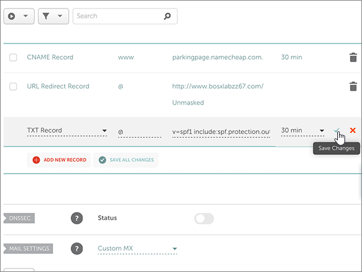

# Erstellen von DNS-Einträgen bei Namecheap für Microsoft

 **[Überprüfen Sie die häufig gestellten Fragen (FAQ) zu Domänen](../setup/domains-faq.md)**, wenn Sie nicht finden, wonach Sie suchen. 
  
[] Wenn Namecheap Ihr DNS-Hostinganbieter ist, führen Sie die in diesem Artikel aufgeführten Schritte aus, um Ihre Domäne zu überprüfen und DNS-Einträge für E-Mail, Skype for Business Online und andere Dienste einzurichten.
  
Nachdem Sie diese Einträge bei Namecheap hinzugefügt haben, ist Ihre Domäne für die Verwendung mit Microsoft-Diensten eingerichtet.
  
> [!NOTE]
> Normalerweise dauert es ungefähr 15 Minuten, bis DNS-Änderungen wirksam werden. Es kann jedoch gelegentlich länger dauern, bis eine von Ihnen vorgenommene Änderung im Internet im DNS-System aktualisiert wurde. Wenn nach dem Hinzufügen von DNS-Einträgen Probleme mit dem E-Mail-Fluss oder andere Probleme auftreten, lesen Sie [Behandeln von Problemen nach Änderung des Domänennamens oder von DNS-Einträgen](../get-help-with-domains/find-and-fix-issues.md). 
  
## Hinzufügen eines TXT-Eintrags zur Überprüfung

Bevor Sie Ihre Domäne mit Microsoft verwenden können, müssen wir uns vergewissern, dass Sie deren Besitzer sind. Ihre Fähigkeit, sich bei Ihrem Konto bei Ihrer Domänenregistrierungsstelle anzumelden und den DNS-Eintrag zu erstellen, ist für Microsoft der Nachweis, dass Sie der Besitzer der Domäne sind.
  
> [!NOTE]
> Dieser Eintrag wird nur verwendet, um zu überprüfen, ob Sie der Besitzer Ihrer Domäne sind. Er hat keine weiteren Auswirkungen. Sie können ihn später ggf. löschen. 
  
Führen Sie die folgenden Schritte aus.
  
1. Um zu beginnen, navigieren Sie über [diesen Link](https://www.namecheap.com/myaccount/login.aspx?ReturnUrl=%2f) zu Ihrer Domänenseite bei Namecheap. Sie werden aufgefordert, sich zuerst anzumelden ("Sign in") und dann den Vorgang fortzusetzen ("Continue").
    
    
  
2. Klicken Sie auf der **Start** Seite unter **Konto**auf **Domänenliste** in der Dropdownliste. 
    
    
  
3. Suchen Sie auf der Seite **Domänenliste** den Namen der Domäne, die Sie bearbeiten möchten, und wählen Sie dann **Verwalten**aus.
    
    
  
4. Wählen Sie **Advanced DNS**aus.
    
    
  
5. Wählen Sie im Abschnitt **Host Einträge** die Option **neuen Datensatz hinzufügen**aus.
    
    
  
6. Wählen Sie in der Dropdownliste **Type** den Eintrag **TXT Record** aus.
    
    > [!NOTE]
    > Die Dropdownliste **Typ** wird automatisch angezeigt, wenn Sie **neuen Datensatz hinzufügen**auswählen. 
  
    
  
7. Geben Sie in den Feldern für den neuen Eintrag die Werte aus der folgenden Tabelle ein. Sie können die Werte auch kopieren und einfügen.
    
    (Wählen Sie in der Dropdownliste den Wert **TTL** aus.) 
    
    |**Type**|**Host**|**Wert**|**TTL**|
    |:-----|:-----|:-----|:-----|
    |TXT    |@    |MS=ms *XXXXXXXX*   **Hinweis:** Dies ist ein Beispiel. Verwenden Sie hier Ihre spezifischen **Ziel-oder Punkt-zu-Adresse** -Werte aus der Tabelle.  [Wie finde ich diese Angabe?](../get-help-with-domains/information-for-dns-records.md)          |30 min    |
       
    
  
8. Wählen Sie das Kontrollkästchen **Änderungen speichern** (Häkchen) aus. 
    
    
  
9. Warten Sie einige Minuten, bevor Sie fortfahren, damit der soeben erstellte Eintrag im Internet aktualisiert werden kann.
    
Nachdem Sie den Eintrag auf der Website Ihrer Domänenregistrierungsstelle hinzugefügt haben, kehren Sie zu Microsoft zurück und fordern Sie den Eintrag an.
  
Wenn Microsoft den richtigen TXT-Eintrag findet, ist die Domäne überprüft.
  
1. Wechseln Sie im Admin Center zur Seite **Einstellungen** \> <a href="https://go.microsoft.com/fwlink/p/?linkid=834818" target="_blank">Domänen</a>.
    
2. Wählen Sie auf der Seite **Domänen** die zu überprüfende Domäne aus. 
    
    
  
3. Wählen Sie auf der Seite **Setup** die Option **Setup starten** aus.
    
    
  
4. Wählen Sie auf der Seite **Domäne überprüfen** die Option **Überprüfen** aus.
    
    
  
> [!NOTE]
> Normalerweise dauert es ungefähr 15 Minuten, bis DNS-Änderungen wirksam werden. Es kann jedoch gelegentlich länger dauern, bis eine von Ihnen vorgenommene Änderung im Internet im DNS-System aktualisiert wurde. Wenn nach dem Hinzufügen von DNS-Einträgen Probleme mit dem E-Mail-Fluss oder andere Probleme auftreten, lesen Sie [Behandeln von Problemen nach Änderung des Domänennamens oder von DNS-Einträgen](../get-help-with-domains/find-and-fix-issues.md). 

  
## Fügen Sie einen MX-Eintrag hinzu, damit E-Mails für Ihre Domäne an Microsoft geleitet werden.

Führen Sie die folgenden Schritte aus.
  
1. Um zu beginnen, navigieren Sie über [diesen Link](https://www.namecheap.com/myaccount/login.aspx?ReturnUrl=%2f) zu Ihrer Domänenseite bei Namecheap. Sie werden aufgefordert, sich zuerst anzumelden ("Sign in") und dann den Vorgang fortzusetzen ("Continue").
    
    
  
2. Klicken Sie auf der **Start** Seite unter **Konto**auf **Domänenliste** in der Dropdownliste. 
    
    
  
3. Suchen Sie auf der Seite **Domänenliste** den Namen der Domäne, die Sie bearbeiten möchten, und wählen Sie dann **Verwalten**aus.
    
    
  
4. Wählen Sie **Advanced DNS**aus.
    
    
  
5. Wählen Sie im Abschnitt **MAIL SETTINGS** in der Dropdownliste **Email Forwarding** den Eintrag **Custom MX** aus. 
    
    (Möglicherweise müssen Sie nach unten scrollen.)
    
    
  
6. Wählen Sie **neuen Datensatz hinzufügen**aus.
    
    
  
7. Geben Sie in den Feldern für den neuen Eintrag die Werte aus der folgenden Tabelle ein. Sie können die Werte auch kopieren und einfügen.
    
    (Das Feld **Priority** ist das unbenannte Feld rechts neben dem Feld **Value**. Wählen Sie in der Dropdownliste den Wert **TTL** aus.) 
    
    |**Type**|**Host**|**Value**|**Priorität**|**TTL**|
    |:-----|:-----|:-----|:-----|:-----|
    |MX-Eintrag    |@    |\<*domain-key*\>. Mail.Protection.Outlook.com.    **Dieser Wert MUSS mit einem Punkt (.) enden.**   **Hinweis:** Holen Sie sich Ihr  *\<domain-key\>*  Microsoft-Konto.  [Wie finde ich diese Angabe?](../get-help-with-domains/information-for-dns-records.md)          |0    Weitere Informationen zur Priorität finden Sie unter [Was ist MX-Priorität?](https://docs.microsoft.com/microsoft-365/admin/setup/domains-faq)   |30 min    |
       
    
  
8. Wählen Sie das Kontrollkästchen **Änderungen speichern** (Häkchen) aus. 
    
    
  
9. Wenn andere MX-Einträge vorhanden sind, führen Sie die beiden folgenden Schritte aus, um diese zu entfernen:
    
    Wählen Sie zuerst das **Löschsymbol** (Papierkorb) für den Datensatz aus, den Sie entfernen möchten. 
    
    
  
    Klicken Sie zweitens auf **Ja** , um den Löschvorgang zu bestätigen. 
    
    
  
    Entfernen Sie alle MX-Einträge mit Ausnahme des Eintrags, den Sie zuvor in diesem Verfahren hinzugefügt haben.

  
## Hinzufügen der sechs CNAME-Einträge, die für Microsoft erforderlich sind

Führen Sie die folgenden Schritte aus.
  
1. Um zu beginnen, navigieren Sie über [diesen Link](https://www.namecheap.com/myaccount/login.aspx?ReturnUrl=%2f) zu Ihrer Domänenseite bei Namecheap. Sie werden aufgefordert, sich zuerst anzumelden ("Sign in") und dann den Vorgang fortzusetzen ("Continue").
    
    
  
2. Klicken Sie auf der **Start** Seite unter **Konto**auf **Domänenliste** in der Dropdownliste. 
    
    
  
3. Suchen Sie auf der Seite **Domänenliste** den Namen der Domäne, die Sie bearbeiten möchten, und wählen Sie dann **Verwalten**aus.
    
    
  
4. Wählen Sie **Advanced DNS**aus.
    
    
  
5. Wählen Sie im Abschnitt **Host Einträge** die Option **neuen Datensatz hinzufügen**aus.
    
    
  
6. Wählen Sie in der Dropdownliste **Type** den Eintrag **CNAME Record** aus.
    
    > [!NOTE]
    > Die Dropdownliste **Typ** wird automatisch angezeigt, wenn Sie **neuen Datensatz hinzufügen**auswählen. 
  
    
  
7. Wählen Sie in den leeren Feldern für den neuen Eintrag für **Record Type** die Option **CNAME** aus, und geben Sie dann die Werte aus der ersten Zeile in der folgenden Tabelle ein. Sie können die Werte auch kopieren und einfügen.
    
    |**Type**|**Host**|**Wert**|**TTL**|
    |:-----|:-----|:-----|:-----|
    |CNAME    |autodiscover    |autodiscover.outlook.com.    **Dieser Wert MUSS mit einem Punkt (.) enden.**   |3600    |
    |CNAME    |sip    |sipdir.online.lync.com.    **Dieser Wert MUSS mit einem Punkt (.) enden.**   |3600    |
    |CNAME    |lyncdiscover    |webdir.online.lync.com.    **Dieser Wert MUSS mit einem Punkt (.) enden.**   |3600    |
    |CNAME    |enterpriseregistration    |enterpriseregistration.windows.net.    **Dieser Wert MUSS mit einem Punkt (.) enden.**   |3600    |
    |CNAME    |enterpriseenrollment    |enterpriseenrollment-s.manage.microsoft.com.    **Dieser Wert MUSS mit einem Punkt (.) enden.**   |3600    |
       
    
  
8. Wählen Sie das Kontrollkästchen **Änderungen speichern** (Häkchen) aus. 
    
    
  
9. Verwenden Sie die vorherigen vier Schritte und die Werte aus den anderen fünf Zeilen in der Tabelle, und fügen Sie jeden der anderen fünf CNAME-Einträge hinzu.

  
## Hinzufügen eines TXT-Eintrags für SPF, um E-Mail-Spam zu verhindern

> [!IMPORTANT]
> Es kann bei einer Domäne nur einen TXT-Eintrag für SPF geben. Wenn es bei Ihrer Domäne mehrere SPF-Einträge gibt, treten E-Mail-Fehler sowie Probleme bei der Übermittlung und Spamklassifizierung auf. Wenn es für Ihre Domäne bereits einen SPF-Eintrag gibt, erstellen Sie für Microsoft keinen neuen, Fügen Sie stattdessen die erforderlichen Microsoft-Werte zum aktuellen Datensatz hinzu, sodass Sie einen  *einzelnen*  SPF-Eintrag haben, der beide Wertegruppen enthält. 

Führen Sie die folgenden Schritte aus.
  
1. Um zu beginnen, navigieren Sie über [diesen Link](https://www.namecheap.com/myaccount/login.aspx?ReturnUrl=%2f) zu Ihrer Domänenseite bei Namecheap. Sie werden aufgefordert, sich zuerst anzumelden ("Sign in") und dann den Vorgang fortzusetzen ("Continue").
    
2. Klicken Sie auf der **Start** Seite unter **Konto**auf **Domänenliste** in der Dropdownliste. 
    
    
  
3. Suchen Sie auf der Seite **Domänenliste** den Namen der Domäne, die Sie bearbeiten möchten, und wählen Sie dann **Verwalten**aus.
    
    
  
4. Wählen Sie **Advanced DNS**aus.
    
    
  
5. Wählen Sie im Abschnitt **Host Einträge** die Option **neuen Datensatz hinzufügen**aus.
    
    
  
6. Wählen Sie in der Dropdownliste **Type** den Eintrag **TXT Record** aus.
    
    > [!NOTE]
    > Die Dropdownliste **Typ** wird automatisch angezeigt, wenn Sie **neuen Datensatz hinzufügen**auswählen. 
  
    
  
7. Geben Sie in den Feldern für den neuen Eintrag die Werte aus der folgenden Tabelle ein. Sie können die Werte auch kopieren und einfügen.
    
    (Wählen Sie in der Dropdownliste den Wert **TTL** aus.) 
    
    |**Type**|**Host**|**Wert**|**TTL**|
    |:-----|:-----|:-----|:-----|
    |TXT    |@    |v=spf1 include:spf.protection.outlook.com -all    **Hinweis:** Es wird empfohlen, diesen Eintrag zu kopieren und einzufügen, damit alle Abstände korrekt übernommen werden.           |30 min    |
       
    
  
8. Wählen Sie das Kontrollkästchen **Änderungen speichern** (Häkchen) aus. 
    
    
  
## Hinzufügen der für Microsoft erforderlichen zwei SRV-Einträge

1. Um zu beginnen, navigieren Sie über [diesen Link](https://www.namecheap.com/myaccount/login.aspx?ReturnUrl=%2f) zu Ihrer Domänenseite bei Namecheap. Sie werden aufgefordert, sich zuerst anzumelden ("Sign in").
    
    
  
2. Klicken Sie auf der **Start** Seite unter **Konto**auf **Domänenliste** in der Dropdownliste. 
    
    
  
3. Suchen Sie auf der Seite **Domänenliste** den Namen der Domäne, die Sie bearbeiten möchten, und wählen Sie dann **Verwalten**aus.
    
    
  
4. Wählen Sie **Advanced DNS**aus.
    
    
  
5. Wählen Sie im Abschnitt **Host Einträge** die Option **neuen Datensatz hinzufügen**aus.
    
    
  
6. Wählen Sie in der Dropdownliste **Type** den Eintrag **SRV Record** aus.
    
    > [!NOTE]
    > Die Dropdownliste **Typ** wird automatisch angezeigt, wenn Sie **neuen Datensatz hinzufügen**auswählen. 
  
    
  
7. Geben Sie in den leeren Feldern für die neuen Einträge die Werte aus der ersten Zeile der folgenden Tabelle ein. Sie können die Werte auch kopieren und einfügen.
    
    |**Service**|**Protocol**|**Priority**|**Weight**|**Port**|**Target**|**TTL**|
    |:-----|:-----|:-----|:-----|:-----|:-----|:-----|
    |_sip    |_tls    |100    |1    |443    |sipdir.online.lync.com.    **Dieser Wert MUSS mit einem Punkt (.) enden.**   |30 min    |
    |_sipfederationtls    |_tcp    |100    |1    |5061    |sipfed.online.lync.com.    **Dieser Wert MUSS mit einem Punkt (.) enden.**   |30 min    |
       
    
  
8. Wählen Sie das Kontrollkästchen **Änderungen speichern** (Häkchen) aus. 
    
    
  
9. Fügen Sie den anderen SRV-Eintrag hinzu, indem Sie die vier vorherigen Schritte unter Verwendung der Werte aus der zweiten Zeile in der Tabelle ausführen.
    
> [!NOTE]
> Normalerweise dauert es ungefähr 15 Minuten, bis DNS-Änderungen wirksam werden. Es kann jedoch gelegentlich länger dauern, bis eine von Ihnen vorgenommene Änderung im Internet im DNS-System aktualisiert wurde. Wenn nach dem Hinzufügen von DNS-Einträgen Probleme mit dem E-Mail-Fluss oder andere Probleme auftreten, lesen Sie [Behandeln von Problemen nach Änderung des Domänennamens oder von DNS-Einträgen](../get-help-with-domains/find-and-fix-issues.md). 
  

  
