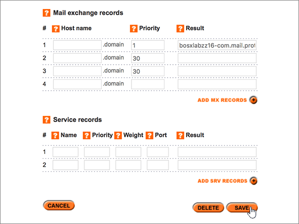
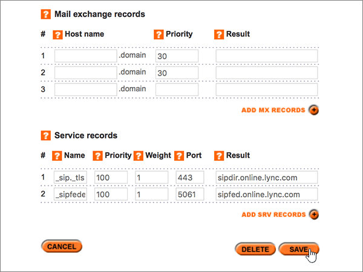

# Erstellen von DNS-Einträgen bei Names.co.uk für MicrosoftCreate DNS records at Names.co.uk for Microsoft

 **[Überprüfen Sie die häufig gestellten Fragen (FAQ) zu Domänen](../setup/domains-faq.md)**, wenn Sie nicht finden, wonach Sie suchen.**[Check the Domains FAQ](../setup/domains-faq.md)** if you don't find what you're looking for. 
  
Wenn Names.co.uk Ihr DNS-Hostinganbieter ist, führen Sie die in diesem Artikel aufgeführten Schritte aus, um Ihre Domäne zu überprüfen und DNS-Einträge für E-Mail, Skype for Business Online und andere Dienste einzurichten.If Names.co.uk is your DNS hosting provider, follow the steps in this article to verify your domain and set up DNS records for email, Skype for Business Online, and so on.
    
Nachdem Sie diese Einträge bei Names.co.uk hinzugefügt haben, ist Ihre Domäne für die Verwendung mit Microsoft-Diensten eingerichtet.After you add these records at Names.co.uk, your domain will be set up to work with Microsoft services.
  
Informationen über Webhosting und DNS für Websites mit Microsoft finden Sie unter [Verwenden einer öffentlichen Website mit Microsoft](https://support.office.com/article/choose-a-public-website-3325d50e-d131-403c-a278-7f3296fe33a9).To learn about webhosting and DNS for websites with Microsoft, see [Use a public website with Microsoft](https://support.office.com/article/choose-a-public-website-3325d50e-d131-403c-a278-7f3296fe33a9).
  
> [!NOTE]
>  Normalerweise dauert es ungefähr 15 Minuten, bis DNS-Änderungen wirksam werden. Es kann jedoch gelegentlich länger dauern, bis eine von Ihnen vorgenommene Änderung im Internet im DNS-System aktualisiert wurde. Wenn nach dem Hinzufügen von DNS-Einträgen Probleme mit dem E-Mail-Fluss oder andere Probleme auftreten, lesen Sie [Behandeln von Problemen nach Änderung des Domänennamens oder von DNS-Einträgen](../get-help-with-domains/find-and-fix-issues.md).Typically it takes about 15 minutes for DNS changes to take effect. However, it can occasionally take longer for a change you've made to update across the Internet's DNS system. If you're having trouble with mail flow or other issues after adding DNS records, see [Troubleshoot issues after changing your domain name or DNS records](../get-help-with-domains/find-and-fix-issues.md). 
  
## Hinzufügen eines TXT-Eintrags zur ÜberprüfungAdd a TXT record for verification

Bevor Sie Ihre Domäne mit Microsoft verwenden, müssen wir sicherstellen, dass Sie Sie besitzen.Before you use your domain with Microsoft, we have to make sure that you own it. Ihre Fähigkeit, sich bei Ihrem Konto bei Ihrer Domänenregistrierungsstelle anzumelden und den DNS-Eintrag zu erstellen, beweist Microsoft, dass Sie die Domäne besitzen.Your ability to log in to your account at your domain registrar and create the DNS record proves to Microsoft that you own the domain.
  
> [!NOTE]
> Dieser Eintrag wird nur verwendet, um zu überprüfen, ob Sie der Besitzer Ihrer Domäne sind. Er hat keine weiteren Auswirkungen. Sie können ihn später ggf. löschen.This record is used only to verify that you own your domain; it doesn't affect anything else. You can delete it later, if you like. 
  
1. Um zu beginnen, navigieren Sie über [diesen Link](https://account.names.co.uk/dashboard#/) zu Ihrer Domänenseite bei Names.co.uk. Sie werden aufgefordert, sich zuerst anzumelden.To get started, go to your domains page at Names.co.uk by using [this link](https://account.names.co.uk/dashboard#/). You'll be prompted to log in first.
    
    
  
2. On the **Dashboard** page, find the name of the domain that you are updating, and then choose **DNS Settings** from the drop-down list.On the **Dashboard** page, find the name of the domain that you are updating, and then choose **DNS Settings** from the drop-down list. 
    
    (You may have to scroll down.)(You may have to scroll down.)
    
    
  
3. On the **Add/Modify DNS Zone** page, in the **A, CNAME, AAAA, TXT and NS records** section, in the boxes for the new record, type or copy and paste the values from the following table.On the **Add/Modify DNS Zone** page, in the **A, CNAME, AAAA, TXT and NS records** section, in the boxes for the new record, type or copy and paste the values from the following table. 
    
    (Choose the **Type** value from the drop-down list.)(Choose the **Type** value from the drop-down list.) 
    
    (Wenn Sie eine Zeile hinzufügen möchten, wählen Sie **Add a/CNAME Records (+)** aus.)(If you need to add a row, select **ADD A/CNAME RECORDS (+)**.)
    
    (Möglicherweise müssen Sie nach unten scrollen.)(You may have to scroll down.)
        
    |**Hostname****Host name**|**Type****Type**|**Ergebnis****Result**|
    |:-----|:-----|:-----|
    |(Leave this field empty.)(Leave this field empty.)    |TXTTXT    |MS=ms *XXXXXXXX*MS=ms *XXXXXXXX*    **Hinweis:** Dies ist ein Beispiel.**Note:** This is an example. Verwenden Sie hier Ihre spezifischen **Ziel-oder Punkt-zu-Adresse** -Werte aus der Tabelle.Use your specific **Destination or Points to Address** value here, from the table.           [Wie finde ich diese Angabe?How do I find this?](../get-help-with-domains/information-for-dns-records.md)    |
       
    
  
4. Klicken Sie auf **Speichern**.Select **Save**.
    
    (Möglicherweise müssen Sie nach unten scrollen.)(You may have to scroll down.)
    
    
  
5. Warten Sie einige Minuten, bevor Sie fortfahren, damit der soeben erstellte Eintrag im Internet aktualisiert werden kann.Wait a few minutes before you continue, so that the record you just created can update across the Internet.
    
Nachdem Sie den Eintrag auf der Website Ihrer Domänenregistrierungsstelle hinzugefügt haben, kehren Sie zu Microsoft zurück und fordern den Eintrag an.Now that you've added the record at your domain registrar's site, you'll go back to Microsoft and request the record.
  
Wenn Microsoft den richtigen TXT-Eintrag findet, wird Ihre Domäne überprüft.When Microsoft finds the correct TXT record, your domain is verified.
  
1. Wechseln Sie im Admin Center zur Seite **Einstellungen** \> <a href="https://go.microsoft.com/fwlink/p/?linkid=834818" target="_blank">Domänen</a>.In the admin center, go to the **Settings** \> <a href="https://go.microsoft.com/fwlink/p/?linkid=834818" target="_blank">Domains</a> page.
    
2. Wählen Sie auf der Seite **Domänen** die zu überprüfende Domäne aus.On the **Domains** page, select the domain that you are verifying. 
    
    
  
3. Wählen Sie auf der Seite **Setup** die Option **Setup starten** aus.On the **Setup** page, select **Start setup**.
    
    
  
4. Wählen Sie auf der Seite **Domäne überprüfen** die Option **Überprüfen** aus.On the **Verify domain** page, select **Verify**.
    
    
  
> [!NOTE]
>  Normalerweise dauert es ungefähr 15 Minuten, bis DNS-Änderungen wirksam werden. Es kann jedoch gelegentlich länger dauern, bis eine von Ihnen vorgenommene Änderung im Internet im DNS-System aktualisiert wurde. Wenn nach dem Hinzufügen von DNS-Einträgen Probleme mit dem E-Mail-Fluss oder andere Probleme auftreten, lesen Sie [Behandeln von Problemen nach Änderung des Domänennamens oder von DNS-Einträgen](../get-help-with-domains/find-and-fix-issues.md).Typically it takes about 15 minutes for DNS changes to take effect. However, it can occasionally take longer for a change you've made to update across the Internet's DNS system. If you're having trouble with mail flow or other issues after adding DNS records, see [Troubleshoot issues after changing your domain name or DNS records](../get-help-with-domains/find-and-fix-issues.md). 
  
## Hinzufügen eines MX-Eintrags, damit e-Mails für Ihre Domäne an Microsoft gelangenAdd an MX record so email for your domain will come to Microsoft

1. Um zu beginnen, navigieren Sie über [diesen Link](https://account.names.co.uk/dashboard#/) zu Ihrer Domänenseite bei Names.co.uk. Sie werden aufgefordert, sich zuerst anzumelden.To get started, go to your domains page at Names.co.uk by using [this link](https://account.names.co.uk/dashboard#/). You'll be prompted to log in first.
    
    
  
2. On the **Dashboard** page, find the name of the domain that you are updating, and then choose **DNS Settings** from the drop-down list.On the **Dashboard** page, find the name of the domain that you are updating, and then choose **DNS Settings** from the drop-down list. 
    
    (You may have to scroll down.)(You may have to scroll down.)
    
    
  
3. Geben Sie auf der Seite **Add/Modify DNS Zone** im Abschnitt **Mail exchange records** in den Feldern für den neuen Eintrag die Werte aus der nachstehenden Tabelle manuell ein, oder kopieren Sie die Werte, und fügen Sie sie ein.On the **Add/Modify DNS Zone** page, in the **Mail exchange records** section, in the boxes for the new record, type or copy and paste the values from the following table. 
    
    (Möglicherweise müssen Sie nach unten scrollen.)(You may have to scroll down.)
    
    |**Hostname****Host name**|**Priority****Priority**|**Ergebnis****Result**|
    |:-----|:-----|:-----|
    |(Dieses Feld leer lassen.)(Leave this field empty.)    |11    Weitere Informationen zur Priorität finden Sie unter [Was ist MX-Priorität?](https://support.office.com/article/2784cc4d-95be-443d-b5f7-bb5dd867ba83.aspx)For more information about priority, see [What is MX priority?](https://support.office.com/article/2784cc4d-95be-443d-b5f7-bb5dd867ba83.aspx)   | *\<Domänenschlüssel\>*  .mail.protection.outlook.com*\<domain-key\>*  .mail.protection.outlook.com    > [!NOTE]> Ihren \* \<Domänenschlüssel\> \* von Ihrem Microsoft-Konto abrufen.> [!NOTE]> Get your  *\<domain-key\>*  from your Microsoft account.           [Wie finde ich diese Angabe?How do I find this?](../get-help-with-domains/information-for-dns-records.md)          |
       
    
  
4. Klicken Sie auf **Speichern**.Select **Save**.
    
    (Möglicherweise müssen Sie nach unten scrollen.)(You may have to scroll down.)
    
    
  
5. If there are any other MX records listed in the **Mail exchange records** section, delete each one by selecting it and then pressing the **Delete** key on your keyboard.If there are any other MX records listed in the **Mail exchange records** section, delete each one by selecting it and then pressing the **Delete** key on your keyboard. 
    
    
  
6. Klicken Sie auf **Speichern**.Select **Save**.
    
    (Möglicherweise müssen Sie nach unten scrollen.)(You may have to scroll down.)
    
    
  
## Hinzufügen der sechs CNAME-Einträge, die für Microsoft erforderlich sindAdd the six CNAME records that are required for Microsoft

1. Um zu beginnen, navigieren Sie über [diesen Link](https://account.names.co.uk/dashboard#/) zu Ihrer Domänenseite bei Names.co.uk. Sie werden aufgefordert, sich zuerst anzumelden.To get started, go to your domains page at Names.co.uk by using [this link](https://account.names.co.uk/dashboard#/). You'll be prompted to log in first.
    
    
  
2. On the **Dashboard** page, find the name of the domain that you are updating, and then choose **DNS Settings** from the drop-down list.On the **Dashboard** page, find the name of the domain that you are updating, and then choose **DNS Settings** from the drop-down list. 
    
    (You may have to scroll down.)(You may have to scroll down.)
    
    
  
3. On the **Add/Modify DNS Zone** page, in the **A, CNAME, AAAA, TXT and NS records** section, in the boxes for the new record, type or copy and paste the values from the following table.On the **Add/Modify DNS Zone** page, in the **A, CNAME, AAAA, TXT and NS records** section, in the boxes for the new record, type or copy and paste the values from the following table. 
    
    (Choose the **Type** value from the drop-down list.)(Choose the **Type** value from the drop-down list.) 
    
    (Wenn Sie eine Zeile hinzufügen möchten, wählen Sie **Add a/CNAME Records (+)** aus.)(If you need to add a row, select **ADD A/CNAME RECORDS (+)**.)
    
    (Möglicherweise müssen Sie nach unten scrollen.)(You may have to scroll down.)
    
    |**Host Name****Host Name**|**Type****Type**|**Result****Result**|
    |:-----|:-----|:-----|
    |autodiscoverautodiscover    |CNAMECNAME    |autodiscover.outlook.comautodiscover.outlook.com    |
    |sipsip    |CNAMECNAME    |sipdir.online.lync.comsipdir.online.lync.com    |
    |lyncdiscoverlyncdiscover    |CNAMECNAME    |webdir.online.lync.comwebdir.online.lync.com    |
    |enterpriseregistrationenterpriseregistration    |CNAMECNAME    |enterpriseregistration.windows.netenterpriseregistration.windows.net    |
    |enterpriseenrollmententerpriseenrollment    |CNAMECNAME    |enterpriseenrollment-s.manage.microsoft.comenterpriseenrollment-s.manage.microsoft.com    |
       
    
  
4. Klicken Sie auf **Speichern**.Select **Save**.
    
    
  
## Hinzufügen eines TXT-Eintrags für SPF, um E-Mail-Spam zu verhindernAdd a TXT record for SPF to help prevent email spam

> [!IMPORTANT]
> Es kann bei einer Domäne nur einen TXT-Eintrag für SPF geben.You cannot have more than one TXT record for SPF for a domain. Wenn es bei Ihrer Domäne mehrere SPF-Einträge gibt, treten E-Mail-Fehler sowie Probleme bei der Übermittlung und Spamklassifizierung auf.If your domain has more than one SPF record, you'll get email errors, as well as delivery and spam classification issues. Wenn Sie bereits einen SPF-Eintrag für Ihre Domäne haben, erstellen Sie keinen neuen für Microsoft.If you already have an SPF record for your domain, don't create a new one for Microsoft. Fügen Sie stattdessen die erforderlichen Microsoft-Werte zum aktuellen Datensatz hinzu, sodass Sie einen *einzelnen* SPF-Eintrag haben, der beide Wertegruppen enthält.Instead, add the required Microsoft values to the current record so that you have a  *single*  SPF record that includes both sets of values.
  
1. Um zu beginnen, navigieren Sie über [diesen Link](https://account.names.co.uk/dashboard#/) zu Ihrer Domänenseite bei Names.co.uk. Sie werden aufgefordert, sich zuerst anzumelden.To get started, go to your domains page at Names.co.uk by using [this link](https://account.names.co.uk/dashboard#/). You'll be prompted to log in first.
    
    
  
2. On the **Dashboard** page, find the name of the domain that you are updating, and then choose **DNS Settings** from the drop-down list.On the **Dashboard** page, find the name of the domain that you are updating, and then choose **DNS Settings** from the drop-down list. 
    
    (You may have to scroll down.)(You may have to scroll down.)
    
    
  
3. Wählen Sie auf der Seite **DNS-Zonen auf dem Konto** in der Spalte **Domänenname** den Namen der Domäne aus, die Sie aktualisieren möchten.On the **DNS Zones on Account** page, in the **Domain name** column, select the name of the domain that you are updating. 
    
    
  
4. On the **Add/Modify DNS Zone** page, in the **A, CNAME, AAAA, TXT and NS records** section, in the boxes for the new record, type or copy and paste the values from the following table.On the **Add/Modify DNS Zone** page, in the **A, CNAME, AAAA, TXT and NS records** section, in the boxes for the new record, type or copy and paste the values from the following table. 
    
    (Choose the **Type** value from the drop-down list.)(Choose the **Type** value from the drop-down list.) 
    
    (Wenn Sie eine Zeile hinzufügen möchten, wählen Sie **Add a/CNAME Records (+)** aus.)(If you need to add a row, select **ADD A/CNAME RECORDS (+)**.)
    
    (Möglicherweise müssen Sie nach unten scrollen.)(You may have to scroll down.)
    
    |**Hostname****Host name**|**Type****Type**|**Ergebnis****Result**|
    |:-----|:-----|:-----|
    |(Leave this field empty.)(Leave this field empty.)    |TXTTXT    |v=spf1 include:spf.protection.outlook.com -allv=spf1 include:spf.protection.outlook.com -all    **Hinweis:** Es wird empfohlen, diesen Eintrag zu kopieren und einzufügen, damit alle Abstände korrekt übernommen werden.**Note:** We recommend copying and pasting this entry, so that all of the spacing stays correct.           |
       
    
  
5. Klicken Sie auf **Speichern**.Select **Save**.
    
    (Möglicherweise müssen Sie nach unten scrollen.)(You may have to scroll down.)
    
    
  
## Fügen Sie die beiden SRV-Einträge hinzu, die für Microsoft erforderlich sind.Add the two SRV records that are required for Microsoft

1. Um zu beginnen, navigieren Sie über [diesen Link](https://account.names.co.uk/dashboard#/) zu Ihrer Domänenseite bei Names.co.uk. Sie werden aufgefordert, sich zuerst anzumelden.To get started, go to your domains page at Names.co.uk by using [this link](https://account.names.co.uk/dashboard#/). You'll be prompted to log in first.
    
    
  
2. On the **Dashboard** page, find the name of the domain that you are updating, and then choose **DNS Settings** from the drop-down list.On the **Dashboard** page, find the name of the domain that you are updating, and then choose **DNS Settings** from the drop-down list. 
    
    (You may have to scroll down.)(You may have to scroll down.)
    
    
  
3. Geben Sie auf der Seite **Add/Modify DNS Zone** im Abschnitt **Service records** in den Feldern für den neuen Eintrag die Werte aus der nachstehenden Tabelle manuell ein, oder kopieren Sie die Werte, und fügen Sie sie ein.On the **Add/Modify DNS Zone** page, in the **Service records** section, in the boxes for the new record, type or copy and paste the values from the following table. 
    
    (Möglicherweise müssen Sie nach unten scrollen.)(You may have to scroll down.)
    
    |**Name****Name**|**Priority****Priority**|**Weight****Weight**|**Port****Port**|**Result****Result**|
    |:-----|:-----|:-----|:-----|:-----|
    |_sip._tls_sip._tls    |100100    |11    |443443    |sipdir.online.lync.comsipdir.online.lync.com    |
    |_sipfederationtls._tcp_sipfederationtls._tcp    |100100    |11    |50615061    |sipfed.online.lync.comsipfed.online.lync.com    |
       
    
  
4. Klicken Sie auf **Speichern**.Select **Save**.
    
    (Möglicherweise müssen Sie nach unten scrollen.)(You may have to scroll down.)
    
    
  
> [!NOTE]
>  Normalerweise dauert es ungefähr 15 Minuten, bis DNS-Änderungen wirksam werden. Es kann jedoch gelegentlich länger dauern, bis eine von Ihnen vorgenommene Änderung im Internet im DNS-System aktualisiert wurde. Wenn nach dem Hinzufügen von DNS-Einträgen Probleme mit dem E-Mail-Fluss oder andere Probleme auftreten, lesen Sie [Behandeln von Problemen nach Änderung des Domänennamens oder von DNS-Einträgen](../get-help-with-domains/find-and-fix-issues.md).Typically it takes about 15 minutes for DNS changes to take effect. However, it can occasionally take longer for a change you've made to update across the Internet's DNS system. If you're having trouble with mail flow or other issues after adding DNS records, see [Troubleshoot issues after changing your domain name or DNS records](../get-help-with-domains/find-and-fix-issues.md). 
  
