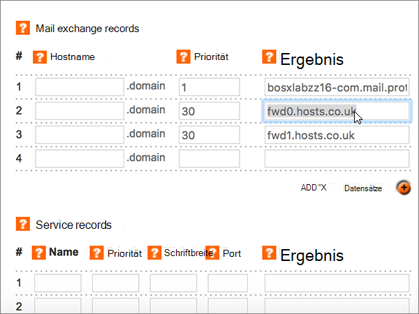

# Erstellen von DNS-Einträgen bei Names.co.uk für Microsoft

 **[Überprüfen Sie die häufig gestellten Fragen (FAQ) zu Domänen](../setup/domains-faq.md)**, wenn Sie nicht finden, wonach Sie suchen. 
  
Wenn Names.co.uk Ihr DNS-Hostinganbieter ist, führen Sie die in diesem Artikel aufgeführten Schritte aus, um Ihre Domäne zu überprüfen und DNS-Einträge für E-Mail, Skype for Business Online und andere Dienste einzurichten.
    
Nachdem Sie diese Einträge bei Names.co.uk hinzugefügt haben, ist Ihre Domäne für die Verwendung mit Microsoft-Diensten eingerichtet.
  

  
> [!NOTE]
>  Normalerweise dauert es ungefähr 15 Minuten, bis DNS-Änderungen wirksam werden. Es kann jedoch gelegentlich länger dauern, bis eine von Ihnen vorgenommene Änderung im Internet im DNS-System aktualisiert wurde. Wenn nach dem Hinzufügen von DNS-Einträgen Probleme mit dem E-Mail-Fluss oder andere Probleme auftreten, lesen Sie [Behandeln von Problemen nach Änderung des Domänennamens oder von DNS-Einträgen](../get-help-with-domains/find-and-fix-issues.md). 
  
## Hinzufügen eines TXT-Eintrags zur Überprüfung

Bevor Sie Ihre Domäne mit Microsoft verwenden können, müssen wir uns vergewissern, dass Sie deren Besitzer sind. Ihre Fähigkeit, sich bei Ihrem Konto bei Ihrer Domänenregistrierungsstelle anzumelden und den DNS-Eintrag zu erstellen, ist für Microsoft der Nachweis, dass Sie der Besitzer der Domäne sind.
  
> [!NOTE]
> Dieser Eintrag wird nur verwendet, um zu überprüfen, ob Sie der Besitzer Ihrer Domäne sind. Er hat keine weiteren Auswirkungen. Sie können ihn später ggf. löschen. 
  
1. Um zu beginnen, navigieren Sie über [diesen Link](https://account.names.co.uk/dashboard#/) zu Ihrer Domänenseite bei Names.co.uk. Sie werden aufgefordert, sich zuerst anzumelden.
    
    
  
2. On the **Dashboard** page, find the name of the domain that you are updating, and then choose **DNS Settings** from the drop-down list. 
    
    (You may have to scroll down.)
    
    
  
3. On the **Add/Modify DNS Zone** page, in the **A, CNAME, AAAA, TXT and NS records** section, in the boxes for the new record, type or copy and paste the values from the following table. 
    
    (Wählen Sie in der Dropdownliste den Wert für **Type** aus.) 
    
    (Wenn Sie eine Zeile hinzufügen möchten, wählen Sie **Add a/CNAME Records (+)** aus.)
    
    (Möglicherweise müssen Sie nach unten scrollen.)
        
    |**Hostname**|**Type**|**Result**|
    |:-----|:-----|:-----|
    |(Leave this field empty.)    |TXT    |MS=ms *XXXXXXXX*    **Hinweis:** Dies ist ein Beispiel. Verwenden Sie hier Ihre spezifischen **Ziel-oder Punkt-zu-Adresse** -Werte aus der Tabelle.           [Wie finde ich diese Angabe?](../get-help-with-domains/information-for-dns-records.md)    |
       
    
  
4. Klicken Sie auf **Speichern**.
    
    (Möglicherweise müssen Sie nach unten scrollen.)
    
    
  
5. Warten Sie einige Minuten, bevor Sie fortfahren, damit der soeben erstellte Eintrag im Internet aktualisiert werden kann.
    
Nachdem Sie den Eintrag auf der Website Ihrer Domänenregistrierungsstelle hinzugefügt haben, kehren Sie zu Microsoft zurück und fordern Sie den Eintrag an.
  
Wenn Microsoft den richtigen TXT-Eintrag findet, ist die Domäne überprüft.
  
1. Wechseln Sie im Admin Center zur Seite **Einstellungen** \> <a href="https://go.microsoft.com/fwlink/p/?linkid=834818" target="_blank">Domänen</a>.
    
2. Wählen Sie auf der Seite **Domänen** die zu überprüfende Domäne aus. 
    
    
  
3. Wählen Sie auf der Seite **Setup** die Option **Setup starten** aus.
    
    
  
4. Wählen Sie auf der Seite **Domäne überprüfen** die Option **Überprüfen** aus.
    
    
  
> [!NOTE]
>  Normalerweise dauert es ungefähr 15 Minuten, bis DNS-Änderungen wirksam werden. Es kann jedoch gelegentlich länger dauern, bis eine von Ihnen vorgenommene Änderung im Internet im DNS-System aktualisiert wurde. Wenn nach dem Hinzufügen von DNS-Einträgen Probleme mit dem E-Mail-Fluss oder andere Probleme auftreten, lesen Sie [Behandeln von Problemen nach Änderung des Domänennamens oder von DNS-Einträgen](../get-help-with-domains/find-and-fix-issues.md). 
  
## Fügen Sie einen MX-Eintrag hinzu, damit E-Mails für Ihre Domäne an Microsoft geleitet werden.

1. Um zu beginnen, navigieren Sie über [diesen Link](https://account.names.co.uk/dashboard#/) zu Ihrer Domänenseite bei Names.co.uk. Sie werden aufgefordert, sich zuerst anzumelden.
    
    
  
2. On the **Dashboard** page, find the name of the domain that you are updating, and then choose **DNS Settings** from the drop-down list. 
    
    (You may have to scroll down.)
    
    
  
3. Geben Sie auf der Seite **Add/Modify DNS Zone** im Abschnitt **Mail exchange records** in den Feldern für den neuen Eintrag die Werte aus der nachstehenden Tabelle manuell ein, oder kopieren Sie die Werte, und fügen Sie sie ein. 
    
    (Möglicherweise müssen Sie nach unten scrollen.)
    
    |**Hostname**|**Priority**|**Result**|
    |:-----|:-----|:-----|
    |(Dieses Feld leer lassen.)    |1    Weitere Informationen zur Priorität finden Sie unter [Was ist MX-Priorität?](https://docs.microsoft.com/microsoft-365/admin/setup/domains-faq)   | *\<domain-key\>*  .mail.protection.outlook.com    > [!NOTE] Erhalten Sie>  *\<domain-key\>*  von Ihrem Microsoft-Konto.           [Wie finde ich diese Angabe?](../get-help-with-domains/information-for-dns-records.md)          |
       
    
  
4. Klicken Sie auf **Speichern**.
    
    (Möglicherweise müssen Sie nach unten scrollen.)
    
    
  
5. If there are any other MX records listed in the **Mail exchange records** section, delete each one by selecting it and then pressing the **Delete** key on your keyboard. 
    
    
  
6. Klicken Sie auf **Speichern**.
    
    (Möglicherweise müssen Sie nach unten scrollen.)
    
    
  
## Hinzufügen der sechs CNAME-Einträge, die für Microsoft erforderlich sind

1. Um zu beginnen, navigieren Sie über [diesen Link](https://account.names.co.uk/dashboard#/) zu Ihrer Domänenseite bei Names.co.uk. Sie werden aufgefordert, sich zuerst anzumelden.
    
    
  
2. On the **Dashboard** page, find the name of the domain that you are updating, and then choose **DNS Settings** from the drop-down list. 
    
    (You may have to scroll down.)
    
    
  
3. On the **Add/Modify DNS Zone** page, in the **A, CNAME, AAAA, TXT and NS records** section, in the boxes for the new record, type or copy and paste the values from the following table. 
    
    (Wählen Sie in der Dropdownliste den Wert für **Type** aus.) 
    
    (Wenn Sie eine Zeile hinzufügen möchten, wählen Sie **Add a/CNAME Records (+)** aus.)
    
    (Möglicherweise müssen Sie nach unten scrollen.)
    
    |**Host Name**|**Type**|**Result**|
    |:-----|:-----|:-----|
    |autodiscover    |CNAME    |autodiscover.outlook.com    |
    |sip    |CNAME    |sipdir.online.lync.com    |
    |lyncdiscover    |CNAME    |webdir.online.lync.com    |
    |enterpriseregistration    |CNAME    |enterpriseregistration.windows.net    |
    |enterpriseenrollment    |CNAME    |enterpriseenrollment-s.manage.microsoft.com    |
       
    
  
4. Klicken Sie auf **Speichern**.
    
    
  
## Hinzufügen eines TXT-Eintrags für SPF, um E-Mail-Spam zu verhindern

> [!IMPORTANT]
> Es kann bei einer Domäne nur einen TXT-Eintrag für SPF geben. Wenn es bei Ihrer Domäne mehrere SPF-Einträge gibt, treten E-Mail-Fehler sowie Probleme bei der Übermittlung und Spamklassifizierung auf. Wenn es für Ihre Domäne bereits einen SPF-Eintrag gibt, erstellen Sie für Microsoft keinen neuen, Fügen Sie stattdessen die erforderlichen Microsoft-Werte zum aktuellen Datensatz hinzu, sodass Sie einen  *einzelnen*  SPF-Eintrag haben, der beide Wertegruppen enthält.
  
1. Um zu beginnen, navigieren Sie über [diesen Link](https://account.names.co.uk/dashboard#/) zu Ihrer Domänenseite bei Names.co.uk. Sie werden aufgefordert, sich zuerst anzumelden.
    
    
  
2. On the **Dashboard** page, find the name of the domain that you are updating, and then choose **DNS Settings** from the drop-down list. 
    
    (You may have to scroll down.)
    
    
  
3. Wählen Sie auf der Seite **DNS-Zonen auf dem Konto** in der Spalte **Domänenname** den Namen der Domäne aus, die Sie aktualisieren möchten. 
    
    
  
4. On the **Add/Modify DNS Zone** page, in the **A, CNAME, AAAA, TXT and NS records** section, in the boxes for the new record, type or copy and paste the values from the following table. 
    
    (Wählen Sie in der Dropdownliste den Wert für **Type** aus.) 
    
    (Wenn Sie eine Zeile hinzufügen möchten, wählen Sie **Add a/CNAME Records (+)** aus.)
    
    (Möglicherweise müssen Sie nach unten scrollen.)
    
    |**Hostname**|**Type**|**Result**|
    |:-----|:-----|:-----|
    |(Leave this field empty.)    |TXT    |v=spf1 include:spf.protection.outlook.com -all    **Hinweis:** Es wird empfohlen, diesen Eintrag zu kopieren und einzufügen, damit alle Abstände korrekt übernommen werden.           |
       
    
  
5. Klicken Sie auf **Speichern**.
    
    (Möglicherweise müssen Sie nach unten scrollen.)
    
    
  
## Hinzufügen der für Microsoft erforderlichen zwei SRV-Einträge

1. Um zu beginnen, navigieren Sie über [diesen Link](https://account.names.co.uk/dashboard#/) zu Ihrer Domänenseite bei Names.co.uk. Sie werden aufgefordert, sich zuerst anzumelden.
    
    
  
2. On the **Dashboard** page, find the name of the domain that you are updating, and then choose **DNS Settings** from the drop-down list. 
    
    (You may have to scroll down.)
    
    
  
3. Geben Sie auf der Seite **Add/Modify DNS Zone** im Abschnitt **Service records** in den Feldern für den neuen Eintrag die Werte aus der nachstehenden Tabelle manuell ein, oder kopieren Sie die Werte, und fügen Sie sie ein. 
    
    (Möglicherweise müssen Sie nach unten scrollen.)
    
    |**Name**|**Priority**|**Weight**|**Port**|**Result**|
    |:-----|:-----|:-----|:-----|:-----|
    |_sip._tls    |100    |1    |443    |sipdir.online.lync.com    |
    |_sipfederationtls._tcp    |100    |1    |5061    |sipfed.online.lync.com    |
       
    
  
4. Klicken Sie auf **Speichern**.
    
    (Möglicherweise müssen Sie nach unten scrollen.)
    
    
  
> [!NOTE]
>  Normalerweise dauert es ungefähr 15 Minuten, bis DNS-Änderungen wirksam werden. Es kann jedoch gelegentlich länger dauern, bis eine von Ihnen vorgenommene Änderung im Internet im DNS-System aktualisiert wurde. Wenn nach dem Hinzufügen von DNS-Einträgen Probleme mit dem E-Mail-Fluss oder andere Probleme auftreten, lesen Sie [Behandeln von Problemen nach Änderung des Domänennamens oder von DNS-Einträgen](../get-help-with-domains/find-and-fix-issues.md). 
  
