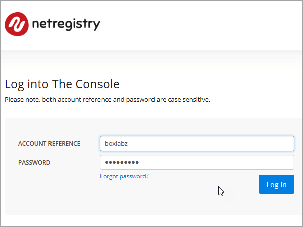

# Erstellen von DNS-Einträgen bei Netregistry für Office 365

[] [Überprüfen Sie die häufig gestellten Fragen (FAQ) zu Domänen](../setup/domains-faq.md) , wenn Sie nicht finden, wonach Sie suchen. 
  
Wenn Netregistry Ihr DNS-Hostinganbieter ist, führen Sie die in diesem Artikel aufgeführten Schritte aus, um Ihre Domäne zu überprüfen und DNS-Einträge für E-Mail, Skype for Business Online und andere Dienste einzurichten.
  
Das sind die wichtigsten hinzuzufügenden Einträge.
  
- [Hinzufügen eines TXT-Eintrags zur Überprüfung](#add-a-txt-record-for-verification)
    
- [Hinzufügen eines MX-Eintrags, damit E-Mails für Ihre Domäne an Office 365 geleitet werden](#add-an-mx-record-so-email-for-your-domain-will-come-to-office-365)

- [Hinzufügen der für Office 365 erforderlichen CNAME-Einträge](#add-the-cname-records-that-are-required-for-office-365)
    
- [Hinzufügen eines TXT-Eintrags für SPF, um E-Mail-Spam zu verhindern](#add-a-txt-record-for-spf-to-help-prevent-email-spam)
    
- [Hinzufügen der zwei für Office 365 erforderlichen SRV-Einträge](#add-the-two-srv-records-that-are-required-for-office-365)
    
Nachdem Sie diese Einträge bei Netregistry hinzugefügt haben, ist Ihre Domäne für die Verwendung von Office 365 Diensten eingerichtet.
  
Informationen zu Webhosting und DNS für Websites mit Office 365 finden Sie unter [Verwenden einer öffentlichen Website mit Office 365](https://support.office.com/article/a8178510-501d-4bd8-9921-b04f2e9517a5.aspx).
  
> [!NOTE]
> Normalerweise dauert es ungefähr 15 Minuten, bis DNS-Änderungen wirksam werden. Es kann jedoch gelegentlich länger dauern, bis eine von Ihnen vorgenommene Änderung im Internet im DNS-System aktualisiert wurde. Wenn nach dem Hinzufügen von DNS-Einträgen Probleme mit dem E-Mail-Fluss oder andere Probleme auftreten, lesen Sie [Behandeln von Problemen nach Änderung des Domänennamens oder von DNS-Einträgen](../get-help-with-domains/find-and-fix-issues.md). 
  
## Hinzufügen eines TXT-Eintrags zur Überprüfung

Bevor Sie Ihre Domäne in Office 365 verwenden können, müssen wir uns vergewissern, dass Sie deren Besitzer sind. Ihre Fähigkeit, sich bei Ihrem Konto bei Ihrer Domänenregistrierungsstelle anzumelden und den DNS-Eintrag zu erstellen, ist für Office 365 der Nachweis, dass Sie der Besitzer der Domäne sind.
  
> [!NOTE]
> Dieser Eintrag wird nur verwendet, um zu überprüfen, ob Sie der Besitzer Ihrer Domäne sind. Er hat keine weiteren Auswirkungen. Sie können ihn später ggf. löschen. 
  
1. Um zu beginnen, navigieren Sie über [diesen Link](https://theconsole.netregistry.com.au/) zu Ihrer Domänenseite bei Netregistry. Sie werden aufgefordert, sich anzumelden.
    
    
  
2. Wählen Sie neben der Domäne, die Sie verwalten möchten, **Verwalten** aus.
    
    
  
3. Wählen Sie **Zone Manager** aus.
    
    
  
4. Wählen Sie unter **Zonen Eintrag hinzufügen**die Option **TXT-Eintrag** in der Liste aus, und wählen Sie dann **neuen Datensatz erstellen**aus.
    
    
  
    > [!NOTE]
    > Sie müssen vor und nach dem Eintrag im Feld txt Anführungszeichen setzen. 
  
    Geben Sie im Formular **New TXT Record** (Neuer TXT-Eintrag) die Werte aus der folgenden Tabelle ein. Sie können die Werte auch kopieren und einfügen. 
    
    |**Name**|**TTL (SEC)**|**TXT (Verweist auf die Adresse oder den Wert)**|
    |:-----|:-----|:-----|
    |(leer lassen)    |3600 (Sekunden)    |"MS = msXXXXXXXX"    **Hinweis:** Dies ist ein nur Beispiel. Verwenden Sie jeweils Ihren Wert für **die Zieladresse bzw. die Adresse, auf die verwiesen wird** aus der Tabelle in Office 365. [Wie finde ich diese Angabe?](../get-help-with-domains/information-for-dns-records.md)  |
       
    
  
6. Wählen Sie **Add Record**aus.
    
Nachdem Sie den Eintrag auf der Website Ihrer Domänenregistrierungsstelle hinzugefügt haben, kehren Sie zu Office 365 zurück und fordern Office 365 auf, nach dem Eintrag zu suchen.
  
Wenn Office 365 den richtigen TXT-Eintrag findet, wird die Domäne überprüft.
  
1. Wechseln Sie im Admin Center zur Seite **Einstellungen** \> <a href="https://go.microsoft.com/fwlink/p/?linkid=834818" target="_blank">Domänen</a>.
    
2. Wählen Sie auf der Seite **Domänen** die zu überprüfende Domäne aus. 
    
    
  
3. Wählen Sie auf der Seite **Setup** die Option **Setup starten** aus.
    
    
  
4. Wählen Sie auf der Seite **Domäne überprüfen** die Option **Überprüfen** aus.
    
    
  
> [!NOTE]
>  Normalerweise dauert es ungefähr 15 Minuten, bis DNS-Änderungen wirksam werden. Es kann jedoch gelegentlich länger dauern, bis eine von Ihnen vorgenommene Änderung im Internet im DNS-System aktualisiert wurde. Wenn nach dem Hinzufügen von DNS-Einträgen Probleme mit dem E-Mail-Fluss oder andere Probleme auftreten, lesen Sie [Behandeln von Problemen nach Änderung des Domänennamens oder von DNS-Einträgen](../get-help-with-domains/find-and-fix-issues.md). 
  
## Hinzufügen eines MX-Eintrags, damit E-Mails für Ihre Domäne zu Office 365 geleitet werden

1. Um zu beginnen, navigieren Sie über [diesen Link](https://theconsole.netregistry.com.au/) zu Ihrer Domänenseite bei Netregistry. Sie werden aufgefordert, sich anzumelden.
    
    
  
2. Wählen Sie neben der Domäne, die Sie verwalten möchten, **Verwalten** aus.
    
    
  
3. Wählen Sie **Zone Manager** aus.
    
    
  
4. Entfernen Sie unter **aktuelle Zoneneinträge**die standardmäßigen MX-Einträge, indem Sie neben jedem MX-Eintrag in der Liste **Entfernen** auswählen. 
    
    
  
5. Wählen Sie unter **Zonen Eintrag hinzufügen**die Option **MX-Eintrag** in der Liste aus, und wählen Sie dann **neuen Datensatz erstellen**aus.
    
    
  
6. Geben Sie im **neuen MX-Eintrags** Formular die Werte aus der folgenden Tabelle ein, oder kopieren und fügen Sie Sie ein. 
    
    |**Name**|**TTL (SEC)**|**Exchange (verweist auf Adresse oder Wert)**|**Ist der Host vollständig qualifiziert?**|**Präferenz (Priorität)**|
    |:-----|:-----|:-----|:-----|:-----|
    |(leer lassen)    |3600 (Sekunden)    | *\<Domänenschlüssel\>*  .mail.protection.outlook.com    **Hinweis:** Rufen Sie Ihren * \<Domänenschlüssel\> * aus Ihrem Office 365-Konto ab.  [Wie finde ich diese Angabe?](../get-help-with-domains/information-for-dns-records.md)      |(aktivieren Sie das Kontrollkästchen)    |10      Weitere Informationen zur Priorität finden Sie unter Was ist MX-Priorität?    |
       
    
  
7. Wählen Sie **Add Record** (Eintrag hinzufügen) aus.
    
    
  
## Hinzufügen der für Office 365 erforderlichen CNAME-Einträge

1. Um zu beginnen, navigieren Sie über [diesen Link](https://theconsole.netregistry.com.au/) zu Ihrer Domänenseite bei Netregistry. Sie werden aufgefordert, sich anzumelden.
    
    
  
2. Wählen Sie neben der Domäne, die Sie verwalten möchten, **Verwalten** aus.
    
    
  
3. Wählen Sie **Zone Manager** aus.
    
    
  
4. Wählen Sie unter **Zonen Eintrag hinzufügen**die Option **CNAME-Eintrag** in der Liste aus, und wählen Sie dann **neuen Datensatz erstellen**aus.
    
    
  
5. Geben Sie in den Feldern für den neuen Eintrag die Werte aus der folgenden Tabelle ein. Sie können die Werte auch kopieren und einfügen.
    
    |**Name**|**Typ**|**TTL**|**Host (Punkt-zu-oder Adresswert)**|
    |:-----|:-----|:-----|:-----|
    |autodiscover    |CNAME    |3600 (Sekunden)    |autodiscover.outlook.com    |
    |sip    |CNAME    |3600 (Sekunden)    |sipdir.online.lync.com    |
    |lyncdiscover    |CNAME    |3600 (Sekunden)    |webdir.online.lync.com    |
    |enterpriseregistration    |CNAME    |3600 (Sekunden)    |enterpriseregistration.windows.net    |
    |enterpriseenrollment    |CNAME    |3600 (Sekunden)    |enterpriseenrollment-s.manage.microsoft.com    |
       
    
      
6. Wählen Sie **Add Record**aus.
    
    
  
7. Wiederholen Sie die vorherigen Schritte, um die anderen fünf CNAME-Einträge zu erstellen.
    
    Geben Sie für jeden Eintrag die Werte aus der nächsten Zeile der Tabelle oben in die Felder für diesen Eintrag ein. Sie können die Werte auch kopieren und einfügen.
    
## Hinzufügen eines TXT-Eintrags für SPF, um E-Mail-Spam zu verhindern

> [!IMPORTANT]
> Es kann bei einer Domäne nur einen TXT-Eintrag für SPF geben. Wenn es bei Ihrer Domäne mehrere SPF-Einträge gibt, treten E-Mail-Fehler sowie Probleme bei der Übermittlung und Spamklassifizierung auf. If you already have an SPF record for your domain, don't create a new one for Office 365. Damit verfügen Sie über einen  *einzigen*  SPF-Eintrag, in dem beide Wertemengen enthalten sind.
  
1. Um zu beginnen, navigieren Sie über [diesen Link](https://theconsole.netregistry.com.au/) zu Ihrer Domänenseite bei Netregistry. Sie werden aufgefordert, sich anzumelden.
    
    
  
2. Wählen Sie neben der Domäne, die Sie verwalten möchten, **Verwalten** aus.
    
    
  
3. Wählen Sie **Zone Manager** aus.
    
    
  
4. Wählen Sie unter **Zonen Eintrag hinzufügen**die Option **TXT-Eintrag** in der Liste aus, und wählen Sie dann **neuen Datensatz erstellen**aus.
    
    
  
5. Geben Sie in den Feldern für den neuen Eintrag die Werte aus der folgenden Tabelle ein. Sie können die Werte auch kopieren und einfügen. 
    
    > [!NOTE]
    > Sie müssen vor und nach dem Eintrag im Feld txt Anführungszeichen setzen. 
  
    |**Name**|**Typ**|**TTL**|**TXT-Daten (Ziel)**|
    |:-----|:-----|:-----|:-----|
    |(leer lassen)    |TXT    |3600 (Sekunden)    |"v = spf1 include:SPF. Protection. Outlook. com-all"    **Hinweis:** Es wird empfohlen, diesen Eintrag zu kopieren und einzufügen, damit alle Abstände korrekt übernommen werden.           |
   
    
  
6. Wählen Sie **Add Record** (Eintrag hinzufügen) aus.
    
    
  
## Hinzufügen der für Office 365 erforderlichen zwei SRV-Einträge

1. Um zu beginnen, navigieren Sie über [diesen Link](https://theconsole.netregistry.com.au/) zu Ihrer Domänenseite bei Netregistry. Sie werden aufgefordert, sich anzumelden.
    
    
  
2. Wählen Sie neben der Domäne, die Sie verwalten möchten, die Option **Manage**aus.
    
    
  
3. Wählen Sie **Zone Manager** aus.
    
    
  
4. Wählen Sie unter **Zonen Eintrag hinzufügen**die Option **SRV-Eintrag** in der Liste aus, und wählen Sie dann **neuen Datensatz erstellen**aus.
    
    
  
5. Geben Sie in den Feldern für den neuen Eintrag die Werte aus der folgenden Tabelle ein. Sie können die Werte auch kopieren und einfügen.
    
    > [!NOTE]
    > Das Feld Name ist eine Kombination aus dem Dienst (beispielsweise _sip) und dem Protokoll (beispielsweise _tls). 
  
    |**Typ**|**Name**|**TTL (SEC)**|**Priority**|**Weight**|**Port**|**Target**|
    |:-----|:-----|:-----|:-----|:-----|:-----|:-----|
    |SRV (Dienst)    |_sip._tls    |3600 (Sekunden)    |100    |1    |443    |sipdir.online.lync.com    |
    |SRV (Dienst)    |_sipfederationtls._tcp    |3600 (Sekunden)    |100    |1    |5061    |sipfed.online.lync.com    |
       
    
  
6. Wählen Sie **Add Record** (Eintrag hinzufügen) aus.
    
    
  
7. Wiederholen Sie die vorherigen Schritte, um den anderen SRV-Eintrag zu erstellen.
    
    Geben Sie die Werte aus der zweiten Zeile der Tabelle oben in die Felder für den zweiten Eintrag ein.
    
> [!NOTE]
> Normalerweise dauert es ungefähr 15 Minuten, bis DNS-Änderungen wirksam werden. Es kann jedoch gelegentlich länger dauern, bis eine von Ihnen vorgenommene Änderung im Internet im DNS-System aktualisiert wurde. Wenn nach dem Hinzufügen von DNS-Einträgen Probleme mit dem E-Mail-Fluss oder andere Probleme auftreten, lesen Sie [Behandeln von Problemen nach Änderung des Domänennamens oder von DNS-Einträgen](../get-help-with-domains/find-and-fix-issues.md). 
  

