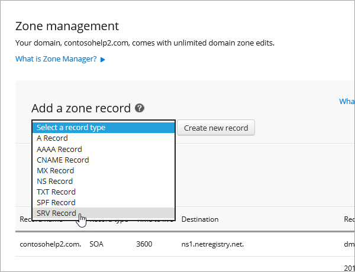

# Erstellen von DNS-Einträgen bei Netregistry für MicrosoftCreate DNS records at Netregistry for Microsoft

[] [Überprüfen Sie die häufig gestellten Fragen (FAQ) zu Domänen](../setup/domains-faq.md) , wenn Sie nicht finden, wonach Sie suchen.[Check the Domains FAQ](../setup/domains-faq.md) if you don't find what you're looking for. 
  
Wenn Netregistry Ihr DNS-Hostinganbieter ist, führen Sie die in diesem Artikel aufgeführten Schritte aus, um Ihre Domäne zu überprüfen und DNS-Einträge für E-Mail, Skype for Business Online und andere Dienste einzurichten.If Netregistry is your DNS hosting provider, follow the steps in this article to verify your domain and set up DNS records for email, Skype for Business Online, and so on.
  
Das sind die wichtigsten hinzuzufügenden Einträge.These are the main records to add.
  
- [Hinzufügen eines TXT-Eintrags zur ÜberprüfungAdd a TXT record for verification](#add-a-txt-record-for-verification)
    
- [Fügen Sie einen MX-Eintrag hinzu, damit E-Mails für Ihre Domäne an Microsoft geleitet werden.Add an MX record so email for your domain will come to Microsoft](#add-an-mx-record-so-email-for-your-domain-will-come-to-microsoft)

- [Hinzufügen der für Microsoft erforderlichen CNAME-EinträgeAdd the CNAME records that are required for Microsoft](#add-the-cname-records-that-are-required-for-microsoft)
    
- [Hinzufügen eines TXT-Eintrags für SPF, um E-Mail-Spam zu verhindernAdd a TXT record for SPF to help prevent email spam](#add-a-txt-record-for-spf-to-help-prevent-email-spam)
    
- [Hinzufügen der für Microsoft erforderlichen zwei SRV-EinträgeAdd the two SRV records that are required for Microsoft](#add-the-two-srv-records-that-are-required-for-microsoft)
    
Nachdem Sie diese Einträge bei Netregistry hinzugefügt haben, ist Ihre Domäne für die Verwendung mit Microsoft-Diensten eingerichtet.After you add these records at Netregistry, your domain will be set up to work with Microsoft services.
  
  
> [!NOTE]
> Normalerweise dauert es ungefähr 15 Minuten, bis DNS-Änderungen wirksam werden. Es kann jedoch gelegentlich länger dauern, bis eine von Ihnen vorgenommene Änderung im Internet im DNS-System aktualisiert wurde. Wenn nach dem Hinzufügen von DNS-Einträgen Probleme mit dem E-Mail-Fluss oder andere Probleme auftreten, lesen Sie [Behandeln von Problemen nach Änderung des Domänennamens oder von DNS-Einträgen](../get-help-with-domains/find-and-fix-issues.md).Typically it takes about 15 minutes for DNS changes to take effect. However, it can occasionally take longer for a change you've made to update across the Internet's DNS system. If you're having trouble with mail flow or other issues after adding DNS records, see [Troubleshoot issues after changing your domain name or DNS records](../get-help-with-domains/find-and-fix-issues.md). 
  
## Hinzufügen eines TXT-Eintrags zur ÜberprüfungAdd a TXT record for verification

Bevor Sie Ihre Domäne mit Microsoft verwenden können, müssen wir uns vergewissern, dass Sie deren Besitzer sind. Ihre Fähigkeit, sich bei Ihrem Konto bei Ihrer Domänenregistrierungsstelle anzumelden und den DNS-Eintrag zu erstellen, ist für Microsoft der Nachweis, dass Sie der Besitzer der Domäne sind.Before you use your domain with Microsoft, we have to make sure that you own it. Your ability to log in to your account at your domain registrar and create the DNS record proves to Microsoft that you own the domain.
  
> [!NOTE]
> Dieser Eintrag wird nur verwendet, um zu überprüfen, ob Sie der Besitzer Ihrer Domäne sind. Er hat keine weiteren Auswirkungen. Sie können ihn später ggf. löschen.This record is used only to verify that you own your domain; it doesn't affect anything else. You can delete it later, if you like. 
  
1. Um zu beginnen, navigieren Sie über [diesen Link](https://theconsole.netregistry.com.au/) zu Ihrer Domänenseite bei Netregistry. Sie werden aufgefordert, sich anzumelden.To get started, go to your domains page in Netregistry by using [this link](https://theconsole.netregistry.com.au/). You'll be prompted to log in.
    
    
  
2. Wählen Sie neben der Domäne, die Sie verwalten möchten, **Verwalten** aus.Next to the domain you want to manage, select **Manage**.
    
    
  
3. Wählen Sie **Zone Manager** aus.Select **Zone Manager**.
    
    
  
4. Wählen Sie unter **Zonen Eintrag hinzufügen**die Option **TXT-Eintrag** in der Liste aus, und wählen Sie dann **neuen Datensatz erstellen**aus.Under **Add a zone record**, choose **TXT Record** from the list, and then select **Create new record**.
    
    
  
    > [!NOTE]
    > Sie müssen vor und nach dem Eintrag im Feld txt Anführungszeichen setzen.You must use quotation marks before and after the entry in the TXT box. 
  
    Geben Sie im Formular **New TXT Record** (Neuer TXT-Eintrag) die Werte aus der folgenden Tabelle ein. Sie können die Werte auch kopieren und einfügen.In the **New TXT Record** form, type or copy and paste the values from the following table. 
    
    |**Name****Name**|**TTL (SEC)****TTL (SEC)**|**TXT (Verweist auf die Adresse oder den Wert)****TXT (Points to address or value)**|
    |:-----|:-----|:-----|
    |(leer lassen)(leave blank)    |3600 (Sekunden)3600 (seconds)    |"MS = msXXXXXXXX""MS=msXXXXXXXX"    **Hinweis:** Dies ist ein Beispiel.**Note:** This is an example. Verwenden Sie hier Ihre spezifischen **Ziel-oder Punkt-zu-Adresse** -Werte aus der Tabelle.Use your specific **Destination or Points to Address** value here, from the table. [Wie finde ich diese Angabe?How do I find this?](../get-help-with-domains/information-for-dns-records.md)  |
       
    
  
6. Wählen Sie **Add Record**aus.Select **Add record**.
    
Nachdem Sie den Eintrag auf der Website Ihrer Domänenregistrierungsstelle hinzugefügt haben, kehren Sie zu Microsoft zurück und fordern Sie den Eintrag an.Now that you've added the record at your domain registrar's site, you'll go back to Microsoft and request the record.
  
Wenn Microsoft den richtigen TXT-Eintrag findet, ist die Domäne überprüft.When Microsoft finds the correct TXT record, your domain is verified.
  
1. Wechseln Sie im Admin Center zur Seite **Einstellungen** \> <a href="https://go.microsoft.com/fwlink/p/?linkid=834818" target="_blank">Domänen</a>.In the admin center, go to the **Settings** \> <a href="https://go.microsoft.com/fwlink/p/?linkid=834818" target="_blank">Domains</a> page.
    
2. Wählen Sie auf der Seite **Domänen** die zu überprüfende Domäne aus.On the **Domains** page, select the domain that you are verifying. 
    
    
  
3. Wählen Sie auf der Seite **Setup** die Option **Setup starten** aus.On the **Setup** page, select **Start setup**.
    
    
  
4. Wählen Sie auf der Seite **Domäne überprüfen** die Option **Überprüfen** aus.On the **Verify domain** page, select **Verify**.
    
    
  
> [!NOTE]
>  Normalerweise dauert es ungefähr 15 Minuten, bis DNS-Änderungen wirksam werden. Es kann jedoch gelegentlich länger dauern, bis eine von Ihnen vorgenommene Änderung im Internet im DNS-System aktualisiert wurde. Wenn nach dem Hinzufügen von DNS-Einträgen Probleme mit dem E-Mail-Fluss oder andere Probleme auftreten, lesen Sie [Behandeln von Problemen nach Änderung des Domänennamens oder von DNS-Einträgen](../get-help-with-domains/find-and-fix-issues.md).Typically it takes about 15 minutes for DNS changes to take effect. However, it can occasionally take longer for a change you've made to update across the Internet's DNS system. If you're having trouble with mail flow or other issues after adding DNS records, see [Troubleshoot issues after changing your domain name or DNS records](../get-help-with-domains/find-and-fix-issues.md). 
  
## Fügen Sie einen MX-Eintrag hinzu, damit E-Mails für Ihre Domäne an Microsoft geleitet werden.Add an MX record so email for your domain will come to Microsoft

1. Um zu beginnen, navigieren Sie über [diesen Link](https://theconsole.netregistry.com.au/) zu Ihrer Domänenseite bei Netregistry. Sie werden aufgefordert, sich anzumelden.To get started, go to your domains page in Netregistry by using [this link](https://theconsole.netregistry.com.au/). You'll be prompted to log in.
    
    
  
2. Wählen Sie neben der Domäne, die Sie verwalten möchten, **Verwalten** aus.Next to the domain you want to manage, select **Manage**.
    
    
  
3. Wählen Sie **Zone Manager** aus.Select **Zone Manager**.
    
    
  
4. Entfernen Sie unter **aktuelle Zoneneinträge**die standardmäßigen MX-Einträge, indem Sie neben jedem MX-Eintrag in der Liste **Entfernen** auswählen.Under **Current zone records**, remove the default MX records by selecting **Remove** next to each MX record in the list. 
    
    
  
5. Wählen Sie unter **Zonen Eintrag hinzufügen**die Option **MX-Eintrag** in der Liste aus, und wählen Sie dann **neuen Datensatz erstellen**aus.Under **Add a zone record**, choose **MX Record** from the list, and then select **Create new record**.
    
    
  
6. Geben Sie im **neuen MX-Eintrags** Formular die Werte aus der folgenden Tabelle ein, oder kopieren und fügen Sie Sie ein.In the **New MX Record** form, type or copy and paste the values from the following table. 
    
    |**Name****Name**|**TTL (SEC)****TTL (SEC)**|**Exchange (verweist auf Adresse oder Wert)****Exchange (Points to address or value)**|**Ist der Host vollständig qualifiziert?****Is host fully qualified?**|**Präferenz (Priorität)****Preference (Priority)**|
    |:-----|:-----|:-----|:-----|:-----|
    |(leer lassen)(leave blank)    |3600 (Sekunden)3600 (seconds)    | *\<Domänenschlüssel\>*  .mail.protection.outlook.com*\<domain-key\>*  .mail.protection.outlook.com    **Hinweis:** Rufen Sie Ihren \* \<Domänenschlüssel\> \* von Ihrem Microsoft-Konto ab.**Note:** Get your  *\<domain-key\>*  from your Microsoft account.  [Wie finde ich diese Angabe?How do I find this?](../get-help-with-domains/information-for-dns-records.md)      |(aktivieren Sie das Kontrollkästchen)(select the checkbox)    |10  10    Weitere Informationen zur Priorität finden Sie unter Was ist MX-Priorität?For more information about priority, see What is MX priority?    |
       
    
  
7. Wählen Sie **Add Record** (Eintrag hinzufügen) aus.Select **Add Record**.
    
    
  
## Hinzufügen der für Microsoft erforderlichen CNAME-EinträgeAdd the CNAME records that are required for Microsoft

1. Um zu beginnen, navigieren Sie über [diesen Link](https://theconsole.netregistry.com.au/) zu Ihrer Domänenseite bei Netregistry. Sie werden aufgefordert, sich anzumelden.To get started, go to your domains page in Netregistry by using [this link](https://theconsole.netregistry.com.au/). You'll be prompted to log in.
    
    
  
2. Wählen Sie neben der Domäne, die Sie verwalten möchten, **Verwalten** aus.Next to the domain you want to manage, select **Manage**.
    
    
  
3. Wählen Sie **Zone Manager** aus.Select **Zone Manager**.
    
    
  
4. Wählen Sie unter **Zonen Eintrag hinzufügen**die Option **CNAME-Eintrag** in der Liste aus, und wählen Sie dann **neuen Datensatz erstellen**aus.Under  **Add a zone record**, choose **CNAME Record** from the list, and then select **Create new record**.
    
    
  
5. Geben Sie in den Feldern für den neuen Eintrag die Werte aus der folgenden Tabelle ein. Sie können die Werte auch kopieren und einfügen.In the boxes for the new record, type or copy and paste the values from the following table.
    
    |**Name****Name**|**Typ****Type**|**TTL****TTL**|**Host (Punkt-zu-oder Adresswert)****HOST (Points to or address value)**|
    |:-----|:-----|:-----|:-----|
    |autodiscoverautodiscover    |CNAMECNAME    |3600 (Sekunden)3600 (seconds)    |autodiscover.outlook.comautodiscover.outlook.com    |
    |sipsip    |CNAMECNAME    |3600 (Sekunden)3600 (seconds)    |sipdir.online.lync.comsipdir.online.lync.com    |
    |lyncdiscoverlyncdiscover    |CNAMECNAME    |3600 (Sekunden)3600 (seconds)    |webdir.online.lync.comwebdir.online.lync.com    |
    |enterpriseregistrationenterpriseregistration    |CNAMECNAME    |3600 (Sekunden)3600 (seconds)    |enterpriseregistration.windows.netenterpriseregistration.windows.net    |
    |enterpriseenrollmententerpriseenrollment    |CNAMECNAME    |3600 (Sekunden)3600 (seconds)    |enterpriseenrollment-s.manage.microsoft.comenterpriseenrollment-s.manage.microsoft.com    |
       
    
      
6. Wählen Sie **Add Record**aus.Select **Add record**.
    
    
  
7. Wiederholen Sie die vorherigen Schritte, um die anderen fünf CNAME-Einträge zu erstellen.Repeat the previous steps to create the other five CNAME records.
    
    Geben Sie für jeden Eintrag die Werte aus der nächsten Zeile der Tabelle oben in die Felder für diesen Eintrag ein. Sie können die Werte auch kopieren und einfügen.For each record, type or copy and paste the values from the next row of the table above into the boxes for that record.
    
## Hinzufügen eines TXT-Eintrags für SPF, um E-Mail-Spam zu verhindernAdd a TXT record for SPF to help prevent email spam

> [!IMPORTANT]
> Es kann bei einer Domäne nur einen TXT-Eintrag für SPF geben.You cannot have more than one TXT record for SPF for a domain. Wenn es bei Ihrer Domäne mehrere SPF-Einträge gibt, treten E-Mail-Fehler sowie Probleme bei der Übermittlung und Spamklassifizierung auf.If your domain has more than one SPF record, you'll get email errors, as well as delivery and spam classification issues. Wenn es für Ihre Domäne bereits einen SPF-Eintrag gibt, erstellen Sie für Microsoft keinen neuen,If you already have an SPF record for your domain, don't create a new one for Microsoft. Fügen Sie stattdessen die erforderlichen Microsoft-Werte zum aktuellen Datensatz hinzu, sodass Sie einen *einzelnen* SPF-Eintrag haben, der beide Wertegruppen enthält.Instead, add the required Microsoft values to the current record so that you have a  *single*  SPF record that includes both sets of values.
  
1. Um zu beginnen, navigieren Sie über [diesen Link](https://theconsole.netregistry.com.au/) zu Ihrer Domänenseite bei Netregistry. Sie werden aufgefordert, sich anzumelden.To get started, go to your domains page in Netregistry by using [this link](https://theconsole.netregistry.com.au/). You'll be prompted to log in.
    
    
  
2. Wählen Sie neben der Domäne, die Sie verwalten möchten, **Verwalten** aus.Next to the domain you want to manage, select **Manage**.
    
    
  
3. Wählen Sie **Zone Manager** aus.Select **Zone Manager**.
    
    
  
4. Wählen Sie unter **Zonen Eintrag hinzufügen**die Option **TXT-Eintrag** in der Liste aus, und wählen Sie dann **neuen Datensatz erstellen**aus.Under **Add a zone record**, choose **TXT Record** from the list, and then select **Create new record**.
    
    
  
5. Geben Sie in den Feldern für den neuen Eintrag die Werte aus der folgenden Tabelle ein. Sie können die Werte auch kopieren und einfügen.In the boxes for the new record, type or copy and paste the values from the following table. 
    
    > [!NOTE]
    > Sie müssen vor und nach dem Eintrag im Feld txt Anführungszeichen setzen.You must use quotation marks before and after the entry in the TXT box. 
  
    |**Name****Name**|**Typ****Type**|**TTL****TTL**|**TXT-Daten (Ziel)****TXT Data (Target)**|
    |:-----|:-----|:-----|:-----|
    |(leer lassen)(leave blank)    |TXTTXT    |3600 (Sekunden)3600 (seconds)    |"v = spf1 include:SPF. Protection. Outlook. com-all""v=spf1 include:spf.protection.outlook.com -all"    **Hinweis:** Es wird empfohlen, diesen Eintrag zu kopieren und einzufügen, damit alle Abstände korrekt übernommen werden.**Note:** We recommend copying and pasting this entry, so that all of the spacing stays correct.           |
   
    
  
6. Wählen Sie **Add Record** (Eintrag hinzufügen) aus.Select **Add Record**.
    
    
  
## Hinzufügen der für Microsoft erforderlichen zwei SRV-EinträgeAdd the two SRV records that are required for Microsoft

1. Um zu beginnen, navigieren Sie über [diesen Link](https://theconsole.netregistry.com.au/) zu Ihrer Domänenseite bei Netregistry. Sie werden aufgefordert, sich anzumelden.To get started, go to your domains page in Netregistry by using [this link](https://theconsole.netregistry.com.au/). You'll be prompted to log in.
    
    
  
2. Wählen Sie neben der Domäne, die Sie verwalten möchten, die Option **Manage**aus.Next to the domain you want to manage, select  **Manage**.
    
    
  
3. Wählen Sie **Zone Manager** aus.Select **Zone Manager**.
    
    
  
4. Wählen Sie unter **Zonen Eintrag hinzufügen**die Option **SRV-Eintrag** in der Liste aus, und wählen Sie dann **neuen Datensatz erstellen**aus.Under  **Add a zone record**, choose **SRV Record** from the list, and then select **Create new record**.
    
    
  
5. Geben Sie in den Feldern für den neuen Eintrag die Werte aus der folgenden Tabelle ein. Sie können die Werte auch kopieren und einfügen.In the boxes for the new record, type or copy and paste the values from the following table.
    
    > [!NOTE]
    > Das Feld Name ist eine Kombination aus dem Dienst (beispielsweise _sip) und dem Protokoll (beispielsweise _tls).The Name field is a combination of the service (for example, _sip) and protocol (for example, _tls). 
  
    |**Typ****Type**|**Name****Name**|**TTL (SEC)****TTL (SEC)**|**Priority****Priority**|**Weight****Weight**|**Port****Port**|**Target****Target**|
    |:-----|:-----|:-----|:-----|:-----|:-----|:-----|
    |SRV (Dienst)SRV (service)    |_sip._tls_sip._tls    |3600 (Sekunden)3600 (seconds)    |100100    |11    |443443    |sipdir.online.lync.comsipdir.online.lync.com    |
    |SRV (Dienst)SRV (service)    |_sipfederationtls._tcp_sipfederationtls._tcp    |3600 (Sekunden)3600 (seconds)    |100100    |11    |50615061    |sipfed.online.lync.comsipfed.online.lync.com    |
       
    
  
6. Wählen Sie **Add Record** (Eintrag hinzufügen) aus.Select **Add Record**.
    
    
  
7. Wiederholen Sie die vorherigen Schritte, um den anderen SRV-Eintrag zu erstellen.Repeat the previous steps to create the other SRV record.
    
    Geben Sie die Werte aus der zweiten Zeile der Tabelle oben in die Felder für den zweiten Eintrag ein.Type or copy and paste the values from the second row of the table above into the boxes for the second record.
    
> [!NOTE]
> Normalerweise dauert es ungefähr 15 Minuten, bis DNS-Änderungen wirksam werden. Es kann jedoch gelegentlich länger dauern, bis eine von Ihnen vorgenommene Änderung im Internet im DNS-System aktualisiert wurde. Wenn nach dem Hinzufügen von DNS-Einträgen Probleme mit dem E-Mail-Fluss oder andere Probleme auftreten, lesen Sie [Behandeln von Problemen nach Änderung des Domänennamens oder von DNS-Einträgen](../get-help-with-domains/find-and-fix-issues.md).Typically it takes about 15 minutes for DNS changes to take effect. However, it can occasionally take longer for a change you've made to update across the Internet's DNS system. If you're having trouble with mail flow or other issues after adding DNS records, see [Troubleshoot issues after changing your domain name or DNS records](../get-help-with-domains/find-and-fix-issues.md). 
  

