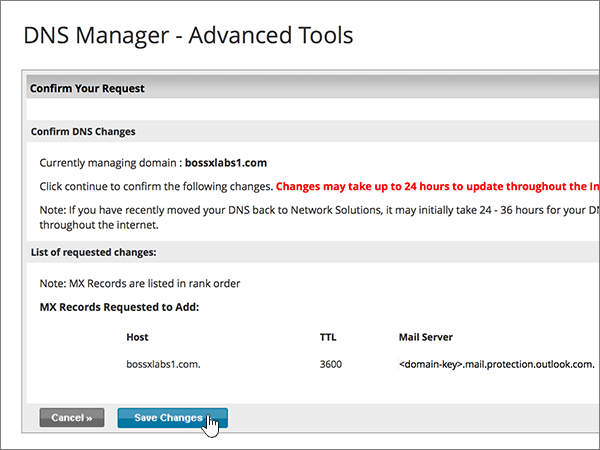

# Erstellen von DNS-Einträgen bei Network Solutions for Microsoft

 **[Überprüfen Sie die häufig gestellten Fragen (FAQ) zu Domänen](../setup/domains-faq.yml)**, wenn Sie nicht finden, wonach Sie suchen. 
  
Wenn Network Solutions Ihr DNS-Hostinganbieter ist, führen Sie die in diesem Artikel aufgeführten Schritte aus, um Ihre Domäne zu überprüfen und DNS-Einträge für E-Mail, Skype for Business Online und andere Dienste einzurichten.
  
Das sind die wichtigsten hinzuzufügenden Einträge. Führen Sie die folgenden Schritte aus, oder [schauen Sie sich das Video an](https://support.microsoft.com/office/c49698c2-6991-47fb-b5ac-18e49a505099). 
  
- [Hinzufügen eines TXT-Eintrags zur Überprüfung](#add-a-txt-record-for-verification)
    
- [Hinzufügen eines MX-Eintrags, damit E-Mails für Ihre Domäne an Microsoft geleitet werden](#add-an-mx-record-so-email-for-your-domain-will-come-to-microsoft)
    
- [Hinzufügen der für Microsoft erforderlichen CNAME-Einträge](#add-the-cname-records-that-are-required-for-microsoft)
    
- [Hinzufügen eines TXT-Eintrags für SPF, um E-Mail-Spam zu verhindern](#add-a-txt-record-for-spf-to-help-prevent-email-spam)
    
- [Hinzufügen der für Microsoft erforderlichen zwei SRV-Einträge](#add-the-two-srv-records-that-are-required-for-microsoft)
    
Nachdem Sie diese Datensätze bei Network Solutions hinzugefügt haben, wird Ihre Domäne für die Arbeit mit Microsoft-Diensten eingerichtet.
  

  
> [!NOTE]
>  Normalerweise dauert es ungefähr 15 Minuten, bis DNS-Änderungen wirksam werden. Es kann jedoch gelegentlich länger dauern, bis eine von Ihnen vorgenommene Änderung im Internet im DNS-System aktualisiert wurde. Wenn nach dem Hinzufügen von DNS-Einträgen Probleme mit dem E-Mail-Fluss oder andere Probleme auftreten, lesen Sie [Behandeln von Problemen nach Änderung des Domänennamens oder von DNS-Einträgen](../get-help-with-domains/find-and-fix-issues.md). 
  
## Hinzufügen eines TXT-Eintrags zur Überprüfung

Bevor Sie Ihre Domäne mit Microsoft verwenden können, müssen wir uns vergewissern, dass Sie deren Besitzer sind. Ihre Fähigkeit, sich bei Ihrem Konto bei Ihrer Domänenregistrierungsstelle anzumelden und den DNS-Eintrag zu erstellen, ist für Microsoft der Nachweis, dass Sie der Besitzer der Domäne sind.
  
> [!NOTE]
> Dieser Eintrag wird nur verwendet, um zu überprüfen, ob Sie der Besitzer Ihrer Domäne sind. Er hat keine weiteren Auswirkungen. Sie können ihn später ggf. löschen. 
  
Führen Sie die folgenden Schritte aus, oder [schauen Sie sich das Video an (beginnen Sie bei 0:47)](https://support.microsoft.com/office/c49698c2-6991-47fb-b5ac-18e49a505099).
  
1. Im ersten Schritt navigieren Sie über [diesen Link](https://www.networksolutions.com/manage-it) zu Ihrer Domänenseite bei Network Solutions. Sie werden aufgefordert, sich anzumelden.
    
    > [!IMPORTANT]
    > Bevor Sie die Schaltfläche **Anmeldung** auswählen, wählen Sie zunächst **in** der Dropdownliste **Anmelden in:** meine Domänennamen verwalten aus. 
  
    
  
2. Aktivieren Sie das Kontrollkästchen neben dem Namen der Domäne, die Sie ändern möchten.
    
    
  
3. Wählen **Sie DNS bearbeiten aus.**
    
    
  
4. Wählen **Sie Erweiterte DNS-Einträge verwalten aus.**
    
    (Möglicherweise müssen Sie nach unten scrollen.)
    
    
  
5. Scrollen Sie nach unten **zum Abschnitt Text (TXT Records),** und wählen Sie **dann Edit TXT Records aus.**
    
    
  
6. Geben Sie in den Feldern für den neuen Eintrag die Werte aus der folgenden Tabelle ein. Sie können die Werte auch kopieren und einfügen.
    
    |**Host**|**TTL**|**Text**|
    |:-----|:-----|:-----|
    |@    (The system will change this value to **@ (None)** when you save the record.)    |3600    |MS=ms *XXXXXXXX*    **Hinweis:** Dies ist ein Beispiel. Verwenden Sie hier Ihren spezifischen „Ziel“- oder **Verweist auf die Adresse**-Wert aus der Tabelle.  [Wie finde ich diese Angabe?](../get-help-with-domains/information-for-dns-records.md)   |
       
    
  
7. Wählen Sie **Weiter** aus.
    
    
  
8. Wählen **Sie Änderungen speichern aus.**
    
    
  
9. Warten Sie einige Minuten, bevor Sie fortfahren, damit der soeben erstellte Eintrag im Internet aktualisiert werden kann.
    
Nachdem Sie den Eintrag auf der Website Ihrer Domänenregistrierungsstelle hinzugefügt haben, kehren Sie zu Microsoft zurück und fordern Sie den Eintrag an.
  
Wenn Microsoft den richtigen TXT-Eintrag findet, ist die Domäne überprüft.

1. Wechseln Sie im Admin Center zur Seite **Einstellungen** \> <a href="https://go.microsoft.com/fwlink/p/?linkid=834818" target="_blank">Domänen</a>.
    
2. Wählen Sie auf der Seite **Domänen** die zu überprüfende Domäne aus. 
    
    
  
3. Wählen Sie auf der Seite **Setup** die Option **Setup starten** aus.
    
    
  
4. Wählen Sie auf der Seite **Domäne überprüfen** die Option **Überprüfen** aus.
    
    
  
> [!NOTE]
>  Normalerweise dauert es ungefähr 15 Minuten, bis DNS-Änderungen wirksam werden. Es kann jedoch gelegentlich länger dauern, bis eine von Ihnen vorgenommene Änderung im Internet im DNS-System aktualisiert wurde. Wenn nach dem Hinzufügen von DNS-Einträgen Probleme mit dem E-Mail-Fluss oder andere Probleme auftreten, lesen Sie [Behandeln von Problemen nach Änderung des Domänennamens oder von DNS-Einträgen](../get-help-with-domains/find-and-fix-issues.md). 
  
## Fügen Sie einen MX-Eintrag hinzu, damit E-Mails für Ihre Domäne an Microsoft geleitet werden.

Führen Sie die folgenden Schritte aus, oder [schauen Sie sich das Video an (beginnen Sie bei 3:51)](https://support.microsoft.com/office/c49698c2-6991-47fb-b5ac-18e49a505099).
  
1. Im ersten Schritt navigieren Sie über [diesen Link](https://www.networksolutions.com/manage-it) zu Ihrer Domänenseite bei Network Solutions. Sie werden aufgefordert, sich anzumelden.
    
    > [!IMPORTANT]
    > Bevor Sie die Schaltfläche **Anmeldung** auswählen, wählen Sie zunächst **in** der Dropdownliste **Anmelden in:** meine Domänennamen verwalten aus. 
  
    
  
2. Aktivieren Sie das Kontrollkästchen neben dem Namen der Domäne, die Sie ändern möchten.
    
    
  
3. Wählen **Sie DNS bearbeiten aus.**
    
    
  
4. Wählen **Sie Erweiterte DNS-Einträge verwalten aus.**
    
    (Möglicherweise müssen Sie nach unten scrollen.)
    
    
  
5. Scrollen Sie nach unten zum Abschnitt **Mail Servers (MX Records),** und wählen Sie **dann MX-Einträge bearbeiten aus.**
    
    
  
6. Geben Sie in den Feldern für den neuen Eintrag die Werte aus der folgenden Tabelle ein. Sie können die Werte auch kopieren und einfügen.
    
    |**Priority**|**TTL**|**Mail Server**|
    |:-----|:-----|:-----|
    |10      Weitere Informationen zur Priorität finden Sie unter [Was ist MX-Priorität?](../setup/domains-faq.yml)   |3600    | *\<domain-key\>*  .mail.protection.outlook.com.    **Dieser Wert MUSS mit einem Punkt (.) enden.**   **Hinweis:** Erhalten Sie Ihren *\<domain-key\>* über Ihr Microsoft-Konto. [Wie finde ich diese Angabe?](../get-help-with-domains/information-for-dns-records.md)          |
       
    
  
7. Wählen Sie **Weiter** aus.
    
    
  
8. Wählen **Sie Änderungen speichern aus.**
    
    
  
9. Wenn weitere MX-Einträge vorhanden sind, löschen Sie diese, indem Sie **Delete** für jeden Eintrag auswählen. 
    
    
  
10. Wenn sie alle ausgewählt sind, wählen Sie **Weiter aus.**
    
    
  
11. Wählen **Sie Änderungen speichern aus.**
    
    
  
## Hinzufügen der für Microsoft erforderlichen CNAME-Einträge

Führen Sie die folgenden Schritte aus, oder [schauen Sie sich das Video an (beginnen Sie bei 4:43)](https://support.microsoft.com/office/c49698c2-6991-47fb-b5ac-18e49a505099).
  
1. Im ersten Schritt navigieren Sie über [diesen Link](https://www.networksolutions.com/manage-it) zu Ihrer Domänenseite bei Network Solutions. Sie werden aufgefordert, sich anzumelden.
    
    > [!IMPORTANT]
    > Bevor Sie die Schaltfläche **Anmeldung** auswählen, wählen Sie zunächst **in** der Dropdownliste **Anmelden in:** meine Domänennamen verwalten aus. 
  
    
  
2. Aktivieren Sie das Kontrollkästchen neben dem Namen der Domäne, die Sie ändern möchten.
    
    
  
3. Wählen **Sie DNS bearbeiten aus.**
    
    
  
4. Wählen **Sie Erweiterte DNS-Einträge verwalten aus.**
    
    (Möglicherweise müssen Sie nach unten scrollen.)
    
    
  
5. Scrollen Sie nach unten zum **Abschnitt Hostaliases (CNAME Records),** und wählen Sie **dann Bearbeiten von CNAME-Datensätzen aus.**
    
    
  
6. Geben Sie in die Felder für die vier neuen Einträge die Werte aus der folgenden Tabelle ein. Sie können die Werte auch kopieren und einfügen.
    
    |**Alias**|**TTL**|**Refers to Host Name**|**Other Host          (Aktivieren Sie das Optionsfeld **Other Host**.)**|
    |:-----|:-----|:-----|:-----|
    |autodiscover    |3600    |(keine Einstellung)    |autodiscover.outlook.com.    **Dieser Wert MUSS mit einem Punkt (.) enden.**   |
    |sip    |3600    |(keine Einstellung)    |sipdir.online.lync.com.    **Dieser Wert MUSS mit einem Punkt (.) enden.**   |
    |lyncdiscover    |3600    |(keine Einstellung)    |webdir.online.lync.com.    **Dieser Wert MUSS mit einem Punkt (.) enden.**   |
    |enterpriseregistration    |3600    |(keine Einstellung)    |enterpriseregistration.windows.net    **Dieser Wert MUSS mit einem Punkt (.) enden.**   |
    |enterpriseenrollment    |3600    |(keine Einstellung)    |enterpriseenrollment-s.manage.microsoft.com    **Dieser Wert MUSS mit einem Punkt (.) enden.**   |
    
    
  
7. Wenn Sie alle benötigten #A0 hinzugefügt haben, wählen Sie **Weiter aus.**
    
    
  
8. Wählen **Sie Änderungen speichern aus.**
    
    
  
## Hinzufügen eines TXT-Eintrags für SPF, um E-Mail-Spam zu verhindern

> [!IMPORTANT]
> Es kann bei einer Domäne nur einen TXT-Eintrag für SPF geben. Wenn es bei Ihrer Domäne mehrere SPF-Einträge gibt, treten E-Mail-Fehler sowie Probleme bei der Übermittlung und Spamklassifizierung auf. Wenn es für Ihre Domäne bereits einen SPF-Eintrag gibt, erstellen Sie für Microsoft keinen neuen, sondern fügen Sie die erforderlichen Microsoft-Werte dem aktuellen Eintrag hinzu. Damit verfügen Sie über einen *einzigen* SPF-Eintrag, in dem beide Wertemengen enthalten sind. 
  
Führen Sie die folgenden Schritte aus, oder [schauen Sie sich das Video an (beginnen Sie bei 5:35)](https://support.microsoft.com/office/c49698c2-6991-47fb-b5ac-18e49a505099).
  
1. Im ersten Schritt navigieren Sie über [diesen Link](https://www.networksolutions.com/manage-it) zu Ihrer Domänenseite bei Network Solutions. Sie werden aufgefordert, sich anzumelden.
    
    > [!IMPORTANT]
    > Bevor Sie die Schaltfläche **Anmeldung** auswählen, wählen Sie zunächst **in** der Dropdownliste **Anmelden in:** meine Domänennamen verwalten aus. 
  
    
  
2. Aktivieren Sie das Kontrollkästchen neben dem Namen der Domäne, die Sie ändern möchten.
    
    
  
3. Wählen **Sie DNS bearbeiten aus.**
    
    
  
4. Wählen **Sie Erweiterte DNS-Einträge verwalten aus.**
    
    (Möglicherweise müssen Sie nach unten scrollen.)
    
    
  
5. Scrollen Sie nach unten **zum Abschnitt Text (TXT Records),** und wählen Sie **dann Edit TXT Records aus.**
    
    
  
6. Geben Sie in den Feldern für den neuen Eintrag die folgenden Werte ein. Sie können die Werte auch kopieren und einfügen.
    
    |**Host**|**TTL**|**Text**|
    |:-----|:-----|:-----|
    |@    (The system will change this value to **@ (None)** when you save the record.)    |3600    |v=spf1 include:spf.protection.outlook.com -all    **Hinweis:** Es wird empfohlen, diesen Eintrag zu kopieren und einzufügen, damit alle Abstände korrekt übernommen werden. |
       
    
  
7. Wählen Sie **Weiter** aus.
    
    
  
8. Wählen **Sie Änderungen speichern aus.**
    
    
  
## Hinzufügen der für Microsoft erforderlichen zwei SRV-Einträge

Führen Sie die folgenden Schritte aus, oder [schauen Sie sich das Video an (beginnen Sie bei 6:18)](https://support.microsoft.com/office/c49698c2-6991-47fb-b5ac-18e49a505099).
  
1. Im ersten Schritt navigieren Sie über [diesen Link](https://www.networksolutions.com/manage-it) zu Ihrer Domänenseite bei Network Solutions. Sie werden aufgefordert, sich anzumelden.
    
    > [!IMPORTANT]
    > Bevor Sie die Schaltfläche **Anmeldung** auswählen, wählen Sie zunächst **in** der Dropdownliste **Anmelden in:** meine Domänennamen verwalten aus. 
  
    
  
2. Aktivieren Sie das Kontrollkästchen neben dem Namen der Domäne, die Sie ändern möchten.
    
    
  
3. Wählen **Sie DNS bearbeiten aus.**
    
    
  
4. Wählen **Sie Erweiterte DNS-Einträge verwalten aus.**
    
    (Möglicherweise müssen Sie nach unten scrollen.)
    
    
  
5. Scrollen Sie nach unten **zum Abschnitt Dienst (SRV-Einträge),** und wählen Sie **dann SRV-Einträge bearbeiten aus.**
    
    
  
6. Geben Sie in die Felder für die zwei neuen Einträge die Werte aus der folgenden Tabelle ein. Sie können die Werte auch kopieren und einfügen.
    
    (Wählen Sie in den Dropdownlisten die Werte **Service** und **Protocol** aus.) 
    
    |**Service**|**Protocol**|**TTL**|**Priority**|**Weight**|**Port**|**Target**|
    |:-----|:-----|:-----|:-----|:-----|:-----|:-----|
    |_sip    |_tls    |3600    |100    |1    |443    |sipdir.online.lync.com.    **Dieser Wert MUSS mit einem Punkt (.) enden.**   |
    |_sipfederationtls    |_tcp    |3600    |100    |1    |5061    |sipfed.online.lync.com.    **Dieser Wert MUSS mit einem Punkt (.) enden.**   |
       
    
  
7. Wählen Sie **Weiter** aus.
    
    
  
8. Wählen **Sie Änderungen speichern aus.**
    
    
  
> [!NOTE]
>  Normalerweise dauert es ungefähr 15 Minuten, bis DNS-Änderungen wirksam werden. Es kann jedoch gelegentlich länger dauern, bis eine von Ihnen vorgenommene Änderung im Internet im DNS-System aktualisiert wurde. Wenn nach dem Hinzufügen von DNS-Einträgen Probleme mit dem E-Mail-Fluss oder andere Probleme auftreten, lesen Sie [Behandeln von Problemen nach Änderung des Domänennamens oder von DNS-Einträgen](../get-help-with-domains/find-and-fix-issues.md). 
