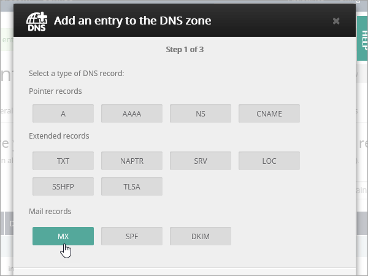
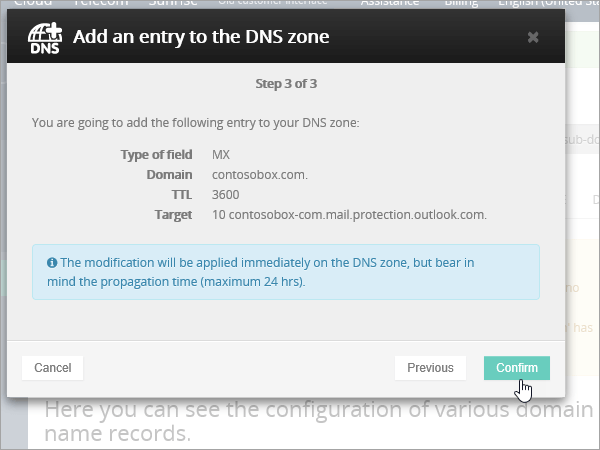

# Erstellen von DNS-Einträgen für Office 365 bei OVHCreate DNS records at OVH for Office 365

[] [Überprüfen Sie die häufig gestellten Fragen (FAQ) zu Domänen](../setup/domains-faq.md) , wenn Sie nicht finden, wonach Sie suchen.[Check the Domains FAQ](../setup/domains-faq.md) if you don't find what you're looking for. 
  
Wenn OVH Ihr DNS-Hostinganbieter ist, führen Sie die in diesem Artikel aufgeführten Schritte aus, um Ihre Domäne zu überprüfen und DNS-Einträge für E-Mail, Skype for Business Online und andere Dienste einzurichten.If OVH is your DNS hosting provider, follow the steps in this article to verify your domain and set up DNS records for email, Skype for Business Online, and so on.
  
Das sind die wichtigsten hinzuzufügenden Einträge.These are the main records to add. 
  
- [Erstellen von DNS-Einträgen bei OVH für Office 365Create DNS records at OVH for Office 365](#create-dns-records-at-ovh-for-office-365)
    
- [Hinzufügen eines MX-Eintrags, damit E-Mails für Ihre Domäne an Office 365 geleitet werdenAdd an MX record so email for your domain will come to Office 365](#add-an-mx-record-so-email-for-your-domain-will-come-to-office-365)
    
- [Hinzufügen der für Office 365 erforderlichen CNAME-EinträgeAdd the CNAME records that are required for Office 365](#add-the-cname-records-that-are-required-for-office-365)
    
- [Hinzufügen eines TXT-Eintrags für SPF, um E-Mail-Spam zu verhindernAdd a TXT record for SPF to help prevent email spam](#add-a-txt-record-for-spf-to-help-prevent-email-spam)
    
- [Hinzufügen der zwei für Office 365 erforderlichen SRV-EinträgeAdd the two SRV records that are required for Office 365](#add-the-two-srv-records-that-are-required-for-office-365)
    
Nachdem Sie diese Einträge bei OVH hinzugefügt haben, ist Ihre Domäne für die Verwendung von Office 365-Diensten eingerichtet.After you add these records at OVH, your domain will be set up to work with Office 365 services.
  
Informationen zu Webhosting und DNS für Websites mit Office 365 finden Sie unter [Verwenden einer öffentlichen Website mit Office 365](https://support.office.com/article/a8178510-501d-4bd8-9921-b04f2e9517a5.aspx).To learn about webhosting and DNS for websites with Office 365, see [Use a public website with Office 365](https://support.office.com/article/a8178510-501d-4bd8-9921-b04f2e9517a5.aspx).
  
> [!NOTE]
>  Normalerweise dauert es ungefähr 15 Minuten, bis DNS-Änderungen wirksam werden. Es kann jedoch gelegentlich länger dauern, bis eine von Ihnen vorgenommene Änderung im Internet im DNS-System aktualisiert wurde. Wenn nach dem Hinzufügen von DNS-Einträgen Probleme mit dem E-Mail-Fluss oder andere Probleme auftreten, lesen Sie [Behandeln von Problemen nach Änderung des Domänennamens oder von DNS-Einträgen](../get-help-with-domains/find-and-fix-issues.md).Typically it takes about 15 minutes for DNS changes to take effect. However, it can occasionally take longer for a change you've made to update across the Internet's DNS system. If you're having trouble with mail flow or other issues after adding DNS records, see [Troubleshoot issues after changing your domain name or DNS records](../get-help-with-domains/find-and-fix-issues.md). 
  
## Hinzufügen eines TXT-Eintrags zur ÜberprüfungAdd a TXT record for verification

Bevor Sie Ihre Domäne in Office 365 verwenden können, müssen wir uns vergewissern, dass Sie deren Besitzer sind. Ihre Fähigkeit, sich bei Ihrem Konto bei Ihrer Domänenregistrierungsstelle anzumelden und den DNS-Eintrag zu erstellen, ist für Office 365 der Nachweis, dass Sie der Besitzer der Domäne sind.Before you use your domain with Office 365, we have to make sure that you own it. Your ability to log in to your account at your domain registrar and create the DNS record proves to Office 365 that you own the domain.
  
> [!NOTE]
> Dieser Eintrag wird nur verwendet, um zu überprüfen, ob Sie der Besitzer Ihrer Domäne sind. Er hat keine weiteren Auswirkungen. Sie können ihn später ggf. löschen.This record is used only to verify that you own your domain; it doesn't affect anything else. You can delete it later, if you like. 
  
1. Um zu beginnen, navigieren Sie über [diesen Link](https://www.ovh.com/manager/) zu Ihrer Domänenseite bei OVH. Sie werden aufgefordert, sich anzumelden.To get started, go to your domains page in OVH by using [this link](https://www.ovh.com/manager/). You'll be prompted to log in.
    
    
  
2. Wählen Sie unter **Domänen**den Namen der Domäne aus, die Sie bearbeiten möchten.Under **Domains**, select the name of the domain that you want edit.
    
    
  
3. Wählen Sie **DNS-Zone**aus.Select **DNS zone**.
    
    
  
4. Wählen Sie **Eintrag hinzufügen**aus.Select **Add an entry**.
    
    
  
5. **Txt** auswählenSelect **TXT**
    
    
  
6. In the boxes for the new record, type or copy and paste the values from the following table.In the boxes for the new record, type or copy and paste the values from the following table. Um einen TTL-Wert zuzuweisen, wählen Sie in der Dropdownliste **personalisiert** aus, und geben Sie den Wert in das Textfeld ein.To assign a TTL value, choose **Personalized** from the drop-down list, and then type the value in the text box. 
    
    |**Eintragstyp****Record type**|**Unterdomäne****Sub-domain**|**TTL****TTL**|**Wert****Value**|
    |:-----|:-----|:-----|:-----|
    |TXTTXT    |(leer lassen)(leave blank)    |3600 (Sekunden)3600 (seconds)    |MS=msxxxxxxxxMS=msxxxxxxxx    **Hinweis:** Dies ist ein Beispiel. Verwenden Sie hier Ihren spezifischen Wert von **Ziel oder verweisende Adresse** aus der Tabelle in Office 365.           [Wie finde ich diese Angabe?](../get-help-with-domains/information-for-dns-records.md)**Note:** This is an example. Use your specific **Destination or Points to Address** value here, from the table in Office 365.           [How do I find this?](../get-help-with-domains/information-for-dns-records.md)          |
   
7. Wählen Sie **bestätigen**aus.Select **Confirm**. 
    
    
  
8. Warten Sie einige Minuten, bevor Sie fortfahren, damit der soeben erstellte Eintrag im Internet aktualisiert werden kann.Wait a few minutes before you continue, so that the record you just created can update across the Internet.
    
Nachdem Sie den Eintrag auf der Website Ihrer Domänenregistrierungsstelle hinzugefügt haben, kehren Sie zu Office 365 zurück und fordern Office 365 auf, nach dem Eintrag zu suchen.Now that you've added the record at your domain registrar's site, you'll go back to Office 365 and request Office 365 to look for the record.
  
Wenn Office 365 den richtigen TXT-Eintrag findet, wird die Domäne überprüft.When Office 365 finds the correct TXT record, your domain is verified.
  
1. Wechseln Sie im Admin Center zur Seite **Einstellungen** \> <a href="https://go.microsoft.com/fwlink/p/?linkid=834818" target="_blank">Domänen</a>.In the admin center, go to the **Settings** \> <a href="https://go.microsoft.com/fwlink/p/?linkid=834818" target="_blank">Domains</a> page.
    
2. Wählen Sie auf der Seite **Domänen** die zu überprüfende Domäne aus.On the **Domains** page, select the domain that you are verifying. 
    
    
  
3. Wählen Sie auf der Seite **Setup** die Option **Setup starten** aus.On the **Setup** page, select **Start setup**.
    
    
  
4. Wählen Sie auf der Seite **Domäne überprüfen** die Option **Überprüfen** aus.On the **Verify domain** page, select **Verify**.
    
    
  
> [!NOTE]
>  Normalerweise dauert es ungefähr 15 Minuten, bis DNS-Änderungen wirksam werden. Es kann jedoch gelegentlich länger dauern, bis eine von Ihnen vorgenommene Änderung im Internet im DNS-System aktualisiert wurde. Wenn nach dem Hinzufügen von DNS-Einträgen Probleme mit dem E-Mail-Fluss oder andere Probleme auftreten, lesen Sie [Behandeln von Problemen nach Änderung des Domänennamens oder von DNS-Einträgen](../get-help-with-domains/find-and-fix-issues.md).Typically it takes about 15 minutes for DNS changes to take effect. However, it can occasionally take longer for a change you've made to update across the Internet's DNS system. If you're having trouble with mail flow or other issues after adding DNS records, see [Troubleshoot issues after changing your domain name or DNS records](../get-help-with-domains/find-and-fix-issues.md). 
  
## Hinzufügen eines MX-Eintrags, damit E-Mails für Ihre Domäne zu Office 365 geleitet werdenAdd an MX record so email for your domain will come to Office 365

1. Um zu beginnen, navigieren Sie über [diesen Link](https://www.ovh.com/manager/) zu Ihrer Domänenseite bei OVH. Sie werden aufgefordert, sich anzumelden.To get started, go to your domains page in OVH by using [this link](https://www.ovh.com/manager/). You'll be prompted to log in.
    
    
  
2. Wählen Sie unter **Domänen**den Namen der Domäne aus, die Sie bearbeiten möchten.Under **Domains**, select the name of the domain that you want edit.
    
    
  
3. Wählen Sie **DNS-Zone**aus.Select **DNS zone**.
    
    
  
4. Wählen Sie **Eintrag hinzufügen**aus.Select **Add an entry**.
    
    
  
5. Wählen Sie **MX**aus.Select **MX**.
    
    
  
6. In the boxes for the new record, type or copy and paste the values from the following table.In the boxes for the new record, type or copy and paste the values from the following table. Um einen TTL-Wert zuzuweisen, wählen Sie in der Dropdownliste **personalisiert** aus, und geben Sie den Wert in das Textfeld ein.To assign a TTL value, choose **Personalized** from the drop-down list, and then type the value in the text box. 
    
    > [!NOTE]
    > Standardmäßig verwendet OVH relative Notation für das Ziel, wodurch der Domänenname am Ende des Ziel Datensatzes hinzugefügt wird.By default OVH uses relative notation for the target, which adds the domain name to the end of the target record. Um stattdessen absolute Notation zu verwenden, fügen Sie dem Zieldatensatz einen Punkt hinzu, wie in der folgenden Tabelle dargestellt.To use absolute notation instead, add a dot to the target record as shown in the table below. 
  
    |**Eintragstyp****Record type**|**Unterdomäne****Sub-domain**|**TTL****TTL**|**Priorität****Priority**|**Target****Target**|
    |:-----|:-----|:-----|:-----|:-----|
    |MXMX    |(leer lassen)(leave blank)    |3600 (Sekunden)3600 (seconds)    |10 10    Weitere Informationen zur Priorität finden Sie unter [Was ist MX-Priorität?](https://support.office.com/article/2784cc4d-95be-443d-b5f7-bb5dd867ba83.aspx)For more information about priority, see [What is MX priority?](https://support.office.com/article/2784cc4d-95be-443d-b5f7-bb5dd867ba83.aspx)   |\<Domänenschlüssel\>.mail.protection.outlook.com.\<domain-key\>.mail.protection.outlook.com.    **Hinweis:** Rufen Sie Ihren \* \<Domänenschlüssel\> \* aus Ihrem Office 365-Konto ab.**Note:** Get your  *\<domain-key\>*  from your Office 365 account.  [Wie finde ich diese Angabe?How do I find this?](../get-help-with-domains/information-for-dns-records.md)  |
   
    
  
7. Wählen Sie **Weiter** aus.Select **Next**.
    
    
  
8. Wählen Sie **bestätigen**aus.Select **Confirm**.
    
    
  
9. Wenn weitere MX-Einträge vorhanden sind, löschen Sie diese in der Liste auf der Seite **DNS zone**.If there are any other MX records, delete them all in the list on the **DNS zone** page. Wählen Sie jeden Datensatz aus, und wählen Sie dann in der Spalte **Aktionen** das Symbol Papierkorb-kann **gelöscht** aus.Select each record and then, in the **Actions** column, select the trash-can **Delete** icon. 
    
    
  
10. Wählen Sie **bestätigen**aus.Select **Confirm**.
    
## Hinzufügen der für Office 365 erforderlichen CNAME-EinträgeAdd the CNAME records that are required for Office 365

1. Um zu beginnen, navigieren Sie über [diesen Link](https://www.ovh.com/manager/) zu Ihrer Domänenseite bei OVH. Sie werden aufgefordert, sich anzumelden.To get started, go to your domains page in OVH by using [this link](https://www.ovh.com/manager/). You'll be prompted to log in.
    
    
  
2. Wählen Sie unter **Domänen**den Namen der Domäne aus, die Sie bearbeiten möchten.Under **Domains**, select the name of the domain that you want edit.
    
    
  
3. Wählen Sie **DNS-Zone**aus.Select **DNS zone**.
    
    
  
4. Wählen Sie **Eintrag hinzufügen**aus.Select **Add an entry**.
    
    
  
5. Wählen Sie **CNAME**aus.Select **CNAME**.
    
    
  
6. Erstellen Sie den ersten CNAME-Eintrag.Create the first CNAME record.
    
    Geben Sie in den Feldern für den neuen Eintrag die Werte aus der ersten Zeile der folgenden Tabelle ein. Sie können die Werte auch kopieren und einfügen.In the boxes for the new record, type or copy and paste the values from the first row of the following table. Um einen TTL-Wert zuzuweisen, wählen Sie in der Dropdownliste **personalisiert** aus, und geben Sie den Wert in das Textfeld ein.To assign a TTL value, choose **Personalized** from the drop-down list, and then type the value in the text box. 
    
    |**Eintragstyp****Record type**|**Unterdomäne****Sub-domain**|**Ziel****Target**|**TTL****TTL**|
    |:-----|:-----|:-----|:-----|
    |CNAMECNAME    |autodiscoverautodiscover    |autodiscover.outlook.com.autodiscover.outlook.com.    |3600 (Sekunden)3600 seconds    |
    |CNAMECNAME    |sipsip    |sipdir.online.lync.com.sipdir.online.lync.com.    |3600 (Sekunden)3600 seconds    |
    |CNAMECNAME    |lyncdiscoverlyncdiscover    |webdir.online.lync.com.webdir.online.lync.com.    |3600 (Sekunden)3600 seconds    |
    |CNAMECNAME    |enterpriseregistrationenterpriseregistration    |enterpriseregistration.windows.net.enterpriseregistration.windows.net.    |3600 (Sekunden)3600 seconds    |
    |CNAMECNAME    |enterpriseenrollmententerpriseenrollment    |enterpriseenrollment-s.manage.microsoft.com.enterpriseenrollment-s.manage.microsoft.com.    |3600 (Sekunden)3600 seconds    |
   
    
  
7. Wählen Sie **Weiter** aus.Select **Next**.
    
    
  
8. Wählen Sie **bestätigen**aus.Select **Confirm**.
    
9. Wiederholen Sie die vorherigen Schritte, um die anderen fünf CNAME-Einträge zu erstellen.Repeat the previous steps to create the other five CNAME records.
    
    Geben Sie für jeden Eintrag die Werte aus der nächsten Zeile der Tabelle oben in die Felder für diesen Eintrag ein. Sie können die Werte auch kopieren und einfügen.For each record, type or copy and paste the values from the next row of the table above into the boxes for that record.
    
## Hinzufügen eines TXT-Eintrags für SPF, um E-Mail-Spam zu verhindernAdd a TXT record for SPF to help prevent email spam

> [!IMPORTANT]
> You cannot have more than one TXT record for SPF for a domain.You cannot have more than one TXT record for SPF for a domain. If your domain has more than one SPF record, you'll get email errors, as well as delivery and spam classification issues.If your domain has more than one SPF record, you'll get email errors, as well as delivery and spam classification issues. If you already have an SPF record for your domain, don't create a new one for Office 365.If you already have an SPF record for your domain, don't create a new one for Office 365. Damit verfügen Sie über einen  *einzigen*  SPF-Eintrag, in dem beide Wertemengen enthalten sind.Instead, add the required Office 365 values to the current record so that you have a  *single*  SPF record that includes both sets of values. 
  
1. Um zu beginnen, navigieren Sie über [diesen Link](https://www.ovh.com/manager/) zu Ihrer Domänenseite bei OVH. Sie werden aufgefordert, sich anzumelden.To get started, go to your domains page in OVH by using [this link](https://www.ovh.com/manager/). You'll be prompted to log in.
    
    
  
2. Wählen Sie unter **Domänen**den Namen der Domäne aus, die Sie bearbeiten möchten.Under **Domains**, select the name of the domain that you want edit.
    
    
  
3. Wählen Sie **DNS-Zone**aus.Select **DNS zone**.
    
    
  
4. Wählen Sie **Eintrag hinzufügen**aus.Select **Add an entry**.
    
    
  
5. Wählen Sie **txt**aus.Select **TXT**.
    
6. Geben Sie in den Feldern für den neuen Eintrag die folgenden Werte ein. Sie können die Werte auch kopieren und einfügen.In the boxes for the new record, type or copy and paste the following values.
    
    |**Eintragstyp****Record type**|**Unterdomäne****Sub-domain**|**TTL****TTL**|**TXT-Wert****TXT Value**|
    |:-----|:-----|:-----|:-----|
    |TXTTXT    |(leer lassen)(leave blank)    |3600 (Sekunden)3600 (seconds)    |v=spf1 include:spf.protection.outlook.com -allv=spf1 include:spf.protection.outlook.com -all    **Hinweis:** Es wird empfohlen, diesen Eintrag zu kopieren und einzufügen, damit alle Abstände korrekt übernommen werden.**Note:** We recommend copying and pasting this entry, so that all of the spacing stays correct.           |
   
    
  
7. Wählen Sie **Weiter** aus.Select **Next**.
    
    
  
8. Wählen Sie **bestätigen**aus.Select **Confirm**.
    
    
  
## Hinzufügen der für Office 365 erforderlichen zwei SRV-EinträgeAdd the two SRV records that are required for Office 365

1. Um zu beginnen, navigieren Sie über [diesen Link](https://www.ovh.com/manager/) zu Ihrer Domänenseite bei OVH. Sie werden aufgefordert, sich anzumelden.To get started, go to your domains page in OVH by using [this link](https://www.ovh.com/manager/). You'll be prompted to log in.
    
    
  
2. Wählen Sie unter **Domänen**den Namen der Domäne aus, die Sie bearbeiten möchten.Under **Domains**, select the name of the domain that you want edit.
    
    
  
3. Wählen Sie **DNS-Zone**aus.Select **DNS zone**.
    
    
  
4. Wählen Sie **Eintrag hinzufügen**aus.Select **Add an entry**.
    
    
  
5. Wählen Sie **SRV**aus.Select **SRV**.
    
    
  
6. Erstellen Sie den ersten SRV-Eintrag.Create the first SRV record.
    
    Geben Sie in den Feldern für den neuen Eintrag die Werte aus der ersten Zeile der folgenden Tabelle ein. Sie können die Werte auch kopieren und einfügen.In the boxes for the new record, type or copy and paste the values from the first row of the following table. Um einen TTL-Wert zuzuweisen, wählen Sie in der Dropdownliste **personalisiert** aus, und geben Sie den Wert in das Textfeld ein.To assign a TTL value, choose **Personalized** from the drop-down list, and then type the value in the text box. 
    
    |**Eintragstyp****Record type**|**Unterdomäne****Sub-domain**|**Priority****Priority**|**Weight****Weight**|**Port****Port**|**TTL****TTL**|**Ziel****Target**|
    |:-----|:-----|:-----|:-----|:-----|:-----|:-----|
    |SRV (Service)SRV (Service)    |_sip._tls_sip._tls    |100100    |11    |443443    |3600 (Sekunden)3600 (seconds)    |sipdir.online.lync.com.sipdir.online.lync.com.    |
    |SRV (Dienst)SRV (Service)    |_sipfederationtls._tcp_sipfederationtls._tcp    |100100    |11    |50615061    |3600 (Sekunden)3600 (seconds)    |sipfed.online.lync.com.sipfed.online.lync.com.    |
       
    
  
7. Wählen Sie **Weiter** aus.Select **Next**.
    
    
  
8. Wählen Sie **bestätigen**aus.Select **Confirm**.
    
9. Wiederholen Sie die vorherigen Schritte, um den anderen SRV-Eintrag zu erstellen. Geben Sie die Werte aus der zweiten Zeile der Tabelle oben in die Felder für den zweiten Eintrag ein.Repeat the previous steps to create the other SRV record. Type or copy and paste the values from the second row of the table above into the boxes for the second record.
    
> [!NOTE]
>  Normalerweise dauert es ungefähr 15 Minuten, bis DNS-Änderungen wirksam werden. Es kann jedoch gelegentlich länger dauern, bis eine von Ihnen vorgenommene Änderung im Internet im DNS-System aktualisiert wurde. Wenn nach dem Hinzufügen von DNS-Einträgen Probleme mit dem E-Mail-Fluss oder andere Probleme auftreten, lesen Sie [Behandeln von Problemen nach Änderung des Domänennamens oder von DNS-Einträgen](../get-help-with-domains/find-and-fix-issues.md).Typically it takes about 15 minutes for DNS changes to take effect. However, it can occasionally take longer for a change you've made to update across the Internet's DNS system. If you're having trouble with mail flow or other issues after adding DNS records, see [Troubleshoot issues after changing your domain name or DNS records](../get-help-with-domains/find-and-fix-issues.md). 
  
