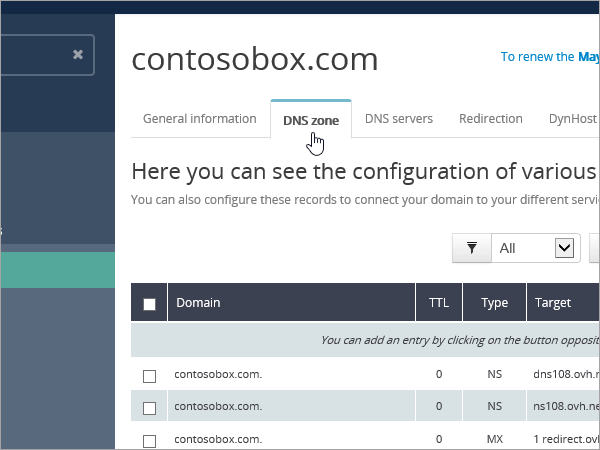

# Erstellen von DNS-Einträgen bei OVH für Microsoft

[] [Überprüfen Sie die häufig gestellten Fragen (FAQ) zu Domänen](../setup/domains-faq.md) , wenn Sie nicht finden, wonach Sie suchen. 
  
Wenn OVH Ihr DNS-Hostinganbieter ist, führen Sie die in diesem Artikel aufgeführten Schritte aus, um Ihre Domäne zu überprüfen und DNS-Einträge für E-Mail, Skype for Business Online und andere Dienste einzurichten.
  
Das sind die wichtigsten hinzuzufügenden Einträge. 
  
- [Erstellen von DNS-Einträgen bei OVH für Microsoft](#create-dns-records-at-ovh-for-microsoft)
    
- [Fügen Sie einen MX-Eintrag hinzu, damit E-Mails für Ihre Domäne an Microsoft geleitet werden.](#add-an-mx-record-so-email-for-your-domain-will-come-to-microsoft)
    
- [Hinzufügen der für Microsoft erforderlichen CNAME-Einträge](#add-the-cname-records-that-are-required-for-microsoft)
    
- [Hinzufügen eines TXT-Eintrags für SPF, um E-Mail-Spam zu verhindern](#add-a-txt-record-for-spf-to-help-prevent-email-spam)
    
- [Hinzufügen der für Microsoft erforderlichen zwei SRV-Einträge](#add-the-two-srv-records-that-are-required-for-microsoft)
    
Nachdem Sie diese Einträge bei OVH hinzugefügt haben, ist Ihre Domäne für die Verwendung mit Microsoft-Diensten eingerichtet.

  
> [!NOTE]
>  Normalerweise dauert es ungefähr 15 Minuten, bis DNS-Änderungen wirksam werden. Es kann jedoch gelegentlich länger dauern, bis eine von Ihnen vorgenommene Änderung im Internet im DNS-System aktualisiert wurde. Wenn nach dem Hinzufügen von DNS-Einträgen Probleme mit dem E-Mail-Fluss oder andere Probleme auftreten, lesen Sie [Behandeln von Problemen nach Änderung des Domänennamens oder von DNS-Einträgen](../get-help-with-domains/find-and-fix-issues.md). 
  
## Hinzufügen eines TXT-Eintrags zur Überprüfung

Bevor Sie Ihre Domäne mit Microsoft verwenden können, müssen wir uns vergewissern, dass Sie deren Besitzer sind. Ihre Fähigkeit, sich bei Ihrem Konto bei Ihrer Domänenregistrierungsstelle anzumelden und den DNS-Eintrag zu erstellen, ist für Microsoft der Nachweis, dass Sie der Besitzer der Domäne sind.
  
> [!NOTE]
> Dieser Eintrag wird nur verwendet, um zu überprüfen, ob Sie der Besitzer Ihrer Domäne sind. Er hat keine weiteren Auswirkungen. Sie können ihn später ggf. löschen. 
  
1. Um zu beginnen, navigieren Sie über [diesen Link](https://www.ovh.com/manager/) zu Ihrer Domänenseite bei OVH. Sie werden aufgefordert, sich anzumelden.
    
    
  
2. Wählen Sie unter **Domänen**den Namen der Domäne aus, die Sie bearbeiten möchten.
    
    
  
3. Wählen Sie **DNS-Zone**aus.
    
    
  
4. Wählen Sie **Eintrag hinzufügen**aus.
    
    
  
5. **Txt** auswählen
    
    
  
6. Geben Sie in den Feldern für den neuen Eintrag die Werte aus der folgenden Tabelle ein. Sie können die Werte auch kopieren und einfügen. Um einen TTL-Wert zuzuweisen, wählen Sie in der Dropdownliste **personalisiert** aus, und geben Sie den Wert in das Textfeld ein. 
    
    |**Eintragstyp**|**Unterdomäne**|**TTL**|**Wert**|
    |:-----|:-----|:-----|:-----|
    |TXT    |(leer lassen)    |3600 (Sekunden)    |MS=msxxxxxxxx    **Hinweis:** Dies ist ein Beispiel. Verwenden Sie hier Ihre spezifischen **Ziel-oder Punkt-zu-Adresse** -Werte aus der Tabelle.           [Wie finde ich diese Angabe?](../get-help-with-domains/information-for-dns-records.md)          |
   
7. Wählen Sie **bestätigen**aus. 
    
    
  
8. Warten Sie einige Minuten, bevor Sie fortfahren, damit der soeben erstellte Eintrag im Internet aktualisiert werden kann.
    
Nachdem Sie den Eintrag auf der Website Ihrer Domänenregistrierungsstelle hinzugefügt haben, kehren Sie zu Microsoft zurück und fordern Sie den Eintrag an.
  
Wenn Microsoft den richtigen TXT-Eintrag findet, ist die Domäne überprüft.
  
1. Wechseln Sie im Admin Center zur Seite **Einstellungen** \> <a href="https://go.microsoft.com/fwlink/p/?linkid=834818" target="_blank">Domänen</a>.
    
2. Wählen Sie auf der Seite **Domänen** die zu überprüfende Domäne aus. 
    
    
  
3. Wählen Sie auf der Seite **Setup** die Option **Setup starten** aus.
    
    
  
4. Wählen Sie auf der Seite **Domäne überprüfen** die Option **Überprüfen** aus.
    
    
  
> [!NOTE]
>  Normalerweise dauert es ungefähr 15 Minuten, bis DNS-Änderungen wirksam werden. Es kann jedoch gelegentlich länger dauern, bis eine von Ihnen vorgenommene Änderung im Internet im DNS-System aktualisiert wurde. Wenn nach dem Hinzufügen von DNS-Einträgen Probleme mit dem E-Mail-Fluss oder andere Probleme auftreten, lesen Sie [Behandeln von Problemen nach Änderung des Domänennamens oder von DNS-Einträgen](../get-help-with-domains/find-and-fix-issues.md). 
  
## Fügen Sie einen MX-Eintrag hinzu, damit E-Mails für Ihre Domäne an Microsoft geleitet werden.

1. Um zu beginnen, navigieren Sie über [diesen Link](https://www.ovh.com/manager/) zu Ihrer Domänenseite bei OVH. Sie werden aufgefordert, sich anzumelden.
    
    
  
2. Wählen Sie unter **Domänen**den Namen der Domäne aus, die Sie bearbeiten möchten.
    
    
  
3. Wählen Sie **DNS-Zone**aus.
    
    
  
4. Wählen Sie **Eintrag hinzufügen**aus.
    
    
  
5. Wählen Sie **MX**aus.
    
    
  
6. Geben Sie in den Feldern für den neuen Eintrag die Werte aus der folgenden Tabelle ein. Sie können die Werte auch kopieren und einfügen. Um einen TTL-Wert zuzuweisen, wählen Sie in der Dropdownliste **personalisiert** aus, und geben Sie den Wert in das Textfeld ein. 
    
    > [!NOTE]
    > Standardmäßig verwendet OVH relative Notation für das Ziel, wodurch der Domänenname am Ende des Ziel Datensatzes hinzugefügt wird. Um stattdessen absolute Notation zu verwenden, fügen Sie dem Zieldatensatz einen Punkt hinzu, wie in der folgenden Tabelle dargestellt. 
  
    |**Eintragstyp**|**Unterdomäne**|**TTL**|**Priorität**|**Target**|
    |:-----|:-----|:-----|:-----|:-----|
    |MX    |(leer lassen)    |3600 (Sekunden)    |10      Weitere Informationen zur Priorität finden Sie unter [Was ist MX-Priorität?](https://docs.microsoft.com/microsoft-365/admin/setup/domains-faq)   |\<Domänenschlüssel\>.mail.protection.outlook.com.    **Hinweis:** Rufen Sie Ihren * \<Domänenschlüssel\> * von Ihrem Microsoft-Konto ab.  [Wie finde ich diese Angabe?](../get-help-with-domains/information-for-dns-records.md)  |
   
    
  
7. Wählen Sie **Weiter** aus.
    
    
  
8. Wählen Sie **bestätigen**aus.
    
    
  
9. Wenn weitere MX-Einträge vorhanden sind, löschen Sie diese in der Liste auf der Seite **DNS zone**. Wählen Sie jeden Datensatz aus, und wählen Sie dann in der Spalte **Aktionen** das Symbol Papierkorb-kann **gelöscht** aus. 
    
    
  
10. Wählen Sie **bestätigen**aus.
    
## Hinzufügen der für Microsoft erforderlichen CNAME-Einträge

1. Um zu beginnen, navigieren Sie über [diesen Link](https://www.ovh.com/manager/) zu Ihrer Domänenseite bei OVH. Sie werden aufgefordert, sich anzumelden.
    
    
  
2. Wählen Sie unter **Domänen**den Namen der Domäne aus, die Sie bearbeiten möchten.
    
    
  
3. Wählen Sie **DNS-Zone**aus.
    
    
  
4. Wählen Sie **Eintrag hinzufügen**aus.
    
    
  
5. Wählen Sie **CNAME**aus.
    
    
  
6. Erstellen Sie den ersten CNAME-Eintrag.
    
    Geben Sie in den Feldern für den neuen Eintrag die Werte aus der ersten Zeile der folgenden Tabelle ein. Sie können die Werte auch kopieren und einfügen. Um einen TTL-Wert zuzuweisen, wählen Sie in der Dropdownliste **personalisiert** aus, und geben Sie den Wert in das Textfeld ein. 
    
    |**Eintragstyp**|**Unterdomäne**|**Ziel**|**TTL**|
    |:-----|:-----|:-----|:-----|
    |CNAME    |autodiscover    |autodiscover.outlook.com.    |3600 (Sekunden)    |
    |CNAME    |sip    |sipdir.online.lync.com.    |3600 (Sekunden)    |
    |CNAME    |lyncdiscover    |webdir.online.lync.com.    |3600 (Sekunden)    |
    |CNAME    |enterpriseregistration    |enterpriseregistration.windows.net.    |3600 (Sekunden)    |
    |CNAME    |enterpriseenrollment    |enterpriseenrollment-s.manage.microsoft.com.    |3600 (Sekunden)    |
   
    
  
7. Wählen Sie **Weiter** aus.
    
    
  
8. Wählen Sie **bestätigen**aus.
    
9. Wiederholen Sie die vorherigen Schritte, um die anderen fünf CNAME-Einträge zu erstellen.
    
    Geben Sie für jeden Eintrag die Werte aus der nächsten Zeile der Tabelle oben in die Felder für diesen Eintrag ein. Sie können die Werte auch kopieren und einfügen.
    
## Hinzufügen eines TXT-Eintrags für SPF, um E-Mail-Spam zu verhindern

> [!IMPORTANT]
> Es kann bei einer Domäne nur einen TXT-Eintrag für SPF geben. Wenn es bei Ihrer Domäne mehrere SPF-Einträge gibt, treten E-Mail-Fehler sowie Probleme bei der Übermittlung und Spamklassifizierung auf. Wenn es für Ihre Domäne bereits einen SPF-Eintrag gibt, erstellen Sie für Microsoft keinen neuen, Fügen Sie stattdessen die erforderlichen Microsoft-Werte zum aktuellen Datensatz hinzu, sodass Sie einen *einzelnen* SPF-Eintrag haben, der beide Wertegruppen enthält. 
  
1. Um zu beginnen, navigieren Sie über [diesen Link](https://www.ovh.com/manager/) zu Ihrer Domänenseite bei OVH. Sie werden aufgefordert, sich anzumelden.
    
    
  
2. Wählen Sie unter **Domänen**den Namen der Domäne aus, die Sie bearbeiten möchten.
    
    
  
3. Wählen Sie **DNS-Zone**aus.
    
    
  
4. Wählen Sie **Eintrag hinzufügen**aus.
    
    
  
5. Wählen Sie **txt**aus.
    
6. Geben Sie in den Feldern für den neuen Eintrag die folgenden Werte ein. Sie können die Werte auch kopieren und einfügen.
    
    |**Eintragstyp**|**Unterdomäne**|**TTL**|**TXT-Wert**|
    |:-----|:-----|:-----|:-----|
    |TXT    |(leer lassen)    |3600 (Sekunden)    |v=spf1 include:spf.protection.outlook.com -all    **Hinweis:** Es wird empfohlen, diesen Eintrag zu kopieren und einzufügen, damit alle Abstände korrekt übernommen werden.           |
   
    
  
7. Wählen Sie **Weiter** aus.
    
    
  
8. Wählen Sie **bestätigen**aus.
    
    
  
## Hinzufügen der für Microsoft erforderlichen zwei SRV-Einträge

1. Um zu beginnen, navigieren Sie über [diesen Link](https://www.ovh.com/manager/) zu Ihrer Domänenseite bei OVH. Sie werden aufgefordert, sich anzumelden.
    
    
  
2. Wählen Sie unter **Domänen**den Namen der Domäne aus, die Sie bearbeiten möchten.
    
    
  
3. Wählen Sie **DNS-Zone**aus.
    
    
  
4. Wählen Sie **Eintrag hinzufügen**aus.
    
    
  
5. Wählen Sie **SRV**aus.
    
    
  
6. Erstellen Sie den ersten SRV-Eintrag.
    
    Geben Sie in den Feldern für den neuen Eintrag die Werte aus der ersten Zeile der folgenden Tabelle ein. Sie können die Werte auch kopieren und einfügen. Um einen TTL-Wert zuzuweisen, wählen Sie in der Dropdownliste **personalisiert** aus, und geben Sie den Wert in das Textfeld ein. 
    
    |**Eintragstyp**|**Unterdomäne**|**Priority**|**Weight**|**Port**|**TTL**|**Ziel**|
    |:-----|:-----|:-----|:-----|:-----|:-----|:-----|
    |SRV (Dienst)    |_sip._tls    |100    |1    |443    |3600 (Sekunden)    |sipdir.online.lync.com.    |
    |SRV (Dienst)    |_sipfederationtls._tcp    |100    |1    |5061    |3600 (Sekunden)    |sipfed.online.lync.com.    |
       
    
  
7. Wählen Sie **Weiter** aus.
    
    
  
8. Wählen Sie **bestätigen**aus.
    
9. Wiederholen Sie die vorherigen Schritte, um den anderen SRV-Eintrag zu erstellen. Geben Sie die Werte aus der zweiten Zeile der Tabelle oben in die Felder für den zweiten Eintrag ein.
    
> [!NOTE]
>  Normalerweise dauert es ungefähr 15 Minuten, bis DNS-Änderungen wirksam werden. Es kann jedoch gelegentlich länger dauern, bis eine von Ihnen vorgenommene Änderung im Internet im DNS-System aktualisiert wurde. Wenn nach dem Hinzufügen von DNS-Einträgen Probleme mit dem E-Mail-Fluss oder andere Probleme auftreten, lesen Sie [Behandeln von Problemen nach Änderung des Domänennamens oder von DNS-Einträgen](../get-help-with-domains/find-and-fix-issues.md). 
  
