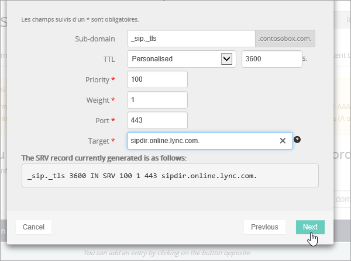

# Erstellen von DNS-Einträgen bei OVH für MicrosoftCreate DNS records at OVH for Microsoft

[] [Überprüfen Sie die häufig gestellten Fragen (FAQ) zu Domänen](../setup/domains-faq.md) , wenn Sie nicht finden, wonach Sie suchen.[Check the Domains FAQ](../setup/domains-faq.md) if you don't find what you're looking for. 
  
Wenn OVH Ihr DNS-Hostinganbieter ist, führen Sie die in diesem Artikel aufgeführten Schritte aus, um Ihre Domäne zu überprüfen und DNS-Einträge für E-Mail, Skype for Business Online und andere Dienste einzurichten.If OVH is your DNS hosting provider, follow the steps in this article to verify your domain and set up DNS records for email, Skype for Business Online, and so on.
  
Das sind die wichtigsten hinzuzufügenden Einträge.These are the main records to add. 
  
- [Erstellen von DNS-Einträgen bei OVH für MicrosoftCreate DNS records at OVH for Microsoft](#create-dns-records-at-ovh-for-microsoft)
    
- [Fügen Sie einen MX-Eintrag hinzu, damit E-Mails für Ihre Domäne an Microsoft geleitet werden.Add an MX record so email for your domain will come to Microsoft](#add-an-mx-record-so-email-for-your-domain-will-come-to-microsoft)
    
- [Hinzufügen der für Microsoft erforderlichen CNAME-EinträgeAdd the CNAME records that are required for Microsoft](#add-the-cname-records-that-are-required-for-microsoft)
    
- [Hinzufügen eines TXT-Eintrags für SPF, um E-Mail-Spam zu verhindernAdd a TXT record for SPF to help prevent email spam](#add-a-txt-record-for-spf-to-help-prevent-email-spam)
    
- [Hinzufügen der für Microsoft erforderlichen zwei SRV-EinträgeAdd the two SRV records that are required for Microsoft](#add-the-two-srv-records-that-are-required-for-microsoft)
    
Nachdem Sie diese Einträge bei OVH hinzugefügt haben, ist Ihre Domäne für die Verwendung mit Microsoft-Diensten eingerichtet.After you add these records at OVH, your domain will be set up to work with Microsoft services.

  
> [!NOTE]
>  Normalerweise dauert es ungefähr 15 Minuten, bis DNS-Änderungen wirksam werden. Es kann jedoch gelegentlich länger dauern, bis eine von Ihnen vorgenommene Änderung im Internet im DNS-System aktualisiert wurde. Wenn nach dem Hinzufügen von DNS-Einträgen Probleme mit dem E-Mail-Fluss oder andere Probleme auftreten, lesen Sie [Behandeln von Problemen nach Änderung des Domänennamens oder von DNS-Einträgen](../get-help-with-domains/find-and-fix-issues.md).Typically it takes about 15 minutes for DNS changes to take effect. However, it can occasionally take longer for a change you've made to update across the Internet's DNS system. If you're having trouble with mail flow or other issues after adding DNS records, see [Troubleshoot issues after changing your domain name or DNS records](../get-help-with-domains/find-and-fix-issues.md). 
  
## Hinzufügen eines TXT-Eintrags zur ÜberprüfungAdd a TXT record for verification

Bevor Sie Ihre Domäne mit Microsoft verwenden können, müssen wir uns vergewissern, dass Sie deren Besitzer sind. Ihre Fähigkeit, sich bei Ihrem Konto bei Ihrer Domänenregistrierungsstelle anzumelden und den DNS-Eintrag zu erstellen, ist für Microsoft der Nachweis, dass Sie der Besitzer der Domäne sind.Before you use your domain with Microsoft, we have to make sure that you own it. Your ability to log in to your account at your domain registrar and create the DNS record proves to Microsoft that you own the domain.
  
> [!NOTE]
> Dieser Eintrag wird nur verwendet, um zu überprüfen, ob Sie der Besitzer Ihrer Domäne sind. Er hat keine weiteren Auswirkungen. Sie können ihn später ggf. löschen.This record is used only to verify that you own your domain; it doesn't affect anything else. You can delete it later, if you like. 
  
1. Um zu beginnen, navigieren Sie über [diesen Link](https://www.ovh.com/manager/) zu Ihrer Domänenseite bei OVH. Sie werden aufgefordert, sich anzumelden.To get started, go to your domains page in OVH by using [this link](https://www.ovh.com/manager/). You'll be prompted to log in.
    
    
  
2. Wählen Sie unter **Domänen**den Namen der Domäne aus, die Sie bearbeiten möchten.Under **Domains**, select the name of the domain that you want edit.
    
    
  
3. Wählen Sie **DNS-Zone**aus.Select **DNS zone**.
    
    
  
4. Wählen Sie **Eintrag hinzufügen**aus.Select **Add an entry**.
    
    
  
5. **Txt** auswählenSelect **TXT**
    
    
  
6. Geben Sie in den Feldern für den neuen Eintrag die Werte aus der folgenden Tabelle ein. Sie können die Werte auch kopieren und einfügen.In the boxes for the new record, type or copy and paste the values from the following table. Um einen TTL-Wert zuzuweisen, wählen Sie in der Dropdownliste **personalisiert** aus, und geben Sie den Wert in das Textfeld ein.To assign a TTL value, choose **Personalized** from the drop-down list, and then type the value in the text box. 
    
    |**Eintragstyp****Record type**|**Unterdomäne****Sub-domain**|**TTL****TTL**|**Wert****Value**|
    |:-----|:-----|:-----|:-----|
    |TXTTXT    |(leer lassen)(leave blank)    |3600 (Sekunden)3600 (seconds)    |MS=msxxxxxxxxMS=msxxxxxxxx    **Hinweis:** Dies ist ein Beispiel.**Note:** This is an example. Verwenden Sie hier Ihre spezifischen **Ziel-oder Punkt-zu-Adresse** -Werte aus der Tabelle.Use your specific **Destination or Points to Address** value here, from the table.           [Wie finde ich diese Angabe?How do I find this?](../get-help-with-domains/information-for-dns-records.md)          |
   
7. Wählen Sie **bestätigen**aus.Select **Confirm**. 
    
    
  
8. Warten Sie einige Minuten, bevor Sie fortfahren, damit der soeben erstellte Eintrag im Internet aktualisiert werden kann.Wait a few minutes before you continue, so that the record you just created can update across the Internet.
    
Nachdem Sie den Eintrag auf der Website Ihrer Domänenregistrierungsstelle hinzugefügt haben, kehren Sie zu Microsoft zurück und fordern Sie den Eintrag an.Now that you've added the record at your domain registrar's site, you'll go back to Microsoft and request the record.
  
Wenn Microsoft den richtigen TXT-Eintrag findet, ist die Domäne überprüft.When Microsoft finds the correct TXT record, your domain is verified.
  
1. Wechseln Sie im Admin Center zur Seite **Einstellungen** \> <a href="https://go.microsoft.com/fwlink/p/?linkid=834818" target="_blank">Domänen</a>.In the admin center, go to the **Settings** \> <a href="https://go.microsoft.com/fwlink/p/?linkid=834818" target="_blank">Domains</a> page.
    
2. Wählen Sie auf der Seite **Domänen** die zu überprüfende Domäne aus.On the **Domains** page, select the domain that you are verifying. 
    
    
  
3. Wählen Sie auf der Seite **Setup** die Option **Setup starten** aus.On the **Setup** page, select **Start setup**.
    
    
  
4. Wählen Sie auf der Seite **Domäne überprüfen** die Option **Überprüfen** aus.On the **Verify domain** page, select **Verify**.
    
    
  
> [!NOTE]
>  Normalerweise dauert es ungefähr 15 Minuten, bis DNS-Änderungen wirksam werden. Es kann jedoch gelegentlich länger dauern, bis eine von Ihnen vorgenommene Änderung im Internet im DNS-System aktualisiert wurde. Wenn nach dem Hinzufügen von DNS-Einträgen Probleme mit dem E-Mail-Fluss oder andere Probleme auftreten, lesen Sie [Behandeln von Problemen nach Änderung des Domänennamens oder von DNS-Einträgen](../get-help-with-domains/find-and-fix-issues.md).Typically it takes about 15 minutes for DNS changes to take effect. However, it can occasionally take longer for a change you've made to update across the Internet's DNS system. If you're having trouble with mail flow or other issues after adding DNS records, see [Troubleshoot issues after changing your domain name or DNS records](../get-help-with-domains/find-and-fix-issues.md). 
  
## Fügen Sie einen MX-Eintrag hinzu, damit E-Mails für Ihre Domäne an Microsoft geleitet werden.Add an MX record so email for your domain will come to Microsoft

1. Um zu beginnen, navigieren Sie über [diesen Link](https://www.ovh.com/manager/) zu Ihrer Domänenseite bei OVH. Sie werden aufgefordert, sich anzumelden.To get started, go to your domains page in OVH by using [this link](https://www.ovh.com/manager/). You'll be prompted to log in.
    
    
  
2. Wählen Sie unter **Domänen**den Namen der Domäne aus, die Sie bearbeiten möchten.Under **Domains**, select the name of the domain that you want edit.
    
    
  
3. Wählen Sie **DNS-Zone**aus.Select **DNS zone**.
    
    
  
4. Wählen Sie **Eintrag hinzufügen**aus.Select **Add an entry**.
    
    
  
5. Wählen Sie **MX**aus.Select **MX**.
    
    
  
6. Geben Sie in den Feldern für den neuen Eintrag die Werte aus der folgenden Tabelle ein. Sie können die Werte auch kopieren und einfügen.In the boxes for the new record, type or copy and paste the values from the following table. Um einen TTL-Wert zuzuweisen, wählen Sie in der Dropdownliste **personalisiert** aus, und geben Sie den Wert in das Textfeld ein.To assign a TTL value, choose **Personalized** from the drop-down list, and then type the value in the text box. 
    
    > [!NOTE]
    > Standardmäßig verwendet OVH relative Notation für das Ziel, wodurch der Domänenname am Ende des Ziel Datensatzes hinzugefügt wird.By default OVH uses relative notation for the target, which adds the domain name to the end of the target record. Um stattdessen absolute Notation zu verwenden, fügen Sie dem Zieldatensatz einen Punkt hinzu, wie in der folgenden Tabelle dargestellt.To use absolute notation instead, add a dot to the target record as shown in the table below. 
  
    |**Eintragstyp****Record type**|**Unterdomäne****Sub-domain**|**TTL****TTL**|**Priorität****Priority**|**Target****Target**|
    |:-----|:-----|:-----|:-----|:-----|
    |MXMX    |(leer lassen)(leave blank)    |3600 (Sekunden)3600 (seconds)    |10  10    Weitere Informationen zur Priorität finden Sie unter [Was ist MX-Priorität?](https://docs.microsoft.com/microsoft-365/admin/setup/domains-faq)For more information about priority, see [What is MX priority?](https://docs.microsoft.com/microsoft-365/admin/setup/domains-faq)   |\<domain-key\>. Mail.Protection.Outlook.com.\<domain-key\>.mail.protection.outlook.com.    **Hinweis:** Holen Sie sich Ihr *\<domain-key\>* Microsoft-Konto.**Note:** Get your  *\<domain-key\>*  from your Microsoft account.  [Wie finde ich diese Angabe?How do I find this?](../get-help-with-domains/information-for-dns-records.md)  |
   
    
  
7. Wählen Sie **Weiter** aus.Select **Next**.
    
    
  
8. Wählen Sie **bestätigen**aus.Select **Confirm**.
    
    
  
9. Wenn weitere MX-Einträge vorhanden sind, löschen Sie diese in der Liste auf der Seite **DNS zone**.If there are any other MX records, delete them all in the list on the **DNS zone** page. Wählen Sie jeden Datensatz aus, und wählen Sie dann in der Spalte **Aktionen** das Symbol Papierkorb-kann **gelöscht** aus.Select each record and then, in the **Actions** column, select the trash-can **Delete** icon. 
    
    
  
10. Wählen Sie **bestätigen**aus.Select **Confirm**.
    
## Hinzufügen der für Microsoft erforderlichen CNAME-EinträgeAdd the CNAME records that are required for Microsoft

1. Um zu beginnen, navigieren Sie über [diesen Link](https://www.ovh.com/manager/) zu Ihrer Domänenseite bei OVH. Sie werden aufgefordert, sich anzumelden.To get started, go to your domains page in OVH by using [this link](https://www.ovh.com/manager/). You'll be prompted to log in.
    
    
  
2. Wählen Sie unter **Domänen**den Namen der Domäne aus, die Sie bearbeiten möchten.Under **Domains**, select the name of the domain that you want edit.
    
    
  
3. Wählen Sie **DNS-Zone**aus.Select **DNS zone**.
    
    
  
4. Wählen Sie **Eintrag hinzufügen**aus.Select **Add an entry**.
    
    
  
5. Wählen Sie **CNAME**aus.Select **CNAME**.
    
    
  
6. Erstellen Sie den ersten CNAME-Eintrag.Create the first CNAME record.
    
    Geben Sie in den Feldern für den neuen Eintrag die Werte aus der ersten Zeile der folgenden Tabelle ein. Sie können die Werte auch kopieren und einfügen.In the boxes for the new record, type or copy and paste the values from the first row of the following table. Um einen TTL-Wert zuzuweisen, wählen Sie in der Dropdownliste **personalisiert** aus, und geben Sie den Wert in das Textfeld ein.To assign a TTL value, choose **Personalized** from the drop-down list, and then type the value in the text box. 
    
    |**Eintragstyp****Record type**|**Unterdomäne****Sub-domain**|**Ziel****Target**|**TTL****TTL**|
    |:-----|:-----|:-----|:-----|
    |CNAMECNAME    |autodiscoverautodiscover    |autodiscover.outlook.com.autodiscover.outlook.com.    |3600 (Sekunden)3600 seconds    |
    |CNAMECNAME    |sipsip    |sipdir.online.lync.com.sipdir.online.lync.com.    |3600 (Sekunden)3600 seconds    |
    |CNAMECNAME    |lyncdiscoverlyncdiscover    |webdir.online.lync.com.webdir.online.lync.com.    |3600 (Sekunden)3600 seconds    |
    |CNAMECNAME    |enterpriseregistrationenterpriseregistration    |enterpriseregistration.windows.net.enterpriseregistration.windows.net.    |3600 (Sekunden)3600 seconds    |
    |CNAMECNAME    |enterpriseenrollmententerpriseenrollment    |enterpriseenrollment-s.manage.microsoft.com.enterpriseenrollment-s.manage.microsoft.com.    |3600 (Sekunden)3600 seconds    |
   
    
  
7. Wählen Sie **Weiter** aus.Select **Next**.
    
    
  
8. Wählen Sie **bestätigen**aus.Select **Confirm**.
    
9. Wiederholen Sie die vorherigen Schritte, um die anderen fünf CNAME-Einträge zu erstellen.Repeat the previous steps to create the other five CNAME records.
    
    Geben Sie für jeden Eintrag die Werte aus der nächsten Zeile der Tabelle oben in die Felder für diesen Eintrag ein. Sie können die Werte auch kopieren und einfügen.For each record, type or copy and paste the values from the next row of the table above into the boxes for that record.
    
## Hinzufügen eines TXT-Eintrags für SPF, um E-Mail-Spam zu verhindernAdd a TXT record for SPF to help prevent email spam

> [!IMPORTANT]
> Es kann bei einer Domäne nur einen TXT-Eintrag für SPF geben.You cannot have more than one TXT record for SPF for a domain. Wenn es bei Ihrer Domäne mehrere SPF-Einträge gibt, treten E-Mail-Fehler sowie Probleme bei der Übermittlung und Spamklassifizierung auf.If your domain has more than one SPF record, you'll get email errors, as well as delivery and spam classification issues. Wenn es für Ihre Domäne bereits einen SPF-Eintrag gibt, erstellen Sie für Microsoft keinen neuen,If you already have an SPF record for your domain, don't create a new one for Microsoft. Fügen Sie stattdessen die erforderlichen Microsoft-Werte zum aktuellen Datensatz hinzu, sodass Sie einen *einzelnen* SPF-Eintrag haben, der beide Wertegruppen enthält.Instead, add the required Microsoft values to the current record so that you have a  *single*  SPF record that includes both sets of values. 
  
1. Um zu beginnen, navigieren Sie über [diesen Link](https://www.ovh.com/manager/) zu Ihrer Domänenseite bei OVH. Sie werden aufgefordert, sich anzumelden.To get started, go to your domains page in OVH by using [this link](https://www.ovh.com/manager/). You'll be prompted to log in.
    
    
  
2. Wählen Sie unter **Domänen**den Namen der Domäne aus, die Sie bearbeiten möchten.Under **Domains**, select the name of the domain that you want edit.
    
    
  
3. Wählen Sie **DNS-Zone**aus.Select **DNS zone**.
    
    
  
4. Wählen Sie **Eintrag hinzufügen**aus.Select **Add an entry**.
    
    
  
5. Wählen Sie **txt**aus.Select **TXT**.
    
6. Geben Sie in den Feldern für den neuen Eintrag die folgenden Werte ein. Sie können die Werte auch kopieren und einfügen.In the boxes for the new record, type or copy and paste the following values.
    
    |**Eintragstyp****Record type**|**Unterdomäne****Sub-domain**|**TTL****TTL**|**TXT-Wert****TXT Value**|
    |:-----|:-----|:-----|:-----|
    |TXTTXT    |(leer lassen)(leave blank)    |3600 (Sekunden)3600 (seconds)    |v=spf1 include:spf.protection.outlook.com -allv=spf1 include:spf.protection.outlook.com -all    **Hinweis:** Es wird empfohlen, diesen Eintrag zu kopieren und einzufügen, damit alle Abstände korrekt übernommen werden.**Note:** We recommend copying and pasting this entry, so that all of the spacing stays correct.           |
   
    
  
7. Wählen Sie **Weiter** aus.Select **Next**.
    
    
  
8. Wählen Sie **bestätigen**aus.Select **Confirm**.
    
    
  
## Hinzufügen der für Microsoft erforderlichen zwei SRV-EinträgeAdd the two SRV records that are required for Microsoft

1. Um zu beginnen, navigieren Sie über [diesen Link](https://www.ovh.com/manager/) zu Ihrer Domänenseite bei OVH. Sie werden aufgefordert, sich anzumelden.To get started, go to your domains page in OVH by using [this link](https://www.ovh.com/manager/). You'll be prompted to log in.
    
    
  
2. Wählen Sie unter **Domänen**den Namen der Domäne aus, die Sie bearbeiten möchten.Under **Domains**, select the name of the domain that you want edit.
    
    
  
3. Wählen Sie **DNS-Zone**aus.Select **DNS zone**.
    
    
  
4. Wählen Sie **Eintrag hinzufügen**aus.Select **Add an entry**.
    
    
  
5. Wählen Sie **SRV**aus.Select **SRV**.
    
    
  
6. Erstellen Sie den ersten SRV-Eintrag.Create the first SRV record.
    
    Geben Sie in den Feldern für den neuen Eintrag die Werte aus der ersten Zeile der folgenden Tabelle ein. Sie können die Werte auch kopieren und einfügen.In the boxes for the new record, type or copy and paste the values from the first row of the following table. Um einen TTL-Wert zuzuweisen, wählen Sie in der Dropdownliste **personalisiert** aus, und geben Sie den Wert in das Textfeld ein.To assign a TTL value, choose **Personalized** from the drop-down list, and then type the value in the text box. 
    
    |**Eintragstyp****Record type**|**Unterdomäne****Sub-domain**|**Priority****Priority**|**Weight****Weight**|**Port****Port**|**TTL****TTL**|**Ziel****Target**|
    |:-----|:-----|:-----|:-----|:-----|:-----|:-----|
    |SRV (Dienst)SRV (Service)    |_sip._tls_sip._tls    |100100    |1 1    |443443    |3600 (Sekunden)3600 (seconds)    |sipdir.online.lync.com.sipdir.online.lync.com.    |
    |SRV (Dienst)SRV (Service)    |_sipfederationtls._tcp_sipfederationtls._tcp    |100100    |1 1    |50615061    |3600 (Sekunden)3600 (seconds)    |sipfed.online.lync.com.sipfed.online.lync.com.    |
       
    
  
7. Wählen Sie **Weiter** aus.Select **Next**.
    
    
  
8. Wählen Sie **bestätigen**aus.Select **Confirm**.
    
9. Wiederholen Sie die vorherigen Schritte, um den anderen SRV-Eintrag zu erstellen. Geben Sie die Werte aus der zweiten Zeile der Tabelle oben in die Felder für den zweiten Eintrag ein.Repeat the previous steps to create the other SRV record. Type or copy and paste the values from the second row of the table above into the boxes for the second record.
    
> [!NOTE]
>  Normalerweise dauert es ungefähr 15 Minuten, bis DNS-Änderungen wirksam werden. Es kann jedoch gelegentlich länger dauern, bis eine von Ihnen vorgenommene Änderung im Internet im DNS-System aktualisiert wurde. Wenn nach dem Hinzufügen von DNS-Einträgen Probleme mit dem E-Mail-Fluss oder andere Probleme auftreten, lesen Sie [Behandeln von Problemen nach Änderung des Domänennamens oder von DNS-Einträgen](../get-help-with-domains/find-and-fix-issues.md).Typically it takes about 15 minutes for DNS changes to take effect. However, it can occasionally take longer for a change you've made to update across the Internet's DNS system. If you're having trouble with mail flow or other issues after adding DNS records, see [Troubleshoot issues after changing your domain name or DNS records](../get-help-with-domains/find-and-fix-issues.md). 
  
