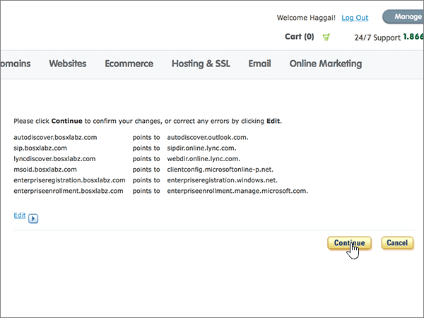

# Erstellen von DNS-Einträgen bei Register.com für MicrosoftCreate DNS records at Register.com for Microsoft

 **[Überprüfen Sie die häufig gestellten Fragen (FAQ) zu Domänen](../setup/domains-faq.md)**, wenn Sie nicht finden, wonach Sie suchen.**[Check the Domains FAQ](../setup/domains-faq.md)** if you don't find what you're looking for. 
  
Wenn Register.com Ihr DNS-Hostinganbieter ist, führen Sie die in diesem Artikel aufgeführten Schritte aus, um Ihre Domäne zu überprüfen und DNS-Einträge für E-Mail, Skype for Business Online und andere Dienste einzurichten.If Register.com is your DNS hosting provider, follow the steps in this article to verify your domain and set up DNS records for email, Skype for Business Online, and so on.
  
Das sind die wichtigsten hinzuzufügenden Einträge.These are the main records to add. Führen Sie die folgenden Schritte aus, oder [schauen Sie sich das Video an](https://support.microsoft.com/office/7448dd9e-c0e7-4d5e-a7e9-f0e4715433c4).Follow the steps below or [watch the video](https://support.microsoft.com/office/7448dd9e-c0e7-4d5e-a7e9-f0e4715433c4).
  
- [Hinzufügen eines TXT-Eintrags bei Register.com, um zu überprüfen, ob Sie der Besitzer der Domäne sindAdd a TXT record at Register.com to verify that you own the domain](#add-a-txt-record-at-registercom-to-verify-that-you-own-the-domain)
    
- [Fügen Sie einen MX-Eintrag hinzu, damit E-Mails für Ihre Domäne an Microsoft geleitet werden.Add an MX record so email for your domain will come to Microsoft](#add-an-mx-record-so-email-for-your-domain-will-come-to-microsoft)
    
- [Hinzufügen der für Microsoft erforderlichen CNAME-EinträgeAdd the CNAME records that are required for Microsoft](#add-the-cname-records-that-are-required-for-microsoft)
    
- [Hinzufügen eines TXT-Eintrags für SPF, um E-Mail-Spam zu verhindernAdd a TXT record for SPF to help prevent email spam](#add-a-txt-record-for-spf-to-help-prevent-email-spam)

- [Hinzufügen der für Microsoft erforderlichen zwei SRV-EinträgeAdd the two SRV records that are required for Microsoft](#add-the-two-srv-records-that-are-required-for-microsoft)
    
Nachdem Sie diese Einträge bei Register.com hinzugefügt haben, ist Ihre Domäne für die Verwendung mit Microsoft-Diensten eingerichtet.After you add these records at Register.com, your domain will be set up to work with Microsoft services.
  

  
> [!NOTE]
> Typically it takes about 15 minutes for DNS changes to take effect.Typically it takes about 15 minutes for DNS changes to take effect. However, it can occasionally take longer for a change you've made to update across the Internet's DNS system.However, it can occasionally take longer for a change you've made to update across the Internet's DNS system. If you're having trouble with mail flow or other issues after adding DNS records, see [Find and fix issues after adding your domain or DNS records](../get-help-with-domains/find-and-fix-issues.md).If you're having trouble with mail flow or other issues after adding DNS records, see [Find and fix issues after adding your domain or DNS records](../get-help-with-domains/find-and-fix-issues.md). 
  
## Hinzufügen eines TXT-Eintrags bei Register.com, um zu überprüfen, ob Sie der Besitzer der Domäne sindAdd a TXT record at Register.com to verify that you own the domain

Before you use your domain with Microsoft, we have to make sure that you own it.Before you use your domain with Microsoft, we have to make sure that you own it. Your ability to log in to your account at your domain registrar and create the DNS record proves to Microsoft that you own the domain.Your ability to log in to your account at your domain registrar and create the DNS record proves to Microsoft that you own the domain.
  
> [!NOTE]
> This record is used only to verify that you own your domain; it doesn't affect anything else.This record is used only to verify that you own your domain; it doesn't affect anything else. You can delete it later, if you like.You can delete it later, if you like. 
  
Führen Sie die folgenden Schritte aus, oder [schauen Sie sich das Video an (beginnen Sie bei 0:44)](https://support.microsoft.com/office/7448dd9e-c0e7-4d5e-a7e9-f0e4715433c4).Follow the steps below or [watch the video (start at 0:44)](https://support.microsoft.com/office/7448dd9e-c0e7-4d5e-a7e9-f0e4715433c4).
  
1. Um zu beginnen, navigieren Sie über [diesen Link](https://www.register.com/myaccount/) zu Ihrer Domänenseite bei Register.com.To get started, go to your domains page at Register.com by using [this link](https://www.register.com/myaccount/). Sie werden aufgefordert, sich anzumelden.You'll be prompted to sign in.
    
2. Wählen Sie **Domänen** aus.Select **Domains**.
    
3. Wählen Sie **Manage**aus.Select **Manage**.
    
4. Suchen Sie nach der Zeile, die den Namen der Domäne enthält, die Sie ändern möchten. Wählen Sie dann in dieser Zeile **Verwalten**aus.Find the row that contains the name of the domain that you want to modify; and then, in that row, select **Manage**.
    
5. Führen Sie einen Bildlauf nach unten zum Abschnitt **Erweiterte technische Einstellungen** durch, und wählen Sie dann **Edit TXT Records (SPF)** aus.Scroll down to the **Advanced Technical Settings** section, and then select **Edit TXT Records (SPF)**.
    
6. In the boxes for the new record, type or copy and paste the values from the following table.In the boxes for the new record, type or copy and paste the values from the following table.
    
    |||
    |:-----|:-----|
    |**Host Name****Host Name**   |**TXT Record****TXT Record**   |
    |@    |MS=ms *XXXXXXXX*MS=ms *XXXXXXXX*    **Note:** This is an example.**Note:** This is an example. Use your specific **Destination or Points to Address** value here, from the table.Use your specific **Destination or Points to Address** value here, from the table. [How do I find this?How do I find this?](../get-help-with-domains/information-for-dns-records.md)          |
   
7. Wählen Sie **weiter**aus.Select **Continue**.
    
8. Wählen Sie auf der nächsten Seite erneut **Continue** aus, um Ihre Änderungen zu bestätigen.On the next page, select **Continue** again to confirm your changes. 
    
9. Warten Sie einige Minuten, bevor Sie fortfahren, damit der soeben erstellte Eintrag im Internet aktualisiert werden kann.Wait a few minutes before you continue, so that the record you just created can update across the Internet.
    
Nachdem Sie den Eintrag auf der Website Ihrer Domänenregistrierungsstelle hinzugefügt haben, kehren Sie zu Microsoft zurück und fordern Sie den Eintrag an.Now that you've added the record at your domain registrar's site, you'll go back to Microsoft and request the record.
  
Wenn Microsoft den richtigen TXT-Eintrag findet, ist die Domäne überprüft.When Microsoft finds the correct TXT record, your domain is verified.
  
1. Wechseln Sie im Admin Center zur Seite **Einstellungen** \> <a href="https://go.microsoft.com/fwlink/p/?linkid=834818" target="_blank">Domänen</a>.In the admin center, go to the **Settings** \> <a href="https://go.microsoft.com/fwlink/p/?linkid=834818" target="_blank">Domains</a> page.
    
2. Wählen Sie auf der Seite **Domänen** die zu überprüfende Domäne aus.On the **Domains** page, select the domain that you are verifying. 
    
3. Wählen Sie auf der Seite **Setup** die Option **Setup starten** aus.On the **Setup** page, select **Start setup**.
    
4. Wählen Sie auf der Seite **Domäne überprüfen** die Option **Überprüfen** aus.On the **Verify domain** page, select **Verify**.
    
> [!NOTE]
> Typically it takes about 15 minutes for DNS changes to take effect.Typically it takes about 15 minutes for DNS changes to take effect. However, it can occasionally take longer for a change you've made to update across the Internet's DNS system.However, it can occasionally take longer for a change you've made to update across the Internet's DNS system. If you're having trouble with mail flow or other issues after adding DNS records, see [Find and fix issues after adding your domain or DNS records](../get-help-with-domains/find-and-fix-issues.md).If you're having trouble with mail flow or other issues after adding DNS records, see [Find and fix issues after adding your domain or DNS records](../get-help-with-domains/find-and-fix-issues.md). 
  
## Fügen Sie einen MX-Eintrag hinzu, damit E-Mails für Ihre Domäne an Microsoft geleitet werden.Add an MX record so email for your domain will come to Microsoft

Führen Sie die folgenden Schritte aus, oder [schauen Sie sich das Video an (beginnen Sie bei 3:32)](https://support.microsoft.com/office/7448dd9e-c0e7-4d5e-a7e9-f0e4715433c4).Follow the steps below or [watch the video (start at 3:32)](https://support.microsoft.com/office/7448dd9e-c0e7-4d5e-a7e9-f0e4715433c4).
  
1. Um zu beginnen, navigieren Sie über [diesen Link](https://www.register.com/myaccount/) zu Ihrer Domänenseite bei Register.com.To get started, go to your domains page at Register.com by using [this link](https://www.register.com/myaccount/). Sie werden aufgefordert, sich anzumelden.You'll be prompted to sign in.
    
2. Wählen Sie **Domänen** aus.Select **Domains**.
    
3. Wählen Sie **Manage**aus.Select **Manage**.
    
4. Suchen Sie nach der Zeile, die den Namen der Domäne enthält, die Sie ändern möchten. Wählen Sie dann in dieser Zeile **Verwalten**aus.Find the row that contains the name of the domain that you want to modify; and then, in that row, select **Manage**.
    
5. Führen Sie einen Bildlauf zum Abschnitt **Erweiterte technische Einstellungen** durch, und wählen Sie dann **e-Mail-Exchanger-Einträge bearbeiten**aus.Scroll to the **Advanced Technical Settings** section, and then select **Edit Mail Exchanger Records**.
    
    
  
6. Geben Sie in den Feldern für den neuen Eintrag die Werte aus der folgenden Tabelle ein. Sie können die Werte auch kopieren und einfügen.In the boxes for the new record, type or copy and paste the values from the following table.
    
    (Wählen Sie in der Dropdownliste den Wert **Priority** aus.)(Choose the **Priority** value from the drop-down list.) 
    
    |\*\*\*\*Host Name\*\*\*\*\*\*\*\*Host Name\*\*\*\*|\*\*\*\*Priority\*\*\*\*\*\*\*\*Priority\*\*\*\*|\*\*\*\*Mail Server\*\*\*\*\*\*\*\*Mail Server\*\*\*\*|
    |:-----|:-----|:-----|
    |@    |HighHigh    Weitere Informationen zur Priorität finden Sie unter [Was ist MX-Priorität?](https://docs.microsoft.com/microsoft-365/admin/setup/domains-faq)For more information about priority, see [What is MX priority?](https://docs.microsoft.com/microsoft-365/admin/setup/domains-faq)   | *\<domain-key\>*. Mail.Protection.Outlook.com*\<domain-key\>*  .mail.protection.outlook.com      **Hinweis:** Holen Sie sich Ihr \<*domain-key*\> Microsoft-Konto.**Note:** Get your \<*domain-key*\> from your Microsoft account.   [Wie finde ich diese Angabe?How do I find this?](../get-help-with-domains/information-for-dns-records.md)          |
   
    
  
7. Wenn bereits andere MX-Einträge aufgeführt sind, wählen Sie jeden dieser Einträge zum Löschen aus.If there were any other MX records already listed, select each of those records to be deleted.
    
    
  
8. Wählen Sie **weiter**aus.Select **Continue**.
    
    
  
9. Wählen Sie auf der nächsten Seite erneut **Continue** aus, um die Änderungen zu bestätigen und zu speichern.On the next page, select **Continue** again to confirm and save your changes. 
    
    
  
## Hinzufügen der für Microsoft erforderlichen CNAME-EinträgeAdd the CNAME records that are required for Microsoft

Führen Sie die folgenden Schritte aus, oder [schauen Sie sich das Video an (beginnen Sie bei 4:23)](https://support.microsoft.com/office/7448dd9e-c0e7-4d5e-a7e9-f0e4715433c4).Follow the steps below or [watch the video (start at 4:23)](https://support.microsoft.com/office/7448dd9e-c0e7-4d5e-a7e9-f0e4715433c4).
  
1. Um zu beginnen, navigieren Sie über [diesen Link](https://www.register.com/myaccount/) zu Ihrer Domänenseite bei Register.com.To get started, go to your domains page at Register.com by using [this link](https://www.register.com/myaccount/). Sie werden aufgefordert, sich anzumelden.You'll be prompted to sign in.
    
2. Wählen Sie **Domänen** aus.Select **Domains**.
    
3. Wählen Sie **Manage**aus.Select **Manage**.
    
4. Suchen Sie nach der Zeile, die den Namen der Domäne enthält, die Sie ändern möchten. Wählen Sie dann in dieser Zeile **Verwalten**aus.Find the row that contains the name of the domain that you want to modify; and then, in that row, select **Manage**.
    
5. Scrollen Sie zum Abschnitt **Erweiterte technische Einstellungen** , und wählen Sie dann **Bearbeiten von Domänen Alias Einträgen**aus.Scroll to the **Advanced Technical Settings** section, and then select **Edit Domain Aliases Records**.
    
    
  
6. Wählen Sie **Weitere Domänenaliase hinzufügen**aus.Select **Add more domain aliases**.
    
    
  
7. Fügen Sie die erforderlichen CNAME-Einträge hinzu.Add the required CNAME records.
    
    Geben Sie in den Feldern für den neuen Eintrag die Werte aus der ersten Zeile der folgenden Tabelle ein. Sie können die Werte auch kopieren und einfügen.In the boxes for the new record, type or copy and paste the values from the first row of the following table.
    
    |\*\*\*\*Erstes Feld (ohne Beschriftung)\*\*\*\*\*\*\*\*First field (unlabeled)\*\*\*\*|\*\*\*\*Points to\*\*\*\*\*\*\*\*Points to\*\*\*\*|
    |:-----|:-----|
    |autodiscoverautodiscover    |autodiscover.outlook.comautodiscover.outlook.com       |
    |sipsip    |sipdir.online.lync.comsipdir.online.lync.com       |
    |lyncdiscoverlyncdiscover    |webdir.online.lync.comwebdir.online.lync.com      |
    |enterpriseregistrationenterpriseregistration    |enterpriseregistration.windows.netenterpriseregistration.windows.net       |
    |enterpriseenrollmententerpriseenrollment    |enterpriseenrollment-s.manage.microsoft.comenterpriseenrollment-s.manage.microsoft.com       |
   
     
  
8. Wenn Sie alle benötigten CNAME-Einträge hinzugefügt haben, wählen Sie **weiter**aus.When you have added all of the CNAME records that you need, select **Continue**.
    
    
  
9. Wählen Sie auf der nächsten Seite erneut **Continue** aus, um die Änderungen zu bestätigen und zu speichern.On the next page, select **Continue** again to confirm and save your changes. 
    
    
  
## Hinzufügen eines TXT-Eintrags für SPF, um E-Mail-Spam zu verhindernAdd a TXT record for SPF to help prevent email spam

> [!IMPORTANT]
> Es kann bei einer Domäne nur einen TXT-Eintrag für SPF geben.You cannot have more than one TXT record for SPF for a domain. Wenn es bei Ihrer Domäne mehrere SPF-Einträge gibt, treten E-Mail-Fehler sowie Probleme bei der Übermittlung und Spamklassifizierung auf.If your domain has more than one SPF record, you'll get email errors, as well as delivery and spam classification issues. Wenn es für Ihre Domäne bereits einen SPF-Eintrag gibt, erstellen Sie für Microsoft keinen neuen,If you already have an SPF record for your domain, don't create a new one for Microsoft. sondern fügen Sie die erforderlichen Microsoft-Werte dem aktuellen Eintrag hinzu. Damit verfügen Sie über einen einzigen SPF-Eintrag, in dem beide Wertemengen enthalten sind.Instead, add the required Microsoft values to the current record so that you have a single SPF record that includes both sets of values.  
  
Führen Sie die folgenden Schritte aus, oder [schauen Sie sich das Video an (beginnen Sie bei 5:12)](https://support.microsoft.com/office/7448dd9e-c0e7-4d5e-a7e9-f0e4715433c4).Follow the steps below or [watch the video (start at 5:12)](https://support.microsoft.com/office/7448dd9e-c0e7-4d5e-a7e9-f0e4715433c4).
  
1. Um zu beginnen, navigieren Sie über [diesen Link](https://www.register.com/myaccount/) zu Ihrer Domänenseite bei Register.com.To get started, go to your domains page at Register.com by using [this link](https://www.register.com/myaccount/). Sie werden aufgefordert, sich anzumelden.You'll be prompted to sign in.
    
2. Wählen Sie **Domänen** aus.Select **Domains**.
    
3. Wählen Sie **Manage**aus.Select **Manage**.
    
4. Suchen Sie nach der Zeile, die den Namen der Domäne enthält, die Sie ändern möchten. Wählen Sie dann in dieser Zeile **Verwalten**aus.Find the row that contains the name of the domain that you want to modify; and then, in that row, select **Manage**.
    
5. Führen Sie einen Bildlauf zum Abschnitt **Erweiterte technische Einstellungen** durch, und wählen Sie dann **TXT-Datensätze bearbeiten (SPF)** aus.Scroll to the **Advanced Technical Settings** section, and then select **Edit TXT Records (SPF)**.
    
    
  
6. Geben Sie in den Feldern für den neuen Eintrag die Werte aus der folgenden Tabelle ein. Sie können die Werte auch kopieren und einfügen.In the boxes for the new record, type or copy and paste the values from the following table.
    
    |\*\*\*\*Host Name\*\*\*\*\*\*\*\*Host Name\*\*\*\*|\*\*\*\*TXT Record\*\*\*\*\*\*\*\*TXT Record\*\*\*\*|
    |:-----|:-----|
    |@    |v=spf1 include:spf.protection.outlook.com -allv=spf1 include:spf.protection.outlook.com -all    **Hinweis:** Es wird empfohlen, diesen Eintrag zu kopieren und einzufügen, damit alle Abstände korrekt übernommen werden.**Note:** We recommend copying and pasting this entry, so that all of the spacing stays correct.  |
   
     
  
7. Wählen Sie **weiter**aus.Select **Continue**.
    
    
  
8. Wählen Sie auf der nächsten Seite erneut **Continue** aus, um die Änderungen zu bestätigen und zu speichern.On the next page, select **Continue** again to confirm and save your changes. 
    
    
  
## Hinzufügen der für Microsoft erforderlichen zwei SRV-EinträgeAdd the two SRV records that are required for Microsoft

Führen Sie die folgenden Schritte aus, oder [schauen Sie sich das Video an (beginnen Sie bei 5:55)](https://support.microsoft.com/office/7448dd9e-c0e7-4d5e-a7e9-f0e4715433c4).Follow the steps below or [watch the video (start at 5:55)](https://support.microsoft.com/office/7448dd9e-c0e7-4d5e-a7e9-f0e4715433c4).
  
1. To get started, go to your domains page at Register.com by using [this link](https://www.register.com/myaccount/).To get started, go to your domains page at Register.com by using [this link](https://www.register.com/myaccount/). You'll be prompted to sign in.You'll be prompted to sign in.
    
2. Wählen Sie **Domänen** aus.Select **Domains**.
    
3. Wählen Sie **Manage**aus.Select **Manage**.
    
4. Suchen Sie nach der Zeile, die den Namen der Domäne enthält, die Sie ändern möchten. Wählen Sie dann in dieser Zeile **Verwalten**aus.Find the row that contains the name of the domain that you want to modify; and then, in that row, select **Manage**.
    
5. Führen Sie einen Bildlauf zum Abschnitt **Erweiterte technische Einstellungen** durch, und wählen Sie dann **SRV-Einträge bearbeiten**aus.Scroll to the **Advanced Technical Settings** section, and then select **Edit SRV Records**.
    
    
  
6. Fügen Sie den ersten der zwei SRV-Einträge hinzu:Add the first of the two SRV records:
    
    Geben Sie in den Feldern für den neuen Eintrag die Werte aus der ersten Zeile der folgenden Tabelle ein. Sie können die Werte auch kopieren und einfügen.In the boxes for the new record, type or copy and paste the values from the first row of the following table.
    
    (Wählen Sie in der Dropdownliste den Wert **Priority** aus.)(Choose the **Priority** value from the drop-down list.) 
    
    |\*\*\*\*Service\*\*\*\*\*\*\*\*Service\*\*\*\*|\*\*\*\*Proto\*\*\*\*\*\*\*\*Proto\*\*\*\*|\*\*\*\*Name\*\*\*\*\*\*\*\*Name\*\*\*\*|\*\*\*\*Priority\*\*\*\*\*\*\*\*Priority\*\*\*\*|\*\*\*\*Weight\*\*\*\*\*\*\*\*Weight\*\*\*\*|\*\*\*\*Port\*\*\*\*\*\*\*\*Port\*\*\*\*|\*\*\*\*Target\*\*\*\*\*\*\*\*Target\*\*\*\*|
    |:-----|:-----|:-----|:-----|:-----|:-----|:-----|
    |_sip_sip    |_tls_tls    |@    |HighHigh    |1 1    |443443    |sipdir.online.lync.comsipdir.online.lync.com       |
    |_sipfederationtls_sipfederationtls    |_tcp_tcp    |@    |HighHigh    |1 1    |50615061    |sipfed.online.lync.comsipfed.online.lync.com       |
   
    
  
7. Wählen Sie **Weitere SRV-Einträge hinzufügen**aus.Select **Add more SRV records**.
    
    
  
8. Fügen Sie den zweiten SRV-Eintrag hinzu:Add the second SRV record:
    
    Geben Sie die Werte aus der zweiten Zeile der Tabelle oben in die Felder für den zweiten Eintrag ein. Sie können die Werte auch kopieren und einfügen.Type or copy and paste the values from the second row of the table above into the boxes for the second record.
    
9. Wenn Sie beide SRV-Einträge hinzugefügt haben, wählen Sie **weiter**aus.When you have added both of the SRV records, select **Continue**.
    
    
  
10. Wählen Sie auf der nächsten Seite erneut **Continue** aus, um die Änderungen zu bestätigen und zu speichern.On the next page, select **Continue** again to confirm and save your changes. 
    
    
  
> [!NOTE]
> Typically it takes about 15 minutes for DNS changes to take effect.Typically it takes about 15 minutes for DNS changes to take effect. However, it can occasionally take longer for a change you've made to update across the Internet's DNS system.However, it can occasionally take longer for a change you've made to update across the Internet's DNS system. If you're having trouble with mail flow or other issues after adding DNS records, see [Find and fix issues after adding your domain or DNS records](../get-help-with-domains/find-and-fix-issues.md).If you're having trouble with mail flow or other issues after adding DNS records, see [Find and fix issues after adding your domain or DNS records](../get-help-with-domains/find-and-fix-issues.md). 
  
