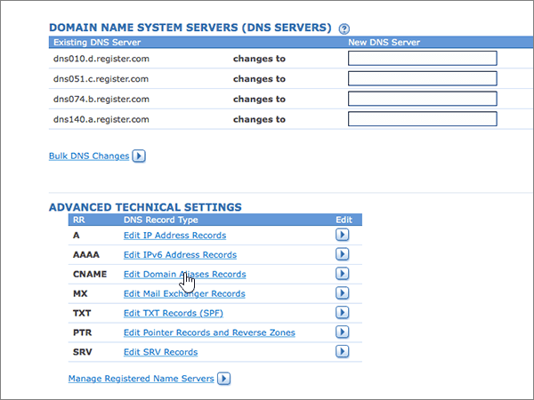

# Erstellen von DNS-Einträgen für Office 365 bei Register.comCreate DNS records at Register.com for Office 365

 **[Überprüfen Sie die häufig gestellten Fragen (FAQ) zu Domänen](../setup/domains-faq.md)**, wenn Sie nicht finden, wonach Sie suchen.**[Check the Domains FAQ](../setup/domains-faq.md)** if you don't find what you're looking for. 
  
Wenn Register.com Ihr DNS-Hostinganbieter ist, führen Sie die in diesem Artikel aufgeführten Schritte aus, um Ihre Domäne zu überprüfen und DNS-Einträge für E-Mail, Skype for Business Online und andere Dienste einzurichten.If Register.com is your DNS hosting provider, follow the steps in this article to verify your domain and set up DNS records for email, Skype for Business Online, and so on.
  
Das sind die wichtigsten hinzuzufügenden Einträge.These are the main records to add. Führen Sie die folgenden Schritte aus, oder [schauen Sie sich das Video an](https://support.office.com/article/Video-Create-DNS-records-at-Register-com-for-Office-365-7448dd9e-c0e7-4d5e-a7e9-f0e4715433c4?ui=en-US&amp;rs=en-US&amp;ad=US).Follow the steps below or [watch the video](https://support.office.com/article/Video-Create-DNS-records-at-Register-com-for-Office-365-7448dd9e-c0e7-4d5e-a7e9-f0e4715433c4?ui=en-US&amp;rs=en-US&amp;ad=US).
  
- [Hinzufügen eines TXT-Eintrags bei Register.com, um zu überprüfen, ob Sie der Besitzer der Domäne sindAdd a TXT record at Register.com to verify that you own the domain](#add-a-txt-record-at-registercom-to-verify-that-you-own-the-domain)
    
- [Hinzufügen eines MX-Eintrags, damit E-Mails für Ihre Domäne an Office 365 geleitet werdenAdd an MX record so email for your domain will come to Office 365](#add-an-mx-record-so-email-for-your-domain-will-come-to-office-365)
    
- [Hinzufügen der für Office 365 erforderlichen CNAME-EinträgeAdd the CNAME records that are required for Office 365](#add-the-cname-records-that-are-required-for-office-365)
    
- [Hinzufügen eines TXT-Eintrags für SPF, um E-Mail-Spam zu verhindernAdd a TXT record for SPF to help prevent email spam](#add-a-txt-record-for-spf-to-help-prevent-email-spam)

- [Hinzufügen der zwei für Office 365 erforderlichen SRV-EinträgeAdd the two SRV records that are required for Office 365](#add-the-two-srv-records-that-are-required-for-office-365)
    
Nachdem Sie diese Einträge bei Register.com hinzugefügt haben, ist Ihre Domäne für die Verwendung von Office 365-Diensten eingerichtet.After you add these records at Register.com, your domain will be set up to work with Office 365 services.
  
Informationen zu Webhosting und DNS für Websites mit Office 365 finden Sie unter [Verwenden einer öffentlichen Website mit Office 365](https://support.office.com/article/choose-a-public-website-3325d50e-d131-403c-a278-7f3296fe33a9).To learn about webhosting and DNS for websites with Office 365, see [Use a public website with Office 365](https://support.office.com/article/choose-a-public-website-3325d50e-d131-403c-a278-7f3296fe33a9).
  
> [!NOTE]
> Normalerweise dauert es ungefähr 15 Minuten, bis DNS-Änderungen wirksam werden. Es kann jedoch gelegentlich länger dauern, bis eine von Ihnen vorgenommene Änderung im Internet im DNS-System aktualisiert wurde. Wenn nach dem Hinzufügen von DNS-Einträgen Probleme mit dem E-Mail-Fluss oder andere Probleme auftreten, lesen Sie [Suchen und Beheben von Problemen, nachdem Ihre Domäne oder DNS-Einträge in Office 365 hinzugefügt wurden](../get-help-with-domains/find-and-fix-issues.md).Typically it takes about 15 minutes for DNS changes to take effect. However, it can occasionally take longer for a change you've made to update across the Internet's DNS system. If you're having trouble with mail flow or other issues after adding DNS records, see [Find and fix issues after adding your domain or DNS records in Office 365](../get-help-with-domains/find-and-fix-issues.md). 
  
## Hinzufügen eines TXT-Eintrags bei Register.com, um zu überprüfen, ob Sie der Besitzer der Domäne sindAdd a TXT record at Register.com to verify that you own the domain

Bevor Sie Ihre Domäne in Office 365 verwenden können, müssen wir uns vergewissern, dass Sie deren Besitzer sind. Ihre Fähigkeit, sich bei Ihrem Konto bei Ihrer Domänenregistrierungsstelle anzumelden und den DNS-Eintrag zu erstellen, ist für Office 365 der Nachweis, dass Sie der Besitzer der Domäne sind.Before you use your domain with Office 365, we have to make sure that you own it. Your ability to log in to your account at your domain registrar and create the DNS record proves to Office 365 that you own the domain.
  
> [!NOTE]
> Dieser Eintrag wird nur verwendet, um zu überprüfen, ob Sie der Besitzer Ihrer Domäne sind. Er hat keine weiteren Auswirkungen. Sie können ihn später ggf. löschen.This record is used only to verify that you own your domain; it doesn't affect anything else. You can delete it later, if you like. 
  
Führen Sie die folgenden Schritte aus, oder [schauen Sie sich das Video an (beginnen Sie bei 0:44)](https://support.office.com/article/Video-Create-DNS-records-at-Register-com-for-Office-365-7448dd9e-c0e7-4d5e-a7e9-f0e4715433c4?ui=en-US&amp;rs=en-US&amp;ad=US).Follow the steps below or [watch the video (start at 0:44)](https://support.office.com/article/Video-Create-DNS-records-at-Register-com-for-Office-365-7448dd9e-c0e7-4d5e-a7e9-f0e4715433c4?ui=en-US&amp;rs=en-US&amp;ad=US).
  
1. Um zu beginnen, navigieren Sie über [diesen Link](https://www.register.com/myaccount/) zu Ihrer Domänenseite bei Register.com.To get started, go to your domains page at Register.com by using [this link](https://www.register.com/myaccount/). Sie werden aufgefordert, sich anzumelden.You'll be prompted to sign in.
    
2. Wählen Sie **Domänen** aus.Select **Domains**.
    
3. Wählen Sie **Manage**aus.Select **Manage**.
    
4. Suchen Sie nach der Zeile, die den Namen der Domäne enthält, die Sie ändern möchten. Wählen Sie dann in dieser Zeile **Verwalten**aus.Find the row that contains the name of the domain that you want to modify; and then, in that row, select **Manage**.
    
5. Führen Sie einen Bildlauf nach unten zum Abschnitt **Erweiterte technische Einstellungen** durch, und wählen Sie dann **Edit TXT Records (SPF)** aus.Scroll down to the **Advanced Technical Settings** section, and then select **Edit TXT Records (SPF)**.
    
6. In the boxes for the new record, type or copy and paste the values from the following table.In the boxes for the new record, type or copy and paste the values from the following table.
    
    |||
    |:-----|:-----|
    |**Host Name****Host Name**   |**TXT Record****TXT Record**   |
    |@    |MS=ms *XXXXXXXX*MS=ms *XXXXXXXX*    **Hinweis:** Dies ist ein nur Beispiel. Verwenden Sie jeweils Ihren Wert für **die Zieladresse bzw. die Adresse, auf die verwiesen wird** aus der Tabelle in Office 365. [Wie finde ich diese Angabe?](../get-help-with-domains/information-for-dns-records.md)**Note:** This is an example. Use your specific **Destination or Points to Address** value here, from the table in Office 365. [How do I find this?](../get-help-with-domains/information-for-dns-records.md)          |
   
7. Wählen Sie **weiter**aus.Select **Continue**.
    
8. Wählen Sie auf der nächsten Seite erneut **Continue** aus, um Ihre Änderungen zu bestätigen.On the next page, select **Continue** again to confirm your changes. 
    
9. Warten Sie einige Minuten, bevor Sie fortfahren, damit der soeben erstellte Eintrag im Internet aktualisiert werden kann.Wait a few minutes before you continue, so that the record you just created can update across the Internet.
    
Nachdem Sie den Eintrag auf der Website Ihrer Domänenregistrierungsstelle hinzugefügt haben, kehren Sie zu Office 365 zurück und fordern Office 365 auf, nach dem Eintrag zu suchen.Now that you've added the record at your domain registrar's site, you'll go back to Office 365 and request Office 365 to look for the record.
  
Wenn Office 365 den richtigen TXT-Eintrag findet, wird die Domäne überprüft.When Office 365 finds the correct TXT record, your domain is verified.
  
1. Wechseln Sie im Admin Center zur Seite **Einstellungen** \> <a href="https://go.microsoft.com/fwlink/p/?linkid=834818" target="_blank">Domänen</a>.In the admin center, go to the **Settings** \> <a href="https://go.microsoft.com/fwlink/p/?linkid=834818" target="_blank">Domains</a> page.
    
2. Wählen Sie auf der Seite **Domänen** die zu überprüfende Domäne aus.On the **Domains** page, select the domain that you are verifying. 
    
3. Wählen Sie auf der Seite **Setup** die Option **Setup starten** aus.On the **Setup** page, select **Start setup**.
    
4. Wählen Sie auf der Seite **Domäne überprüfen** die Option **Überprüfen** aus.On the **Verify domain** page, select **Verify**.
    
> [!NOTE]
> Normalerweise dauert es ungefähr 15 Minuten, bis DNS-Änderungen wirksam werden. Es kann jedoch gelegentlich länger dauern, bis eine von Ihnen vorgenommene Änderung im Internet im DNS-System aktualisiert wurde. Wenn nach dem Hinzufügen von DNS-Einträgen Probleme mit dem E-Mail-Fluss oder andere Probleme auftreten, lesen Sie [Suchen und Beheben von Problemen, nachdem Ihre Domäne oder DNS-Einträge in Office 365 hinzugefügt wurden](../get-help-with-domains/find-and-fix-issues.md).Typically it takes about 15 minutes for DNS changes to take effect. However, it can occasionally take longer for a change you've made to update across the Internet's DNS system. If you're having trouble with mail flow or other issues after adding DNS records, see [Find and fix issues after adding your domain or DNS records in Office 365](../get-help-with-domains/find-and-fix-issues.md). 
  
## Hinzufügen eines MX-Eintrags, damit E-Mails für Ihre Domäne zu Office 365 geleitet werdenAdd an MX record so email for your domain will come to Office 365

Führen Sie die folgenden Schritte aus, oder [schauen Sie sich das Video an (beginnen Sie bei 3:32)](https://support.office.com/article/Video-Create-DNS-records-at-Register-com-for-Office-365-7448dd9e-c0e7-4d5e-a7e9-f0e4715433c4?ui=en-US&amp;rs=en-US&amp;ad=US).Follow the steps below or [watch the video (start at 3:32)](https://support.office.com/article/Video-Create-DNS-records-at-Register-com-for-Office-365-7448dd9e-c0e7-4d5e-a7e9-f0e4715433c4?ui=en-US&amp;rs=en-US&amp;ad=US).
  
1. Um zu beginnen, navigieren Sie über [diesen Link](https://www.register.com/myaccount/) zu Ihrer Domänenseite bei Register.com.To get started, go to your domains page at Register.com by using [this link](https://www.register.com/myaccount/). Sie werden aufgefordert, sich anzumelden.You'll be prompted to sign in.
    
2. Wählen Sie **Domänen** aus.Select **Domains**.
    
3. Wählen Sie **Manage**aus.Select **Manage**.
    
4. Suchen Sie nach der Zeile, die den Namen der Domäne enthält, die Sie ändern möchten. Wählen Sie dann in dieser Zeile **Verwalten**aus.Find the row that contains the name of the domain that you want to modify; and then, in that row, select **Manage**.
    
5. Führen Sie einen Bildlauf zum Abschnitt **Erweiterte technische Einstellungen** durch, und wählen Sie dann **e-Mail-Exchanger-Einträge bearbeiten**aus.Scroll to the **Advanced Technical Settings** section, and then select **Edit Mail Exchanger Records**.
    
    
  
6. Geben Sie in den Feldern für den neuen Eintrag die Werte aus der folgenden Tabelle ein. Sie können die Werte auch kopieren und einfügen.In the boxes for the new record, type or copy and paste the values from the following table.
    
    (Wählen Sie in der Dropdownliste den Wert **Priority** aus.)(Choose the **Priority** value from the drop-down list.) 
    
    |\*\*\*\*Host Name\*\*\*\*\*\*\*\*Host Name\*\*\*\*|\*\*\*\*Priority\*\*\*\*\*\*\*\*Priority\*\*\*\*|\*\*\*\*Mail Server\*\*\*\*\*\*\*\*Mail Server\*\*\*\*|
    |:-----|:-----|:-----|
    |@    |HochHigh    Weitere Informationen zur Priorität finden Sie unter [Was ist MX-Priorität?](https://support.office.com/article/2784cc4d-95be-443d-b5f7-bb5dd867ba83.aspx)For more information about priority, see [What is MX priority?](https://support.office.com/article/2784cc4d-95be-443d-b5f7-bb5dd867ba83.aspx)   | *\<Domänenschlüssel\>*  .mail.protection.outlook.com*\<domain-key\>*  .mail.protection.outlook.com      **Hinweis:** Rufen Sie Ihren Domänenschlüssel (\<*domain-key*\>) aus Ihrem Office 365-Konto ab.**Note:** Get your \<*domain-key*\> from your Office 365 account.   [Wie finde ich diese Angabe?How do I find this?](../get-help-with-domains/information-for-dns-records.md)          |
   
    
  
7. Wenn bereits andere MX-Einträge aufgeführt sind, wählen Sie jeden dieser Einträge zum Löschen aus.If there were any other MX records already listed, select each of those records to be deleted.
    
    
  
8. Wählen Sie **weiter**aus.Select **Continue**.
    
    
  
9. Wählen Sie auf der nächsten Seite erneut **Continue** aus, um die Änderungen zu bestätigen und zu speichern.On the next page, select **Continue** again to confirm and save your changes. 
    
    
  
## Hinzufügen der für Office 365 erforderlichen CNAME-EinträgeAdd the CNAME records that are required for Office 365

Führen Sie die folgenden Schritte aus, oder [schauen Sie sich das Video an (beginnen Sie bei 4:23)](https://support.office.com/article/Video-Create-DNS-records-at-Register-com-for-Office-365-7448dd9e-c0e7-4d5e-a7e9-f0e4715433c4?ui=en-US&amp;rs=en-US&amp;ad=US).Follow the steps below or [watch the video (start at 4:23)](https://support.office.com/article/Video-Create-DNS-records-at-Register-com-for-Office-365-7448dd9e-c0e7-4d5e-a7e9-f0e4715433c4?ui=en-US&amp;rs=en-US&amp;ad=US).
  
1. Um zu beginnen, navigieren Sie über [diesen Link](https://www.register.com/myaccount/) zu Ihrer Domänenseite bei Register.com.To get started, go to your domains page at Register.com by using [this link](https://www.register.com/myaccount/). Sie werden aufgefordert, sich anzumelden.You'll be prompted to sign in.
    
2. Wählen Sie **Domänen** aus.Select **Domains**.
    
3. Wählen Sie **Manage**aus.Select **Manage**.
    
4. Suchen Sie nach der Zeile, die den Namen der Domäne enthält, die Sie ändern möchten. Wählen Sie dann in dieser Zeile **Verwalten**aus.Find the row that contains the name of the domain that you want to modify; and then, in that row, select **Manage**.
    
5. Scrollen Sie zum Abschnitt **Erweiterte technische Einstellungen** , und wählen Sie dann **Bearbeiten von Domänen Alias Einträgen**aus.Scroll to the **Advanced Technical Settings** section, and then select **Edit Domain Aliases Records**.
    
    
  
6. Wählen Sie **Weitere Domänenaliase hinzufügen**aus.Select **Add more domain aliases**.
    
    
  
7. Fügen Sie die erforderlichen CNAME-Einträge hinzu.Add the required CNAME records.
    
    Geben Sie in den Feldern für den neuen Eintrag die Werte aus der ersten Zeile der folgenden Tabelle ein. Sie können die Werte auch kopieren und einfügen.In the boxes for the new record, type or copy and paste the values from the first row of the following table.
    
    |\*\*\*\*Erstes Feld (ohne Beschriftung)\*\*\*\*\*\*\*\*First field (unlabeled)\*\*\*\*|\*\*\*\*Points to\*\*\*\*\*\*\*\*Points to\*\*\*\*|
    |:-----|:-----|
    |autodiscoverautodiscover    |autodiscover.outlook.comautodiscover.outlook.com       |
    |sipsip    |sipdir.online.lync.comsipdir.online.lync.com       |
    |lyncdiscoverlyncdiscover    |webdir.online.lync.comwebdir.online.lync.com      |
    |enterpriseregistrationenterpriseregistration    |enterpriseregistration.windows.netenterpriseregistration.windows.net       |
    |enterpriseenrollmententerpriseenrollment    |enterpriseenrollment-s.manage.microsoft.comenterpriseenrollment-s.manage.microsoft.com       |
   
     
  
8. Wenn Sie alle benötigten CNAME-Einträge hinzugefügt haben, wählen Sie **weiter**aus.When you have added all of the CNAME records that you need, select **Continue**.
    
    
  
9. Wählen Sie auf der nächsten Seite erneut **Continue** aus, um die Änderungen zu bestätigen und zu speichern.On the next page, select **Continue** again to confirm and save your changes. 
    
    
  
## Hinzufügen eines TXT-Eintrags für SPF, um E-Mail-Spam zu verhindernAdd a TXT record for SPF to help prevent email spam

> [!IMPORTANT]
> Es kann bei einer Domäne nur einen TXT-Eintrag für SPF geben.You cannot have more than one TXT record for SPF for a domain. Wenn es bei Ihrer Domäne mehrere SPF-Einträge gibt, treten E-Mail-Fehler sowie Probleme bei der Übermittlung und Spamklassifizierung auf.If your domain has more than one SPF record, you'll get email errors, as well as delivery and spam classification issues. If you already have an SPF record for your domain, don't create a new one for Office 365.If you already have an SPF record for your domain, don't create a new one for Office 365. Damit verfügen Sie über einen einzigen SPF-Eintrag, in dem beide Wertemengen enthalten sind.Instead, add the required Office 365 values to the current record so that you have a single SPF record that includes both sets of values.  
  
Führen Sie die folgenden Schritte aus, oder [schauen Sie sich das Video an (beginnen Sie bei 5:12)](https://support.office.com/article/Video-Create-DNS-records-at-Register-com-for-Office-365-7448dd9e-c0e7-4d5e-a7e9-f0e4715433c4?ui=en-US&amp;rs=en-US&amp;ad=US).Follow the steps below or [watch the video (start at 5:12)](https://support.office.com/article/Video-Create-DNS-records-at-Register-com-for-Office-365-7448dd9e-c0e7-4d5e-a7e9-f0e4715433c4?ui=en-US&amp;rs=en-US&amp;ad=US).
  
1. Um zu beginnen, navigieren Sie über [diesen Link](https://www.register.com/myaccount/) zu Ihrer Domänenseite bei Register.com.To get started, go to your domains page at Register.com by using [this link](https://www.register.com/myaccount/). Sie werden aufgefordert, sich anzumelden.You'll be prompted to sign in.
    
2. Wählen Sie **Domänen** aus.Select **Domains**.
    
3. Wählen Sie **Manage**aus.Select **Manage**.
    
4. Suchen Sie nach der Zeile, die den Namen der Domäne enthält, die Sie ändern möchten. Wählen Sie dann in dieser Zeile **Verwalten**aus.Find the row that contains the name of the domain that you want to modify; and then, in that row, select **Manage**.
    
5. Führen Sie einen Bildlauf zum Abschnitt **Erweiterte technische Einstellungen** durch, und wählen Sie dann **TXT-Datensätze bearbeiten (SPF)** aus.Scroll to the **Advanced Technical Settings** section, and then select **Edit TXT Records (SPF)**.
    
    
  
6. Geben Sie in den Feldern für den neuen Eintrag die Werte aus der folgenden Tabelle ein. Sie können die Werte auch kopieren und einfügen.In the boxes for the new record, type or copy and paste the values from the following table.
    
    |\*\*\*\*Host Name\*\*\*\*\*\*\*\*Host Name\*\*\*\*|\*\*\*\*TXT Record\*\*\*\*\*\*\*\*TXT Record\*\*\*\*|
    |:-----|:-----|
    |@    |v=spf1 include:spf.protection.outlook.com -allv=spf1 include:spf.protection.outlook.com -all    **Hinweis:** Es wird empfohlen, diesen Eintrag zu kopieren und einzufügen, damit alle Abstände korrekt übernommen werden.**Note:** We recommend copying and pasting this entry, so that all of the spacing stays correct.  |
   
     
  
7. Wählen Sie **weiter**aus.Select **Continue**.
    
    
  
8. Wählen Sie auf der nächsten Seite erneut **Continue** aus, um die Änderungen zu bestätigen und zu speichern.On the next page, select **Continue** again to confirm and save your changes. 
    
    
  
## Hinzufügen der für Office 365 erforderlichen zwei SRV-EinträgeAdd the two SRV records that are required for Office 365

Führen Sie die folgenden Schritte aus, oder [schauen Sie sich das Video an (beginnen Sie bei 5:55)](https://support.office.com/article/Video-Create-DNS-records-at-Register-com-for-Office-365-7448dd9e-c0e7-4d5e-a7e9-f0e4715433c4?ui=en-US&amp;rs=en-US&amp;ad=US).Follow the steps below or [watch the video (start at 5:55)](https://support.office.com/article/Video-Create-DNS-records-at-Register-com-for-Office-365-7448dd9e-c0e7-4d5e-a7e9-f0e4715433c4?ui=en-US&amp;rs=en-US&amp;ad=US).
  
1. Um zu beginnen, navigieren Sie über [diesen Link](https://www.register.com/myaccount/) zu Ihrer Domänenseite bei Register.com. Sie werden aufgefordert, sich anzumelden.To get started, go to your domains page at Register.com by using [this link](https://www.register.com/myaccount/). You'll be prompted to sign in.
    
2. Wählen Sie **Domänen** aus.Select **Domains**.
    
3. Wählen Sie **Manage**aus.Select **Manage**.
    
4. Suchen Sie nach der Zeile, die den Namen der Domäne enthält, die Sie ändern möchten. Wählen Sie dann in dieser Zeile **Verwalten**aus.Find the row that contains the name of the domain that you want to modify; and then, in that row, select **Manage**.
    
5. Führen Sie einen Bildlauf zum Abschnitt **Erweiterte technische Einstellungen** durch, und wählen Sie dann **SRV-Einträge bearbeiten**aus.Scroll to the **Advanced Technical Settings** section, and then select **Edit SRV Records**.
    
    
  
6. Fügen Sie den ersten der zwei SRV-Einträge hinzu:Add the first of the two SRV records:
    
    Geben Sie in den Feldern für den neuen Eintrag die Werte aus der ersten Zeile der folgenden Tabelle ein. Sie können die Werte auch kopieren und einfügen.In the boxes for the new record, type or copy and paste the values from the first row of the following table.
    
    (Wählen Sie in der Dropdownliste den Wert **Priority** aus.)(Choose the **Priority** value from the drop-down list.) 
    
    |\*\*\*\*Service\*\*\*\*\*\*\*\*Service\*\*\*\*|\*\*\*\*Proto\*\*\*\*\*\*\*\*Proto\*\*\*\*|\*\*\*\*Name\*\*\*\*\*\*\*\*Name\*\*\*\*|\*\*\*\*Priority\*\*\*\*\*\*\*\*Priority\*\*\*\*|\*\*\*\*Weight\*\*\*\*\*\*\*\*Weight\*\*\*\*|\*\*\*\*Port\*\*\*\*\*\*\*\*Port\*\*\*\*|\*\*\*\*Target\*\*\*\*\*\*\*\*Target\*\*\*\*|
    |:-----|:-----|:-----|:-----|:-----|:-----|:-----|
    |_sip_sip    |_tls_tls    |@    |HighHigh    |11    |443443    |sipdir.online.lync.comsipdir.online.lync.com       |
    |_sipfederationtls_sipfederationtls    |_tcp_tcp    |@    |HighHigh    |11    |50615061    |sipfed.online.lync.comsipfed.online.lync.com       |
   
    
  
7. Wählen Sie **Weitere SRV-Einträge hinzufügen**aus.Select **Add more SRV records**.
    
    
  
8. Fügen Sie den zweiten SRV-Eintrag hinzu:Add the second SRV record:
    
    Geben Sie die Werte aus der zweiten Zeile der Tabelle oben in die Felder für den zweiten Eintrag ein. Sie können die Werte auch kopieren und einfügen.Type or copy and paste the values from the second row of the table above into the boxes for the second record.
    
9. Wenn Sie beide SRV-Einträge hinzugefügt haben, wählen Sie **weiter**aus.When you have added both of the SRV records, select **Continue**.
    
    
  
10. Wählen Sie auf der nächsten Seite erneut **Continue** aus, um die Änderungen zu bestätigen und zu speichern.On the next page, select **Continue** again to confirm and save your changes. 
    
    
  
> [!NOTE]
> Normalerweise dauert es ungefähr 15 Minuten, bis DNS-Änderungen wirksam werden. Es kann jedoch gelegentlich länger dauern, bis eine von Ihnen vorgenommene Änderung im Internet im DNS-System aktualisiert wurde. Wenn nach dem Hinzufügen von DNS-Einträgen Probleme mit dem E-Mail-Fluss oder andere Probleme auftreten, lesen Sie [Suchen und Beheben von Problemen, nachdem Ihre Domäne oder DNS-Einträge in Office 365 hinzugefügt wurden](../get-help-with-domains/find-and-fix-issues.md).Typically it takes about 15 minutes for DNS changes to take effect. However, it can occasionally take longer for a change you've made to update across the Internet's DNS system. If you're having trouble with mail flow or other issues after adding DNS records, see [Find and fix issues after adding your domain or DNS records in Office 365](../get-help-with-domains/find-and-fix-issues.md). 
  
