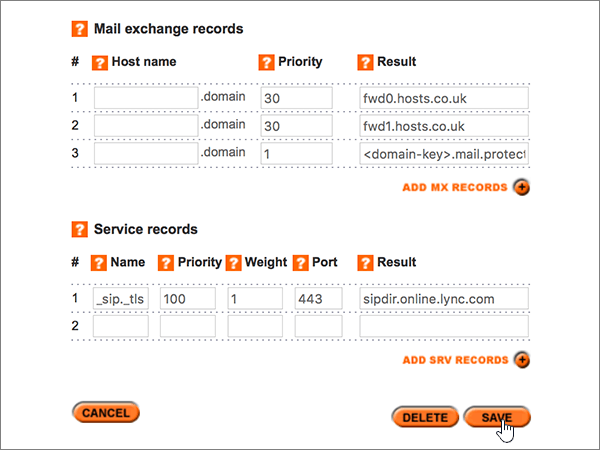
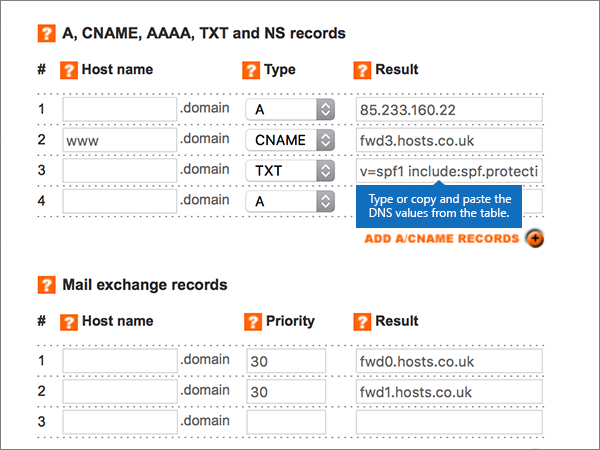
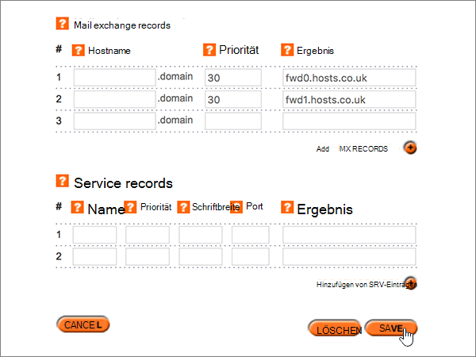

# Erstellen von DNS-Einträgen bei Register365 für Microsoft

 **[Überprüfen Sie die häufig gestellten Fragen (FAQ) zu Domänen](../setup/domains-faq.yml)**, wenn Sie nicht finden, wonach Sie suchen. 
  
Wenn Register365 Ihr DNS-Hostinganbieter ist, führen Sie die in diesem Artikel aufgeführten Schritte aus, um Ihre Domäne zu überprüfen und DNS-Einträge für E-Mail, Skype for Business Online und andere Dienste einzurichten. 
  
Das sind die wichtigsten hinzuzufügenden Einträge.  
  
- [Hinzufügen eines TXT-Eintrags zur Überprüfung](#add-a-txt-record-for-verification)
    
- [Hinzufügen eines MX-Eintrags, damit E-Mails für Ihre Domäne an Microsoft geleitet werden](#add-an-mx-record-so-email-for-your-domain-will-come-to-microsoft)
    
- [Hinzufügen der für Microsoft erforderlichen sechs CNAME-Einträge](#add-the-six-cname-records-that-are-required-for-microsoft)
    
- [Hinzufügen eines TXT-Eintrags für SPF, um E-Mail-Spam zu verhindern](#add-a-txt-record-for-spf-to-help-prevent-email-spam)
    
- [Hinzufügen der für Microsoft erforderlichen zwei SRV-Einträge](#add-the-two-srv-records-that-are-required-for-microsoft)
    
Nachdem Sie diese Datensätze bei Microsoft hinzugefügt haben, wird Ihre Domäne für die Arbeit mit Microsoft-Diensten eingerichtet.
  
> [!NOTE]
>  Normalerweise dauert es ungefähr 15 Minuten, bis DNS-Änderungen wirksam werden. Es kann jedoch gelegentlich länger dauern, bis eine von Ihnen vorgenommene Änderung im Internet im DNS-System aktualisiert wurde. Wenn nach dem Hinzufügen von DNS-Einträgen Probleme mit dem E-Mail-Fluss oder andere Probleme auftreten, lesen Sie [Behandeln von Problemen nach Änderung des Domänennamens oder von DNS-Einträgen](../get-help-with-domains/find-and-fix-issues.md). 
  
## Hinzufügen eines TXT-Eintrags zur Überprüfung

Bevor Sie Ihre Domäne mit Microsoft verwenden können, müssen wir uns vergewissern, dass Sie deren Besitzer sind. Ihre Fähigkeit, sich bei Ihrem Konto bei Ihrer Domänenregistrierungsstelle anzumelden und den DNS-Eintrag zu erstellen, ist für Microsoft der Nachweis, dass Sie der Besitzer der Domäne sind.
  
> [!NOTE]
> Dieser Eintrag wird nur verwendet, um zu überprüfen, ob Sie der Besitzer Ihrer Domäne sind. Er hat keine weiteren Auswirkungen. Sie können ihn später ggf. löschen. 
  
1. Um zu beginnen, navigieren Sie über [diesen Link](https://admin.register365.com/dns/) zu Ihrer Domänenseite bei Register365. Sie werden aufgefordert, sich zuerst anzumelden.
    
    
  
2. Suchen Sie auf der Seite **Dashboard** nach dem Namen der Domäne, die Sie gerade aktualisieren, und wählen Sie dann in der Dropdownliste den Eintrag **DNS Settings** aus. 
    
    (Möglicherweise müssen Sie nach unten scrollen.)
    
    
  
3. On the **Add/Modify DNS Zone** page, in the **A, CNAME, AAAA, TXT and NS records** section, in the boxes for the new record, type or copy and paste the values from the following table. 
    
    (Wählen Sie in der Dropdownliste den Wert für **Type** aus.) 
    
    (Wenn Sie eine Zeile hinzufügen müssen, wählen Sie **ADD A/CNAME RECORDS (+)** aus.)
    
    (Möglicherweise müssen Sie nach unten scrollen.)
    
    |**Hostname**|**Type**|**Result**|
    |:-----|:-----|:-----|
    |(Leave this field empty.)    |TXT    |MS=ms *XXXXXXXX*    **Hinweis:** Dies ist ein Beispiel. Verwenden Sie hier Ihren spezifischen „Ziel“- oder **Verweist auf die Adresse**-Wert aus der Tabelle.           [Wie finde ich diese Angabe?](../get-help-with-domains/information-for-dns-records.md)          |
   
    
  
4. Wählen Sie **Speichern** aus.
    
    (Möglicherweise müssen Sie nach unten scrollen.)
    
    
  
5. Warten Sie einige Minuten, bevor Sie fortfahren, damit der soeben erstellte Eintrag im Internet aktualisiert werden kann.
    
Nachdem Sie den Eintrag auf der Website Ihrer Domänenregistrierungsstelle hinzugefügt haben, kehren Sie zu Microsoft zurück und fordern Sie den Eintrag an.
  
Wenn Microsoft den richtigen TXT-Eintrag findet, ist die Domäne überprüft.
  
1. Wechseln Sie im Admin Center zur Seite **Einstellungen** \> <a href="https://go.microsoft.com/fwlink/p/?linkid=834818" target="_blank">Domänen</a>.
    
2. Wählen Sie auf der Seite **Domänen** die zu überprüfende Domäne aus. 
    
    
  
3. Wählen Sie auf der Seite **Setup** die Option **Setup starten** aus.
    
    
  
4. Wählen Sie auf der Seite **Domäne überprüfen** die Option **Überprüfen** aus.
    
    
  
> [!NOTE]
>  Normalerweise dauert es ungefähr 15 Minuten, bis DNS-Änderungen wirksam werden. Es kann jedoch gelegentlich länger dauern, bis eine von Ihnen vorgenommene Änderung im Internet im DNS-System aktualisiert wurde. Wenn nach dem Hinzufügen von DNS-Einträgen Probleme mit dem E-Mail-Fluss oder andere Probleme auftreten, lesen Sie [Behandeln von Problemen nach Änderung des Domänennamens oder von DNS-Einträgen](../get-help-with-domains/find-and-fix-issues.md). 
  
## Fügen Sie einen MX-Eintrag hinzu, damit E-Mails für Ihre Domäne an Microsoft geleitet werden.

1. Um zu beginnen, navigieren Sie über [diesen Link](https://admin.register365.com/dns/) zu Ihrer Domänenseite bei Register365. Sie werden aufgefordert, sich zuerst anzumelden.
    
    
  
2. Suchen Sie auf der Seite **Dashboard** nach dem Namen der Domäne, die Sie gerade aktualisieren, und wählen Sie dann in der Dropdownliste den Eintrag **DNS Settings** aus. 
    
    (Möglicherweise müssen Sie nach unten scrollen.)
    
    
  
3. Geben Sie auf der Seite **Add/Modify DNS Zone** im Abschnitt **Mail exchange records** in den Feldern für den neuen Eintrag die Werte aus der nachstehenden Tabelle manuell ein, oder kopieren Sie die Werte, und fügen Sie sie ein. 
    
    (Möglicherweise müssen Sie nach unten scrollen.)
    
    |**Hostname**|**Priority**|**Result**|
    |:-----|:-----|:-----|
    |(Dieses Feld leer lassen.)    |1    Weitere Informationen zur Priorität finden Sie unter [Was ist MX-Priorität?](../setup/domains-faq.yml)   | *\<domain-key\>*  .mail.protection.outlook.com    **Hinweis:** Erhalten Sie Ihren *\<domain-key\>* über Ihr Microsoft-Konto.  [Wie finde ich diese Angabe?](../get-help-with-domains/information-for-dns-records.md)     |
   
    
  
4. Wählen Sie **Speichern** aus.
    
    (Möglicherweise müssen Sie nach unten scrollen.)
    
    
  
5. If there are any other MX records in the **Mail exchange records** section, delete each one by selecting it and then pressing the **Delete** key on your keyboard. 
    
    
  
6. Wählen Sie **Speichern** aus.
    
    (Möglicherweise müssen Sie nach unten scrollen.)
    
    
  
## Hinzufügen der für Microsoft erforderlichen sechs CNAME-Einträge

1. Um zu beginnen, navigieren Sie über [diesen Link](https://admin.register365.com/dns/) zu Ihrer Domänenseite bei Register365. Sie werden aufgefordert, sich zuerst anzumelden.
    
    
  
2. Suchen Sie auf der Seite **Dashboard** nach dem Namen der Domäne, die Sie gerade aktualisieren, und wählen Sie dann in der Dropdownliste den Eintrag **DNS Settings** aus. 
    
    (Möglicherweise müssen Sie nach unten scrollen.)
    
    
  
3. Geben Sie auf der Seite **Add/Modify DNS Zone** im Abschnitt **A, CNAME, AAAA, TXT and NS records** in den Feldern für die neuen Einträge die Werte aus der nachstehenden Tabelle manuell ein, oder kopieren Sie die Werte, und fügen Sie sie ein. 
    
    (Wählen Sie in der Dropdownliste den Wert für **Type** aus.) 
    
    (Wenn Sie eine Zeile hinzufügen müssen, wählen Sie **ADD A/CNAME RECORDS (+)** aus.)
    
    (Möglicherweise müssen Sie nach unten scrollen.)
    
    |****Host Name****|****Type****|****Result****|
    |:-----|:-----|:-----|
    |autodiscover    |CNAME    |autodiscover.outlook.com    |
    |sip    |CNAME    |sipdir.online.lync.com    |
    |lyncdiscover    |CNAME    |webdir.online.lync.com    |
    |enterpriseregistration    |CNAME    |enterpriseregistration.windows.net    |
    |enterpriseenrollment    |CNAME    |enterpriseenrollment-s.manage.microsoft.com    |
   
    
  
4. Wählen Sie **Save** aus.
    
    
  
## Hinzufügen eines TXT-Eintrags für SPF, um E-Mail-Spam zu verhindern

> [!IMPORTANT]
> Es kann bei einer Domäne nur einen TXT-Eintrag für SPF geben. Wenn es bei Ihrer Domäne mehrere SPF-Einträge gibt, treten E-Mail-Fehler sowie Probleme bei der Übermittlung und Spamklassifizierung auf. Wenn es für Ihre Domäne bereits einen SPF-Eintrag gibt, erstellen Sie für Microsoft keinen neuen, sondern fügen Sie die erforderlichen Microsoft-Werte dem aktuellen Eintrag hinzu. Damit verfügen Sie über einen *einzigen* SPF-Eintrag, in dem beide Wertemengen enthalten sind. 
  
1. Um zu beginnen, navigieren Sie über [diesen Link](https://admin.register365.com/dns/) zu Ihrer Domänenseite bei Register365. Sie werden aufgefordert, sich zuerst anzumelden.
    
    
  
2. Suchen Sie auf der Seite **Dashboard** nach dem Namen der Domäne, die Sie gerade aktualisieren, und wählen Sie dann in der Dropdownliste den Eintrag **DNS Settings** aus. 
    
    (Möglicherweise müssen Sie nach unten scrollen.)
    
    
  
3. On the **Add/Modify DNS Zone** page, in the **A, CNAME, AAAA, TXT and NS records** section, in the boxes for the new record, type or copy and paste the values from the following table. 
    
    (Wählen Sie in der Dropdownliste den Wert für **Type** aus.) 
    
    (Wenn Sie eine Zeile hinzufügen müssen, wählen Sie **ADD A/CNAME RECORDS (+)** aus.)
    
    (Möglicherweise müssen Sie nach unten scrollen.)
    
    |**Hostname**|**Type**|**Result**|
    |:-----|:-----|:-----|
    |(Leave this field empty.)    |TXT    |v=spf1 include:spf.protection.outlook.com -all   **Hinweis:** Es wird empfohlen, diesen Eintrag zu kopieren und einzufügen, damit alle Abstände korrekt übernommen werden.           |
   
    
  
4. Wählen Sie **Speichern** aus.
    
    (Möglicherweise müssen Sie nach unten scrollen.)
    
    
  
## Hinzufügen der für Microsoft erforderlichen zwei SRV-Einträge

1. Um zu beginnen, navigieren Sie über [diesen Link](https://admin.register365.com/dns/) zu Ihrer Domänenseite bei Register365. Sie werden aufgefordert, sich zuerst anzumelden.
    
    
  
2. Suchen Sie auf der Seite **Dashboard** nach dem Namen der Domäne, die Sie gerade aktualisieren, und wählen Sie dann in der Dropdownliste den Eintrag **DNS Settings** aus. 
    
    (Möglicherweise müssen Sie nach unten scrollen.)
    
    
  
3. Geben Sie auf der Seite **Add/Modify DNS Zone** im Abschnitt **Service records** in den Feldern für die neuen Einträge die Werte aus der nachstehenden Tabelle manuell ein, oder kopieren Sie die Werte, und fügen Sie sie ein. 
    
    (Möglicherweise müssen Sie nach unten scrollen.)
    
    |**Name**|**Priority**|**Weight**|**Port**|**Result**|
    |:-----|:-----|:-----|:-----|:-----|
    |_sip._tls    |100    |1    |443    |sipdir.online.lync.com    |
    |_sipfederationtls._tcp    |100    |1    |5061    |sipfed.online.lync.com    |
   
    
  
4. Wählen Sie **Speichern** aus.
    
    (Möglicherweise müssen Sie nach unten scrollen.)
    
    
  
> [!NOTE]
>  Normalerweise dauert es ungefähr 15 Minuten, bis DNS-Änderungen wirksam werden. Es kann jedoch gelegentlich länger dauern, bis eine von Ihnen vorgenommene Änderung im Internet im DNS-System aktualisiert wurde. Wenn nach dem Hinzufügen von DNS-Einträgen Probleme mit dem E-Mail-Fluss oder andere Probleme auftreten, lesen Sie [Behandeln von Problemen nach Änderung des Domänennamens oder von DNS-Einträgen](../get-help-with-domains/find-and-fix-issues.md). 
