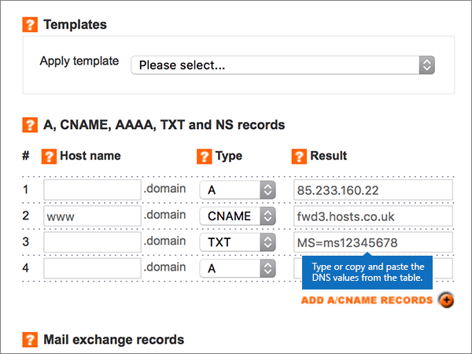

# Erstellen von DNS-Einträgen für Office 365 bei Register365Create DNS records at Register365 for Office 365

 **[Überprüfen Sie die häufig gestellten Fragen (FAQ) zu Domänen](../setup/domains-faq.md)**, wenn Sie nicht finden, wonach Sie suchen.**[Check the Domains FAQ](../setup/domains-faq.md)** if you don't find what you're looking for. 
  
Wenn Register365 Ihr DNS-Hostinganbieter ist, führen Sie die in diesem Artikel aufgeführten Schritte aus, um Ihre Domäne zu überprüfen und DNS-Einträge für E-Mail, Skype for Business Online und andere Dienste einzurichten.If Register365 is your DNS hosting provider, follow the steps in this article to verify your domain and set up DNS records for email, Skype for Business Online, and so on. 
  
Das sind die wichtigsten hinzuzufügenden Einträge.These are the main records to add.  
  
- [Hinzufügen eines TXT-Eintrags zur ÜberprüfungAdd a TXT record for verification](#add-a-txt-record-for-verification)
    
- [Hinzufügen eines MX-Eintrags, damit E-Mails für Ihre Domäne an Office 365 geleitet werdenAdd an MX record so email for your domain will come to Office 365](#add-an-mx-record-so-email-for-your-domain-will-come-to-office-365)
    
- [Hinzufügen der sechs für Office 365 erforderlichen CNAME-EinträgeAdd the six CNAME records that are required for Office 365](#add-the-six-cname-records-that-are-required-for-office-365)
    
- [Hinzufügen eines TXT-Eintrags für SPF, um E-Mail-Spam zu verhindernAdd a TXT record for SPF to help prevent email spam](#add-a-txt-record-for-spf-to-help-prevent-email-spam)
    
- [Hinzufügen der zwei für Office 365 erforderlichen SRV-EinträgeAdd the two SRV records that are required for Office 365](#add-the-two-srv-records-that-are-required-for-office-365)
    
Nachdem Sie diese Einträge bei Office 365 hinzugefügt haben, ist Ihre Domäne für die Verwendung von Office 365-Diensten eingerichtet.After you add these records at Office 365, your domain will be set up to work with Office 365 services.
  
Informationen zu Webhosting und DNS für Websites mit Office 365 finden Sie unter [Verwenden einer öffentlichen Website mit Office 365](https://support.office.com/article/choose-a-public-website-3325d50e-d131-403c-a278-7f3296fe33a9).To learn about webhosting and DNS for websites with Office 365, see [Use a public website with Office 365](https://support.office.com/article/choose-a-public-website-3325d50e-d131-403c-a278-7f3296fe33a9).
  
> [!NOTE]
>  Normalerweise dauert es ungefähr 15 Minuten, bis DNS-Änderungen wirksam werden. Es kann jedoch gelegentlich länger dauern, bis eine von Ihnen vorgenommene Änderung im Internet im DNS-System aktualisiert wurde. Wenn nach dem Hinzufügen von DNS-Einträgen Probleme mit dem E-Mail-Fluss oder andere Probleme auftreten, lesen Sie [Behandeln von Problemen nach Änderung des Domänennamens oder von DNS-Einträgen](../get-help-with-domains/find-and-fix-issues.md).Typically it takes about 15 minutes for DNS changes to take effect. However, it can occasionally take longer for a change you've made to update across the Internet's DNS system. If you're having trouble with mail flow or other issues after adding DNS records, see [Troubleshoot issues after changing your domain name or DNS records](../get-help-with-domains/find-and-fix-issues.md). 
  
## Hinzufügen eines TXT-Eintrags zur ÜberprüfungAdd a TXT record for verification

Bevor Sie Ihre Domäne in Office 365 verwenden können, müssen wir uns vergewissern, dass Sie deren Besitzer sind. Ihre Fähigkeit, sich bei Ihrem Konto bei Ihrer Domänenregistrierungsstelle anzumelden und den DNS-Eintrag zu erstellen, ist für Office 365 der Nachweis, dass Sie der Besitzer der Domäne sind.Before you use your domain with Office 365, we have to make sure that you own it. Your ability to log in to your account at your domain registrar and create the DNS record proves to Office 365 that you own the domain.
  
> [!NOTE]
> Dieser Eintrag wird nur verwendet, um zu überprüfen, ob Sie der Besitzer Ihrer Domäne sind. Er hat keine weiteren Auswirkungen. Sie können ihn später ggf. löschen.This record is used only to verify that you own your domain; it doesn't affect anything else. You can delete it later, if you like. 
  
1. Um zu beginnen, navigieren Sie über [diesen Link](https://admin.register365.com/dns/) zu Ihrer Domänenseite bei Register365. Sie werden aufgefordert, sich zuerst anzumelden.To get started, go to your domains page at Register365 by using [this link](https://admin.register365.com/dns/). You'll be prompted to log in first.
    
    
  
2. Suchen Sie auf der Seite **Dashboard** nach dem Namen der Domäne, die Sie gerade aktualisieren, und wählen Sie dann in der Dropdownliste den Eintrag **DNS Settings** aus.On the **Dashboard** page, find the name of the domain that you're updating, and then choose **DNS Settings** from the drop-down list. 
    
    (Möglicherweise müssen Sie nach unten scrollen.)(You may have to scroll down.)
    
    
  
3. On the **Add/Modify DNS Zone** page, in the **A, CNAME, AAAA, TXT and NS records** section, in the boxes for the new record, type or copy and paste the values from the following table.On the **Add/Modify DNS Zone** page, in the **A, CNAME, AAAA, TXT and NS records** section, in the boxes for the new record, type or copy and paste the values from the following table. 
    
    (Choose the **Type** value from the drop-down list.)(Choose the **Type** value from the drop-down list.) 
    
    (Wenn Sie eine Zeile hinzufügen möchten, wählen Sie **Add a/CNAME Records (+)** aus.)(If you need to add a row, select **ADD A/CNAME RECORDS (+)**.)
    
    (Möglicherweise müssen Sie nach unten scrollen.)(You may have to scroll down.)
    
    |**Hostname****Host name**|**Type****Type**|**Ergebnis****Result**|
    |:-----|:-----|:-----|
    |(Leave this field empty.)(Leave this field empty.)    |TXTTXT    |MS=ms *XXXXXXXX*MS=ms *XXXXXXXX*    **Hinweis:** Dies ist ein Beispiel. Verwenden Sie hier Ihren spezifischen Wert von **Ziel oder verweisende Adresse** aus der Tabelle in Office 365.           [Wie finde ich diese Angabe?](../get-help-with-domains/information-for-dns-records.md)**Note:** This is an example. Use your specific **Destination or Points to Address** value here, from the table in Office 365.           [How do I find this?](../get-help-with-domains/information-for-dns-records.md)          |
   
    
  
4. Klicken Sie auf **Speichern**.Select **Save**.
    
    (Möglicherweise müssen Sie nach unten scrollen.)(You may have to scroll down.)
    
    
  
5. Warten Sie einige Minuten, bevor Sie fortfahren, damit der soeben erstellte Eintrag im Internet aktualisiert werden kann.Wait a few minutes before you continue, so that the record you just created can update across the Internet.
    
Nachdem Sie den Eintrag auf der Website Ihrer Domänenregistrierungsstelle hinzugefügt haben, kehren Sie zu Office 365 zurück und fordern Office 365 auf, nach dem Eintrag zu suchen.Now that you've added the record at your domain registrar's site, you'll go back to Office 365 and request Office 365 to look for the record.
  
Wenn Office 365 den richtigen TXT-Eintrag findet, wird die Domäne überprüft.When Office 365 finds the correct TXT record, your domain is verified.
  
1. Wechseln Sie im Admin Center zur Seite **Einstellungen** \> <a href="https://go.microsoft.com/fwlink/p/?linkid=834818" target="_blank">Domänen</a>.In the admin center, go to the **Settings** \> <a href="https://go.microsoft.com/fwlink/p/?linkid=834818" target="_blank">Domains</a> page.
    
2. Wählen Sie auf der Seite **Domänen** die zu überprüfende Domäne aus.On the **Domains** page, select the domain that you are verifying. 
    
    
  
3. Wählen Sie auf der Seite **Setup** die Option **Setup starten** aus.On the **Setup** page, select **Start setup**.
    
    
  
4. Wählen Sie auf der Seite **Domäne überprüfen** die Option **Überprüfen** aus.On the **Verify domain** page, select **Verify**.
    
    
  
> [!NOTE]
>  Normalerweise dauert es ungefähr 15 Minuten, bis DNS-Änderungen wirksam werden. Es kann jedoch gelegentlich länger dauern, bis eine von Ihnen vorgenommene Änderung im Internet im DNS-System aktualisiert wurde. Wenn nach dem Hinzufügen von DNS-Einträgen Probleme mit dem E-Mail-Fluss oder andere Probleme auftreten, lesen Sie [Behandeln von Problemen nach Änderung des Domänennamens oder von DNS-Einträgen](../get-help-with-domains/find-and-fix-issues.md).Typically it takes about 15 minutes for DNS changes to take effect. However, it can occasionally take longer for a change you've made to update across the Internet's DNS system. If you're having trouble with mail flow or other issues after adding DNS records, see [Troubleshoot issues after changing your domain name or DNS records](../get-help-with-domains/find-and-fix-issues.md). 
  
## Hinzufügen eines MX-Eintrags, damit E-Mails für Ihre Domäne zu Office 365 geleitet werdenAdd an MX record so email for your domain will come to Office 365

1. Um zu beginnen, navigieren Sie über [diesen Link](https://admin.register365.com/dns/) zu Ihrer Domänenseite bei Register365. Sie werden aufgefordert, sich zuerst anzumelden.To get started, go to your domains page at Register365 by using [this link](https://admin.register365.com/dns/). You'll be prompted to log in first.
    
    
  
2. Suchen Sie auf der Seite **Dashboard** nach dem Namen der Domäne, die Sie gerade aktualisieren, und wählen Sie dann in der Dropdownliste den Eintrag **DNS Settings** aus.On the **Dashboard** page, find the name of the domain that you're updating, and then choose **DNS Settings** from the drop-down list. 
    
    (Möglicherweise müssen Sie nach unten scrollen.)(You may have to scroll down.)
    
    
  
3. Geben Sie auf der Seite **Add/Modify DNS Zone** im Abschnitt **Mail exchange records** in den Feldern für den neuen Eintrag die Werte aus der nachstehenden Tabelle manuell ein, oder kopieren Sie die Werte, und fügen Sie sie ein.On the **Add/Modify DNS Zone** page, in the **Mail exchange records** section, in the boxes for the new record, type or copy and paste the values from the following table. 
    
    (Möglicherweise müssen Sie nach unten scrollen.)(You may have to scroll down.)
    
    |**Hostname****Host name**|**Priority****Priority**|**Ergebnis****Result**|
    |:-----|:-----|:-----|
    |(Dieses Feld leer lassen.)(Leave this field empty.)    |11    Weitere Informationen zur Priorität finden Sie unter [Was ist MX-Priorität?](https://support.office.com/article/2784cc4d-95be-443d-b5f7-bb5dd867ba83.aspx)For more information about priority, see [What is MX priority?](https://support.office.com/article/2784cc4d-95be-443d-b5f7-bb5dd867ba83.aspx)   | *\<Domänenschlüssel\>*  .mail.protection.outlook.com*\<domain-key\>*  .mail.protection.outlook.com    **Hinweis:** Rufen Sie Ihren \* \<Domänenschlüssel\> \* aus Ihrem Office 365-Konto ab.**Note:** Get your  *\<domain-key\>*  from your Office 365 account.  [Wie finde ich diese Angabe?How do I find this?](../get-help-with-domains/information-for-dns-records.md)     |
   
    
  
4. Klicken Sie auf **Speichern**.Select **Save**.
    
    (Möglicherweise müssen Sie nach unten scrollen.)(You may have to scroll down.)
    
    
  
5. If there are any other MX records in the **Mail exchange records** section, delete each one by selecting it and then pressing the **Delete** key on your keyboard.If there are any other MX records in the **Mail exchange records** section, delete each one by selecting it and then pressing the **Delete** key on your keyboard. 
    
    
  
6. Klicken Sie auf **Speichern**.Select **Save**.
    
    (Möglicherweise müssen Sie nach unten scrollen.)(You may have to scroll down.)
    
    
  
## Hinzufügen der für Office 365 erforderlichen sechs CNAME-EinträgeAdd the six CNAME records that are required for Office 365

1. Um zu beginnen, navigieren Sie über [diesen Link](https://admin.register365.com/dns/) zu Ihrer Domänenseite bei Register365. Sie werden aufgefordert, sich zuerst anzumelden.To get started, go to your domains page at Register365 by using [this link](https://admin.register365.com/dns/). You'll be prompted to log in first.
    
    
  
2. Suchen Sie auf der Seite **Dashboard** nach dem Namen der Domäne, die Sie gerade aktualisieren, und wählen Sie dann in der Dropdownliste den Eintrag **DNS Settings** aus.On the **Dashboard** page, find the name of the domain that you're updating, and then choose **DNS Settings** from the drop-down list. 
    
    (Möglicherweise müssen Sie nach unten scrollen.)(You may have to scroll down.)
    
    
  
3. Geben Sie auf der Seite **Add/Modify DNS Zone** im Abschnitt **A, CNAME, AAAA, TXT and NS records** in den Feldern für die neuen Einträge die Werte aus der nachstehenden Tabelle manuell ein, oder kopieren Sie die Werte, und fügen Sie sie ein.On the **Add/Modify DNS Zone** page, in the **A, CNAME, AAAA, TXT and NS records** section, in the boxes for the new records, type or copy and paste the values from the following table. 
    
    (Choose the **Type** value from the drop-down list.)(Choose the **Type** value from the drop-down list.) 
    
    (Wenn Sie eine Zeile hinzufügen möchten, wählen Sie **Add a/CNAME Records (+)** aus.)(If you need to add a row, select **ADD A/CNAME RECORDS (+)**.)
    
    (Möglicherweise müssen Sie nach unten scrollen.)(You may have to scroll down.)
    
    |\*\*\*\*Host Name\*\*\*\*\*\*\*\*Host name\*\*\*\*|\*\*\*\*Type\*\*\*\*\*\*\*\*Type\*\*\*\*|\*\*\*\*Result\*\*\*\*\*\*\*\*Result\*\*\*\*|
    |:-----|:-----|:-----|
    |autodiscoverautodiscover    |CNAMECNAME    |autodiscover.outlook.comautodiscover.outlook.com    |
    |sipsip    |CNAMECNAME    |sipdir.online.lync.comsipdir.online.lync.com    |
    |lyncdiscoverlyncdiscover    |CNAMECNAME    |webdir.online.lync.comwebdir.online.lync.com    |
    |enterpriseregistrationenterpriseregistration    |CNAMECNAME    |enterpriseregistration.windows.netenterpriseregistration.windows.net    |
    |enterpriseenrollmententerpriseenrollment    |CNAMECNAME    |enterpriseenrollment-s.manage.microsoft.comenterpriseenrollment-s.manage.microsoft.com    |
   
    
  
4. Klicken Sie auf **Speichern**.Select **Save**.
    
    
  
## Hinzufügen eines TXT-Eintrags für SPF, um E-Mail-Spam zu verhindernAdd a TXT record for SPF to help prevent email spam

> [!IMPORTANT]
> Es kann bei einer Domäne nur einen TXT-Eintrag für SPF geben.You cannot have more than one TXT record for SPF for a domain. Wenn es bei Ihrer Domäne mehrere SPF-Einträge gibt, treten E-Mail-Fehler sowie Probleme bei der Übermittlung und Spamklassifizierung auf.If your domain has more than one SPF record, you'll get email errors, as well as delivery and spam classification issues. If you already have an SPF record for your domain, don't create a new one for Office 365.If you already have an SPF record for your domain, don't create a new one for Office 365. Damit verfügen Sie über einen  *einzigen*  SPF-Eintrag, in dem beide Wertemengen enthalten sind.Instead, add the required Office 365 values to the current record so that you have a  *single*  SPF record that includes both sets of values. 
  
1. Um zu beginnen, navigieren Sie über [diesen Link](https://admin.register365.com/dns/) zu Ihrer Domänenseite bei Register365. Sie werden aufgefordert, sich zuerst anzumelden.To get started, go to your domains page at Register365 by using [this link](https://admin.register365.com/dns/). You'll be prompted to log in first.
    
    
  
2. Suchen Sie auf der Seite **Dashboard** nach dem Namen der Domäne, die Sie gerade aktualisieren, und wählen Sie dann in der Dropdownliste den Eintrag **DNS Settings** aus.On the **Dashboard** page, find the name of the domain that you're updating, and then choose **DNS Settings** from the drop-down list. 
    
    (Möglicherweise müssen Sie nach unten scrollen.)(You may have to scroll down.)
    
    
  
3. On the **Add/Modify DNS Zone** page, in the **A, CNAME, AAAA, TXT and NS records** section, in the boxes for the new record, type or copy and paste the values from the following table.On the **Add/Modify DNS Zone** page, in the **A, CNAME, AAAA, TXT and NS records** section, in the boxes for the new record, type or copy and paste the values from the following table. 
    
    (Choose the **Type** value from the drop-down list.)(Choose the **Type** value from the drop-down list.) 
    
    (Wenn Sie eine Zeile hinzufügen möchten, wählen Sie **Add a/CNAME Records (+)** aus.)(If you need to add a row, select **ADD A/CNAME RECORDS (+)**.)
    
    (Möglicherweise müssen Sie nach unten scrollen.)(You may have to scroll down.)
    
    |**Hostname****Host name**|**Type****Type**|**Ergebnis****Result**|
    |:-----|:-----|:-----|
    |(Leave this field empty.)(Leave this field empty.)    |TXTTXT    |v=spf1 include:spf.protection.outlook.com -allv=spf1 include:spf.protection.outlook.com -all   **Hinweis:** Es wird empfohlen, diesen Eintrag zu kopieren und einzufügen, damit alle Abstände korrekt übernommen werden.**Note:** We recommend copying and pasting this entry, so that all of the spacing stays correct.           |
   
    
  
4. Klicken Sie auf **Speichern**.Select **Save**.
    
    (Möglicherweise müssen Sie nach unten scrollen.)(You may have to scroll down.)
    
    
  
## Hinzufügen der für Office 365 erforderlichen zwei SRV-EinträgeAdd the two SRV records that are required for Office 365

1. Um zu beginnen, navigieren Sie über [diesen Link](https://admin.register365.com/dns/) zu Ihrer Domänenseite bei Register365. Sie werden aufgefordert, sich zuerst anzumelden.To get started, go to your domains page at Register365 by using [this link](https://admin.register365.com/dns/). You'll be prompted to log in first.
    
    
  
2. Suchen Sie auf der Seite **Dashboard** nach dem Namen der Domäne, die Sie gerade aktualisieren, und wählen Sie dann in der Dropdownliste den Eintrag **DNS Settings** aus.On the **Dashboard** page, find the name of the domain that you're updating, and then choose **DNS Settings** from the drop-down list. 
    
    (Möglicherweise müssen Sie nach unten scrollen.)(You may have to scroll down.)
    
    
  
3. Geben Sie auf der Seite **Add/Modify DNS Zone** im Abschnitt **Service records** in den Feldern für die neuen Einträge die Werte aus der nachstehenden Tabelle manuell ein, oder kopieren Sie die Werte, und fügen Sie sie ein.On the **Add/Modify DNS Zone** page, in the **Service records** section, in the boxes for the new records, type or copy and paste the values from the following table. 
    
    (Möglicherweise müssen Sie nach unten scrollen.)(You may have to scroll down.)
    
    |**Name****Name**|**Priority****Priority**|**Weight****Weight**|**Port****Port**|**Result****Result**|
    |:-----|:-----|:-----|:-----|:-----|
    |_sip._tls_sip._tls    |100100    |11    |443443    |sipdir.online.lync.comsipdir.online.lync.com    |
    |_sipfederationtls._tcp_sipfederationtls._tcp    |100100    |11    |50615061    |sipfed.online.lync.comsipfed.online.lync.com    |
   
    
  
4. Klicken Sie auf **Speichern**.Select **Save**.
    
    (Möglicherweise müssen Sie nach unten scrollen.)(You may have to scroll down.)
    
    
  
> [!NOTE]
>  Normalerweise dauert es ungefähr 15 Minuten, bis DNS-Änderungen wirksam werden. Es kann jedoch gelegentlich länger dauern, bis eine von Ihnen vorgenommene Änderung im Internet im DNS-System aktualisiert wurde. Wenn nach dem Hinzufügen von DNS-Einträgen Probleme mit dem E-Mail-Fluss oder andere Probleme auftreten, lesen Sie [Behandeln von Problemen nach Änderung des Domänennamens oder von DNS-Einträgen](../get-help-with-domains/find-and-fix-issues.md).Typically it takes about 15 minutes for DNS changes to take effect. However, it can occasionally take longer for a change you've made to update across the Internet's DNS system. If you're having trouble with mail flow or other issues after adding DNS records, see [Troubleshoot issues after changing your domain name or DNS records](../get-help-with-domains/find-and-fix-issues.md). 
  
