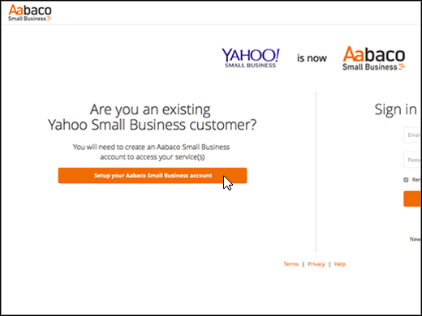
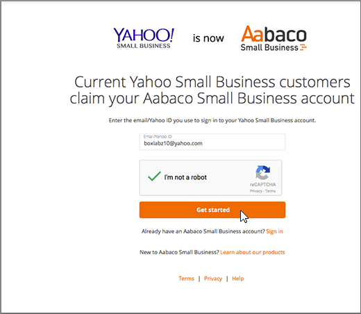

# Erstellen von DNS-Einträgen bei Yahoo! Small Business für Office 365

 **[Überprüfen Sie die häufig gestellten Fragen (FAQ) zu Domänen](../setup/domains-faq.md)**, wenn Sie nicht finden, wonach Sie suchen. 
  
Wenn Yahoo! Small Business Ihr DNS-Hostinganbieter war, sollten Sie beachten, dass Ihr Anbieter jetzt Aabaco Small Business ist.
  
Folgen Sie den Schritten in diesem Artikel, um ein Konto bei Aabaco zu erstellen, wo Sie DNS-Änderungen vornehmen und Ihre Domäne(n) erneuern können.
  
Sie müssen Ihr Aabaco-Konto erstellen, bevor Sie [DNS-Einträge erstellen](../get-help-with-domains/create-dns-records-at-any-dns-hosting-provider.md)können.

  
## Erstellen eines Aabaco Small Business-Kontos

1. Um zu beginnen, navigieren Sie über [diesen Link](https://www.luminate.com/services/)zu ihrer Domänen Seite bei Aabaco, und wählen Sie **Setup your Aabaco Small Business Account**aus.
    
    
  
2. Geben Sie Ihre Email/Yahoo ID von Yahoo! Small Business **-e-Mail/Yahoo-ID**, und wählen Sie dann **Ich bin kein Roboter**.
    
    
  
3. Wählen Sie **Erste Schritte**aus.
    
    
  
4. Melden Sie sich bei Ihrem E-Mail-Konto von Yahoo! Small Business an, und öffnen Sie die neue E-Mail von Aabaco Small Business.
    
    > [!NOTE]
    > Senden Sie die Nachricht bei Bedarf erneut, indem Sie auf der Seite **You've got mail** den Link für **resend the email** auswählen. 
  
    
  
5. **Wählen Sie**im Aabaco bestätigen Sie Ihre e-Mail-Adresse aus, um die e-Mail-Nachricht **einzurichten** .
    
    
  
6. Geben Sie auf der Seite **Choose your password** das Kennwort ein, das Sie für Ihr Aabaco-Konto verwenden möchten. Sie können das Kennwort aber auch kopieren und einfügen. 
    
    > [!NOTE]
    > Sie können dasselbe Kennwort verwenden, das Sie bei Ihrem Yahoo! Small Business-Konto verwendet haben. 
  
    
  
7. Wählen Sie **Ich stimme den Bedingungen zu**, und wählen Sie dann **Kennwort erstellen**aus.
    
    
  
8. Melden Sie sich bei Ihrem Yahoo! Small Business-E-Mail-Konto an, und öffnen Sie die neue E-Mail von Aabaco Small Business.
    
    > [!NOTE]
    > Senden Sie die Nachricht bei Bedarf erneut, indem Sie auf der Seite **You're almost done!** den Link für **resend the email** auswählen. 
  
    
  
9. Wählen Sie in der Aabaco-e-Mail-Nachricht, die **Sie fast dort haben** , die Option **mein Konto aktivieren**aus.
    
    
  
10. Melden Sie sich bei Ihrem Aabaco Small Business-Konto an.
    
    
  
Nachdem Sie Ihr Aabaco-Konto erstellt haben, können Sie [DNS-Einträge bei Aabaco Small Business für Office 365 erstellen](../get-help-with-domains/create-dns-records-at-any-dns-hosting-provider.md).
  
