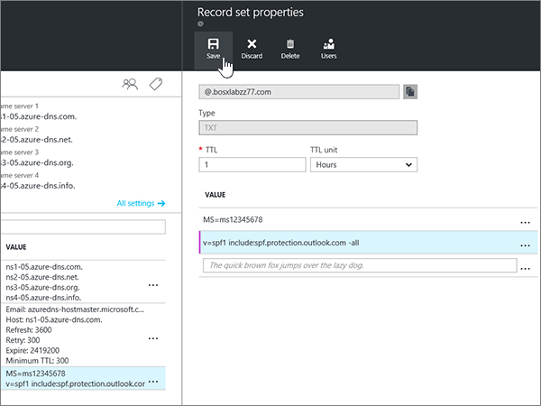

# Erstellen von DNS-Einträgen für Azure DNS-ZonenCreate DNS records for Azure DNS zones

 **[Überprüfen Sie die häufig gestellten Fragen (FAQ) zu Domänen](../setup/domains-faq.yml)**, wenn Sie nicht finden, wonach Sie suchen.**[Check the Domains FAQ](../setup/domains-faq.yml)** if you don't find what you're looking for. 
  
Wenn Azure Ihr DNS-Hostinganbieter ist, führen Sie die in diesem Artikel aufgeführten Schritte aus, um Ihre Domäne zu überprüfen und DNS-Einträge für E-Mail, Skype for Business Online und andere Dienste einzurichten.If Azure is your DNS hosting provider, follow the steps in this article to verify your domain and set up DNS records for email, Skype for Business Online, and so on.
  
Dies sind die wichtigsten hinzuzufügenden Einträge.These are the main records to add. 
  
- [Ändern der Namenservereinträge (NS) Ihrer DomäneChange your domain's nameserver (NS) records](#change-your-domains-nameserver-ns-records)
    
- [Hinzufügen eines TXT-Eintrags zur ÜberprüfungAdd a TXT record for verification](#add-a-txt-record-for-verification)

- [Hinzufügen eines MX-Eintrags, damit E-Mails für Ihre Domäne an Microsoft geleitet werdenAdd an MX record so email for your domain will come to Microsoft](#add-an-mx-record-so-email-for-your-domain-will-come-to-microsoft)
    
- [Hinzufügen der vier für Microsoft erforderlichen CNAME-EinträgeAdd the four CNAME records that are required for Microsoft](#add-the-four-cname-records-that-are-required-for-microsoft)
    
- [Hinzufügen eines TXT-Eintrags für SPF, um E-Mail-Spam zu verhindernAdd a TXT record for SPF to help prevent email spam](#add-a-txt-record-for-spf-to-help-prevent-email-spam)
    
- [Hinzufügen der für Microsoft erforderlichen zwei SRV-EinträgeAdd the two SRV records that are required for Microsoft](#add-the-two-srv-records-that-are-required-for-microsoft)
    
Nachdem Sie diese Einträge bei Azure hinzugefügt haben, ist Ihre Domäne für die Verwendung von Microsoft-Diensten eingerichtet.After you add these records at Azure, your domain will be set up to work with Microsoft services.
  
> [!NOTE]
> Normalerweise dauert es ungefähr 15 Minuten, bis DNS-Änderungen wirksam werden. Es kann jedoch gelegentlich länger dauern, bis eine von Ihnen vorgenommene Änderung im Internet im DNS-System aktualisiert wurde. Wenn nach dem Hinzufügen von DNS-Einträgen Probleme mit dem E-Mail-Fluss oder andere Probleme auftreten, lesen Sie [Behandeln von Problemen nach Änderung des Domänennamens oder von DNS-Einträgen](../get-help-with-domains/find-and-fix-issues.md).Typically it takes about 15 minutes for DNS changes to take effect. However, it can occasionally take longer for a change you've made to update across the Internet's DNS system. If you're having trouble with mail flow or other issues after adding DNS records, see [Troubleshoot issues after changing your domain name or DNS records](../get-help-with-domains/find-and-fix-issues.md). 
  
## Ändern der Nameservereinträge (NS) Ihrer DomäneChange your domain's nameserver (NS) records

> [!IMPORTANT]
> Sie müssen dieses Verfahren bei der Domänenregistrierungsstelle ausführen, bei der Sie Ihre Domäne erworben und registriert haben.You must perform this procedure at the domain registrar where you purchased and registered your domain. 
  
Bei Ihrer Anmeldung für Azure haben Sie eine Ressourcengruppe innerhalb einer DNS-Zone erstellt und dann dieser Ressourcengruppe Ihren Domänennamen zugewiesen.When you signed up for Azure, you created a resource group within a DNS zone, and then assigned your domain name to that resource group. Dieser Domänenname ist bei einer externen Domänenregistrierungsstelle registriert. Azure bietet keine Domänenregistrierungsdienste an.That domain name is registered to an external domain registrar; Azure does not offer domain registration services.
  
Um DNS-Einträge für Ihre Domäne bei Microsoft zu überprüfen und zu erstellen, müssen Sie zuerst die Nameserver bei Ihrer Domänenregistrierungsstelle so ändern, dass sie die Ihrer Ressourcengruppe zugeordneten Azure-Nameserver verwenden.To verify and create DNS records for your domain in Microsoft, you first need to change the nameservers at your domain registrar so that they use the Azure nameservers assigned to your resource group.
  
Wenn Sie die Namenserver der Domäne auf der Website Ihrer Domänenregistrierungsstelle selbst ändern möchten, führen Sie diese Schritte aus:To change your domain's name servers at your domain registrar's website yourself, follow these steps.
  
1. Suchen Sie den Bereich auf der Website der Domänenregistrierungsstelle, in dem Sie die Namenserver für Ihre Domäne bearbeiten können.Find the area on the domain registrar's website where you can edit the nameservers for your domain.
    
2. Erstellen Sie entweder zwei Namenservereinträge unter Verwendung der Werte in der nachstehenden Tabelle, oder bearbeiten Sie die vorhandenen Einträge, damit sie diesen Werten entsprechen.Either create two nameserver records by using the values in the following table, or edit the existing nameserver records so that they match these values. Ein Beispiel für von Azure zugewiesene Nameserver ist unten dargestellt.An example of Azure assigned nameservers is shown below.
    

**Erster Nameserver:** Verwenden Sie den von Azure zugewiesenen Nameserverwert.**First nameserver:** Use the name server value assigned by Azure.  
**Zweiter Nameserver:** Verwenden Sie den von Azure zugewiesenen Nameserverwert.**Second nameserver:** Use the name server value assigned by Azure.  

  
> [!TIP]
> Verwenden Sie mindestens zwei Nameservereinträge.You should use at least two name server records. Wenn auf der Website Ihrer Domänenregistrierungsstelle weitere Nameserver aufgeführt sind, sollten Sie diese löschen.If there are any other name servers listed at your domain registrar's website, you should delete them. 
  
3. Speichern Sie Ihre Änderungen.Save your changes.
    
> [!NOTE]
> Es kann mehrere Stunden dauern, bis Ihre Namenservereinträge im Internet im DNS-System aktualisiert wurden.Your nameserver record updates may take up to several hours to update across the Internet's DNS system. Dann sind Ihre Microsoft-E-Mails und andere Dienste für das Arbeiten mit Ihrer Domäne eingerichtet.Then your Microsoft email and other services will be all set to work with your domain. 
  
## Hinzufügen eines TXT-Eintrags zur ÜberprüfungAdd a TXT record for verification

Bevor Sie Ihre Domäne mit Microsoft verwenden können, müssen wir uns vergewissern, dass Sie deren Besitzer sind. Ihre Fähigkeit, sich bei Ihrem Konto bei Ihrer Domänenregistrierungsstelle anzumelden und den DNS-Eintrag zu erstellen, ist für Microsoft der Nachweis, dass Sie der Besitzer der Domäne sind.Before you use your domain with Microsoft, we have to make sure that you own it. Your ability to log in to your account at your domain registrar and create the DNS record proves to Microsoft that you own the domain.
  
> [!NOTE]
> Dieser Eintrag wird nur verwendet, um zu überprüfen, ob Sie der Besitzer Ihrer Domäne sind. Er hat keine weiteren Auswirkungen. Sie können ihn später ggf. löschen.This record is used only to verify that you own your domain; it doesn't affect anything else. You can delete it later, if you like. 
  
1. Navigieren Sie im ersten Schritt über [diesen Link](https://portal.azure.com ) zu Ihrer Domänenseite bei Azure.To get started, go to your domains page at Azure by using [this link](https://portal.azure.com ). Sie werden aufgefordert, sich zuerst anzumelden.You'll be prompted to log in first.
    
    
  
2. Geben Sie in der **Suchleiste** auf der Seite **Dashboard** den Begriff **DNS-Zonen** ein.Using the **search bar** on the **Dashboard** page, type in **DNS zones**. Wählen Sie in der Ergebnisanzeige im Abschnitt **Dienste** die Option **DNS-Zonen** aus.In the results display, select **DNS zones** under the **Services** portion. Sobald Sie umgeleitet wurden, wählen Sie die Domäne aus, die Sie aktualisieren möchten.Once you've been redirected, select the domain that you want to update.
    
    
  
3. Wählen Sie auf der Seite **Einstellungen** für Ihre Domäne im Bereich **DNS-Zone** die Option **+ Recordset** aus.On the **Settings** page for your domain, in the **DNS zone** area, select **+ Record set**.
    
    
  
4. Wählen Sie im Bereich **Recordset hinzufügen** in den Feldern für das neue Recordset die Werte aus der folgenden Tabelle aus.In the **Add record set** area, in the boxes for the new record set, select the values from the following table. 
    
    (Wählen Sie in der Dropdownliste die Werte für **Typ** und **TTL-Einheit** aus.)(Choose the **Type** and **TTL unit** values from the drop-down lists.) 
    
    |**Name****Name**|**Type****Type**|**TTL****TTL**|**TTL-Einheit****TTL unit**|**Wert****Value**|
    |:-----|:-----|:-----|:-----|:-----|
    |@    |TXTTXT    |11    |StundenHours    |MS=ms *XXXXXXXX*MS=ms *XXXXXXXX*    **Hinweis:** Dies ist ein Beispiel.**Note:** This is an example. Verwenden Sie hier Ihren spezifischen „Ziel“- oder **Verweist auf die Adresse**-Wert aus der Tabelle.Use your specific **Destination or Points to Address** value here, from the table.           [Wie finde ich diese Angabe?How do I find this?](../get-help-with-domains/information-for-dns-records.md)          |
   
    
  
5. Wählen Sie **OK** aus.Select **OK**.
  
6. Warten Sie einige Minuten, bevor Sie fortfahren, damit der soeben erstellte Eintrag im Internet aktualisiert werden kann.Wait a few minutes before you continue, so that the record you just created can update across the Internet.
    
Nachdem Sie den Eintrag auf der Website Ihrer Domänenregistrierungsstelle hinzugefügt haben, kehren Sie zu Microsoft zurück und fordern Sie den Eintrag an.Now that you've added the record at your domain registrar's site, you'll go back to Microsoft and request the record.
  
Wenn Microsoft den richtigen TXT-Eintrag findet, ist die Domäne überprüft.When Microsoft finds the correct TXT record, your domain is verified.
  
1. Wechseln Sie im Admin Center zur Seite **Einstellungen** \> <a href="https://go.microsoft.com/fwlink/p/?linkid=834818" target="_blank">Domänen</a>.In the admin center, go to the **Settings** \> <a href="https://go.microsoft.com/fwlink/p/?linkid=834818" target="_blank">Domains</a> page.
    
2. Wählen Sie auf der Seite **Domänen** die zu überprüfende Domäne aus.On the **Domains** page, select the domain that you are verifying. 
    
    
  
3. Wählen Sie auf der Seite **Setup** die Option **Setup starten** aus.On the **Setup** page, select **Start setup**.
    
    
  
4. Wählen Sie auf der Seite **Domäne überprüfen** die Option **Überprüfen** aus.On the **Verify domain** page, select **Verify**.
    
    
  
> [!NOTE]
>  Normalerweise dauert es ungefähr 15 Minuten, bis DNS-Änderungen wirksam werden. Es kann jedoch gelegentlich länger dauern, bis eine von Ihnen vorgenommene Änderung im Internet im DNS-System aktualisiert wurde. Wenn nach dem Hinzufügen von DNS-Einträgen Probleme mit dem E-Mail-Fluss oder andere Probleme auftreten, lesen Sie [Behandeln von Problemen nach Änderung des Domänennamens oder von DNS-Einträgen](../get-help-with-domains/find-and-fix-issues.md).Typically it takes about 15 minutes for DNS changes to take effect. However, it can occasionally take longer for a change you've made to update across the Internet's DNS system. If you're having trouble with mail flow or other issues after adding DNS records, see [Troubleshoot issues after changing your domain name or DNS records](../get-help-with-domains/find-and-fix-issues.md). 
  
## Fügen Sie einen MX-Eintrag hinzu, damit E-Mails für Ihre Domäne an Microsoft geleitet werden.Add an MX record so email for your domain will come to Microsoft

1. Navigieren Sie im ersten Schritt über [diesen Link](https://portal.azure.com ) zu Ihrer Domänenseite bei Azure.To get started, go to your domains page at Azure by using [this link](https://portal.azure.com ). Sie werden aufgefordert, sich zuerst anzumelden.You'll be prompted to log in first.
    
    
  
2. Wählen Sie auf der Seite **Dashboard** im Bereich **Alle Ressourcen** die Domäne aus, die Sie aktualisieren möchten.On the **Dashboard** page, in the **All resources** area, select the domain that you want to update. 
    
    
  
3. Wählen Sie auf der Seite **Einstellungen** für Ihre Domäne im Bereich **DNS-Zone** die Option **+ Recordset** aus.On the **Settings** page for your domain, in the **DNS zone** area, select **+ Record set**.
    
    
  
4. Wählen Sie im Bereich **Recordset hinzufügen** in den Feldern für das neue Recordset die Werte aus der folgenden Tabelle aus.In the **Add record set** area, in the boxes for the new record set, select the values from the following table. 
    
    (Wählen Sie in der Dropdownliste die Werte für **Typ** und **TTL-Einheit** aus.)(Choose the **Type** and **TTL unit** values from the drop-down lists.) 
    
    |**Name****Name**|**Type****Type**|**TTL****TTL**|**TTL-Einheit****TTL unit**|**Preference****Preference**|**Mail Exchange****Mail Exchange**|
    |:-----|:-----|:-----|:-----|:-----|:-----|
    |@    |MXMX    |11    |StundenHours    |1010    Weitere Informationen zur Priorität finden Sie unter [Was ist MX-Priorität?](https://docs.microsoft.com/microsoft-365/admin/setup/domains-faq)For more information about priority, see [What is MX priority?](https://docs.microsoft.com/microsoft-365/admin/setup/domains-faq)   | *\<domain-key\>*  .mail.protection.outlook.com*\<domain-key\>*  .mail.protection.outlook.com    **Hinweis:** Erhalten Sie Ihren *\<domain-key\>* über Ihr Microsoft-Konto.**Note:** Get your  *\<domain-key\>*  from your Microsoft account.   [Wie finde ich diese Angabe?How do I find this?](../get-help-with-domains/information-for-dns-records.md)  
   
    
  
5. Wählen Sie **OK** aus.Select **OK**.
    
    
  
6. Wenn im Abschnitt **MX Records** andere MX-Einträge aufgeführt sind, müssen Sie diese löschen.If there are any other MX records listed in the **MX Records** section, you must delete them. 
    
    Wählen Sie zunächst im Bereich **DNS-Zone** das **MX-Recordset** aus.First, in the **DNS zone** area, select the **MX Record set**.
    
    
  
    Wählen Sie als nächstes das MX-Recordset aus, das Sie löschen möchten.Next, select the MX record you want to delete.
    
    
  
7. Wählen Sie das **Kontextmenü (...)** und dann **Entfernen** aus.Select the **Context menu (…)**, and then choose **Remove**.
    
    
  
8. Wählen Sie **Speichern** aus.Select **Save**.
    
    
  
## Hinzufügen der vier für Microsoft erforderlichen CNAME-EinträgeAdd the four CNAME records that are required for Microsoft

1. Navigieren Sie im ersten Schritt über [diesen Link](https://portal.azure.com ) zu Ihrer Domänenseite bei Azure.To get started, go to your domains page at Azure by using [this link](https://portal.azure.com ). Sie werden aufgefordert, sich zuerst anzumelden.You'll be prompted to log in first.
    
    
  
2. Wählen Sie auf der Seite **Dashboard** im Bereich **Alle Ressourcen** die Domäne aus, die Sie aktualisieren möchten.On the **Dashboard** page, in the **All resources** area, select the domain that you want to update. 
    
    
  
3. Wählen Sie auf der Seite **Einstellungen** für Ihre Domäne im Bereich **DNS-Zone** die Option **+ Recordset** aus.On the **Settings** page for your domain, in the **DNS zone** area, select **+ Record set**.
    
    
  
4. Fügen Sie den ersten der vier CNAME-Einträge hinzu.Add the first of the four CNAME records.
    
    Geben Sie im Bereich **Recordset hinzufügen** in den Feldern für das neue Recordset die Werte aus der ersten Zeile der folgenden Tabelle ein. Sie können die Werte auch kopieren und einfügen.In the **Add record set** area, in the boxes for the new record set, type or copy and paste the values from the first row in the following table. 
    
    (Wählen Sie in der Dropdownliste die Werte für **Typ** und **TTL-Einheit** aus.)(Choose the **Type** and **TTL unit** values from the drop-down lists.) 
    
    |**Name****Name**|**Type****Type**|**TTL****TTL**|**TTL-Einheit****TTL unit**|**Alias****Alias**|
    |:-----|:-----|:-----|:-----|:-----|
    |autodiscoverautodiscover    |CNAMECNAME    |11    |StundenHours    |autodiscover.outlook.comautodiscover.outlook.com    |
    |sipsip    |CNAMECNAME    |11    |StundenHours    |sipdir.online.lync.comsipdir.online.lync.com    |
    |lyncdiscoverlyncdiscover    |CNAMECNAME    |11    |StundenHours    |webdir.online.lync.comwebdir.online.lync.com    |
    
   
    
  
5. Wählen Sie **OK** aus.Select **OK**.
    
    
  
6. Fügen Sie die drei anderen CNAME-Einträge hinzu.Add each of the other three CNAME records.
    
    Wählen Sie im Bereich **DNS-Zone** die Option **+ Recordset** aus.In the **DNS zone** area, select **+ Record set**. Erstellen Sie dann im leeren Recordset einen Eintrag mit den Werten aus der nächsten Zeile in der Tabelle, und wählen Sie dann erneut **OK** aus, um diesen Eintrag abzuschließen.Then, in the empty record set, create a record by using the values from the next row in the table, and again select **OK** to complete that record. 
    
    Wiederholen Sie diesen Vorgang, bis Sie alle vier CNAME-Einträge erstellt haben.Repeat this process until you have created all four CNAME records.
    
7.  (Optional) Fügen Sie 2 CNAME-Einträge für MDM hinzu.(Optional) Add 2 CNAME records for MDM.

> [!IMPORTANT]
> Wenn Sie über MDM (Mobile Device Management) für Microsoft verfügen, müssen Sie zwei zusätzliche CNAME-Einträge erstellen.If you have Mobile Device Management (MDM) for Microsoft, then you must create two additional CNAME records. Folgen Sie den Schritten für die anderen vier CNAME-Einträge, geben Sie jedoch die Werte aus der nachstehenden Tabelle ein.Follow the procedure that you used for the other four CNAME records, but supply the values from the following table. (Wenn Sie nicht mit MDM arbeiten, können Sie diesen Schritt überspringen.)(If you do not have MDM, you can skip this step.) 
  
|**Name****Name**|**Type****Type**|**TTL****TTL**|**TTL-Einheit****TTL unit**|**Alias****Alias**|
|:-----|:-----|:-----|:-----|:-----|
|enterpriseregistrationenterpriseregistration    |CNAMECNAME    |11    |StundenHours    |enterpriseregistration.windows.netenterpriseregistration.windows.net    |
|enterpriseenrollmententerpriseenrollment    |CNAMECNAME    |11    |StundenHours    |enterpriseenrollment-s.manage.microsoft.comenterpriseenrollment-s.manage.microsoft.com    |
   
## Hinzufügen eines TXT-Eintrags für SPF, um E-Mail-Spam zu verhindernAdd a TXT record for SPF to help prevent email spam

> [!IMPORTANT]
> Es kann bei einer Domäne nur einen TXT-Eintrag für SPF geben.You cannot have more than one TXT record for SPF for a domain. Wenn es bei Ihrer Domäne mehrere SPF-Einträge gibt, treten E-Mail-Fehler sowie Probleme bei der Übermittlung und Spamklassifizierung auf.If your domain has more than one SPF record, you'll get email errors, as well as delivery and spam classification issues. Wenn es für Ihre Domäne bereits einen SPF-Eintrag gibt, erstellen Sie für Microsoft keinen neuen,If you already have an SPF record for your domain, don't create a new one for Microsoft. sondern fügen Sie die erforderlichen Microsoft-Werte dem aktuellen Eintrag hinzu. Damit verfügen Sie über einen *einzigen* SPF-Eintrag, in dem beide Wertemengen enthalten sind.Instead, add the required Microsoft values to the current record so that you have a  *single*  SPF record that includes both sets of values. 
  
1. Navigieren Sie im ersten Schritt über [diesen Link](https://portal.azure.com ) zu Ihrer Domänenseite bei Azure.To get started, go to your domains page at Azure by using [this link](https://portal.azure.com ). Sie werden aufgefordert, sich zuerst anzumelden.You'll be prompted to log in first.
    
    
  
2. Wählen Sie auf der Seite **Dashboard** im Bereich **Alle Ressourcen** die Domäne aus, die Sie aktualisieren möchten.On the **Dashboard** page, in the **All resources** area, select the domain that you want to update. 
    
    
  
3. Wählen Sie im Bereich **DNS-Zone** das **TXT-Recordset** aus.In the **DNS zone** area, select the **TXT record set**.
    
    
  
4. Wählen Sie im Bereich **Recordseteigenschaften** in den Feldern für das neue Recordset die Werte aus der folgenden Tabelle aus.In the **Record set properties** area, in the boxes for the new record set, select the values from the following table. 
    
    (Wählen Sie in der Dropdownliste die Werte für **Typ** und **TTL-Einheit** aus.)(Choose the **Type** and **TTL unit** values from the drop-down lists.) 
    
    |**Name****Name**|**Type****Type**|**TTL****TTL**|**TTL-Einheit****TTL unit**|**Wert****Value**|
    |:-----|:-----|:-----|:-----|:-----|
    |@    |TXTTXT    |11    |StundenHours    |v=spf1 include:spf.protection.outlook.com -allv=spf1 include:spf.protection.outlook.com -all    **Hinweis:** Es wird empfohlen, diesen Eintrag zu kopieren und einzufügen, damit alle Abstände korrekt übernommen werden.**Note:** We recommend copying and pasting this entry, so that all of the spacing stays correct.           

    
  
5. Wählen Sie **Speichern** aus.Select **Save**.
    
    
  
## Hinzufügen der für Microsoft erforderlichen zwei SRV-EinträgeAdd the two SRV records that are required for Microsoft

1. Navigieren Sie im ersten Schritt über [diesen Link](https://portal.azure.com ) zu Ihrer Domänenseite bei Azure.To get started, go to your domains page at Azure by using [this link](https://portal.azure.com ). Sie werden aufgefordert, sich zuerst anzumelden.You'll be prompted to log in first.
    
    
  
2. Wählen Sie auf der Seite **Dashboard** im Bereich **Alle Ressourcen** die Domäne aus, die Sie aktualisieren möchten.On the **Dashboard** page, in the **All resources** area, select the domain that you want to update. 
    
    
  
3. Wählen Sie auf der Seite **Einstellungen** für Ihre Domäne im Bereich **DNS-Zone** die Option **+ Recordset** aus.On the **Settings** page for your domain, in the **DNS zone** area, select **+ Record set**.
    
    
  
4. Fügen Sie den ersten der zwei SRV-Einträge hinzu.Add the first of the two SRV records.
    
    Wählen Sie im Bereich **Recordset hinzufügen** in den Feldern für das neue Recordset die Werte aus der ersten Zeile der folgenden Tabelle aus.In the **Add record set** area, in the boxes for the new record set, select the values from the first row in the following table. 
    
    (Wählen Sie in der Dropdownliste die Werte für **Typ** und **TTL-Einheit** aus.)(Choose the **Type** and **TTL unit** values from the drop-down lists.) 
    
    |**Name****Name**|**Type****Type**|**TTL****TTL**|**TTL-Einheit****TTL unit**|**Priority****Priority**|**Weight****Weight**|**Port****Port**|**Target****Target**|
    |:-----|:-----|:-----|:-----|:-----|:-----|:-----|:-----|
    |_sip._tls_sip._tls    |SRVSRV    |11    |StundenHours    |100100    |11    |443443    |sipdir.online.lync.comsipdir.online.lync.com    |
    |_sipfederationtls._tcp_sipfederationtls._tcp    |SRVSRV    |11    |StundenHours    |100100    |11    |50615061    |sipfed.online.lync.comsipfed.online.lync.com    

    
  
5. Wählen Sie **OK** aus.Select **OK**.
    
    
  
6. Fügen Sie den anderen SRV-Eintrag hinzu.Add the other SRV record.
    
    Geben Sie in den Feldern für den neuen Eintrag die Werte aus der zweiten Zeile der Tabelle ein. Sie können die Werte auch kopieren und einfügen.In the boxes for the new record, type or copy and paste the values from the second row of the table.
    
> [!NOTE]
> Normalerweise dauert es ungefähr 15 Minuten, bis DNS-Änderungen wirksam werden. Es kann jedoch gelegentlich länger dauern, bis eine von Ihnen vorgenommene Änderung im Internet im DNS-System aktualisiert wurde. Wenn nach dem Hinzufügen von DNS-Einträgen Probleme mit dem E-Mail-Fluss oder andere Probleme auftreten, lesen Sie [Behandeln von Problemen nach Änderung des Domänennamens oder von DNS-Einträgen](../get-help-with-domains/find-and-fix-issues.md).Typically it takes about 15 minutes for DNS changes to take effect. However, it can occasionally take longer for a change you've made to update across the Internet's DNS system. If you're having trouble with mail flow or other issues after adding DNS records, see [Troubleshoot issues after changing your domain name or DNS records](../get-help-with-domains/find-and-fix-issues.md). 
  
