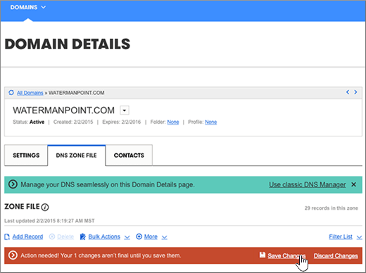

# Erstellen von DNS-Einträgen, wenn Ihre Domäne von Google verwaltet wird (eNom)

 **[Überprüfen Sie die häufig gestellten Fragen (FAQ) zu Domänen](../setup/domains-faq.md)**, wenn Sie nicht finden, wonach Sie suchen. 
  
Zum Migrieren Ihrer E-Mail-Konten zu Office 365 müssen Sie einen DNS-Eintrag bei Ihrer Domänenregistrierungsstelle erstellen.
  
Wenn Sie Ihre Domäne über Google erworben haben, während Sie sich für Ihr **Google Apps for Work** -Konto angemeldet haben, werden Ihre DNS-Einträge von Google verwaltet, aber bei eNom registriert. 
  
Sie können über die Seite Google **Domains** auf eNom zugreifen und DNS erstellen. Führen Sie dazu die Schritte in diesem Artikel aus. 
  
## Erstellen des DNS-Eintrags

1. Wählen Sie in der [Google-Verwaltungskonsole](https://www.google.com/work/apps/business) **Anmelden**aus.
    
    
  
2. Geben Sie Ihren Domänennamen ein, und wählen Sie dann **wechseln**aus.
    
    
  
3. Wählen Sie unten auf der Seite **Weitere Steuerelemente**aus.
    
    
  
4. Wählen Sie **Domänen** aus.
    
    
  
5. Wählen Sie auf der Seite **Domänen** die Option **Domänen hinzufügen/entfernen**aus.
    
    
  
6. Wählen Sie auf der Seite **Domänen** die Option **Erweiterte DNS-Einstellungen**aus.
    
    > [!NOTE]
    > Falls Sie während der Registrierung für Ihr **Google Apps for Work** -Konto keinen Domänennamen erworben haben, ist die Option **Erweiterte DNS-Einstellungen** nicht auf Ihrer Seite **Domains** verfügbar. In diesem Fall müssen Sie direkt zur Website Ihres Domain-Hosts wechseln, um auf Ihre DNS-Einstellungen zuzugreifen, um diesen und die folgenden Schritte auszuführen. Weitere Informationen finden Sie unter [Access Your G Suite Domain Settings](https://support.google.com/a/answer/54693?hl=en) . 
  
    
  
7. Wählen Sie auf der Seite **Erweiterte DNS-Einstellungen** die Option **Anmelden bei DNS-Konsole**aus. Notieren Sie Ihre Angaben für **Anmeldename** und **Kennwort**. Sie benötigen Sie im nächsten Schritt. 
    
    
  
8. Melden Sie sich mithilfe des **Anmeldenamens** und **Kennworts** von der Seite **Advanced DNS settings** (Erweiterte DNS-Einstellungen) beim **Domain Manager** von Google an. 
    
    
  
9. Wählen Sie auf der Seite ***domain_name*** im Abschnitt **Host Einträge** die Option **Bearbeiten**aus.
    
    
  
10. Wählen Sie im Abschnitt **Host Einträge** die Option **Neues hinzufügen**aus.
    
    
  
11. In the boxes for the new record, type or copy and paste the values from the following table.
    
    |**HOST**|**TXT VALUE**|**Eintragstyp**|
    |:-----|:-----|:-----|
    |@    ||TXT    |

    > [!NOTE]
    > This is an example. Use your specific **Destination or Points to Address** value here, from the table in Office 365. 
  
    [Wie finde ich diese Angabe?](../get-help-with-domains/information-for-dns-records.md)
  
12. Klicken Sie auf **Speichern**.
    
    
  
13. Wählen Sie **Save Changes**aus.
    
    
  
> [!NOTE]
>  Normalerweise dauert es ungefähr 15 Minuten, bis DNS-Änderungen wirksam werden. Es kann jedoch gelegentlich länger dauern, bis eine von Ihnen vorgenommene Änderung im Internet im DNS-System aktualisiert wurde. Wenn nach dem Hinzufügen von DNS-Einträgen Probleme mit dem E-Mail-Fluss oder andere Probleme auftreten, lesen Sie [Behandeln von Problemen nach Änderung des Domänennamens oder von DNS-Einträgen](../get-help-with-domains/find-and-fix-issues.md). 
  
