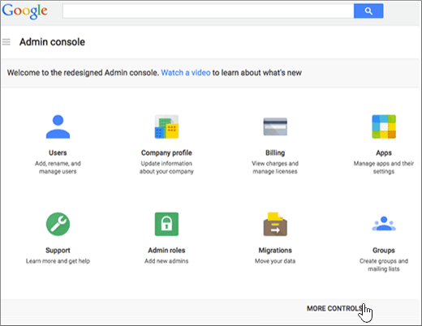

# Erstellen von DNS-Einträgen, wenn Ihre Domäne von Google verwaltet wird (eNom)Create DNS records when your domain is managed by Google (eNom)

 **[Überprüfen Sie die häufig gestellten Fragen (FAQ) zu Domänen](../setup/domains-faq.md)**, wenn Sie nicht finden, wonach Sie suchen.**[Check the Domains FAQ](../setup/domains-faq.md)** if you don't find what you're looking for. 
  
Zum Migrieren Ihrer e-Mail-Konten zu Microsoft müssen Sie einen DNS-Eintrag bei Ihrer Domänenregistrierungsstelle erstellen.To migrate your mail accounts to Microsoft, you need to create a DNS record at your domain registrar.
  
Wenn Sie Ihre Domäne über Google erworben haben, während Sie sich für Ihr **Google Apps for Work** -Konto angemeldet haben, werden Ihre DNS-Einträge von Google verwaltet, aber bei eNom registriert.If you purchased your domain through Google while signing up for your **Google Apps for Work** account, your DNS records are managed by Google but registered with eNom. 
  
Sie können über die Seite Google **Domains** auf eNom zugreifen und DNS erstellen.You can access eNom, and create DNS, through the Google **Domains** page. Führen Sie dazu die Schritte in diesem Artikel aus.Just follow the steps in this article. 
  
## Erstellen des DNS-EintragsCreate the DNS record

1. Wählen Sie in der [Google-Verwaltungskonsole](https://www.google.com/work/apps/business) **Anmelden**aus.At the [Google Admin console](https://www.google.com/work/apps/business), select **Sign In**.
    
    
  
2. Geben Sie Ihren Domänennamen ein, und wählen Sie dann **wechseln**aus.Enter your domain name, and then select **Go**.
    
    
  
3. Wählen Sie unten auf der Seite **Weitere Steuerelemente**aus.At the bottom of the page, select **More controls**.
    
    
  
4. Wählen Sie **Domänen** aus.Select **Domains**.
    
    
  
5. Wählen Sie auf der Seite **Domänen** die Option **Domänen hinzufügen/entfernen**aus.On the **Domains** page, select **Add/remove domains**.
    
    
  
6. Wählen Sie auf der Seite **Domänen** die Option **Erweiterte DNS-Einstellungen**aus.On the **Domains** page, select **Advanced DNS settings**.
    
    > [!NOTE]
    > Falls Sie während der Registrierung für Ihr **Google Apps for Work** -Konto keinen Domänennamen erworben haben, ist die Option **Erweiterte DNS-Einstellungen** nicht auf Ihrer Seite **Domains** verfügbar.If you didn't purchase a domain name through Google while signing up for your **Google Apps for Work** account, you won't have **Advanced DNS settings** on your **Domains** page. In diesem Fall müssen Sie direkt zur Website Ihres Domain-Hosts wechseln, um auf Ihre DNS-Einstellungen zuzugreifen, um diesen und die folgenden Schritte auszuführen.Instead, you must go directly to your domain host's web site to access your DNS settings and to perform this and the following steps. Weitere Informationen finden Sie unter [Access Your G Suite Domain Settings](https://support.google.com/a/answer/54693?hl=en) .See [Access your G Suite domain settings](https://support.google.com/a/answer/54693?hl=en) for more information. 
  
    
  
7. Wählen Sie auf der Seite **Erweiterte DNS-Einstellungen** die Option **Anmelden bei DNS-Konsole**aus.On the **Advanced DNS settings** page, select **Sign in to DNS Console**. Notieren Sie Ihre Angaben für **Anmeldename** und **Kennwort**.Note the **Sign-in name** and **Password** information. Sie benötigen Sie im nächsten Schritt.You'll need it in the next step. 
    
    
  
8. Melden Sie sich mithilfe des **Anmeldenamens** und **Kennworts** von der Seite **Advanced DNS settings** (Erweiterte DNS-Einstellungen) beim **Domain Manager** von Google an.Log in to the Google **Domain Manager** using the **Sign-in name** and **Password** from the **Advanced DNS settings** page. 
    
    
  
9. Wählen Sie auf der Seite ***domain_name*** im Abschnitt **Host Einträge** die Option **Bearbeiten**aus.On the ***domain_name*** page, in the **Host Records** section, select **Edit**.
    
    
  
10. Wählen Sie im Abschnitt **Host Einträge** die Option **Neues hinzufügen**aus.In the **Host Records** section, select **Add New**.
    
    
  
11. Geben Sie in den Feldern für den neuen Eintrag die Werte aus der folgenden Tabelle ein. Sie können die Werte auch kopieren und einfügen.In the boxes for the new record, type or copy and paste the values from the following table.
    
    |**HOST****HOST**|**TXT VALUE****TXT VALUE**|**Eintragstyp****RECORD TYPE**|
    |:-----|:-----|:-----|
    |@    ||TXTTXT    |

    > [!NOTE]
    > This is an example.This is an example. Verwenden Sie hier Ihre spezifischen **Ziel-oder Punkt-zu-Adresse** -Werte aus der Tabelle.Use your specific **Destination or Points to Address** value here, from the table. 
  
    [Wie finde ich diese Angabe?How do I find this?](../get-help-with-domains/information-for-dns-records.md)
  
12. Klicken Sie auf **Speichern**.Select **Save**.
    
    
  
13. Wählen Sie **Save Changes**aus.Select **Save Changes**.
    
    
  
> [!NOTE]
>  Normalerweise dauert es ungefähr 15 Minuten, bis DNS-Änderungen wirksam werden. Es kann jedoch gelegentlich länger dauern, bis eine von Ihnen vorgenommene Änderung im Internet im DNS-System aktualisiert wurde. Wenn nach dem Hinzufügen von DNS-Einträgen Probleme mit dem E-Mail-Fluss oder andere Probleme auftreten, lesen Sie [Behandeln von Problemen nach Änderung des Domänennamens oder von DNS-Einträgen](../get-help-with-domains/find-and-fix-issues.md).Typically it takes about 15 minutes for DNS changes to take effect. However, it can occasionally take longer for a change you've made to update across the Internet's DNS system. If you're having trouble with mail flow or other issues after adding DNS records, see [Troubleshoot issues after changing your domain name or DNS records](../get-help-with-domains/find-and-fix-issues.md). 
  
