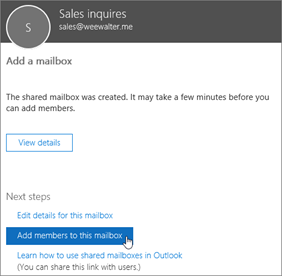

# Erstellen eines freigegebenen PostfachsCreate a shared mailbox 

> [!NOTE]
> Wenn Ihre Organisation eine Exchange-Hybridumgebung verwendet, sollten Sie das lokale Exchange Admin Center (EAC) zum Erstellen und Verwalten von freigegebenen Postfächern verwenden.If your organization uses a hybrid Exchange environment, you should use the on-premises Exchange admin center (EAC) to create and manage shared mailboxes. Siehe [Erstellen freigegebener Postfächer im Exchange Admin Center](/Exchange/collaboration/shared-mailboxes/create-shared-mailboxes?preserve-view=true.&view=exchserver-2019)See [Create shared mailboxes in the Exchange admin center](/Exchange/collaboration/shared-mailboxes/create-shared-mailboxes?preserve-view=true.&view=exchserver-2019)  
> Wenn Sie nicht sicher sind, ob Sie ein freigegebenes Postfach oder eine Microsoft 365-Gruppe für Outlook erstellen sollten, finden Sie Informationen dazu unter [Vergleichen von Gruppen](../create-groups/compare-groups.md).If you're not sure if you should create a shared mailbox or a Microsoft 365 group for Outlook, see [Compare groups](../create-groups/compare-groups.md) for some guidance. Beachten Sie, dass es aktuell nicht möglich ist, ein freigegebenes Postfach zu einer Microsoft 365-Gruppe zu migrieren.Note that currently, it's not possible to migrate a shared mailbox to a Microsoft 365 group. Wenn Sie diese Funktion wünschen, teilen Sie uns dies mittels [Hier abstimmen](https://go.microsoft.com/fwlink/?linkid=871518) mit.If this is something you want, let us know by [voting here](https://go.microsoft.com/fwlink/?linkid=871518).

Freigegebene Postfächer lassen sich auf einfache Weise erstellen, damit eine Gruppe von Personen E-Mails einer gemeinsamen E-Mail-Adresse wie "info@contoso.com" überwachen und senden kann. Wenn eine Person in der Gruppe auf eine Nachricht antwortet, die an das freigegebene Postfach gesendet wurde, wird als Absender der E-Mail das freigegebene Postfach angegeben, nicht der einzelne Benutzer. It's easy to create shared mailboxes so a group of people can monitor and send email from a common email addresses, like info@contoso.com. When a person in the group replies to a message sent to the shared mailbox, the email appears to be from the shared mailbox, not from the individual user.

Freigegebene Postfächer enthalten einen freigegebenen Kalender! Viele kleine Unternehmen nutzen den freigegebenen Kalender gerne als zentralen Ort, an dem jeder Mitarbeiter seine Termine eintragen kann. So können beispielsweise alle drei Personen, die Kundenbesuche durchführen, den freigegebenen Kalender nutzen und darin ihre Termine eintragen. Dies ist eine einfache Möglichkeit, um jeden über den jeweiligen Aufenthaltsort auf dem Laufenden zu halten.Shared mailboxes include a shared calendar. A lot of small businesses like to use the shared calendar as a place for everyone to enter their appointments. For example, if you have 3 people who do customer visits, all can use the shared calendar to enter the appointments. This is an easy way to keep everyone informed where people are.

Lesen Sie vor dem Erstellen eines freigegebenen Postfachs unbedingt [Informationen zu freigegebenen Postfächern](about-shared-mailboxes.md).Before creating a shared mailbox, be sure to read [About shared mailboxes](about-shared-mailboxes.md) for more information.

## Erstellen eines freigegebenen Postfachs und Hinzufügen von MitgliedernCreate a shared mailbox and add members
  
1. Melden Sie sich mit einem globalen Administrator oder mit einem Exchange-Administratorkonto an.Sign in with a global admin account or Exchange admin account. Wenn die Meldung „**Sie haben keine Berechtigung für den Zugriff auf diese Seite oder die Ausführung dieser Aktion**“ angezeigt wird, sind Sie kein Administrator.If you get the message "**You don't have permission to access this page or perform this action**," then you aren't an admin. 

::: moniker range="o365-worldwide"

2. Wechseln Sie im Admin Center zur Seite **Gruppen** \><a href="https://go.microsoft.com/fwlink/p/?linkid=2066847" target="_blank">Freigegebene Postfächer</a>.In the admin center, go to the **Groups** \> <a href="https://go.microsoft.com/fwlink/p/?linkid=2066847" target="_blank">Shared mailboxes</a> page.

::: moniker-end

::: moniker range="o365-germany"

2. Wechseln Sie im [Admin Center](https://go.microsoft.com/fwlink/p/?linkid=848041) zur Seite **Gruppen** \> **Freigegebene Postfächer**.In the [admin center](https://go.microsoft.com/fwlink/p/?linkid=848041), go to the **Groups** \> **Shared mailboxes** page.

::: moniker-end

::: moniker range="o365-21vianet"

2. Wechseln Sie im [Admin Center](https://go.microsoft.com/fwlink/p/?linkid=850627) zur Seite **Gruppen** \> **Freigegebene Postfächer**.In the [admin center](https://go.microsoft.com/fwlink/p/?linkid=850627), go to the **Groups** \> **Shared mailboxes** page.

::: moniker-end
    
3. Wählen Sie auf der Seite **Freigegebene Postfächer\*\*\*\*+ Postfach hinzufügen** aus.On the **Shared mailboxes** page, select **+ Add a mailbox**. Geben Sie einen Namen für das freigegebene Postfach ein.Enter a name for the shared mailbox. Der Assistent wählt dann die E-Mail-Adresse aus, die Sie aber bearbeiten können.Then the wizard chooses the email address, but you can edit it.
    
    
  
4. Klicken Sie auf **Hinzufügen**.Select **Add**. Es kann ein paar Minuten dauern, bevor Sie Mitglieder hinzufügen können.It may take a few minutes before you can add members.

5. Wählen Sie unter **Nächste Schritte** die Option **Mitglieder zu diesem Postfach hinzufügen** aus.Under **Next steps**, select **Add members to this mailbox**. Mitglieder sind die Personen, denen ermöglich wird, die eingehenden E-Mails für dieses freigegebene Postfach und die ausgehenden Antworten anzuzeigen.Members are the people who will be able to view the incoming mail to this shared mailbox, and the outgoing replies.

   

6. Wählen Sie die Schaltfläche **+ Mitglieder hinzufügen** aus.Select the **+Add members** button. Setzen Sie ein Häkchen neben diejenigen Personen, die dieses freigegebene Postfach nutzen sollen, und klicken Sie auf **Speichern**.Put a check mark next to the people who you want to use this shared mailbox, and select **Save**.

   

7. Wählen Sie **Schließen** aus.Select **Close**.

Sie haben ein freigegebenes Postfach, das einen freigegebenen Kalender enthält.You have a shared mailbox and it includes a shared calendar. Fahren Sie jetzt mit dem nächsten Schritt fort: Blockieren der Anmeldung für das freigegebene Postfachkonto.Now go on to the next step: block sign-in for the shared mailbox account.

## Welche Berechtigungen sollten Sie verwenden?Which permissions should you use?

Sie können die folgenden Berechtigungen mit einem freigegebenen Postfach verwenden:You can use the following permissions with a shared mailbox:

- **Vollzugriff**: Die Berechtigung „Vollzugriff“ ermöglicht es einem Benutzer, das freigegebene Postfach zu öffnen und als Besitzer dieses Postfachs zu agieren.**Full Access**: The Full Access permission lets a user open the shared mailbox and act as the owner of that mailbox. Nach dem Zugriff auf das freigegebene Postfach kann ein Benutzer Kalenderelemente erstellen, E-Mails lesen, anzeigen, löschen und ändern sowie Tasks und Kalenderkontakte erstellen.After accessing the shared mailbox, a user can create calendar items, read, view, delete, and change email messages, and create tasks and calendar contacts. Ein Benutzer mit der Berechtigung "Vollzugriff" kann jedoch keine E-Mails über das freigegebene Postfach senden, außer er hat auch die Berechtigung "Senden als" oder "Senden im Auftrag von".However, a user with Full Access permission can't send email from the shared mailbox unless they also have Send As or Send on Behalf permission.

- **Senden als**: Die Berechtigung „Senden als“ ermöglicht es einem Benutzer, die Identität des freigegebenen Postfachs beim Senden einer E-Mail zu wechseln.**Send As**: The Send As permission lets a user impersonate the shared mailbox when sending mail. Wenn Katerina sich beispielsweise beim freigegebenen Postfach „Marketingabteilung“ anmeldet und eine E-Mail sendet, sieht es so aus, als wäre die Nachricht von der Marketingabteilung gesendet worden.For example, if Katerina logs into the shared mailbox Marketing Department and sends an email, it will look like the Marketing Department sent the email.

- **Senden im Auftrag von**: Die Berechtigung „Senden im Auftrag von“ ermöglicht es einem Benutzer, E-Mails im Namen des freigegebenen Postfachs zu senden.**Send on Behalf**: The Send on Behalf permission lets a user send email on behalf of the shared mailbox. Beispiel: John meldet sich beim freigegebenen Postfach des Empfangs in Gebäude 32 an und sendet eine E-Mail. Dem Empfänger wird angezeigt, dass John sie im Auftrag des Empfangs in Gebäude 32 gesendet hat.For example, if John logs into the shared mailbox Reception Building 32 and sends an email, it will look like the mail was sent by "John on behalf of Reception Building 32". Sie können „Senden im Auftrag von“-Berechtigungen nicht über das EAC erteilen, sondern müssen das Cmdlet **Set-Mailbox** mit dem Parameter _GrantSendonBehalf_ verwenden.You can't use the EAC to grant Send on Behalf permissions, you must use the **Set-Mailbox** cmdlet with the _GrantSendonBehalf_ parameter.

### Verwenden des EAC zum Bearbeiten der Stellvertretung für das freigegebene PostfachUse the EAC to edit shared mailbox delegation

1. Navigieren Sie in der EAC zu **Empfänger** \> **Freigegeben**.In the EAC, go to **Recipients** \> **Shared**. Wählen Sie das gewünschte freigegebene Postfach und dann **Bearbeiten**  aus.Select the shared mailbox, and then select **Edit** .

2. Wählen Sie **Postfachstellvertretung**.Select **Mailbox delegation**.

3. Wählen Sie zum Erteilen oder Entziehen von Vollzugriff oder „Senden als“-Berechtigungen die Option **Hinzufügen** oder **Entfernen** und dann die Benutzer aus, für die Sie die Berechtigungen erteilen bzw. entziehen möchten.To grant or remove Full Access and Send As permissions, select **Add**  or **Remove**  and then select the users you want to grant permissions to.

   > [!NOTE]
   > Die Vollzugriff-Berechtigung ermöglicht es einem Benutzer, das Postfach zu öffnen und Elemente darin zu erstellen oder zu ändern. Die "Senden als"-Berechtigung ermöglicht es Benutzern, bei denen es sich nicht um den Postfachbesitzer handelt, E-Mails von dem freigegebenen Postfach zu senden. Beide Berechtigungen sind für erfolgreiche freigegebene Postfächer erforderlich.The Full Access permission allows a user to open the mailbox as well as create and modify items in it. The Send As permission allows anyone other than the mailbox owner to send email from this shared mailbox. Both permissions are required for successful shared mailbox operation.

4. Wählen Sie **Speichern** aus, um Ihre Änderungen zu speichern.Select **Save** to save your changes.

## Blockieren der Anmeldung für das freigegebene PostfachkontoBlock sign-in for the shared mailbox account

Zu jedem freigegebenen Postfach gehört ein entsprechendes Benutzerkonto.Every shared mailbox has a corresponding user account. Haben Sie festgestellt, dass Sie beim Erstellen des freigegebenen Postfachs nicht zur Eingabe eines Kennworts aufgefordert wurden?Notice how you weren't asked to provide a password when you created the shared mailbox? Das Konto verfügt über ein Kennwort, das jedoch vom System generiert wurde (unbekannt).The account has a password, but it's system-generated (unknown). Sie sollten sich nicht mit dem Konto beim freigegebenen Postfach anmelden.You aren't supposed to use the account to log in to the shared mailbox.

Doch was passiert, wenn ein Administrator einfach das Kennwort für das freigegebene Postfachbenutzerkonto zurücksetzt?But what if an admin simply resets the password of the shared mailbox user account? Oder was passiert, wenn ein Angreifer Zugriff auf die Anmeldeinformationen des freigegebenen Postfachkontos erhält?Or what if an attacker gains access to the shared mailbox account credentials? Dies würde dem Benutzerkonto ermöglichen, sich beim freigegebenen Postfach anzumelden und eine E-Mail zu senden.This would allow the user account to log in to the shared mailbox and send email. Um dies zu verhindern, müssen Sie die Anmeldung für das Konto blockieren, das dem freigegebenen Postfach zugeordnet ist.To prevent this, you need to block sign-in for the account that's associated with the shared mailbox.

::: moniker range="o365-worldwide"

1. Wechseln Sie im Admin Center zu der Seite **Benutzer** \> <a href="https://go.microsoft.com/fwlink/p/?linkid=834822" target="_blank">Aktive Benutzer</a>.In the admin center, go to the **Users** \> <a href="https://go.microsoft.com/fwlink/p/?linkid=834822" target="_blank">Active users</a> page.

::: moniker-end

::: moniker range="o365-germany"

1. Wechseln Sie im Admin Center zu der Seite **Benutzer** \> <a href="https://go.microsoft.com/fwlink/p/?linkid=847686" target="_blank">Aktive Benutzer</a>.In the admin center, go to the **Users** \> <a href="https://go.microsoft.com/fwlink/p/?linkid=847686" target="_blank">Active users</a> page.

::: moniker-end

::: moniker range="o365-21vianet"

1. Wechseln Sie im Admin Center zu der Seite **Benutzer** \> <a href="https://go.microsoft.com/fwlink/p/?linkid=850628" target="_blank">Aktive Benutzer</a>.In the admin center, go to the **Users** \> <a href="https://go.microsoft.com/fwlink/p/?linkid=850628" target="_blank">Active users</a> page.
::: moniker-end

1. Suchen Sie in der Liste der Benutzerkonten nach dem Konto für das freigegebene Postfach (ändern Sie beispielsweise den Filter in **Nicht lizenzierte Benutzer**).In the list of user accounts, find the account for the shared mailbox (for example, change the filter to **Unlicensed users**).

1. Wählen Sie den Benutzer aus, dessen Eigenschaftenbereich Sie öffnen möchten, und wählen Sie dann das Symbol **Diesen Benutzer blockieren** .Select the user to open their properties pane, and then select the **Block this user** icon .

   **Hinweis**: Wenn das Konto bereits blockiert ist, wird am oberen Rand **Anmeldung blockiert** angezeigt und das Symbol zeigt **Entsperren des Benutzers**.**Note**: If the account is already blocked, **Sign in blocked** will appear at the top and the icon will read **Unblock this user**.

1. Wählen Sie im Bereich **Diesen Benutzer blockieren?** **Benutzer für die Anmeldung blockieren** aus und wählen Sie dann **Änderungen speichern**.In the **Block this user?** pane, select **Block the user from signing in**, and then select **Save changes**.

Anweisungen dazu, wie Sie die-Anmeldung für-Konten mit Azure AD PowerShell (einschließlich vieler Konten gleichzeitig) blockieren können, finden Sie unter [Blockieren von Benutzerkonten mit Office 365 PowerShell](../../enterprise/block-user-accounts-with-microsoft-365-powershell.md).For instructions on how to block sign-in for accounts using Azure AD PowerShell (including many accounts at the same time), see [Block user accounts with Office 365 PowerShell](../../enterprise/block-user-accounts-with-microsoft-365-powershell.md).

## Hinzufügen des freigegebenen Postfachs in OutlookAdd the shared mailbox to Outlook

Wenn Sie in Ihrem Unternehmen die automatische Zuordnung aktiviert haben (wie es die meisten Benutzer standardmäßig tun), wird das freigegebene Postfach in der Outlook-App ihrer Benutzer automatisch angezeigt, nachdem sie Outlook geschlossen und erneut gestartet haben.If you have automapping enabled in your business (by default, most people do), the shared mailbox will appear in your user's Outlook app automatically after they close and restart Outlook. 

Die automatische Zuordnung wird für das Postfach des Benutzers und nicht für das freigegebene Postfach festgelegt.  Automapping is set on the user's mailbox, not the shared mailbox. Dies bedeutet: Wenn Sie über eine Sicherheitsgruppe zu verwalten versuchen, wer auf das freigegebene Postfach zugreifen darf, funktioniert die automatische Zuordnung nicht.This means if you try to use a security group to manage who has access to the shared mailbox, automapping won't work. Deshalb müssen Sie zur Nutzung der automatischen Zuordnung Berechtigungen explizit zuweisen.So, if you want automapping, you have to assign permissions explicitly. Die automatische Zuordnung ist standardmäßig aktiviert.Automapping is on by default. Informationen zum Deaktivieren dieser Option finden Sie unter [Entfernen der automatischen Zuordnung für ein freigegebenes Postfach](/office365/troubleshoot/administration/remove-automapping-for-shared-mailbox).To learn how to turn it off, see [Remove automapping for a shared mailbox](/office365/troubleshoot/administration/remove-automapping-for-shared-mailbox).

Weitere Informationen zu in Outlook freigegebenen Postfächern finden Sie unter:To learn more about shared mailboxes in Outlook, see:

- <a href="https://support.microsoft.com/office/d94a8e9e-21f1-4240-808b-de9c9c088afd" target="_blank">Öffnen und Verwenden eines geteilten Postfachs in Outlook</a><a href="https://support.microsoft.com/office/d94a8e9e-21f1-4240-808b-de9c9c088afd" target="_blank">Open and use a shared mailbox in Outlook</a>

- <a href="https://support.microsoft.com/office/98b5a90d-4e38-415d-a030-f09a4cd28207" target="_blank">Hinzufügen eines freigegebenen Postfachs zu Outlook im Web</a><a href="https://support.microsoft.com/office/98b5a90d-4e38-415d-a030-f09a4cd28207" target="_blank">Add a shared mailbox to Outlook on the web</a>

- <a href="https://support.microsoft.com/office/f866242c-81b2-472e-8776-6c49c5473c9f" target="_blank">Hinzufügen eines geteilten Postfachs zu Outlook Mobile</a><a href="https://support.microsoft.com/office/f866242c-81b2-472e-8776-6c49c5473c9f" target="_blank">Add a shared mailbox to Outlook mobile</a>

- <a href="https://support.microsoft.com/office/6ecc39c5-5577-4a1d-b18c-bbdc92972cb2" target="_blank">Öffnen eines freigegebenen Ordners oder Postfachs in Outlook für Mac</a><a href="https://support.microsoft.com/office/6ecc39c5-5577-4a1d-b18c-bbdc92972cb2" target="_blank">Open a shared folder or mailbox in Outlook for Mac</a>

- <a href="https://support.microsoft.com/office/b0963400-2a51-4c64-afc7-b816d737d164" target="_blank">Hinzufügen von Regeln zu einem freigegebenen Postfach</a><a href="https://support.microsoft.com/office/b0963400-2a51-4c64-afc7-b816d737d164" target="_blank">Add rules to a shared mailbox</a>

## Verwenden eines geteilten Postfachs auf einem mobilen Gerät (Smartphone oder Tablet)Use a shared mailbox on a mobile device (phone or tablet)

Sie können auf ein geteiltes Postfach auf einem mobilen Gerät auf zweierlei Arten zuzugreifen:You can access a shared mailbox on a mobile device in two ways:
- Fügen Sie das freigegebene Postfach in der <a href="https://apps.apple.com/us/app/microsoft-outlook/id951937596" target="_blank">Outlook für iOS-App</a> oder der <a href="https://play.google.com/store/apps/details?id=com.microsoft.office.outlook&hl=en_US" target="_blank">Outlook for Android Mobile-App</a> hinzu.Add the shared mailbox in the <a href="https://apps.apple.com/us/app/microsoft-outlook/id951937596" target="_blank">Outlook for iOS app</a> or the <a href="https://play.google.com/store/apps/details?id=com.microsoft.office.outlook&hl=en_US" target="_blank">Outlook for Android mobile app</a>. 
    
    Die entsprechenden Anleitungen finden Sie unter <a href="https://support.microsoft.com/office/f866242c-81b2-472e-8776-6c49c5473c9f" target="_blank">Hinzufügen eines freigegebenen Postfachs zu Outlook Mobile</a>.For instructions, see <a href="https://support.microsoft.com/office/f866242c-81b2-472e-8776-6c49c5473c9f" target="_blank">Add a shared mailbox to Outlook mobile</a>.

- Öffnen Sie Ihren Browser, melden Sie sich an und wechseln Sie dann zu Outlook im Web.Open your browser, sign in, and then go to Outlook on the web. Von Outlook im Web aus können Sie auf das freigegebene Postfach zugreifen.From Outlook on the web you'll be able to access the shared mailbox.

    Die entsprechenden Anleitungen finden Sie unter <a href="https://support.microsoft.com/office/98b5a90d-4e38-415d-a030-f09a4cd28207" target="_blank">Hinzufügen eines freigegebenen Postfachs zu Outlook im Web</a>.For instructions, see <a href="https://support.microsoft.com/office/98b5a90d-4e38-415d-a030-f09a4cd28207" target="_blank">Add a shared mailbox to Outlook on the web</a>.
    
> [!NOTE]
> Das freigegebene Postfach kann nur zur Outlook für iOS-App oder zur mobilen Outlook für Android-App hinzugefügt werden.Shared mailbox can only be added to Outlook for iOS app or the Outlook for Android mobile app

## Verwenden des geteilten KalendersUse the shared calendar

Beim Erstellen des freigegebenen Postfachs haben Sie automatisch auch einen freigegebenen Kalender erstellt. Wir verwenden bevorzugt den freigegebenen Kalender des Postfachs statt eines SharePoint-Kalenders zum Nachverfolgen von Terminen und des Aufenthaltsorts von Personen. Ein freigegebener Kalender ist in Outlook integriert und ist viel einfacher zu verwenden als ein SharePoint-Kalender.When you created the shared mailbox, you automatically created a shared calendar. We like the shared mailbox calendar rather than a SharePoint calendar for keeping track of appointments and where people are. A shared calendar is integrated with Outlook and it's much easier to use than a SharePoint calendar.

1. Wechseln Sie in der Outlook-App zur Kalenderansicht und wählen Sie das freigegebene Postfach aus.In the Outlook app, go to calendar view, and select the shared mailbox.

2. Wenn Sie Termine eingeben, kann diese jeder ansehen, der Mitglied des geteilten Postfachs ist.When you enter appointments, everyone who is a member of the shared mailbox will be able to see them.

3. Jedes Mitglied des geteilten Postfachs kann Termine im Kalender erstellen, sehen und verwalten, genau wie in seinem persönlichen Kalender.Any member of the shared mailbox can create, view, and manage appointments on the calendar, just like they would their personal appointments. Jedes Mitglied des geteilten Postfachs kann Änderungen im freigegebenen Kalender sehen.Everyone who is a member of shared mailbox can see their changes to the shared calendar.

## Verwandte InhalteRelated content

[Informationen zu freigegebenen Postfächern](about-shared-mailboxes.md) (Artikel)[About shared mailboxes](about-shared-mailboxes.md) (article)\
[Konfigurieren eines freigegebenen Postfachs](configure-a-shared-mailbox.md) (Artikel)[Configure a shared mailbox](configure-a-shared-mailbox.md) (article)\
[Konvertieren eines Benutzerpostfachs in ein freigegebenes Postfach](convert-user-mailbox-to-shared-mailbox.md) (Artikel)[Convert a user mailbox to a shared mailbox](convert-user-mailbox-to-shared-mailbox.md) (article)\
[Entfernen einer Lizenz aus einem freigegebenen Postfach](remove-license-from-shared-mailbox.md) (Artikel)[Remove a license from a shared mailbox](remove-license-from-shared-mailbox.md) (article)\
[Beheben von Problemen mit freigegebenen Postfächern](resolve-issues-with-shared-mailboxes.md) (Artikel)[Resolve issues with shared mailboxes](resolve-issues-with-shared-mailboxes.md) (article)