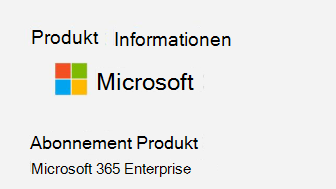

# <a name="determine-if-centralized-deployment-of-add-ins-works-for-your-organization"></a><span data-ttu-id="29e98-103">Ermitteln, ob die zentrale Bereitstellung von Add-Ins für Ihre Organisation funktioniert</span><span class="sxs-lookup"><span data-stu-id="29e98-103">Determine if Centralized Deployment of add-ins works for your organization</span></span>

<span data-ttu-id="29e98-104">Die zentrale Bereitstellung ist die empfohlene und funktionsreichste Möglichkeit für die meisten Kunden, Office-Add-Ins für Benutzer und Gruppen in Ihrer Organisation bereitzustellen.</span><span class="sxs-lookup"><span data-stu-id="29e98-104">Centralized Deployment is the recommended and most feature-rich way for most customers to deploy Office add-ins to users and groups within your organization.</span></span> <span data-ttu-id="29e98-105">Wenn Sie Administrator sind, ermitteln Sie anhand dieser Anleitung, ob Ihre Organisation und die Benutzer die Anforderungen erfüllen, damit Sie die zentralisierte Bereitstellung verwenden können.</span><span class="sxs-lookup"><span data-stu-id="29e98-105">If you're an admin, use this guidance to determine if your organization and users meet the requirements so that you can use Centralized Deployment.</span></span>

<span data-ttu-id="29e98-106">Die zentrale Bereitstellung bietet die folgenden Vorteile:</span><span class="sxs-lookup"><span data-stu-id="29e98-106">Centralized Deployment provides the following benefits:</span></span>
  
- <span data-ttu-id="29e98-107">Ein globaler Administrator kann ein Add-in direkt einem Benutzer, mehreren Benutzern über eine Gruppe oder allen in der Organisation zuweisen.</span><span class="sxs-lookup"><span data-stu-id="29e98-107">A Global admin can assign an add-in directly to a user, to multiple users via a group, or to everyone in the organization.</span></span>
    
- <span data-ttu-id="29e98-108">Wenn die entsprechende Office-Anwendung gestartet wird, lädt das Add-in automatisch herunter.</span><span class="sxs-lookup"><span data-stu-id="29e98-108">When the relevant Office application starts, the add-in automatically downloads.</span></span> <span data-ttu-id="29e98-109">Wenn das Add-in Add-in-Befehle unterstützt, wird das Add-in automatisch im Menüband in der Office-Anwendung angezeigt.</span><span class="sxs-lookup"><span data-stu-id="29e98-109">If the add-in supports add-in commands, the add-in automatically appears in the ribbon within the Office application.</span></span>
    
- <span data-ttu-id="29e98-110">Add-Ins werden nicht mehr für Benutzer angezeigt, wenn der Administrator das Add-in deaktiviert oder löscht oder wenn der Benutzer aus Azure Active Directory oder aus einer Gruppe entfernt wird, der das Add-in zugewiesen ist.</span><span class="sxs-lookup"><span data-stu-id="29e98-110">Add-ins no longer appear for users if the admin turns off or deletes the add-in, or if the user is removed from Azure Active Directory or from a group that the add-in is assigned to.</span></span>

<span data-ttu-id="29e98-111">Die zentralisierte Bereitstellung unterstützt drei Windows-, Mac-und Online Office-Apps für Desktopplattformen.</span><span class="sxs-lookup"><span data-stu-id="29e98-111">Centralized Deployment supports three desktop platforms Windows, Mac and Online Office apps.</span></span> <span data-ttu-id="29e98-112">Die zentralisierte Bereitstellung unterstützt auch IOS und Android (nur Outlook Mobile-Add-Ins).</span><span class="sxs-lookup"><span data-stu-id="29e98-112">Centralized Deployment also supports iOS and Android (Outlook Mobile Add-ins Only).</span></span>

<span data-ttu-id="29e98-113">Es kann bis zu 24 Stunden dauern, bis ein Add-in für alle Benutzer für den Client angezeigt wird.</span><span class="sxs-lookup"><span data-stu-id="29e98-113">It can take up to 24 hours for an add-in to show up for client for all users.</span></span>
  
## <a name="requirements"></a><span data-ttu-id="29e98-114">Anforderungen</span><span class="sxs-lookup"><span data-stu-id="29e98-114">Requirements</span></span>

<span data-ttu-id="29e98-115">Die zentrale Bereitstellung von Add-ins erfordert, dass die Benutzer Microsoft 365-Apps für Unternehmen verwenden (und mit ihrer Organisations-ID bei Office angemeldet sind) und über Exchange Online und aktive Exchange Online-Postfächer verfügen.</span><span class="sxs-lookup"><span data-stu-id="29e98-115">Centralized deployment of add-ins requires that the users are using Microsoft 365 Apps for enterprise (and are signed into Office using their organizational ID), and have Exchange Online and active Exchange Online mailboxes.</span></span> <span data-ttu-id="29e98-116">Ihr Abonnement Verzeichnis muss sich entweder in oder im Verbund mit Azure Active Directory befinden.</span><span class="sxs-lookup"><span data-stu-id="29e98-116">Your subscription directory must either be in, or federated to Azure Active Directory.</span></span>
<span data-ttu-id="29e98-117">Sie können die spezifischen Anforderungen für Office und Exchange unten anzeigen oder die[Kompatibilitätsprüfung für die zentrale Bereitstellung](#centralized-deployment-compatibility-checker)verwenden.</span><span class="sxs-lookup"><span data-stu-id="29e98-117">You can view specific requirements for Office and Exchange below, or use the[Centralized Deployment Compatibility Checker](#centralized-deployment-compatibility-checker).</span></span>

<span data-ttu-id="29e98-118">Folgendes wird von der zentralen Bereitstellung nicht unterstützt:</span><span class="sxs-lookup"><span data-stu-id="29e98-118">Centralized Deployment doesn't support the following:</span></span>
  
- <span data-ttu-id="29e98-119">Add-Ins, die Word, Excel oder PowerPoint in Office 2013 zum Ziel haben</span><span class="sxs-lookup"><span data-stu-id="29e98-119">Add-ins that target Word, Excel, or PowerPoint in Office 2013</span></span> 
- <span data-ttu-id="29e98-120">Ein lokaler Verzeichnisdienst</span><span class="sxs-lookup"><span data-stu-id="29e98-120">An on-premises directory service</span></span>
- <span data-ttu-id="29e98-121">Add-in-Bereitstellung in einem Exchange-basierten Postfach</span><span class="sxs-lookup"><span data-stu-id="29e98-121">Add-in Deployment to an Exchange On-Prem Mailbox</span></span>
- <span data-ttu-id="29e98-122">Add-In-Bereitstellung in SharePoint</span><span class="sxs-lookup"><span data-stu-id="29e98-122">Add-in deployment to SharePoint</span></span>  
- <span data-ttu-id="29e98-123">Microsoft Teams-apps</span><span class="sxs-lookup"><span data-stu-id="29e98-123">Teams apps</span></span>
- <span data-ttu-id="29e98-124">Bereitstellung der Add-Ins Component Object Model (COM) oder Visual Studio Tools für Office (VSTO)</span><span class="sxs-lookup"><span data-stu-id="29e98-124">Deployment of Component Object Model (COM) or Visual Studio Tools for Office (VSTO) add-ins</span></span>
- <span data-ttu-id="29e98-125">Bereitstellungen von Microsoft 365, die Exchange wie Microsoft 365 apps for Business nicht enthalten</span><span class="sxs-lookup"><span data-stu-id="29e98-125">Deployments of Microsoft 365 that do not include Exchange such as Microsoft 365 Apps for business</span></span>

### <a name="office-requirements"></a><span data-ttu-id="29e98-126">Office-Anforderungen</span><span class="sxs-lookup"><span data-stu-id="29e98-126">Office Requirements</span></span>

- <span data-ttu-id="29e98-127">Für Word-, Excel-und PowerPoint-Add-Ins müssen die Benutzer eine der folgenden Optionen verwenden:</span><span class="sxs-lookup"><span data-stu-id="29e98-127">For Word, Excel, and PowerPoint add-ins, your users must be using one of the following:</span></span>
  - <span data-ttu-id="29e98-128">Auf einem Windows-Gerät Version 1704 oder höher von Microsoft 365 apps for Enterprise.</span><span class="sxs-lookup"><span data-stu-id="29e98-128">On a Windows device, Version 1704 or later of Microsoft 365 Apps for enterprise.</span></span>
  - <span data-ttu-id="29e98-129">Auf einem Mac, Version 15,34 oder höher.</span><span class="sxs-lookup"><span data-stu-id="29e98-129">On a Mac, Version 15.34 or later.</span></span>

- <span data-ttu-id="29e98-130">Für Outlook müssen die Benutzer eine der folgenden Optionen verwenden:</span><span class="sxs-lookup"><span data-stu-id="29e98-130">For Outlook, your users must be using one of the following:</span></span> 
  - <span data-ttu-id="29e98-131">Version 1701 oder höher von Microsoft 365 Apps für Unternehmen.</span><span class="sxs-lookup"><span data-stu-id="29e98-131">Version 1701 or later of Microsoft 365 Apps for enterprise.</span></span>
  - <span data-ttu-id="29e98-132">Version 1808 oder höher von Office Professional Plus 2019 oder Office Standard 2019.</span><span class="sxs-lookup"><span data-stu-id="29e98-132">Version 1808 or later of Office Professional Plus 2019 or Office Standard 2019.</span></span>
  - <span data-ttu-id="29e98-133">Version 16.0.4494.1000 oder höher von Office Professional Plus 2016 (MSI) oder Office Standard 2016 (MSI)\*</span><span class="sxs-lookup"><span data-stu-id="29e98-133">Version 16.0.4494.1000 or later of Office Professional Plus 2016 (MSI) or Office Standard 2016 (MSI)\*</span></span>
  - <span data-ttu-id="29e98-134">Version 15.0.4937.1000 oder höher von Office Professional Plus 2013 (MSI) oder Office Standard 2013 (MSI)\*</span><span class="sxs-lookup"><span data-stu-id="29e98-134">Version 15.0.4937.1000 or later of Office Professional Plus 2013 (MSI) or Office Standard 2013 (MSI)\*</span></span>
  - <span data-ttu-id="29e98-135">Version 16.0.9318.1000 oder höher von Office 2016 für Mac</span><span class="sxs-lookup"><span data-stu-id="29e98-135">Version 16.0.9318.1000 or later of Office 2016 for Mac</span></span> 
- <span data-ttu-id="29e98-136">Version 2.75.0 oder höher von Outlook Mobile für IOS</span><span class="sxs-lookup"><span data-stu-id="29e98-136">Version 2.75.0 or later of Outlook mobile for iOS</span></span> 
- <span data-ttu-id="29e98-137">Version 2.2.145 oder höher von Outlook Mobile für Android</span><span class="sxs-lookup"><span data-stu-id="29e98-137">Version 2.2.145 or later of Outlook mobile for Android</span></span> 
    
    <span data-ttu-id="29e98-138">\* MSI-Versionen von Outlook zeigen Administrator installierte Add-Ins im entsprechenden Outlook-Menüband, nicht im Abschnitt "meine Add-Ins".</span><span class="sxs-lookup"><span data-stu-id="29e98-138">\*MSI versions of Outlook show admin-installed add-ins in the appropriate Outlook ribbon, not the "My add-ins" section.</span></span>
    

#### <a name="find-out-if-microsoft-365-apps-for-enterprise-is-installed"></a><span data-ttu-id="29e98-139">Finden Sie heraus, ob Microsoft 365 apps for Enterprise installiert ist.</span><span class="sxs-lookup"><span data-stu-id="29e98-139">Find out if Microsoft 365 Apps for enterprise is installed</span></span>

<span data-ttu-id="29e98-140">Um Microsoft 365-Apps für Enterprise verwenden zu können, muss ein Benutzer über ein Microsoft 365-Konto verfügen, dem eine Lizenz zugewiesen sein muss.</span><span class="sxs-lookup"><span data-stu-id="29e98-140">To use Microsoft 365 Apps for enterprise, a user must have an Microsoft 365 account and must have been assigned a license.</span></span> <span data-ttu-id="29e98-141">Weitere Informationen finden Sie unter [Overview of Microsoft 365 apps for Enterprise](https://go.microsoft.com/fwlink/p/?linkid=846328).</span><span class="sxs-lookup"><span data-stu-id="29e98-141">For more information, see [Overview of Microsoft 365 Apps for enterprise](https://go.microsoft.com/fwlink/p/?linkid=846328).</span></span>

<span data-ttu-id="29e98-142">Die einfachste Möglichkeit zu erkennen, ob ein Benutzer Microsoft 365 apps for Enterprise installiert hat und seit kurzem verwendet wurde, ist die Verwendung des Berichts "Microsoft Office Aktivierungen", der im Microsoft 365 Admin Center verfügbar ist.</span><span class="sxs-lookup"><span data-stu-id="29e98-142">The simplest way to detect if a user has Microsoft 365 Apps for enterprise installed and has been using it recently is to use the Microsoft Office Activations report, which is available in the Microsoft 365 admin center.</span></span> <span data-ttu-id="29e98-143">Der Bericht enthält eine Liste aller Benutzer, die Microsoft 365-Apps für Enterprise in den letzten 7 Tagen, 30 Tagen, 90 Tagen oder 180 Tagen aktiviert haben.</span><span class="sxs-lookup"><span data-stu-id="29e98-143">The report provides a list of all users who have activated Microsoft 365 Apps for enterprise within the last 7 days, 30 days, 90 days, or 180 days.</span></span> <span data-ttu-id="29e98-144">Im Zusammenhang mit der zentralen Bereitstellung sind die Desktopaktivierungen für Windows oder Mac die wichtigen Spalten im Bericht.</span><span class="sxs-lookup"><span data-stu-id="29e98-144">For centralized deployment purposes, the desktop activations for Windows or Mac are the important columns in the report.</span></span> <span data-ttu-id="29e98-145">Sie können den Bericht nach Excel exportieren.</span><span class="sxs-lookup"><span data-stu-id="29e98-145">You can export the report to Excel.</span></span> <span data-ttu-id="29e98-146">Weitere Informationen zum Bericht finden Sie unter [Microsoft 365 Reports im Admin Center – Microsoft Office Aktivierungen](../activity-reports/microsoft-office-activations.md).</span><span class="sxs-lookup"><span data-stu-id="29e98-146">For more information about the report, see [Microsoft 365 Reports in the Admin Center - Microsoft Office activations](../activity-reports/microsoft-office-activations.md).</span></span>
  
<span data-ttu-id="29e98-147">Wenn Sie den Aktivierungsbericht nicht verwenden möchten, können Sie einen Benutzer bitten, eine Office-Anwendung wie Word auf seinem Computer zu öffnen, und dann **Datei** \> **Konto**auswählen.</span><span class="sxs-lookup"><span data-stu-id="29e98-147">If you don't want to use the Activations report, you can ask a user to open an Office application such as Word on their machine, and then choose **File** \> **Account**.</span></span> <span data-ttu-id="29e98-148">Unter **Produktinformationen**sollten das **Abonnement Produkt** und **Microsoft 365 für Enterprise**oder Microsoft 365 Business Premium angezeigt werden, ähnlich wie in der folgenden Abbildung dargestellt.</span><span class="sxs-lookup"><span data-stu-id="29e98-148">Under **Product Information**, you should see **Subscription Product** and **Microsoft 365 for enterprise**,or Microsoft 365 Business Premium, similar to what is shown in the following image.</span></span>


  
<span data-ttu-id="29e98-150">Hilfe zu Microsoft 365-Apps für Unternehmen finden Sie unter [Troubleshooting Tips for Microsoft 365 apps for Enterprise](https://go.microsoft.com/fwlink/p/?linkid=846339).</span><span class="sxs-lookup"><span data-stu-id="29e98-150">For help with Microsoft 365 Apps for enterprise, see [Troubleshooting tips for Microsoft 365 Apps for enterprise](https://go.microsoft.com/fwlink/p/?linkid=846339).</span></span>


### <a name="exchange-online-requirements"></a><span data-ttu-id="29e98-151">Exchange Online Anforderungen</span><span class="sxs-lookup"><span data-stu-id="29e98-151">Exchange Online requirements</span></span>

<span data-ttu-id="29e98-152">Microsoft Exchange speichert die Add-in-Manifeste im Mandanten Ihrer Organisation.</span><span class="sxs-lookup"><span data-stu-id="29e98-152">Microsoft Exchange stores the add-in manifests within your organization's tenant.</span></span> <span data-ttu-id="29e98-153">Der Administrator, der Add-ins bereitstellt, und die Benutzer, die diese Add-ins empfangen, müssen sich in einer Version von Exchange Online befinden, die die OAuth-Authentifizierung unterstützt.</span><span class="sxs-lookup"><span data-stu-id="29e98-153">The admin deploying add-ins and the users receiving those add-ins must be on a version of Exchange Online that supports OAuth authentication.</span></span>
  
<span data-ttu-id="29e98-p109">Informieren Sie sich beim Exchange-Administrator Ihrer Organisation, um herauszufinden, welche Konfiguration verwendet wird. Die OAuth-Verbindung pro Benutzer kann überprüft werden, indem Sie das PowerShell-Cmdlet [Test-OAuthConnectivity](https://go.microsoft.com/fwlink/p/?linkid=846351) verwenden.</span><span class="sxs-lookup"><span data-stu-id="29e98-p109">Check with your organization's Exchange admin to find out which configuration is in use. OAuth connectivity per user can be verified by using the [Test-OAuthConnectivity](https://go.microsoft.com/fwlink/p/?linkid=846351) PowerShell cmdlet.</span></span> 


### <a name="centralized-deployment-compatibility-checker"></a><span data-ttu-id="29e98-156">Zentrale Bereitstellungs Kompatibilitätsprüfung</span><span class="sxs-lookup"><span data-stu-id="29e98-156">Centralized Deployment Compatibility Checker</span></span>

<span data-ttu-id="29e98-157">Mithilfe der zentralen Bereitstellungs Kompatibilitätsprüfung können Sie überprüfen, ob die Benutzer Ihres Mandanten für die Verwendung der zentralisierten Bereitstellung für Word, Excel und PowerPoint eingerichtet sind.</span><span class="sxs-lookup"><span data-stu-id="29e98-157">Using the Centralized Deployment Compatibility Checker, you can verify whether the users on your tenant are set up to use Centralized Deployment for Word, Excel and PowerPoint.</span></span> <span data-ttu-id="29e98-158">Die Kompatibilitätsprüfung ist für die Unterstützung von Outlook nicht erforderlich.</span><span class="sxs-lookup"><span data-stu-id="29e98-158">The Compatibility Checker is not required for Outlook support.</span></span> <span data-ttu-id="29e98-159">Laden Sie die Kompatibilitätsprüfung [hier](https://aka.ms/officeaddindeploymentorgcompatibilitychecker) herunter.</span><span class="sxs-lookup"><span data-stu-id="29e98-159">Download the compatibility checker [here](https://aka.ms/officeaddindeploymentorgcompatibilitychecker).</span></span>
  
#### <a name="run-the-compatibility-checker"></a><span data-ttu-id="29e98-160">Ausführen der Kompatibilitätsprüfung</span><span class="sxs-lookup"><span data-stu-id="29e98-160">Run the compatibility checker</span></span>
  
1. <span data-ttu-id="29e98-161">Starten Sie ein Fenster mit erhöhten PowerShell.exe.</span><span class="sxs-lookup"><span data-stu-id="29e98-161">Start an elevated PowerShell.exe window.</span></span>
    
2. <span data-ttu-id="29e98-162">Führen Sie den folgenden Befehl aus:</span><span class="sxs-lookup"><span data-stu-id="29e98-162">Run the following command:</span></span>

   ```powershell
   Import-Module O365CompatibilityChecker
   ```
    
3. <span data-ttu-id="29e98-163">Führen Sie den Befehl **Invoke-CompatabilityCheck** aus:</span><span class="sxs-lookup"><span data-stu-id="29e98-163">Run the **Invoke-CompatabilityCheck** command:</span></span>

   ```powershell
   Invoke-CompatibilityCheck
   ```
   <span data-ttu-id="29e98-164">Mit diesem Befehl werden Sie zur Eingabe von  *_TenantDomain_* aufgefordert (beispielsweise *TailspinToysIncorporated. onmicrosoft. </span> com*) und  *_TenantAdmin_* -Anmeldeinformationen (verwenden Sie Ihre globalen Administratoranmeldeinformationen), und fordert dann die Zustimmung an.</span><span class="sxs-lookup"><span data-stu-id="29e98-164">This command prompts you for  *_TenantDomain_* (for example, *TailspinToysIncorporated.onmicrosoft.</span>com*) and  *_TenantAdmin_* credentials (use your global admin credentials), and then requests consent.</span></span>
    
   > [!NOTE]
   > <span data-ttu-id="29e98-165">Je nach Anzahl der Benutzer Ihres Mandanten kann die Prüfung nach Minuten oder Stunden abgeschlossen sein.</span><span class="sxs-lookup"><span data-stu-id="29e98-165">Depending on the number of users in your tenant, the checker could complete in minutes or hours.</span></span> 
  
<span data-ttu-id="29e98-166">Sobald die Ausführung des Tools abgeschlossen ist, wird eine Ausgabedatei im CSV-Format (durch Trennzeichen getrenntes Format) erzeugt.</span><span class="sxs-lookup"><span data-stu-id="29e98-166">When the tool finishes running, it produces an output file in comma-separated (.csv) format.</span></span> <span data-ttu-id="29e98-167">Die Datei wird standardmäßig in " **system32** " gespeichert.</span><span class="sxs-lookup"><span data-stu-id="29e98-167">The file is saved to **C:\windows\system32** by default.</span></span> <span data-ttu-id="29e98-168">Die Ausgabedatei enthält die folgenden Informationen:</span><span class="sxs-lookup"><span data-stu-id="29e98-168">The output file contains the following information:</span></span>
  
- <span data-ttu-id="29e98-169">Benutzername</span><span class="sxs-lookup"><span data-stu-id="29e98-169">User Name</span></span>
    
- <span data-ttu-id="29e98-170">Benutzer-ID (E-Mail-Adresse des Benutzers)</span><span class="sxs-lookup"><span data-stu-id="29e98-170">User ID (User's email address)</span></span>
    
- <span data-ttu-id="29e98-171">Zentrale Bereitstellung bereit - Wenn die übrigen Punkte zutreffen</span><span class="sxs-lookup"><span data-stu-id="29e98-171">Centralized Deployment ready - If the remaining items are true</span></span>
    
- <span data-ttu-id="29e98-172">Office-Plan – der Plan von Office, für den Sie lizenziert sind</span><span class="sxs-lookup"><span data-stu-id="29e98-172">Office plan - The plan of Office they are licensed for</span></span>
    
- <span data-ttu-id="29e98-173">Office aktiviert - Wenn Office aktiviert ist</span><span class="sxs-lookup"><span data-stu-id="29e98-173">Office Activated - If they have activated Office</span></span>
    
- <span data-ttu-id="29e98-174">Unterstütztes Postfach - Wenn das Postfach für OAuth aktiviert ist</span><span class="sxs-lookup"><span data-stu-id="29e98-174">Supported Mailbox - If they are on an OAuth-enabled mailbox</span></span>


  
## <a name="user-and-group-assignments"></a><span data-ttu-id="29e98-175">Benutzer- und Gruppenzuordnungen</span><span class="sxs-lookup"><span data-stu-id="29e98-175">User and group assignments</span></span>

<span data-ttu-id="29e98-176">Das zentralisierte Bereitstellungsfeature unterstützt derzeit die Mehrzahl der von Azure Active Directory unterstützten Gruppen, einschließlich Microsoft 365-Gruppen, Verteilerlisten und Sicherheitsgruppen.</span><span class="sxs-lookup"><span data-stu-id="29e98-176">The Centralized Deployment feature currently supports the majority of groups supported by Azure Active Directory, including Microsoft 365 groups, distribution lists, and security groups.</span></span>
  
> [!NOTE]
> <span data-ttu-id="29e98-177">Nicht für E-Mail aktivierte Sicherheitsgruppen werden derzeit nicht unterstützt.</span><span class="sxs-lookup"><span data-stu-id="29e98-177">Non-mail enabled security groups are not currently supported.</span></span> 
  
<span data-ttu-id="29e98-178">Die zentralisierte Bereitstellung unterstützt Zuweisungen für einzelne Benutzer, Gruppen und alle Personen im Mandanten.</span><span class="sxs-lookup"><span data-stu-id="29e98-178">Centralized Deployment supports assignments to individual users, groups, and everyone in the tenant.</span></span> <span data-ttu-id="29e98-179">Die zentrale Bereitstellung unterstützt Benutzer in Gruppen der oberen Ebene oder Gruppen ohne übergeordnete Gruppen, jedoch keine Benutzer in geschachtelten Gruppen oder Gruppen, die über übergeordnete Gruppen verfügen.</span><span class="sxs-lookup"><span data-stu-id="29e98-179">Centralized Deployment supports users in top-level groups or groups without parent groups, but not users in nested groups or groups that have parent groups.</span></span>
   
<span data-ttu-id="29e98-p113">Schauen Sie sich das folgende Beispiel an, in dem Sandra, Sofia und die Gruppe "Vertriebsabteilung" einem Add-In zugeordnet werden. Da es sich bei "Vertriebsabteilung Westküste" um eine geschachtelte Gruppe handelt, werden Bert und Fred keinem Add-In zugeordnet.</span><span class="sxs-lookup"><span data-stu-id="29e98-p113">Take a look at the following example where Sandra, Sheila, and the Sales Department group are assigned to an add-in. Because the West Coast Sales Department is a nested group, Bert and Fred aren't assigned to an add-in.</span></span>
  


   
### <a name="find-out-if-a-group-contains-nested-groups"></a><span data-ttu-id="29e98-183">Herausfinden, ob eine Gruppe geschachelte Gruppen enthält</span><span class="sxs-lookup"><span data-stu-id="29e98-183">Find out if a group contains nested groups</span></span>

<span data-ttu-id="29e98-184">Die einfachste Methode, um herauszufinden, ob eine Gruppe geschachtelte Gruppen enthält, besteht darin, in Outlook die Gruppenvisitenkarte anzuzeigen.</span><span class="sxs-lookup"><span data-stu-id="29e98-184">The easiest way to detect if a group contains nested groups is to view the group contact card within Outlook.</span></span> <span data-ttu-id="29e98-185">Wenn Sie den Gruppennamen innerhalb des Felds **an** einer e-Mail eingeben und dann den Gruppennamen beim Auflösen auswählen, wird Ihnen angezeigt, ob Sie Benutzer oder geschachtelte Gruppen enthält.</span><span class="sxs-lookup"><span data-stu-id="29e98-185">If you enter the group name within the **To** field of an email and then select the group name when it resolves, it will show you if it contains users or nested groups.</span></span> <span data-ttu-id="29e98-186">Im nachfolgenden Beispiel werden auf der Registerkarte **Mitglieder** der Outlook-Visitenkarte der Testgruppe keine Benutzer und nur zwei Untergruppen angezeigt.</span><span class="sxs-lookup"><span data-stu-id="29e98-186">In the example below, the **Members** tab of the Outlook contact card for the Test Group shows no users and only two sub groups.</span></span> 
  

  
<span data-ttu-id="29e98-p115">Sie können die umgekehrte Abfrage durchführen, indem Sie die Gruppe auflösen, um zu sehen, ob sie Mitglied einer anderen Gruppe ist. Im Beispiel unten können Sie auf der Registerkarte **Mitgliedschaft** der Outlook-Visitenkarte sehen, dass Untergruppe 1 ein Mitglied der Testgruppe ist.</span><span class="sxs-lookup"><span data-stu-id="29e98-p115">You can do the opposite query by resolving the group to see if it's a member of any group. In the example below, you can see under the **Membership** tab of the Outlook contact card that Sub Group 1 is a member of the Test Group.</span></span> 
  

  
<span data-ttu-id="29e98-p116">Alternativ können Sie die Azure Active Directory Graph-API verwenden, um Abfragen auszuführen, um die Liste der Gruppen innerhalb einer Gruppe zu finden. Weitere Informationen finden Sie unter [Vorgänge mit Gruppen | Graph-API-Referenz](https://go.microsoft.com/fwlink/p/?linkid=846342).</span><span class="sxs-lookup"><span data-stu-id="29e98-p116">Alternately, you can use the Azure Active Directory Graph API to run queries to find the list of groups within a group. For more information, see [Operations on groups | Graph API reference](https://go.microsoft.com/fwlink/p/?linkid=846342).</span></span>
  
### <a name="contacting-microsoft-for-support"></a><span data-ttu-id="29e98-193">Kontaktaufnahme mit dem Microsoft-Support</span><span class="sxs-lookup"><span data-stu-id="29e98-193">Contacting Microsoft for support</span></span>

<span data-ttu-id="29e98-194">Wenn Sie oder Ihre Benutzer Probleme beim Laden des Add-ins bei der Verwendung von Office-Apps für das Internet (Word, Excel, etc.) haben, die zentral bereitgestellt wurden, müssen Sie sich möglicherweise an den Microsoft-Support wenden ([Weitere Informationen](../contact-support-for-business-products.md)).</span><span class="sxs-lookup"><span data-stu-id="29e98-194">If you or your users encounter problems loading the add-in while using Office apps for the web (Word, Excel, etc.), which were centrally deployed, you may need to contact Microsoft support ([learn how](../contact-support-for-business-products.md)).</span></span> <span data-ttu-id="29e98-195">Geben Sie die folgenden Informationen zu Ihrer Microsoft 365-Umgebung im Support Ticket an.</span><span class="sxs-lookup"><span data-stu-id="29e98-195">Provide the following information about your Microsoft 365 environment in the support ticket.</span></span>
  
|<span data-ttu-id="29e98-196">**Plattform**</span><span class="sxs-lookup"><span data-stu-id="29e98-196">**Platform**</span></span>|<span data-ttu-id="29e98-197">**Debuginformationen**</span><span class="sxs-lookup"><span data-stu-id="29e98-197">**Debug information**</span></span>|
|:-----|:-----|
|<span data-ttu-id="29e98-198">Office</span><span class="sxs-lookup"><span data-stu-id="29e98-198">Office</span></span>  <br/> | <span data-ttu-id="29e98-199">Charles/Fiddler-Protokolle</span><span class="sxs-lookup"><span data-stu-id="29e98-199">Charles/Fiddler logs</span></span>  <br/>  <span data-ttu-id="29e98-200">Mandanten-ID ( [So wird's gemacht](https://docs.microsoft.com/onedrive/find-your-office-365-tenant-id.aspx))</span><span class="sxs-lookup"><span data-stu-id="29e98-200">Tenant ID ( [learn how](https://docs.microsoft.com/onedrive/find-your-office-365-tenant-id.aspx))</span></span>  <br/>  <span data-ttu-id="29e98-201">CorrelationId.</span><span class="sxs-lookup"><span data-stu-id="29e98-201">CorrelationID.</span></span> <span data-ttu-id="29e98-202">Zeigen Sie die Quelle einer der Office-Seiten an, und suchen Sie nach dem Wert der Korrelations-ID, und senden Sie ihn an Support:</span><span class="sxs-lookup"><span data-stu-id="29e98-202">View the source of one of the office pages and look for the Correlation ID value and send it to support:</span></span>  <br/>`<input name=" **wdCorrelationId**" type="hidden" value=" **{BC17079E-505F-3000-C177-26A8E27EB623}**">`  <br/>  `<input name="user_id" type="hidden" value="1003bffd96933623"></form>`  <br/> |
|<span data-ttu-id="29e98-203">Rich Clients (Windows, Mac)</span><span class="sxs-lookup"><span data-stu-id="29e98-203">Rich clients (Windows, Mac)</span></span>  <br/> | <span data-ttu-id="29e98-204">Charles/Fiddler-Protokolle</span><span class="sxs-lookup"><span data-stu-id="29e98-204">Charles/Fiddler logs</span></span>  <br/>  <span data-ttu-id="29e98-205">Erstellen von Nummern der Client-app (vorzugsweise als Screenshot aus **Datei/Konto**)</span><span class="sxs-lookup"><span data-stu-id="29e98-205">Build numbers of the client app (preferably as a screenshot from **File/Account**)</span></span>  <br/> |
   

