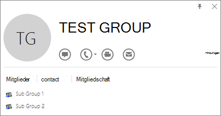
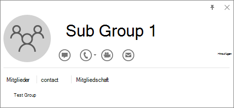

# <a name="determine-if-centralized-deployment-of-add-ins-works-for-your-organization"></a>Ermitteln, ob die zentrale Bereitstellung von Add-Ins für Ihre Organisation funktioniert

Die zentrale Bereitstellung ist die empfohlene und funktionsreichere Möglichkeit für die meisten Kunden, Office-Add-Ins für Benutzer und Gruppen in Ihrer Organisation bereitzustellen. Wenn Sie ein Administrator sind, verwenden Sie diese Anleitung, um festzustellen, ob Ihre Organisation und Ihre Benutzer die Anforderungen erfüllen, damit Sie die zentrale Bereitstellung verwenden können.

Die zentrale Bereitstellung bietet die folgenden Vorteile:
  
- Ein globaler Administrator kann ein Add-In direkt einem Benutzer, mehreren Benutzern über eine Gruppe oder allen Benutzern in der Organisation zuweisen.
    
- Wenn die relevante Office Anwendung gestartet wird, wird das Add-In automatisch heruntergeladen. Wenn das Add-In Add-In-Befehle unterstützt, wird das Add-In automatisch im Menüband innerhalb der Office-Anwendung angezeigt.
    
- Add-Ins werden für Benutzer nicht mehr angezeigt, wenn der Administrator das Add-In deaktiviert oder löscht oder wenn der Benutzer aus Azure Active Directory oder aus einer Gruppe entfernt wird, der das Add-In zugewiesen ist.

Die zentrale Bereitstellung unterstützt drei Desktopplattformen Windows, Mac- und Online-Office-Apps. Die zentrale Bereitstellung unterstützt auch iOS und Android (nur Outlook mobile Add-Ins).

Es kann bis zu 24 Stunden dauern, bis ein Add-In für alle Benutzer für den Client angezeigt wird.
  
## <a name="before-you-begin"></a>Bevor Sie beginnen

Die zentrale Bereitstellung von Add-Ins erfordert, dass die Benutzer Microsoft 365 Enterprise SKUs verwenden: E3/E5/F3 oder Business SKUs: Business Basic, Business Standard, Business Premium (und mit ihrer Organisations-ID bei Office angemeldet sind) und über Exchange Online und aktive Exchange Online Postfächer verfügen. Ihr Abonnementverzeichnis muss sich entweder in Azure Active Directory befinden oder mit Azure Active Directory verbunden sein.
Sie können die spezifischen Anforderungen für Office und Exchange unten anzeigen oder die [zentralisierte Kompatibilitätsprüfung](#centralized-deployment-compatibility-checker)für die Bereitstellung verwenden.

Folgendes wird von der zentralen Bereitstellung nicht unterstützt:
  
- Add-Ins, die Word, Excel oder PowerPoint in Office 2013 zum Ziel haben 
- Ein lokaler Verzeichnisdienst
- Add-In-Bereitstellung in einem Exchange lokalen Postfach
- Add-In-Bereitstellung in SharePoint  
- Teams-Apps
- Bereitstellung von COM-Add-Ins (Component Object Model) oder Visual Studio-Tools für Office-Add-Ins (VSTO).
- Bereitstellungen von Microsoft 365, die keine Exchange Online wie z. B. SKUs enthalten: Microsoft 365 Apps for Business und Microsoft 365 Apps für Enterprise.

### <a name="office-requirements"></a>Office Anforderungen

- Für Word-, Excel- und PowerPoint-Add-Ins müssen Ihre Benutzer eine der folgenden Optionen verwenden:
  - Auf einem Windows Gerät, Version 1704 oder höher von Microsoft 365 Enterprise SKUs: E3/E5/F3 oder Business SKUs: Business Basic, Business Standard, Business Premium.
  - Auf einem Mac, Version 15.34 oder höher.

- Für Outlook müssen Ihre Benutzer eine der folgenden Optionen verwenden: 
  - Version 1701 oder höher von Microsoft 365 Enterprise SKUs: E3/E5/F3 oder Business SKUs: Business Basic, Business Standard, Business Premium.
  - Version 1808 oder höher von Office Professional Plus 2019 oder Office Standard 2019.
  - Version 16.0.4494.1000 oder höher von Office Professional Plus 2016 (MSI) oder Office Standard 2016 (MSI)\*
  - Version 15.0.4937.1000 oder höher von Office Professional Plus 2013 (MSI) oder Office Standard 2013 (MSI)\*
  - Version 16.0.9318.1000 oder höher von Office 2016 für Mac 
- Version 2.75.0 oder höher von Outlook Mobile für iOS 
- Version 2.2.145 oder höher von Outlook Mobile für Android 
    
    *MSI-Versionen von Outlook zeigen vom Administrator installierte Add-Ins im entsprechenden Outlook Menüband an, nicht im Abschnitt "Meine Add-Ins".

### <a name="exchange-online-requirements"></a>Exchange Online Anforderungen

Microsoft Exchange speichert die Add-In-Manifeste im Mandanten Ihrer Organisation. Der Administrator, der Add-Ins bereitstellt, und die Benutzer, die diese Add-Ins erhalten, müssen eine Version von Exchange Online verwenden, die die OAuth-Authentifizierung unterstützt.
  
Informieren Sie sich beim Exchange-Administrator Ihrer Organisation, um herauszufinden, welche Konfiguration verwendet wird. Die OAuth-Verbindung pro Benutzer kann überprüft werden, indem Sie das PowerShell-Cmdlet [Test-OAuthConnectivity](/powershell/module/exchange/test-oauthconnectivity) verwenden. 


### <a name="centralized-deployment-compatibility-checker"></a>Kompatibilitätsprüfung für die zentrale Bereitstellung

Mithilfe der Kompatibilitätsprüfung für die zentrale Bereitstellung können Sie überprüfen, ob die Benutzer in Ihrem Mandanten für die Verwendung der zentralen Bereitstellung für Word, Excel und PowerPoint eingerichtet sind. Die Kompatibilitätsprüfung ist für die Unterstützung von Outlook nicht erforderlich. Laden Sie die [Kompatibilitätsprüfung herunter.](https://aka.ms/officeaddindeploymentorgcompatibilitychecker)
  
#### <a name="run-the-compatibility-checker"></a>Ausführen der Kompatibilitätsprüfung
  
1. Starten Sie ein Fenster mit erhöhten PowerShell.exe.
    
2. Führen Sie den folgenden Befehl aus:

   ```powershell
   Import-Module O365CompatibilityChecker
   ```
    
3. Führen Sie den Befehl **Invoke-CompatabilityCheck aus:**

   ```powershell
   Invoke-CompatibilityCheck
   ```
   Dieser Befehl fordert Sie zur Eingabe von  *_TenantDomain_* auf (z. B. *TailspinToysIncorporated.onmicrosoft). </span> com*) und  *_TenantAdmin-Anmeldeinformationen_* (verwenden Sie Ihre globalen Administratoranmeldeinformationen), und fordern Sie dann die Zustimmung an.
    
   > [!NOTE]
   > Je nach Anzahl der Benutzer Ihres Mandanten kann die Prüfung nach Minuten oder Stunden abgeschlossen sein. 
  
Sobald die Ausführung des Tools abgeschlossen ist, wird eine Ausgabedatei im CSV-Format (durch Trennzeichen getrenntes Format) erzeugt. Die Datei wird standardmäßig in **C:\windows\system32** gespeichert. Die Ausgabedatei enthält die folgenden Informationen:
  
- Benutzername
    
- Benutzer-ID (E-Mail-Adresse des Benutzers)
    
- Zentrale Bereitstellung bereit - Wenn die übrigen Punkte zutreffen
    
- Office Plan – Der Plan für Office, für den sie lizenziert sind
    
- Office aktiviert - Wenn Office aktiviert ist
    
- Unterstütztes Postfach - Wenn das Postfach für OAuth aktiviert ist

> [!NOTE]
> Die mehrstufige Authentifizierung wird bei Verwendung des PowerShell-Moduls für die zentrale Bereitstellung nicht unterstützt. Das Modul funktioniert nur mit der Standardauthentifizierung.
  
## <a name="user-and-group-assignments"></a>Benutzer- und Gruppenzuordnungen

Das Feature für die zentrale Bereitstellung unterstützt derzeit die Mehrzahl der von Azure Active Directory unterstützten Gruppen, einschließlich Microsoft 365 Gruppen, Verteilerlisten und Sicherheitsgruppen.
  
> [!NOTE]
> Nicht für E-Mail aktivierte Sicherheitsgruppen werden derzeit nicht unterstützt. 
  
Die zentrale Bereitstellung unterstützt Zuweisungen zu einzelnen Benutzern, Gruppen und allen Personen im Mandanten. Die zentrale Bereitstellung unterstützt Benutzer in Gruppen der oberen Ebene oder Gruppen ohne übergeordnete Gruppen, jedoch keine Benutzer in geschachtelten Gruppen oder Gruppen, die über übergeordnete Gruppen verfügen.
   
Schauen Sie sich das folgende Beispiel an, in dem Sandra, Sofia und die Gruppe "Vertriebsabteilung" einem Add-In zugeordnet werden. Da es sich bei "Vertriebsabteilung Westküste" um eine geschachtelte Gruppe handelt, werden Bert und Fred keinem Add-In zugeordnet.
  


   
### <a name="find-out-if-a-group-contains-nested-groups"></a>Herausfinden, ob eine Gruppe geschachelte Gruppen enthält

Die einfachste Methode, um herauszufinden, ob eine Gruppe geschachtelte Gruppen enthält, besteht darin, in Outlook die Gruppenvisitenkarte anzuzeigen. Wenn Sie den Gruppennamen im Feld **"An"** einer E-Mail eingeben und dann bei der Auflösung den Gruppennamen auswählen, wird angezeigt, ob er Benutzer oder geschachtelte Gruppen enthält. Im nachfolgenden Beispiel werden auf der Registerkarte **Mitglieder** der Outlook-Visitenkarte der Testgruppe keine Benutzer und nur zwei Untergruppen angezeigt. 
  

  
Sie können die umgekehrte Abfrage durchführen, indem Sie die Gruppe auflösen, um zu sehen, ob sie Mitglied einer anderen Gruppe ist. Im Beispiel unten können Sie auf der Registerkarte **Mitgliedschaft** der Outlook-Visitenkarte sehen, dass Untergruppe 1 ein Mitglied der Testgruppe ist. 
  

  
Alternativ können Sie die Azure Active Directory Graph-API verwenden, um Abfragen auszuführen, um die Liste der Gruppen innerhalb einer Gruppe zu finden. Weitere Informationen finden Sie unter [Vorgänge mit Gruppen | Graph-API-Referenz](/previous-versions/azure/ad/graph/api/groups-operations).
  
### <a name="contacting-microsoft-for-support"></a>Kontaktaufnahme mit dem Microsoft-Support

Wenn probleme beim Laden des Add-Ins auftreten, während Sie Office Apps für das Web (Word, Excel usw.) verwenden, die zentral bereitgestellt wurden, müssen Sie sich möglicherweise an den Microsoft-Support wenden ([erfahren Sie, wie](../../business-video/get-help-support.md)). Geben Sie die folgenden Informationen zu Ihrer Microsoft 365 Umgebung im Supportticket an.
  
|**Plattform**|**Debuginformationen**|
|:-----|:-----|
|Office  <br/> | Charles/Fiddler-Protokolle  <br/>  Mandanten-ID ( [So wird's gemacht](/onedrive/find-your-office-365-tenant-id))  <br/>  Correlationid. Zeigen Sie die Quelle einer der Office-Seiten an, suchen Sie nach dem Korrelations-ID-Wert, und senden Sie ihn an die Unterstützung:  <br/>`<input name=" **wdCorrelationId**" type="hidden" value=" **{BC17079E-505F-3000-C177-26A8E27EB623}**">`  <br/>  `<input name="user_id" type="hidden" value="1003bffd96933623"></form>`  <br/> |
|Rich Clients (Windows, Mac)  <br/> | Charles/Fiddler-Protokolle  <br/>  Erstellen von Nummern der Client-App (vorzugsweise als Screenshot aus **Datei/Konto)**  <br/> |

## <a name="related-content"></a>Verwandte Inhalte

[Bereitstellen von Add-Ins im Admin Center](../manage/manage-deployment-of-add-ins.md) (Artikel)\
[Verwalten von Add-Ins im Admin Center](manage-addins-in-the-admin-center.md) (Artikel)\
[Häufig gestellte Fragen](../manage/centralized-deployment-faq.md) zur zentralen Bereitstellung (Artikel)\
[Aktualisieren Ihrer Microsoft 365 für Geschäftsbenutzer auf den neuesten Office-Client](../setup/upgrade-users-to-latest-office-client.md) (Artikel)
 