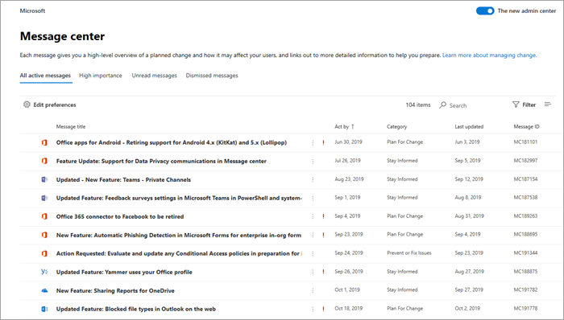

# Verwalten von Nachrichten im Nachrichtencenter

[] Beiträge im Nachrichtencenter sind wichtige Ankündigungen zu neuen und geänderten Features. Dieser Artikel enthält weitere Informationen zu den Aktionen, die Sie Nachrichten ausführen können, um das Change Management in Ihrer Organisation zu unterstützen.
  
## Lesen einer Nachricht

Um zum Nachrichtencenter zu wechseln, wechseln Sie zum [Admin Center,](https://go.microsoft.com/fwlink/p/?linkid=2024339)und wählen Sie "Integritätsnachrichtencenter"   >  **aus.** 

Wählen Sie einen Nachrichtentitel aus, um ihn im Lesebereich zu öffnen. Jede Nachricht enthält eine Zusammenfassung der Änderung, eine Erklärung dazu, wie sich die Änderung auf Sie auswirken kann, Informationen dazu, wie Sie Ihre Organisation auf die Änderung vorbereiten können, und (in den meisten Fällen) einen zusätzlichen Informationslink, über den Sie mehr erfahren können. Diese zusätzlichen Informationen stehen auch nach dem Ablauf eine Nachricht weiterhin zur Verfügung.

## Filtern und Sortieren

::: moniker range="o365-worldwide"

Verwenden Sie **das Dropdownmenü** "Filter", um eine gefilterte Ansicht von Nachrichten auszuwählen.

Sie können eine beliebige Spaltenüberschrift auswählen, um Nachrichten in aufsteigender oder absteigender Reihenfolge zu sortieren. In diesem Diagramm werden die Nachrichten beispielsweise nach Datum **sortiert.**

::: moniker-end

::: moniker range="o365-germany"

Verwenden Sie **das Dropdownmenü** "Ansichten", um eine gefilterte Ansicht von Nachrichten auszuwählen. 
 
Sie können eine beliebige Spaltenüberschrift auswählen, um Nachrichten in aufsteigender oder absteigender Reihenfolge zu sortieren. In dieser Abbildung werden die Nachrichten beispielsweise nach Datum **sortiert.**

::: moniker-end

::: moniker range="o365-21vianet"

Verwenden Sie **das Dropdownmenü** "Ansichten", um eine gefilterte Ansicht von Nachrichten auszuwählen. 
 
Sie können eine beliebige Spaltenüberschrift auswählen, um Nachrichten in aufsteigender oder absteigender Reihenfolge zu sortieren. In dieser Abbildung werden die Nachrichten beispielsweise nach Datum **sortiert.**

::: moniker-end

## Feedback zu einem Beitrag geben

Im Nachrichtencenter können Sie eine Nachricht auswählen, um Details anzuzeigen.

Wenn Sie Feedback zu der Nachricht geben  möchten, wählen Sie entweder das Symbol "Gefällt mir" oder "Gefällt mir" aus, und geben Sie Feedback in das angezeigte Textfeld ein.  Geben Sie keine persönlichen Informationen an. Sie können optional **auswählen, dass** es in Ordnung ist, mich über dieses Feedback zu kontaktieren, und dann "Senden" **auswählen.**

## Freigeben einer Nachricht

Sie haben eine Nachricht entdeckt, auf die eine andere Person reagieren muss? Sie können den Inhalt der Nachricht für beliebige Benutzer per E-Mail freigeben:
  
1. Wählen Sie die Nachricht aus, um sie zu öffnen, und wählen Sie dann **"Freigeben" aus.**
  
2. Um die Nachricht zu teilen, geben Sie bis zu zwei E-Mail-Adressen ein, die durch einen Doppelpunkt getrennt sind. Sie können an einzelne E-Mail-Adressen senden und E-Mail-Adressen gruppieren. Optional können Sie eine Kopie der Nachricht in einer E-Mail empfangen (die Nachricht wird an Ihre primäre E-Mail-Adresse gesendet) oder eine persönliche Nachricht hinzufügen, um Empfängern mehr Kontext zu bieten.
  
3. Wählen **Sie "Freigeben"** aus, um die E-Mail zu senden.
    
## Abrufen eines Links

Müssen Sie sich an einen anderen Administrator halten, um sicherzustellen, dass er eine Änderung kennt und Maßnahmen ernimmt? Sie können beispielsweise einen Link zur Freigabe in E-Mails oder Chatnachrichten generieren, der den Benutzer direkt mit dieser Nachricht verbindet. Die Person, mit der Sie den Link teilen, muss ein Administrator in Microsoft 365 für Ihre Organisation sein, oder sie hat keinen Zugriff auf die verknüpfte Nachricht.

::: moniker range="o365-worldwide"

1. Wählen Sie die Nachricht aus, um sie zu öffnen.

2. Wählen Sie das **Symbol "Link zur Zwischenablage** kopieren" (Link) aus.

3. Erlauben Sie der Webseite Zugriff auf Ihre Zwischenablage. Ein direkter Link wird in die Zwischenablage kopiert.

4. Verwenden Sie STRG+V, oder klicken Sie mit der rechten Maustaste, und wählen **Sie "Einfügen"** aus, um den Link einfügen.

::: moniker-end

::: moniker range="o365-germany"

1. Wählen Sie die Nachricht aus, um sie zu öffnen.

2. Choose **More** \> **Get a link** from the action bar.

3. Erlauben Sie der Webseite Zugriff auf Ihre Zwischenablage. Ein direkter Link wird in die Zwischenablage kopiert.

4. Verwenden Sie STRG+V, oder klicken Sie mit der rechten Maustaste, und wählen **Sie "Einfügen"** aus, um den Link einfügen.

::: moniker-end

::: moniker range="o365-21vianet"

1. Wählen Sie die Nachricht aus, um sie zu öffnen.

2. Choose **More** \> **Get a link** from the action bar.

3. Erlauben Sie der Webseite Zugriff auf Ihre Zwischenablage. Ein direkter Link wird in die Zwischenablage kopiert.

4. Verwenden Sie STRG+V, oder klicken Sie mit der rechten Maustaste, und wählen **Sie "Einfügen"** aus, um den Link einfügen.

::: moniker-end

## Status "Gelesen" und "Ungelesen"

Jede Nachricht im Nachrichtencenter, die ungelesen ist, wird fett formatiert angezeigt. Durch das Öffnen einer Nachricht wird diese als gelesen markiert. Sie können eine Nachricht als ungelesen markieren.

::: moniker range="o365-worldwide"

1. Wählen Sie auf der Hauptseite des Nachrichtencenters eine Nachricht aus.

2. Wählen Sie **oben in** der Nachricht das Symbol "Als ungelesen markieren" (Umschlag) aus.
  
::: moniker-end

::: moniker range="o365-germany"

1. Wählen Sie die Nachricht aus, um sie zu öffnen.

2. Wählen Sie **Weitere Optionen** \> **Als ungelesen markieren** aus.

3. Schließen Sie die Nachricht.

::: moniker-end

::: moniker range="o365-21vianet"

1. Wählen Sie die Nachricht aus, um sie zu öffnen.

2. Wählen Sie **Weitere Optionen** \> **Als ungelesen markieren** aus.

3. Schließen Sie die Nachricht.

::: moniker-end

## Archivieren und Wiederherstellen

Wenn eine Nachricht angezeigt wird, die nicht für Sie gilt, oder Sie vielleicht bereits darauf reagiert haben, können Sie die Nachricht archivieren, um sie aus der Ansicht "Nachrichtencenter" zu entfernen. Die Ansicht, die Im Nachrichtencenter angezeigt wird, ist spezifisch für Ihr Benutzerkonto, sodass die Archivierung aus Ihrer Ansicht keine Auswirkungen auf andere Administratoren hat.

::: moniker range="o365-worldwide"

- Wählen Sie auf der Hauptseite des Nachrichtencenters eine Nachricht aus, und wählen Sie dann **über** der Liste der Nachrichten "Archiv" aus.

- Öffnen Sie die Nachricht, und wählen Sie **unten** in der Nachricht "Archivieren" aus.

Müssen Sie eine archivierte Nachricht zurück erhalten? Kein Problem.
  
1. Wählen Sie **oben im Nachrichtencenter die** Registerkarte "Archivierte Nachrichten" aus. Eine Liste der archivierten Nachrichten wird angezeigt. 

2. Wählen Sie die Nachricht aus, wählen **Sie "Wiederherstellen"** aus, und die Nachricht wird in aktiven Nachrichten wiederhergestellt.

::: moniker-end

::: moniker range="o365-germany"

Es gibt zwei Möglichkeiten zum Archivieren einer Nachricht.
  
- Wählen Sie das X aus, das rechts neben der Nachrichten-ID angezeigt wird. Die Nachricht wird aus Ihrer Liste entfernt. Oder:

- Öffnen Sie die Nachricht, und wählen Sie dann **"Archivieren"** oben in der Nachricht aus.

Sie müssen eine verworfene Nachricht wiederherstellen? Kein Problem.
  
1. Wählen Sie **im Dropdownmenü "Ansichten"** den Filter **"Archivierte** Nachrichten" aus. Eine Liste der archivierten Nachrichten wird angezeigt.

2. Wählen **Sie rechts** neben der Nachrichten-ID "Wiederherstellen" aus, und die Nachricht wird in aktiven Nachrichten wiederhergestellt.

::: moniker-end

::: moniker range="o365-21vianet"

Es gibt zwei Möglichkeiten zum Archivieren einer Nachricht.
  
- Wählen Sie das X aus, das rechts neben der Nachrichten-ID angezeigt wird. Die Nachricht wird aus Ihrer Liste entfernt. Oder:

- Öffnen Sie die Nachricht, und wählen Sie dann **"Archivieren"** oben in der Nachricht aus.

Müssen Sie eine archivierte Nachricht zurück erhalten? Kein Problem.
  
1. Wählen Sie **im Dropdownmenü "Ansichten"** den Filter **"Archivierte** Nachrichten" aus. Eine Liste der archivierten Nachrichten wird angezeigt.

2. Wählen **Sie rechts** neben der Nachrichten-ID "Wiederherstellen" aus, und die Nachricht wird in aktiven Nachrichten wiederhergestellt.

::: moniker-end

## Nachverfolgen Ihrer Nachrichtencenter-Aufgaben in Planner

Eine Vielzahl von umsetzbaren Informationen zu Änderungen an den Microsoft 365-Diensten gehen im Microsoft 365-Nachrichtencenter ein. Es kann schwierig sein, nachverfolgt zu werden, welche Änderungen aufgaben erforderlich sind, wann und von wem und von wem nachverfolgt werden muss. Möglicherweise möchten Sie sich auch etwas notieren und dies markieren, um es später zu überprüfen. All dies und mehr können Sie tun, wenn Sie Ihre Nachrichten aus dem Microsoft 365 Admin Center mit Microsoft Planner synchronisieren. Weitere Informationen finden Sie unter [Nachverfolgen ihrer Nachrichtencenteraufgaben in Planner.](https://docs.microsoft.com/office365/planner/track-message-center-tasks-planner)

Eine Übersicht über das Nachrichtencenter finden Sie im [Nachrichtencenter in Microsoft 365.](message-center.md) Oder um zu erfahren, wie Sie Ihre Spracheinstellungen festlegen, um die maschinelle Übersetzung für Beiträge im Nachrichtencenter zu aktivieren, lesen Sie die Sprachübersetzung [für Beiträge im Nachrichtencenter.](language-translation-for-message-center-posts.md) Wenn Sie eine alternative Möglichkeit zum Abrufen von Informationen zum Dienstzustand in Echtzeit und zur Kommunikation mit dem Nachrichtencenter programmieren möchten, finden Sie eine Übersicht über die [Microsoft 365-Dienstkommunikations-API.](https://go.microsoft.com/fwlink/p/?linkid=848507)
  
