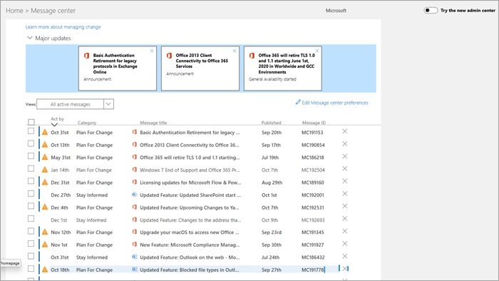

# Verwalten von Nachrichten im NachrichtencenterManage messages in Message center

Message center posts are important announcements about new and changed features.Message center posts are important announcements about new and changed features. This article provides more information about the things you can do with messages to help with change management in your organization.This article provides more information about the things you can do with messages to help with change management in your organization.
  
## Lesen einer NachrichtRead a message

Um zum Nachrichtencenter zu wechseln, wechseln Sie zum [Admin Center](https://go.microsoft.com/fwlink/p/?linkid=2024339), und wählen Sie **Integritäts**  >  **Meldungscenter**aus.To go to the Message center, go to the [admin center](https://go.microsoft.com/fwlink/p/?linkid=2024339), and select **Health** > **Message center**. 

Wählen Sie einen Nachrichtentitel aus, um ihn im Lesebereich zu öffnen.Select a message title to open it in the reading pane. Jede Nachricht enthält eine Zusammenfassung der Änderung, eine Erklärung dazu, wie sich die Änderung auf Sie auswirken kann, Informationen darüber, wie Sie Ihre Organisation auf die Änderung vorbereiten können, und (in den meisten Fällen) einen zusätzlichen Informations Link, in dem Sie weitere Informationen erhalten.Every message contains a summary of the change, a statement of how the change may affect you, information about how you can prepare your organization for the change, and (in most cases) an additional information link where you can learn more. Diese zusätzlichen Informationen stehen auch nach dem Ablauf eine Nachricht weiterhin zur Verfügung.The additional information continues to be available, even after a message expires.

## Filtern und SortierenFilter and sort

::: moniker range="o365-worldwide"

Verwenden Sie das Dropdownmenü **Filter** , um eine gefilterte Ansicht von Nachrichten auszuwählen.Use the **Filter** drop-down menu to select a filtered view of messages.

Sie können eine beliebige Spaltenüberschrift auswählen, um Nachrichten in aufsteigender oder absteigender Reihenfolge zu sortieren.You can select any column heading to sort messages in ascending or descending order. In diesem Diagramm werden die Nachrichten beispielsweise nach dem Datum der **Handlung** sortiert.For example, in this diagram the messages are sorted on the **Act by** date.

::: moniker-end

::: moniker range="o365-germany"

Verwenden Sie das Dropdownmenü **Ansichten** , um eine gefilterte Ansicht von Nachrichten auszuwählen.Use the **Views** drop-down menu to select a filtered view of messages. 
 
Sie können eine beliebige Spaltenüberschrift auswählen, um Nachrichten in aufsteigender oder absteigender Reihenfolge zu sortieren.You can select any column heading to sort messages in ascending or descending order. In dieser Abbildung werden beispielsweise die Nachrichten nach dem Datum der **Handlung** sortiert.For example, in this illustration the messages are sorted on the **Act by** date.

::: moniker-end

::: moniker range="o365-21vianet"

Verwenden Sie das Dropdownmenü **Ansichten** , um eine gefilterte Ansicht von Nachrichten auszuwählen.Use the **Views** drop-down menu to select a filtered view of messages. 
 
Sie können eine beliebige Spaltenüberschrift auswählen, um Nachrichten in aufsteigender oder absteigender Reihenfolge zu sortieren.You can select any column heading to sort messages in ascending or descending order. In dieser Abbildung werden beispielsweise die Nachrichten nach dem Datum der **Handlung** sortiert.For example, in this illustration the messages are sorted on the **Act by** date.

::: moniker-end

## Feedback zu einem Beitrag gebenGive feedback on a post

Im Nachrichtencenter können Sie eine Nachricht auswählen, um Details anzuzeigen.In the Message center, you can select a message to see details.

Wenn Sie Feedback zur Nachricht geben möchten, wählen Sie das Symbol **like** oder **Unlike** aus, und geben Sie Feedback in das angezeigte Textfeld ein.If you want to provide feedback on the message, select either the **Like** or **Dislike** icon and provide feedback in the text box that appears. Geben Sie keine persönlichen Informationen an.Do not provide any personal information. Sie können optional **"OK" auswählen, um mich über dieses Feedback zu kontaktieren** , und dann auf **senden**klicken.You can optionally select **It's OK to contact me about this feedback** and then select **Send**.

## Freigeben einer NachrichtShare a message

Sie haben eine Nachricht entdeckt, auf die eine andere Person reagieren muss?See a message that someone else needs to act on? Sie können den Inhalt der Nachricht für beliebige Benutzer per E-Mail freigeben:You can share the contents of the message with any user by email:
  
1. Wählen Sie die Nachricht aus, um Sie zu öffnen, und wählen Sie dann **Freigeben**aus.Select the message to open it, and then select **Share**.
  
2. Geben Sie bis zu zwei e-Mail-Adressen durch einen Doppelpunkt getrennt ein, um die Nachricht freizugeben.To share the message, enter up to two email addresses separated by a colon. Sie können an einzelne und an Gruppen-e-Mail-Adressen senden.You can send to individual and to group email addresses. Optional können Sie wählen, ob Sie eine Kopie der Nachricht in einer e-Mail erhalten möchten (die Nachricht wird an Ihre primäre e-Mail-Adresse gesendet) oder eine persönliche Nachricht hinzufügen, um Empfängern mehr Kontext zur Verfügung zu stellen.Optionally, you can choose to receive a copy of the message in email (the message will go to your primary email address) or add a personal message to provide recipients with more context.
  
3. Wählen Sie **Freigeben** aus, um die e-Mail zu senden.Select **Share** to send the email.
    
## Abrufen eines LinksGet a link

Sie müssen einen anderen Administrator nachverfolgen, um sicherzustellen, dass Sie sich einer Änderung bewusst sind und Maßnahmen ergreifen?Need to follow up with another admin to make sure they're aware of a change and taking action? Sie können beispielsweise einen Link zum Freigeben in e-Mail oder Chat generieren, mit dem der Benutzer direkt mit dieser Nachricht verbunden wird.You can generate a link to share in email or instant messaging, for example, that will connect the user directly to that message. Die Person, mit der Sie den Link gemeinsam verwenden, muss ein Administrator in Microsoft 365 für Ihre Organisation sein, oder Sie haben keinen Zugriff auf die verknüpfte Nachricht.The person you share the link with has to be an admin in Microsoft 365 for your organization or they won't have access to the linked message.

::: moniker range="o365-worldwide"

1. Wählen Sie die Nachricht aus, um Sie zu öffnen.Select the message to open it.

2. Wählen Sie das Symbol **Link in Zwischenablage kopieren** (Link) aus.Select the **Copy link to Clipboard** (link) icon.

3. Erlauben Sie der Webseite Zugriff auf Ihre Zwischenablage.Allow the webpage to access your Clipboard. Eine direkte Verknüpfung wird in die Zwischenablage kopiert.A direct link is copied to your Clipboard.

4. Verwenden Sie STRG + V oder klicken Sie mit der rechten Maustaste, und wählen Sie **Einfügen** , um den Link einzufügen.Use Ctrl+V or right-click and select **Paste** to insert the link.

::: moniker-end

::: moniker range="o365-germany"

1. Wählen Sie die Nachricht aus, um Sie zu öffnen.Select the message to open it.

2. Klicken **More** Sie \> in der Aktionsleiste auf More **Get a Link** .Choose **More** \> **Get a link** from the action bar.

3. Erlauben Sie der Webseite Zugriff auf Ihre Zwischenablage.Allow the webpage to access your Clipboard. Eine direkte Verknüpfung wird in die Zwischenablage kopiert.A direct link is copied to your Clipboard.

4. Verwenden Sie STRG + V oder klicken Sie mit der rechten Maustaste, und wählen Sie **Einfügen** , um den Link einzufügen.Use Ctrl+V or right-click and select **Paste** to insert the link.

::: moniker-end

::: moniker range="o365-21vianet"

1. Wählen Sie die Nachricht aus, um Sie zu öffnen.Select the message to open it.

2. Klicken **More** Sie \> in der Aktionsleiste auf More **Get a Link** .Choose **More** \> **Get a link** from the action bar.

3. Erlauben Sie der Webseite Zugriff auf Ihre Zwischenablage.Allow the webpage to access your Clipboard. Eine direkte Verknüpfung wird in die Zwischenablage kopiert.A direct link is copied to your Clipboard.

4. Verwenden Sie STRG + V oder klicken Sie mit der rechten Maustaste, und wählen Sie **Einfügen** , um den Link einzufügen.Use Ctrl+V or right-click and select **Paste** to insert the link.

::: moniker-end

## Status "Gelesen" und "Ungelesen"Read and unread states

Jede Nachricht im Nachrichtencenter, die ungelesen ist, wird fett formatiert angezeigt.Any message in Message center that is unread will appear in bold. Durch das Öffnen einer Nachricht wird diese als gelesen markiert.Opening a message marks it as read. Sie können eine Nachricht als ungelesen markieren.You can mark a message as unread.

::: moniker range="o365-worldwide"

1. Wählen Sie auf der Hauptseite des Nachrichten Centers eine Nachricht aus.On the main page of the message center, select a message.

2. Klicken Sie oben in der Nachricht auf das Symbol **als ungelesen** (Umschlag) markieren.Select the **Mark as unread** (envelope) icon at the top of the message.
  
::: moniker-end

::: moniker range="o365-germany"

1. Wählen Sie die Nachricht aus, um Sie zu öffnen.Select the message to open it.

2. Wählen Sie **Weitere Optionen** \> **Als ungelesen markieren** aus.Select **More** \> **Mark as unread**.

3. Schließen Sie die Nachricht.Close the message.

::: moniker-end

::: moniker range="o365-21vianet"

1. Wählen Sie die Nachricht aus, um Sie zu öffnen.Select the message to open it.

2. Wählen Sie **Weitere Optionen** \> **Als ungelesen markieren** aus.Select **More** \> **Mark as unread**.

3. Schließen Sie die Nachricht.Close the message.

::: moniker-end

## Archivieren und WiederherstellenArchive and restore

Wenn Sie eine Nachricht sehen, die nicht für Sie relevant ist, oder wenn Sie bereits darauf reagiert haben, können Sie die Nachricht archivieren, um Sie aus der Nachrichtencenter Ansicht zu entfernen.If you see a message that doesn't pertain to you, or maybe you've already acted on it, you can archive the message to remove it from the Message center view. Die Ansicht, die im Nachrichtencenter angezeigt wird, ist spezifisch für Ihr Benutzerkonto, daher wirkt sich die Archivierung aus ihrer Ansicht nicht auf andere Administratoren aus.The view that you see in the Message center is specific to your user account, so archiving it from your view doesn't affect other admins.

::: moniker range="o365-worldwide"

- Wählen Sie auf der Hauptseite des Nachrichten Centers eine Nachricht aus, und wählen Sie dann über der Liste der Nachrichten **archivieren** aus.On the main page of the Message center, select a message, and then select **Archive** above the list of messages.

- Öffnen Sie die Nachricht, und wählen Sie dann **archivieren** unten in der Nachricht aus.Open the message, and then select **Archive** at the bottom of the message.

Sie müssen eine archivierte Nachricht zurück erhalten?Need to get a archived message back? Kein Problem.No problem.
  
1. Wählen Sie die Registerkarte **Archivierte Nachrichten** oben im Nachrichtencenter aus.Select the **Archived messages** tab at the top of the Message center. Eine Liste archivierter Nachrichten wird angezeigt.A list of archived messages appears. 

2. Wählen Sie die Nachricht aus, wählen Sie **Wiederherstellen**aus, und die Nachricht wird in den aktiven Nachrichten wiederhergestellt.Select the message, select **Restore**, and the message is restored to active messages.

::: moniker-end

::: moniker range="o365-germany"

Es gibt zwei Möglichkeiten zum Archivieren einer Nachricht.There are two ways to archive a message.
  
- Wählen Sie das X aus, das rechts neben der Nachrichten-ID angezeigt wird.Select the X that appears to the right of the Message ID. Die Nachricht wird aus Ihrer Liste entfernt.The message is removed from your list. Oder:Or,

- Öffnen Sie die Nachricht, und wählen Sie dann oben in der Nachricht **archivieren** aus.Open the message, and then select **Archive** at the top of the message.

Sie müssen eine verworfene Nachricht wiederherstellen?Need to get a dismissed message back? Kein Problem.No problem.
  
1. Wählen Sie im Dropdownmenü **Ansichten** den Filter **Archivierte Nachrichten** aus.Select the **Archived messages** filter from the **Views** drop-down menu. Eine Liste archivierter Nachrichten wird angezeigt.A list of archived messages appears.

2. Wählen Sie rechts neben der Nachrichten-ID **Wiederherstellen** aus, und die Nachricht wird in den aktiven Nachrichten wiederhergestellt.Select **Restore** to the right of the Message ID, and the message is restored to active messages.

::: moniker-end

::: moniker range="o365-21vianet"

Es gibt zwei Möglichkeiten zum Archivieren einer Nachricht.There are two ways to archive a message.
  
- Wählen Sie das X aus, das rechts neben der Nachrichten-ID angezeigt wird.Select the X that appears to the right of the Message ID. Die Nachricht wird aus Ihrer Liste entfernt.The message is removed from your list. Oder:Or,

- Öffnen Sie die Nachricht, und wählen Sie dann oben in der Nachricht **archivieren** aus.Open the message, and then select **Archive** at the top of the message.

Sie müssen eine archivierte Nachricht zurück erhalten?Need to get a archived message back? Kein Problem.No problem.
  
1. Wählen Sie im Dropdownmenü **Ansichten** den Filter **Archivierte Nachrichten** aus.Select the **Archived messages** filter from the **Views** drop-down menu. Eine Liste archivierter Nachrichten wird angezeigt.A list of archived messages appears.

2. Wählen Sie rechts neben der Nachrichten-ID **Wiederherstellen** aus, und die Nachricht wird in den aktiven Nachrichten wiederhergestellt.Select **Restore** to the right of the Message ID, and the message is restored to active messages.

::: moniker-end

Eine Übersicht über das Nachrichtencenter finden Sie unter [Message Center in Microsoft 365](message-center.md).For an overview of Message center, see [Message center in Microsoft 365](message-center.md). Um zu erfahren, wie Sie Ihre Spracheinstellungen so festlegen, dass maschinelle Übersetzungen für Nachrichtencenter Beiträge aktiviert werden, lesen Sie [über die Sprachübersetzung für Nachrichtencenter-Beiträge](language-translation-for-message-center-posts.md).Or, to learn how to set your language preferences to enable machine translation for Message center posts, see [Language translation for Message center posts](language-translation-for-message-center-posts.md). Wenn Sie eine alternative Möglichkeit zum Abrufen von echt Zeitdienst-Integritätsinformationen und Nachrichten Center Kommunikationen programmieren möchten, wenden Sie sich an die [Microsoft 365 Service Communications API Overview](https://go.microsoft.com/fwlink/p/?linkid=848507).If you'd like to program an alternative way to get real-time service health information and Message Center communications, please reference [Microsoft 365 Service Communications API Overview](https://go.microsoft.com/fwlink/p/?linkid=848507).
  
