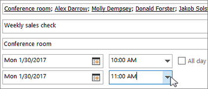

# Raum- und Gerätepostfächer

Wenn Sie über einen Konferenzraum, einen Firmenwagen oder Geräte verfügen, die von allen Mitarbeitern verwendet werden, müssen Sie eine Möglichkeit finden, damit diese Ressourcen von jedem reserviert werden können. Die beste Möglichkeit ist, für jede Ressource ein Raum- oder Gerätepostfach in Microsoft 365 zu erstellen. Sie können ein Postfach für den Konferenzraum auf der ersten Etage, die Medienausrüstung oder einen Umzugswagen erstellen.
  
Sobald Sie ein Raum- oder Gerätepostfach erstellt haben, kann jeder im Unternehmen mithilfe von Outlook eine Reservierung für Besprechungen oder Ereignisse vornehmen. Informationen zum **Verwenden** und **Einrichten** solcher Postfächer sind auf den nächsten beiden Registerkarten enthalten. Hier folgen nun einige häufige Fragen zu Raum- und Gerätepostfächern. 
  
## Verwenden von Raum- und Gerätepostfächern

Zum Verwenden von Raum- oder Gerätepostfächern öffnen Sie Outlook auf Ihrem Computer, oder melden Sie sich bei Outlook im Web an. Planen Sie eine neue Besprechung, und fügen Sie den Raum oder das Gerät auf gleiche Weise wie beim Einladen anderer Mitarbeiter oder Kunden zur Besprechung hinzu. Sie haben den Raum bzw. das Gerät nun reserviert.
  
1. Öffnen Sie** **Outlook auf Ihrem Computer 
    
2. On the **Home** tab, choose **New Items** \> **Meeting**.  Sie können auch einfach in Ihrem Kalender die Option **Neue Besprechung** auswählen.
    
3. Geben Sie im Feld "An" zusätzlich zu den Teilnehmern, die Sie einladen möchten, auch den Namen des zu reservierenden Konferenzraums oder Geräts ein. Sie können auch auf **An** klicken und dann in der Liste auf den Konferenzraum oder das Gerät doppelklicken. Wählen Sie dann **OK** aus. 
  
4. Geben Sie in der Zeile **Betreff** den Zweck der Reservierung oder Besprechung ein. 
    
5. Ändern Sie ggf. den Wert für **Ort**. 
    
6. Ändern Sie die Zeiten für **Beginn** und **Ende**. Oder wählen Sie **Ganztägiges Ereignis** aus. Um die Besprechung oder Reservierung wiederholt einzutragen, wählen Sie oben **Serientyp** aus. 
  
7. Geben Sie eine Nachricht ein, die den Zweck beschreibt, und fügen Sie bei Bedarf Dateien an.
    
8. Damit andere Personen online teilnehmen oder sich in die Besprechung einwählen können, klicken Sie auf **Skype-Besprechung**.
    
9. Um sicherzustellen, dass der Raum, das Gerät und die eingeladenen Personen verfügbar sind, klicken Sie oben auf **Terminplanungs-Assistent**. Wählen Sie dann eine verfügbare Zeit im Kalender aus.   Tipp: Im Terminplanungskalender bedeutet blau, dass der Raum oder das Gerät reserviert ist bzw. gerade verwendet wird. Wählen Sie einen weißen (leeren) Bereich im Kalender aus. 
  
10. Wählen Sie anschließend **Senden**.
    
## Einrichten von Raum- und Gerätepostfächern

Wenn Sie ein Raum- oder Gerätepostfach einrichten möchten, wechseln Sie zum Microsoft 365 Admin Center. (Dazu müssen Sie über Administratorberechtigungen verfügen.) Erstellen Sie das Postfach, und teilen Sie allen Personen mit, dass sie es ab sofort zum Reservieren für Besprechungen und Veranstaltungen verwenden können.
  
1. Wechseln Sie im Admin Center zur Seite **Ressourcen** \> [Räume &amp; Equipment](https://go.microsoft.com/fwlink/p/?linkid=2067334).
  
2. Klicken Sie auf **Hinzufügen**.
    
3. Füllen Sie die Felder für den Raum bzw. das Gerät aus:  
  
  - **Raum** oder **Gerät**: Der Postfachtyp, den Sie erstellen möchten.
    
  - **Name**: Ein Anzeigename oder sogar eine kurze Beschreibung.
    
  - **E-Mail**: Der E-Mail-Alias des Raums oder Geräts. Dies ist erforderlich, um eine Besprechungsanfrage an den Raum oder das Gerät zu senden.
    
  - **Kapazität**: Die Anzahl der Personen, die in den Raum passen oder das Gerät gleichzeitig verwenden können.
    
  - **Ort**: Die Raumnummer oder die Lage des Raums in einem Gebäude oder Bereich.
    
  - **Telefonnummer**: Die Rufnummer des Raums. Diese unterscheidet sich von der Telefonnummer für die Besprechung, die bei Verwendung von Skype for Business generiert wird.
    
4. Klicken Sie auf **Hinzufügen**.
    
5. Wählen Sie das erstellte Raum- und Gerätepostfach aus, um die Details anzuzeigen.
  
6. Wenn Sie Änderungen vorgenommen haben, wählen Sie **Speichern** und dann **Schließen** aus.

> [!Note]
> Damit Ihre Raum-und Gerätepostfächer geschützt bleiben, blockieren Sie die Anmeldung bei diesen Postfächern. Weitere Informationen finden Sie unter [Blockieren der Anmeldung für das freigegebene Postfachkonto](https://docs.microsoft.com/office365/admin/email/create-a-shared-mailbox?view=o365-worldwide#block-sign-in-for-the-shared-mailbox-account).

## Häufige Fragen zu Raum- und Gerätepostfächern

### Wie können Sie feststellen, wann der Raum oder das Gerät verfügbar ist?

Öffnen Sie Outlook, und erstellen Sie eine neue Besprechung. Fügen Sie den Raum oder das Gerät zur Besprechung hinzu, als würde es sich um eine Person handeln, und wählen Sie **Terminplanungs-Assistent** aus, um eine aktuelle Kalenderansicht zur Verfügbarkeit des Raums bzw. Geräts anzuzeigen. Wenn der Bereich für die Uhrzeit leer ist, ist der Raum oder das Gerät verfügbar. Ist der Bereich blau, ist der Raum oder das Gerät reserviert. 
  
### Wie stornieren Sie eine Raum- oder Geräteanforderung?

Öffnen Sie die geplante Besprechung in Outlook, und entfernen Sie dann den Raum oder das Gerät aus der Besprechung, wie es auch bei einem Teilnehmer der Fall wäre. Damit steht der Raum wieder anderen Benutzern zur Reservierung bereit.
  
### Muss jede Raum- oder Geräteanforderung von einer Person angenommen oder abgelehnt werden?

 Nein, Anforderungen müssen nicht von einer Person angenommen oder abgelehnt werden. Sie können entscheiden, ob der Raum oder das Gerät automatisch von einer Person in Ihrem Unternehmen gebucht oder verwaltet werden kann. 
  
### Benötigt ein Raum- oder Gerätepostfach eine Produktlizenz?

Nein. Obwohl für die meisten Benutzer in Ihrer Organisation eine Lizenz für die Nutzung von Microsoft 365 erforderlich ist, müssen Sie einem Raum- oder Gerätepostfach keine Lizenz zuweisen.
  
### Benötige ich jemanden, der für das Buchen der Räume oder Geräte zuständig ist?

 Nein, brauchen Sie niemanden, der für das Raum- oder Gerätepostfach zuständig ist. 
