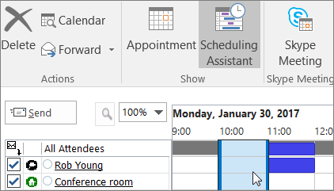

# Raum- und GerätepostfächerRoom and equipment mailboxes

Wenn Sie über einen Konferenzraum, einen Firmenwagen oder Geräte verfügen, die von allen Mitarbeitern verwendet werden, müssen Sie eine Möglichkeit finden, damit diese Ressourcen von jedem reserviert werden können. Die beste Möglichkeit ist, für jede Ressource ein Raum- oder Gerätepostfach in Microsoft 365 zu erstellen. Sie können ein Postfach für den Konferenzraum auf der ersten Etage, die Medienausrüstung oder einen Umzugswagen erstellen.If you have a conference room, company car, or equipment that everyone needs to use, then you need to come up with a way to make those resources reservable to everyone. The best way to do that is to create a room or equipment mailbox in Microsoft 365 for each resource. You might create one for your first floor conference room, media equipment, or a moving truck.
  
Sobald Sie ein Raum- oder Gerätepostfach erstellt haben, kann jeder im Unternehmen mithilfe von Outlook eine Reservierung für Besprechungen oder Ereignisse vornehmen. Informationen zum **Verwenden** und **Einrichten** solcher Postfächer sind auf den nächsten beiden Registerkarten enthalten. Hier folgen nun einige häufige Fragen zu Raum- und Gerätepostfächern.Once you create a room or equipment mailbox, everyone in the company can reserve it for meetings or events using Outlook. Learn **how to use it** and **how to set it up** on the next two tabs. Here are some other common questions about room and equipment mailboxes. 
  
## Verwenden von Raum- und GerätepostfächernUse room and equipment mailboxes

Zum Verwenden von Raum- oder Gerätepostfächern öffnen Sie Outlook auf Ihrem Computer, oder melden Sie sich bei Outlook im Web an. Planen Sie eine neue Besprechung, und fügen Sie den Raum oder das Gerät auf gleiche Weise wie beim Einladen anderer Mitarbeiter oder Kunden zur Besprechung hinzu. Sie haben den Raum bzw. das Gerät nun reserviert.To use room or equipment mailboxes, open Outlook from your computer or sign in to Outlook on the web. Schedule a new meeting and add the room or equipment to the meeting like you would when inviting other employees or customers. You've now reserved it.
  
1. Öffnen Sie \*\*\*\* Outlook auf Ihrem ComputerOpen **Outlook** on your computer. 
    
2. On the **Home** tab, choose **New Items** \> **Meeting**.On the **Home** tab, choose **New Items** \> **Meeting**.  Sie können auch einfach in Ihrem Kalender die Option **Neue Besprechung** auswählen.Or, from your Calendar, just select **New Meeting**.
    
3. Geben Sie im Feld "An" zusätzlich zu den Teilnehmern, die Sie einladen möchten, auch den Namen des zu reservierenden Konferenzraums oder Geräts ein.In the To field, type the name of the conference room or equipment you want to reserve, in addition to any attendees you'd like to invite. Sie können auch auf **An** klicken und dann in der Liste auf den Konferenzraum oder das Gerät doppelklicken.Or, select **To** then double-click the conference room or equipment from the list. Wählen Sie dann **OK** aus.Then select **OK**. 
  
4. Geben Sie in der Zeile **Betreff** den Zweck der Reservierung oder Besprechung ein.In the **Subject** line, type the purpose of the reservation or meeting. 
    
5. Ändern Sie ggf. den Wert für **Ort**.Change the **Location** value or leave as is. 
    
6. Ändern Sie die Zeiten für **Beginn** und **Ende**.Change the **Start time** and **End time**. Oder wählen Sie **Ganztägiges Ereignis** aus.Or, select **All day event**. Um die Besprechung oder Reservierung wiederholt einzutragen, wählen Sie oben **Serientyp** aus.To make the meeting or reservation repeat, select **Recurrence** at the top. 
  
7. Geben Sie eine Nachricht ein, die den Zweck beschreibt, und fügen Sie bei Bedarf Dateien an.Type a message describing the purpose and attach any files if needed.
    
8. Damit andere Personen online teilnehmen oder sich in die Besprechung einwählen können, klicken Sie auf **Skype-Besprechung**.To allow others to join online or call in to the meeting, select **Skype Meeting**.
    
9. Um sicherzustellen, dass der Raum, das Gerät und die eingeladenen Personen verfügbar sind, klicken Sie oben auf **Terminplanungs-Assistent**.To make sure the room, equipment, and people you've invited are available, select **Scheduling Assistant** at the top. Wählen Sie dann eine verfügbare Zeit im Kalender aus.Then select an available time in the calendar.   TIPP: Im Terminplanungskalender bedeutet blau, dass der Raum oder das Gerät reserviert ist bzw. gerade verwendet wird. Wählen Sie den weißen (oder leeren) Bereich im Kalender aus.TIP: In the scheduling calendar, blue means the room or equipment is reserved, or busy. Select the white, or free, area on the calendar. 
  
10. Wählen Sie anschließend **Senden**.When finished, select **Send**.
    
## Einrichten von Raum- und GerätepostfächernSet up room and equipment mailboxes

Wenn Sie ein Raum- oder Gerätepostfach einrichten möchten, wechseln Sie zum Microsoft 365 Admin Center. (Dazu müssen Sie über Administratorberechtigungen verfügen.) Erstellen Sie das Postfach und teilen Sie allen Personen mit, dass sie es ab sofort zum Reservieren für Besprechungen und Veranstaltungen verwenden können.To set up a room or equipment mailbox, go to the Microsoft 365 admin center. (You'll need to have admin permission to do this.) Create the mailbox and let everyone know they can start reserving it for meetings and events.
  
1. Wechseln Sie im Admin Center zur Seite **Ressourcen** \> [Räume &amp; Equipment](https://go.microsoft.com/fwlink/p/?linkid=2067334).In the admin center, go to the **Resources** \> [Rooms &amp; equipment](https://go.microsoft.com/fwlink/p/?linkid=2067334) page.
  
2. Klicken Sie auf **Hinzufügen**.Select **Add**.
    
3. Füllen Sie die Felder für den Raum bzw. das Gerät aus:Fill out the room or equipment fields:  
  
  - **Raum** oder **Gerät**: Der Postfachtyp, den Sie erstellen möchten.**Room** or **Equipment**: the type of mailbox you'd like to create.
    
  - **Name**: Ein Anzeigename oder sogar eine kurze Beschreibung.**Name**: a friendly name or even short description.
    
  - **E-Mail**: Der E-Mail-Alias des Raums oder Geräts. Dies ist erforderlich, um eine Besprechungsanfrage an den Raum oder das Gerät zu senden.**Email**: the email alias of the room or equipment. This is necessary to send a meeting request to the room or equipment.
    
  - **Kapazität**: Die Anzahl der Personen, die in den Raum passen oder das Gerät gleichzeitig verwenden können.**Capacity**: the number of people who can fit in the room or use the equipment at the same time.
    
  - **Ort**: Die Raumnummer oder die Lage des Raums in einem Gebäude oder Bereich.**Location**: the room number or location of the room in a building or region.
    
  - **Telefonnummer**: Die Rufnummer des Raums. Diese unterscheidet sich von der Telefonnummer für die Besprechung, die bei Verwendung von Skype for Business generiert wird.**Phone number**: the number of the room itself. This is different from the meeting phone number generated when using Skype for Business.
    
4. Klicken Sie auf **Hinzufügen**.Select **Add**.
    
5. Wählen Sie das erstellte Raum- und Gerätepostfach aus, um die Details anzuzeigen.Select the room or equipment mailbox you created to see or edit the details.
  
6. Wenn Sie Änderungen vorgenommen haben, wählen Sie **Speichern** und dann **Schließen** aus.If you made changes, select **Save** and then **Close**.

> [!Note]
> Damit Ihre Raum-und Gerätepostfächer geschützt bleiben, blockieren Sie die Anmeldung bei diesen Postfächern.To keep your room and equipment mailboxes secure, block sign-in to these mailboxes. Weitere Informationen finden Sie unter [Blockieren der Anmeldung für das freigegebene Postfachkonto](/office365/admin/email/create-a-shared-mailbox#block-sign-in-for-the-shared-mailbox-account).For more information, see [Block sign-in for the shared mailbox account](/office365/admin/email/create-a-shared-mailbox#block-sign-in-for-the-shared-mailbox-account).

## Häufige Fragen zu Raum- und GerätepostfächernCommon questions about room and equipment mailboxes

### Wie können Sie feststellen, wann der Raum oder das Gerät verfügbar ist?How can you tell when the room or equipment is available?

Öffnen Sie Outlook, und erstellen Sie eine neue Besprechung.Open Outlook and create a new meeting. Fügen Sie den Raum oder das Gerät zur Besprechung hinzu, als würde es sich um eine Person handeln, und wählen Sie **Terminplanungs-Assistent** aus, um eine aktuelle Kalenderansicht zur Verfügbarkeit des Raums bzw. Geräts anzuzeigen.Add the room or equipment to the meeting as if it were a person and select **Scheduling Assistant** to see a live calendar view of the room or equipment's availability. Wenn der Bereich für die Uhrzeit leer ist, ist der Raum oder das Gerät verfügbar. Ist der Bereich blau, ist der Raum oder das Gerät reserviert.If the hour slot is clear, it's available; if it's blue, it's reserved. 
  
### Wie stornieren Sie eine Raum- oder Geräteanforderung?How do you cancel a room or equipment request?

Öffnen Sie die geplante Besprechung in Outlook, und entfernen Sie dann den Raum oder das Gerät aus der Besprechung, wie es auch bei einem Teilnehmer der Fall wäre. Damit steht der Raum wieder anderen Benutzern zur Reservierung bereit.Open the meeting you scheduled in Outlook and then remove the room or equipment from the meeting like you would an attendee. This will free up the room for others to reserve.
  
### Muss jede Raum- oder Geräteanforderung von einer Person angenommen oder abgelehnt werden?Does someone have to accept or decline every room or equipment request?

 Nein, Anforderungen müssen nicht von einer Person angenommen oder abgelehnt werden. Sie können entscheiden, ob der Raum oder das Gerät automatisch von einer Person in Ihrem Unternehmen gebucht oder verwaltet werden kann.No, you don't need someone to accept or decline requests. You can decide whether you want to let the room or equipment be automatically booked or managed by someone in your company. 
  
### Benötigt ein Raum- oder Gerätepostfach eine Produktlizenz?Does a room mailbox or equipment mailbox need a product license?

Nein. Obwohl für die meisten Benutzer in Ihrer Organisation eine Lizenz für die Nutzung von Microsoft 365 erforderlich ist, müssen Sie einem Raum- oder Gerätepostfach keine Lizenz zuweisen.No. While most people in your organization need a license to use Microsoft 365, you don't need to assign a license to a room mailbox or equipment mailbox.
  
### Benötige ich jemanden, der für das Buchen der Räume oder Geräte zuständig ist?Do I need an owner in charge of booking the rooms or equipment?

 Nein, brauchen Sie niemanden, der für das Raum- oder Gerätepostfach zuständig ist.No, you don't need someone in charge of the room mailbox or equipment mailbox.