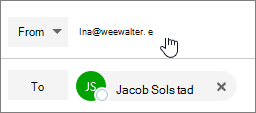

# E-Mail als Verteilerliste sendenSend email as a distribution list

In Microsoft 365 können Sie e-Mail als Verteilerliste senden.In Microsoft 365, you can send email as a distribution list. Wenn eine Person, die Mitglied der Verteilerliste ist, auf eine an die Verteilerliste gesendete Nachricht antwortet, sieht es so aus, als ob die E-Mail von der Verteilerliste und nicht vom einzelnen Benutzer stammt.When a person who is a member of the distribution list replies to a message sent to the distribution list, the email appears to be from the distribution list, not from the individual user. In diesem Thema wird gezeigt, wie das geht.This topic shows you how to do this.
  
## E-Mail als Verteilerliste sendenSend email as a distribution list

Stellen Sie vor dem Ausführen dieser Schritte sicher, dass Sie einer Microsoft 365-Verteilerliste hinzugefügt wurden und Ihnen die Berechtigung "Senden als" erteilt wurde.Before you perform these steps, make sure you've been added to a Microsoft 365 distribution list and you've have been granted Send as permission on it.
  
 **Administratoren**: Stellen Sie sicher, dass Sie die Schritte im Thema [Hinzufügen eines Microsoft 365-Benutzers oder-Kontakts zu einer Liste](../email/add-user-or-contact-to-distribution-list.md) und [zulassen, dass Mitglieder e-Mails als Microsoft 365-Gruppen Themen senden](../create-groups/allow-members-to-send-as-or-send-on-behalf-of-group.md#allow-members-to-send-email-as-a-group) befolgt haben, und die richtigen Personen zur Verteilerliste hinzugefügt haben.**Admins**: Make sure you've followed the steps in the [Add a Microsoft 365 user or contact to a list](../email/add-user-or-contact-to-distribution-list.md) and [Allow members to send email as a Microsoft 365 Group](../create-groups/allow-members-to-send-as-or-send-on-behalf-of-group.md#allow-members-to-send-email-as-a-group) topics, and added the correct people to the distribution list.
  
1. Öffnen Sie Outlook im Web, und wechseln Sie zu Ihrem Posteingang.Open Outlook on the web and go to your inbox. 
    
2. Öffnen Sie eine an die Verteilerliste gesendete Nachricht.Open a message that was sent to the distribution list. 
    
3. Wählen Sie **Antworten**aus.Select **Reply**. 
    
4. Wählen Sie unten in der Nachricht **mehr** \> **anzeigen aus aus**.At the bottom of the message, select **More** \> **Show from**.  
  
5. Klicken Sie mit der rechten Maustaste auf die von-Adresse-wie `Ina@weewalter.me` -und wählen Sie **Entfernen**aus.Right-click on the From address - such as `Ina@weewalter.me` - and choose **Remove**.  
  
6. Geben Sie dann die Verteilerlisten Adresse wie support@contoso.com ein, und senden Sie die Nachricht.Then type the distribution list address such as support@contoso.com, and send the message. Wenn Sie das nächste Mal von der Verteilerliste Antworten, wird Ihre Adresse als Option in der Liste **von** angezeigt.The next time you reply from the distribution list, its address will appear as an option in the **From** list. 
  

