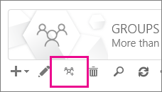

# <a name="upgrade-distribution-lists-to-microsoft-365-groups-in-outlook"></a>Aktualisieren von Verteilerlisten auf Microsoft 365-Gruppen in Outlook

Sie können Verteilerlisten auf Microsoft 365-Gruppen mit Outlook aktualisieren. Dies ist eine hervorragende Möglichkeit, den Verteilerlisten Ihrer Organisation alle Features und Funktionen von Microsoft 365-Gruppen zuzuweisen. [Warum Sie Ihre Verteilerlisten für Gruppen in Outlook aktualisieren sollten](https://support.microsoft.com/en-us/office/why-you-should-upgrade-your-distribution-lists-to-groups-in-outlook-7fb3d880-593b-4909-aafa-950dd50ce188)

Sie können ein Upgrade für eine einzelne Verteilerliste oder für mehrere Verteilerlisten gleichzeitig ausführen.

## <a name="upgrade-one-or-many-distribution-lists-to-microsoft-365-groups-in-outlook"></a>Aktualisieren einer oder mehrerer Verteilerlisten auf Microsoft 365-Gruppen in Outlook

Zum Aktualisieren einer Verteilerliste müssen Sie ein globaler Administrator oder Exchange-Administrator sein. Um ein Upgrade auf Microsoft 365-Gruppen durchführen zu können, muss eine Verteilergruppe über einen Besitzer mit einem Postfach verfügen. 

1. Wechseln Sie zum <a href="https://go.microsoft.com/fwlink/p/?linkid=2059104" target="_blank">Exchange Admin Center</a>.

2. Wechseln Sie im Exchange Admin Center zu **Empfänger** \> **Gruppen**.<br/>Es wird ein Hinweis angezeigt, dass Sie über Verteilerlisten (auch als **Verteilergruppen** bezeichnet) verfügen, die für ein Upgrade auf Microsoft 365-Gruppen geeignet sind.<br/> 

3. Wählen Sie eine oder mehrere Verteilerlisten (auch als **Verteilergruppe** bezeichnet) auf der Seite **Gruppen** aus.<br/>

4. Wählen Sie das Symbol Upgrade aus.<br/>

5. Wählen Sie im Dialogfeldinformationen die Option **Ja** aus, um das Upgrade zu bestätigen. Der Prozess beginnt sofort. Je nach Größe und Anzahl der DLS, die Sie aktualisieren, kann der Vorgang Minuten oder Stunden dauern.<br/>Wenn für die Verteilerliste kein Upgrade ausgeführt werden kann, wird ein Dialogfeld mit einer entsprechenden Meldung angezeigt. Anzeigen [, welche Verteilerlisten nicht aktualisiert werden können?](#which-distribution-lists-cannot-be-upgraded).

6. Wenn Sie mehrere Verteilerlisten aktualisieren, verwenden Sie die Dropdownliste, um zu filtern, welche Verteilerlisten aktualisiert wurden. Wenn die Liste nicht vollständig ist, warten Sie eine Weile länger, und wählen Sie dann **Aktualisieren** aus, um zu sehen, was erfolgreich aktualisiert wurde.<br/>Es wird keine Benachrichtigung ausgegeben, die Sie informiert, wann das Upgrade für alle ausgewählten Verteilerlisten abgeschlossen wurde. Sie können dies jedoch herausfinden, indem Sie die Elemente untersuchen, die unter **Für Upgrade verfügbar** oder **Aktualisierte Verteilerlisten** angezeigt werden.

7. Wenn Sie eine Verteilerliste für das Upgrade ausgewählt haben, diese aber auf der Seite noch als "Für Upgrade verfügbar" angezeigt wird, ist beim Upgrade ein Fehler aufgetreten. Lesen Sie in diesem Fall [Wie gehe ich vor, wenn das Upgrade nicht funktioniert?](#what-to-do-if-the-upgrade-doesnt-work)

> [!NOTE]
> Wenn Sie die Digest-E-Mails der Gruppen erhalten, wird im unteren Bereich ggf. angeboten, ein Upgrade für alle geeigneten Verteilerlisten auszuführen, deren Besitzer Sie sind. Weitere Informationen zu Digest-E-Mails finden Sie unter [Führen einer Gruppenunterhaltung in Outlook](https://support.office.com/article/a0482e24-a769-4e39-a5ba-a7c56e828b22.aspx).


## <a name="what-to-do-if-the-upgrade-doesnt-work"></a>Wie gehe ich vor, wenn das Upgrade nicht funktioniert?

Verteilerlisten, für die beim Upgrade ein Fehler auftritt, bleiben unverändert.

Wenn für mindestens eine **geeignete** Verteilerliste beim Upgrade ein Fehler auftritt, öffnen Sie ein [Supportticket](../contact-support-for-business-products.md). Das Problem muss an das Gruppenentwicklungsteam eskaliert werden, damit dieses das Problem ermitteln kann.

Es ist möglich, dass für die Verteilerliste aufgrund eines Dienstausfalls kein Upgrade ausgeführt wurde. Dies ist aber ziemlich unwahrscheinlich. Wenn Sie möchten, können Sie auch eine Weile warten und dann erneut versuchen, ein Upgrade für die Verteilerliste auszuführen.

## <a name="how-to-use-powershell-to-upgrade-several-distribution-lists-at-the-same-time"></a>Verwenden von PowerShell zum gleichzeitigen Ausführen eines Upgrades mehrerer Verteilerlisten

Wenn Sie im Umgang mit PowerShell erfahren sind, können Sie diese Methode anstelle der Benutzeroberfläche verwenden. Wir verfügen über eine Reihe von Cmdlets, mit denen Sie Verteilerlisten aktualisieren können. Siehe unten.

### <a name="upgrade-a-single-dl"></a>Aktualisieren einer einzelnen DL

Führen Sie den folgenden Befehl aus, um ein Upgrade für eine einzelne DL auszuführen:

`Upgrade-DistributionGroup -DlIdentities \<Dl SMTP address\>`

Wenn Sie beispielsweise ein DLS mit einer SMTP-Adresse DL1@contoso.com aktualisieren möchten, führen Sie den folgenden Befehl aus:

`Upgrade-DistributionGroup -DlIdentities dl1@contoso.com`

> [!NOTE]
> Sie können auch eine einzelne Verteilerliste auf eine Microsoft 365-Gruppe mithilfe des [New-Unifiedgroup PowerShell-](https://go.microsoft.com/fwlink/?LinkID=786379) Cmdlets aktualisieren.

### <a name="upgrade-multiple-dls-in-a-batch"></a>Aktualisieren mehrerer DLS in einem Batch

Sie können auch mehrere DLS als Batch übergeben und diese gemeinsam aktualisieren:

```
Upgrade-DistributionGroup -DlIdentities \<DL SMTP address1\>, \< DL SMTP address2\>,

\< DL SMTP address3\>, \< DL SMTP address 4\>
```

Wenn Sie beispielsweise fünf Verteilerlisten mit SMTP- `dl1@contoso.com` Adressen `dl2@contoso.com` `dl3@contoso.com` `dl4@contoso.com` `dl5@contoso.com`aktualisieren möchten, führen Sie den folgenden Befehl aus:

`Upgrade-DistributionGroup -DlIdentities dl1@contoso.com, dl2@contoso.com, dl3@contoso.com, dl4@contoso.com, dl5@contoso.com`

### <a name="upgrade-all-eligible-dls"></a>Aktualisieren aller berechtigten DLS

Es gibt zwei Möglichkeiten, ein Upgrade aller berechtigten Verteilerlisten durchführen zu können.

> [!NOTE]
> Das Cmdlet "Upgrade-DistributionGroup" empfängt keine Daten aus der Pipeline, daher ist es erforderlich, dass der "ForEach-{}Object"-Operator zum erfolgreichen ausführen verwendet wird.

1. Rufen Sie die berechtigten DLS im Mandanten ab, und aktualisieren Sie Sie mithilfe des Befehls Upgrade:

```
Get-EligibleDistributionGroupForMigration | Foreach-Object{
    Upgrade-DistributionGroup -DlIdentities $_.PrimarySMTPAddress
}
```

2. Rufen Sie die Liste aller DLS ab, und aktualisieren Sie nur die berechtigten DLS:

```
Get-DistributionGroup| Foreach-Object{
    Upgrade-DistributionGroup -DlIdentities $_.PrimarySMTPAddress
}
```

## <a name="faq-about-upgrading-distribution-lists-to-microsoft-365-groups-in-outlook"></a>Häufig gestellte Fragen zum Aktualisieren von Verteilerlisten auf Microsoft 365-Gruppen in Outlook

### <a name="which-distribution-lists-cannot-be-upgraded"></a>Welche Verteilerlisten können nicht aktualisiert werden?

Sie können nur für in der Cloud verwaltete, einfache, nicht geschachtelte Verteilerlisten ein Upgrade ausführen. In der folgenden Tabelle werden Verteilerlisten aufgelistet, die nicht aktualisiert werden **können** .

|**Eigenschaft**|**Geeignet?**|
|:-----|:-----|
|Lokal verwaltete Verteilerliste.  <br/> |Nein  <br/> |
|Geschachtelte Verteilerliste. Die Verteilerliste hat untergeordnete Gruppen oder ist Mitglied einer anderen Gruppe.  <br/> |Nein  <br/> |
|Verteilerlisten mit anderen Mitglied **RecipientTypeDetails** als **User Mailbox**, **SharedMailbox**, **TeamMailbox**, **MailUser**  <br/> |Nein  <br/> |
|Verteilerliste mit mehr als 100 Besitzern  <br/> |Nein  <br/> |
|Verteilerliste, die nur Mitglieder aber keinen Besitzer enthält  <br/> |Nein  <br/> |
|Verteilerliste, die einen Alias mit Sonderzeichen enthält  <br/> |Nein  <br/> |
|Die Verteilerliste ist als Weiterleitungsadresse für das freigegebene Postfach konfiguriert  <br/> |Nein  <br/> |
|Wenn die Verteilerliste Teil der **Absender Einschränkung** in einer anderen Verteilerliste ist.  <br/> |Nein  <br/> |
|Sicherheitsgruppen  <br/> |Nein  <br/> |
|Dynamische Verteilerlisten  <br/> |Nein  <br/> |
|Verteilerlisten, die in **RoomLists** konvertiert wurden  <br/> |Nein  <br/> |
|Verteilerlisten, in denen **MemberJoinRestriction** und/oder **MemberDepartRestriction** **geschlossen** wird  <br/> |Nein  <br/> |

### <a name="how-do-i-check-which-dls-are-eligible-for-upgrade"></a>Wie kann ich überprüfen, welche DLS für ein Upgrade berechtigt sind?

Wenn Sie überprüfen möchten, ob eine DL berechtigt ist, können Sie den folgenden Befehl ausführen:

`Get-DistributionGroup \<DL SMTP address\> | Get-EligibleDistributionGroupForMigration`

Wenn Sie überprüfen möchten, welche DLS für ein Upgrade geeignet sind, führen Sie einfach den folgenden Befehl aus:

`Get-EligibleDistributionGroupForMigration`

### <a name="who-can-run-the-upgrade-scripts"></a>Wer kann die Upgradeskripts ausführen?

Personen mit globaler Administratorrechte oder Exchange-Administratorrechten.

### <a name="why-is-the-contact-card-still-showing-a-distribution-list-what-should-i-do-to-prevent-a-upgraded-distribution-list-from-showing-up-in-my-auto-suggest-list"></a>Warum wird auf der Visitenkarte weiterhin eine Verteilerliste angezeigt? Wie kann ich vorgehen, um zu verhindern, dass eine Verteilerliste, für die ein Upgrade ausgeführt wurde, in meiner Vorschlagssuche angezeigt wird?

- Für Outlook: Wenn jemand versucht, eine e-Mail in Outlook zu senden, indem er den Microsoft 365-Gruppennamen nach der Migration eingibt, wird der Empfänger als Verteilerliste anstelle der Gruppe aufgelöst. Die Visitenkarte des Empfängers entspricht der Visitenkarte der Verteilerliste. Der Grund hierfür liegt im Empfängercache oder "Spitznamen"-Cache von Outlook. Die e-Mail wird erfolgreich an die Gruppe gesendet, kann jedoch zu Verwechslungen mit dem Absender führen.<br/>Sie können die Schritte im Thema [Informationen zur AutoVervollständigen-Liste von Outlook](https://go.microsoft.com/fwlink/?LinkID=798736) ausführen, um den Cache zurückzusetzen und das Problem zu beheben.

- Für Outlook im Internet: im Fall von Outlook im Internet verbleiben die Empfänger der Verteilerliste weiterhin im Cache. Sie können die Schritte unter [Entfernen des vorgeschlagenen namens oder der e-Mail-Adresse aus der Auto Vervollständigen-Liste](https://support.office.com/article/9E1419D9-E88F-445B-B07F-F558B8A37C58.aspx) ausführen, um den Cache zu aktualisieren, um die Gruppen Visitenkarte anzuzeigen.

### <a name="do-new-group-members-get-a-welcome-email-in-their-inbox"></a>Erhalten neue Gruppenmitglieder in ihrem Posteingang eine Willkommensnachricht?

Nein. Die Einstellung zum Aktivieren von Willkommensnachrichten ist standardmäßig auf FALSE festgelegt. Diese Einstellung wirkt sich auf vorhandene und neue Gruppenmitglieder aus, die beitreten können, nachdem die Migration abgeschlossen wurde. Wenn der Besitzer der Gruppe später Gastbenutzer zulässt, empfangen Gastbenutzer keine Willkommensnachricht in ihrem Posteingang. Gastmitglieder können weiterhin mit der Gruppe zusammenarbeiten.

### <a name="what-if-one-or-some-of-the-dls-are-not-upgraded"></a>Was geschieht, wenn ein oder einige der DLS nicht aktualisiert werden?

Es gibt einige Fälle, in denen zwar DL berechtigt ist, aber nicht aktualisiert werden konnte. Die Verteilerliste wird nicht aktualisiert und bleibt als DL erhalten.

- Wo Administratoren eine **Gruppen-e-Mail-Adress Richtlinie** für die Gruppen in einer Organisation angewendet haben und versuchen, die Verteilerlisten zu aktualisieren, die die Kriterien nicht erfüllen, wird die Verteilerliste nicht aktualisiert.

- Verteilerlisten mit **MemberJoinRestriction** oder **MemberDepartRestriction** , die auf **geschlossen**festgelegt wurden, konnten nicht aktualisiert werden.

### <a name="what-happens-to-the-dl-if-the-upgrade-from-eac-fails"></a>Was geschieht mit der Verteilerliste, wenn beim Upgrade aus EAC ein Fehler auftritt?

Das Upgrade erfolgt nur, wenn der Aufruf an den Server übermittelt wird. Wenn beim Upgrade ein Fehler auftritt, bleiben Ihre Verteilerlisten erhalten. Sie funktionieren wie bisher.


